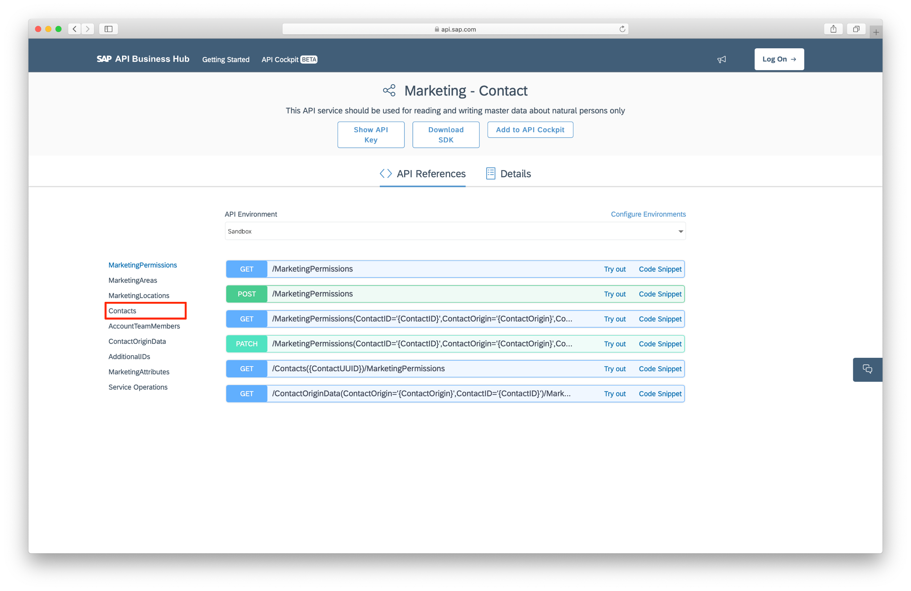
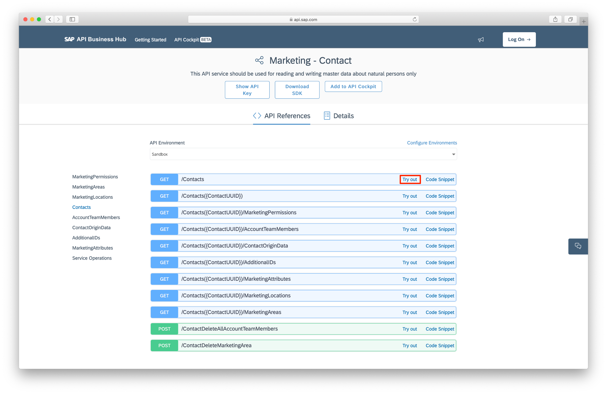
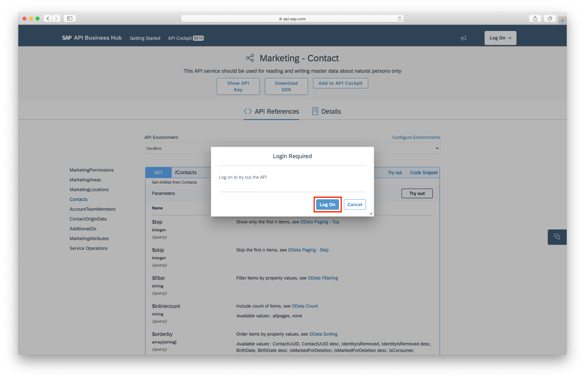
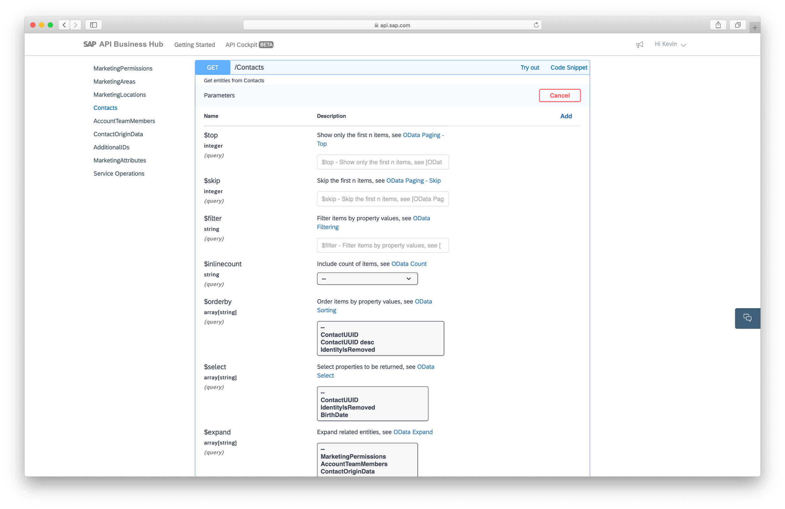
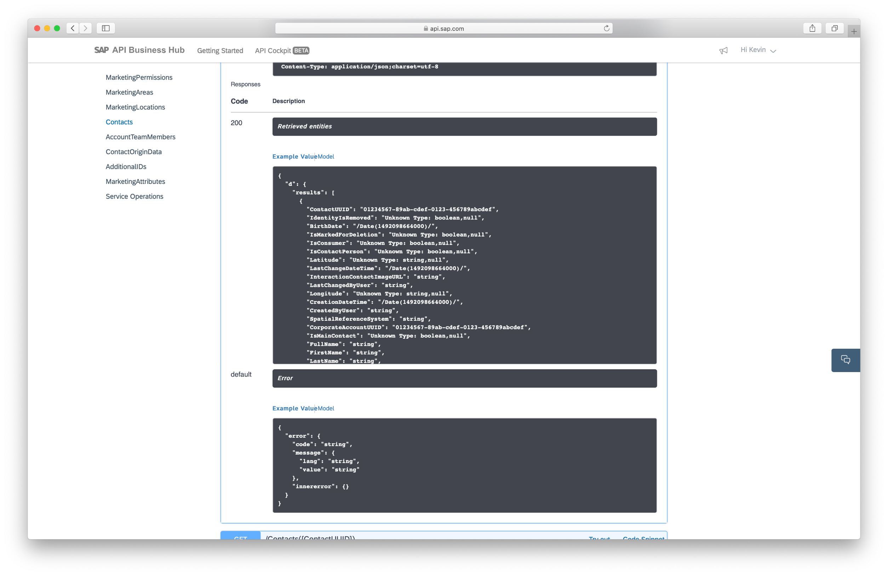
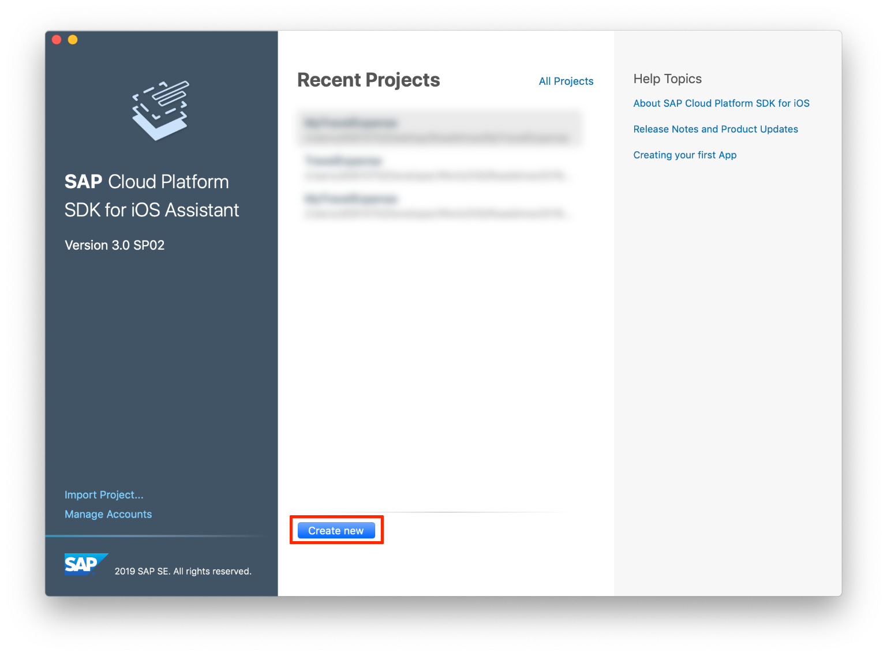
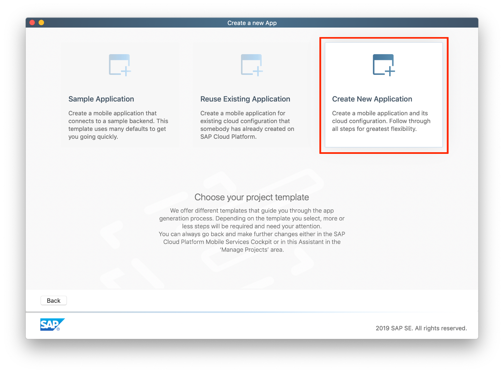
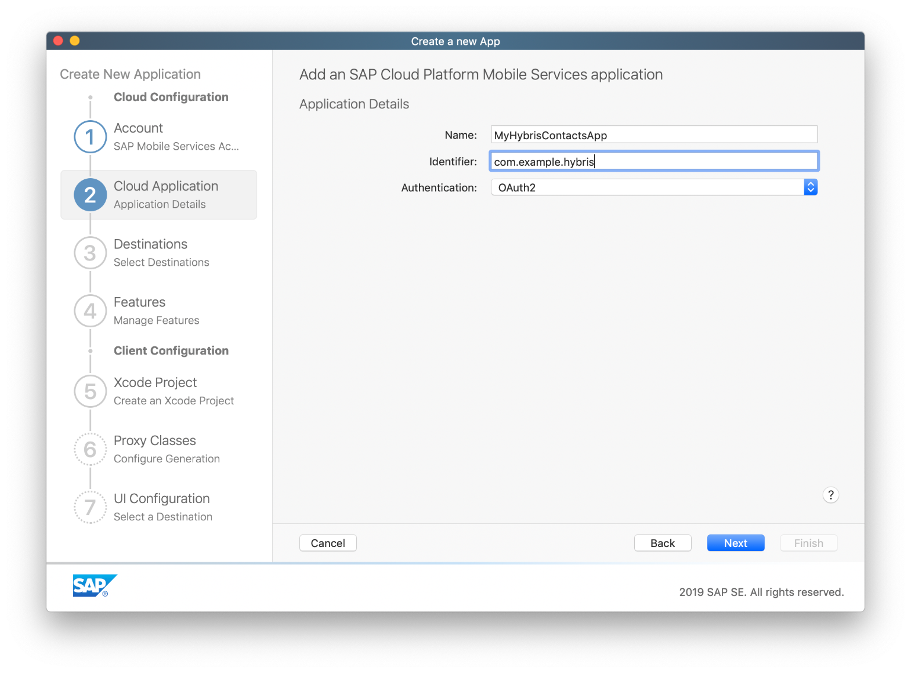

## Prerequisites  
- **Development environment:** Apple Mac running macOS High Sierra or higher with Xcode 10 or higher 
- **SAP Cloud Platform SDK for iOS:** Version 3.0 SP01
- [Get a Free Trial Account on SAP Cloud Platform](https://developers.sap.com/tutorials/hcp-create-trial-account.html)
- [Set Up the SAP Cloud Platform SDK for iOS](https://developers.sap.com/group.ios-sdk-setup.html)

## Details

The **SAP API Business Hub** contains a catalog of API's and Business Services for SAP S/4HANA Cloud, SAP Leonardo, SuccessFactors, Hybris, Concur, and many more.

For developers, this is a tremendous help when developing applications which need to interact with one or more of these products. Behind all of these API's, is a sandbox environment available, all populated with data. During development, you don't need to interact with a live system, you just connect to the sandbox API endpoint. Once you go live, all you need to do is change the sandbox API endpoint to the productive API endpoint, and off you go.

The **iOS Assistant** of the **SAP Cloud Platform SDK for iOS** is a great tool when creating an application based on an API out of the SAP API Business Hub. With it's step-by-step creation approach, it helps you select the correct API endpoint, abstracts the authentication to the API Hub and generates the Xcode project containing all the proxy classes to interact with the selected API Hub OData service.

In this tutorial, you will create an application using an **SAP Hybris Marketing Cloud** API endpoint, you will expose the **Corporate Accounts** in SAP Hybris Marketing Cloud, and display them with an SAP Fiori control which allows you to call, message or email these contacts.

### You will learn

- How to create an app with the SAP Cloud Platform SDK for iOS and the SAP API Business Hub.
- How you can leverage the SAP Cloud Platform SDK for iOS Assistant to connect to an SAP API Business Hub API

---

[ACCORDION-BEGIN [Step 1: ](Examine the SAP Hybris Marketing Cloud API)]

In order to get an understanding of the API we're going to use the SAP API Business webpage. Please go to [SAP API Business Hub](https://api.sap.com) and use the search field to search for **SAP Hybris Marketing Cloud**. Please make sure **API** is selected in the **Refined by** section.


Go ahead and select the **Marketing - Contact** API collection to navigate to the details.



By default the first API is selected, the Contacts API is the one we need. Please select **Contacts** on the left-hand side.



You will see the overview of all possible calls for the Contacts API. Please click on **Try out** link for the `/Contacts`. The webpage will ask you to login to your SAP Cloud Platform account. If you don't have one please register for an account, you can use your trial account.



After you successfully logged into the SAP API Business Hub you can try out the API by filling out the different parameters.



For now to see the standard response, please scroll down.


Here you can see how a **200** response could look like. With that you can go ahead and explore the API as you wish.



[DONE]
[ACCORDION-END]

[ACCORDION-BEGIN [Step 2: ](Generate an iOS app connecting to SAP Hybris Marketing Cloud)]

Now we'll use the SAP Cloud Platform SDK for iOS Assistant to connect to the SAP Hybris Marketing Cloud over SAP API Business Hub and generate an app.
Please open up your iOS Assistant and click on **Create new**.



Now we want to create a complete new application so click on **Create New Application**.



Next we want to define the Mobile Services Cloud Application. Please enter the following values:

Property             |  Value
:-------------------------:|:-------------------------:
Name  | `MyHybrisContactsApp`
Identifier | `com.example.hybris`
Authentication | `OAuth2`

Click on **Next**.



Now we want to utilize the SAP API Business Hub, for that please click on **Add new from API Management** to go to the catalog.


Click on **Next**.


Now we have a big list with all the available **API Products**. Look for the **SAP Marketing Cloud**, select it and click on **Next**.


This screen shows a list with all the available APIs in the **SAP Marketing Cloud**. Please look for the **Marketing - Contact** API, select it and click on **Next**.


Now we could choose different details to the API configuration. You could switch between **Sandbox and **Production** here as well. We will let everything as is and click on **Next**.


We chose the correct API and selected our API details, now define the destination details so the iOS Assistant can create all the necessary configurations on the Mobile Services.

Please provide the following values:

Property             |  Value
:-------------------------:|:-------------------------:
Name  | `MarketingContactHybris`

Click on **Next**.


The destination is now created. This will be used to route the app's requests to the correct backend. Make sure the destination is selected and click on **Next**.


> In case you see an error message like the one below , this probably means you've reached your application limit of 5 on SAP Cloud Platform Mobile Services. Please login to your account and delete an application.


Now click through the rest of the steps to generate the app. You can leave everything as is. Xcode should start up with the generated app, please build and run the app in simulator. After the Onboarding process you should see the first screen of the generated app.


If you now tap on **Contacts** you should see all available contacts.


[DONE]
[ACCORDION-END]

[ACCORDION-BEGIN [Step 3: ](Implement the contact data in a FUIContactCell)]

The list of the contacts is using an `FUIObjectTableViewCell` right now, we want to change that to a `FUIContactCell`. To get the correct code for that you can use the SAP Fiori Mentor iPad App to browse for the `FUIContactCell`. Also you can share the sample code to your machine and use the code in Xcode.

> No worries, if you don't have an iPad I will have the code snippets in this tutorial as well.

Open up the SAP Fiori Mentor app on your iPad and tap on **UI Controls**.


Now use the search field to search for **Contact**. Select the **Contact Cell**.


Now you could configure the contact cell as you wish but we will use the standard implementation. Tap on **Export** in the top right corner.


Now you can see the exact code to build the cell you saw in the preview. Tap on the Share button in the top right corner.

Select AirDrop or any other variable display to share the code to your machine. You can also use universal keyboard if your MacBook and iPad is setup with the same iCloud account.


After you shared the code to your machine we can go into Xcode and implement the cell. Please open the `ContactMasterViewController`.

> **Hint:** You can use the `Open Quickly` feature of Xcode to search for the `ContactMasterViewController` class with `Command + Shift + O`.


Now add the following lines of code below the rest of the properties in your class:

```swift
let activities = [FUIActivityItem.message, FUIActivityItem.phone,
                      FUIActivityItem.email
    ]

```

This code will make sure we have the Message, Phone and Email contact possibilities available in the `FUIContactCell`.

Now register the `FUIContactCell` at the Table View. Please add the following line of code to the `viewDidLoad(:)` method:

```swift
    tableView.register(FUIContactCell.self, forCellReuseIdentifier: FUIContactCell.reuseIdentifier)

```

Locate the `override func tableView(_ : UITableView, indexPath: IndexPath) -> UITableViewCell` method and replace the existing code inside of the method with the following:

```swift
let contactCell = tableView.dequeueReusableCell(withIdentifier: FUIContactCell.reuseIdentifier, for: indexPath)
                  as! FUIContactCell

contactCell.detailImage = UIImage() // TODO: Replace with your Image
contactCell.headlineText = "Michael Krenkler"
contactCell.subheadlineText = "Team Lead"
contactCell.descriptionText = "Tiffany Road\nAntioch, Illinois, 60002\n+1 224 9211250"
contactCell.splitPercent = CGFloat(0.3)
contactCell.activityControl.addActivities(activities)
contactCell.activityControl.maxVisibleItems = 3
contactCell.onActivitySelectedHandler = { activityItem in
    #warning("Proccess selected activity")
}

return contactCell

```

The code will make sure the correct cell gets dequeued, also it get's filled with sample data.

Please run the app now and navigate to the **Contacts**. You should see the `FUIContactCell` instead of the `FUIObjectTableViewCell`.


[DONE]
[ACCORDION-END]

[ACCORDION-BEGIN [Step 4: ](Populate the FUIContactCells with data)]

We're lucky, the generated app already has everything ready for us to access the contact entity data.
The following code loads the data from the backend:

```swift
private func loadData(completionHandler: @escaping () -> Void) {
        self.requestEntities { error in
            defer {
                completionHandler()
            }
            if let error = error {
                AlertHelper.displayAlert(with: NSLocalizedString("keyErrorLoadingData", value: "Loading data failed!", comment: "XTIT: Title of loading data error pop up."), error: error, viewController: self)
                self.logger.error("Could not update table. Error: \(error)", error: error)
                return
            }
            DispatchQueue.main.async {
                self.tableView.reloadData()
                self.logger.info("Table updated successfully!")
            }
        }
    }

```

The code uses the generated data service to make a connection to the backend. The method displays an alert in case there was an error while fetching the entities. In case of a successful fetch the method will call it's completion handler and the data gets set in a property through the call of `requestEntities(completionHandler: @escaping (Error?) -> Void)`.

The last step is to change the `override func tableView(_ : UITableView, indexPath: IndexPath) -> UITableViewCell` to populate the cell with real data. Please locate the method and replace the code with the following:

```swift
let contactCell = tableView.dequeueReusableCell(withIdentifier: FUIContactCell.reuseIdentifier, for: indexPath)
            as! FUIContactCell

        let entity = entities[indexPath.row]

        contactCell.headlineText = entity.fullName ?? ""
        contactCell.subheadlineText = entity.contactFunctionName ?? ""
        contactCell.descriptionText = entity.cityName ?? ""
        contactCell.splitPercent = CGFloat(0.3)
        contactCell.activityControl.addActivities(activities)
        contactCell.activityControl.maxVisibleItems = 3
        contactCell.onActivitySelectedHandler = { activityItem in
            switch activityItem {
            case FUIActivityItem.message:
                AlertHelper.displayAlert(with: "Message tapped", error: nil, viewController: self)
                break
            case FUIActivityItem.email:
                AlertHelper.displayAlert(with: "Email tapped", error: nil, viewController: self)
                break
            case FUIActivityItem.phone:
                AlertHelper.displayAlert(with: "Phone tapped", error: nil, viewController: self)
                break
            default:
                self.logger.info("In Default")
            }
        }

        return contactCell

```
Now you will see real data from the backend and every time you tap on one of the icons a alert will show up telling you which activity you've tapped.


[DONE]
[ACCORDION-END]

[ACCORDION-BEGIN [Step 5: ](Summary)]

You can see that the connection to an OData specification conform API out of the SAP API Business Hub is simple with the help of the iOS Assistant. In case you want to make a connection without to the iOS Assistant you can easily write the connection code yourself using the SDK. The website of the SAP API Business Hub also makes it understandable on how to use all the different APIs.

[VALIDATE_5]
[ACCORDION-END]

---
