## Prerequisites  
- **Proficiency:** Intermediate
- **Device:** A physical iOS device (required to use the Camera)
- **Tutorials:** [Sign up for a free trial account on SAP Cloud Platform](https://www.sap.com/developer/tutorials/hcp-create-trial-account.html) and [Enable SAP Cloud Platform mobile service for development and operations](https://www.sap.com/developer/tutorials/fiori-ios-hcpms-setup.html)

## Next Steps
 - [View all How-Tos](http://www.sap.com/developer/tutorial-navigator.how-to.html)


## How-To Details
In this How-To tutorial, you will test **SAP Leonardo's Machine Learning** capabilities exposed through **SAP API Hub** and implement these in a native iOS application build with the **SAP Cloud Platform SDK for iOS**. After you have finished the tutorial, you will have an app which allows you to take a picture with the camera, or choose an image from the Photos Library. This image will be sent to SAP Leonardo's "Image Classification" Machine Learning API which is available for testing on SAP API Hub. The response will be a list of classifications for the submitted image, which you could use for further processing.

### Time to Complete
**45 Min**.

---

[ACCORDION-BEGIN [Step 1: ](Create Xcode application)]

Open Xcode and create a new project. Select **Single View Application** from the dialog and click **Next**.

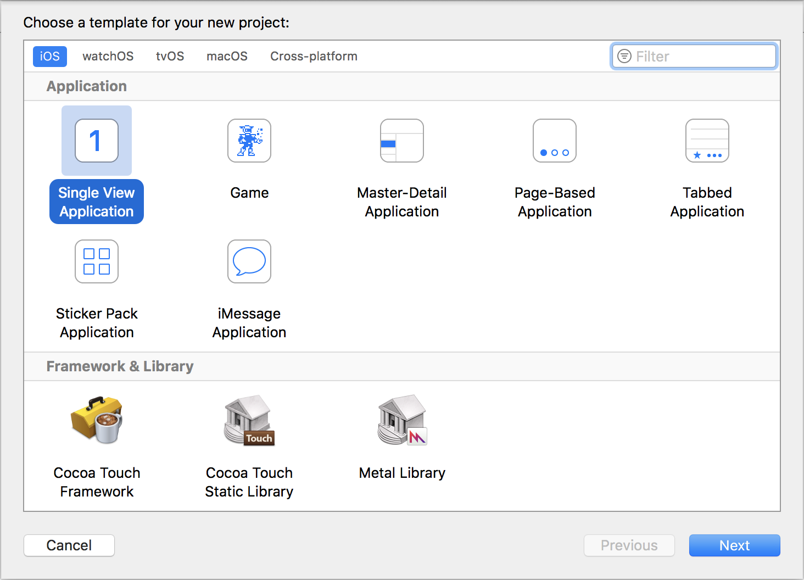

In the next screen, enter the following properties:

| Field | Value |
|----|----|
| Product Name | `Demo` |
| Team | `<Select your team>` |
| Organization Name | <Your organization> |
| Organization Identifier | `com.sap.tutorials.demoapps` |

Click **Next** to continue.

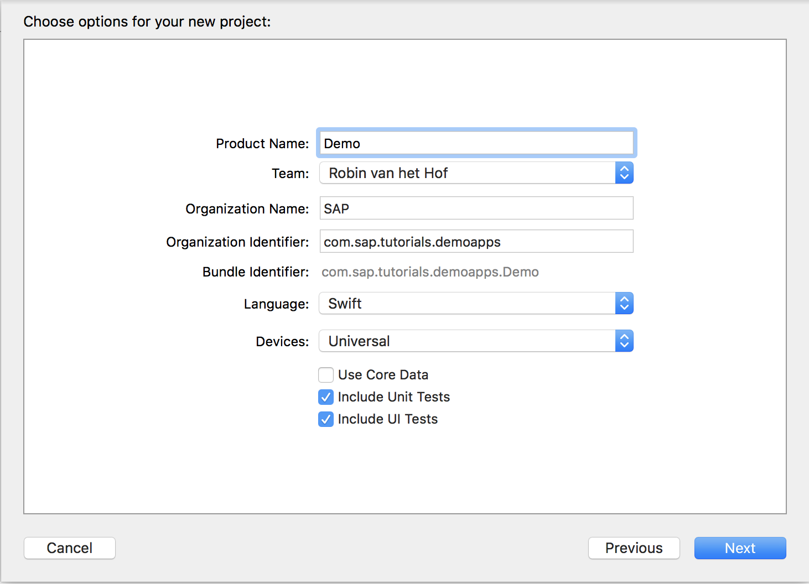

Specify a location to store your project and click **Finish**.

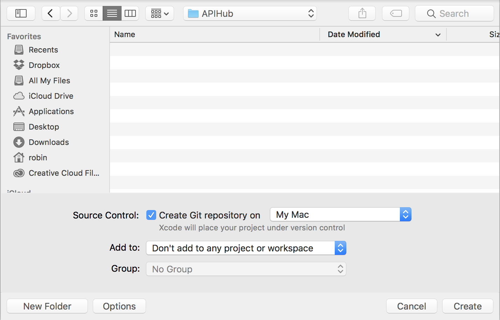

Your project is now generated.


[ACCORDION-END]

[ACCORDION-BEGIN [Step 2: ](Add SAP Cloud Platform SDK for iOS framework files)]

In order to utilize the SAP Cloud Platform SDK for iOS capabilities, you need to include these to your Xcode project.

Using **Finder**, navigate to the location of the SDK's framework files at `./<SDK Location>/Frameworks/Release-fat`.

Select the following framework files:

- `SAPCommon.framework`
- `SAPFiori.framework`
- `SAPFoundation.framework`

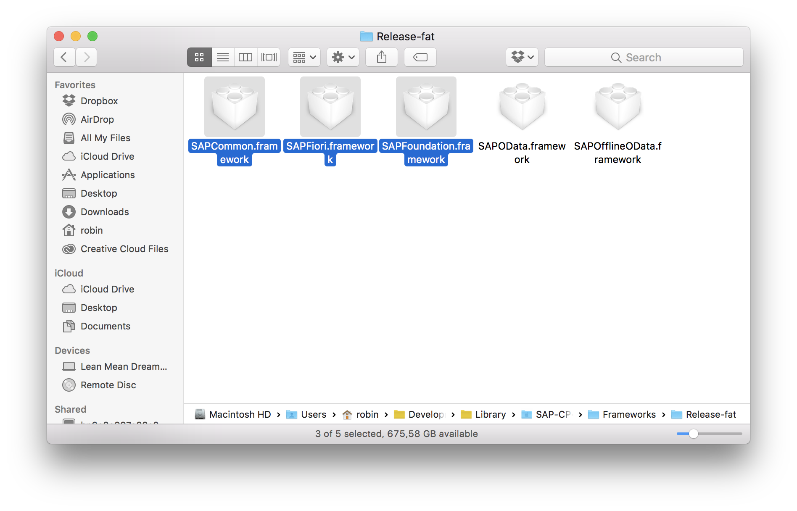

In Xcode, select the `Demo` project file at the root of the **Project navigator** and select the **General** tab. Scroll down to the **Embedded Binaries** panel.

Drag the 3 selected SDK framework files onto the **Embedded Binaries** panel.

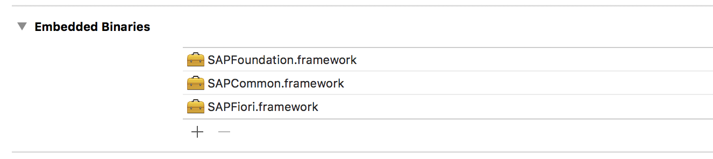

The relevant SAP Cloud Platform SDK for iOS framework files are now included in the project.


[ACCORDION-END]


[ACCORDION-BEGIN [Step 3: ](Add Table View Controller)]

Open `Main.storyboard`. Remove the existing **View Controller** entirely, and replace it with a **Navigation Controller** by dragging it from the **Object library** in the lower-right corner onto the Storyboard.

With the **Navigation Controller** selected, set the following attributes in the **Attributes inspector**:

| Attribute | Value |
|----|----|
| Shows Toolbar | `checked` |
| Is Initial View Controller | `checked` |

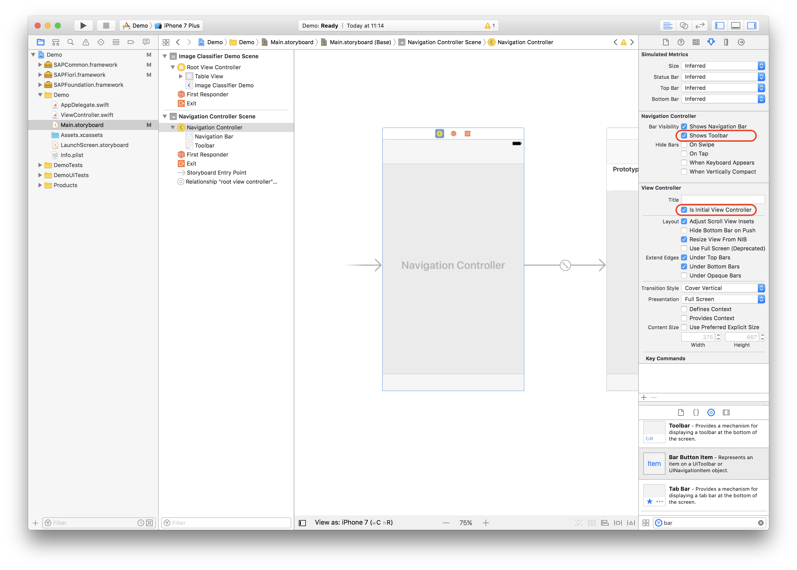

This ensures the view will be shown when the app is loaded, and a bottom toolbar is visible.

Select **Navigation Item** in the **Table View Controller** and set the title to `Image Classifier Demo`:

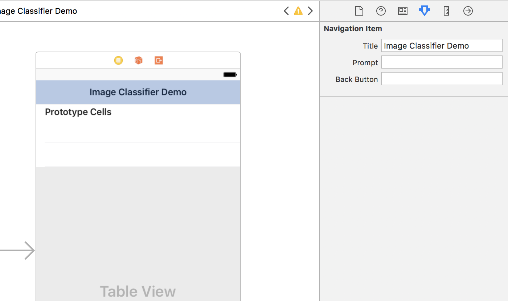

From the **Object library**, drag a **Bar Button Item** onto the toolbar and set the name to `Library`.

Next, drag a **Flexible Space Bar Button Item** next to the **Bar Button Item**.

Finally, drag another **Bar Button Item** onto the toolbar to the right of the **Flexible Space Bar Button Item** and set the name to `Camera`.

The **Table View Controller** and its toolbar should now look like this:

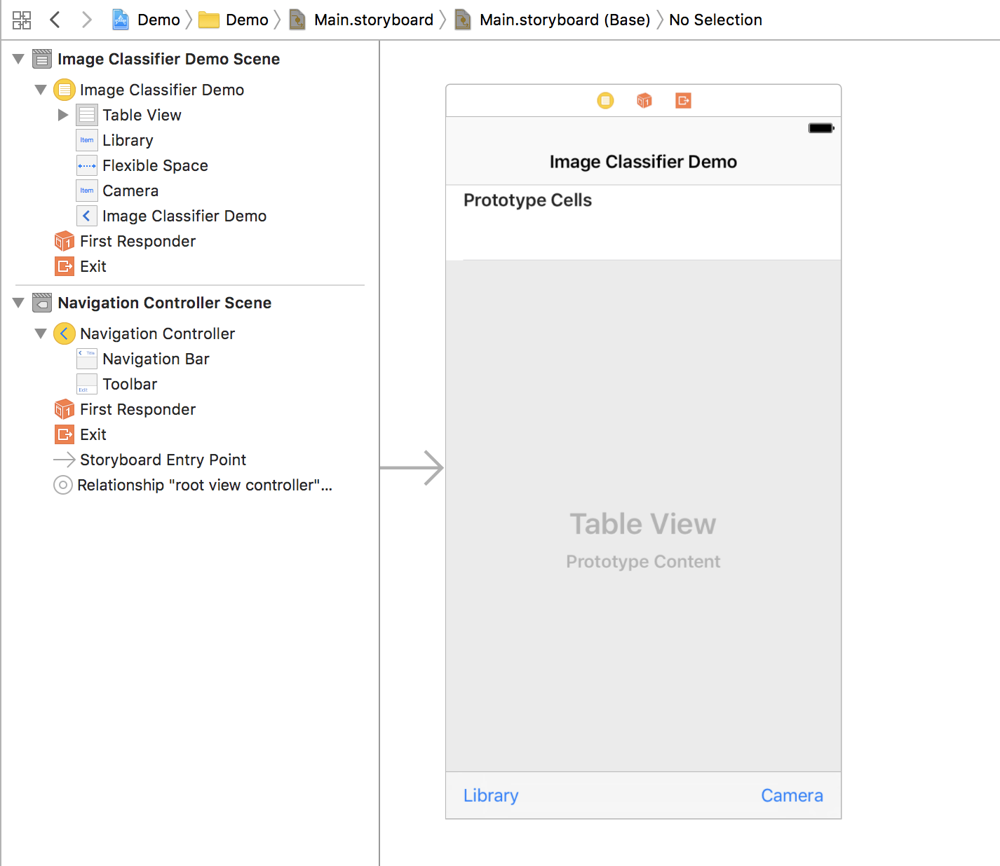


[ACCORDION-END]

[ACCORDION-BEGIN [Step 4: ](Create Table View Controller custom class)]

Right-click the **Demo** folder inside your Xcode project, and from the context menu, select **New File...**:

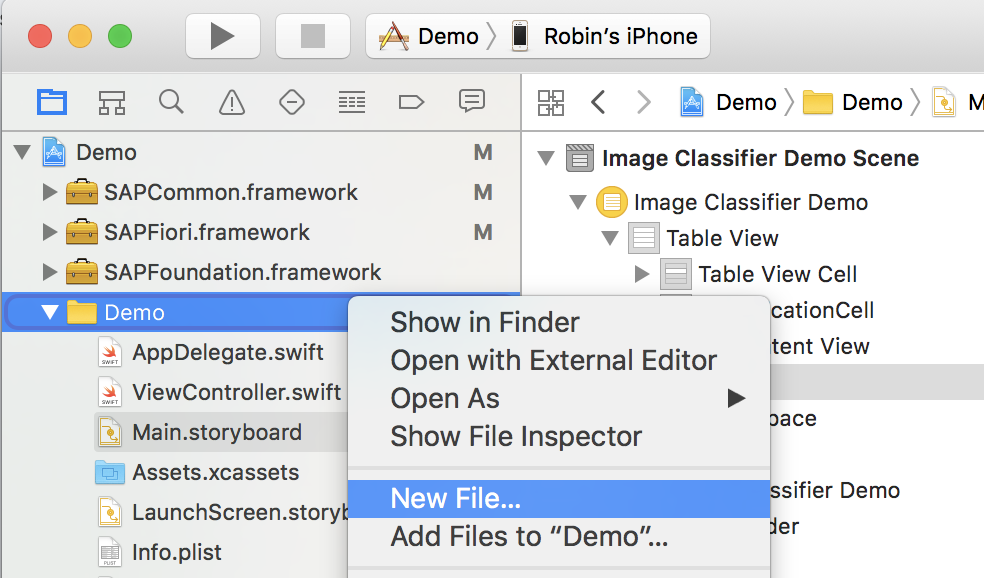

From the dialog, select **Cocoa Touch Class** and click **Next**.

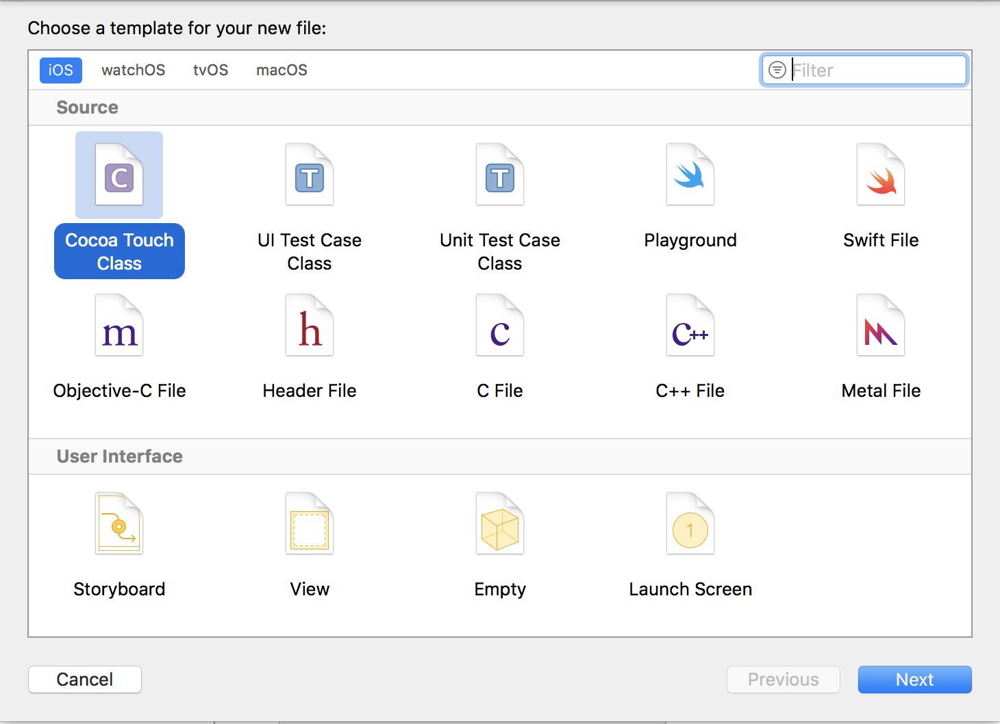

In the next screen, set the following properties:

| Attribute | Value |
|----|----|
| Class | `ImageClassifierTVC` |
| Subclass of | `UITableViewController` |

Click **Next** when done.

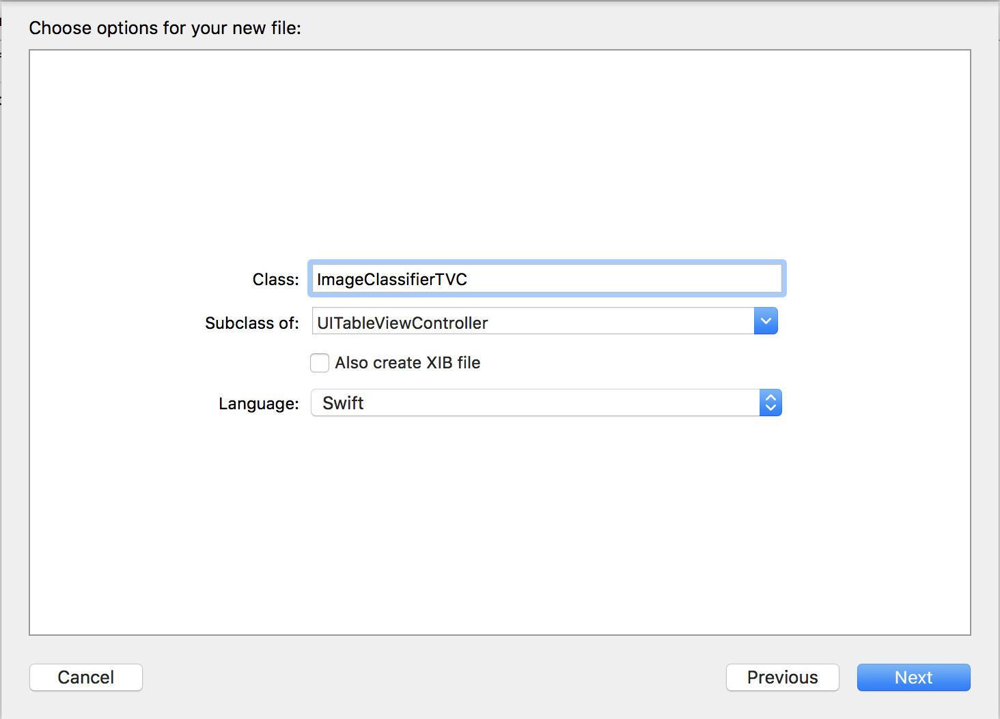

Review the location the class will be stored, and click **Create**.

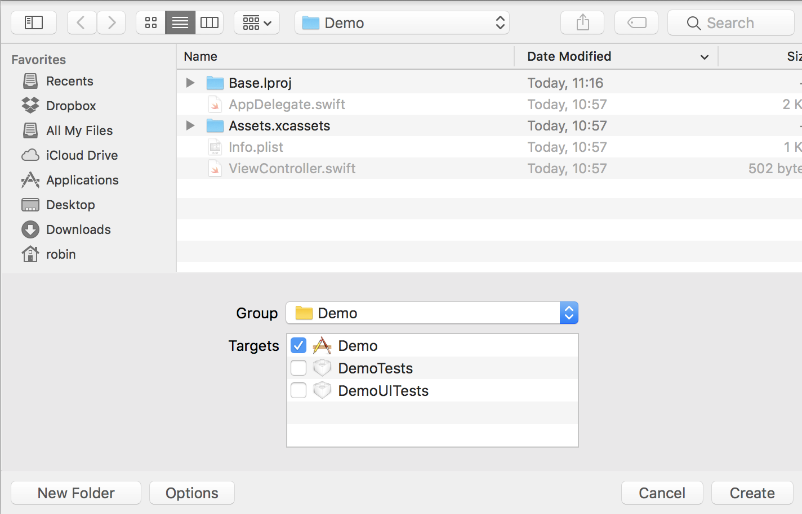


[ACCORDION-END]

[ACCORDION-BEGIN [Step 5: ](Link Table View Controller to custom class)]

In the Storyboard, select the **Table View Controller**. In the **Identity inspector**, change the **Class** to the custom class you created in the previous step:


[ACCORDION-END]

[ACCORDION-BEGIN [Step 6: ](Create toolbar button actions)]

With the **Table View Controller** still selected, click on the **Show Assistant editor** button. The `ImageClassifierTVC` file is opened next to the Storyboard.

Replace the existing import statement with the following import statements:

```swift
import Photos
import Foundation
import SAPFoundation
import SAPCommon
import SAPFiori
```

In the Storyboard, Ctrl-click the **Library** button, and drag it just above the first function `viewDidLoad()`. In the dialog, set the following properties:

| Attribute | Value |
|----|----|
| Connection | `Action` |
| Name | `photoFromLibrary` |

Click **Connect** when done.

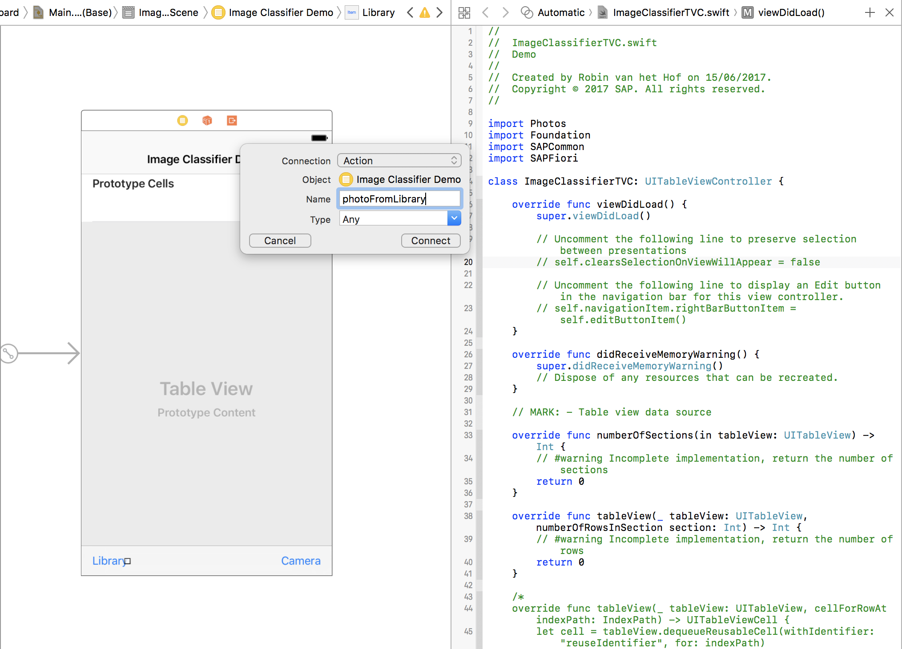

Next, Ctrl-click the **Camera** button, and drag it just below the action handler you just created. In the dialog, set the following properties:

| Attribute | Value |
|----|----|
| Connection | `Action` |
| Name | `photoFromCamera` |

Click **Connect** when done.

The first part of the custom class should now look like this:

```swift
import Photos
import Foundation
import SAPFoundation
import SAPCommon
import SAPFiori

class ImageClassifierTVC: UITableViewController {

    @IBAction func photoFromLibrary(_ sender: Any) {
    }

    @IBAction func photoFromCamera(_ sender: Any) {
    }

    override func viewDidLoad() {
        super.viewDidLoad()
        //etc

```


[ACCORDION-END]

[ACCORDION-BEGIN [Step 7: ](Allow Camera and Photos Library usage)]

In order for the app to use the Camera and the Photos Library, it needs to ask permission first.

Open the `info.plist` file, and click the **Plus** sign next to **Information Property List**. From the drop-down, select **Privacy - Photo Library Usage Description**.

Set the value to `$(PRODUCT_NAME) needs to use your Photos Library`.

Again, click the **Plus** sign next to **Information Property List**. From the drop-down, select **Privacy - Camera Usage Description**.

Set the value to `$(PRODUCT_NAME) needs to use your Camera`.

Your `info.plist` file should now look like this:

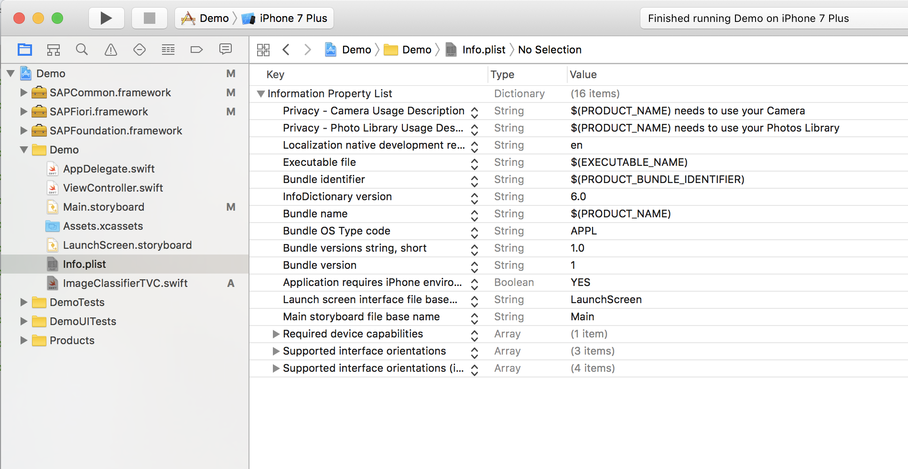


[ACCORDION-END]

[ACCORDION-BEGIN [Step 8: ](Explore the SAP API Hub)]

Open a browser to [https://api.sap.com](https://api.sap.com)

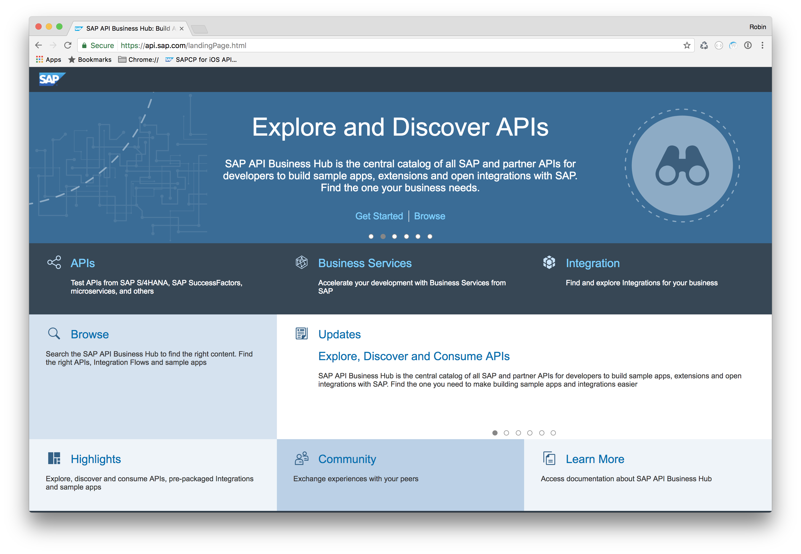

Click on the tile **APIs**. A page with featured and latest APIs are displayed.

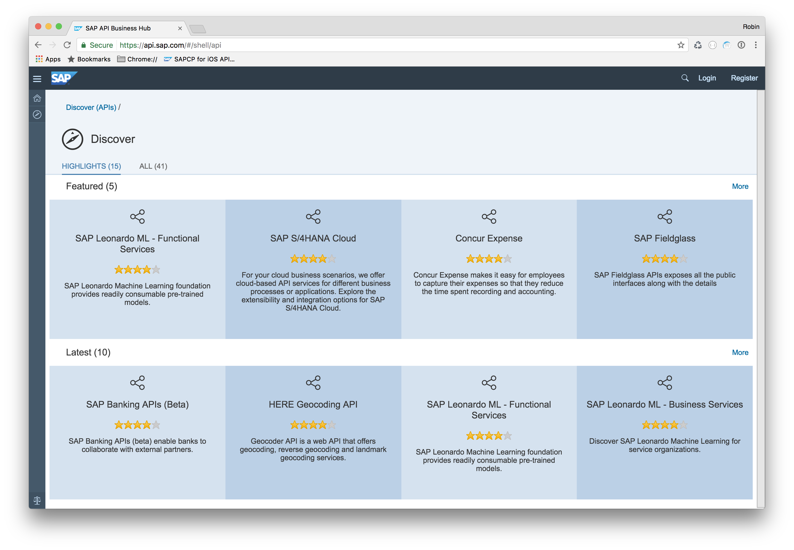

Click on the tile **SAP Leonardo ML - Functional Services**. Switch to the tab **Artifacts**. Here you see a list of all the functional SAP Leonardo Machine Learning APIs. For this tutorial, you are going to use the **Image Classification API**.

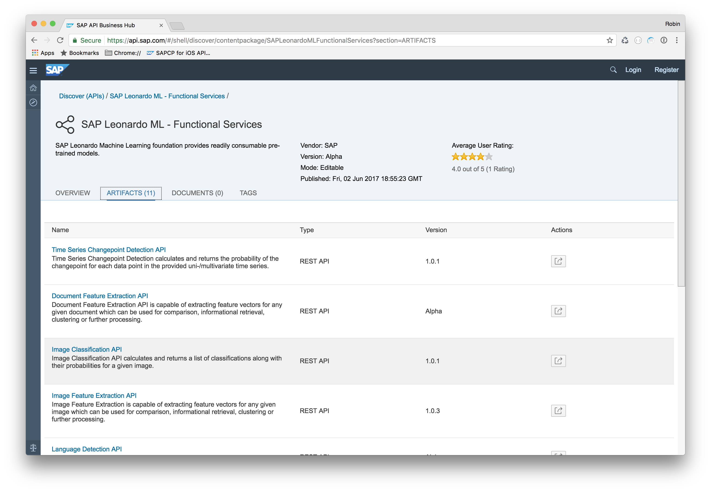

If you click the **Image Classification API** link, you navigate to a page displaying the available REST APIs. If you expand the `/inference_sync` service, you see extensive documentation how the request should look, the possible responses, and you can even test the service from within the API Hub.


To the right of the service, there's a **Generate Code** link. Click on that link, and switch to the **Swift** tab. Here you see boilerplate code which you can use in your own application.

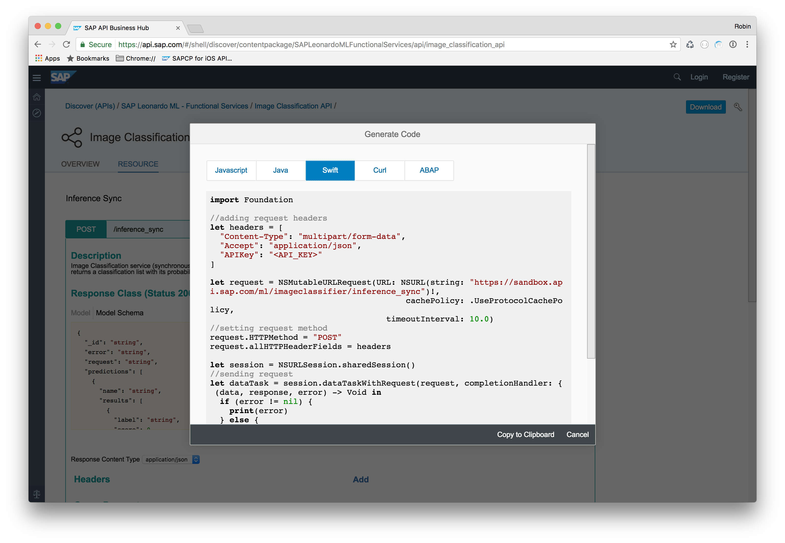

> The generated boilerplate code uses generic Swift code, and not SAP Cloud Platform SDK for iOS optimized code. Although the generated code is fairly simple to use as-is in Swift 2.0 projects, this tutorial uses the SAP Cloud Platform SDK for iOS built on Swift 3.1 and as such the generated code needs to be changed significantly in your project.

.

If you test the service, you will receive a response like the following:

```json
{
  "_id": "9e674a12-07a9-4535-9a33-ba0f77a4547e",
  "predictions": [
    {
      "name": "ocean-cliff-5862429.jpg",
      "results": [
        {
          "label": "cliff",
          "score": 0.68992
        },
        {
          "label": "promontory",
          "score": 0.280181
        },
        {
          "label": "seashore",
          "score": 0.020914
        },
        {
          "label": "breakwater",
          "score": 0.003855
        },
        {
          "label": "dam",
          "score": 0.00275
        }
      ]
    }
  ],
  "processed_time": "Fri, 26 May 2017 13:53:22 GMT",
  "request": {
    "files": [
      "ocean-cliff-5862429.jpg"
    ],
    "options": {},
    "tenantName": "imgclassif-tech-user",
    "texts": []
  },
  "status": "DONE",
  "tenantName": "imgclassif-tech-user"
}
```

In your app, you're only interested in the `results` array containing objects with the classification and score. With this information, you can now build your app's logic.


[ACCORDION-END]

[ACCORDION-BEGIN [Step 9: ](Change class delegates and add fields)]

To be able to navigate from your app to the Camera or Photo Library, your class needs to implement two extra delegates. Change the class definition to:

```swift
class ImageClassifierTVC: UITableViewController,
                          UIImagePickerControllerDelegate,
                          UINavigationControllerDelegate {
```

Below the class definition, add the following fields:

```swift
var classifications: [NSDictionary] = [NSDictionary]( )
let picker = UIImagePickerController()
private let appDelegate = UIApplication.shared.delegate as! AppDelegate
private let logger: Logger = Logger.shared(named: "ImageClassifierTVC")

```

Variable `classifications` will hold the returned classifications for the submitted image; constant `picker` holds a reference to the image picker, and constant `logger` holds a reference to the `Logger` class in `SAPCommon` framework.

However, for the delegates and the logger to work, they need to be initialized first. Change the `ImageClassifierTVC` class `viewDidLoad()` method to the following:

```swift
override func viewDidLoad() {
    super.viewDidLoad()

    Logger.root.logLevel = LogLevel.info

    picker.delegate = self
}
```

This sets the initial logger level to `info`, and assigns the image picker delegate to the class.


[ACCORDION-END]

[ACCORDION-BEGIN [Step 10: ](Add FUIObjectTableViewCell to table)]

To display the returned image classifications in the table view, you will use the `FUIObjectTableViewCell` control.

Ope the storyboard, and from the **Object library**, drag a **Table View Cell** onto the **Table View Controller**.

In the **Identity inspector**, set the **Table View Cell**'s **Class** and **Module** to the following:

| Attribute | Value |
|----|----|
| Class | `FUIObjectTableViewCell` |
| Module | `SAPFiori` |

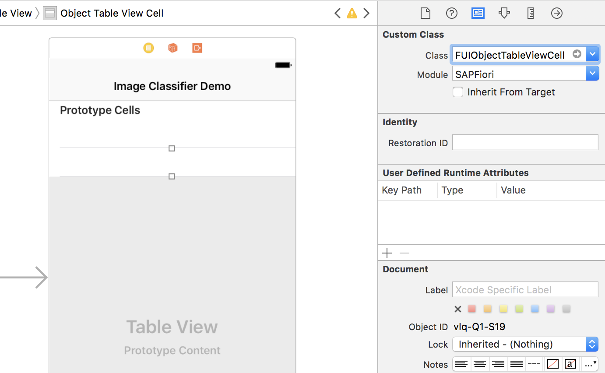

Switch to the **Attributes inspector** and set the **Identifier** to `classificationCell`:

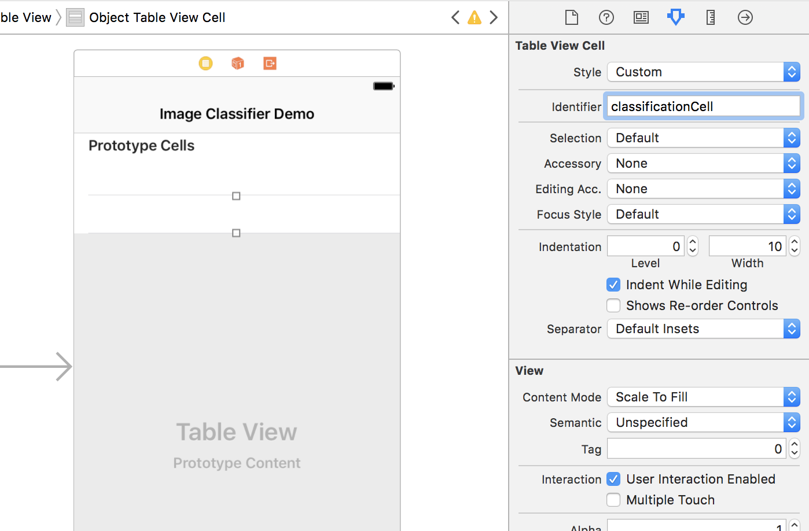


[ACCORDION-END]

[ACCORDION-BEGIN [Step 11: ](Implement table cell logic)]

First, change the `numberOfSections` method to return 1 section:

```swift
override func numberOfSections(in tableView: UITableView) -> Int {
    return 1
}
```

Then, replace the `tableView(tableView: section:)` method to the following:

```swift
override func tableView(_ tableView: UITableView, numberOfRowsInSection section: Int) -> Int {
    let numRows = classifications.count

    if numRows == 0 {
        let noDataLabel: UILabel  = UILabel(frame: CGRect(x: 0, y: 0, width: tableView.bounds.size.width - 50, height: tableView.bounds.size.height))
        noDataLabel.text          = "Select an image or take a photo"
        noDataLabel.textColor     = UIColor.lightGray

        noDataLabel.textAlignment = .center
        tableView.backgroundView  = noDataLabel
    }
    else {
        tableView.backgroundView = nil
    }
    return numRows
}
```

This method returns the number of items in the `classifications` array. In addition, if the `classifications` array contains no items, a placeholder text is displayed.  


[ACCORDION-END]

[ACCORDION-BEGIN [Step 12: ](Implement Camera and Photo Library usage)]

Both `@IBActions` for the Camera and Photo Library toolbar buttons are not yet implemented. Implement them so they resemble the following:

```swift
@IBAction func photoFromLibrary(_ sender: Any) {
    picker.allowsEditing = false
    picker.sourceType = .photoLibrary
    picker.mediaTypes = UIImagePickerController.availableMediaTypes(for: .photoLibrary)!
    present(picker, animated: true, completion: nil)
}

@IBAction func photoFromCamera(_ sender: Any) {
    if UIImagePickerController.isSourceTypeAvailable(.camera) {
        picker.allowsEditing = false
        picker.sourceType = UIImagePickerControllerSourceType.camera
        picker.cameraCaptureMode = .photo
        picker.modalPresentationStyle = .fullScreen
        present(picker,animated: true,completion: nil)
    } else {
        noCamera()
    }
}
```

Both actions call the view controller's `present` method. However, in order for the Camera or Photo Library to be shown, a delegate function needs to be implemented. Add the following delegate to the class:

```swift
//MARK: - Delegates
func imagePickerController(_ picker: UIImagePickerController, didFinishPickingMediaWithInfo info: [String : Any]) {
    var  chosenImage = UIImage()
    var filename = "<unknown>"

    chosenImage = info[UIImagePickerControllerOriginalImage] as! UIImage

    if let imageURL = info[UIImagePickerControllerReferenceURL] as? URL {
        let result = PHAsset.fetchAssets(withALAssetURLs: [imageURL], options: nil)
        let asset = result.firstObject
        filename = asset?.value(forKey: "filename") as! String
    }
    else {
        filename = String(describing: chosenImage.hashValue)
    }

    // API Hub doesn't allow images submitted over 1MB in size.
    // Resizing the image to a width of 600px should suffice.
    let resizedImage = chosenImage.resized(toWidth: 600.0)

    self.sendImage(image: resizedImage!, filename: "\(filename).jpg")

    dismiss(animated:true, completion: nil)

    self.tableView.reloadData()
}

func imagePickerControllerDidCancel(_ picker: UIImagePickerController) {
    dismiss(animated: true, completion: nil)
}
```

Right now, you will see a few errors indicating undefined methods or functions.

Add the following private functions:

```swift
//MARK: - Private methods
private func noCamera(){
    let alertVC = UIAlertController(
        title: "No Camera",
        message: "Sorry, this device has no camera",
        preferredStyle: .alert)

    let okAction = UIAlertAction(
        title: "OK",
        style:.default,
        handler: nil)

    alertVC.addAction(okAction)

    present(
        alertVC,
        animated: true,
        completion: nil)
}

private func sendImage(image: UIImage, filename: String) {
    // To be implemented
}
```

At the very bottom of the file, add the following extension:

```swift
extension UIImage {
    func resized(toWidth width: CGFloat) -> UIImage? {
        let canvasSize = CGSize(width: width, height: CGFloat(ceil(width/size.width * size.height)))
        UIGraphicsBeginImageContextWithOptions(canvasSize, false, scale)
        defer { UIGraphicsEndImageContext() }
        draw(in: CGRect(origin: .zero, size: canvasSize))
        return UIGraphicsGetImageFromCurrentImageContext()
    }
}
```

This resizes any image from the camera or the Photo Library to width of 600 pixels, and scales the height proportionally. Since the API Hub does not allow files exceeding 1 megabyte, in this particular case resizing the image to a smaller size is preferred over increasing the image compression.

If you now build run the app on a physical iOS device -- *it does not work on the Simulator since it has no camera* -- your app should look like this:

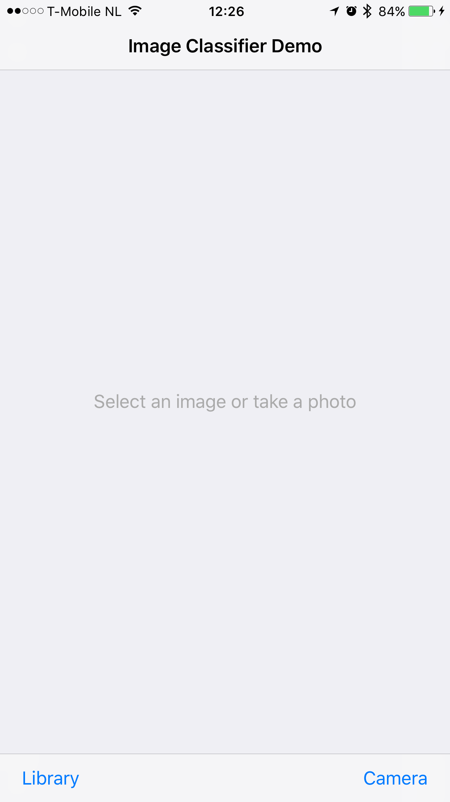

If you now click the **Camera** button, you are asked to give the app permission to use the camera:


Click **OK**, and take a picture. Click **Use Photo**, and the app navigates back to the initial screen. Nothing happens further, because you did not yet implemented the SAP Leonardo Image Classification API from the SAP API Hub yet. You will fix that in the next steps.


[ACCORDION-END]

[ACCORDION-BEGIN [Step 13: ](Implement SAP Leonardo Image Classification API)]

Take a look at the generated code from the SAP API Hub:


An HTTP request is made with a couple of HTTP headers to the REST API endpoint `https://sandbox.api.sap.com/ml/imageclassifier/inference_sync`, and the returned response is then printed to the console as plain text. However, the generated code is written in Swift 2.0, uses the core Foundation instead of the SAP Cloud Platform SDK for iOS, and ideally you want the response in JSON format, not plain text.

Implement the following in the `sendImage(image:, filename:)` class:

```swift
private func sendImage(image: UIImage, filename: String) {
    //adding request headers
    let boundary = "Boundary-\(UUID().uuidString)"
    let headers = [
        "Accept": "application/json",
        "APIKey": "<Your API Hub key here>",
        "Content-Type": "multipart/form-data; boundary=\(boundary)"
    ]

    var request = URLRequest(url: URL(string: "https://sandbox.api.sap.com/ml/imageclassifier/inference_sync")!,
                                      cachePolicy: .useProtocolCachePolicy,
                                      timeoutInterval: 10.0)
    //setting request method
    request.httpMethod = "POST"
    request.allHTTPHeaderFields = headers
    request.httpBody = self.createBody(
        boundary: boundary,
        data: UIImageJPEGRepresentation(image, 0.8)!,
        mimeType: "image/jpg",
        filename: filename)

    let session = SAPURLSession()

    //sending request
    let dataTask = session.dataTask(with: request) { data, response, error in
        guard let data = data, error == nil else {
            // check for fundamental networking error
            return
        }

        do {
            let json = try JSONSerialization.jsonObject(with: data, options: .mutableContainers) as? AnyObject

            if let parseJSON = json {
                self.logger.info("response :\(parseJSON)")
                let rootKey = parseJSON.allKeys[0]
                let dictArray = parseJSON[rootKey] as! [NSDictionary]

                // retrieve 'results' node from JSON and store results in classifications field
                self.classifications = dictArray[0].value(forKey: "results") as! [NSDictionary]
            }

            DispatchQueue.main.async(execute: { () -> Void in
                self.tableView.reloadData()
            })
        }
        catch let error as NSError {
            self.logger.error("error : \(error)")
        }
    }

    dataTask.resume()
}

```

In this method, first the required HTTP headers are created. The image is sent as `multipart/form-data`, and the response is retrieved in JSON format. The `APIKey` header expects your personal API Hub key, which can be retrieved from the API Hub by **clicking the key icon** in the top-right of the REST API page.

Because the request is sent as `multipart/form-data`, a boundary string needs to be constructed which will be used in the request body. This HTTP body is populated in method `createBody`.

The REST API URL is then set in the request and an URL session is created. After a successful response, the returned data is serialized to a JSON object. The `classifications` array will then be populated with the JSON object's `results` node, and the table view is reloaded.

> The above code isn't written in the most beautiful way (no JSON object mapping to a Swift class, for instance) but this way it makes it easier to understand what's going on in this method.

.

Finally, add the missing private method `createBody`:

```swift
private func createBody(
    boundary: String,
    data: Data,
    mimeType: String,
    filename: String) -> Data {
    var body = Data()

    let boundaryPrefix = "--\(boundary)\r\n"

    body.append(Data(boundaryPrefix.utf8))
    body.append(Data("Content-Disposition: form-data; name=\"files\"; filename=\"\(filename)\"\r\n".utf8))
    body.append(Data("Content-Type: \(mimeType)\r\n\r\n".utf8))
    body.append(data)
    body.append(Data("\r\n".utf8))
    body.append(Data("--".appending(boundary.appending("--")).utf8))

    return body as Data
}
```


[ACCORDION-END]

[ACCORDION-BEGIN [Step 14: ](Bind response to FUIObjectTableViewCell)]

The one thing missing is displaying the results from the response into the `FUIObjectTableViewCell` objects.

Replace the content of method `tableView(tableView:, indexPath:)` with the following:

```swift
override func tableView(_ tableView: UITableView, cellForRowAt indexPath: IndexPath) -> UITableViewCell {
    let item = classifications[indexPath.row]

    let cell = tableView.dequeueReusableCell(withIdentifier: "classificationCell", for: indexPath) as! FUIObjectTableViewCell

    cell.headlineText   = item.value(forKey: "label") as? String
    cell.footnoteText   = "Confidence: \(String(describing: Int(round(Double(((item.value(forKey: "score") as! NSNumber) as! Double) * 100))))) %"

    return cell
}
```

In this method, the `FUIObjectTableViewCell` with identifier `classificationCell` you created in step 10 is now populated with the value `label` as its classification, and the score is displayed as a percentage, indicating the confidence the classification matches the submitted image.

Because the table cell is now an SAP Fiori Object Cell, the table view's row height needs to be adjusted. In method `viewDidLoad()`, add the following lines:

```swift
self.preferredContentSize = CGSize(width: 320, height: 480)

tableView.estimatedRowHeight = 98
tableView.rowHeight = UITableViewAutomaticDimension
tableView.backgroundColor = UIColor.preferredFioriColor(forStyle: .backgroundBase)
tableView.separatorStyle = .none
```

This ensures the table cell is rendered correctly.


[ACCORDION-END]

[ACCORDION-BEGIN [Step 15: ](Build and run the application)]

If you now build and run the application, everything should work end to end now. Take a picture of a single item, for instance these sunglasses:


If you now click the **Use Photo** button, the image is sent to the SAP API Hub REST endpoint, and if all goes well, you should see the JSON response in the console, and the table view is now populated with `FUIObjectTableViewCell` objects displaying the matching classifications, as well as the score as a confidence in percentage:

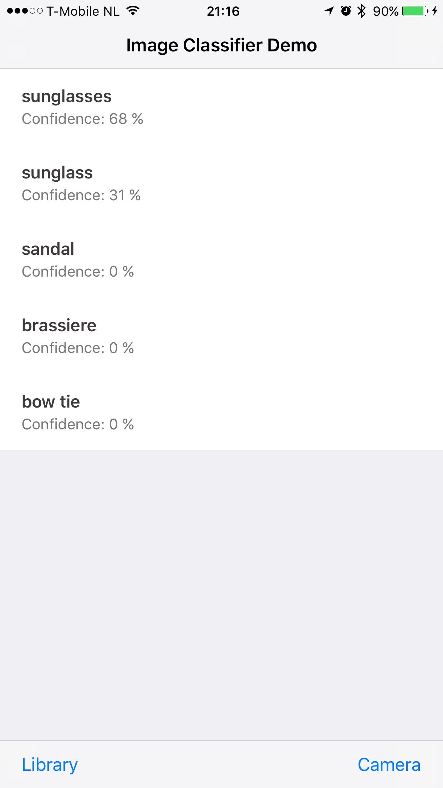


[ACCORDION-END]


## Next Steps
 - [View all How-Tos](http://www.sap.com/developer/tutorial-navigator.how-to.html)
