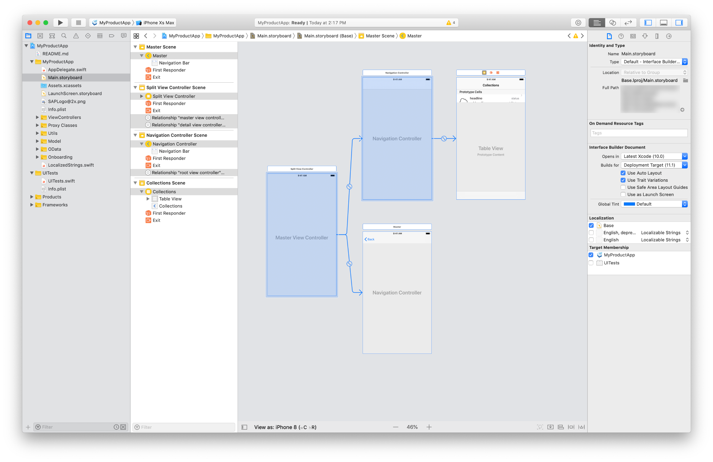
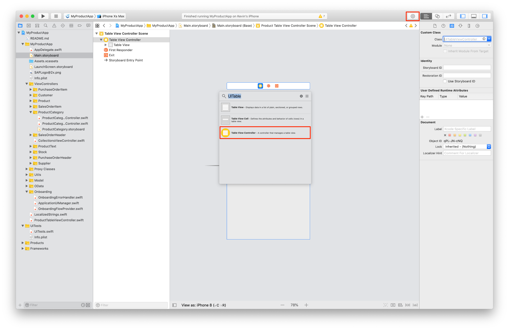
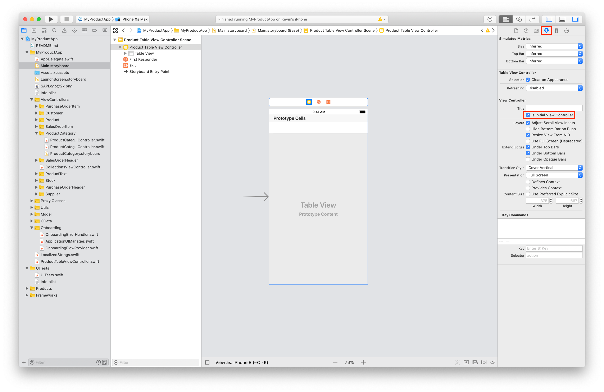
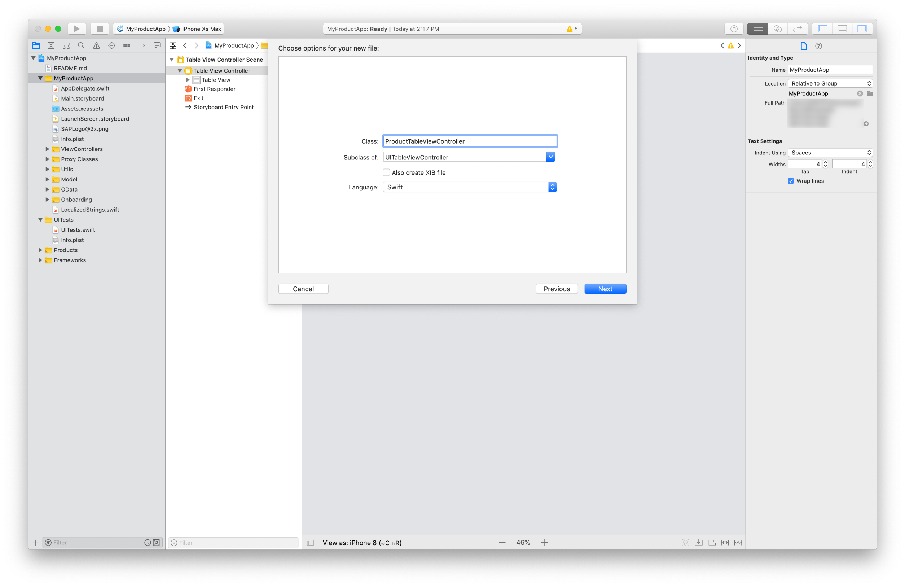
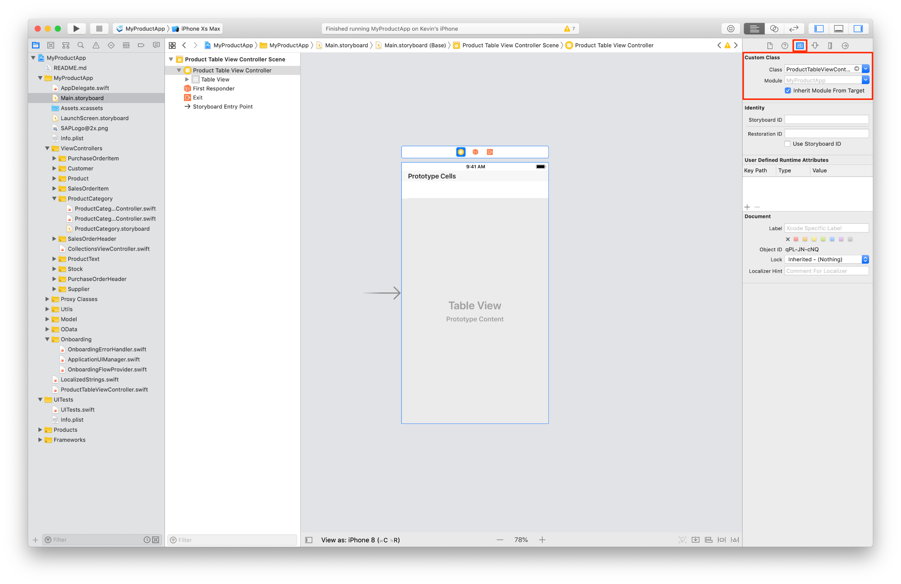
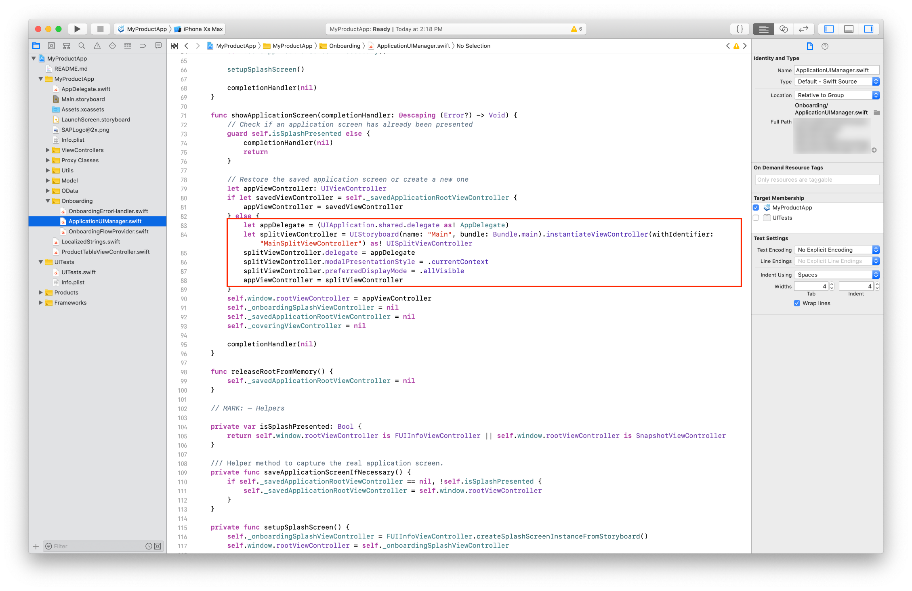
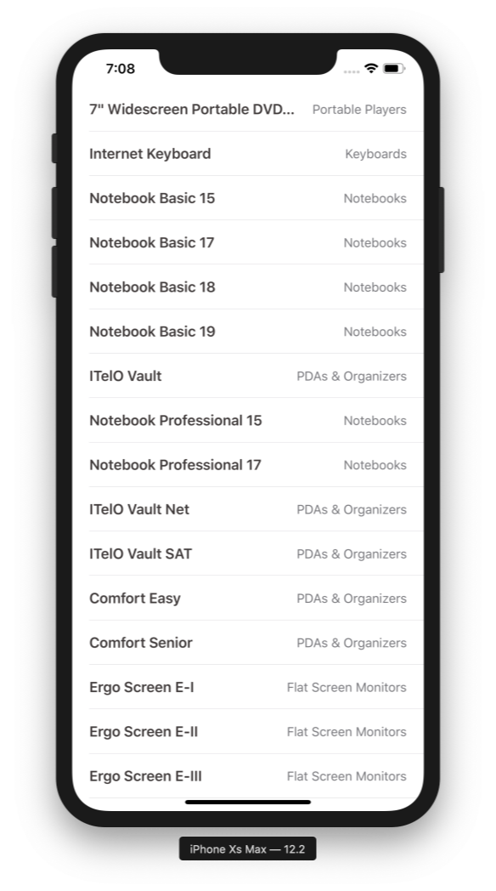
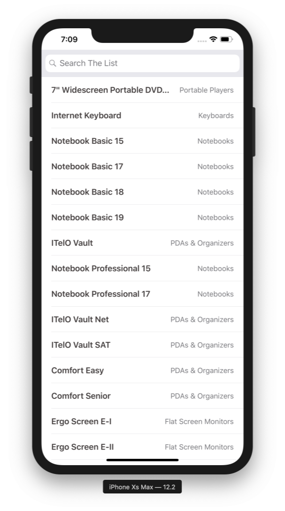
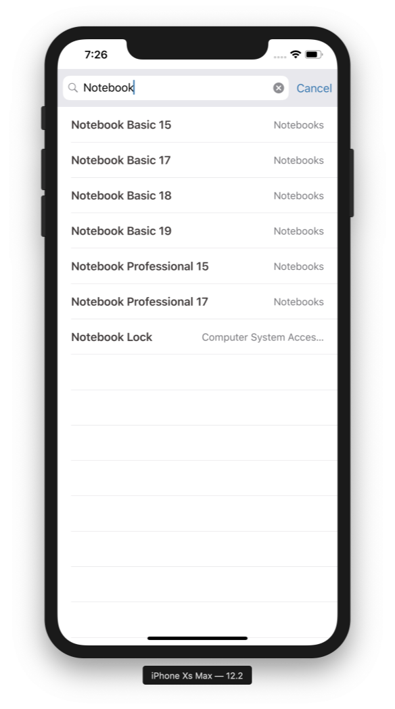
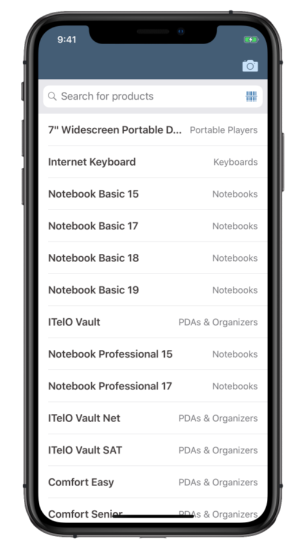

## Prerequisites  
- **Development environment:** Apple Mac running macOS Catalina or higher with Xcode 11 or higher
- **SAP BTP SDK for iOS:** Version 5.0
- [Set Up the SAP BTP SDK for iOS](group.ios-sdk-setup)

## Details
### You will learn  
  - How to add a `FUISearchBar` and implement item searching on an `UITableViewController`
  - How to add the `FUIBarcodeScanner` to the `FUISearchBar` and search in a `UITableViewController` with the scan result of the `FUIBarcodeScanner`.

---

[ACCORDION-BEGIN [Step 1: ](Replace the generated app UI with your own)]

> This tutorial uses the generated app out of the [Set Up the SAP BTP SDK for iOS](group.ios-sdk-setup) tutorial group.

Please open up the `TutorialApp` created in the above mentioned tutorial group. The app contains a Master-Detail View which has to be removed to add a `UITableViewController` displaying a list of products.

Open the `Main.storyboard` in Interface Builder to delete the existing generated UI. Select all View Controllers and delete them.



Next add a new `UITableViewController` to the storyboard from the **Object Library**. This will later display a list of products and implement the `FUISearchBar` and `FUIBarcodeScanner`.



To give the app the correct entry point it is necessary to make the newly added `UITableViewController` an initial View Controller. In the `Main.storyboard` select the `UITableViewController` and go to the **Attributes Inspector** on the right sidebar. Check the box **Is Initial View Controller**, an arrow should appear next to the View Controller.



To actually work with the View Controller a subclass of `UITableViewController` must be created and connected to the UI representative in Interface Builder. Select the top-level group in the **Project navigator** on the left-hand side. Choose **File -> New -> File...** or simply right-click to open the context menu and click on **New File...**. In the upcoming dialogue make sure that **Subclass of:** is `UITableViewController` and choose `ProductTableViewController` as class name.

> Please don't forget to check that Swift is selected as language before creating the class.



Go back to the `Main.storyboard` and select the `UITableViewController`. Backing up a View Controller in storyboard is simple, select the view controller and click on the **Identity Inspector** icon on the right-hand side. Under **Custom Class** enter the `ProductTableViewController` and hit return. The name in the hierarchy stack should change now and display the name of the added class.



All the setup is done now for a new and fresh UI, the last step would be changing the `ApplicationUIManager.swift` code to load the new View Controller instead of the old Master-Detail View ones. The `ApplicationUIManager` is a class responsible for managing initial and Splash screens for the Onboarding UI flow.

In Xcode, open `ApplicationUIManager.swift` and locate the method `showApplicationScreen(completionHandler: @escaping (Error?) -> Void)`.

> **Hint:** You can use the `Open Quickly` feature of Xcode to search for the `ApplicationUIManager` class with `Command + Shift + O`. Once you've opened the file, you can quickly jump to the `showApplicationScreen(completionHandler: @escaping (Error?) -> Void)` function by using the **jump bar** at the top of the editor area pane.



Currently the code will try instantiating the first screen of the Master-Detail View. We deleted those so we have to make sure that our `ProductTableViewController` will be instantiated instead.

Replace the following code inside the `showApplicationScreen(completionHandler:)` method:

```swift
  let appDelegate = (UIApplication.shared.delegate as! AppDelegate)
  let splitViewController = UIStoryboard(name: "Main", bundle: Bundle.main).instantiateViewController(withIdentifier: "MainSplitViewController") as! UISplitViewController
  splitViewController.delegate = appDelegate
  splitViewController.modalPresentationStyle = .currentContext
  splitViewController.preferredDisplayMode = .allVisible
  appViewController = splitViewController

```

with:

```Swift
  let productTableViewController = UIStoryboard(name: "Main", bundle: Bundle.main).instantiateInitialViewController() as! ProductTableViewController
  appViewController = productTableViewController

```

Instead of instantiating the `MainSplitViewController` the `UIStoryboard` will instantiate the initial View Controller and cast it to the `ProductTableViewController`.

If you run the app now, you should see a screen with an empty `UITableView`.

> The screen will be visible after you completed the Onboarding flow.

[DONE]
[ACCORDION-END]

[ACCORDION-BEGIN [Step 2: ](Load products from the OData Service)]

The base View Controller is created and set as initial screen after the Onboarding flow. It is time to populate the table view with data from the backend.
Please open the `ProductTableViewController.swift` class and add the following import statements to it:

```swift
  import SAPFiori
  import SAPFioriFlows
  import SAPFoundation
  import SAPOData

```

We will need them for loading the data and displaying `SAPFiori` controls.

Next it is necessary to add two properties to the class. These properties are containing a data service instance and an array of products.
Above the `viewDidLoad(:)` method add the following lines of code:

```swift
// The available destinations from Mobile Services are hold in the FileConfigurationProvider. Retrieve it to find the correct data service
let destinations = FileConfigurationProvider("AppParameters").provideConfiguration().configuration["Destinations"] as! NSDictionary

// Retrieve the data service using the destinations dictionary and return it.
var dataService: ESPMContainer<OnlineODataProvider>? {
    guard let odataController = OnboardingSessionManager.shared.onboardingSession?.odataControllers[destinations["com.sap.edm.sampleservice.v2"] as! String] as? Comsapedmsampleservicev2OnlineODataController, let dataService = odataController.espmContainer else {
        AlertHelper.displayAlert(with: NSLocalizedString("OData service is not reachable, please onboard again.", comment: ""), error: nil, viewController: self)
        return nil
    }
    return dataService
}

```

> In case you're using the Offline capabilities please change the data service declaration to: `var dataService: ESPMContainer<OfflineODataProvider>?`. Also add another import statement `SAPOfflineOData`.

Now that we can safe loaded products and have an instance of the data service, add the following line of code to the `viewDidLoad(:)`:

```swift
  updateTableView()

```

Create the `updateTableView()` method right below the `viewDidLoad(:)`:

```swift
  // MARK: - Private methods

  private func updateTableView() {
    self.showFioriLoadingIndicator()
    loadData {
        self.hideFioriLoadingIndicator()
    }
  }

```

The code won't compile yet, we need to implement the `loadData()` method first as well as the Fiori Loading Indicator. The `loadData()` method will actually be responsible for calling the data service's fetch method, set the data to the `products` property, reload the table view to display the newly loaded data and call it's `completionHandler()` to hide the loading indicator.

First let's take care of the loading indicator.

Change the class declaration to the following:

```swift
class ProductTableViewController: UITableViewController, SAPFioriLoadingIndicator { ... }

```

This will make your class use the `SAPFioriLoadingIndicator` protocol which is part of the utilities generated by the assistant. The protocol allows you to use the loading indicator in a super easy way.

After you changed the class signature Xcode will ask you to conform to the protocol. To do so add the following class property:

```swift

var loadingIndicator: FUILoadingIndicatorView?

```

Now implement the following lines of code right below the `updateTableView()` method to fetch some data from the backend:

```swift
  private func loadData(completionHandler: @escaping () -> Void) {
    // fetch products
    dataService?.fetchProducts() { [weak self] products, error in
      // handle errors
        if let error = error {
            NSLog("Error while fetching products \(error.localizedDescription)")
            return
        }

        // set loaded products to property and reload data on the table view
        self?.products = products!
        self?.tableView.reloadData()
        completionHandler()
    }
  }

```

[DONE]
[ACCORDION-END]

[ACCORDION-BEGIN [Step 3:](Populate the UITableView with data)]

Good news we successfully loaded the products in the app and we can now display those using the `FUIObjectTableViewCell`. In the `viewDidLoad(:)` method add the following lines:

```swift
tableView.register(FUIObjectTableViewCell.self, forCellReuseIdentifier: FUIObjectTableViewCell.reuseIdentifier)
self.tableView.rowHeight = UITableView.automaticDimension
self.tableView.estimatedRowHeight = 98

```
With that we make sure the cell is registered on the table view and the rows will be displayed the correct way. Implementing the `UITableViewDataSource` will make sure that the products are going to be displayed the correct way. Implement the following lines of code:

```swift
  // MARK: - Table view data source

  override func tableView(_ tableView: UITableView, numberOfRowsInSection section: Int) -> Int {
      return products.count
  }

  override func tableView(_ tableView: UITableView, cellForRowAt indexPath: IndexPath) -> UITableViewCell {
    let product = products[indexPath.row]
    let cell = tableView.dequeueReusableCell(withIdentifier: FUIObjectTableViewCell.reuseIdentifier, for: indexPath) as! FUIObjectTableViewCell
    cell.headlineText = product.name
    cell.substatusText = product.categoryName

    return cell
  }

```

Locate the method called `numberOfSections(in:)` (if it exists in the class) and change the return value from 0 to 1. If it doesn't exist you can add it right above the `tableView(_:numberOfRowsInSection)` method.

```swift

override func numberOfSections(in tableView: UITableView) -> Int {
        return 1
    }

```

If you run the app now you should see a loading indicator showing up and as soon as the data is loaded the table view will refresh and show a list of products.



[DONE]
[ACCORDION-END]

[ACCORDION-BEGIN [Step 4: ](Add the FUISearchBar & FUIBarcodeScanner to the ProductTableViewController)]

Having a list of items is great but wouldn't it be even better if we could search for certain items in the list? To achieve that we're going to implement the `FUISearchBar` including the `FUIBarcodeScanner` feature to the table view.

The first thing we need is a `FUISearchController` property which is optional. Please add the following line of code right below the products property above the `viewDidLoad(:)`.

```swift

private var searchController: FUISearchController?

```

Next implement a setup method for all the search bar setup. Please add the following line of code to the `viewDidLoad(:)` method:

```swift
  setupSearchBar()

```

Now implement the `setupSearchBar()` method like this:

```swift
  private func setupSearchBar() {
      // Search Controller setup
      searchController = FUISearchController(searchResultsController: nil)
      searchController!.searchResultsUpdater = self
      searchController!.hidesNavigationBarDuringPresentation = true
      searchController!.searchBar.placeholderText = "Search for products"

      // Adding barcode scanner to this search bar
      searchController!.searchBar.isBarcodeScannerEnabled = true
      searchController!.searchBar.barcodeScanner?.scanMode = .all
      searchController!.searchBar.barcodeScanner?.scanResultTransformer = { (scanString) -> String in
          self.searchProducts(scanString)
          return scanString.uppercased()
      }

      self.tableView.tableHeaderView = searchController!.searchBar
  }

```

You will get a compile error now because your class is not implementing the `UISearchResultsUpdating` protocol. Please add an class extension conforming to the protocol:

```swift
  extension ProductTableViewController: UISearchResultsUpdating {
      func updateSearchResults(for searchController: UISearchController) {
          // implement search behavior here.
      }
  }

```

If you run the app on the simulator now, you should see a search bar appearing on top of the list.



[DONE]
[ACCORDION-END]

[ACCORDION-BEGIN [Step 5: ](Implement the search result handling and update of the UITableViewController)]

At the moment the search bar doesn't do much, so let's go ahead and implement the search logic.

First add a new property to the class which will be responsible for storing the searched for products. Add the following line of code right below the products array:

```swift
  var searchedProducts = [Product]()

```

We need some logic for actually handling the users input, for that implement the following three methods right the below the `setupSearchBar()` method:

```swift
  // verify if the search text is empty or not
  func searchTextIsEmpty() -> Bool {
      return searchController?.searchBar.text?.isEmpty ?? true
  }

  // actual search logic for finding the correct products for the term the user is searching for
  func searchProducts(_ searchText: String) {
      searchedProducts = products.filter({( product : Product) -> Bool in
          return product.name?.lowercased().contains(searchText.lowercased()) ?? false
      })

      tableView.reloadData()
  }

  // verify if the user is currently searching or not
  func isSearching() -> Bool {
      return searchController?.isActive ?? false && !searchTextIsEmpty()
  }

```

Now we can update the `updateSearchResults(for: UISearchController)` method to use our search logic. Change the method inside the extension like the following:

```swift
  func updateSearchResults(for searchController: UISearchController) {
    if let searchText = searchController.searchBar.text {
         searchProducts(searchText)
         return
     }
   }

```

The code above will grab the searched for term and let it run through our search logic to fill the `searchedProducts` array with the results.

To actually display the searched for items, it is necessary to change the table view data source logic. Please replace the data source methods with the following code:

```swift
  override func tableView(_ tableView: UITableView, numberOfRowsInSection section: Int) -> Int {
    // if the user is searching display the searched for products and all products otherwise.
    return isSearching() ? searchedProducts.count : products.count
  }

  override func tableView(_ tableView: UITableView, cellForRowAt indexPath: IndexPath) -> UITableViewCell {
    let cell = tableView.dequeueReusableCell(withIdentifier: FUIObjectTableViewCell.reuseIdentifier, for: indexPath) as! FUIObjectTableViewCell

    let product = isSearching() ? searchedProducts[indexPath.row] : products[indexPath.row]

    // set the cell properties according to the searched for terms or otherwise just all products
    cell.headlineText = product.name
    cell.substatusText = product.categoryName

    return cell
  }

```

Run the app in simulator now and you should be possible to search for certain products in the list. The `UITableView` should update automatically now.



[DONE]
[ACCORDION-END]

[ACCORDION-BEGIN [Step 6: ](Ask for permission to use the Camera)]

Great! We have the `FUISearchBar` up and running with actual search logic and table view updating. We also enabled the `FUIBarcodeScanner` for the search bar but there is a bit more to do to actually use the barcode scanner.

You might recognized that the `FUIBarcodeScanner` isn't showing in the UI when you run the app on simulator. By standard the camera is not available on simulator, you can run the app on your iPhone or iPad to see the barcode scanner feature appear. Right now the app will crash when you try running it on an actual device. Reason for this is the highly secure operating system we're developing for. Apple forces us to get permission from the user first, before we can use the camera within the app. This is easy to implement in your project, you just have to add a new Key-Value pair to the `info.plist` file.

Go ahead and open the `info.plist` file. Please add a new Key with the name **Privacy - Camera Usage Description** to the **Information Property List**. In the **Value** field you can add your custom permission text the user will see when the app starts up. Please enter **Please permit using Camera.** in the value field and hit return.


The user will be asked for permission to use the camera inside the app on the first time he starts the `TutorialApp`. Run the app on your device to see the result.


[DONE]
[ACCORDION-END]

[ACCORDION-BEGIN [Step 7: ](Embed the ProductTableViewController in a UINavigationController)]

The integrated scanning function in the `FUISearchBar` is great but what if you want to use the `FUIBarcodeScanner` in a more flexible way. Fortunately the SDK provides an API to work with the `FUIBarcodeScanViewController` in an easy way.

As an example we will implement a Bar Button Item in an `FUINavigationBar`. This button will trigger to open up the `FUIBarcodeScanner`.

Please go back to the `Main.storyboard` and embed the `ProductTableViewController` in an `UINavigationController`.


You might recognized that the `UINavigationController` is now the initial View Controller, which means we have to change the `ApplicationUIManager` code.


Please open the `ApplicationUIManager.swift` file and change the following lines of code:

```swift
  let productTableViewController = UIStoryboard(name: "Main", bundle: Bundle.main).instantiateInitialViewController() as! ProductTableViewController
  appViewController = productTableViewController

```

to

```swift
let productTableViewController = UIStoryboard(name: "Main", bundle: Bundle.main).instantiateInitialViewController() as! UINavigationController
appViewController = productTableViewController

```

This will make sure the `UINavigationController` gets initialized and set as first View Controller after the onboarding flow.

[DONE]
[ACCORDION-END]

[ACCORDION-BEGIN [Step 8: ](Implement the FUIBarcodeScanViewController for more flexible use)]

Now let's implement our camera Bar Button Item. Go to the `Main.storyboard` and select the `ProductTableViewController`. Now find the Bar Button Item in the Object Library and add it to the Navigation Item into the Right Bar Button Items.


Select the added button and in the **Attributes Inspector** select **Camera** as **System Item**.


Open up the **Assistant Editor** and create an `IBAction` in the `ProductTableViewController`. Call it `didTapScan`.

Close the **Assistant Editor** and open up the `ProductTableViewController`. We're going to implement the `didTapScan(:)` action to open up the `FUIBarcodeScanner` when the camera icon is tapped.

First we need a computed property for initializing the `FUIBarcodeScanViewController`. Add the following lines of code in the beginning of your class:

```swift
  var scanViewController: FUIBarcodeScanViewController {
    let scanViewController = FUIBarcodeScanViewController.createInstanceFromStoryboard()
    scanViewController.delegate = self
    return scanViewController
  }

```

You will see a compile error because the `ProductTableViewController` doesn't conform to the `FUIBarcodeScanViewControllerDelegate`. To fix that, add a new extension to your View Controller:


```swift
extension ProductTableViewController: FUIBarcodeScanViewControllerDelegate {
    func barcodeScanViewController(_ barcodeScanViewController: FUIBarcodeScanViewController, didReceiveScanResult scanResult: FUIBarcodeScanResult?) {
        if let resultString = scanResult?.scanResultString {
            searchProducts(resultString)
            return
        }
    }
}

```

We're going to implement the delegate method later. For now let's implement the `didTapScan(:)` method:

```swift
  // Create a new UINavigationController and add the scanViewController as the Root View Controller.
  let navController = UINavigationController(rootViewController: scanViewController)

  // Present the Navigation Controller
  self.navigationController?.present(navController, animated: true, completion: nil)

```

If you run the app on your iPhone or iPad and tap on the camera icon or the Barcode Scanner icon a camera view should be presented modally.



[DONE]
[ACCORDION-END]

[ACCORDION-BEGIN [Step 9: ](Handle the Scan Result)]

The Barcode Scanner works now in both ways, one with the Camera Bar Button Item and two with the Barcode Icon in the `FUISearchBar`. We already took care of the search logic, so let's implement the `FUIBarcodeScanViewControllerDelegate` method.

Add the following lines of code to the `barcodeScanViewController(: FUIBarcodeScanViewController, scanResult: FUIBarcodeScanResult?)` method:

```swift
  if let resultString = scanResult?.scanResultString {
      searchProducts(resultString)
      return
  }

```

If you run the app now and scan a Barcode or QR Code containing a product name our search logic will filter for the correct products.


Barcode             |  QR Code
:-------------------------:|:-------------------------:
  |  


[VALIDATE_9]
[ACCORDION-END]
