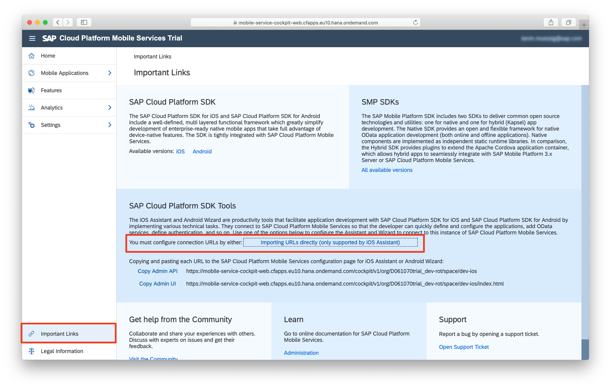
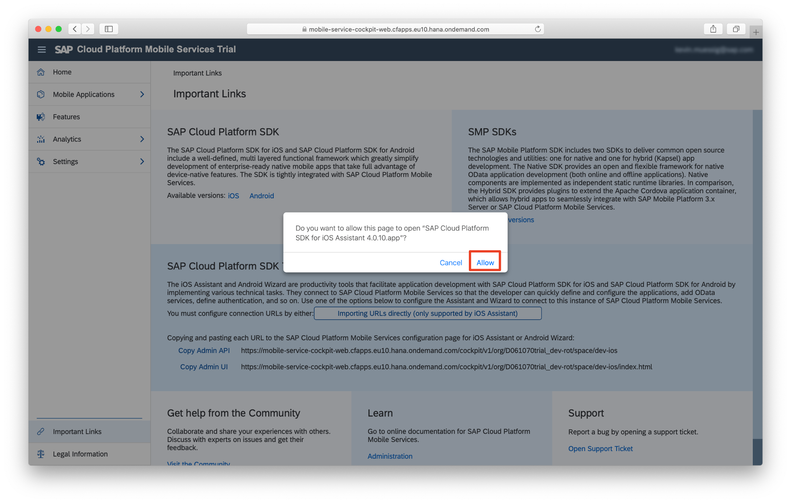
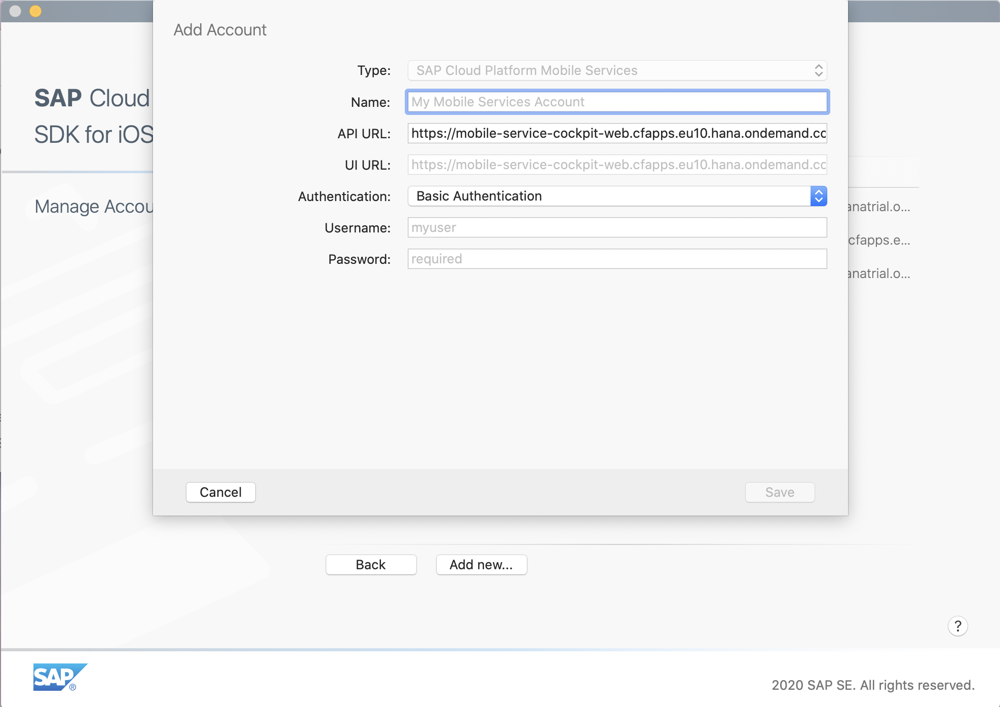
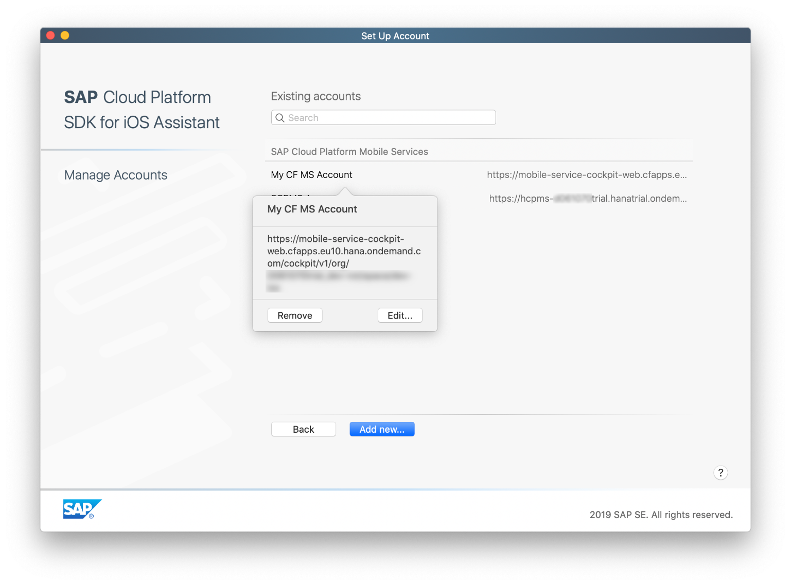

## Prerequisites

- Completed the previous tutorial(s) in this group.
- **Development environment:** Apple Mac running macOS Catalina or higher with Xcode 11 or higher
- **SAP BTP SDK for iOS:** Have downloaded Version 5.1.0 or higher from [Trials and Downloads](https://developers.sap.com/trials-downloads.html?search=sdk%20for%20ios)  

## Details

### You will learn  

- How to create a connection in the SAP BTP SDK Assistant for iOS

---

[ACCORDION-BEGIN [Step 1: ](Enable SAP Mobile Services)]

The SAP BTP SDK for iOS is designed to work seamlessly with a set of services provided by the SAP BTP that are optimized for communication with mobile devices, known collectively as Mobile Services. These include not only data services, but also features like analytics, push notifications, and app configuration. Before creating your first app, you'll need to ensure that Mobile Services are enabled for your trial account.

> If you have already configured the SAP BTP SDK Assistant for iOS, you can **skip this step** and proceed with the "Create Your First Fiori for iOS App" tutorial.

To enable the service, do the tutorial [Enable SAP Mobile Services](fiori-ios-hcpms-setup).

[DONE]
[ACCORDION-END]

[ACCORDION-BEGIN [Step 2: ](Set up your Mobile Services account in the Assistant)]

The SAP BTP SDK for iOS includes an Assistant app for generating and managing iOS apps that use the Mobile Services. To get started with the Assistant, you'll need to configure it for your account. Part of this configuration can be imported automatically.

Once you're logged in to **SAP Mobile Services**, click the **Important Links** tab in the lower left bottom. The **Important Links** section opens.

Locate the tile **SAP BTP SDK Assistant for iOS** and click the **Importing URLs directly** link:

> NOTE: Please make sure that the SAP BTP SDK Assistant for iOS is on the main window.

You should now see the following pop-up:

Click **Allow**. The SAP BTP SDK Assistant for iOS application will start. The **Add Mobile Services Account** settings dialog will open, and both **API URL** and **UI URL** parameters are pre-populated automatically:

Provide the following additional details:

| Field | Value |
|----|----|
| Name | A descriptive name for the configuration, for instance `SAP Mobile Services` |
| Authentication Type | `Single Sign-On` |

Click **Save** when finished. The account is now added to the SAP BTP SDK Assistant for iOS:

Click **Back** to return to the main screen for the **SAP BTP SDK Assistant for iOS**.

[VALIDATE_1]
[ACCORDION-END]
