## Prerequisites  
- **Proficiency:** Intermediate
- **Tutorials:** [Sign up for a free trial account on SAP Cloud Platform](https://developers.sap.com/tutorials/hcp-create-trial-account.html) and [Enable SAP Cloud Platform mobile service for development and operations](https://developers.sap.com/tutorials/fiori-ios-hcpms-setup.html)
- **Development environment:** Apple iMac, MacBook or MacBook Pro running Xcode 9.3 or higher
- **SAP Cloud Platform SDK for iOS:** Version 2.2

## Details
### You will learn  
In this tutorial, you will create a Fiori for iOS application which will show tracking info for purchased packages. This application has the following characteristics:

 - Connects to an SAP HANA MDC (Multi-tenant Database Container) XS OData service. It contains records of packages and their delivery status.
 - Use simplified OData querying with the SAP Cloud Platform SDK for iOS
 - Implement SAP Fiori for iOS controls to show timeline data
 - Displays deliveries turnaround times in a bar chart
 - Custom theming

When you are ready, your SAP Fiori for iOS application will resemble the following:


> Before you start, make sure you:

> - have downloaded SAP Cloud Platform SDK for iOS **version 2.2 (2.0 SP02)**. For older versions, please go to [this tutorial](https://developers.sap.com/tutorials/fiori-ios-scpms-create-app-wwdc21.html) instead.
> - have a trial account on SAP Cloud Platform. See [Sign up for a free trial account on SAP Cloud Platform](https://developers.sap.com/tutorials/hcp-create-trial-account.html) for more information.
> - enabled SAP Cloud Platform mobile service for development and operations. See [Enable SAP Cloud Platform mobile service for development and operations](https://developers.sap.com/tutorials/fiori-ios-hcpms-setup.html) for more information.

### Time to Complete
**50 Min**

---

[ACCORDION-BEGIN [Step 1: ](Configure SAP Cloud Platform SDK for iOS Assistant)]

> **Note**: If you have already configured the SAP Cloud Platform SDK for iOS Assistant, you can **skip this step** and proceed with "Step 2 - Run the SAP Cloud Platform SDK for iOS Assistant".

This step provides simplified steps to configure the SAP Cloud Platform SDK for iOS Assistant application using the SAP Cloud Platform mobile service for development and operations cockpit.

Log on to your SAP Cloud Platform trial account at [https://account.hanatrial.ondemand.com/](https://account.hanatrial.ondemand.com/) and once logged in, navigate to **Services**. Scroll down to **Mobile Services** and click on the **Development & Operations** tile. In the **Development & Operations - Overview** page, click the **Go to Service** link to open a new window to **SAP Cloud Platform mobile service for development and operations**.

> Alternatively, you can go directly to `https://hcpmsadmin-<your_user_id>trial.dispatcher.hanatrial.ondemand.com/`.


Once you're logged in to **SAP Cloud Platform mobile service for development and operations**, click the **Important Links** tab in the lower left bottom. The **Important Links** section opens.

Locate the tile **SAP Cloud Platform SDK for iOS Assistant** and click the **Importing URLs directly into Assistant** link:

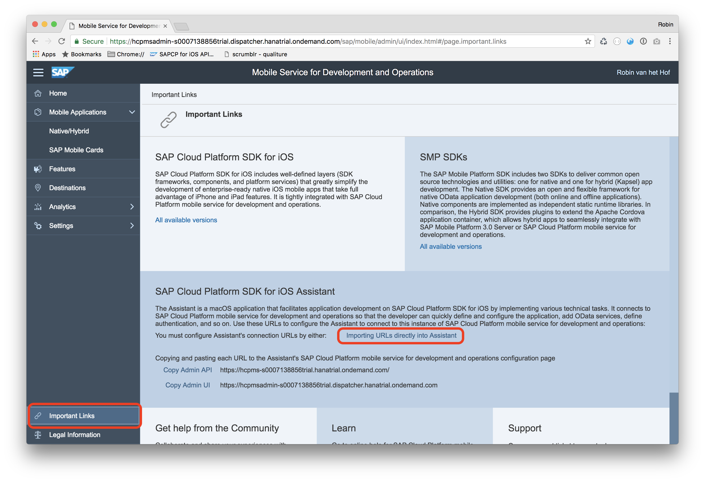

You should now see the following pop-up:


Click the **Open SAP Cloud Platform SDK for iOS Assistant** button. The SAP Cloud Platform SDK for iOS Assistant application will start. The **New Account** settings dialog will open, and both **Admin API URL** and **Admin UI URL** parameters are pre-populated automatically:


Provide the following additional details:

| Field | Value |
|----|----|
| Name | A descriptive name for the configuration, for instance `SAP Cloud Platform Mobile Services` |
| Authentication Type | `Basic Authentication` |
| User | Your trial account user |
| Password | Password for your trial account user |


Click **Add** when finished. The account is now added to the SDK Assistant:


Close the **Accounts** dialog.

[DONE]
[ACCORDION-END]


[ACCORDION-BEGIN [Step 2: ](Run the SAP Cloud Platform SDK for iOS Assistant)]

> **Note**: If you went through "Step 1 - Configure SAP Cloud Platform SDK for iOS Assistant", the SAP Cloud Platform SDK for iOS Assistant is already running and you may continue to "Step 3 - Create an Xcode Project".


Double-click the **SAP Cloud Platform SDK for iOS Assistant** icon to start the application. If no applications have been generated previously, you will see the initial screen:


[DONE]
[ACCORDION-END]


[ACCORDION-BEGIN [Step 3: ](Create an Xcode Project)]

Click the **Plus** button on the top-right of the SDK Assistant. The first page of the Xcode Project generation wizard lets you define the Project Properties.

Enter the following details:

| Field | Value |
|----|----|
| Product Name | `MyDeliveries` |
| Author | `<your name>` |
| Organization Name | `<your company name>` |
| Organization Identifier | `com.sap.tutorials.demoapp` |
| Destination | `<choose a local destination>` |


Click **Next** to advance to the **SAP Cloud Platform mobile service for development and operations Configuration** step.


[DONE]
[ACCORDION-END]

[ACCORDION-BEGIN [Step 4: ](SAP Cloud Platform mobile service for development and operations Configuration details)]

In the **SAP Cloud Platform mobile service for development and operations Configuration** page, select the **Create** tab button.

Enter the following details:

| Field | Value |
|----|----|
| Application Name | `MyDeliveries` |
| Application Identifier | `com.sap.tutorials.demoapp.MyDeliveries` |
| Authentication Type | `OAuth` |


Click **Next** to advance to the **OData Services** step.


[DONE]
[ACCORDION-END]

[ACCORDION-BEGIN [Step 5: ](OData Services)]

In the **OData Services** page, you can define the back end connection. Here you will add the OData endpoint for the `DeliveryService` OData service.

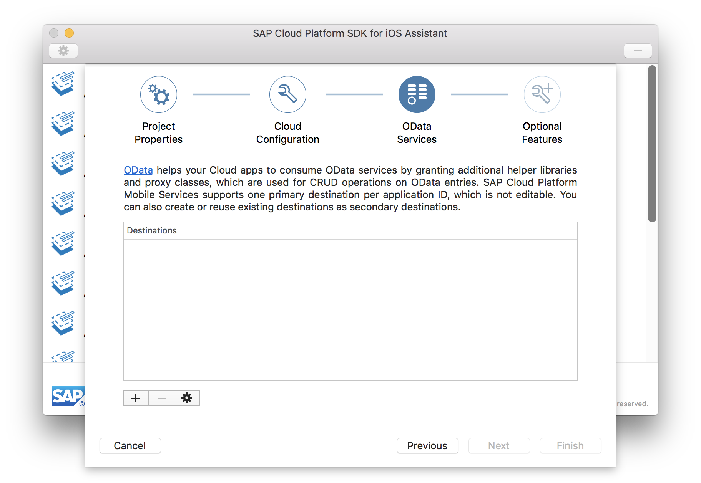

Click the **Plus** button, and from the context menu, select **New Destination...**. A dialog opens:

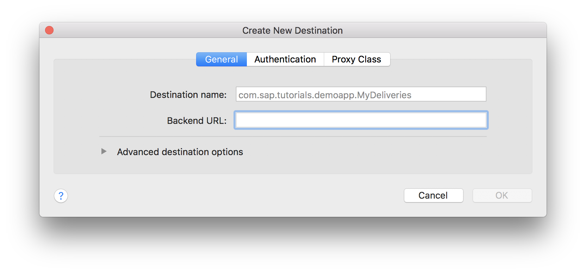

At the **General** tab, enter the following details:

| Field | Value |
|----|----|
| Destination name | `com.sap.tutorials.demoapp.MyDeliveries` |
| Backend URL | `https://sapdevsdd27584c4.us2.hana.ondemand.com/codejam/wwdc/services/DeliveryService.xsodata` |

Expand the **Advanced destination options** node, and set the following:

| Field | Value |
|----|----|
| Proxy Type | `Internet` |
| URL rewrite mode | `Rewrite URL` |
| Maximum connections | `Server default` |


At the **Authentication** tab, make sure **Authentication Type** is set to **No Authentication**.


Click **OK** to save the backend configuration. It is now listed in the available destinations:


Click **Next** to advance to the **Optional Features** step.

[DONE]
[ACCORDION-END]

[ACCORDION-BEGIN [Step 6: ](Optional Features)]

In the **Optional Features** page, you have the option to generate a **Master-Detail Application**, enable **logging** and **log uploads**, enable **remote notifications**, use **Discovery Service** and whether to use **Online** or **Offline** OData.

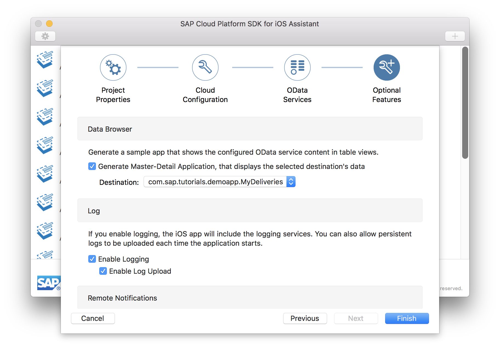

Make sure the checkboxes **Generate Master-Detail Application**, **Enable Logging**, **Enable Log Upload**, **Enable Remote Notification** and **Use Discovery Service** are selected, and the **OData Provider** radio button is set to **Use Online OData** to complete the wizard.

> Most likely the checkbox for **Remote Notifications** is disabled. This happens because no APNS endpoint is configured for the application definition in SAP Cloud Platform mobile service for development and operations. Once configured with a valid certificate, this option becomes available.


[DONE]
[ACCORDION-END]

[ACCORDION-BEGIN [Step 7: ](Generating the Xcode project)]

After you have clicked **Finish** in the previous step, the SDK Assistant now loads the OData service's metadata. This metadata describes the data model, and can be accessed via `<service URL>$metadata`. For your service, the metadata URL would be `https://sapdevsdd27584c4.us2.hana.ondemand.com/codejam/wwdc/services/DeliveryService.xsodata/$metadata`
Based on this metadata, the OData proxy classes will be generated for the Xcode project.

In addition, the configuration settings you have provided in the SDK Assistant are now being sent to SAP Cloud Platform mobile service for development and operations.

> **NB:** If you have already 5 native applications defined in SAP Cloud Platform mobile service for development and operations, the SDK Assistant will give the following error:

> 

> In that case, log on to your **SAP Cloud Platform mobile service for development and operations** account at `https://hcpmsadmin-<your_user_id>trial.dispatcher.hanatrial.ondemand.com/` and navigate to **Mobile Applications > Native/Hybrid**. Select one of the available application configurations and delete in order for the SDK Assistant to add the new application configuration.

[DONE]

[ACCORDION-END]

[ACCORDION-BEGIN [Step 8: ](Examine the generated Xcode Project)]

After the SDK Assistant has finished, **Xcode** will launch and open the just generated `MyDeliveries` project.

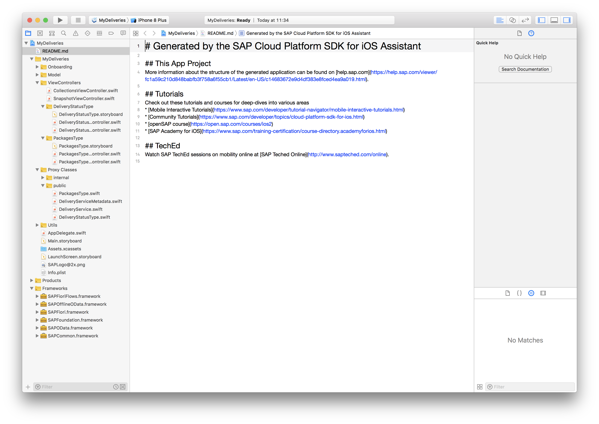

The `Main.storyboard` shows split-view setup for the generated Master-Detail views.

Folder `MyDeliveries/Onboarding` contains logic for the user on-boarding, authentication and handling of pass-codes and Touch ID.

Folder `Proxy Classes` contains the OData proxy classes generated from the OData service. File `DeliveryService.swift` acts as a data service provider to gain access to the OData entities. The two files `PackagesType.swift` and `DeliveryStatusType.swift` are classes for the OData entities `Packages` and `DeliveryStatus`, respectively. These classes give access to the various properties of the OData entities.

Folders `ViewControllers/PackagesType` and `ViewControllers/DeliveryStatusType` contain the master and detail view controllers as well as a storyboard for the `Packages` and `DeliveryStatus` entities, respectively.

[DONE]
[ACCORDION-END]

[ACCORDION-BEGIN [Step 9: ](Build and run the generated application)]

Click the **Run** button to build and run the generated application:

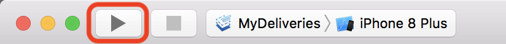

The **Simulator** app now launches. If you have configured the app to allow for push notifications, you will get the following pop-up:

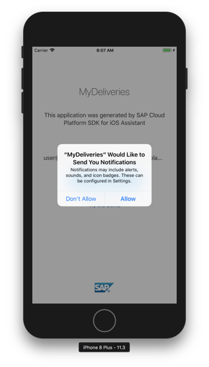

Press **Allow**. You now see the initial landing page:

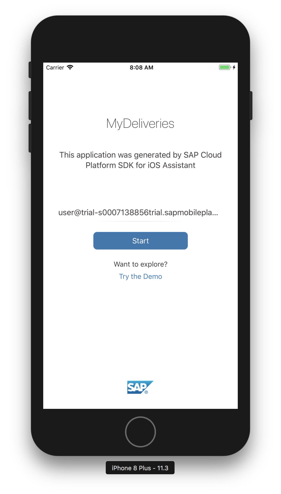

The application name is shown, with a little description. You have the option to show a demo version of the application (this should be implemented by hand, as this is not generated by the iOS Assistant) or run the actual, live application.

In this tutorial, you use the live application. Clicking the blue **Start** button to proceed.

The **OAuth** login screen of **SAP Cloud Platform mobile service for development and operations** is shown. Enter your login credentials for the SAP Cloud Platform and press the **Log On** button:

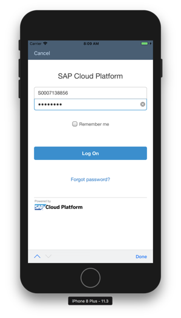

The app now displays the initial **Data Privacy** acknowledgement page. Click **Agree** to proceed.

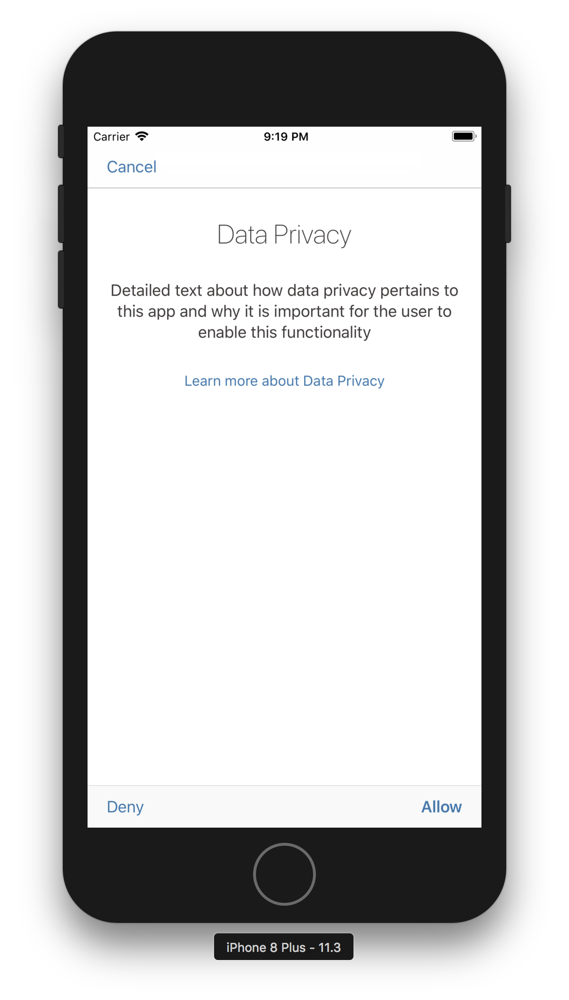

The app now proceeds with a 3-step wizard. First, you are presented the **Data Privacy** detail page. Click **Next** to proceed to the next step.

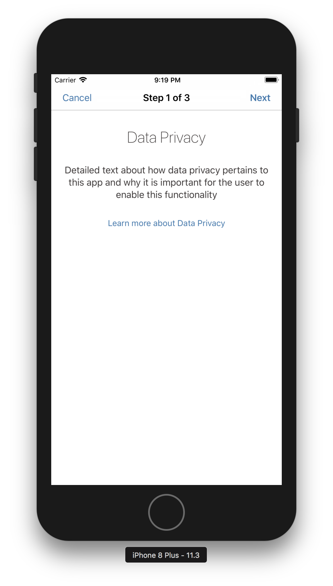

Next you are presented the **Security** detail page. Click **Next** to proceed to the next step.

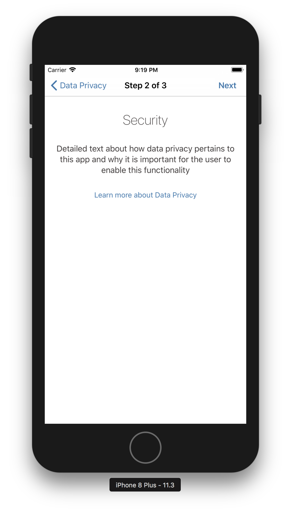

Lastly you are presented the **Consent** detail page. Click **Allow** to proceed.

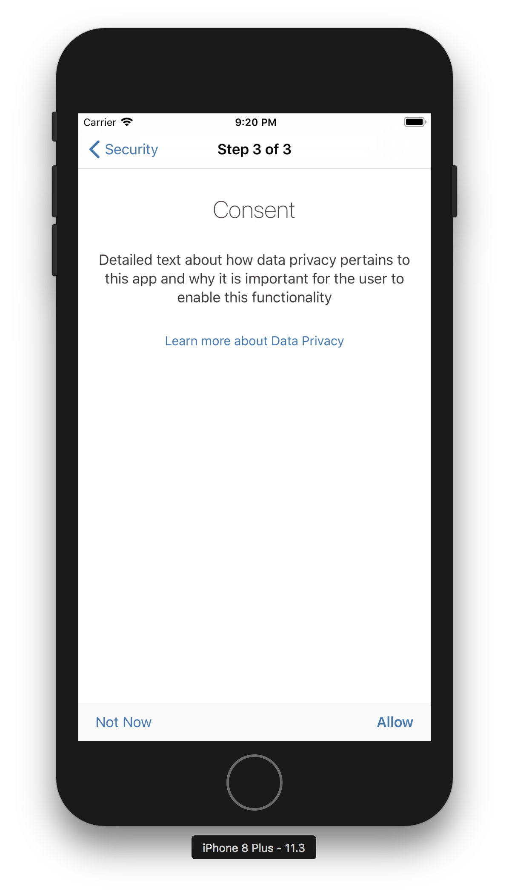

When you have finished the on-boarding steps, the application starts with an overview of the available **Collections** of the OData service:

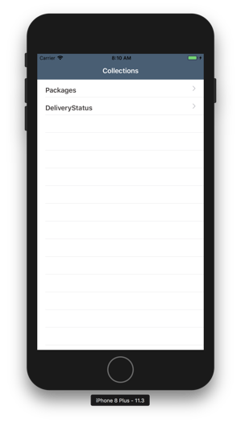

[DONE]
[ACCORDION-END]

[ACCORDION-BEGIN [Step 10: ](Examine the generated application)]

If you click on the `Packages` collection, you navigate to a **Master** list with all available `Package` entities:


If you click on one of the `Package` entities, you navigate to a **Detail** page which lists all the properties for the selected entity:

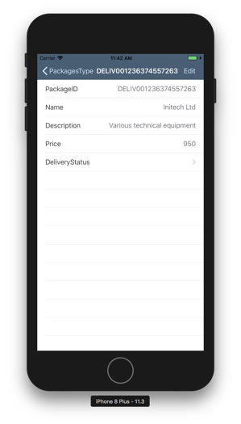

Notice the `DeliveryStatus` entry at the 5th row. If you click on this link, it will show the related `DeliveryStatus` entities for the current `Package`, based on the association in the OData service:

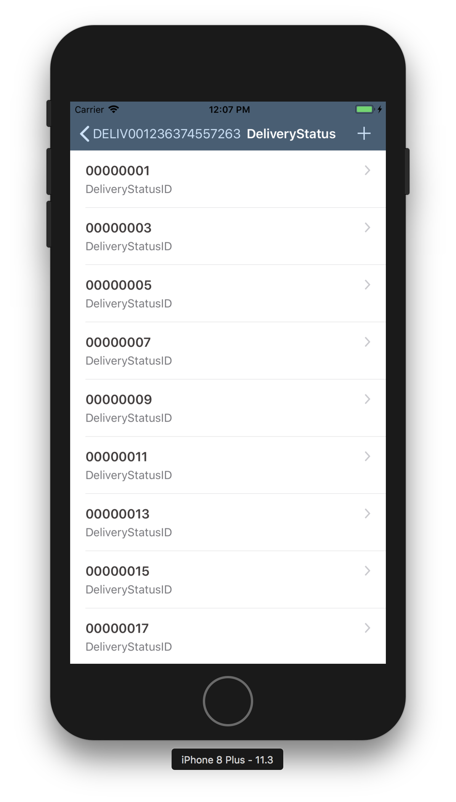

The OData service structure, and how the two entities are related, are explained in the next step.

[DONE]
[ACCORDION-END]

[ACCORDION-BEGIN [Step 11: ](Introduction to the SDK's OData API)]

The generated application demonstrates the OData proxy classes are working, browse their properties, and demonstrates push notifications and the various authentication mechanisms

Examine the OData service's metadata, which can be accessed via `https://sapdevsdd27584c4.us2.hana.ondemand.com/codejam/wwdc/services/DeliveryService.xsodata/$metadata`:

```xml
<?xml version="1.0" encoding="utf-8" standalone="yes" ?>
<edmx:Edmx Version="1.0" xmlns:edmx="http://schemas.microsoft.com/ado/2007/06/edmx">
  <edmx:DataServices m:DataServiceVersion="2.0" xmlns:m="http://schemas.microsoft.com/ado/2007/08/dataservices/metadata">
    <Schema Namespace="codejam.wwdc.services.DeliveryService" xmlns="http://schemas.microsoft.com/ado/2008/09/edm" xmlns:d="http://schemas.microsoft.com/ado/2007/08/dataservices" xmlns:m="http://schemas.microsoft.com/ado/2007/08/dataservices/metadata">
      <EntityType Name="DeliveryStatusType">
        <Key>
          <PropertyRef Name="DeliveryStatusID"/>
        </Key>
        <Property MaxLength="36" Name="DeliveryStatusID" Nullable="false" Type="Edm.String"/>
        <Property MaxLength="36" Name="PackageID" Type="Edm.String"/>
        <Property MaxLength="256" Name="Location" Type="Edm.String"/>
        <Property Name="DeliveryTimestamp" Type="Edm.DateTime"/>
        <Property MaxLength="16" Name="StatusType" Type="Edm.String"/>
        <Property Name="Selectable" Type="Edm.Int32"/>
        <Property MaxLength="128" Name="Status" Type="Edm.String"/>
      </EntityType>
      <EntityType Name="PackagesType">
        <Key>
          <PropertyRef Name="PackageID"/>
        </Key>
        <Property MaxLength="36" Name="PackageID" Nullable="false" Type="Edm.String"/>
        <Property MaxLength="256" Name="Name" Type="Edm.String"/>
        <Property MaxLength="256" Name="Description" Type="Edm.String"/>
        <Property Name="Price" Precision="10" Scale="2" Type="Edm.Decimal"/>
        <NavigationProperty FromRole="PackagesPrincipal" Name="DeliveryStatus" Relationship="codejam.wwdc.services.DeliveryService.PackageDeliveryStatusType" ToRole="DeliveryStatusDependent"/>
      </EntityType>
      <Association Name="PackageDeliveryStatusType">
        <End Multiplicity="1" Role="PackagesPrincipal" Type="codejam.wwdc.services.DeliveryService.PackagesType"/>
        <End Multiplicity="*" Role="DeliveryStatusDependent" Type="codejam.wwdc.services.DeliveryService.DeliveryStatusType"/>
        <ReferentialConstraint>
          <Principal Role="PackagesPrincipal">
            <PropertyRef Name="PackageID"/>
          </Principal>
          <Dependent Role="DeliveryStatusDependent">
            <PropertyRef Name="PackageID"/>
          </Dependent>
        </ReferentialConstraint>
      </Association>
      <EntityContainer Name="DeliveryService" m:IsDefaultEntityContainer="true">
        <EntitySet EntityType="codejam.wwdc.services.DeliveryService.DeliveryStatusType" Name="DeliveryStatus"/>
        <EntitySet EntityType="codejam.wwdc.services.DeliveryService.PackagesType" Name="Packages"/>
        <AssociationSet Association="codejam.wwdc.services.DeliveryService.PackageDeliveryStatusType" Name="PackageDeliveryStatus">
          <End EntitySet="Packages" Role="PackagesPrincipal"/>
          <End EntitySet="DeliveryStatus" Role="DeliveryStatusDependent"/>
        </AssociationSet>
      </EntityContainer>
    </Schema>
  </edmx:DataServices>
</edmx:Edmx>
```

As you can see, it is a fairly simple data model containing two Entity Sets (or tables) called `Packages` and `DeliveryStatus`. Each entity in the set (or record) is identified as a `PackagesType` and `DeliveryStatusType`, respectively.

There is also an association between `PackagesType` and `DeliveryStatusType`, where a single `PackagesType` can have related `DeliveryStatusType`'s with a `0..n` cardinality.

We will now show for each `PackageType` its related `DeliveryStatusType`'s, shown in a timeline in ascending order (newest on top). The timeline will be build using **SAP Fiori for iOS controls**.

Using the SDK's `SAPOData` framework, you can create OData queries in a really simple way. Instead of executing SQL statements, the SDK provides a 'fluent interface' or 'method chaining' approach to constructing queries, which makes the code much more readable.

A query to get all `DeliveryStatus` entities for a particular `Package` would then be something like this:

```swift
 // Method 1
 let query = DataQuery()
     // SELECT * FROM DeliveryStatus
     .from(DeliveryServiceMetadata.EntitySets.deliveryStatus)
     // WHERE DeliveryStatus.packageID == <selected package ID>
     .where(DeliveryStatusType.packageID.equal((currentEntity?.packageID)!))
```

The result of this query is an array of `DeliveryStatusType` objects.

With OData, you can even have greater flexibility. Since there is a one-to-many association (or 'Navigation Link') between `Package` and `DeliveryStatus`, you could also load the `Package` object and all related child `DeliveryStatus` entities at once:

```swift
 // Method 2
 let query = DataQuery()
     // SELECT * FROM Packages
     .from(DeliveryServiceMetadata.EntitySets.packages)
     // WHERE <primary key> = <selected package ID>
     .withKey(PackagesType.key(packageID: currentEntity?.packageID))
     // LEFT JOIN DeliveryStatus ON <abstracted, defined in association>
     .expand(PackagesType.deliveryStatus)
```

Using the generated OData Proxy classes, you can then simply access the `PackagesType` related `DeliveryStatusType` objects:


<!--
> **NB:** Since the SDK Assistant generated app by default does not support OData Navigation Links, it takes a bit more effort to enable this. Furthermore, sorting an expanded entity set is only supported in OData V4, and this tutorial uses an OData V2 service. Therefore, in this tutorial we'll simply query the `DeliveryStatus` entities for each `Package`.
-->

[DONE]
[ACCORDION-END]

[ACCORDION-BEGIN [Step 12: ](Change sort order)]

By default, if you click on the `DeliveryStatus` link in the detail page for a selected `Package`, you would get the related entities in whatever order the OData service returns them. Ideally, you want these to show sorted, with the latest status on top.

In Xcode, open the file `MyDeliveries/ViewControllers/PackagesType/PackagesTypeDetailViewController.swift` and locate method `tableView(_:, didSelectRowAt indexPath:)`.

Here you see, when clicking on the 5th row named `DeliveryStatus`, the associated storyboard is loaded, and the `PackageType`'s related `DeliveryStatusType` entities are loaded using the `self.deliveryService.loadProperty` method.

Currently, the method receives two arguments; the associated property is passed, and the instance field into which the results should be stored. However, the method can receive a 3rd argument with a `DataQuery` instance.

Since we want the results in descending order, add the following as a 3rd argument:

```swift
DataQuery().orderBy(DeliveryStatusType.deliveryTimestamp, SortOrder.descending)
```

...so the code with the method call looks like this:

```swift
self.deliveryService.loadProperty(PackagesType.deliveryStatus,
                                  into: self.entity,
                                  query: DataQuery().orderBy(DeliveryStatusType.deliveryTimestamp,
                                                             SortOrder.descending)) { error in
    self.hideFioriLoadingIndicator()
    if let error = error {
        completionHandler(nil, error)
        return
    }
    completionHandler(self.entity.deliveryStatus, nil)
}
```

The method now receives a query object, indicating you want to sort on the `deliveryTimestamp` field of the `DeliveryStatusType` entity, in descending order.

[DONE]
[ACCORDION-END]

[ACCORDION-BEGIN [Step 13: ](Explore SAP Fiori Timeline cells with the SAP Fiori Mentor app)]

Since we want to display the `DeliveryStatus` items in a timeline, the best way to achieve this is to use the SDK's `FUITimeline` table view cell control. A great tool for exploring SAP Fiori for iOS controls and help implementing these into your project is the **SAP Fiori Mentor app**. This is a companion tool to the SDK, and can be downloaded for iPad from the Apple App Store.

Open the SAP Fiori Mentor app on your iPad. Upon opening, the app shows an overview page:

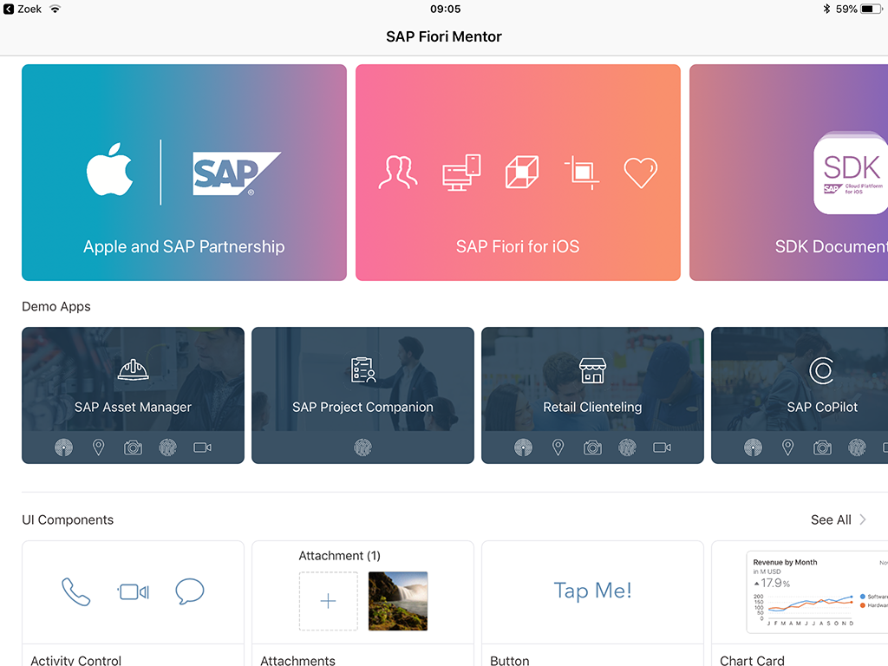

Click on the **See All** link next to the **UI Components** section, and scroll down until you see the **Timeline Cell** tile:


Click the **Timeline Cell** tile. You now see a page with a representation of the SAP Fiori Timeline cell, and a couple of preset styles to change the look and feel for the control.

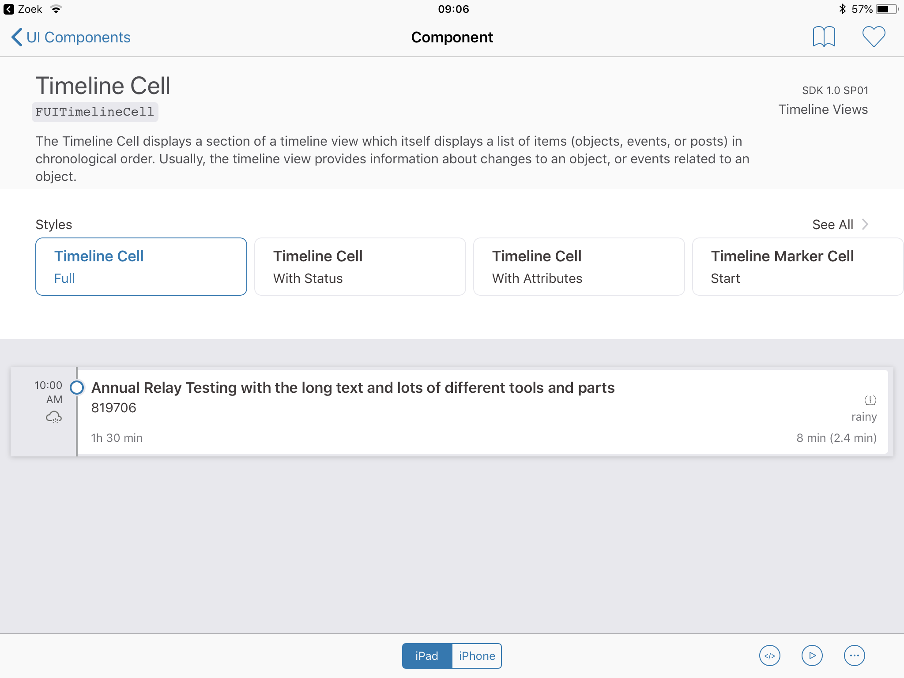

You can also customize the look and feel on a more granular level. Click the **button with three dots** in the lower right corner. This will bring a pop up where you can specify different settings for the control. The control's look and feel is instantly updated, giving you an idea of the final result:

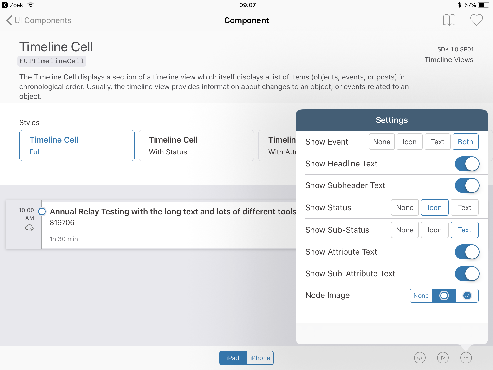

When you're happy with the final result, click the **Code button** (the one labeled `</>`). This will bring a pop up with a sample `UITableViewController` class, and all the properties you have set or enabled in the **Control Settings** pop-up are reflected in the generated code:

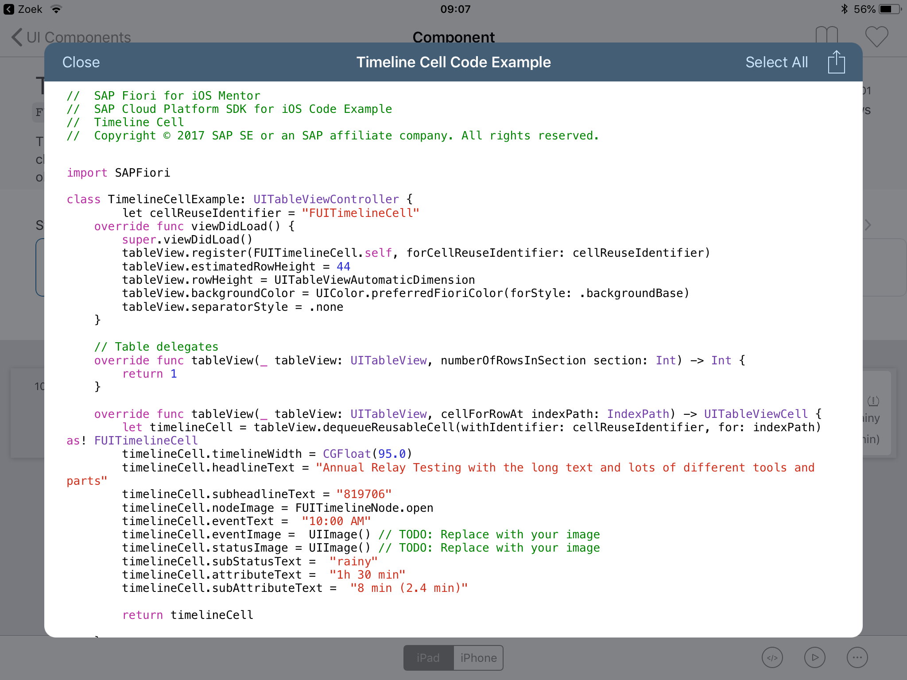

To use the generated code in Xcode, click the **Share** button in the top-right, and use **AirDrop** to transfer to your Mac:


Open the downloaded text file:


The generated code can now be implemented into the appropriate places in the `TrackingInfoViewController.swift` file.

>   **NOTE** Since it may take a bit too long to go through the steps of copying and pasting the code, adding the control binding to the Proxy Classes' properties and format the data properly, you don't need to do this yourself. The code to implement will be provided in the next tutorial.

[DONE]
[ACCORDION-END]

[ACCORDION-BEGIN [Step 14: ](Initialize table layout)]

In this step, you implement Fiori Timeline cells to show the `DeliveryStatus` entities in a logical way.

Open the file `./MyDeliveries/ViewControllers/DeliveryStatusType/DeliveryStatusTypeMasterViewController.swift` and locate the method `viewDidLoad()`.

Locate the line `self.tableView.estimatedRowHeight = 98` and remove it.

In place of the just removed line of code, add the following:

```swift
self.tableView.register(FUITimelineCell.self, forCellReuseIdentifier: "FUITimelineCell")
self.tableView.register(FUITimelineMarkerCell.self, forCellReuseIdentifier: "FUITimelineMarkerCell")
self.tableView.estimatedRowHeight = 44
self.tableView.backgroundColor = UIColor.preferredFioriColor(forStyle: .backgroundBase)
self.tableView.separatorStyle = .none
```

> **NOTE** The above code originated from the **SAP Fiori for iOS Mentor** app, but has been slightly modified to show both `FUITimelineCell` and `FUITimelineMarkerCell` control.

[DONE]
[ACCORDION-END]

[ACCORDION-BEGIN [Step 15: ](Implement FUITimelineCell logic)]

Next, locate method `tableView(_ tableView:, cellForRowAt indexPath:)`.

Replace it with the following:

```swift
override func tableView(_ tableView: UITableView, cellForRowAt indexPath: IndexPath) -> UITableViewCell {
    let deliverystatustype = self.entities[indexPath.row]
    if deliverystatustype.selectable != 0 {
        return self.getFUITimelineCell(deliverystatustype: deliverystatustype, indexPath: indexPath)
    }
    else {
        return self.getFUITimelineMarkerCell(deliverystatustype: deliverystatustype, indexPath: indexPath)
    }
}

```

Finally, add the following methods:

```swift
private func getFUITimelineMarkerCell(deliverystatustype: DeliveryStatusType, indexPath: IndexPath) -> UITableViewCell {

    let cell = tableView.dequeueReusableCell(withIdentifier: "FUITimelineMarkerCell", for: indexPath)
    guard let timelineCell = cell as? FUITimelineMarkerCell else {
        return cell
    }
    timelineCell.nodeImage = self.getNodeImage(statusType: deliverystatustype.statusType!)
    timelineCell.showLeadingTimeline = indexPath.row == 0 ? false : true
    timelineCell.showTrailingTimeline = indexPath.row == self.entities.count - 1 ? false : true
    timelineCell.eventText = self.getFormattedDateTime(timestamp: deliverystatustype.deliveryTimestamp!)
    timelineCell.titleText = deliverystatustype.status

    return timelineCell
}

private func getFUITimelineCell(deliverystatustype: DeliveryStatusType, indexPath: IndexPath) -> UITableViewCell {

    let cell = tableView.dequeueReusableCell(withIdentifier: "FUITimelineCell", for: indexPath)
    guard let timelineCell = cell as? FUITimelineCell else {
        return cell
    }
    timelineCell.nodeImage = self.getNodeImage(statusType: deliverystatustype.statusType!)
    timelineCell.eventText = self.getFormattedDateTime(timestamp: deliverystatustype.deliveryTimestamp!)
    timelineCell.headlineText = deliverystatustype.status
    timelineCell.subheadlineText = deliverystatustype.location

    return timelineCell
}

private func getFormattedDateTime(timestamp: LocalDateTime) -> String {
    let formatter = DateFormatter()
    formatter.dateFormat = "MM/dd HH:mm"

    return formatter.string(from: timestamp.utc())
}

private func getNodeImage(statusType: String) -> UIImage {
    switch statusType {
    case "start"    : return FUITimelineNode.start
    case "inactive" : return FUITimelineNode.inactive
    case "complete" : return FUITimelineNode.complete
    case "earlyEnd" : return FUITimelineNode.earlyEnd
    case "end"      : return FUITimelineNode.end
    default         : return FUITimelineNode.open
    }
}
```

The changed method `tableView(_ tableView:, cellForRowAt indexPath:)` decides based on `DeliveryStatus` property `selectable` which specific timeline cell to render. This rendering is done via two private methods `getFUITimelineMarkerCell(deliverystatustype:, indexPath:)` and `getFUITimelineCell(deliverystatustype:, indexPath:)`.

> These two private methods are implemented based on the code from the **SAP Fiori for iOS Mentor** app, but the code from the Mentor app has been split into two separate functions and control binding has already been implemented for easier implementation in this tutorial.

The final two private methods are helpers to format the timestamp into something more readable, and to get the correct `FUITimelineNode` image indicator based on the `DeliveryStatus` property `StatusType`.

[DONE]
[ACCORDION-END]

[ACCORDION-BEGIN [Step 16: ](Remove the DeliveryStatusType from the collections screen)]

Since you're not interested in displaying the whole collection of `DeliveryStatusType` objects fro the Collections screen, you may want to remove it so you only have the `Packages` visible.

Open file `./MyDeliveries/Model/CollectionType.swift` and change the constant `all` to only return packages:

```swift
static let all = [
    packages
]
```

[DONE]
[ACCORDION-END]


[ACCORDION-BEGIN [Step 17: ](Run the application)]

Build and run the application. Navigate to the `Packages` master page and select a package. If you now click on the `DeliveryStatus` cell, you'll navigate to the `DeliveryStatusTypeMasterViewController`, and the `Package`'s related `DeliveryStatus` records are now shown in descending order using two flavors of the **Fiori Timeline** cell control.

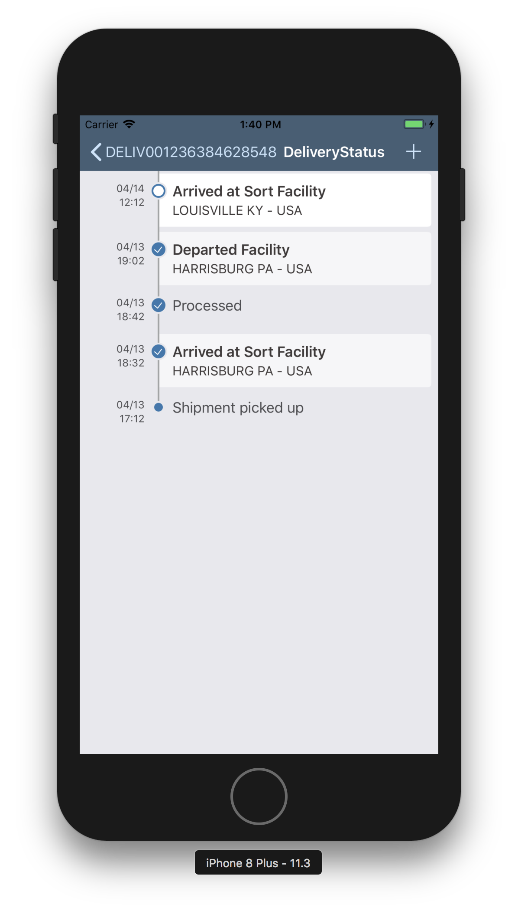

[DONE]
[ACCORDION-END]

[ACCORDION-BEGIN [Step 18: ](Data Visualization example)]

In this tutorial step, you will be introduced to the data visualization capabilities of the SDK. For brevity, some static data is used, but this can easily be changed to OData entities, like you did with the implementation of the Timeline Cell in the previous steps.

In the **Project navigator**, navigate to the `MyDeliveries/ViewControllers/PackagesType` folder. Right-click this folder, and from the context menu, select **New File...**

In the dialog, select **Cocoa Touch Class**:


Click **Next**.

First, set the **Subclass** to `UIViewController`.

Then, change the **Class** to `ChartViewController`.

> The above order is important; if you first specify the name, and then set the subclass, the name will be changed with a suffix indicating the subclass.


Click **Next** to continue. Check that the file is saved in the `PackagesType` group, and click **Create** to finalize the wizard. The new file will now open.

However, the Cocoa Touch class you have just created subclasses `UIViewController`. In order to show the SDK's data visualizations, it should subclass `FUIChartFloorplanViewController`.

First, add the necessary import statements:

```swift
import SAPFoundation
import SAPFiori
import SAPCommon
```

Then, change the signature of the class so it now extends from `FUIChartFloorplanViewController`:

```swift
class ChartViewController: FUIChartFloorplanViewController {

```

Now you have the scaffolding for the data visualizations class. We'll leave it for now, the actual implementation will be finalized in a later step.

[DONE]

[ACCORDION-END]

[ACCORDION-BEGIN [Step 19: ](Add View Controller to Storyboard)]

Open the `PackagesType.storyboard` file, and from the **Object library**, drag a **View Controller** onto the storyboard. Set the **title** to **Chart View**:


Now switch to the **Identity inspector** and set the **Custom Class** to `ChartViewController`:


Drag a **Table View Cell** onto the **Detail Table View**, and set the following properties in the **Attribute inspector**:

| Field | Value |
|----|----|
| Identifier | `NavToShowChart` |
| Accessory | `Disclosure Indicator` |

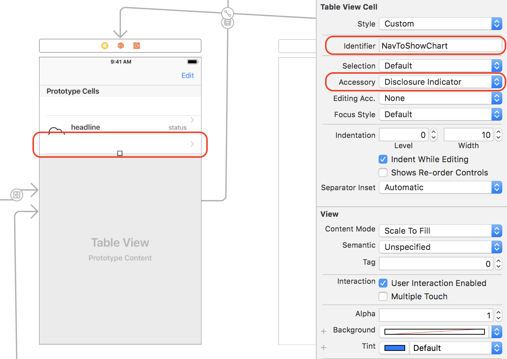

**Control-click** the just added **Table View Cell** and drag it onto the **Chart View Scene**. From the **Segue** pop-up, choose **Show**.

With the segue selected, go to the **Attributes inspector** and provide the name `showChart` as its **Identifier**:


[DONE]

[ACCORDION-END]

[ACCORDION-BEGIN [Step 20: ](Implement Table View Cell for Chart)]

Open file `./MyDeliveries/ViewControllers/PackagesType/PackagesTypeDetailViewController.swift`.

Locate method `tableView(_: UITableView, numberOfRowsInSection _: Int)`. Currently it returns **5** rows, the total number of properties the `Package` entity has. However, since you added an extra Table View Cell to navigate to the Chart View scene, you want to make this extra cell visible.

Set the return value to `6`:

```swift
override func tableView(_: UITableView, numberOfRowsInSection _: Int) -> Int {
    return 6
}
```
Next, locate method `tableView(_ tableView: UITableView, cellForRowAt indexPath: IndexPath)`.

To display the added Table View Cell, add an extra `case` statement, just above the `default:` switch:

```swift
case 5:
    let navigationLink = tableView.dequeueReusableCell(withIdentifier: "NavToShowChart",
        for: indexPath) as UITableViewCell
    navigationLink.textLabel?.text = "Show Waiting Time..."
    return navigationLink
```

[DONE]
[ACCORDION-END]

[ACCORDION-BEGIN [Step 21: ](Implement Chart View Controller)]

In the **Project navigator**, navigate to the `MyDeliveries/ViewControllers/PackagesType` folder and open the `ChartViewController.swift` file you have created in step 23.

Replace the `viewDidLoad` method with the following:

```swift
override func viewDidLoad() {
    super.viewDidLoad()

    title = "Waiting Time"
    chartView.chartType = .bar
    // chartView.numberOfGridlines = 4
    chartView.dataSource = self

    summaryView.dataSource = self
    titleText.text = "Duration"
    status.text = "Click chart for details"
    categoryAxisTitle.text = "Location"
    valuesAxisTitle.text = "Waiting time in hours"
}
```

This sets the default settings for the chart, in this case, a bar chart.

A couple of errors are now shown. That is because the chart's data source is not yet implemented.

At the bottom of the file, add the following two extensions:

```swift
extension ChartViewController: FUIChartSummaryDataSource {

    func chartView(_ chartView: FUIChartView, summaryItemForCategory categoryIndex: Int) -> FUIChartSummaryItem? {

        let item = FUIChartSummaryItem()
        item.categoryIndex = categoryIndex
        item.isPreservingTrendHeight = false

        switch categoryIndex {
        case -1:
            item.isEnabled = false

            let values: [Double] = {
                var values: [Double] = []
                for series in chartView.series {
                    let categoriesUpperBound = series.numberOfValues - 1
                    if let valuesInSeries = series.valuesInCategoryRange((0...categoriesUpperBound), dimension: 0) {
                        values.append(valuesInSeries.compactMap({ $0 }).reduce(0.0, +))
                    }
                }
                return values
            }()

            let numberFormatter  = NumberFormatter()
            numberFormatter.maximumFractionDigits = 0

            item.valuesText = values.map { "\(numberFormatter.string(from: $0 as NSNumber)!) hours" }
            item.title.text = "Total wait time"

        default:
            item.isEnabled = true

            let values: [Double] = {
                var values: [Double] = []
                for series in chartView.series {
                    values.append(series.valueForCategory(categoryIndex, dimension: 0)!)
                }
                return values
            }()

            item.valuesText = values.map { formattedTitleForDouble($0)! }
            item.title.text = chartCategoryTitles()[categoryIndex]
        }

        return item
    }
}

extension ChartViewController: FUIChartViewDataSource {

    // MARK: - FUIChartViewDataSource methods
    func numberOfSeries(in: FUIChartView) -> Int {
        return chartData().count
    }

    func chartView(_ chartView: FUIChartView, numberOfValuesInSeries seriesIndex: Int) -> Int {
        return chartData()[seriesIndex].count
    }

    func chartView(_ chartView: FUIChartView, valueForSeries seriesIndex: Int, category categoryIndex: Int, dimension dimensionIndex: Int) -> Double? {
        return chartData()[seriesIndex][categoryIndex]
    }

    func chartView(_ chartView: FUIChartView, formattedStringForValue value: Double, axis: FUIChartAxisId) -> String? {
        return formattedTitleForDouble(value)
    }

    func chartView(_ chartView: FUIChartView, titleForCategory categoryIndex: Int, inSeries seriesIndex: Int) -> String? {
        return chartCategoryTitles()[categoryIndex]
    }

    // MARK: - helper methods for generating & formatting sample dat

    func chartSeriesTitles() -> [String] {
        return ["Actual", "Target"]
    }
    func chartCategoryTitles() -> [String] {
        return ["Shipment picked up", "HONG-KONG", "AMSTERDAM", "LONDON-HEATHROW", "READING", "Delivered"]
    }

    func chartData() -> [[Double]] {
        return [[2, 42, 32, 7, 5, 1]]
    }

    func formattedTitleForDouble(_ value: Double) -> String? {
        let numberFormatter = NumberFormatter()
        numberFormatter.maximumFractionDigits = 0
        return numberFormatter.string(from: value as NSNumber)
    }

}
```

The first extension draws the chart items.

The chart item at `categoryIndex` value `-1` is the "pinned" or "fixed position" item in the chart's summary header.
The chart item at the other or `default` positions are the actual chart items.

The second extension supplies the data to the chart. Here you see the hard-coded values for the category titles and chart data.

If you now build and run the application, and click on one of the **Packages** entities, you now see the added link to the chart:

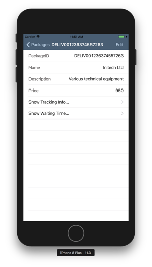

If you click the **Show Waiting Time...** link, you now see the bar chart with the delivery waiting times, and calculated total waiting time (89 hours):

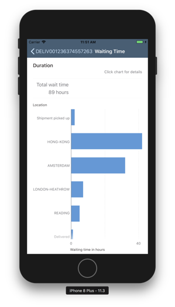

If you now click on one of the bars in the chart, the item's details are shown in the summary header:

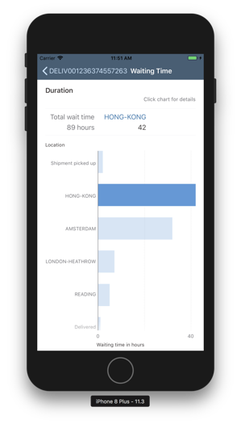

[DONE]
[ACCORDION-END]

[ACCORDION-BEGIN [Step 22: ](Create a NUI stylesheet)]

In these final tutorial steps, you will apply a custom theme to your iOS app using [`NUI`](https://github.com/tombenner/nui). `NUI` enables you to style iOS components with style sheets similar to CSS. `NUI` is already integrated in the SAP Cloud Platform SDK for iOS so you don't need to install anything.

In Xcode, right-click the `MyDeliveries` folder and from the context menu, select **New File...**. In the dialog, scroll down to the **Other** section and select the **Empty** template:


Click **Next** to proceed.

In the next screen, provide the following details:

| Field | Value |
|----|----|
| File Name | `CustomTheme.nss` |


Make sure it is saved in the `MyDeliveries` group and click **Create**. The new `CustomTheme.nss` file is now created in the root of your project.

[DONE]
[ACCORDION-END]

[ACCORDION-BEGIN [Step 23: ](Add styles to the stylesheet)]

The styles in the stylesheet can be applied to both standard iOS components such as `UINavigationBar`, `UITableView` etc. as well as SAP Fiori for iOS components.

For a reference of the standard iOS components classes, you can refer to [NUI style classes](https://github.com/tombenner/nui#style-classes).

For SAP Fiori for iOS components style classes, the following conventions should be followed:

- Global definitions
   - `fdl<lower camelcase enum name>_<property name>`
   - example: `fdlFontStyle_subheadline`

- SAP Fiori component specific definitions
   - `fdl<class name>_<property name>`
   - example: `fdlFUIWelcomeScreen_primaryActionButton`

Open the just created `CustomTheme.nss` file, and add the following:

```css
NavigationBar {
    bar-tint-color: #B0D450;
}

BarButton {
    font-color: #3A835B;
}

/* Onboarding Welcome Screen */
fdlFUIWelcomeScreen_headlineLabel {
    font-color: #3A835B;
}

/* Fiori subheadline */
fdlFontStyle_subheadline {
    font-style: subheadline;
    font-color: #3A835B;
}

/* Fiori Timeline cells */
fdlFUITimelineCell, fdlFUITimelineMarkerCell {
    background-color: #E0F0B9;
}

fdlFUITimelineCell_timelineBackground,
fdlFUITimelineMarkerCell_cardBackground,
fdlFUITimelineMarkerCell_timelineBackground {
    background-color: #E0F0B9;
}

/* Fiori Data Vizualization */
fdlFUIChartFloorplanViewController_title,
fdlFUIChartFloorplanViewController_seriesTitles,
fdlFUIChartFloorplanViewController_valuesAxisTitle,
fdlFUIChartFloorplanViewController_categoryAxisTitle {
    font-color: #3A835B;
}
```

This adds a light-green tint to the standard iOS navigation bar as well as a darker green for the navigation bar buttons.

The standard SAP Fiori `subheadline` font style (member of the SDK's `SAPFiori FDLFontStyle` enum) is also changed to green, as is the on-boarding's application title and primary action button.

The SAP Fiori Timeline cells get a light green background, and the SAP Fiori Data Visualization chart texts will be the same dark green as the headlines.

[DONE]
[ACCORDION-END]


[ACCORDION-BEGIN [Step 24: ](Change chart bar color)]

The chart bars are normally not styled with a stylesheet, since you would rather have them colored based on their context and/or value.

However, you could easily change the default Fiori blue to a dark green color by adding the following line in the body of the `chartView` method inside the `ChartViewController: FUIChartSummaryDataSource` extension:

```swift
chartView.series.colors = [UIColor(hexString: "#3A835B")]
```

[DONE]
[ACCORDION-END]

[ACCORDION-BEGIN [Step 25: ](Load stylesheet)]

In order for your app to apply the custom styles, you need to tell your app to use the custom stylesheet.

Open the app's `AppDelegate.swift` file, and in method `application(_:didFinishLaunchingWithOptions:)`, at the top of the method's body, add the following line:

```swift
NUISettings.initWithStylesheet(name: "CustomTheme")
```

This tells your app to use `NUI` with your custom stylesheet `CustomTheme.nss`.

[DONE]
[ACCORDION-END]

[ACCORDION-BEGIN [Step 26: ](Build and run the app)]

First, remove the app from your device, so you will go through the onboarding again.

Then build and run the app.

When launched, you should now see the restyled on-boarding screen with the greenish theme:

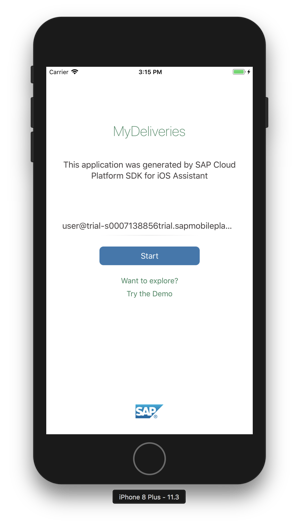

If you proceed further, you will see the navigation bar is also styled:


And, unsurprisingly, the custom UI you have created earlier follows the same theme:

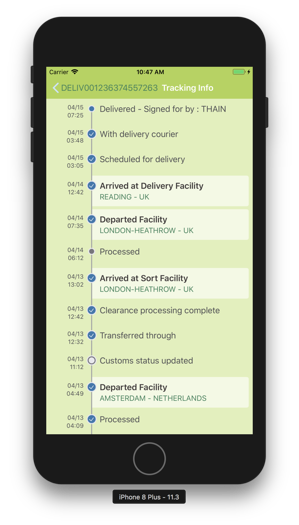

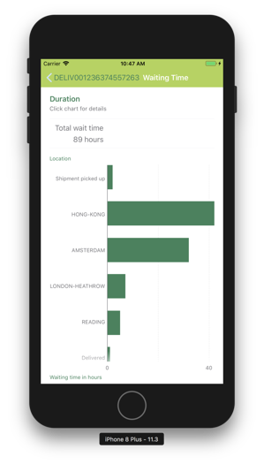

> For more on theming SAP Fiori for iOS components, see [Branding & Theming](https://help.sap.com/doc/978e4f6c968c4cc5a30f9d324aa4b1d7/Latest/en-US/Documents/Frameworks/SAPFiori/Branding%20and%20Theming.html)

> For more on `NUI`, see [NUI readme](https://github.com/tombenner/nui/)

[VALIDATE_1]
[ACCORDION-END]

---
