## Prerequisites  
- **Proficiency:** Intermediate
- **Tutorials:** [Sign up for a free trial account on SAP Cloud Platform](https://www.sap.com/developer/tutorials/hcp-create-trial-account.html) and [Enable SAP Cloud Platform mobile service for development and operations](https://www.sap.com/developer/tutorials/fiori-ios-hcpms-setup.html)

## Next Steps
 - [View all How-Tos](http://www.sap.com/developer/tutorial-navigator.how-to.html)


## How-To Details
In this small How-To tutorial, you will create a Fiori for iOS application which will show tracking info for purchased packages. This application has the following characteristics:

 - Connects to an SAP HANA MDC (Multi-tenant Database Container) XS OData service. It contains records of packages and their delivery status.
 - Use simplified OData querying with the SAP Cloud Platform SDK for iOS
 - Implement SAP Fiori for iOS controls to show timeline data

When you are ready, your SAP Fiori for iOS application will resemble the following:


> Before you start, make sure you:

> - have a trial account on SAP Cloud Platform. See [Sign up for a free trial account on SAP Cloud Platform](https://www.sap.com/developer/tutorials/hcp-create-trial-account.html) for more information.
> - enabled SAP Cloud Platform mobile service for development and operations. See [Enable SAP Cloud Platform mobile service for development and operations](https://www.sap.com/developer/tutorials/fiori-ios-hcpms-setup.html) for more information.


### Time to Complete
**45 Min**.

---

[ACCORDION-BEGIN [Step 1: ](Open SAP Cloud Platform mobile service for development and operations cockpit)]

Open the SAP Cloud Platform mobile service for development and operations cockpit at `https://hcpmsadmin-<your user id>trial.dispatcher.hanatrial.ondemand.com/`

After logging in, you should see the cockpit's landing page:

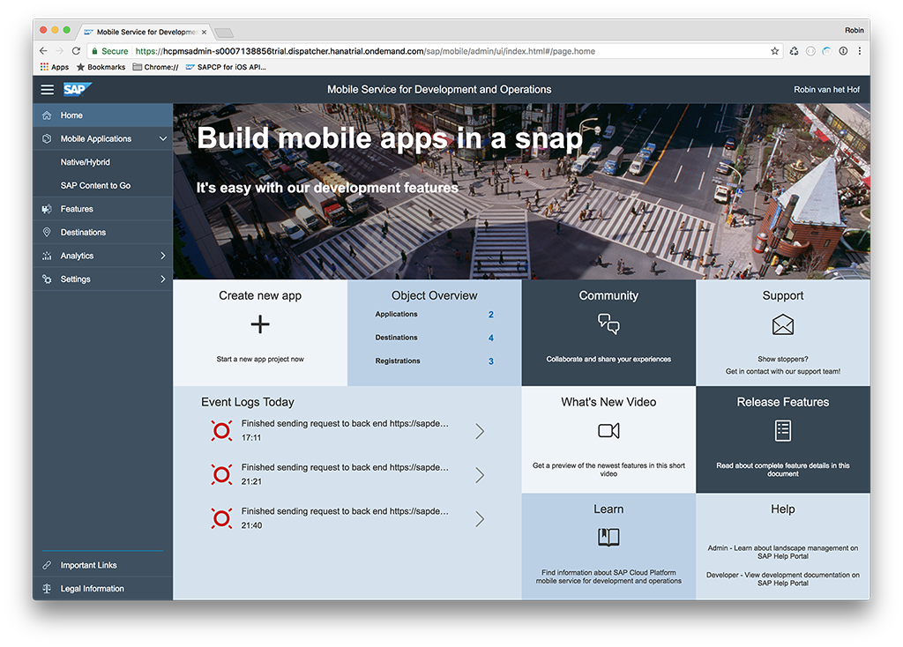


[ACCORDION-END]

[ACCORDION-BEGIN [Step 2: ](Create a new application definition)]

Click on the big **Plus** sign in the tile **Create new app**. In the dialog that appears, you define a new mobile application definition. Enter the following details:

| Field | Value |
|----|----|
| Configuration Templates | `Native` |
| ID | `com.sap.wwdc.codejam` |
| Name | `My Deliveries` |

> For the purpose of this demo, fields **Description** and **Vendor** can be left empty.

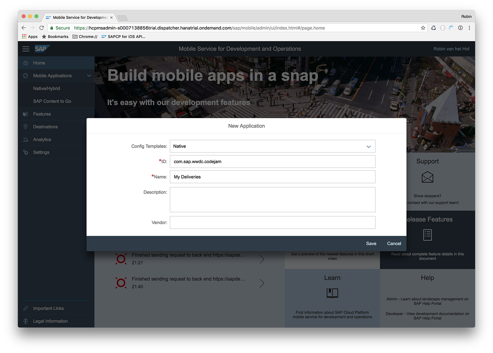

Click **Save** when finished. You are now in the **"My Deliveries" Application Details** screen:

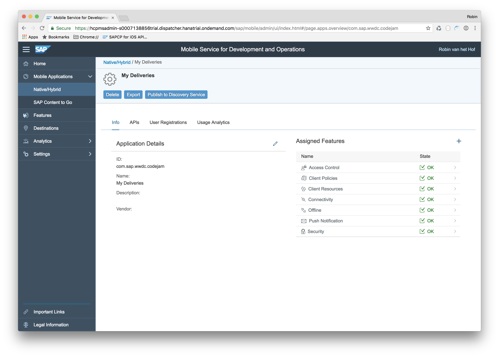


[ACCORDION-END]


[ACCORDION-BEGIN [Step 3: ](Add a back end connection)]

In the **Assigned Features** panel on the right, click the **Connectivity** row. This opens the **Connectivity Page**:

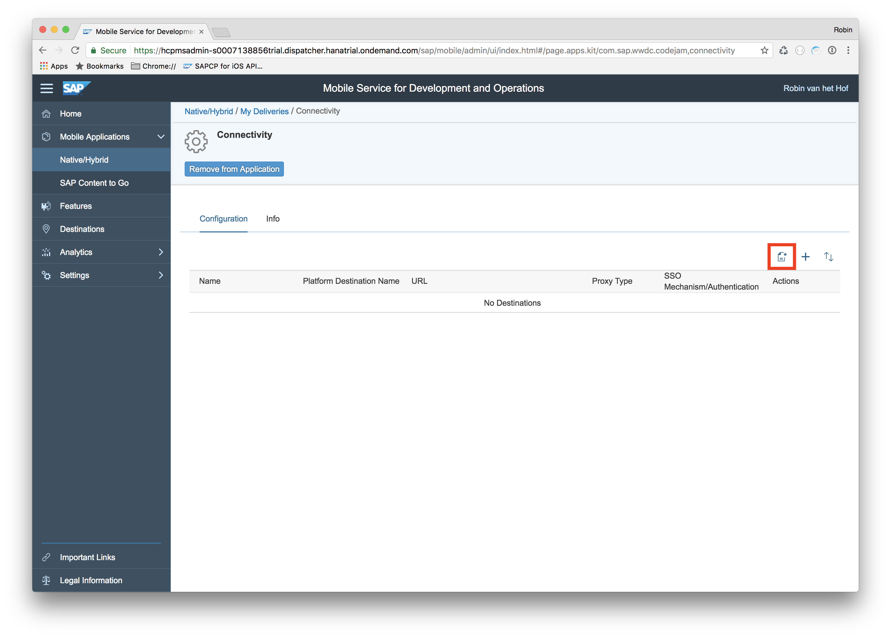

Click the **Add New Connection** icon. In the wizard that appears, enter the following details:

| Field | Value |
|----|----|
| Type | `Mobile Destination` |
| Destination Name | `com.sap.wwdc.codejam` |

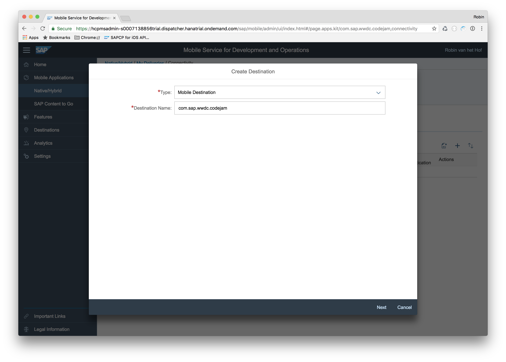

Click **Next**. In the next page of the wizard, enter the following connection details:

| Field | Value |
|----|----|
| URL | `https://sapdevsdd27584c4.us2.hana.ondemand.com/codejam/wwdc/services/DeliveryService.xsodata` |
| Proxy Type | `Internet` |
| Maximum Connections | `10` |
| Rewrite Mode | `Rewrite URL` |

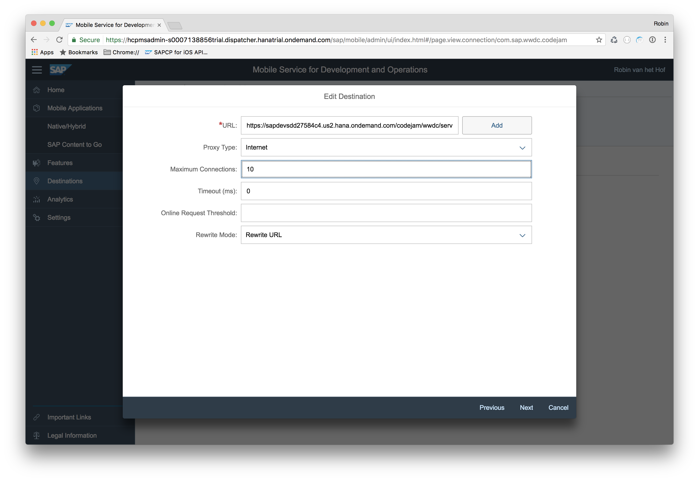

Click **Next**. In the next page of the wizard, set the **SSO Mechanism** to `No Authentication`:

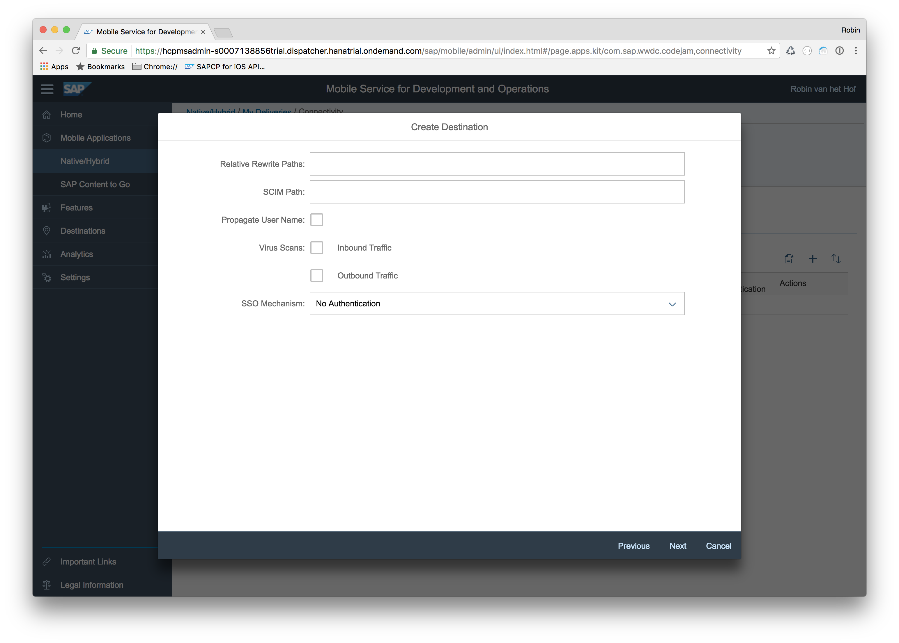

Click **Next**. In the final page of the wizard, leave everything empty but have the checkbox for **Use Default JDK Store** checked:


Click **Finish**. The application's connection to the SAP HANA MDC XS OData service is now configured. You may click the **Ping** button to check whether the destination is reachable.


[ACCORDION-END]

[ACCORDION-BEGIN [Step 4: ](Add security configuration )]

In the breadcrumb navigation on top, click the **My Deliveries** link to go back to the **Application Details**:

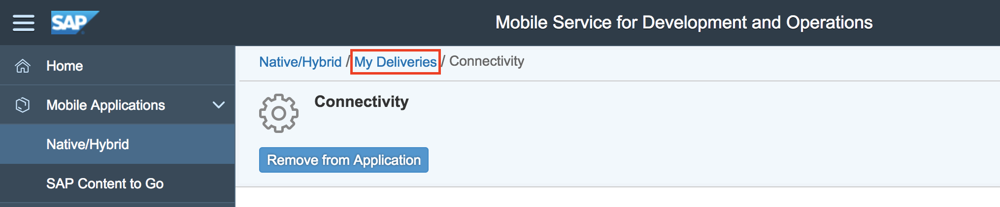

In the **Assigned Features** panel on the right, click the **Security** row. This opens the **Security Page**.

Set the **Security Configuration** to `None`:

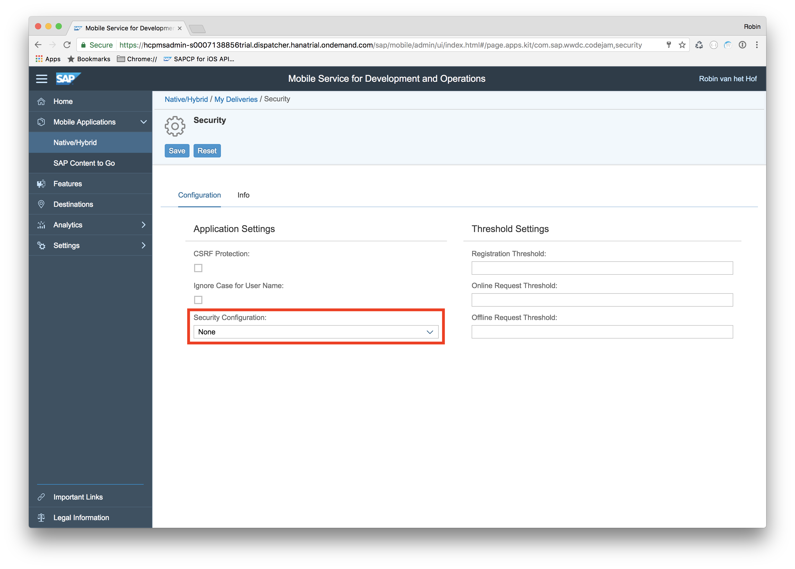

>   By specifying `None` you enforce Guest access to your application, which works best for the purpose of this demo.

>   By default, a newly created application definition uses `SAML` as the default authentication mechanism. By changing it to `None` the following notification appears:

>   

>   This message is crucial if you would have developed an application which uses a certain authentication mechanism, and by changing to a different authentication mechanism, previous user registrations may become invalid. However, since we didn't yet develop an application which uses the former specified authentication, you can simply ignore the message and click **OK**.

.

Click **Save** to store the configuration.


[ACCORDION-END]

[ACCORDION-BEGIN [Step 5: ](Configure SAP Cloud Platform SDK for iOS Assistant)]

> **Note**: If you have already configured the SAP Cloud Platform SDK for iOS Assistant, you can **skip this step** and proceed with "Step 6 - Run the SAP Cloud Platform SDK for iOS Assistant".

.

This step provides simplified steps to configure the SAP Cloud Platform SDK for iOS Assistant application using the SAP Cloud Platform mobile service for development and operations cockpit.

In SAP Cloud Platform mobile service for development and operations, click the **Important Links** tab in the lower left bottom. The **Important Links** section opens:


Locate the tile **SAP Cloud Platform SDK for iOS Assistant** and click the **Importing URLs directly into Assistant** link. You should now see the following pop-up:


Click the **Open SAP Cloud Platform SDK for iOS Assistant** button. The SAP Cloud Platform SDK for iOS Assistant application will start. The **New Account** settings dialog will open, and both **Admin API URL** and **Admin UI URL** parameters are pre-populated automatically:

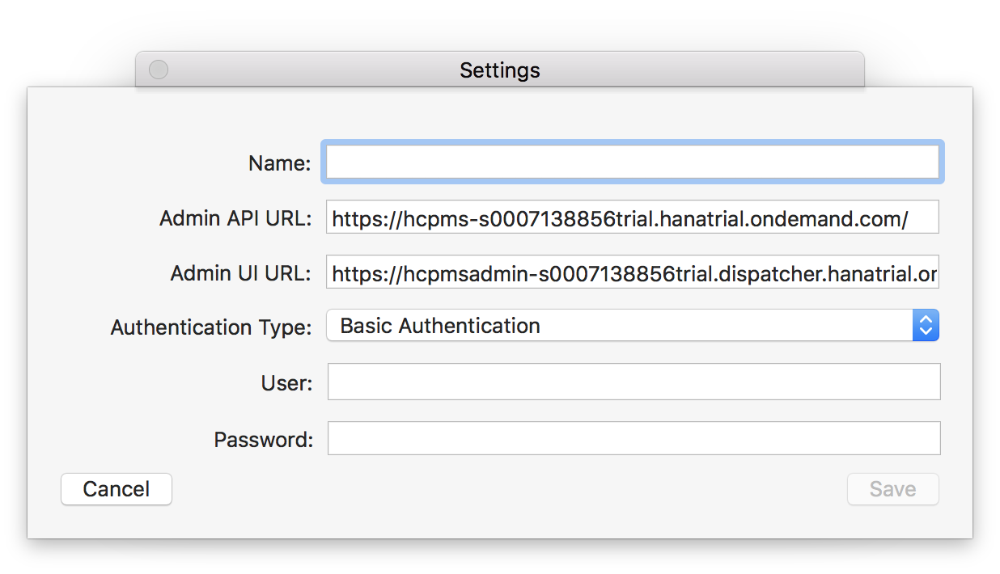

Provide the following additional details:

| Field | Value |
|----|----|
| Name | A descriptive name for the configuration, for instance `SAP Cloud Platform Mobile Services` |
| Authentication Type | `Basic Authentication` |
| User | Your trial account user |
| Password | Password for your trial account user |

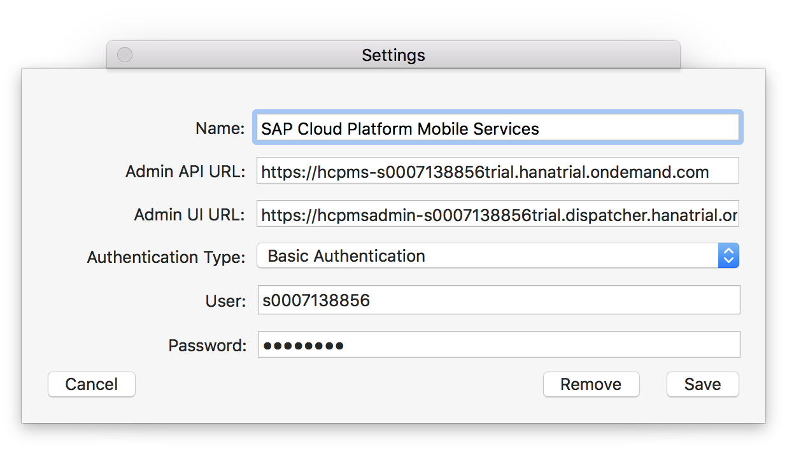

Click **Save** when finished, and click **OK** to dismiss the **Settings** dialog.


[ACCORDION-END]


[ACCORDION-BEGIN [Step 6: ](Run the SAP Cloud Platform SDK for iOS Assistant)]

> **Note**: If you went through "Step 5 - Configure SAP Cloud Platform SDK for iOS Assistant", the SAP Cloud Platform SDK for iOS Assistant is already running and you may continue to "Step 7 - Create an Xcode Project".

.

On your local machine, navigate to your `./<SAP Cloud Platform SDK for iOS>` folder.


Double-click the **SAP Cloud Platform SDK for iOS Assistant** icon to start the application.

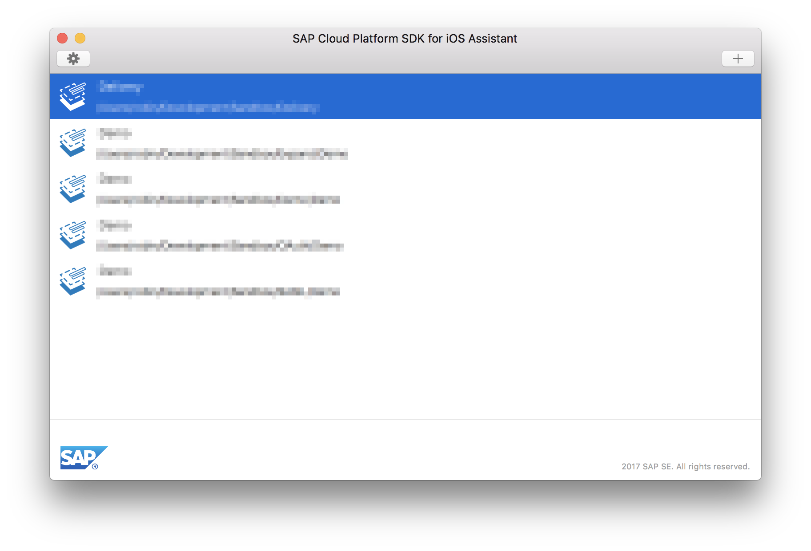


[ACCORDION-END]

[ACCORDION-BEGIN [Step 7: ](Create an Xcode Project)]

Click the **Plus** button on the top-right of the SDK Assistant. The first page of the Xcode Project generation wizard lets you define the Project Properties.

Enter the following details:

| Field | Value |
|----|----|
| Product Name | `MyDeliveries` |
| Author | `<your name>` |
| Organization Name | `<your company name>` |
| Organization Identifier | `com.sap.wwdc.codejam` |
| Destination | `<choose a local destination>` |

> Make sure the "Organization Identifier" matches the value of "Application ID" you entered in Step 2


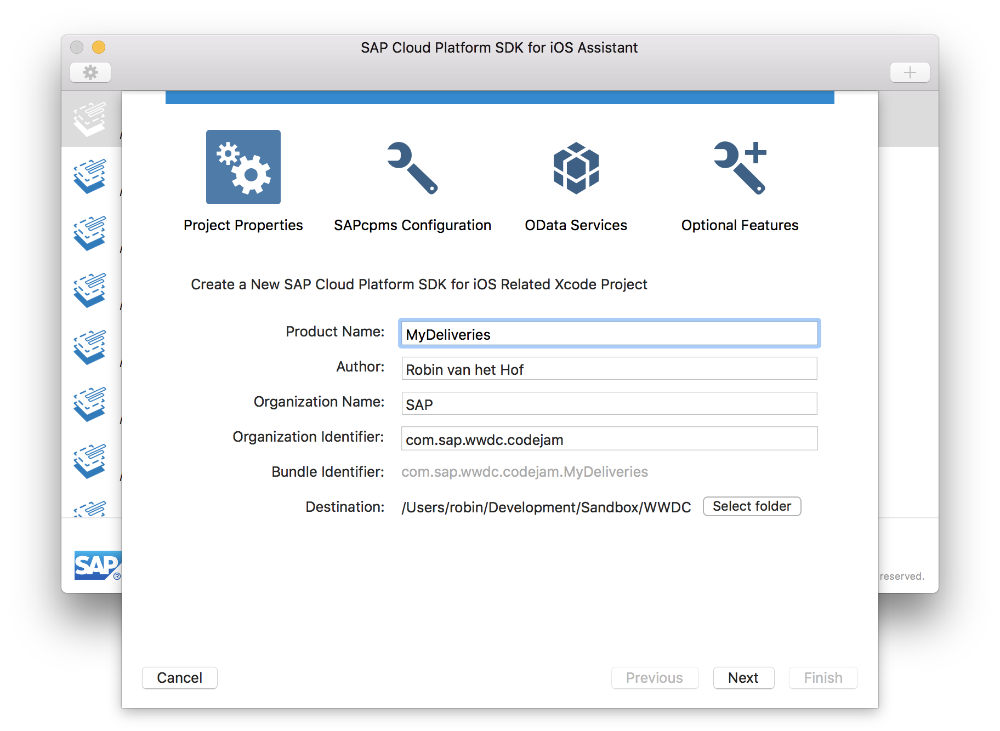

Click **Next** to advance to the **SAP Cloud Platform mobile service for development and operations Configuration** step.


[ACCORDION-END]

[ACCORDION-BEGIN [Step 8: ](SAP Cloud Platform mobile service for development and operations Configuration details)]

In the **SAP Cloud Platform mobile service for development and operations Configuration** page, select the **Use Existing** tab button.

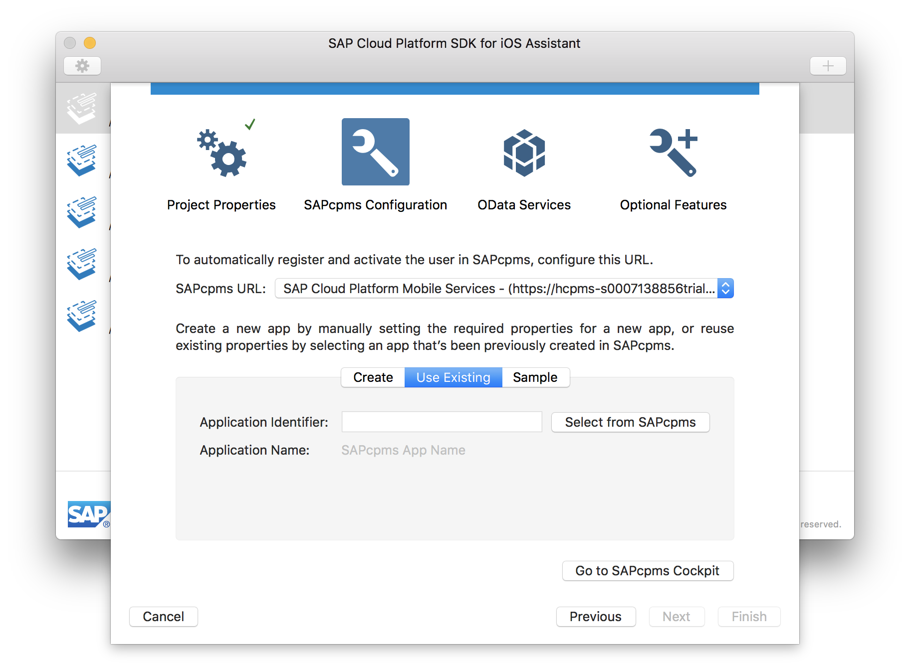

Click the **Select from SAP Cloud Platform mobile service for development and operations** button next to **Application Identifier**.

Select the `com.sap.wwdc.codejam` data source and click **OK**.

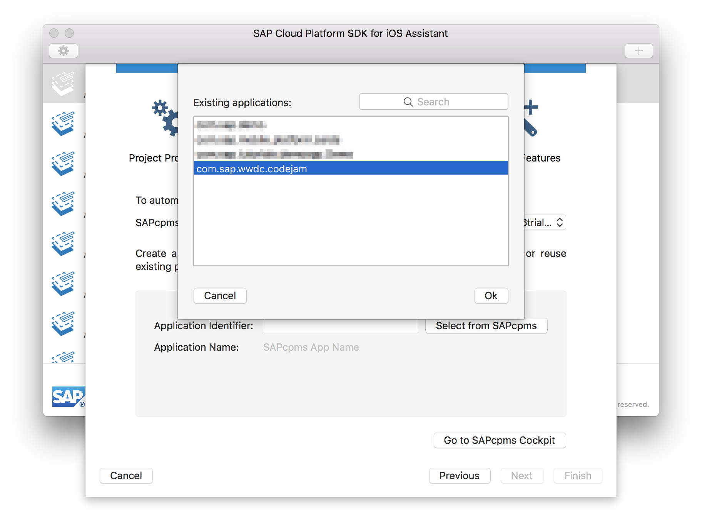

The selected data source is now pre-filled in the SAP Cloud Platform mobile service for development and operations Configuration page:

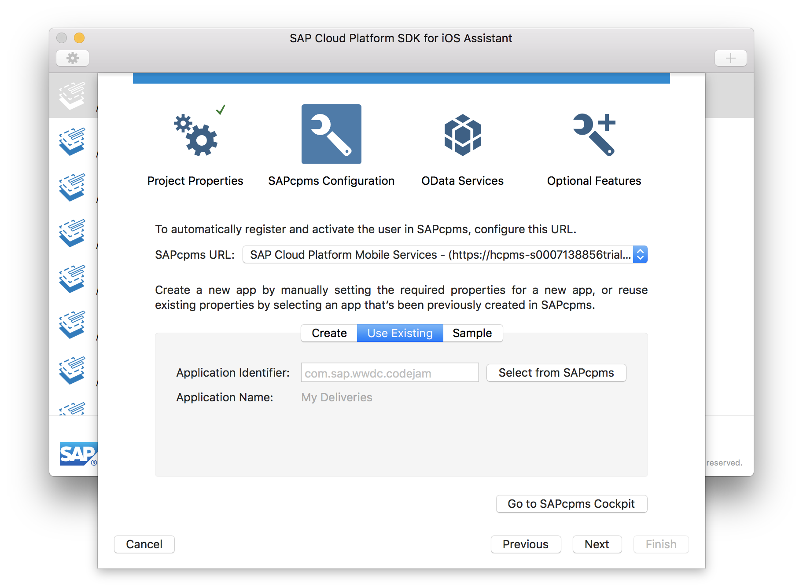

Click **Next** to advance to the **OData Services** step.


[ACCORDION-END]

[ACCORDION-BEGIN [Step 9: ](OData Services)]

In the **OData Services** page, the primary OData service connection you have specified in **Step 3 - Add a back end connection** is displayed.

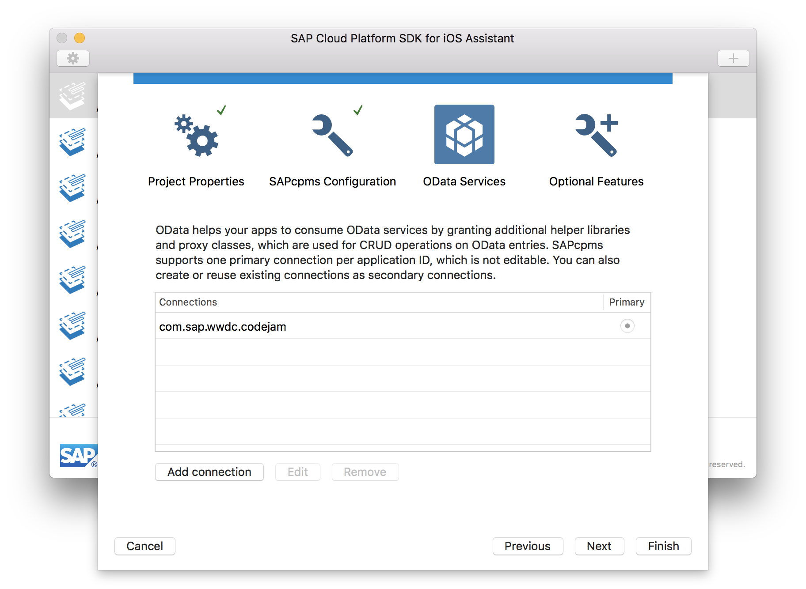

Click **Next** to advance to the **Optional Features** step.


[ACCORDION-END]

[ACCORDION-BEGIN [Step 10: ](Optional Features)]

In the **Optional Features** page, you have the option to generate a **Master-Detail Application**, enable **logging** and **log uploads**, and enable **remote notifications**.

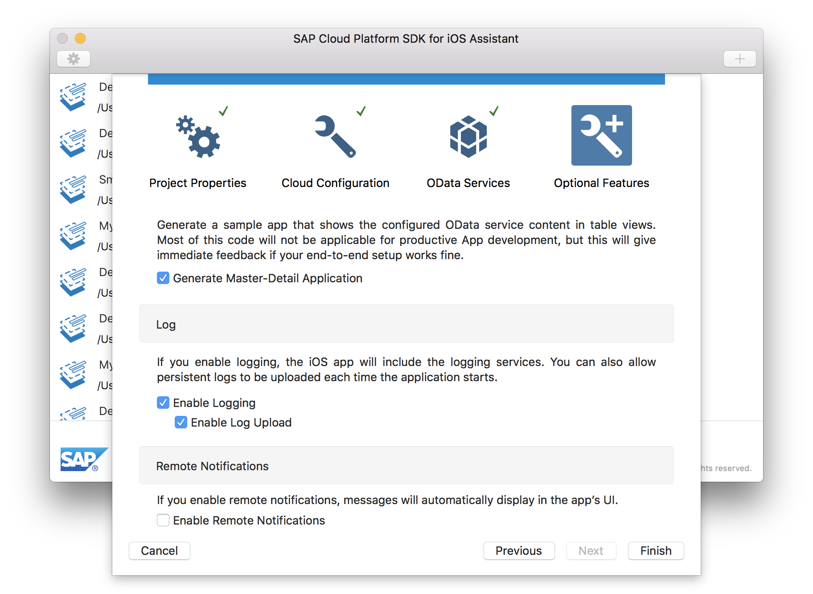

Make sure the checkboxes **Generate Master-Detail Application**, **Enable Logging** and **Enable Log Upload** are selected and click **Finish** to complete the wizard.

> Most likely the checkbox for **Remote Notifications** is disabled. This happens because no APNS endpoint is configured for the application definition in SAP Cloud Platform mobile service for development and operations. Once configured with a valid certificate, this option becomes available.


[ACCORDION-END]

[ACCORDION-BEGIN [Step 11: ](Upload metadata.xml file)]

After you have clicked **Finish** in the previous step, the SDK Assistant now loads the OData service's metadata. This metadata describes the data model, and can be accessed via `<service URL>$metadata`. For your service, the metadata URL would be `https://sapdevsdd27584c4.us2.hana.ondemand.com/codejam/wwdc/services/DeliveryService.xsodata/$metadata`


[ACCORDION-END]

[ACCORDION-BEGIN [Step 12: ](Examine the generated Xcode Project)]

After the SDK Assistant has finished, **Xcode** will launch and open the just generated `MyDeliveries` project.

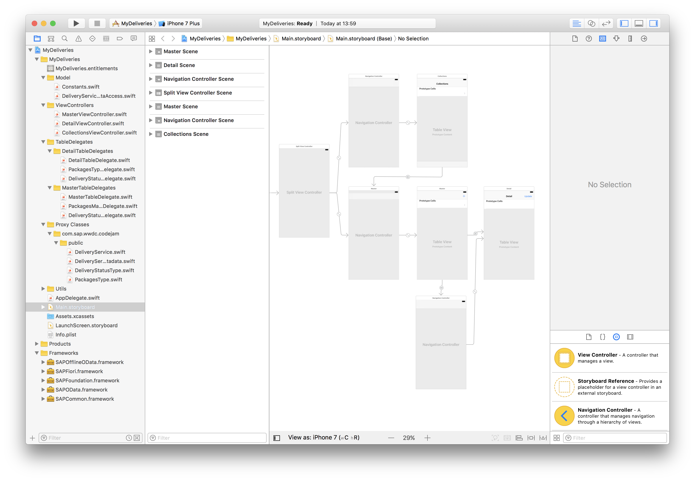

The `Main.storyboard` shows split-view setup for the generated Master-Detail views.

File `MyDeliveries/Model/Constants.swift` holds constants for the SAP Cloud Platform mobile service for development and operations environment as well as an `enum` with the OData collection types.

File `MyDeliveries/Model/DeliveryServiceDataAccess.swift` has convenience methods for accessing the OData entities.

Folder `MyDeliveries/TableDelegates` holds the delegate classes for the Master and Detail table views.

Folder `Proxy Classes` contains the OData proxy classes generated from the OData service. File `DeliveryService.swift` acts as a data service provider to gain access to the OData entities. The two files `PackageType.swift` and `DeliveryStatusType.swift` are classes for the OData entities `Package` and `DeliveryStatus`, respectively. These classes give access to the various properties of the OData entities.


[ACCORDION-END]

[ACCORDION-BEGIN [Step 13: ](Build and run the generated application)]

Click the **Run** button to build and run the generated application.

The app starts with an overview of the available **Collections** of the OData service:

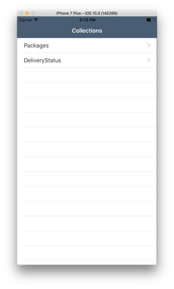


[ACCORDION-END]

[ACCORDION-BEGIN [Step 14: ](Examine the generated application)]

If you click on the `Packages` collection, you navigate to a **Master** list with all available `Package` entities:

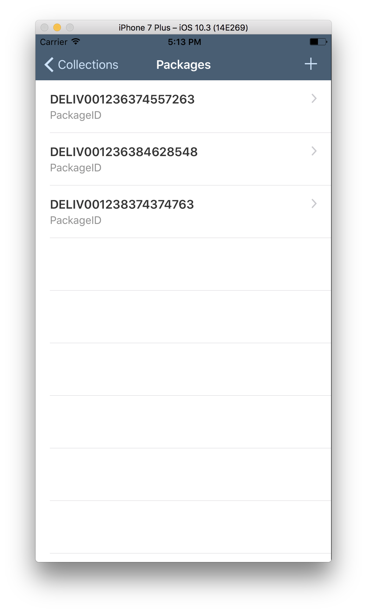

If you click on one of the `Package` entities, you navigate to a **Detail** page which lists all the properties for the selected entity:

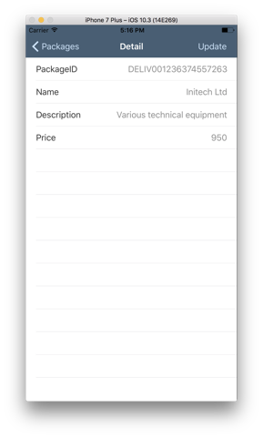


[ACCORDION-END]

[ACCORDION-BEGIN [Step 15: ](Enhance the generated application)]

The generated application demonstrates the OData proxy classes are working, browse their properties, and demonstrates push notifications and the various authentication mechanisms. For productive use, it is recommended to start with a new, empty project, and use parts of the generated app into your own project.

However, to show how to access backend data via OData in an object-oriented way, we will extend the generated application.

Examine the OData service's metadata, which can be accessed via `https://sapdevsdd27584c4.us2.hana.ondemand.com/codejam/wwdc/services/DeliveryService.xsodata/$metadata`:

```xml
<?xml version="1.0" encoding="utf-8" standalone="yes" ?>
<edmx:Edmx Version="1.0" xmlns:edmx="http://schemas.microsoft.com/ado/2007/06/edmx">
  <edmx:DataServices m:DataServiceVersion="2.0" xmlns:m="http://schemas.microsoft.com/ado/2007/08/dataservices/metadata">
    <Schema Namespace="codejam.wwdc.services.DeliveryService" xmlns="http://schemas.microsoft.com/ado/2008/09/edm" xmlns:d="http://schemas.microsoft.com/ado/2007/08/dataservices" xmlns:m="http://schemas.microsoft.com/ado/2007/08/dataservices/metadata">
      <EntityType Name="DeliveryStatusType">
        <Key>
          <PropertyRef Name="DeliveryStatusID"/>
        </Key>
        <Property MaxLength="36" Name="DeliveryStatusID" Nullable="false" Type="Edm.String"/>
        <Property MaxLength="36" Name="PackageID" Type="Edm.String"/>
        <Property MaxLength="256" Name="Location" Type="Edm.String"/>
        <Property Name="DeliveryTimestamp" Type="Edm.DateTime"/>
        <Property MaxLength="16" Name="StatusType" Type="Edm.String"/>
        <Property Name="Selectable" Type="Edm.Int32"/>
        <Property MaxLength="128" Name="Status" Type="Edm.String"/>
      </EntityType>
      <EntityType Name="PackagesType">
        <Key>
          <PropertyRef Name="PackageID"/>
        </Key>
        <Property MaxLength="36" Name="PackageID" Nullable="false" Type="Edm.String"/>
        <Property MaxLength="256" Name="Name" Type="Edm.String"/>
        <Property MaxLength="256" Name="Description" Type="Edm.String"/>
        <Property Name="Price" Precision="10" Scale="2" Type="Edm.Decimal"/>
        <NavigationProperty FromRole="PackagesPrincipal" Name="DeliveryStatus" Relationship="codejam.wwdc.services.DeliveryService.PackageDeliveryStatusType" ToRole="DeliveryStatusDependent"/>
      </EntityType>
      <Association Name="PackageDeliveryStatusType">
        <End Multiplicity="1" Role="PackagesPrincipal" Type="codejam.wwdc.services.DeliveryService.PackagesType"/>
        <End Multiplicity="*" Role="DeliveryStatusDependent" Type="codejam.wwdc.services.DeliveryService.DeliveryStatusType"/>
        <ReferentialConstraint>
          <Principal Role="PackagesPrincipal">
            <PropertyRef Name="PackageID"/>
          </Principal>
          <Dependent Role="DeliveryStatusDependent">
            <PropertyRef Name="PackageID"/>
          </Dependent>
        </ReferentialConstraint>
      </Association>
      <EntityContainer Name="DeliveryService" m:IsDefaultEntityContainer="true">
        <EntitySet EntityType="codejam.wwdc.services.DeliveryService.DeliveryStatusType" Name="DeliveryStatus"/>
        <EntitySet EntityType="codejam.wwdc.services.DeliveryService.PackagesType" Name="Packages"/>
        <AssociationSet Association="codejam.wwdc.services.DeliveryService.PackageDeliveryStatusType" Name="PackageDeliveryStatus">
          <End EntitySet="Packages" Role="PackagesPrincipal"/>
          <End EntitySet="DeliveryStatus" Role="DeliveryStatusDependent"/>
        </AssociationSet>
      </EntityContainer>
    </Schema>
  </edmx:DataServices>
</edmx:Edmx>
```

As you can see, it is a fairly simple data model containing two Entity Sets (or tables) called `Packages` and `DeliveryStatus`. Each entity in the set (or record) is identified as a `PackagesType` and `DeliveryStatusType`, respectively.

There is also an association between `PackagesType` and `DeliveryStatusType`, where a single `PackagesType` can have related `DeliveryStatusType`'s with a `0..n` cardinality.

We will now show for each `PackageType` its related `DeliveryStatusType`'s, shown in a timeline in ascending order (newest on top). The timeline will be build using **SAP Fiori for iOS controls**.

>   Using the SDK's `SAPOData` component, you can create OData queries in a really simple way. Instead of executing SQL statements, the SDK provides a 'fluent interface' or 'method chaining' approach to constructing queries, which makes the code much more readable.
>
>   A query to get all `DeliveryStatus` entities for a particular `Package` would then be something like this:
>
>   ```swift
>   // Method 1
>   let query = DataQuery()
>       // SELECT * FROM DeliveryStatus
>       .from(DeliveryServiceMetadata.EntitySets.deliveryStatus)
>       // WHERE DeliveryStatus.packageID == <selected package ID>
>       .where(DeliveryStatusType.packageID.equal((currentEntity?.packageID)!))
>   ```
>
>   The result of this query is an array of `DeliveryStatusType` objects.
>
>   With OData, you can even have greater flexibility. Since there is a one-to-many association (or 'Navigation Link') between `Package` and `DeliveryStatus`, you could also load the `Package` object and all related child `DeliveryStatus` entities at once:
>
>   ```swift
>   // Method 2
>   let query = DataQuery()
>       // SELECT * FROM Packages
>       .from(DeliveryServiceMetadata.EntitySets.packages)
>       // WHERE <primary key> = <selected package ID>
>       .withKey(PackagesType.key(packageID: currentEntity?.packageID))
>       // LEFT JOIN DeliveryStatus ON <abstracted, defined in association>
>       .expand(PackagesType.deliveryStatus)
>   ```
>
> Using the generated OData Proxy classes, you can then simply access the `PackagesType` related `DeliveryStatusType` objects:
>
> 
>
> **However, since the SDK Assistant generated app by default does not support OData Navigation Links, it takes a bit more effort to enable this. Furthermore, sorting an expanded entity set is only supported in OData V4, and this tutorial uses an OData V2 service. Therefore, in this tutorial we'll simply query the `DeliveryStatus` entities for each `Package`.**


[ACCORDION-END]

[ACCORDION-BEGIN [Step 16: ](Create a new Table View Controller)]

To list the tracking info for each package using SAP Fiori Timeline controls, the most simple approach would be to create a new Table View Controller and implement the code needed to display the statuses.

In Xcode, drag a **Table View Controller** object from the **Object library** onto the **Storyboard**, next to the **Detail Scene**.

With the just added Table View Controller selected, give it the name `Tracking Info` in the **Attribute inspector**:

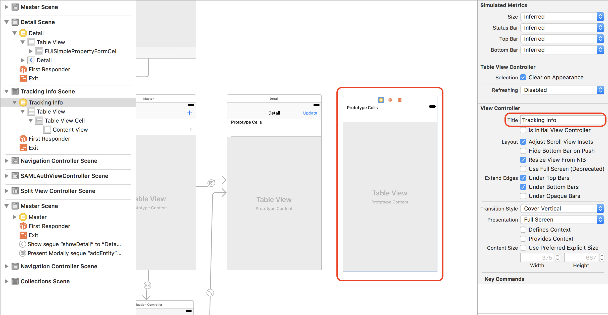


[ACCORDION-END]

[ACCORDION-BEGIN [Step 17: ](Create new subclass of a UITableViewController class)]

**Right-click** the `ViewControllers` folder in your project, and from the context menu choose **New File...**.

In the dialog, select **Cocoa Touch Class** and click **Next**.

Provide the following details:

| Field | Value |
|----|----|
| Class | `TrackingInfoViewController` |
| Subclass Of | `UITableViewController` |

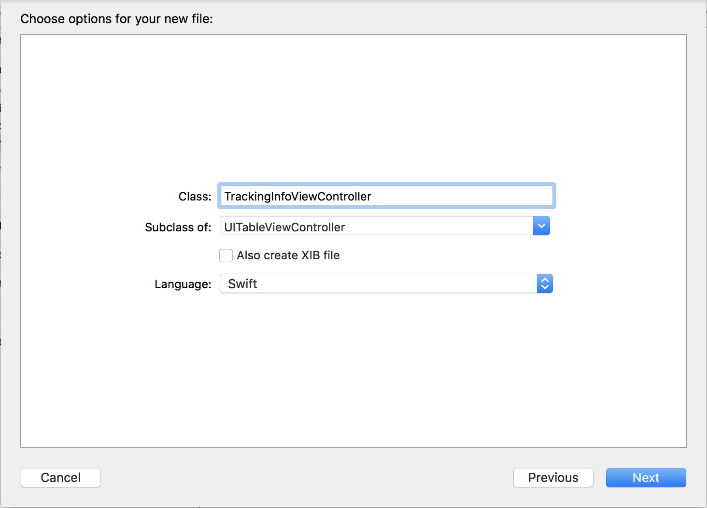

Click **Next**. In the next screen, make sure the new class file is stored in group `ViewControllers` and click **Create**.

In the newly created file `TrackingInfoViewController.swift`, replace the `import UIKit` statement with the following import statements:

```swift
import SAPFoundation
import SAPCommon
import SAPOData
import SAPFiori
```

Just below the line `class TrackingInfoViewController: UITableViewController {`, add the following declarations:

```swift
private let appDelegate = UIApplication.shared.delegate as! AppDelegate
private let logger: Logger = Logger.shared(named: "TrackingInfoViewController")

private var _entities: [DeliveryStatusType] = [DeliveryStatusType]( )
var entities: [EntityValue] {
    get { return _entities }
    set { self._entities = newValue as! [DeliveryStatusType]
    }
}
```
<!---
```swift
private let appDelegate = UIApplication.shared.delegate as! AppDelegate
private let logger: Logger = Logger.shared(named: "TrackingInfoViewController")

private var _entity: PackagesType = PackagesType()
var entity: EntityValue {
    get { return _entity }
    set { self._entity = newValue as! PackagesType }
}
```
-->

This adds a reference to the `AppDelegate` class, a reference to the SDK's logging mechanism, and fields to set/get the selected `DeliveryStatusType` entity.
<!---
This adds a reference to the `AppDelegate` class, a reference to the SDK's logging mechanism, and fields to set/get the selected `PackagesType` entity.
-->

Switch to the **Storyboard** and select the **Tracking Info Table View**. In the **Identity inspector**, set the **Custom Class** to `TrackingInfoViewController`:


> To avoid a "*prototype table cells must have reuse identifiers*" warning, you can provide an identifier for the table view's prototype cell, or alternatively, set the **Prototype Cells** value to `0`.


[ACCORDION-END]

[ACCORDION-BEGIN [Step 18: ](Add navigation Table View Cell to Detail Table View)]

Drag a **Table View Cell** onto the **Detail Table View**, and set the following properties in the **Attribute inspector**:

| Field | Value |
|----|----|
| Identifier | `NavigationLink` |
| Accessory | `Disclosure Indicator` |

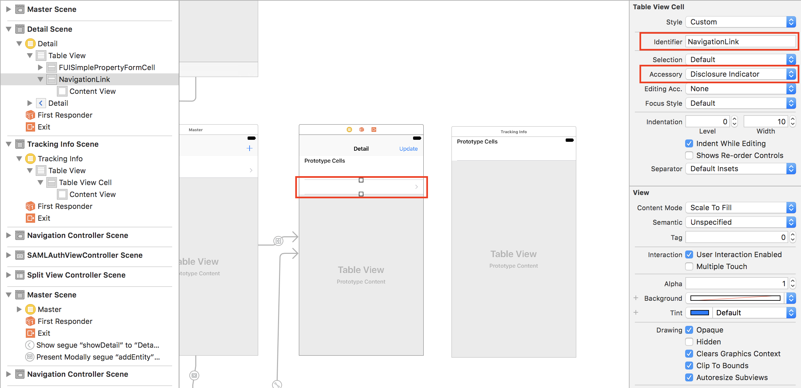

**Control-click** the just added **Table View Cell** and drag it onto the **Tracking Info Scene**. From the **Segue** pop-up, choose **Show**.

With the segue selected, go to the **Attributes inspector** and provide the name `showTrackingInfo` as its **Identifier**:


[ACCORDION-END]

[ACCORDION-BEGIN [Step 19: ](Implement Table View Cell for Packages)]

Open file `./MyDeliveries/TableDelegates/DetailTableDelegates/PackagesTypeDetailTableDelegate.swift`.

Locate method `tableView(_ tableView:, numberOfRowsInSection section:)`. Currently it returns **4** rows, the total number of properties the `Package` entity has. However, since you added an extra Table View Cell to navigate to the Tracking Info scene, you want to make this extra cell visible.

Set the return value to `5`:

```swift
func tableView(_ tableView: UITableView, numberOfRowsInSection section: Int) -> Int {
    return 5
}
```
Next, locate method `tableView(_ tableView:, cellForRowAt indexPath:)`.

It contains a `switch` statement which, depending on the `indexPath.row` value, displays the property and corresponding value for the selected `Package`.

To display the added Table View Cell, add an extra `case` statement, just above the `default:` switch:

```swift
case 4:
    let navigationLink = tableView.dequeueReusableCell(withIdentifier: "NavigationLink",
        for: indexPath) as UITableViewCell
    navigationLink.textLabel?.text = "Show Tracking Info..."
    return navigationLink
```

Now the 5th row in the table will return a **Table View Cell** matching identifier `NavigationLink`, and it will display the static text `Show Tracking info...`.

If you now run and build the application, the newly added table cell is displayed:

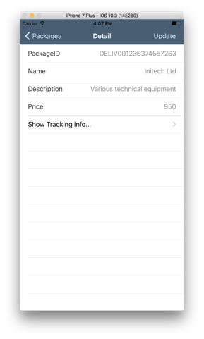

However, if you click on it, nothing happens... You will solve that in the next step.


[ACCORDION-END]


[ACCORDION-BEGIN [Step 20: ](Implement navigation logic)]

In the previous step, you have noticed the navigation to the **Tracking Info** scene did not happen. That is caused since the `DetailViewController.swift` file has turned off its ability to select table cells.

Open the file `./MyDeliveries/ViewControllers/DetailViewController.swift`.

In method `viewDidLoad()`, locate the line:

```swift
self.tableView.allowsSelection = false
```

To enable navigating from this view to the Tracking Info view, set this property to `true`.

Next, scroll down, and just above the method `cancel()` add the following function:
```swift
override func prepare(for segue: UIStoryboardSegue, sender: Any?) {
    if segue.identifier == "showTrackingInfo" {

        if (self.tableView.indexPathForSelectedRow?.row != nil) {
            let trackingInfoView = segue.destination as! TrackingInfoViewController

            let currentEntity = self.selectedEntity as? PackagesType

            let esDeliveryStatus = DeliveryServiceMetadata.EntitySets.deliveryStatus
            let propPackageId    = DeliveryStatusType.packageID
            let propTimestamp    = DeliveryStatusType.deliveryTimestamp

            // Load all related DeliveryStatuses for the current Package,
            // latest first.
            let query = DataQuery()
                .from(esDeliveryStatus)
                .where(propPackageId.equal((currentEntity?.packageID)!))
                .orderBy(propTimestamp, SortOrder.descending)

            do {
                // Perform query and store the results
                trackingInfoView.entities = try self.deliveryService.service.deliveryStatus(
                    query: query)
            }
            catch let error {
                self.logger.error(error.localizedDescription)
            }
        }
    }
}
```
<!---
```swift
override func prepare(for segue: UIStoryboardSegue, sender: Any?) {
    if segue.identifier == "showTrackingInfo" {

        if (self.tableView.indexPathForSelectedRow?.row != nil) {
            let trackingInfoView = segue.destination as! TrackingInfoViewController

            let currentEntity = self.selectedEntity as? PackagesType

            let esPackages       = DeliveryServiceMetadata.EntitySets.packages
            let esDeliveryStatus = DeliveryServiceMetadata.EntitySets.deliveryStatus

            // Load all related DeliveryStatuses for the current Package,
            // latest first.
            let query = DataQuery()
                .from(esPackages)
                .withKey(PackagesType.key(packageID: (currentEntity?.packageID)!))
                .expand(PackagesType.deliveryStatus, withQuery: DataQuery()
                    .from(esDeliveryStatus)
                    .orderBy(DeliveryStatusType.deliveryTimestamp, SortOrder.descending))

            do {
                // Perform query and store the results
                trackingInfoView.entity = try self.deliveryService.service.packages(
                    query: query)[0]
            }
            catch let error {
                self.logger.error(error.localizedDescription)
            }
        }
    }
}
```
-->

With this code, you create a query to load all `DeliveryStatus` entities for the selected `Package` entity, and store the results into the `TrackingInfoViewController`.


[ACCORDION-END]

[ACCORDION-BEGIN [Step 21: ](Explore SAP Fiori Timeline cells with the SAP Fiori for iOS Mentor app)]

You now have enabled navigation, as well as created a query to load all related `DeliveryStatus` entities. However, you haven't bound the results to table cells yet.

Since we want to display the `DeliveryStatus` items in a timeline, the best way to achieve this is to use the SDK's `FUITimeline` table view cell control. A great tool for exploring SAP Fiori for iOS controls and help implementing these into your project is the SAP Fiori for iOS Mentor app. This is a companion tool to the SDK, and can be downloaded for iPad from the Apple App Store.

Open the SAP Fiori for iOS Mentor app on your iPad. Upon opening, the app shows an overview page:


Click on the **See All** link next to the **UI Components** section, and scroll down until you see the **Timeline Cell** tile:


Click the **Timeline Cell** tile. You now see a page wit a representation of the SAP Fiori Timeline cell, and a couple of preset styles to change the look and feel for the control.

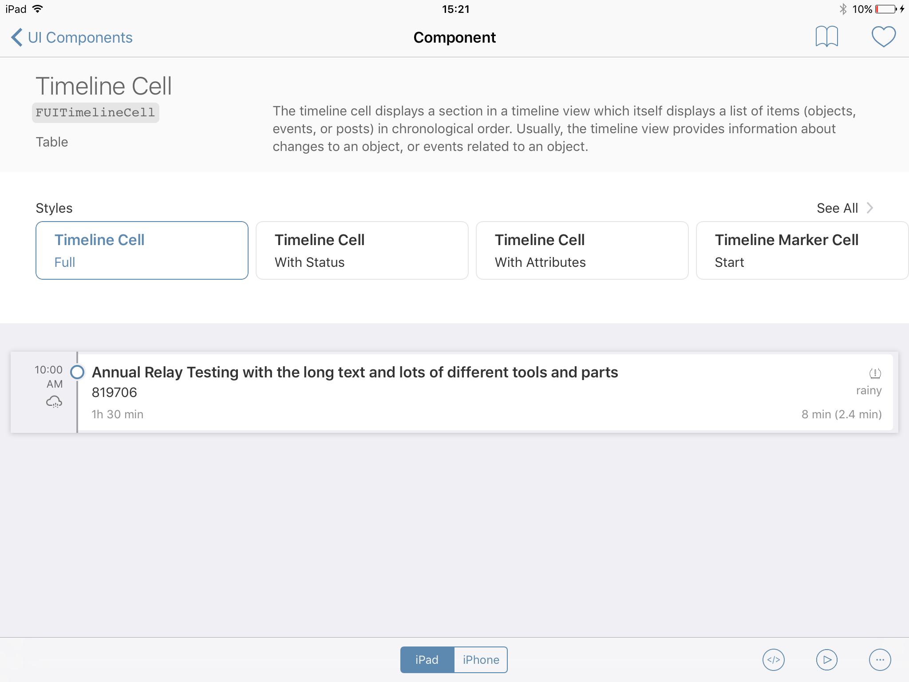

You can also customize the look and feel on a more granular level. Click the **button with three dots** in the lower right corner. This will bring a pop up where you can specify different settings for the control. The control's look and feel is instantly updated, giving you an idea of the final result:

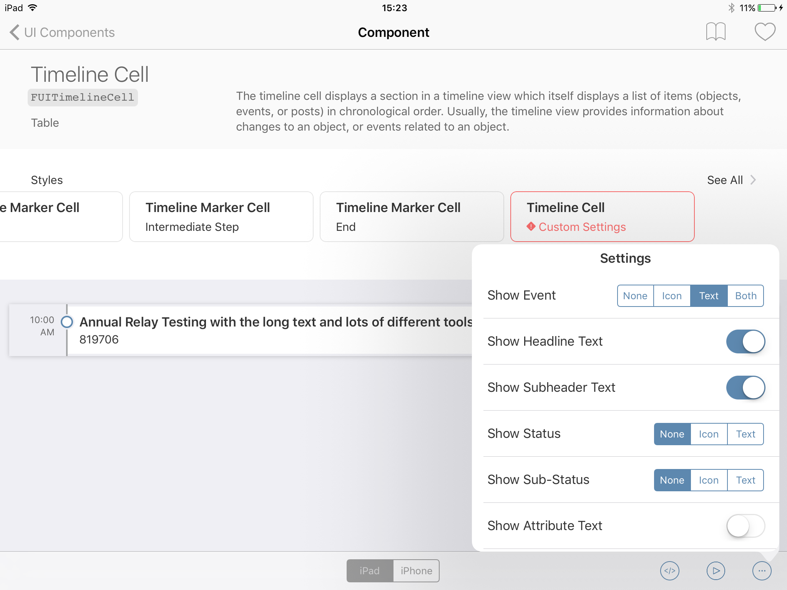

When you're happy with the final result, click the **Code button** (the one labeled `</>`). This will bring a pop up with a sample `UITableViewController` class, and all the properties you have set or enabled in the **Control Settings** pop-up are reflected in the generated code:


To use the generated code in Xcode, click the **Share** button in the top-right, and use **AirDrop** to transfer to your Mac:


Open the downloaded text file:

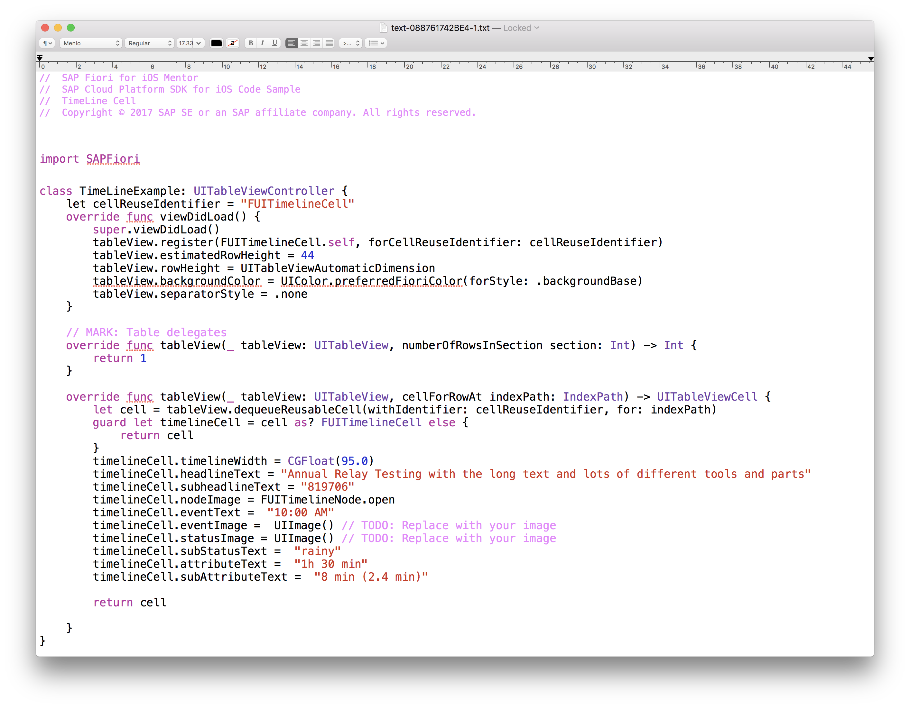

The generated code can now be implemented into the appropriate places in the `TrackingInfoViewController.swift` file.

>   **NOTE** Since it may take a bit too long to go through the steps of copying and pasting the code, adding the control binding to the Proxy Classes' properties and format the data properly, you don't need to do this yourself. The code to implement will be provided in the next steps.


[ACCORDION-END]

[ACCORDION-BEGIN [Step 22: ](Implement the SAP Fiori Timeline cells)]

In this step, you implement Fiori Timeline cells to show the `DeliveryStatus` entities in a logical way.

Open the file `./MyDeliveries/ViewControllers/TrackingInfoViewController.swift` and locate the method `viewDidLoad()`.

Replace the commented-out part with the following code:

```swift
tableView.register(FUITimelineCell.self, forCellReuseIdentifier: "FUITimelineCell")
tableView.register(FUITimelineMarkerCell.self, forCellReuseIdentifier: "FUITimelineMarkerCell")
tableView.estimatedRowHeight = 44
tableView.rowHeight = UITableViewAutomaticDimension
tableView.backgroundColor = UIColor.preferredFioriColor(forStyle: .backgroundBase)
tableView.separatorStyle = .none
```

> **NOTE** The above code originated from the **SAP Fiori for iOS Mentor** app, but has been slightly modified to show both `FUITimelineCell` and `FUITimelineMarkerCell` control.

.

Next, locate method `numberOfSections(in tableView:)`.

Change it so it returns 1 section:

```swift
override func numberOfSections(in tableView: UITableView) -> Int {
    return 1
}
```

Now, locate method `tableView(_ tableView:, numberOfRowsInSection section:)`.

Change it to return the number of loaded entities:

```swift
override func tableView(_ tableView: UITableView, numberOfRowsInSection section: Int) -> Int {
    return self._entities.count
}
```
<!---
```swift
override func tableView(_ tableView: UITableView, numberOfRowsInSection section: Int) -> Int {
    return self._entity.deliveryStatus.count
}
```
-->

Finally, remove the remaining commented-out methods and replace them with these methods:

```swift
override func tableView(_ tableView: UITableView,
                        cellForRowAt indexPath: IndexPath) -> UITableViewCell {

    let deliverystatustype = self._entities[indexPath.row]

    if deliverystatustype.selectable != 0 {
        return self.getFUITimelineCell(deliverystatustype: deliverystatustype,
                                       indexPath: indexPath)
    }
    else {
        return self.getFUITimelineMarkerCell(deliverystatustype: deliverystatustype,
                                             indexPath: indexPath)
    }
}

private func getFUITimelineMarkerCell(deliverystatustype: DeliveryStatusType,
                                      indexPath: IndexPath) -> UITableViewCell {

    let cell = tableView.dequeueReusableCell(withIdentifier: "FUITimelineMarkerCell", for: indexPath)
    guard let timelineCell = cell as? FUITimelineMarkerCell else {
        return cell
    }
    timelineCell.nodeImage = self.getNodeImage(statusType: deliverystatustype.statusType!)
    timelineCell.showLeadingTimeline = indexPath.row == 0 ? false : true
    timelineCell.showTrailingTimeline = indexPath.row == self._entities.count - 1 ? false : true
    timelineCell.eventText = self.getFormattedDateTime(timestamp: deliverystatustype.deliveryTimestamp!)
    timelineCell.titleText = deliverystatustype.status

    return timelineCell
}

private func getFUITimelineCell(deliverystatustype: DeliveryStatusType,
                                indexPath: IndexPath) -> UITableViewCell {

    let cell = tableView.dequeueReusableCell(withIdentifier: "FUITimelineCell", for: indexPath)
    guard let timelineCell = cell as? FUITimelineCell else {
        return cell
    }
    timelineCell.nodeImage = self.getNodeImage(statusType: deliverystatustype.statusType!)
    timelineCell.eventText = self.getFormattedDateTime(timestamp: deliverystatustype.deliveryTimestamp!)
    timelineCell.headlineText = deliverystatustype.status
    timelineCell.subheadlineText = deliverystatustype.location

    return timelineCell
}

private func getFormattedDateTime(timestamp: LocalDateTime) -> String {
    let formatter = DateFormatter()
    formatter.dateFormat = "MM/dd HH:mm"

    return formatter.string(from: timestamp.utc())
}

private func getNodeImage(statusType: String) -> UIImage {
    switch statusType {
    case "start"    : return FUITimelineNode.start
    case "inactive" : return FUITimelineNode.inactive
    case "complete" : return FUITimelineNode.complete
    case "earlyEnd" : return FUITimelineNode.earlyEnd
    case "end"      : return FUITimelineNode.end
    default         : return FUITimelineNode.open
    }
}
```
<!---
```swift
override func tableView(_ tableView: UITableView,
    cellForRowAt indexPath: IndexPath) -> UITableViewCell {

    let deliverystatustype = self.entities[indexPath.row] as! DeliveryStatusType

    if deliverystatustype.selectable != 0 {
        return self.getFUITimelineCell(deliverystatustype: deliverystatustype,
            indexPath: indexPath)
    }
    else {
        return self.getFUITimelineMarkerCell(deliverystatustype: deliverystatustype,
            indexPath: indexPath)
    }
}

private func getFUITimelineMarkerCell(deliverystatustype: DeliveryStatusType,
    indexPath: IndexPath) -> UITableViewCell {

    let cell = tableView.dequeueReusableCell(withIdentifier: "FUITimelineMarkerCell", for: indexPath)
    guard let timelineCell = cell as? FUITimelineMarkerCell else {
        return cell
    }
    timelineCell.nodeImage = self.getNodeImage(statusType: deliverystatustype.statusType!)
    timelineCell.showLeadingTimeline = indexPath.row == 0 ? false : true
    timelineCell.showTrailingTimeline = indexPath.row == self._entities.count - 1 ? false : true
    timelineCell.eventText = self.getFormattedDateTime(timestamp: deliverystatustype.timestamp!)
    timelineCell.titleText = deliverystatustype.status

    return timelineCell
}

private func getFUITimelineCell(deliverystatustype: DeliveryStatusType,
    indexPath: IndexPath) -> UITableViewCell {

    let cell = tableView.dequeueReusableCell(withIdentifier: "FUITimelineCell", for: indexPath)
    guard let timelineCell = cell as? FUITimelineCell else {
        return cell
    }
    timelineCell.nodeImage = self.getNodeImage(statusType: deliverystatustype.statusType!)
    timelineCell.eventText = self.getFormattedDateTime(timestamp: deliverystatustype.timestamp!)
    timelineCell.headlineText = deliverystatustype.status
    timelineCell.subheadlineText = deliverystatustype.location

    return timelineCell
}

private func getFormattedDateTime(timestamp: LocalDateTime) -> String {
    let formatter = DateFormatter()
    formatter.dateFormat = "MM/dd HH:mm"

    return formatter.string(from: timestamp.utc())
}

private func getNodeImage(statusType: String) -> UIImage {
    switch statusType {
        case "start"    : return FUITimelineNode.start
        case "inactive" : return FUITimelineNode.inactive
        case "complete" : return FUITimelineNode.complete
        case "earlyEnd" : return FUITimelineNode.earlyEnd
        case "end"      : return FUITimelineNode.end
        default         : return FUITimelineNode.open
    }
}
```
-->

The first method `tableView(_ tableView:, cellForRowAt indexPath:)` decides based on `DeliveryStatus` property `selectable` which specific timeline cell to render. This rendering is done via two private methods `getFUITimelineMarkerCell(deliverystatustype:, indexPath:)` and `getFUITimelineCell(deliverystatustype:, indexPath:)`.

> These two private methods are implemented based on the code from the **SAP Fiori for iOS Mentor** app, but the code from the Mentor app has been split into two separate functions and control binding has already been implemented for easier implementation in this tutorial.

.

The final two private methods are helpers to format the timestamp into something more readable, and to get the correct `FUITimelineNode` image indicator based on the `DeliveryStatus` property `StatusType`.


[ACCORDION-END]


[ACCORDION-BEGIN [Step 23: ](Run the application)]

Build and run the application. Navigate to the `Packages` master page and select a package. If you now click on the **Show Tracking Info...** cell, you'll navigate to the **Tracking Info** scene, and the `Package`'s related `DeliveryStatus` records are now shown in descending order using two flavors of the **Fiori Timeline** cell control.


[ACCORDION-END]


## Next Steps
 - [View all How-Tos](http://www.sap.com/developer/tutorial-navigator.how-to.html)
