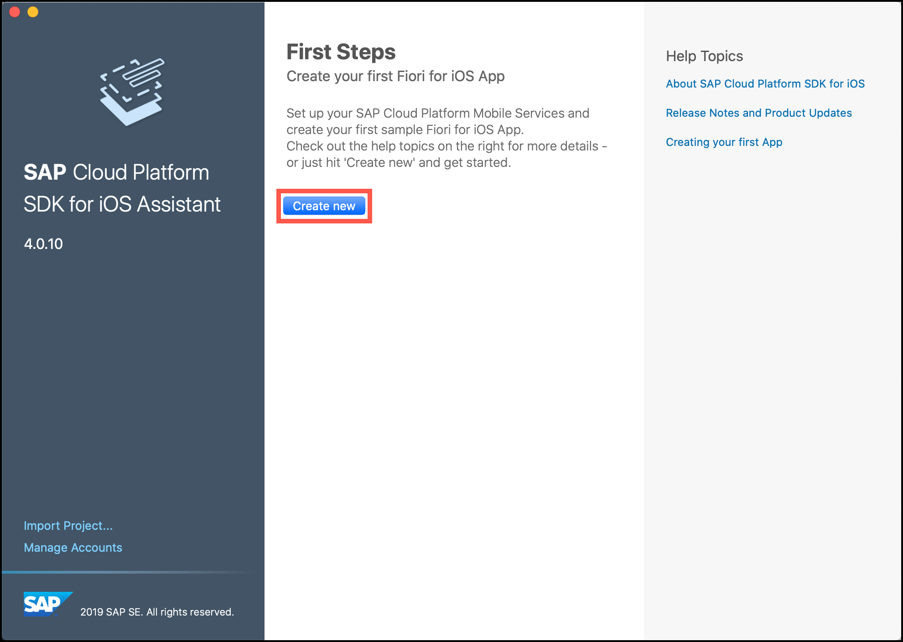

## Prerequisites  
- **Development environment:** Apple Mac running macOS Catalina or higher with Xcode 11 or higher
- **SAP Cloud Platform SDK for iOS:** Version 4.0.10
- Completed the previous tutorials in this Group.

## Details
### You will learn  
  - How to create a Fiori for iOS app
  - What the SAP Cloud Platform SDK for iOS Assistant can generate.

---

[ACCORDION-BEGIN [Step 1: ](Use SAP Cloud Platform Mobile Service to create an Mobile Application configuration)]

Using SAP Cloud Platform Mobile Services (Mobile Services) allows you to manage your mobile apps. It also enables you to create mobile application configurations, not the real iOS app, to be later being consumed by the SAP Cloud Platform SDK for iOS Assistant (iOS Assistant).

The iOS Assistant will let you then consume that configuration and generate an Xcode project out of it, containing the data model classes and convenience data service. More in detail at a later point in the tutorial.

Open up your Mobile Services instance which should be running as service instance on your Cloud Foundry landscape.

Click on **Mobile Applications** to expand that navigation node.

Click on **Native/Hybrid** to be able to create a new mobile application. Within the new screen on the right-hand side, you should see a button **New**. Click on it to start the creation flow.

In the upcoming pop-up, fill in the fields as seen in the following table and click on **Save**:

| Field        | Value           |
| ------------- | ------------- |
| ID      |  `com.example.tutorialapp`
| Name      | `TutorialApp`      |
| Description | Describe the usage of that app configuration |

The mobile app configuration is now created.

[DONE]
[ACCORDION-END]

[ACCORDION-BEGIN [Step 2: ](Add the Mobile Sample OData ESPM)]

For most of the tutorials, you will use this cloud app configuration which is based on the **Mobile Sample OData ESPM** service. This service provides you with an OData backend containing a product, supplier and customer catalog.

Click on the **Features** tab on the left-hand side.

 In the upcoming screen, click on **Add to Application** for the **Mobile Sample OData ESPM** tile.

Select the just created mobile application and click on **OK**.

After you've added that backend service to your application the application detail screen should show up displaying the added OData service. Click on **Save**.

Your work is done in Mobile Services now. The following steps will describe how to use the iOS Assistant to take that cloud app configuration to generate your first app.

[DONE]
[ACCORDION-END]

[ACCORDION-BEGIN [Step 3: ](Use the SAP Cloud Platform SDK for iOS Assistant to create your first Xcode iOS project)]

On your MacBook, open the iOS Assistant and click on **Create New** to start the creation workflow.

The initial step of the workflow asks you to choose whether to create a sample app, use an existing cloud app configuration, or create a new one.

Click the **Reuse Existing Application** tile in the middle of the **Create a new App** step. This will allow us to use the previously defined cloud app configuration.

The first step in the **Reuse Existing Application** workflow wants you to select the Mobile Services account you want to use. You could have multiple accounts here for different landscapes you might use.

Select your account and click on **Next**.

Step 2 lets you select the **Cloud Application** you want to base your Xcode iOS project on.

Select the `com.example.tutorialapp` and click on **Next**.

If you look closely at the UI you can see a clear distinction between the **Cloud Configuration** and the **Client Configuration**. So right now you're transitioning into the definition of your Xcode project and the way the iOS Assistant generates your app.

Fill in the fields as seen in the following table:

| Field        | Value           |
| ------------- | ------------- |
| Product Name      |  `TutorialApp`
| Organization Name      | Fill in your org name |
| Organization Identifier | `com.sap.example` |

> **Note:** The name of the cloud application does not need to match your iOS app name, and often won't; your iOS app may access multiple cloud applications. The Application Identifier, however, must be unique across all of your configured cloud applications, and typically follows a reverse-DNS format.

Choose a path where to save the project to and click **Next** to advance to the **Proxy Classes** step.

Here you can see what destination is going to be used to pull the Metadata of the OData Service to generate the OData Proxy Classes. If you hover over the displayed service identifier you can make changes to the way the iOS Assistant generates these classes. You won't touch this feature in most of the tutorials.

Click **Next** to go to the **UI Configuration** step.

The UI Configuration step will let you define what the iOS Assistant should generate on top of the Proxy Classes and convenience data service. For most tutorials, you will replace the generated UI with your own but to get an understanding of the iOS Assistant's power, make sure all the checkboxes are selected and click on **Finish**.

The iOS Assistant will now connect to Mobile Services and fetches the defined configuration and the Metadata document of the sample service. With that information, it will create an Xcode project for you including the selected UI, Proxy Classes which will represent the entities in the service, as well as a convenience data service for easy backend communication.

Your Xcode project should automatically open up and you can run the app.

[VALIDATE_3]
[ACCORDION-END]
