## Prerequisites  

- **Proficiency:** Intermediate
- **Development environment:** Apple iMac, MacBook or MacBook Pro running Xcode 9 or higher
- **SAP BTP SDK for iOS:** Version 3.0 SP01

## Details

While the SAP BTP SDK Assistant for iOS provides a quick way of generating an Xcode project based on an OData service with a secure on-boarding flow, the generated storyboards and master-detail views are generally not what you want to end up with.

In this tutorial, you will create an SAP Fiori for iOS app. You start with an Xcode project generated with the SAP BTP SDK Assistant for iOS, but instead of using the generated master-detail view, you will delete all generated views, view controllers and storyboards. Instead, you will create a custom UI.

The app will use the Sample ESPM OData service from SAP Mobile Services for development and operations, and is capable of adding customer call-back reminders to the standard Reminders app.

> Before you start, make sure you:

> - have a trial account on SAP BTP. See [Sign up for a free trial account on SAP BTP](hcp-create-trial-account) for more information.
> - enabled SAP Mobile Services for development and operations. See [Enable SAP Mobile Services for development and operations](fiori-ios-hcpms-setup) for more information.

### You will learn

- How to create an Xcode project with the SAP BTP SDK Assistant for iOS
- How to alter the Xcode project by safely removing the generated UI components and storyboards in order to implement your own custom UI
- To create a custom SAP Fiori for iOS user interface
- To utilize the iOS `EventKit` framework to create iOS Reminders from within your app

### Time to Complete

**30 Min**

---

[ACCORDION-BEGIN [Step 1: ](Configure SAP BTP SDK Assistant for iOS)]

> **Note**: If you have already configured the SAP BTP SDK Assistant for iOS, you can **skip this step** and proceed with "Step 2 - Run the SAP BTP SDK Assistant for iOS".

The SAP BTP SDK for iOS includes an Assistant app for generating and managing iOS apps that use the Mobile Services. To get started with the Assistant, you'll need to configure it for your account. Part of this configuration can be imported automatically.

Once you're logged in to **SAP Mobile Services**, click the **Important Links** tab in the lower left bottom. The **Important Links** section opens.

> If you don't have the Mobile Service URL: `https://hcpms-<your_user_id>trial.dispatcher.hanatrial.ondemand.com/`.

Locate the tile **SAP BTP SDK Assistant for iOS** and click the **Importing URLs directly into Assistant** link.


Locate the tile **SAP BTP SDK Assistant for iOS** and click the **Importing URLs directly into Assistant** link. You should now see the following pop-up:

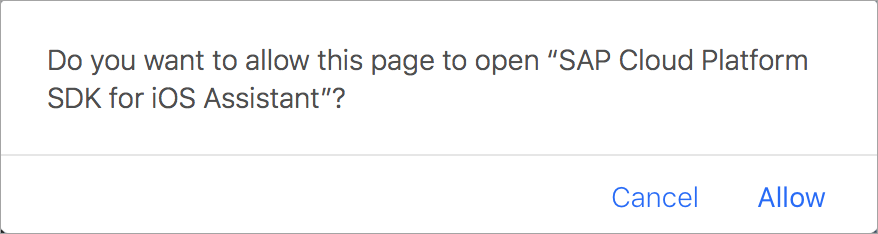

Click the **Open SAP BTP SDK Assistant for iOS** button. The SAP BTP SDK Assistant for iOS application will start. The **New Account** settings dialog will open, and both **Admin API URL** and **Admin UI URL** parameters are pre-populated automatically:

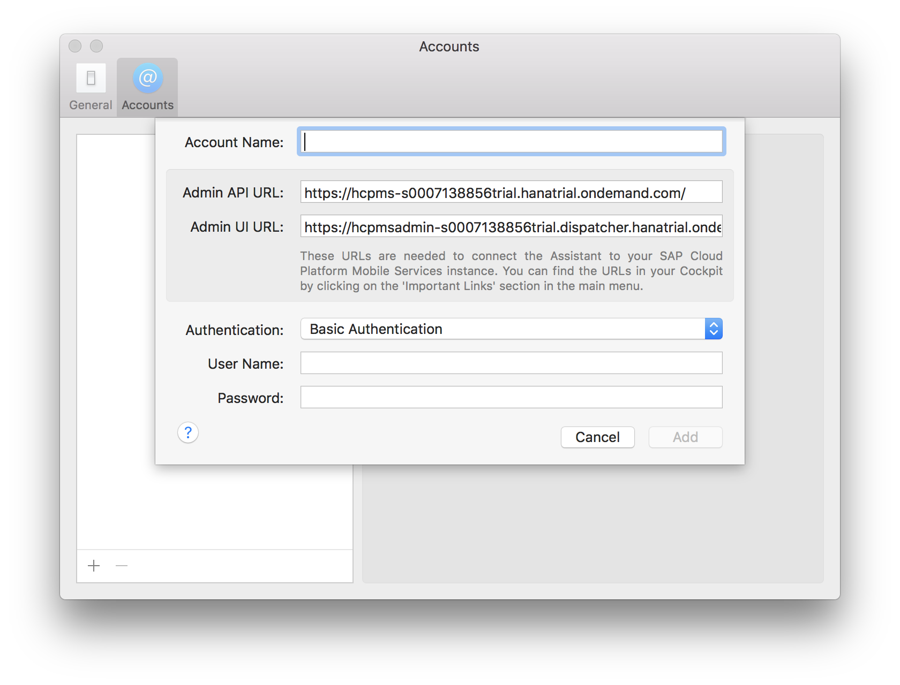

Provide the following additional details:

| Field | Value |
|----|----|
| Name | A descriptive name for the configuration, for instance `SAP Mobile Services` |
| Authentication Type | `Basic Authentication` |
| User | Your trial account user |
| Password | Password for your trial account user |

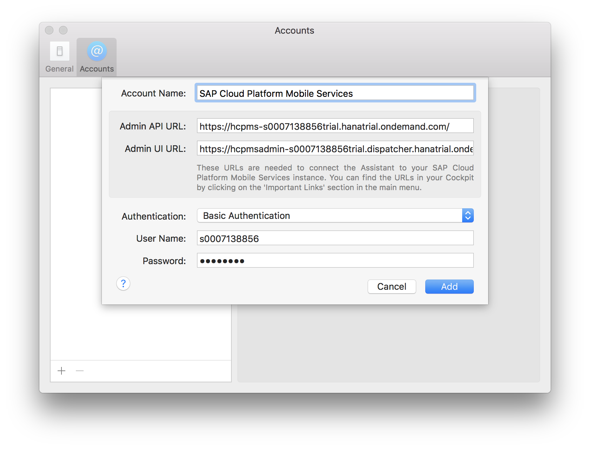

Click **Add** when finished. The account is now added to the SAP BTP SDK Assistant for iOS:

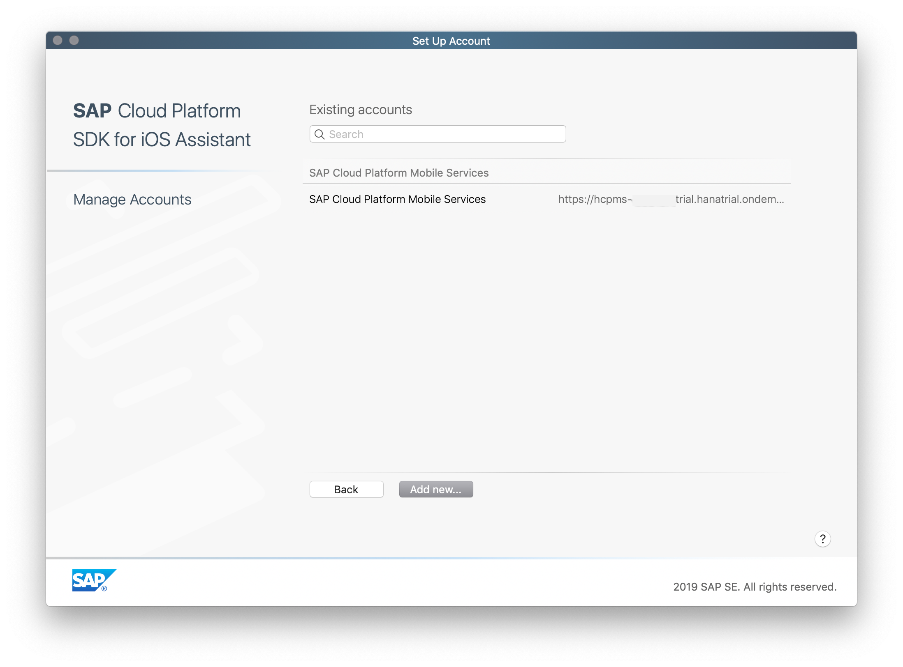

Close the **Accounts** dialog.

[DONE]
[ACCORDION-END]

[ACCORDION-BEGIN [Step 2: ](Run the SAP BTP SDK Assistant for iOS)]

> **Note**: If you went through "Step 1 - Configure SAP BTP SDK Assistant for iOS", the SAP BTP SDK Assistant for iOS is already running and you may continue to "Step 3 - Create an Xcode Project".

.

Double-click the **SAP BTP SDK Assistant for iOS** icon to start the application. If no applications have been generated previously, you will see the initial screen:

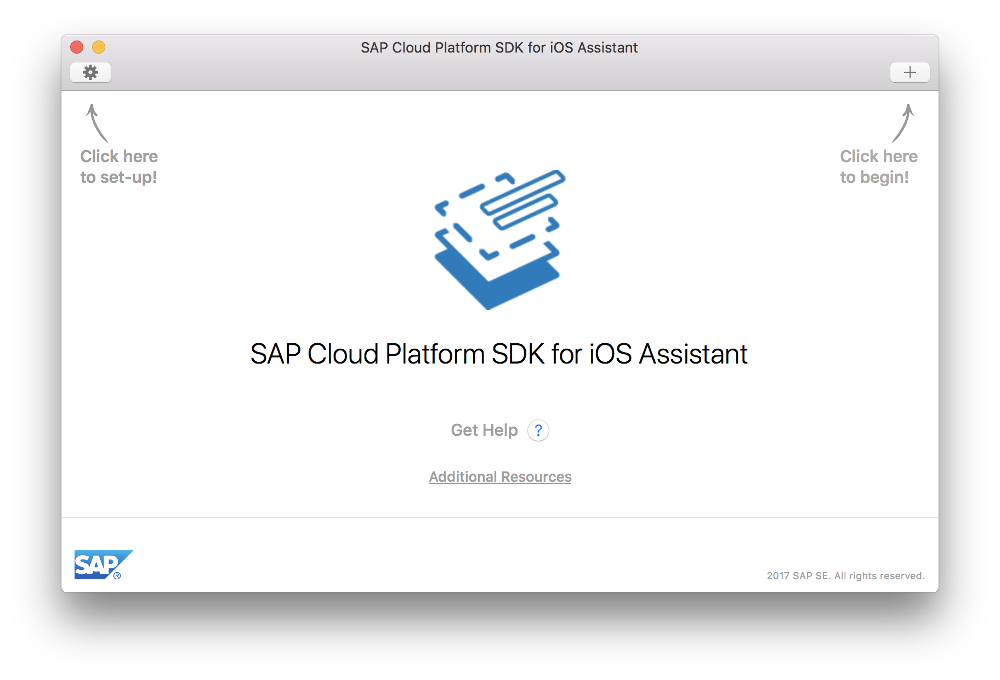

[DONE]
[ACCORDION-END]

[ACCORDION-BEGIN [Step 3: ](Create an Xcode Project)]

Click the **Plus** button on the top-right of the SAP BTP SDK Assistant for iOS. The first page of the Xcode Project generation wizard lets you define the **Project Properties**.

Enter the following details:

| Field | Value |
|----|----|
| Product Name | `ESPMReminders` |
| Author | `<your name>` |
| Organization Name | `<your company name>` |
| Organization Identifier | `com.sap.tutorials.demoapp` |
| Destination | `<choose a local destination>` |

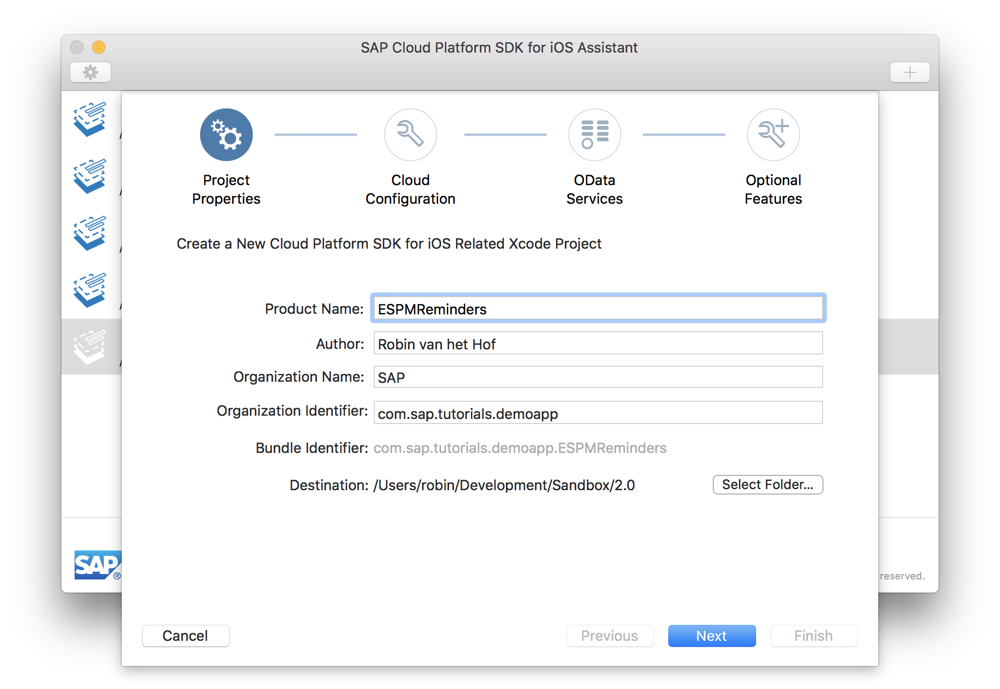

Click **Next** to advance to the **Cloud Configuration** step.

[DONE]
[ACCORDION-END]

[ACCORDION-BEGIN [Step 4: ](Cloud Configuration details)]

In the **Cloud Configuration** page, select the **Sample** tab button. This will ensure your app will use the Sample ESPM OData service.

Make sure the **Sample Application Identifier** is set to:

| Field | Value |
|----|----|
| Sample Application Identifier | `com.sap.tutorials.demoapp.ESPMReminders` |

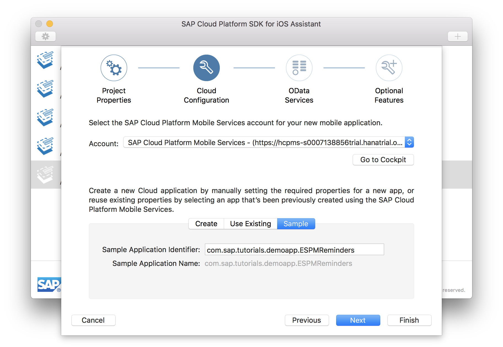

Click **Next** to advance to the **OData Services** step.

[DONE]
[ACCORDION-END]

[ACCORDION-BEGIN [Step 5: ](OData Services)]

In the **OData Services** page, the Sample OData service is now listed in the available destinations:

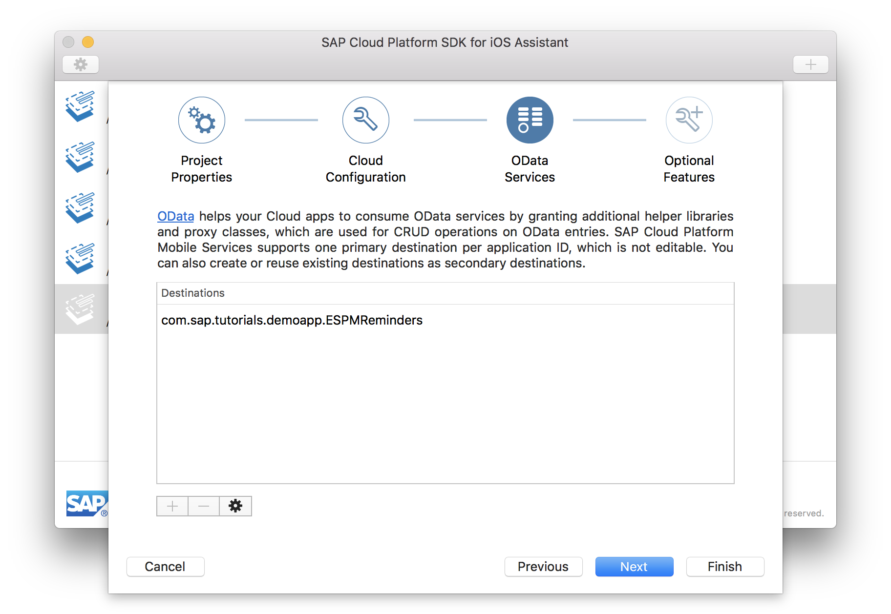

Click **Next** to advance to the **Optional Features** step.

[DONE]
[ACCORDION-END]

[ACCORDION-BEGIN [Step 6: ](Optional Features)]

In the **Optional Features** page, the options to generate a **Master-Detail Application**, enable **logging** and **log uploads**, and enable **remote notifications** are checked. Since you have chosen to use the Sample OData service, the options are disabled.

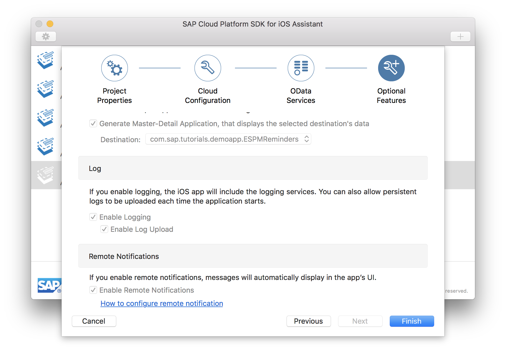

Click **Finish** to complete the wizard.

[DONE]
[ACCORDION-END]

[ACCORDION-BEGIN [Step 7: ](Generating the Xcode project)]

After you have clicked **Finish** in the previous step, the SAP BTP SDK Assistant for iOS now loads the Sample OData service's metadata. Based on this metadata, the OData proxy classes will be generated for the Xcode project, as well as the storyboards and view controllers for each entity set.

> **NB:** If you have already 3 native applications defined in SAP Mobile Services for development and operations, the SAP BTP SDK Assistant for iOS will give the following error:

> 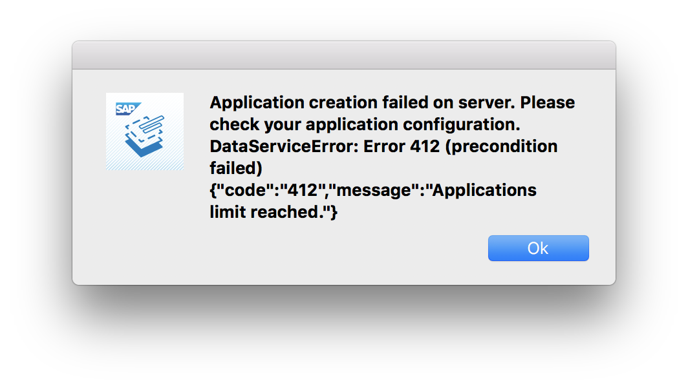

> In that case, log on to your **SAP Mobile Services for development and operations** account at `https://hcpms-<your_user_id>trial.dispatcher.hanatrial.ondemand.com/` and navigate to **Mobile Applications > Native/Hybrid**. Select one of the available application configurations and delete in order for the SAP BTP SDK Assistant for iOS to add the new application configuration.

[DONE]

[ACCORDION-END]

[ACCORDION-BEGIN [Step 8: ](Examine the generated Xcode Project)]

After the SAP BTP SDK Assistant for iOS has finished, **Xcode** will launch and open the just generated `ESPMReminders` project.

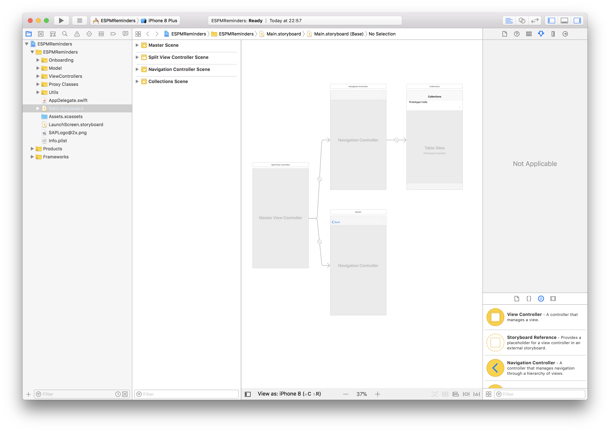

The `Main.storyboard` shows split-view setup for the generated Master-Detail views.

Folder `ESPMReminders/Onboarding` contains logic for the user on-boarding, authentication and handling of pass-codes and Touch ID.

Folder `Proxy Classes/public` contains the OData proxy classes generated from the Sample OData service. File `MyPrefixMyServiceClass.swift` acts as a data service provider to gain access to the OData entities. The remaining `MyPrefix<Entity>.swift` classes give access to the various properties of the OData entities.

[DONE]
[ACCORDION-END]

[ACCORDION-BEGIN [Step 9: ](Build and run the generated application)]

Click the **Run** button to build and run the generated application:


The **Simulator** app now launches. If you have configured the app to allow for push notifications, you will get the following pop-up:

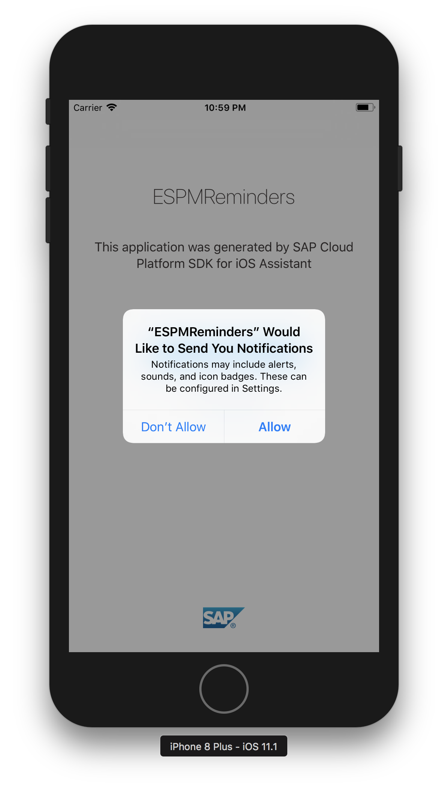

Press **Allow**.

Your app's onboarding landing page is now shown:

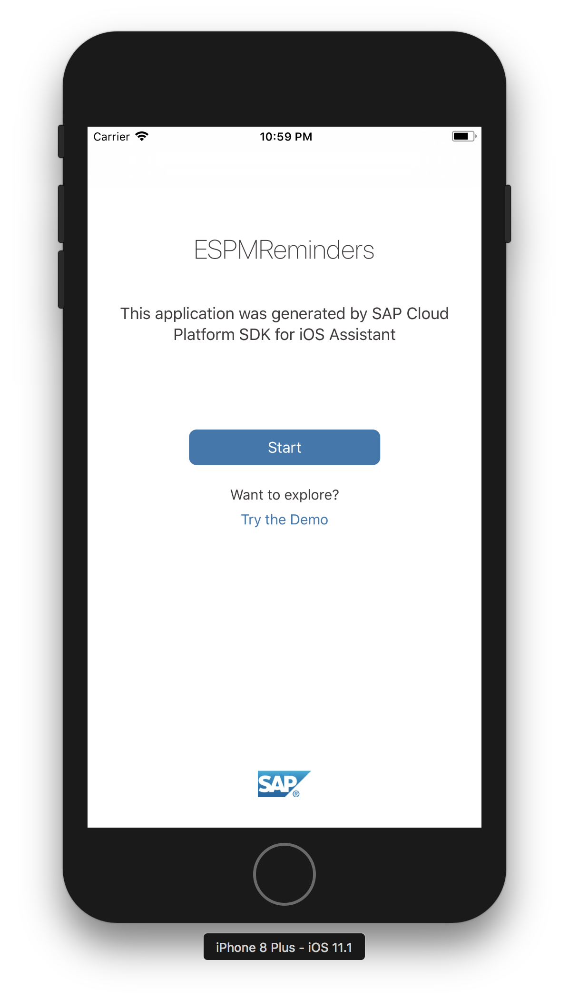

Click the blue **Start** button.

The **Basic Authentication** login screen of your app is shown. Enter your login credentials for the SAP BTP and press the **Log On** button:

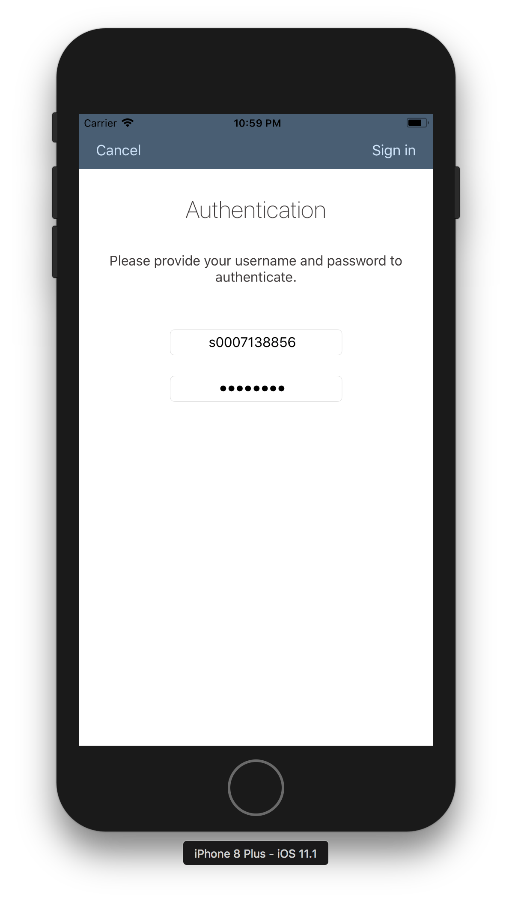

The app now gives you the option to enable Touch ID for quick access to your app. Since you are running from the simulator, you can click **Not Now**

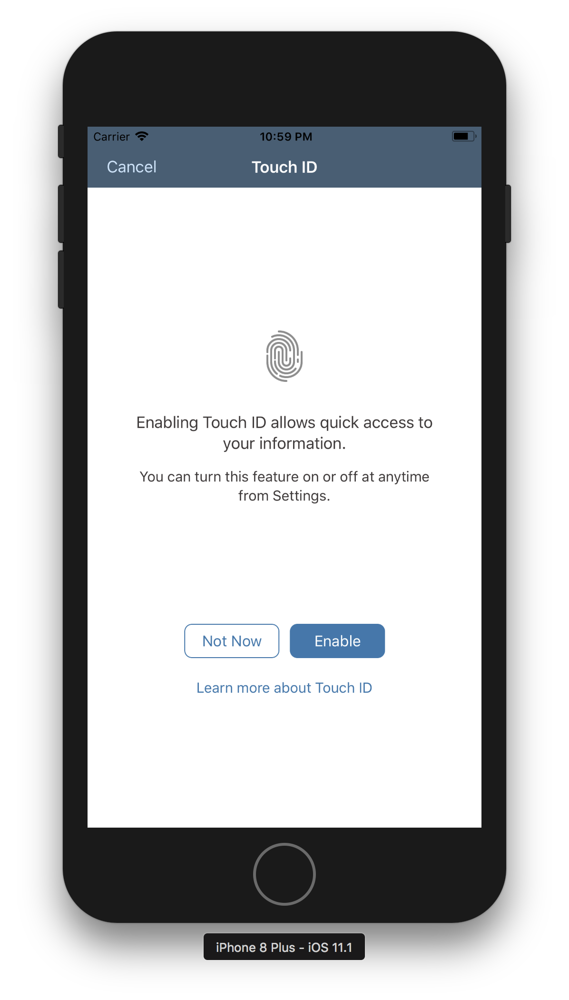

Now, you should provide a passcode with a minimum of 8 characters. Enter a numeric passcode:

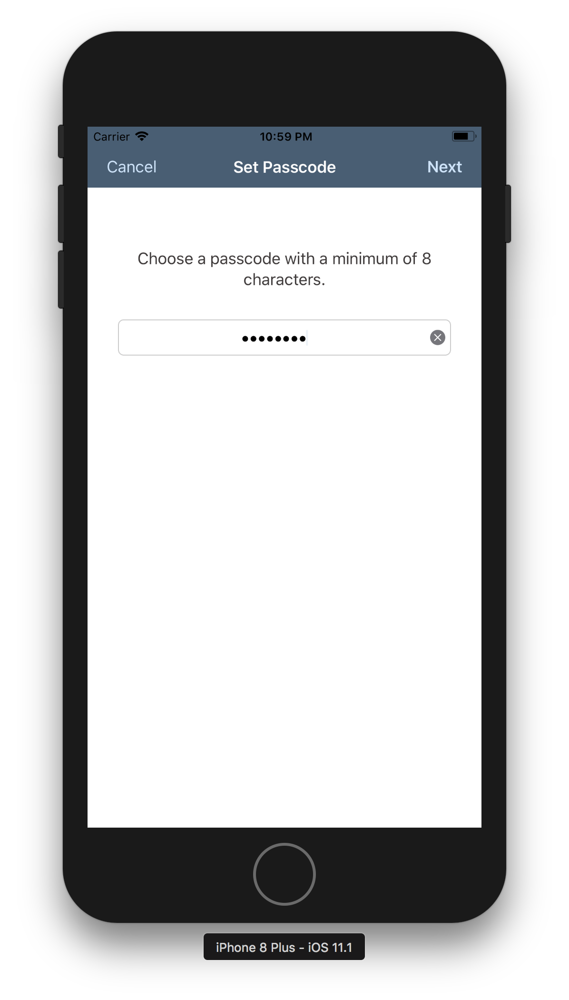

Click **Next**, confirm the passcode, and click **Done**.

The app starts with an overview of the available **Collections** of the OData service:

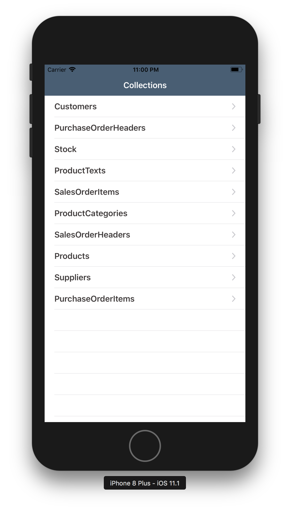

[DONE]
[ACCORDION-END]

[ACCORDION-BEGIN [Step 10: ](Examine the generated application)]

If you now click on one the collections, you navigate to a **Master** list with all available entities. Clicking on one of the listed entities navigates you to a **Detail** page which lists all the properties for the selected entity.

While this is nice if you need a data browser for your OData service, it's not exactly what we want to achieve for our app.

Instead of start off with a list of all collections, we need a single list which loads all customers with their contact details. With a single tap, you should be able to call or email that customer, as well as add a reminder to contact him or her at a later time. This will be implemented in the final steps of this tutorial.

[DONE]
[ACCORDION-END]

[ACCORDION-BEGIN [Step 11: ](Remove the generated UI elements)]

In your Xcode project, open the `Main.storyboard` and remove every scene in it.

Then, open group `ESPMReminders/ViewControllers` and remove everything, **except** the file `SnapshotViewController.swift`.

> The snapshot view controller is used as a placeholder view when the app is running in the background, and thus hiding potential sensitive data.

.

Your project should now resemble the following:

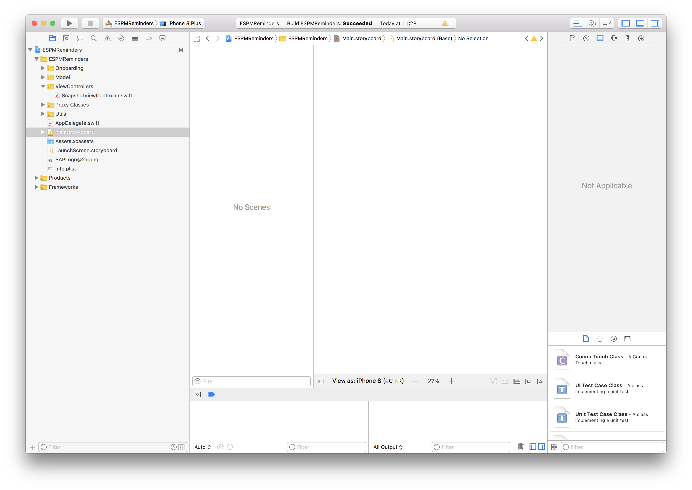

[DONE]
[ACCORDION-END]

[ACCORDION-BEGIN [Step 12: ](Add Navigation Controller)]

Drag a **Navigation Controller** object from the **Object library** onto the `Main.storyboard` canvas.

With the **Navigation Controller** selected, go to the **Identity inspector** and set the its **Identity** to the following:

| Field | Value |
|----|----|
| Storyboard ID | `NavigationController` |

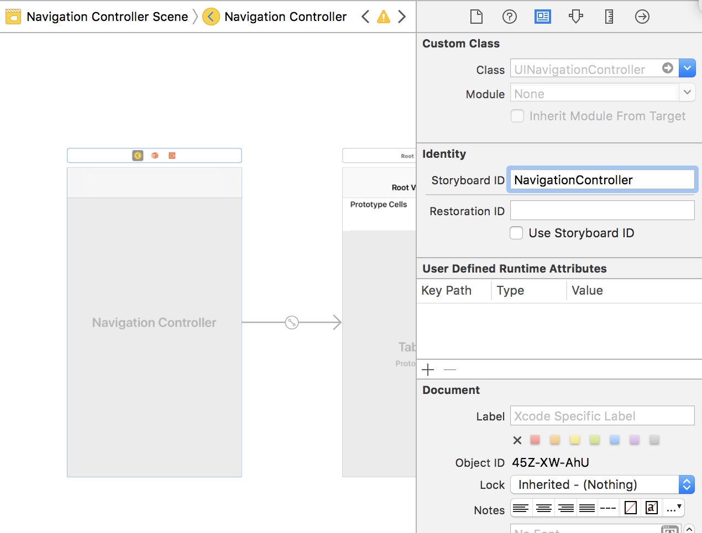

Then, select the **Root View Controller** and from the **Attributes inspector**, set its title to:

| Field | Value |
|----|----|
| Title | `Customers View Controller` |

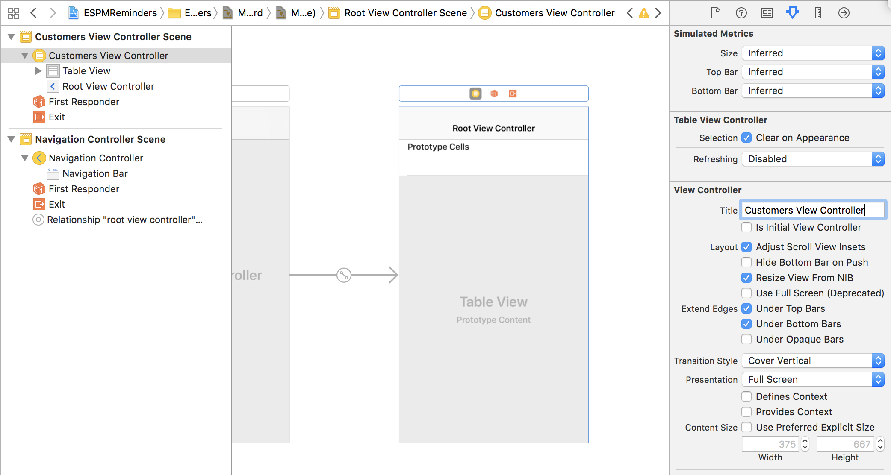

Finally, select the **Root View Controller Navigation Item** and set its title to:

| Field | Value |
|----|----|
| Title | `Customers` |

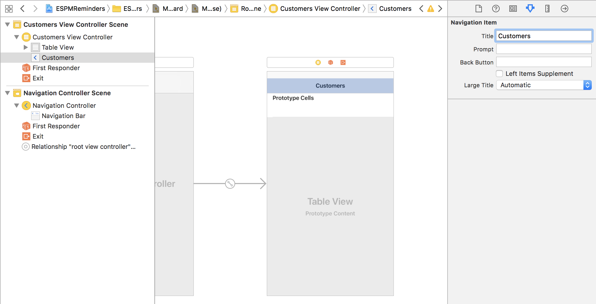

If you now would try to build and run the app, it will fail because of the removal of the generated UI elements. In the nest step, you will fix these errors.

[DONE]
[ACCORDION-END]

[ACCORDION-BEGIN [Step 13: ](Modify AppDelegate class)]

Open the file `AppDelegate.swift`.

Since you removed the split view controller and added a navigation controller instead, you have to remove the delegate for the split view controller and add a delegate for the navigation controller.

Modify the class declaration to the following:

```swift
class AppDelegate: UIResponder, UIApplicationDelegate, UINavigationControllerDelegate, OnboardingManagerDelegate, UNUserNotificationCenterDelegate {
```

Next, locate method `setRootViewController()`. Currently it tries to present the split view controller, but we want to use the new navigation controller instead.

Replace the method with the following:

```swift
    private func setRootViewController() {
        DispatchQueue.main.async {
            let navigationController = UIStoryboard(name: "Main", bundle: Bundle.main).instantiateViewController(withIdentifier: "NavigationController") as! UINavigationController
            navigationController.delegate = self
            navigationController.modalPresentationStyle = .currentContext
            self.window!.rootViewController = navigationController
        }
    }
```

Finally, locate the method `onboarded(onboardingContext:)` and switch the first two lines so it resembles the following:

```swift
    func onboarded(onboardingContext: OnboardingContext) {
        self.configureOData(onboardingContext.sapURLSession, onboardingContext.authenticationURL!)
        self.setRootViewController()
        // etc...
```

This ensures an `SAPURLSession` is created before the view is presented.

If you now build and run the app, after logging in you should see the following screen:

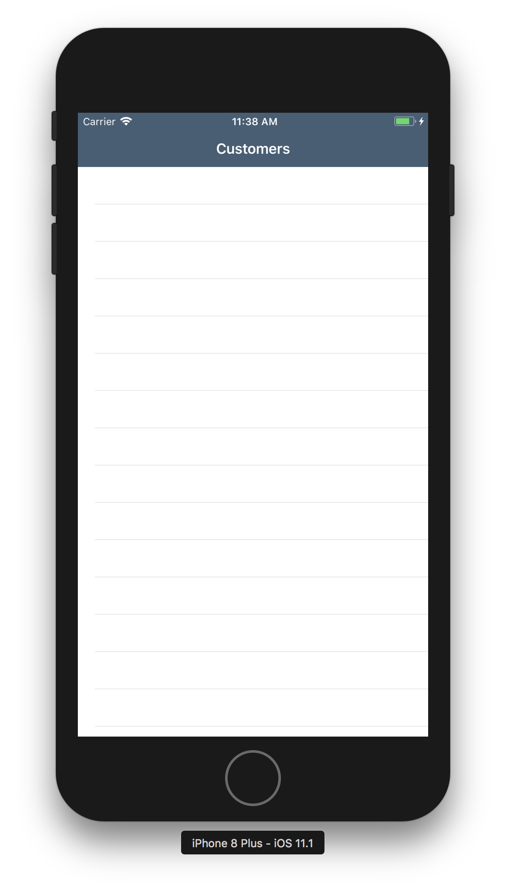

The app correctly displays the newly added **Customers** view. Unsurprisingly, no data is displayed yet since you haven't yet created a controller class for the table view, so the data model isn't yet bound to the UI. Also, you haven't yet specified the particular control which should be used to display the data.

[DONE]
[ACCORDION-END]

[ACCORDION-BEGIN [Step 14: ](Change Table Cell)]

First, you will change the appearance of the standard table cell. By default, it is of type `UITableViewCell`. For the custom UI, you will change it to the SDK's SAP Fiori control `FUIContactCell`.

Select the **Table View Cell** and from the **Identity inspector**, set its **Custom Class** to the following:

| Field | Value |
|----|----|
| Class | `FUIContactCell` |
| Module | `SAPFiori` |

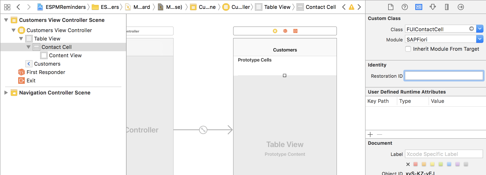

Switch to the **Attributes inspector** and set its **Identifier** to:

| Field | Value |
|----|----|
| Identifier | `ContactCell` |

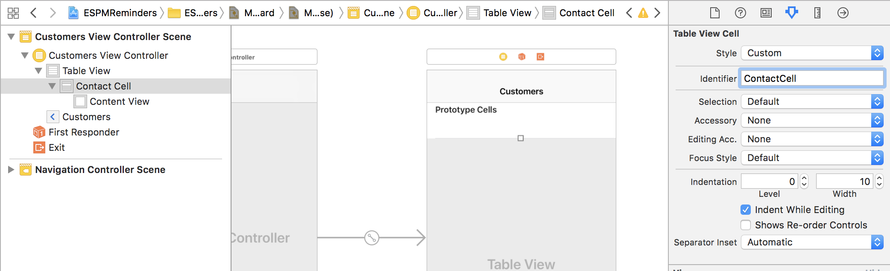

[DONE]
[ACCORDION-END]

[ACCORDION-BEGIN [Step 15: ](Create Table View Controller)]

In the **Project navigator**, right-click the `ViewControllers` group and from the context menu, select **New File...**.

In the wizard, select **Cocoa Touch Class**:

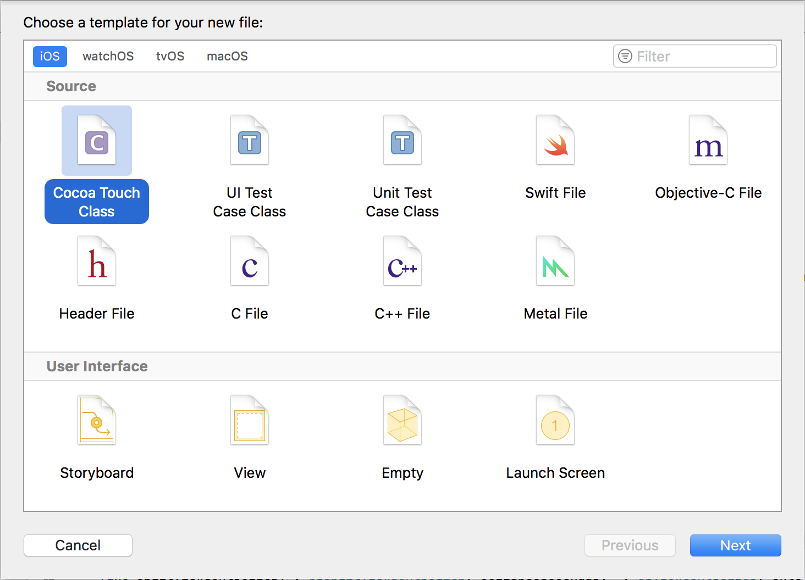

Click **Next**.

In the next page, set the following properties:

| Field | Value |
|----|----|
| Class | `CustomerViewController` |
| Subclass of | `UITableViewController` |
| Language | `Swift` |

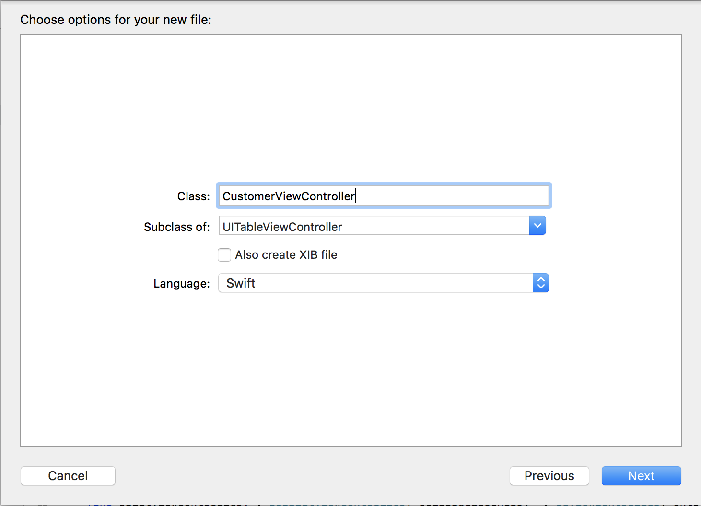

Click **Next**.

In the next page, make sure the file is added to the `ViewControllers` group and click **Finish**. An empty `CustomerViewController.swift` class is now created.

[DONE]
[ACCORDION-END]

[ACCORDION-BEGIN [Step 16: ](Link Table View to Controller)]

Open `Main.storyboard` and select the **Customers View Controller**. From the **Identity inspector**, set its **Custom Class** to the following:

| Field | Value |
|----|----|
| Class | `CustomerViewController` |
| Module | `ESPMReminders` |
| Inherit Module From Target | unchecked |

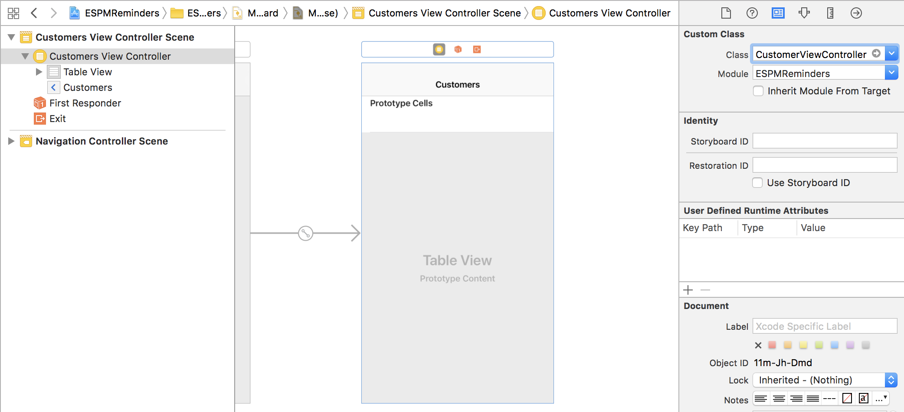

The **Customers View Controller** is now linked to the newly created `CustomerViewController.swift` class, which can now be implemented in the next steps.

[DONE]
[ACCORDION-END]

[ACCORDION-BEGIN [Step 17: ](Implement Table View Controller)]

Open the file `CustomerViewController.swift`.

Replace the default import with the following:

```swift
import Foundation
import SAPFoundation
import SAPOData
import SAPFiori
import SAPCommon
```

Change the class declaration to the following:

```swift
class CustomerViewController: FUIFormTableViewController, SAPFioriLoadingIndicator {
```

This ensures the view will implement the SAP Fiori style table view controller, as well as the SAP Fiori loading indicator.

Add the following fields:

```swift
private let appDelegate = UIApplication.shared.delegate as! AppDelegate
private var myServiceClass: MyPrefixMyServiceClass<OnlineODataProvider> {
    return self.appDelegate.myServiceClass
}

private var entities: [MyPrefixCustomer] = [MyPrefixCustomer]( )
private let logger = Logger.shared(named: "CustomerViewControllerLogger")
private let okTitle = NSLocalizedString("keyOkButtonTitle",
                                        value: "OK",
                                        comment: "XBUT: Title of OK button.")
var loadingIndicator: FUILoadingIndicatorView?
```

These provide references to the `AppDelegate`, the OData service class, the logger, etc.

Next, locate method `numberOfSections(tableView:)` and change its implementation to:

```swift
override func numberOfSections(in tableView: UITableView) -> Int {
    // #warning Incomplete implementation, return the number of sections
    return 1
}
```

Locate method `tableView(tableView:section:)` and change it so it returns the number of customer entities:

```swift
override func tableView(_ tableView: UITableView, numberOfRowsInSection section: Int) -> Int {
    // #warning Incomplete implementation, return the number of rows
    return self.entities.count
}
```

Then, add the following methods which loads the Customer entities and updates the table view once loaded:

```swift
// MARK: - Data accessing

func requestEntities(completionHandler: @escaping (Error?) -> Void) {
    // Only request the first 20 values. If you want to modify the requested entities, you can do it here.
    let query = DataQuery().selectAll().top(20)
    self.myServiceClass.fetchCustomers(matching: query) { customers, error in
        guard let customers = customers else {
            completionHandler(error!)
            return
        }
        self.entities = customers
        completionHandler(nil)
    }
}

// MARK: - Table update

func updateTable() {
    self.showFioriLoadingIndicator()
    let oq = OperationQueue()
    oq.addOperation({
        self.loadData {
            self.hideFioriLoadingIndicator()
        }
    })
}

private func loadData(completionHandler: @escaping () -> Void) {
    self.requestEntities { error in
        defer {
            completionHandler()
        }
        if let error = error {
            let alertController = UIAlertController(title: NSLocalizedString("keyErrorLoadingData", value: "Loading data failed!", comment: "XTIT: Title of loading data error pop up."), message: error.localizedDescription, preferredStyle: .alert)
            alertController.addAction(UIAlertAction(title: self.okTitle, style: .default))
            OperationQueue.main.addOperation({
                // Present the alertController
                self.present(alertController, animated: true)
            })
            self.logger.error("Could not update table. Error: \(error)", error: error)
            return
        }
        OperationQueue.main.addOperation({
            self.tableView.reloadData()
            self.logger.info("Table updated successfully!")
        })
    }
}

@objc func refresh() {
    let oq = OperationQueue()
    oq.addOperation({
        self.loadData {
            OperationQueue.main.addOperation({
                self.refreshControl?.endRefreshing()
            })
        }
    })
}
```

Change the `viewDidLoad()` method to the following:

```swift
override func viewDidLoad() {
    super.viewDidLoad()

    self.edgesForExtendedLayout = []
    self.tableView.rowHeight = UITableViewAutomaticDimension
    self.tableView.estimatedRowHeight = 98
    self.updateTable()
}
```

Finally, add the following method:

```swift
override func tableView(_ tableView: UITableView, cellForRowAt indexPath: IndexPath) -> UITableViewCell {
    let cell = tableView.dequeueReusableCell(withIdentifier: "ContactCell", for: indexPath) as! FUIContactCell

    let customer = self.entities[indexPath.row]

    cell.headlineText = "\(customer.firstName!) \(customer.lastName!)"
    cell.subheadlineText = "\(customer.city!), \(customer.country!)"

    cell.descriptionText = customer.phoneNumber
    cell.splitPercent = CGFloat(0.3) // Default is 30%

    return cell
}
```

This references the `FUIContactCell` of the table view, and binds its properties to the current entity referenced by variable `customer`.

If you now build and run your app, it will now present the Sample OData service's **Customer** entities using the SAP Fiori Contact Cell:

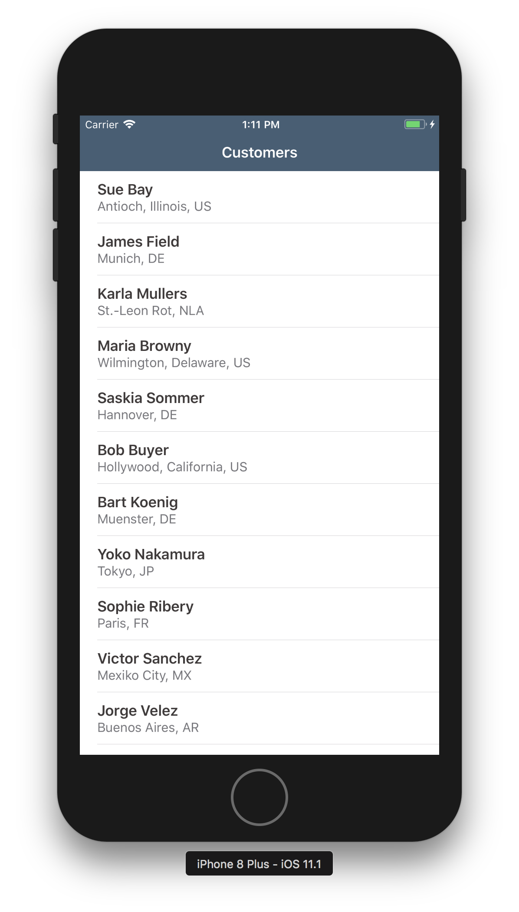

However, there are still some things missing. In the final steps, you will add activity buttons for calling and emailing a customer, as well as adding an activity for creating a reminder.

[DONE]
[ACCORDION-END]

[ACCORDION-BEGIN [Step 18: ](Add Contact Cell Activities)]

In the file `CustomerViewController.swift`, add the following private field:

```swift
    private var activities = [FUIActivityItem.phone, FUIActivityItem.email, FUIActivityItem.detail]
```

This defines the activities the `FUIContactCell` will use.

Go back to method `tableView(_:cellForRowAt:)` and below the line `cell.splitPercent = CGFloat(0.3)`, add the following code:

```swift
cell.activityControl.addActivities(activities)
cell.activityControl.maxVisibleItems = 4
cell.onActivitySelectedHandler = { activityItem in
    switch activityItem {
    case FUIActivityItem.phone:
        guard let number = URL(string: "tel://" + customer.phoneNumber!) else { return }
        if UIApplication.shared.canOpenURL(number) {
            UIApplication.shared.open(number)
        }
    case FUIActivityItem.message:
        guard let sms = URL(string: "sms:" + customer.phoneNumber!) else { return }
        if UIApplication.shared.canOpenURL(sms) {
            UIApplication.shared.open(sms)
        }
    case FUIActivityItem.detail:
        // self.createReminder(customer: customer)
        break
    default:
        break
    }
}
```

This will add the activity buttons for calling, emailing and creating a reminder (which will be implemented in the final steps)

> To make the UI a bit more pleasing, you may consider adding a placeholder image for the contact cell:
>
> - On the web, search for `person placeholder image` and download a nice looking image.
> - Drag the file into your Xcode project's `Assets.xcassets` folder and rename it to a unique name, for instance `PersonPlaceholder`.
> - Display the image as an image literal in the `tableView(_:cellForRowAt:)` method:

> ```swift
> cell.detailImage = #imageLiteral(resourceName: "PersonPlaceholder")
> ```

.

If you now build and run the app, it looks and works a lot better:

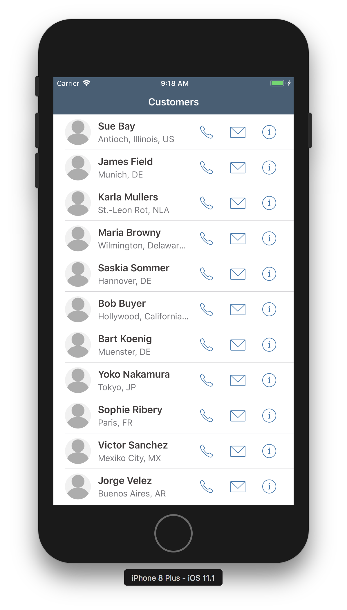

If you would run this on a physical device, you should now be able to initiate a call to the bound number or start an email to the bound email address for the selected customer.

The logic for creating a reminder will be added in the final step.

[DONE]
[ACCORDION-END]

[ACCORDION-BEGIN [Step 19: ](Create reminders)]

To work with calendars and reminders, you need to implement the `EventKit`. Add the following import statement:

```swift
import EventKit
```

Add the following fields:

```swift
var eventStore: EKEventStore!
var calendars:Array<EKCalendar> = []
var espmCalendar: EKCalendar!
```

At the bottom of the `viewDidLoad()` method, add the following:

```swift
eventStore = EKEventStore()
eventStore.requestAccess(to: EKEntityType.reminder, completion: {(granted, error) in
    if !granted {
        self.logger.error("Access to reminders not granted")
    } else {
        self.calendars = self.eventStore.calendars(for: EKEntityType.reminder)

        self.checkIfESPMReminderListExists()
    }
})
```

This will initialize the event store, and check for permissions to access your reminders. It then holds an array of available reminder lists, and finally it will call a not yet implemented method `checkIfESPMReminderListExists()` to check whether a custom reminder list `ESPM` already exists.

In order for your app to access your reminders, you must add an entry in the app's `Info.plist` file:

| Field | Value |
|----|----|
| Key | `Privacy - Reminders Usage Description` |
| Value | `$(PRODUCT_NAME) needs to access your reminders` |

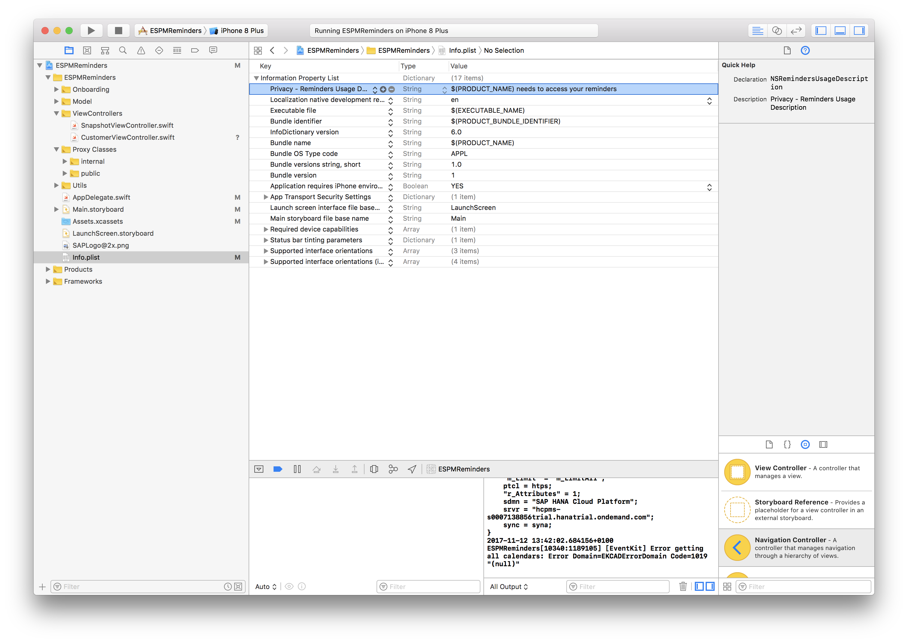

Next, add the following two methods:

```swift
    func checkIfESPMReminderListExists() {
        var calenderExists = false

        for calendar in calendars as [EKCalendar] {
            if calendar.title == "ESPM" {
                calenderExists = true
                self.espmCalendar = calendar
            }
        }

        if !calenderExists {
            createESPMReminderList()
        }
    }

    func createESPMReminderList() {
        espmCalendar = EKCalendar(for: EKEntityType.reminder, eventStore: self.eventStore)
        espmCalendar.title="ESPM"
        espmCalendar.source = self.eventStore.defaultCalendarForNewReminders()?.source

        do {
            try self.eventStore.saveCalendar(espmCalendar, commit:true)
        } catch let error {
            logger.error("Calendar creation failed with error \(error.localizedDescription)")
        }
    }
```

These will check if the custom reminders list `ESPM` exist. If it doesn't, it will create one.

Then, add the logic to actually create a reminder for a selected customer:

```swift
    func createReminder(customer: MyPrefixCustomer) {
        let reminder = EKReminder(eventStore: self.eventStore)

        reminder.title = "Call \(customer.firstName!) \(customer.lastName!)"
        reminder.notes = "Phone: \(customer.phoneNumber!)\nEmail: \(customer.emailAddress!)"

        reminder.calendar = self.espmCalendar

        do {
            try self.eventStore.save(reminder, commit: true)

            let alert = UIAlertController(title: NSLocalizedString("keyReminderCreated", value: "Reminder has been created", comment: "XTIT: Title of reminder creation pop up."), message: "Reminder has been created", preferredStyle: .alert)
            alert.addAction(UIAlertAction(title: self.okTitle, style: .default))
            self.present(alert, animated: true, completion: nil)

        } catch let error {
            print("Reminder failed with error \(error.localizedDescription)")
        }
    }
```

This will create a reminder with the contact details for the selected customer.

To call this method, uncomment the code in the switch statement for activity `FUIActivityItem.detail` in method `tableView(_:cellForRowAt:)`:

```swift
case FUIActivityItem.detail:
    self.createReminder(customer: customer)
```

[DONE]
[ACCORDION-END]

[ACCORDION-BEGIN [Step 20: ](Build and run the app)]

If you now build and run the app, you will see the following pop-up:

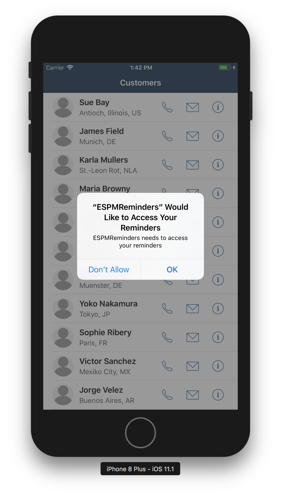

Click **OK** and click on the detail button for one of the customers to create a reminder. If successfully created, you will see the following message:

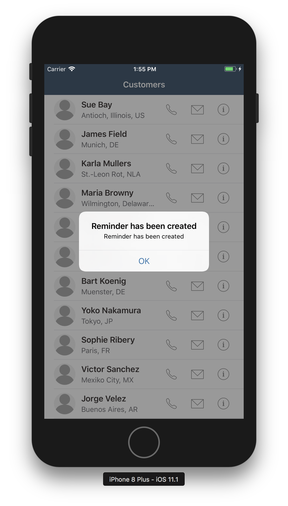

If you now open the standard **Reminders** app on the device, your reminders are created in the custom `ESPM` group:

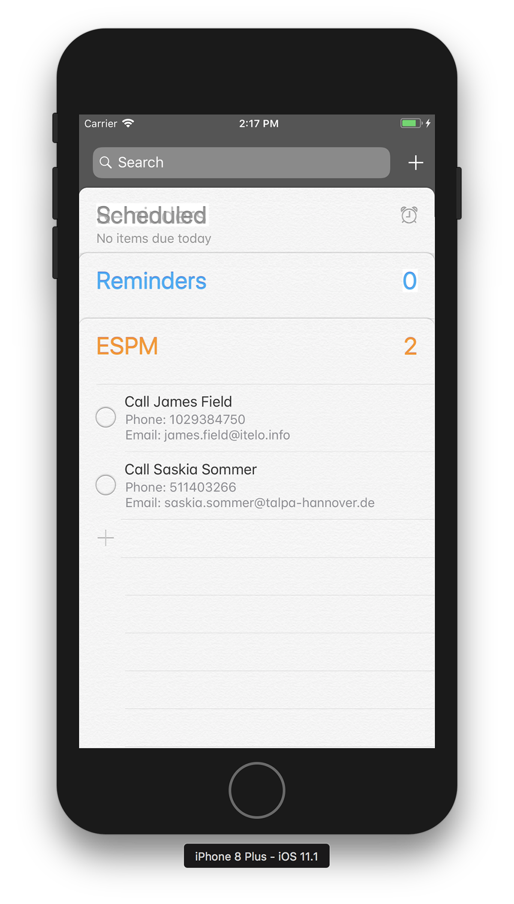

[VALIDATE_20]
[ACCORDION-END]

---
