## Prerequisites  

- **Proficiency:** Beginner
- **Development environment:** Apple iMac, MacBook or MacBook Pro running Xcode 9 or higher
- **SAP BTP SDK for iOS:** Version 2.1
- **Tutorials:** [Sign up for a free trial account on SAP BTP](hcp-create-trial-account) and [Enable SAP Mobile Services for development and operations](fiori-ios-hcpms-setup)

## How-To Details

As of version 2.1, the SAP BTP SDK for iOS now incorporates a **Chart Floor plan** for data visualisation.

In this tutorial, you will use the Sample OData service to visualize stock item quantities using a bar chart.

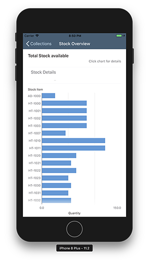

### Time to Complete

**20 Min**

---

[ACCORDION-BEGIN [Step 1: ](Create Xcode project with SAP BTP SDK Assistant for iOS)]

On your local machine, navigate to your `./<SAP BTP SDK for iOS>` folder. Double-click the **SAP BTP SDK Assistant for iOS** icon to start the application.

Click the **Plus** button on the top-right of the SAP BTP SDK Assistant for iOS. The first page of the Xcode Project generation wizard lets you define the Project Properties.

Enter the following details:

| Field | Value |
|----|----|
| Product Name | `DataViz` |
| Author | `<your name>` |
| Organization Name | `<your company name>` |
| Organization Identifier | `com.sap.tutorials.demoapp` |
| Destination | `<choose a local destination>` |

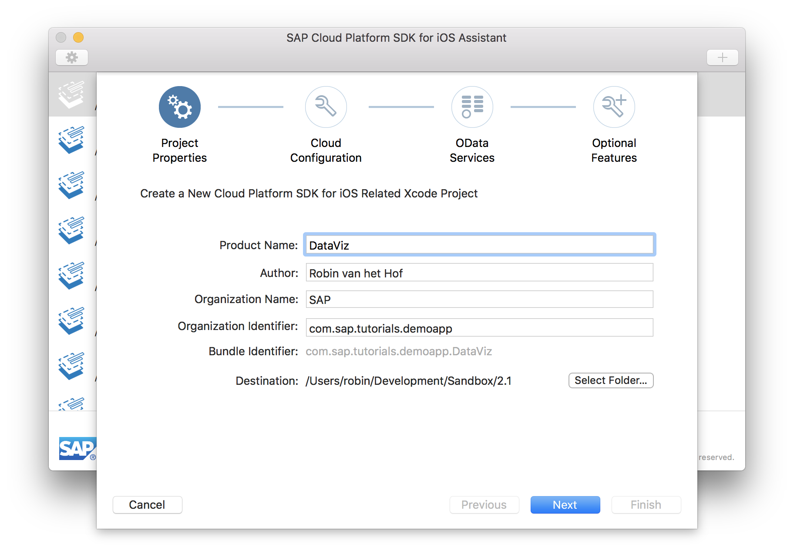

Click **Next** to advance to the **SAP Mobile Services for development and operations Configuration** step.

In the **SAP Mobile Services for development and operations Configuration** page, select the **Sample** tab button.

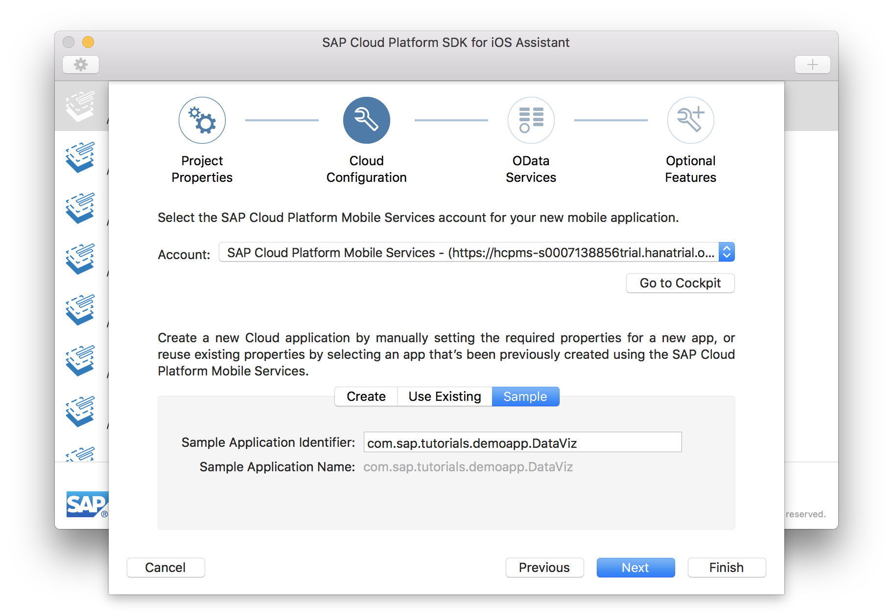

The Sample Application Identifier and Sample Application Name are now pre-filled with the Bundle Identifier value from the previous page.

Click **Next** to advance to the **OData Services** step.

In the **OData Services** page, the Sample OData service connection you have specified in the previous wizard step is displayed:

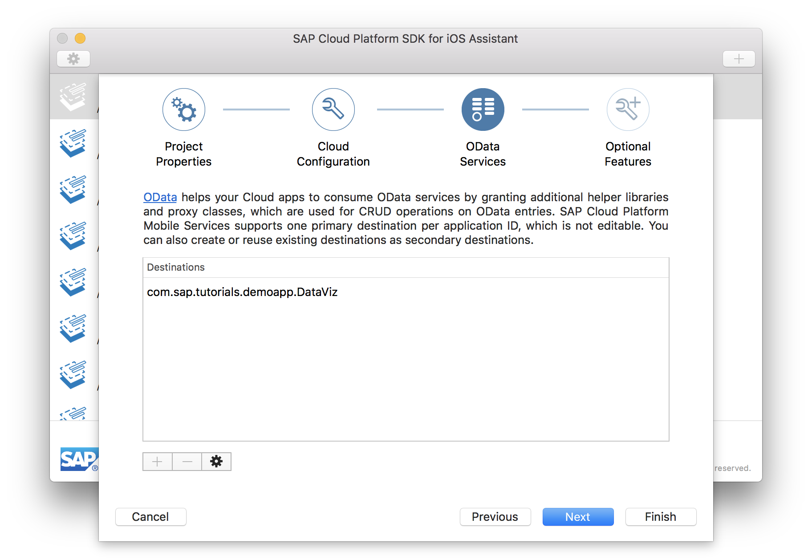

Click **Next** to advance to the **Optional Features** step.

In the **Optional Features** page, you have the option to generate a **Master-Detail Application**, enable **logging** and **log uploads**, and enable **remote notifications**. Since you're using the Sample OData service, all settings are enabled but greyed out.

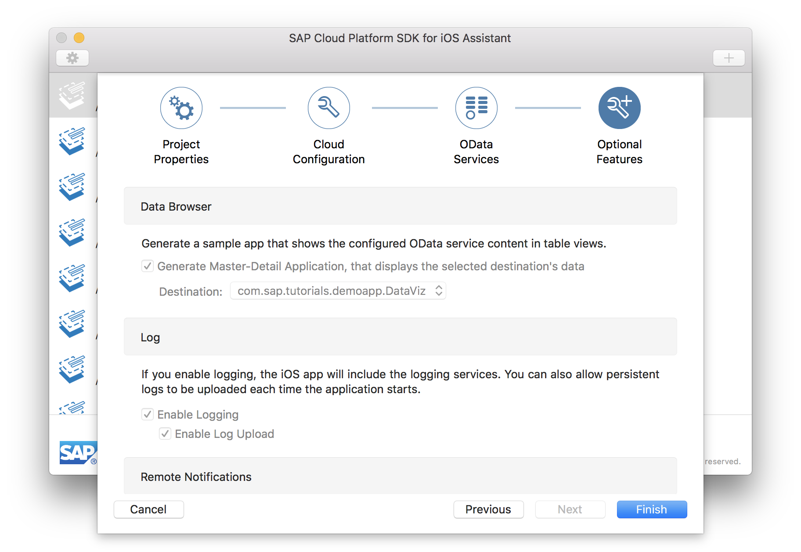

After you have clicked **Finish** in the previous step, the SAP BTP SDK Assistant for iOS now loads the OData service's metadata. This metadata describes the data model, and can be accessed via `<service URL>$metadata`. For your service, the metadata URL would be `https://hcpms-<your account>trial.hanatrial.ondemand.com/SampleServices/ESPM.svc/$metadata`

After the SAP BTP SDK Assistant for iOS has finished, **Xcode** will launch and open the just generated `DataViz` project.

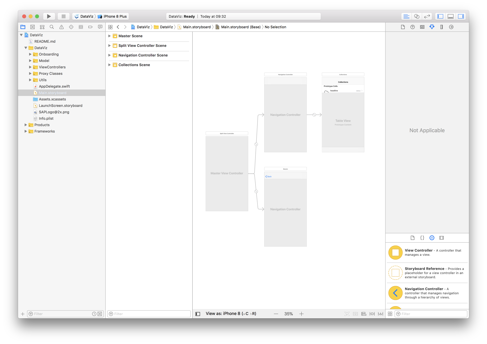

[DONE]
[ACCORDION-END]

[ACCORDION-BEGIN [Step 2: ](Test the generated Xcode project)]

In Xcode, assign the appropriate development account to the project's **Team** property in the **General > Signing** panel, and then build and run the app in the simulator.

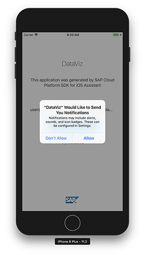

Once the app has started, dismiss the push notifications message by clicking **Allow**.

The on-boarding landing page is now displayed:


Click the blue **Start** button, and in the SAML login screen, provide your SAP BTP credentials:

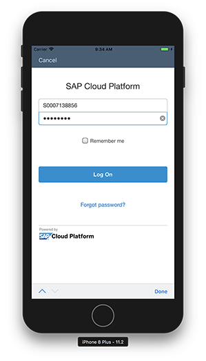

After you click **Log on**, the **EULA** screen is displayed:

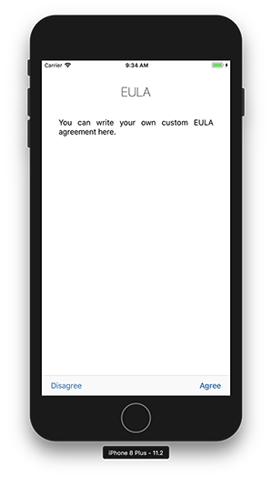

Click **Agree**, and the single entity collection is now shown:

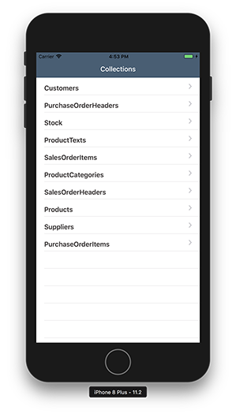

[DONE]
[ACCORDION-END]

[ACCORDION-BEGIN [Step 3: ](Create View Controller)]

In the **Project navigator**, navigate to the `DataViz > ViewControllers > MyPrefixStock` folder. Right-click this folder, and from the context menu, select **New File...**

In the dialog, select **Swift File**:

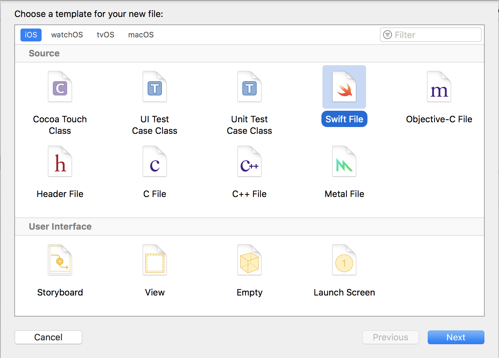

Click **Next** to continue. In the next page, save the file as `StockChart`

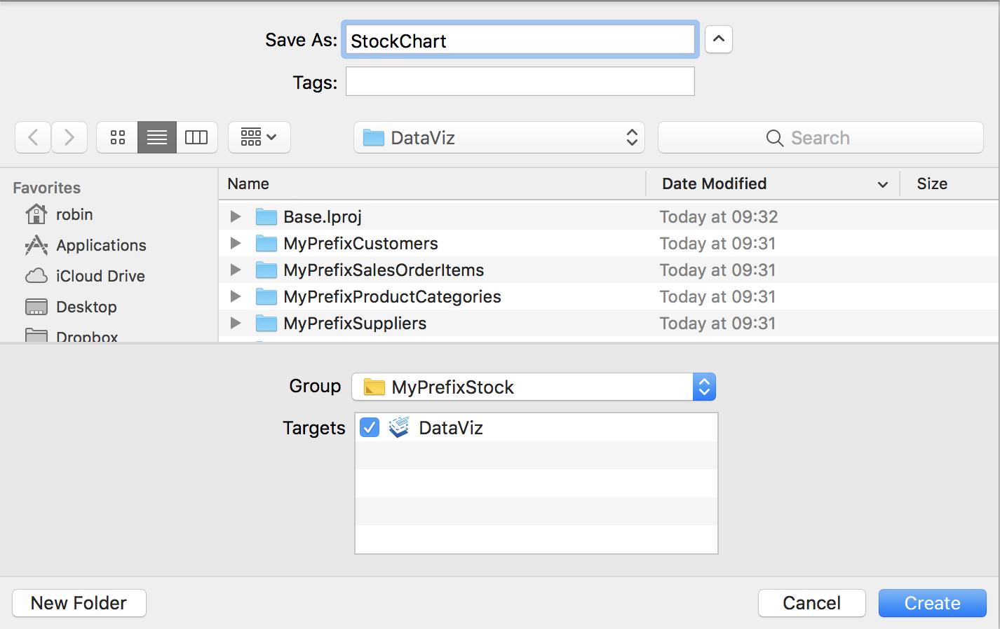

Click **Create** to finalize the wizard. The new file will now open.

[DONE]
[ACCORDION-END]

[ACCORDION-BEGIN [Step 4: ](Implement View Controller)]

First, add the necessary import statements:

```swift
import UIKit
import SAPFoundation
import SAPOData
import SAPFiori
import SAPCommon
```

Then, create an empty class:

```swift
class StockChartViewController: FUIChartFloorplanViewController {

    override func viewDidLoad() {
        super.viewDidLoad()
    }

}
```

Since the idea is to mimic the behavior of the `StockMasterViewController` file, but display the data in a chart instead of a table view, you need to reuse some functionality from this file.

Add the following private fields:

```swift
private let appDelegate = UIApplication.shared.delegate as! AppDelegate
private var myServiceClass: MyServiceClass<OnlineODataProvider> {
    return self.appDelegate.myServiceClass
}

private var entities: [MyPrefixStock] = [MyPrefixStock]( )
private let logger = Logger.shared(named: "MyPrefixStockMasterViewConterollerLogger")
private let okTitle = NSLocalizedString("keyOkButtonTitle",
                                        value: "OK",
                                        comment: "XBUT: Title of OK button.")
```

These will hold, among others, references to the `appDelegate` file, the OData service class, and stores the retrieved `Stock` entities in the `entities` field.

To load the `Stock` data, add the following methods (which are derived from the existing master view controller file) :

```swift
private func updateChartView() {
    let oq = OperationQueue()
    oq.addOperation({
        self.loadData {
        }
    })
}

private func loadData(completionHandler: @escaping () -> Void) {
    self.requestEntities { error in
        defer {
            completionHandler()
        }
        if let error = error {
            let alertController = UIAlertController(title: NSLocalizedString("keyErrorLoadingData", value: "Loading data failed!", comment: "XTIT: Title of loading data error pop up."), message: error.localizedDescription, preferredStyle: .alert)
            alertController.addAction(UIAlertAction(title: self.okTitle, style: .default))
            OperationQueue.main.addOperation({
                // Present the alertController
                self.present(alertController, animated: true)
            })
            self.logger.error("Could not update table. Error: \(error)", error: error)
            return
        }
        OperationQueue.main.addOperation({
            self.renderChart()
            self.logger.info("Chart updated successfully!")
        })
    }
}

func requestEntities(completionHandler: @escaping (Error?) -> Void) {
    // Only request the first 20 values. If you want to modify the requested entities, you can do it here.
    let query = DataQuery().selectAll().top(20)
    self.myServiceClass.fetchStock(matching: query) { stock, error in
        guard let stock = stock else {
            completionHandler(error!)
            return
        }
        self.entities = stock
        completionHandler(nil)
    }
}
```

This will give an error, stating the class has no member `renderChart`. This method will be implemented in the next step

[DONE]
[ACCORDION-END]

[ACCORDION-BEGIN [Step 5: ](Implement display of chart)]

Add the following 3 methods:

```swift
private func initChart() {
    title = "Stock Overview"

    titleText.text         = "Total Stock available"
    status.text            = "Click chart for details"
    categoryAxisTitle.text = "Quantity"
    valuesAxisTitle.text   = "Stock Item"

    headerView.dataSource = self

    renderChartSummaryItem(values: [""])
}

private func renderChart() {

    chartView.chartType         = .bar
    chartView.numberOfGridlines = 4
    chartView.dataSource        = self
    headerView.dataSource       = self

    let values: [Double] = {
        var values: [Double] = []
        for series in chartView.series {
            let categoriesUpperBound = series.numberOfValues - 1
            if let valuesInSeries = series.valuesInCategoryRange((0...categoriesUpperBound), dimension: 0) {
                values.append(valuesInSeries.flatMap({ $0 }).reduce(0.0, +))
            }
        }
        return values
    }()

    renderChartSummaryItem(values: values.map { $0.description })
}

private func renderChartSummaryItem(values: [String]) {
    let item = FUIChartSummaryItem()

    item.categoryIndex = -1
    item.isEnabled = false
    item.isPreservingTrendHeight = false

    item.valuesText = values
    item.title.text = "Stock Details"

    headerView.addItem(item)
}
```

The first method sets the 'static' details for the chart, and will be called from the `viewDidLoad()` method.

The second method is called once the OData service has returned data (and was missing in the previous step)

The third method is called from the previous two methods, and will display a summary of the data when clicking on the chart.

You will also see a couple of other errors. This is because the class needs a couple of delegates which aren't referenced yet. This will be corrected in the next step.

[DONE]
[ACCORDION-END]

[ACCORDION-BEGIN [Step 6: ](Add delegates)]

Add the following two extensions:

```swift
extension StockChartViewController: FUIChartSummaryDataSource {

    func chartView(_ chartView: FUIChartView, summaryItemForCategory categoryIndex: Int) -> FUIChartSummaryItem? {

        let item = FUIChartSummaryItem()

        item.categoryIndex = categoryIndex
        item.isEnabled = true
        item.isPreservingTrendHeight = false

        let values: [Double] = {
            var values: [Double] = []
            for series in chartView.series {
                values.append(series.valueForCategory(categoryIndex, dimension: 0)!)
            }
            return values
        }()

        item.valuesText = values.map { $0.description }
        item.title.text = chartCategoryTitles()[categoryIndex]

        return item
    }
}

extension StockChartViewController: FUIChartViewDataSource {

    func chartSeriesTitles() -> [String] {
        return ["Stock"]
    }

    func chartCategoryTitles() -> [String] {
        return entities.map{$0.productID!}
    }

    func chartData() -> [[Double]] {
        return [entities.map{$0.quantity!.doubleValue()} /*, entities.map{$0.minStock!.doubleValue()} */ ]
    }

    func numberOfSeries(in: FUIChartView) -> Int {
        return chartData().count
    }

    func chartView(_ chartView: FUIChartView, numberOfValuesInSeries seriesIndex: Int) -> Int {
        return chartData()[seriesIndex].count
    }

    func chartView(_ chartView: FUIChartView, valueForSeries series: Int, category categoryIndex: Int, dimension dimensionIndex: Int) -> Double? {
        return chartData()[series][categoryIndex]
    }

    func chartView(_ chartView: FUIChartView, formattedStringForValue value: Double, axis: FUIChartAxisId) -> String? {
        return value.description
    }

    func chartView(_ chartView: FUIChartView, titleForCategory categoryIndex: Int, inSeries seriesIndex: Int) -> String? {
        return chartCategoryTitles()[categoryIndex]
    }

}
```

The first delegate is called when an item on the cart is clicked.

The second delegate populates the chart with the OData entities values (see the mapped values in `chartCategoryTitles()` and `chartData()` methods).

[VALIDATE_6]
[ACCORDION-END]

[ACCORDION-BEGIN [Step 7: ](Modify viewDidLoad method)]

Add the following method calls in the `viewDidLoad()` method:

```swift
initChart()
updateChartView()
```

[DONE]
[ACCORDION-END]

[ACCORDION-BEGIN [Step 8: ](Bind the View Controller to the View)]

The final step is to bind the view controller to a view.

In the **Project navigator**, navigate to `DataViz > ViewControllers > MyPrefixStock` and open `MyPrefixStock.storyboard`.

From the **Object library**, drag a **View Controller** to the storyboard.

In the **Identity inspector**, set the **Custom Class** to `StockChartViewController`.

Set its storyboard ID to `StockDataViz`.

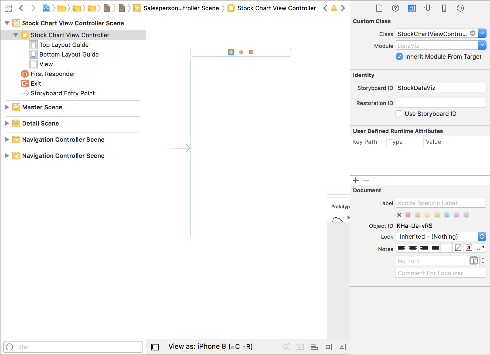

In the **Attributes inspector**, set the view to be the Initial View Controller.

> You may remove the other views in the storyboard.

Navigate up to `DataViz > ViewControllers` and open file `CollectionsViewController.swift`.

Locate method `collectionSelected` and change the switch for `.myPrefixStock` to load the new view with ID `StockDataViz`:

```swift
case .myPrefixStock:
    let myPrefixStockStoryBoard = UIStoryboard(name: "MyPrefixStock", bundle: nil)
    masterViewController = myPrefixStockStoryBoard.instantiateViewController(withIdentifier: "StockDataViz")
    masterViewController.navigationItem.title = "Stock"
```

[DONE]
[ACCORDION-END]

[ACCORDION-BEGIN [Step 9: ](Run the application)]

Build and run the application.

Once loaded, select the **Stock** collection. It should now display the stock quantities in a bar graph:


Select one of the chart items. It should now display the summary info at the top:

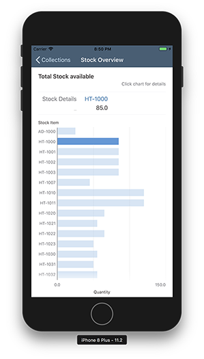

[DONE]
[ACCORDION-END]

---
