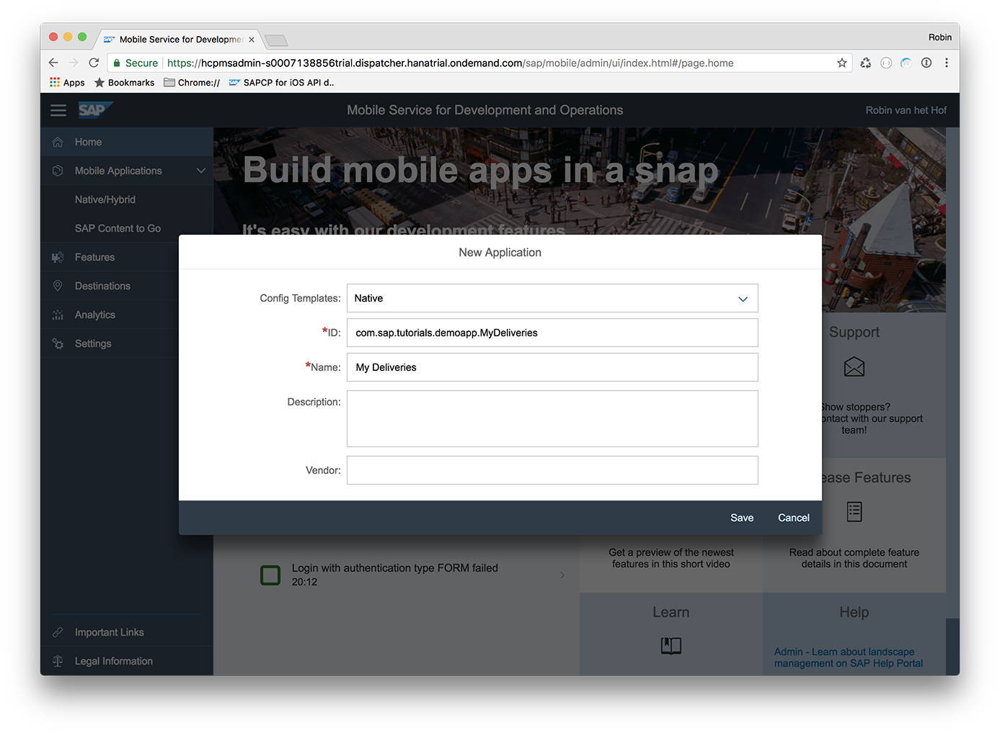
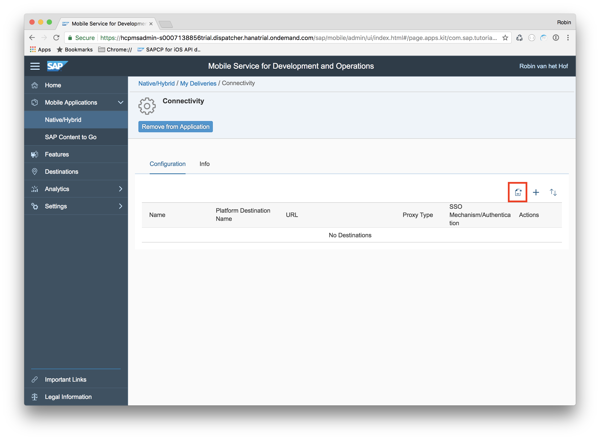
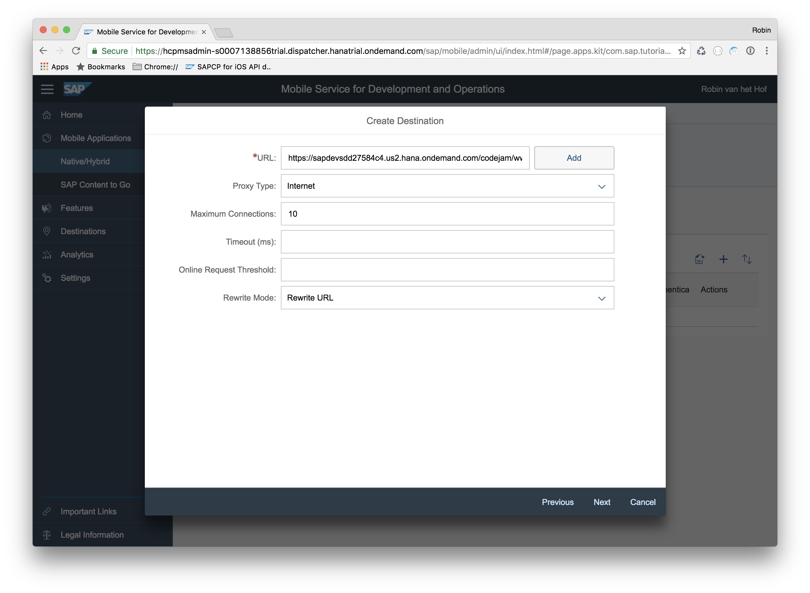
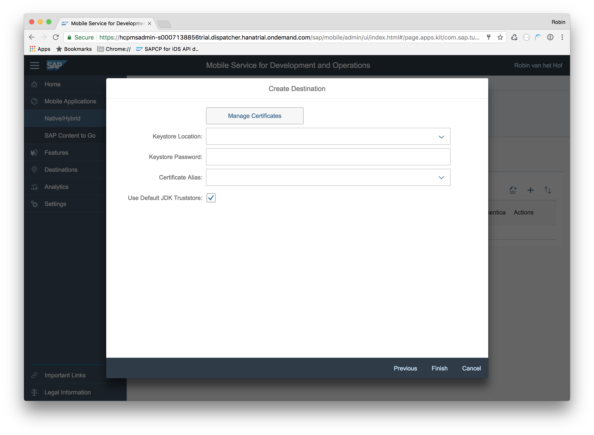
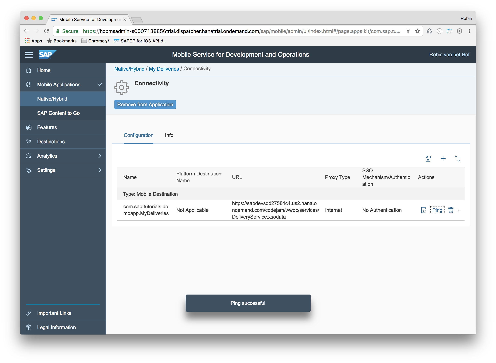
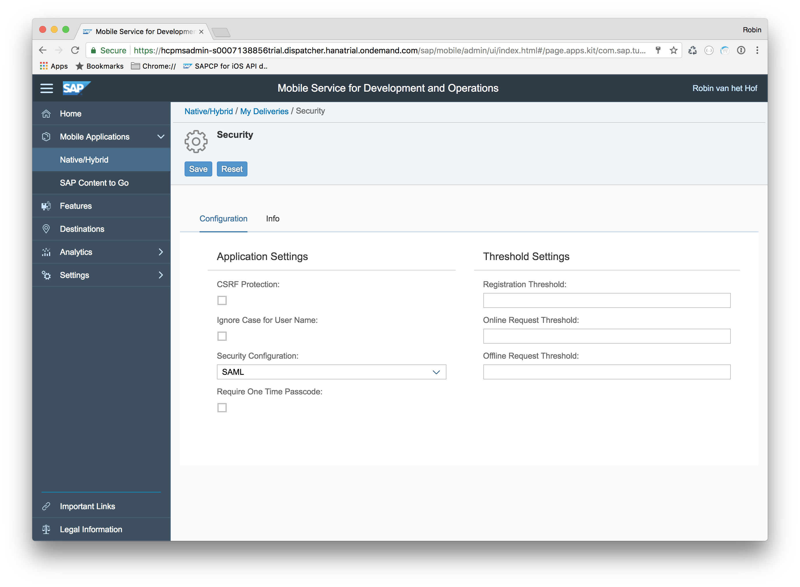

## Prerequisites  
 - **Proficiency:** Intermediate
 - **Development environment:** Apple iMac, MacBook or MacBook Pro running Xcode 8.3 or higher
 <!-- - **Tutorials:** [Sign up for a free trial account on SAP Cloud Platform](https://www.sap.com/developer/tutorials/hcp-create-trial-account.html) and [Enable SAP Cloud Platform mobile service for development and operations](https://www.sap.com/developer/tutorials/fiori-ios-hcpms-setup.html) -->

<!-- ## Next Steps
 - [Create an Xcode project with SDK Assistant](https://www.sap.com/developer/tutorials/fiori-ios-scpms-deliveryapp-part2.html) -->

## Details
### You will learn  
In this tutorial series, you will create a Fiori for iOS application which will show tracking info for purchased packages. When you have finished all 8 tutorials, the application will have the following characteristics:

 - Connects to an **SAP HANA MDC (Multi-tenant Database Container) XS OData service**. It contains records of packages and their delivery status.
 - Uses **simplified OData querying** with the SAP Cloud Platform SDK for iOS.
 - Implements **SAP Fiori for iOS controls** to show timeline data.
 - Configured for offline usage with **Offline OData**.

The final SAP Fiori for iOS application will look like the following:

> Before you start, make sure you:

> - have a trial account on SAP Cloud Platform. See [Sign up for a free trial account on SAP Cloud Platform](https://www.sap.com/developer/tutorials/hcp-create-trial-account.html) for more information.
> - enabled SAP Cloud Platform mobile service for development and operations. See [Enable SAP Cloud Platform mobile service for development and operations](https://www.sap.com/developer/tutorials/fiori-ios-hcpms-setup.html) for more information.

### Time to Complete
**10 Min**

---

[ACCORDION-BEGIN [Step 1: ](Open SAP Cloud Platform mobile service for development and operations cockpit)]

Open the SAP Cloud Platform mobile service for development and operations cockpit at `https://hcpmsadmin-<your user id>trial.dispatcher.hanatrial.ondemand.com/`

After logging in, you should see the cockpit's landing page:

[DONE]
[ACCORDION-END]

[ACCORDION-BEGIN [Step 2: ](Create a new application definition)]

Click on the big **Plus** sign in the tile **Create new app**. In the dialog that appears, you define a new mobile application definition. Enter the following details:

| Field | Value |
|----|----|
| Configuration Templates | `Native` |
| ID | `com.sap.tutorials.demoapp.MyDeliveries` |
| Name | `My Deliveries` |

> For the purpose of this demo, fields **Description** and **Vendor** can be left empty.

Click **Save** when finished. You are now in the **"My Deliveries" Application Details** screen:

[VALIDATE_2]

[ACCORDION-END]

[ACCORDION-BEGIN [Step 3: ](Add a back end connection)]

In the **Assigned Features** panel on the right, click the **Connectivity** row to fix the **Incomplete Configuration** warning. This opens the **Connectivity Page**:

Click the **Add New Connection** icon. In the wizard that appears, enter the following details:

| Field | Value |
|----|----|
| Type | `Mobile Destination` |
| Destination Name | `com.sap.tutorials.demoapp.MyDeliveries` |

Click **Next**. In the next page of the wizard, enter the following connection details:

| Field | Value |
|----|----|
| URL | `https://sapdevsdd27584c4.us2.hana.ondemand.com/codejam/wwdc/services/DeliveryService.xsodata` |
| Proxy Type | `Internet` |
| Maximum Connections | `10` |
| Rewrite Mode | `Rewrite URL` |

Click **Next**. In the next page of the wizard, set the **SSO Mechanism** to `No Authentication`:

Click **Next**. In the final page of the wizard, leave everything empty but have the checkbox for **Use Default JDK Store** checked:

Click **Finish**. The application's connection to the **SAP HANA MDC XS OData service** is now configured. You may click the **Ping** button to check whether the destination is reachable.

[VALIDATE_3]

[ACCORDION-END]

[ACCORDION-BEGIN [Step 4: ](Check security configuration )]

In the breadcrumb navigation on top, click the **My Deliveries** link to go back to the **Application Details**:

In the **Assigned Features** panel on the right, click the **Security** row. This opens the **Security Page**.

Make sure the **Security Configuration** is set to `SAML`:

>   By default, a newly created application definition uses `SAML` as the default authentication mechanism.

.

Click **Save** to store the configuration.

[VALIDATE_4]

[ACCORDION-END]

<!-- ## Next Steps
 - [Create an Xcode project with SDK Assistant](https://www.sap.com/developer/tutorials/fiori-ios-scpms-deliveryapp-part2.html) -->
