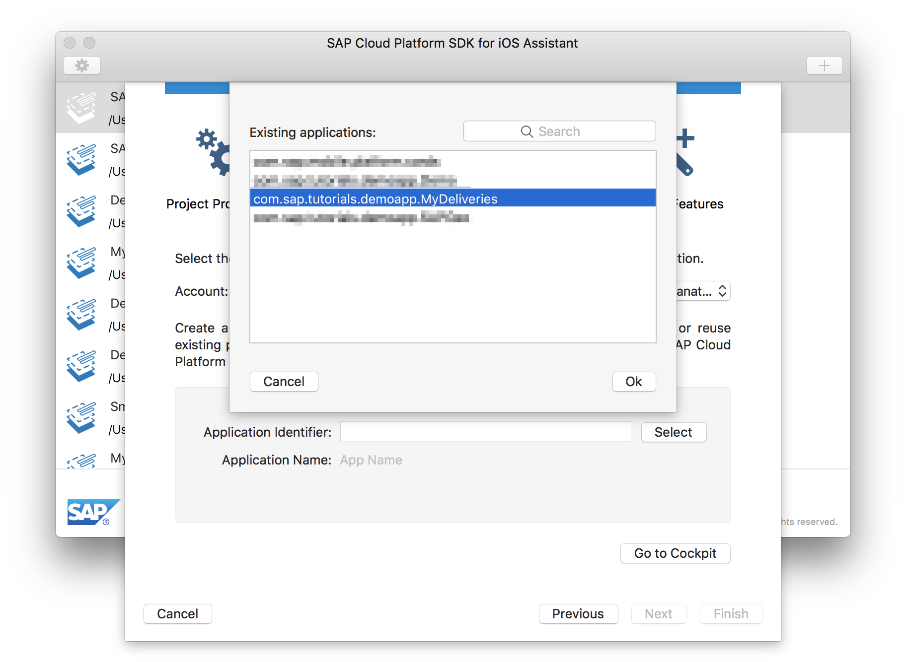
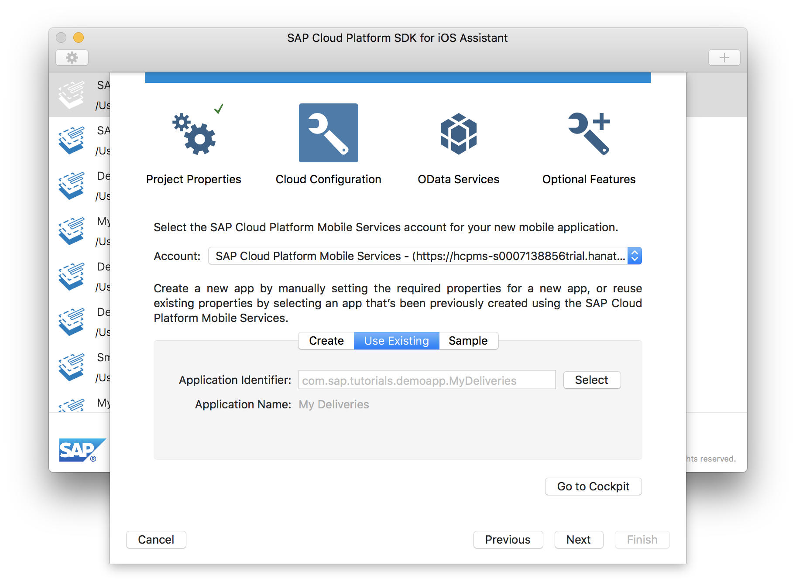

## Prerequisites  
 - **Proficiency:** Intermediate
 - **Development environment:** Apple iMac, MacBook or MacBook Pro running Xcode 8.3 or higher
 <!-- - **Tutorials:** [Create an application definition](https://www.sap.com/developer/tutorials/fiori-ios-scpms-deliveryapp-part1.html) -->

<!-- ## Next Steps
 - [Implement a new Table View Controller](https://www.sap.com/developer/tutorials/fiori-ios-scpms-deliveryapp-part3.html) -->

## Details
### You will learn  
In the previous tutorial, you have created an **application definition** in **SAP Cloud Platform mobile service for development and operations**.

In this tutorial, you will create an Xcode project with the **SAP Cloud Platform SDK for iOS Assistant** based on this application definition.

### Time to Complete
**10 Min**

---

[ACCORDION-BEGIN [Step 1: ](Configure SAP Cloud Platform SDK for iOS Assistant)]

> **Note**: If you have already configured the SAP Cloud Platform SDK for iOS Assistant, you can **skip this step** and proceed with "Step 2 - Run the SAP Cloud Platform SDK for iOS Assistant".

.

This step provides simplified steps to configure the SAP Cloud Platform SDK for iOS Assistant application using the SAP Cloud Platform mobile service for development and operations cockpit.

In SAP Cloud Platform mobile service for development and operations, click the **Important Links** tab in the lower left bottom. The **Important Links** section opens:

Locate the tile **SAP Cloud Platform SDK for iOS Assistant** and click the **Importing URLs directly into Assistant** link. You should now see the following pop-up:

Click the **Open SAP Cloud Platform SDK for iOS Assistant** button. The SAP Cloud Platform SDK for iOS Assistant application will start. The **New Account** settings dialog will open, and both **Admin API URL** and **Admin UI URL** parameters are pre-populated automatically:

Provide the following additional details:

| Field | Value |
|----|----|
| Name | A descriptive name for the configuration, for instance `SAP Cloud Platform Mobile Services` |
| Authentication Type | `Basic Authentication` |
| User | Your trial account user |
| Password | Password for your trial account user |

Click **Save** when finished, and click **OK** to dismiss the **Settings** dialog.

[DONE]
[ACCORDION-END]

[ACCORDION-BEGIN [Step 2: ](Run the SAP Cloud Platform SDK for iOS Assistant)]

> **Note**: If you went through "Step 1 - Configure SAP Cloud Platform SDK for iOS Assistant", the SAP Cloud Platform SDK for iOS Assistant is already running and you may continue to "Step 3 - Create an Xcode Project".

.

On your local machine, navigate to your `./<SAP Cloud Platform SDK for iOS>` folder.

Double-click the **SAP Cloud Platform SDK for iOS Assistant** icon to start the application.

[DONE]
[ACCORDION-END]

[ACCORDION-BEGIN [Step 3: ](Create an Xcode Project)]

Click the **Plus** button on the top-right of the SDK Assistant. The first page of the Xcode Project generation wizard lets you define the Project Properties.

Enter the following details:

| Field | Value |
|----|----|
| Product Name | `MyDeliveries` |
| Author | `<your name>` |
| Organization Name | `<your company name>` |
| Organization Identifier | `com.sap.tutorials.demoapp` |
| Destination | `<choose a local destination>` |

> Make sure the combination `<Organization Identifier>.<Product Name>` matches the value of "Application ID" you entered in Step 2 of the previous tutorial.

Click **Next** to advance to the **SAP Cloud Platform mobile service for development and operations Configuration** step.

[VALIDATE_3]

[ACCORDION-END]

[ACCORDION-BEGIN [Step 4: ](SAP Cloud Platform mobile service for development and operations Configuration details)]

In the **SAP Cloud Platform mobile service for development and operations Configuration** page, select the **Use Existing** tab button.

Click the **Select from SAP Cloud Platform mobile service for development and operations** button next to **Application Identifier**.

Select the `com.sap.tutorials.demoapp.MyDeliveries` data source and click **OK**.

The selected data source is now pre-filled in the SAP Cloud Platform mobile service for development and operations Configuration page:

Click **Next** to advance to the **OData Services** step.

[DONE]
[ACCORDION-END]

[ACCORDION-BEGIN [Step 5: ](OData Services)]

In the **OData Services** page, the primary OData service connection you have specified in **Step 3 - Add a back end connection** of the previous tutorial is displayed.

Click **Next** to advance to the **Optional Features** step.

[DONE]
[ACCORDION-END]

[ACCORDION-BEGIN [Step 6: ](Optional Features)]

In the **Optional Features** page, you have the option to generate a **Master-Detail Application**, enable **logging** and **log uploads**, and enable **remote notifications**.

Make sure the checkboxes **Generate Master-Detail Application**, **Enable Logging** and **Enable Log Upload** are selected and click **Finish** to complete the wizard.

> Most likely the checkbox for **Remote Notifications** is disabled. This happens because no APNS endpoint is configured for the application definition in SAP Cloud Platform mobile service for development and operations. Once configured with a valid certificate, this option becomes available.

[DONE]
[ACCORDION-END]

[ACCORDION-BEGIN [Step 7: ](Upload metadata.xml file)]

After you have clicked **Finish** in the previous step, the SDK Assistant now tries to load the OData service's metadata. This metadata describes the data model, and can be accessed via `<service URL>$metadata`. For your service, the metadata URL would be `https://sapdevsdd27584c4.us2.hana.ondemand.com/codejam/wwdc/services/DeliveryService.xsodata/$metadata`

However, you will notice the loading of the metadata will fail and a dialog will open asking you to import the metadata manually:

In order to upload the metadata file, you need to download it first. Open a browser to the aforementioned metadata URL `https://sapdevsdd27584c4.us2.hana.ondemand.com/codejam/wwdc/services/DeliveryService.xsodata/$metadata`

From the menu, select **File > Save Page As...** and save the file in **XML text** format locally:

Switch back to the **SAP Cloud Platform SDK for iOS Assistant**, select the just downloaded `$metadata.xml` file and click **Open**:

The SDK Assistant should now finish gracefully.

[VALIDATE_7]

[ACCORDION-END]

[ACCORDION-BEGIN [Step 8: ](Examine the generated Xcode Project)]

After the SDK Assistant has finished, **Xcode** will launch and open the just generated `MyDeliveries` project.

The `Main.storyboard` shows split-view setup for the generated Master-Detail views.

File `MyDeliveries/Model/Constants.swift` holds constants for the SAP Cloud Platform mobile service for development and operations environment as well as an `enum` with the OData collection types.

File `MyDeliveries/Model/DeliveryServiceDataAccess.swift` has convenience methods for accessing the OData entities.

Folder `MyDeliveries/TableDelegates` holds the delegate classes for the Master and Detail table views.

Folder `Proxy Classes` contains the OData proxy classes generated from the OData service. File `DeliveryService.swift` acts as a data service provider to gain access to the OData entities. The two files `PackageType.swift` and `DeliveryStatusType.swift` are classes for the OData entities `Package` and `DeliveryStatus`, respectively. These classes give access to the various properties of the OData entities.

[DONE]
[ACCORDION-END]

[ACCORDION-BEGIN [Step 9: ](Build and run the generated application)]

Click the **Run** button to build and run the generated application:

If you have configured the app to allow for push notifications, you will get the following pop-up:

Press **Allow** and the **SAML** login screen of **SAP Cloud Platform mobile service for development and operations** is shown. Enter your login credentials for the SAP Cloud Platform and press the **Log On** button:

The app starts with an overview of the available **Collections** of the OData service:

[DONE]
[ACCORDION-END]

[ACCORDION-BEGIN [Step 10: ](Examine the generated application)]

If you click on the `Packages` collection, you navigate to a **Master** list with all available `Package` entities:

If you click on one of the `Package` entities, you navigate to a **Detail** page which lists all the properties for the selected entity:

[DONE]
[ACCORDION-END]

<!-- ## Next Steps
- [Implement a new Table View Controller](https://www.sap.com/developer/tutorials/fiori-ios-scpms-deliveryapp-part3.html) -->
