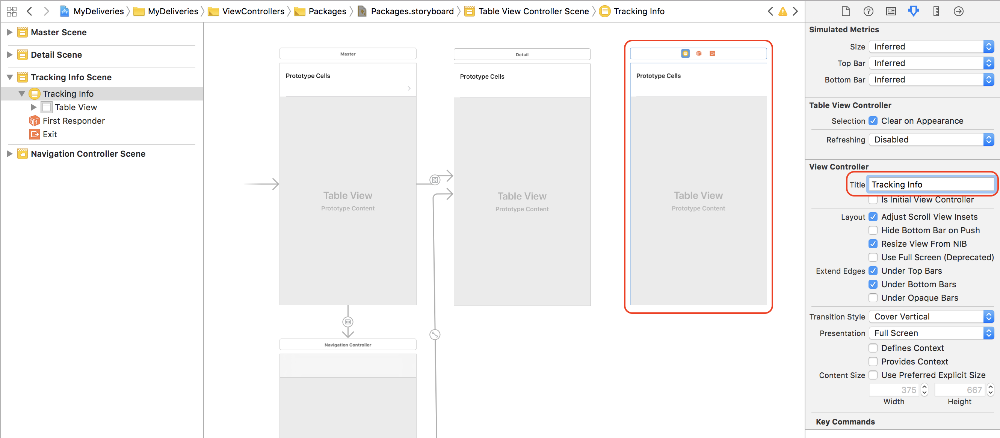
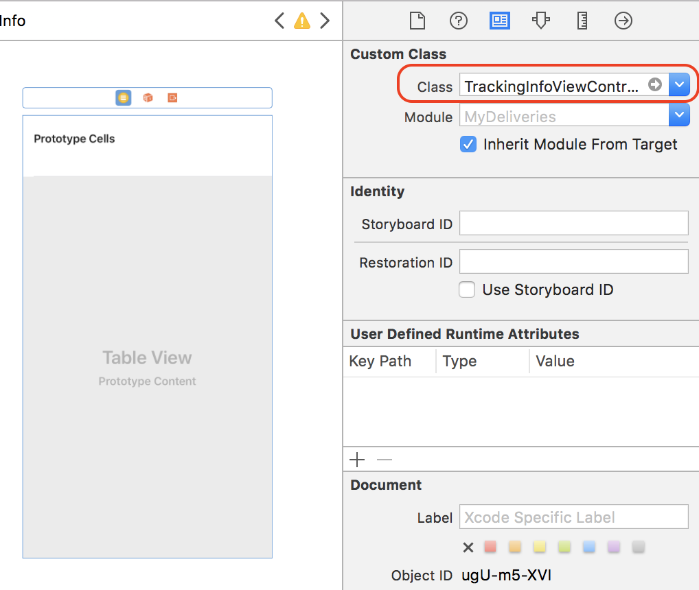
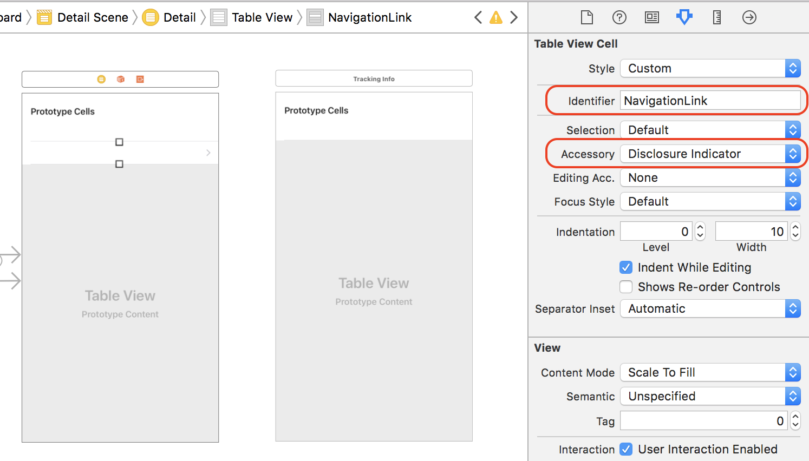
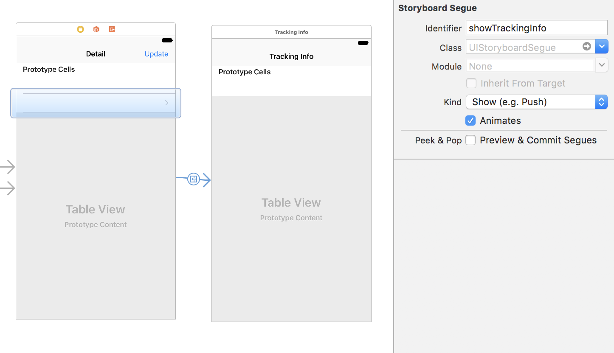
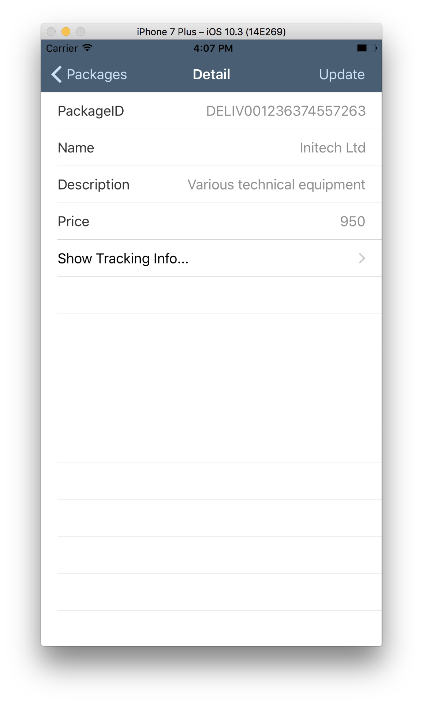
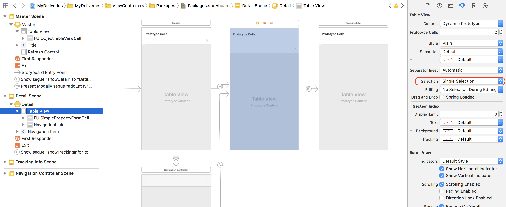

## Prerequisites  
- **Proficiency:** Intermediate
- **Development environment:** Apple iMac, MacBook or MacBook Pro running Xcode 9 or higher
- **SAP Cloud Platform SDK for iOS:** Version 2.0
 <!-- - **Tutorials:** [Create an Xcode project with SDK Assistant](https://www.sap.com/developer/tutorials/fiori-ios-scpms-deliveryapp-part2.html) -->


<!-- ## Next Steps
 - [Using the SAP Fiori for iOS Mentor app](https://www.sap.com/developer/tutorials/fiori-ios-scpms-deliveryapp-part4.html) -->

## Details
### You will learn  
In the previous tutorial, you have generated an Xcode project which lets you browse the OData service entities. In this tutorial, you will add a new view which will show the related delivery statuses for each ordered package.

### Time to Complete
**20 Min**

---

[ACCORDION-BEGIN [Step 1: ](Enhance the generated application)]

The generated application demonstrates the OData proxy classes are working, browse their properties, and demonstrates push notifications and the various authentication mechanisms. For productive use, it is recommended to start with a new, empty project, and use parts of the generated app into your own project.

However, to show how to access backend data via OData in an object-oriented way, we will extend the generated application.

Examine the OData service's metadata, which can be accessed via `https://sapdevsdd27584c4.us2.hana.ondemand.com/codejam/wwdc/services/DeliveryService.xsodata/$metadata`:

```xml
<?xml version="1.0" encoding="utf-8" standalone="yes" ?>
<edmx:Edmx Version="1.0" xmlns:edmx="http://schemas.microsoft.com/ado/2007/06/edmx">
  <edmx:DataServices m:DataServiceVersion="2.0" xmlns:m="http://schemas.microsoft.com/ado/2007/08/dataservices/metadata">
    <Schema Namespace="codejam.wwdc.services.DeliveryService" xmlns="http://schemas.microsoft.com/ado/2008/09/edm" xmlns:d="http://schemas.microsoft.com/ado/2007/08/dataservices" xmlns:m="http://schemas.microsoft.com/ado/2007/08/dataservices/metadata">
      <EntityType Name="DeliveryStatusType">
        <Key>
          <PropertyRef Name="DeliveryStatusID"/>
        </Key>
        <Property MaxLength="36" Name="DeliveryStatusID" Nullable="false" Type="Edm.String"/>
        <Property MaxLength="36" Name="PackageID" Type="Edm.String"/>
        <Property MaxLength="256" Name="Location" Type="Edm.String"/>
        <Property Name="DeliveryTimestamp" Type="Edm.DateTime"/>
        <Property MaxLength="16" Name="StatusType" Type="Edm.String"/>
        <Property Name="Selectable" Type="Edm.Int32"/>
        <Property MaxLength="128" Name="Status" Type="Edm.String"/>
      </EntityType>
      <EntityType Name="PackagesType">
        <Key>
          <PropertyRef Name="PackageID"/>
        </Key>
        <Property MaxLength="36" Name="PackageID" Nullable="false" Type="Edm.String"/>
        <Property MaxLength="256" Name="Name" Type="Edm.String"/>
        <Property MaxLength="256" Name="Description" Type="Edm.String"/>
        <Property Name="Price" Precision="10" Scale="2" Type="Edm.Decimal"/>
        <NavigationProperty FromRole="PackagesPrincipal" Name="DeliveryStatus" Relationship="codejam.wwdc.services.DeliveryService.PackageDeliveryStatusType" ToRole="DeliveryStatusDependent"/>
      </EntityType>
      <Association Name="PackageDeliveryStatusType">
        <End Multiplicity="1" Role="PackagesPrincipal" Type="codejam.wwdc.services.DeliveryService.PackagesType"/>
        <End Multiplicity="*" Role="DeliveryStatusDependent" Type="codejam.wwdc.services.DeliveryService.DeliveryStatusType"/>
        <ReferentialConstraint>
          <Principal Role="PackagesPrincipal">
            <PropertyRef Name="PackageID"/>
          </Principal>
          <Dependent Role="DeliveryStatusDependent">
            <PropertyRef Name="PackageID"/>
          </Dependent>
        </ReferentialConstraint>
      </Association>
      <EntityContainer Name="DeliveryService" m:IsDefaultEntityContainer="true">
        <EntitySet EntityType="codejam.wwdc.services.DeliveryService.DeliveryStatusType" Name="DeliveryStatus"/>
        <EntitySet EntityType="codejam.wwdc.services.DeliveryService.PackagesType" Name="Packages"/>
        <AssociationSet Association="codejam.wwdc.services.DeliveryService.PackageDeliveryStatusType" Name="PackageDeliveryStatus">
          <End EntitySet="Packages" Role="PackagesPrincipal"/>
          <End EntitySet="DeliveryStatus" Role="DeliveryStatusDependent"/>
        </AssociationSet>
      </EntityContainer>
    </Schema>
  </edmx:DataServices>
</edmx:Edmx>
```

As you can see, it is a fairly simple data model containing two Entity Sets (or tables) called `Packages` and `DeliveryStatus`. Each entity in the set (or record) is identified as a `PackagesType` and `DeliveryStatusType`, respectively.

There is also an association between `PackagesType` and `DeliveryStatusType`, where a single `PackagesType` can have related `DeliveryStatusType`'s with a `0..n` cardinality.

We will now show for each `PackageType` its related `DeliveryStatusType`'s, shown in a timeline in ascending order (newest on top). The timeline will be build using **SAP Fiori for iOS controls**.

Using the SDK's `SAPOData` framework, you can create OData queries in a really simple way. Instead of executing SQL statements, the SDK provides a 'fluent interface' or 'method chaining' approach to constructing queries, which makes the code much more readable.

A query to get all `DeliveryStatus` entities for a particular `Package` would then be something like this:

```swift
 // Method 1
 let query = DataQuery()
     // SELECT * FROM DeliveryStatus
     .from(DeliveryServiceMetadata.EntitySets.deliveryStatus)
     // WHERE DeliveryStatus.packageID == <selected package ID>
     .where(DeliveryStatusType.packageID.equal((currentEntity?.packageID)!))
```

The result of this query is an array of `DeliveryStatusType` objects.

With OData, you can even have greater flexibility. Since there is a one-to-many association (or 'Navigation Link') between `Package` and `DeliveryStatus`, you could also load the `Package` object and all related child `DeliveryStatus` entities at once:

```swift
 // Method 2
 let query = DataQuery()
     // SELECT * FROM Packages
     .from(DeliveryServiceMetadata.EntitySets.packages)
     // WHERE <primary key> = <selected package ID>
     .withKey(PackagesType.key(packageID: currentEntity?.packageID))
     // LEFT JOIN DeliveryStatus ON <abstracted, defined in association>
     .expand(PackagesType.deliveryStatus)
```

Using the generated OData Proxy classes, you can then simply access the `PackagesType` related `DeliveryStatusType` objects:


> **NB:** Since the SDK Assistant generated app by default does not support OData Navigation Links, it takes a bit more effort to enable this. Furthermore, sorting an expanded entity set is only supported in OData V4, and this tutorial uses an OData V2 service. Therefore, in this tutorial we'll simply query the `DeliveryStatus` entities for each `Package`.

[DONE]
[ACCORDION-END]

[ACCORDION-BEGIN [Step 2: ](Create a new Table View Controller)]

To list the tracking info for each package using SAP Fiori Timeline controls, the most simple approach would be to create a new Table View Controller and implement the code needed to display the statuses.

In Xcode, locate the file `MyDeliveries/ViewControllers/Packages/Packages.storyboard` and open the file:


Drag a **Table View Controller** object from the **Object library** onto the **Storyboard**, next to the **Detail Scene**.

With the just added Table View Controller selected, give it the name `Tracking Info` in the **Attribute inspector**:



[VALIDATE_2]

[ACCORDION-END]

[ACCORDION-BEGIN [Step 3: ](Create new subclass of a UITableViewController class)]

**Right-click** the `MyDeliveries/ViewControllers/Packages` folder in your project, and from the context menu choose **New File...**.

In the dialog, select **Cocoa Touch Class**:


Click **Next**.

Provide the following details:

| Field | Value |
|----|----|
| Class | `TrackingInfoViewController` |
| Subclass Of | `UITableViewController` |


Click **Next**. In the next screen, make sure the new class file is stored in group `Packages` and click **Create**.

Switch to the `Packages.storyboard` file and select the **Tracking Info Table View**. In the **Identity inspector**, set the **Custom Class** to `TrackingInfoViewController`:



> To avoid a "*prototype table cells must have reuse identifiers*" warning, you can provide an identifier for the table view's prototype cell, or alternatively, set the **Prototype Cells** value to `0`.

[DONE]

[ACCORDION-END]

[ACCORDION-BEGIN [Step 4: ](Add navigation Table View Cell to Detail Table View)]

Drag a **Table View Cell** onto the **Detail Table View**, and set the following properties in the **Attribute inspector**:

| Field | Value |
|----|----|
| Identifier | `NavigationLink` |
| Accessory | `Disclosure Indicator` |



**Control-click** the just added **Table View Cell** and drag it onto the **Tracking Info Scene**. From the **Segue** pop-up, choose **Show**.

With the segue selected, go to the **Attributes inspector** and provide the name `showTrackingInfo` as its **Identifier**:



[DONE]
[ACCORDION-END]

[ACCORDION-BEGIN [Step 5: ](Add initializer code to TrackingInfoViewController)]

In the newly created file `TrackingInfoViewController.swift`, replace the `import UIKit` statement with the following import statements:

```swift
import SAPFoundation
import SAPCommon
import SAPOData
import SAPFiori
```

Just below the line `class TrackingInfoViewController: UITableViewController {`, add the following declarations:

```swift
private let appDelegate = UIApplication.shared.delegate as! AppDelegate
private let logger: Logger = Logger.shared(named: "TrackingInfoViewController")

private var _entities: [DeliveryStatusType] = [DeliveryStatusType]( )
var entities: [EntityValue] {
    get { return _entities }
    set { self._entities = newValue as! [DeliveryStatusType]
    }
}
```
<!---
```swift
private let appDelegate = UIApplication.shared.delegate as! AppDelegate
private let logger: Logger = Logger.shared(named: "TrackingInfoViewController")

private var _entity: PackagesType = PackagesType()
var entity: EntityValue {
    get { return _entity }
    set { self._entity = newValue as! PackagesType }
}
```
-->

This adds a reference to the `AppDelegate` class, a reference to the SDK's logging mechanism, and fields to set/get the selected `DeliveryStatusType` entity.
<!---
This adds a reference to the `AppDelegate` class, a reference to the SDK's logging mechanism, and fields to set/get the selected `PackagesType` entity.
-->

[VALIDATE_3]

[ACCORDION-END]

[ACCORDION-BEGIN [Step 6: ](Implement Table View Cell for Packages)]

Open file `./MyDeliveries/ViewControllers/Packages/PackagesDetailViewController.swift`.

Locate method `tableView(_: UITableView, numberOfRowsInSection _: Int)`. Currently it returns **4** rows, the total number of properties the `Package` entity has. However, since you added an extra Table View Cell to navigate to the Tracking Info scene, you want to make this extra cell visible.

Set the return value to `5`:

```swift
override func tableView(_: UITableView, numberOfRowsInSection _: Int) -> Int {
    return 5
}
```
Next, locate method `tableView(_ tableView: UITableView, cellForRowAt indexPath: IndexPath)`.

It contains a `switch` statement which, depending on the `indexPath.row` value, displays the property and corresponding value for the selected `Package`.

To display the added Table View Cell, add an extra `case` statement, just above the `default:` switch:

```swift
case 4:
    let navigationLink = tableView.dequeueReusableCell(withIdentifier: "NavigationLink",
        for: indexPath) as UITableViewCell
    navigationLink.textLabel?.text = "Show Tracking Info..."
    return navigationLink
```

Now the 5th row in the table will return a **Table View Cell** matching identifier `NavigationLink`, and it will display the static text `Show Tracking info...`.

If you now run and build the application, the newly added table cell is displayed:



However, if you click on it, nothing happens... You will solve that in the next step.

[DONE]
[ACCORDION-END]


[ACCORDION-BEGIN [Step 7: ](Implement navigation logic)]

In the previous step, you have noticed the navigation to the **Tracking Info** scene did not happen. That is caused since the **Table View** in the **Detail Scene** inside the `Packages.storyboard` file has turned off its ability to select table cells.

Open the file `./MyDeliveries/ViewControllers/Packages/Packages.storyboard` and from the **Detail Scene**, select its **Table View**.

From the **Attributes inspector**, locate the **Selection** attribute and set its value to `Single Selection`:



Next, open the file `./MyDeliveries/ViewControllers/Packages/PackagesDetailViewController.swift`.

<!--
In method `viewDidLoad()`, locate the line:

```swift
self.tableView.allowsSelection = false
```

To enable navigating from this view to the Tracking Info view, set this property to `true`.
-->
Scroll down, and just above the method `cancel()` add the following function:

```swift
override func prepare(for segue: UIStoryboardSegue, sender: Any?) {
    if segue.identifier == "showTrackingInfo" {

        if (self.tableView.indexPathForSelectedRow?.row != nil) {
            let trackingInfoView = segue.destination as! TrackingInfoViewController

            let currentEntity = self.entity as PackagesType

            let esDeliveryStatus = DeliveryServiceMetadata.EntitySets.deliveryStatus
            let propPackageId    = DeliveryStatusType.packageID
            let propTimestamp    = DeliveryStatusType.deliveryTimestamp

            // Load all related DeliveryStatuses for the current Package,
            // latest first.
            let query = DataQuery()
                .from(esDeliveryStatus)
                .where(propPackageId.equal((currentEntity.packageID)!))
                .orderBy(propTimestamp, SortOrder.descending)

            self.deliveryService.fetchDeliveryStatus(matching: query) { deliveryStatus, error in
                guard let deliveryStatus = deliveryStatus else {
                    return
                }
                trackingInfoView.entities = deliveryStatus
                trackingInfoView.tableView.reloadData()
            }
        }
    }
}
```
<!---
```swift
override func prepare(for segue: UIStoryboardSegue, sender: Any?) {
    if segue.identifier == "showTrackingInfo" {

        if (self.tableView.indexPathForSelectedRow?.row != nil) {
            let trackingInfoView = segue.destination as! TrackingInfoViewController

            let currentEntity = self.selectedEntity as? PackagesType

            let esPackages       = DeliveryServiceMetadata.EntitySets.packages
            let esDeliveryStatus = DeliveryServiceMetadata.EntitySets.deliveryStatus

            // Load all related DeliveryStatuses for the current Package,
            // latest first.
            let query = DataQuery()
                .from(esPackages)
                .withKey(PackagesType.key(packageID: (currentEntity?.packageID)!))
                .expand(PackagesType.deliveryStatus, withQuery: DataQuery()
                    .from(esDeliveryStatus)
                    .orderBy(DeliveryStatusType.deliveryTimestamp, SortOrder.descending))

            do {
                // Perform query and store the results
                trackingInfoView.entity = try self.deliveryService.service.packages(
                    query: query)[0]
            }
            catch let error {
                self.logger.error(error.localizedDescription)
            }
        }
    }
}
```
-->

With this code, you create a query to load all `DeliveryStatus` entities for the selected `Package` entity, and store the results into the `TrackingInfoViewController`.

[VALIDATE_6]

[ACCORDION-END]


<!-- ## Next Steps
- [Using the SAP Fiori for iOS Mentor app](https://www.sap.com/developer/tutorials/fiori-ios-scpms-deliveryapp-part4.html) -->
