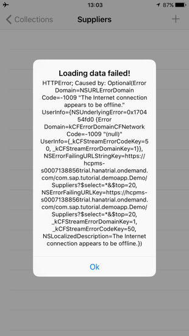
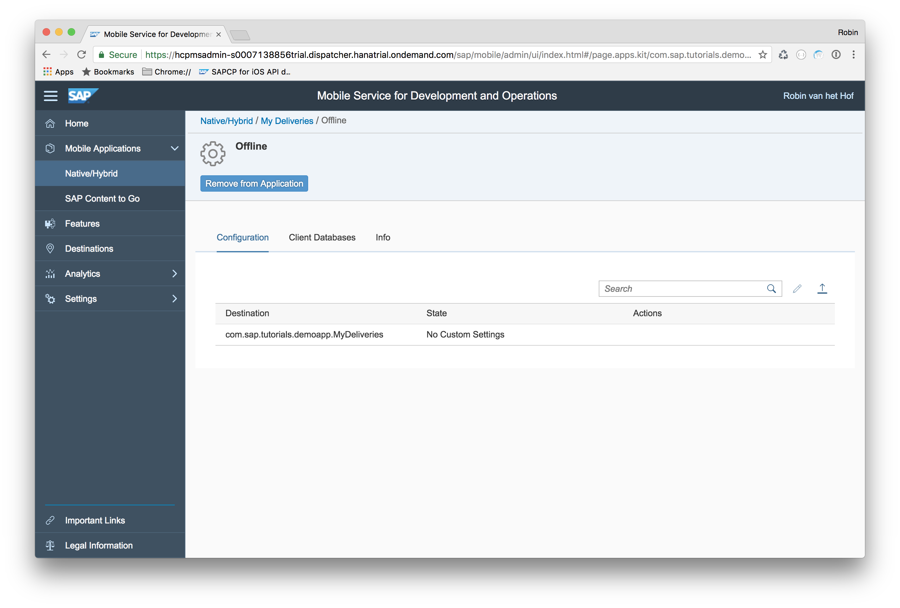
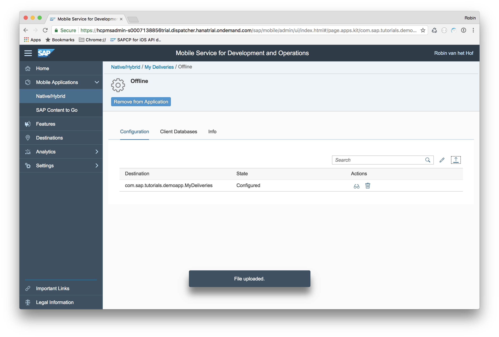
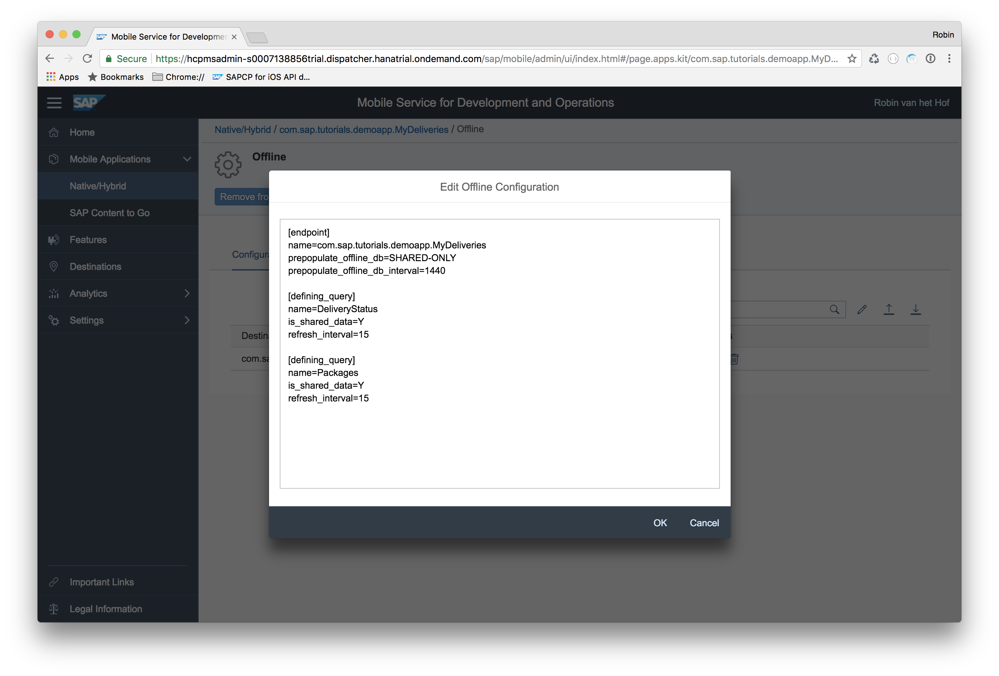
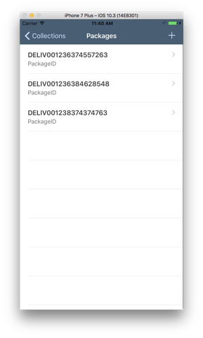

## Prerequisites  
 - **Proficiency:** Intermediate
 - **Development environment:** Apple iMac, MacBook or MacBook Pro running Xcode 8.3 or higher
 <!-- - **Tutorials:** [Implement the Fiori Timeline cell control](https://www.sap.com/developer/tutorials/fiori-ios-scpms-deliveryapp-part5.html) -->


<!-- ## Next Steps
 - [Manage and monitor your app on SAP Cloud Platform Mobile Services](https://www.sap.com/developer/tutorials/fiori-ios-scpms-deliveryapp-part7.html) -->

## Details
### You will learn  
In this tutorial, you will implement the necessary coding so your application can use OData while offline.

### Time to Complete
**15 Min**

---

[ACCORDION-BEGIN [Step 1: ](Run the app while offline)]

Build and run the app, either on a physical device or on the iOS Simulator.

Log in to your app with your SAP Cloud Platform credentials.

If you now switch on Airplane mode on your physical device -- or, if running from the iOS Simulator, disable the network connections on your Mac -- and try opening a collection from the app, you will see a message similar to this:



[DONE]
[ACCORDION-END]


[ACCORDION-BEGIN [Step 2: ](Create Application Configuration File)]

To use the Offline OData service, it is not necessary to to add any specific configuration to your application. The SAP Cloud Platform mobile service for development and operations will apply defaults that will make a good amount of applications run smoothly.

However, the Offline OData service can be configured to best meet the needs of your use cases.

- Configure indexes on properties
- Configure data to be cached on server
- Change delta determination

>Note: Offline configuration is created in a file and uploaded to SAP Cloud Platform mobile service for development and operations application configuration and is only required to change default behavior

.

The Offline OData service configuration file is made up of one or more end point configurations, each of
which has one or more defining request configurations

End point configuration allows:

- Set indexes on entity properties
- Configure what data will be allowed in the database initially sent to device
- Configure if data is cached or not
- Refresh interval on cached data

Defining request configuration allows:

- Set if data is cached or not
- Refresh interval on cached data
- Delta tracking behavior

A full list of Offline OData configuration options is available on https://help.sap.com/saphelp_smp307sdk/helpdata/en/f5/a25877c16f4fc384c44fcf0b92dab8/content.htm.

To define what to use offline, you now create an **Application Configuration File**

On your laptop, create a file `application-config.ini`.

Add the following content to this file:

```ini
[endpoint]
Name=com.sap.tutorials.demoapp.MyDeliveries
prepopulate_offline_db=SHARED-ONLY
prepopulate_offline_db_interval=1440

[defining_request]
name=DeliveryStatus
is_shared_data=Y
refresh_interval=15

[defining_request]
name=Packages
is_shared_data=Y
refresh_interval=15
```

In this configuration file, you have specified the following:

End point configuration:

| Properties (endpoint) | Description |
|----|----|
| `name` | The name of the OData connection, as specified in SAP Cloud Platform mobile service for development and operations |
| `prepopulate_offline_db` | Indicated what data to include in database delivered to device when it if first created |
| `prepopulate_offline_db_interval` | Database refresh interval for the shared data. The default value is 1440 minutes (one day) |

Defining request configuration:

| Properties (`defining_request`) | Description |
|----|----|
| `name` | The name of the entity set query |
| `is_shared_data` | Specifies if data is shared between users or not and prevents sending the same query to the originating OData service for each user if it is set to Y |
| `download_interval` | Database refresh interval for the shared data. It is set to 15 minutes, meaning that SAP Cloud Platform mobile service for development and operations will try to update the delivery status and packages data every 15 minutes |

Save the file locally.

[DONE]
[ACCORDION-END]


[ACCORDION-BEGIN [Step 3: ](Configure application definition)]

In SAP Cloud Platform mobile service for development and operations, navigate to **Mobile Applications > Native/Hybrid > My Deliveries**:


Click on the **Offline** feature. The Offline configuration page opens:



[DONE]
[ACCORDION-END]


[ACCORDION-BEGIN [Step 4: ](Upload Application Configuration File)]

Click the **Import** button.


Browse to the `application-config.ini` file you created earlier.


Click **OK** to import the configuration. If everything goes well, the state has now changed to **Configured**.



[VALIDATE_4]

[ACCORDION-END]


[ACCORDION-BEGIN [Step 5: ](Examine uploaded configuration)]

If you now click the **Display** action, you can examine the uploaded configuration:



Click **Close** to dismiss the dialog.

[DONE]
[ACCORDION-END]


[ACCORDION-BEGIN [Step 6: ](Switch from SAPOData to SAPOfflineOData)]

First you need to change the **Online** behavior to **Offline** usage. Open the `DeliveryServiceDataAccess.swift` file under `MyDeliveries > Model`.

Add the import declaration for `SAPOfflineOData` just below the already existing `SAPOData` import declaration:

```swift
// other imports
import SAPOfflineOData

class DeliveryServiceDataAccess {
    // code
}
```

[DONE]
[ACCORDION-END]


[ACCORDION-BEGIN [Step 7: ](Add Service Declaration to Offline)]

Since the data service is used offline, you need to add a service declaration for offline usage. In order to do so, add the following line below `let service: DeliveryService<OnlineODataProvider>`

```swift
let offlineService: DeliveryService<OfflineODataProvider>
```

[DONE]
[ACCORDION-END]

[ACCORDION-BEGIN [Step 8: ](Add Offline OData Provider)]

To instantiate the above service, an offline OData provider is needed. Below the field `service`, add a constant `offlineODataProvider` of type `OfflineODataProvider`:

```swift
let offlineODataProvider: OfflineODataProvider
```

[DONE]
[ACCORDION-END]

[ACCORDION-BEGIN [Step 9: ](Change initializer)]

Replace the `init()` initializer with the following:

```swift
init(urlSession: SAPURLSession) {
    let odataProvider = OnlineODataProvider(serviceName: "DeliveryService", serviceRoot: Constants.appUrl, sapURLSession: urlSession)

    // Disables version validation of the backend OData service
    // TODO: Should only be used in demo and test applications
    odataProvider.serviceOptions.checkVersion = false

    self.service = DeliveryService(provider: odataProvider)

    // To update entity force to use X-HTTP-Method header
    self.service.provider.networkOptions.tunneledMethods.append("MERGE")

    // --------------

    // Here come's the offline part
    var offlineParameters = OfflineODataParameters()
    offlineParameters.enableRepeatableRequests = true

    // create offline OData provider
    self.offlineODataProvider = try! OfflineODataProvider(
        serviceRoot: Constants.appUrl,
        parameters: offlineParameters,
        sapURLSession: urlSession
    )

    try! offlineODataProvider.add(definingQuery: OfflineODataDefiningQuery(name: CollectionType.deliveryStatus.rawValue, query: "/\(CollectionType.deliveryStatus.rawValue)", automaticallyRetrievesStreams: false))
    try! offlineODataProvider.add(definingQuery: OfflineODataDefiningQuery(name: CollectionType.packages.rawValue, query: "/\(CollectionType.packages.rawValue)", automaticallyRetrievesStreams: false))

    self.offlineService = DeliveryService(provider: self.offlineODataProvider)
}
```
> The first part is untouched, and handles the online requests. The second part handles is added, and addresses the offline requests.

> To initialize the offline OData provider, you first set up an instance of `OfflineODataParameters`. With this instance, you set the custom header, and ensure an OData request is applied only once in case of multiple executions.

> Then, a reference to the offline data provider is set to the field `offlineODataProvider`.

> The two defining queries are added to the offline OData provider to define the initial set of data.

> Finally, the `offlineService` field is set to reference the `DeliveryService` based on the offline data provider.

[DONE]
[ACCORDION-END]

[ACCORDION-BEGIN [Step 10: ](Maintain State of the Offline Store)]

Now, we add a new field which holds the state of the store, whether it's open or not. Open class `DeliveryServiceDataAccess`, and locate the line `let offlineODataProvider: OfflineODataProvider` you added at step 8.

Just below it, add the following boolean field:

```swift
var isStoreOpened = false
```

[DONE]
[ACCORDION-END]

[ACCORDION-BEGIN [Step 11: ](Change request methods for offline usage)]

Locate methods `loadPackages` and `loadDeliveryStatus` and replace them with the following:

```swift
func loadPackages(completionHandler: @escaping([PackagesType]?, Error?) -> ()) {
    // try opening the store
    self.offlineService.open { error in
        guard error == nil else {
            return;
        }

        self.offlineService.download { error in
            guard error == nil else {
                let query = DataQuery().selectAll().top(20)
                self.offlineService.packages(query: query) { result, error in
                    if let error = error {
                        completionHandler(nil, "Loading Packages failed \(error.localizedDescription)" as? Error)
                        return
                    }
                    completionHandler(result!, nil)
                }
                self.closeOfflineStore()
                return
            }

            self.executeRequest(self.service.packages, completionHandler)
            self.closeOfflineStore()
        }
    }
}

func loadDeliveryStatus(completionHandler: @escaping([DeliveryStatusType]?, Error?) -> ()) {
    // try opening the store
    self.offlineService.open { error in
        guard error == nil else {
            return;
        }

        self.offlineService.download { error in
            guard error == nil else {
                let query = DataQuery().selectAll().top(20)
                self.offlineService.deliveryStatus(query: query) { result, error in
                    if let error = error {
                        completionHandler(nil, "Loading Delivery Status failed \(error.localizedDescription)" as? Error)
                        return
                    }
                    completionHandler(result!, nil)
                }
                self.closeOfflineStore()
                return
            }

            self.executeRequest(self.service.deliveryStatus, completionHandler)
            self.closeOfflineStore()
        }
    }
}
```

Both methods try to open the offline store first, and then try to perform a download of the data. If no download is possible, chances are the app is offline, and the `offlineService` is queried to retrieve the data. If the download is successful, the app is online, and the online `service` is queried instead.

> In a real-world scenario, you would not code it this way because there could be other reasons why the download fails. You would rather download data in the background, and not triggered by a navigation.

.

A few errors will pop up now. This is because there are two calls to an unknown `closeOfflineStore` method.

To solve the latter, add the following method:

```swift
func closeOfflineStore() {
    if isStoreOpened {
        do {
            try offlineService.close()
            isStoreOpened = false
        } catch {
            logger.error("Offline Store closing failed")
        }
    }
    logger.info("Offline Store closed")
}
```

[DONE]
[ACCORDION-END]

[ACCORDION-BEGIN [Step 12: ](Build and run the application)]

Build and run the application, and log in to your application. Click on each entity type to load both entity sets, and navigate back to the main screen.

Now disable the network connection, and try to navigate to the master page of one of the entities. Instead of the error message in **Step 1** the data should now be loaded:



However, if you now navigate to **Packages**, click on an entry in the list and click **Show Tracking Info...**, you will see an empty screen and the following message in the console: `HTTPError; Caused by: Error Domain=NSURLErrorDomain Code=-1009 "The Internet connection appears to be offline."`

This is because the request to load the `DeliveryStatus` items for that particular `Package` uses the online service only (you added this in the 3rd tutorial [Implement a new Table View Controller](https://www.sap.com/developer/tutorials/fiori-ios-scpms-deliveryapp-part3.html) at **Step 6**)

In the next step, you will correct this.

[DONE]
[ACCORDION-END]

[ACCORDION-BEGIN [Step 13: ](Offline usage for Fiori Timeline tableview)]

In Xcode, open the file `DetailViewController.swift` and locate method `prepare`. At the end of this method, locate the following lines of code:

```swift
do {
    // Perform query and store the results
    trackingInfoView.entities = try self.deliveryService.service.deliveryStatus(query: query)
}
catch let error {
    self.logger.error(error.localizedDescription)
}
```

This is the part that executes the query to load the related `DeliveryStatus` entities for the selected `Package` in an online manner.

In case of the device being offline, the request will fail and the error will be logged in the `catch` block.

Since you're entering the `catch` block if online, you could add the logic to retrieve the data from the offline store here, so the app will gracefully continue to work.

Replace the above mentioned lines of code with the following:

```swift
do {
    // Perform query and store the results
    trackingInfoView.entities = try self.deliveryService.service.deliveryStatus(query: query)
}
catch let error {
    self.logger.error(error.localizedDescription)

    self.logger.info("Now trying to open offline store")

    // try opening the store
    self.deliveryService.offlineService.open { error in
        guard error == nil else {
            return;
        }

        self.deliveryService.offlineService.deliveryStatus(query: query) { result, error in
            if let error = error {
                self.logger.error(error.localizedDescription)
                return
            }
            trackingInfoView.entities = result!
            trackingInfoView.tableView.reloadData()
        }
        self.deliveryService.closeOfflineStore()
        return
    }
}
```

What happens here is that if the online request fails, it will then try to open the offline store, and perform the query with the `offlineService`.

And except for the (online) requirement to log in, your app is now fully available offline.

[DONE]
[ACCORDION-END]


<!-- ## Next Steps
- [Manage and monitor your app on SAP Cloud Platform Mobile Services](https://www.sap.com/developer/tutorials/fiori-ios-scpms-deliveryapp-part7.html) -->
