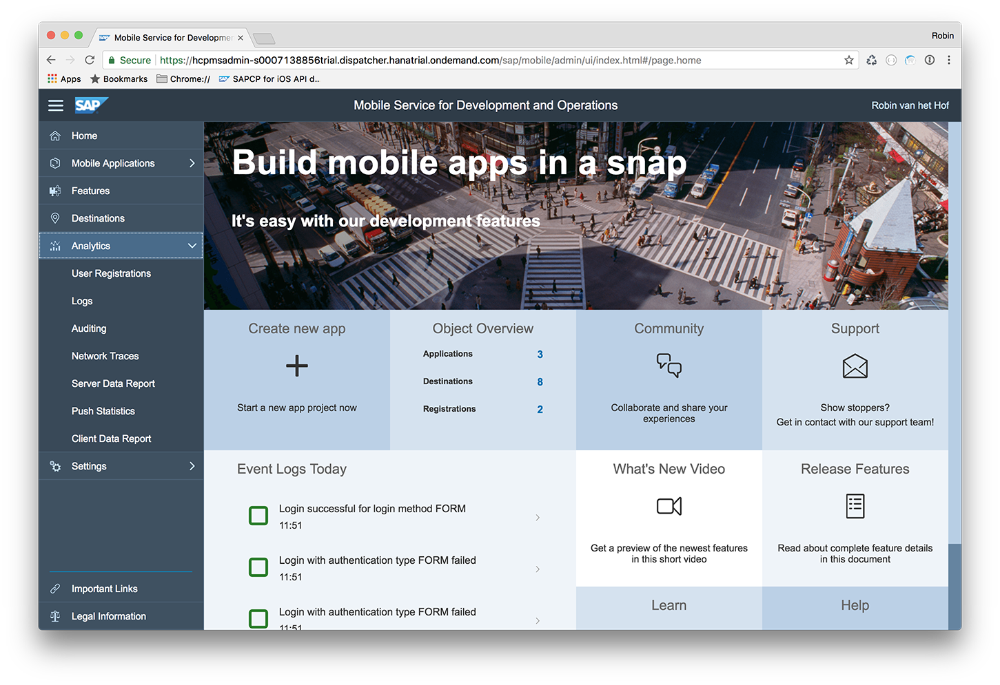
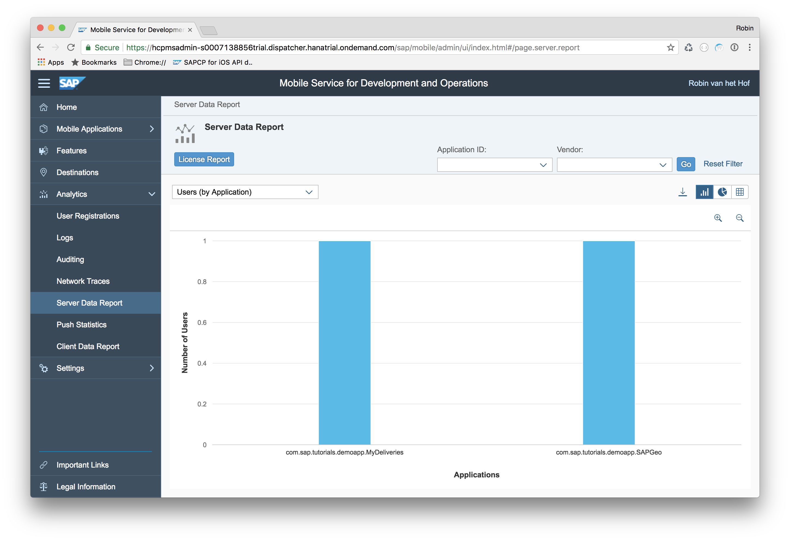
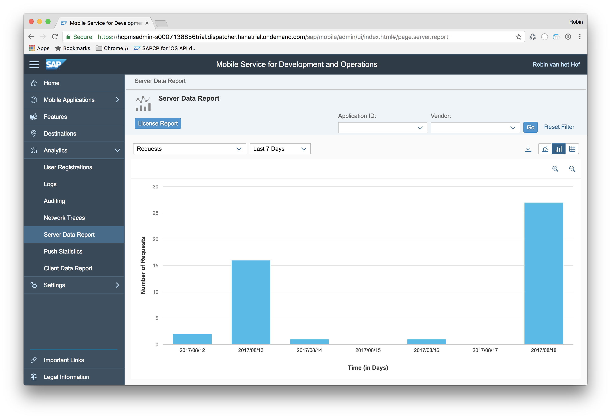
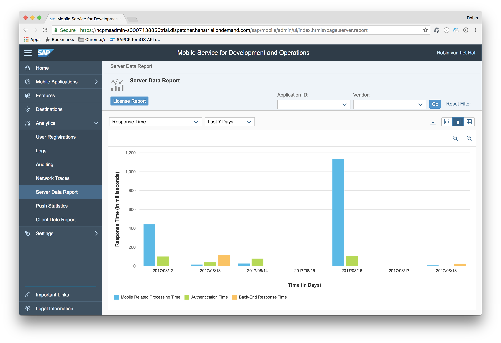
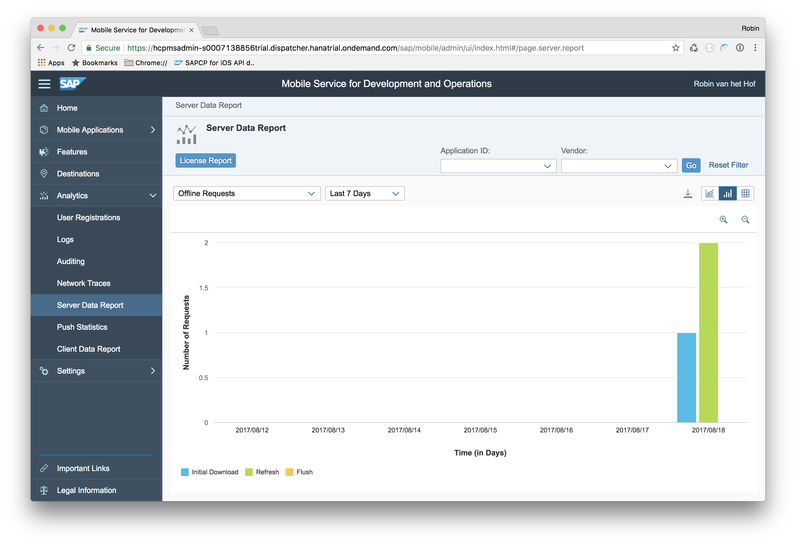
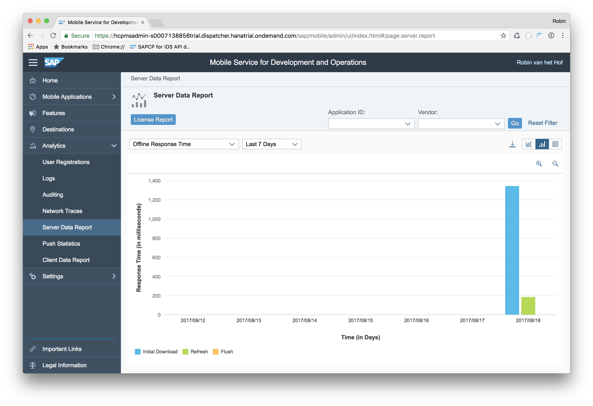
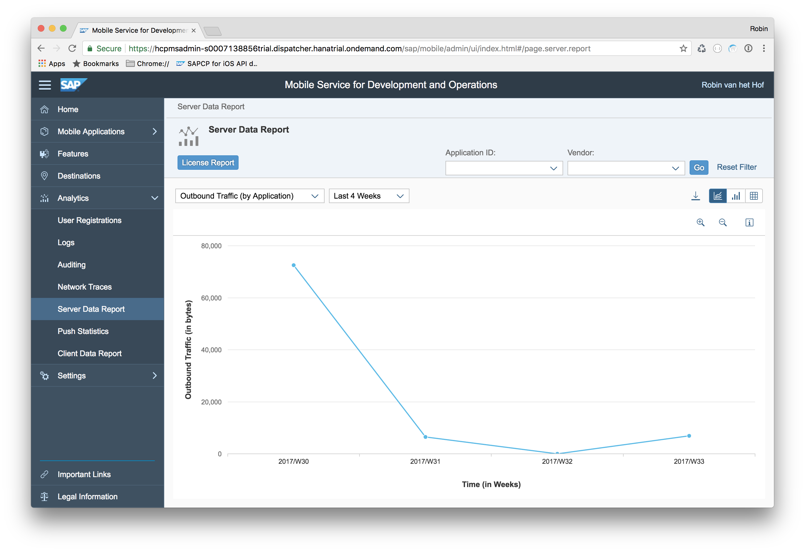
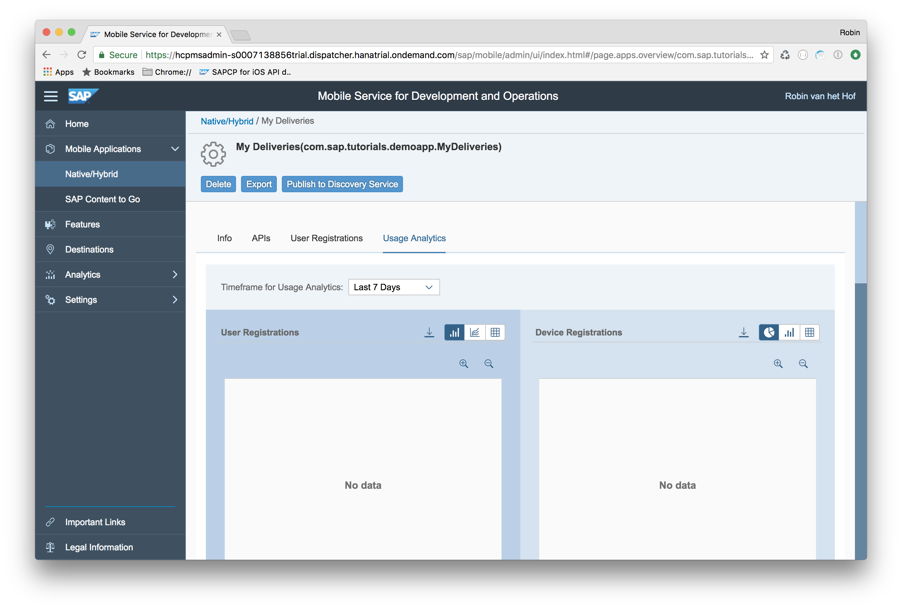

## Prerequisites  
 - **Proficiency:** Intermediate
 - **Development environment:** Apple iMac, MacBook or MacBook Pro running Xcode 8.3 or higher
 <!-- - **Tutorials:** [Enable the app for Offline OData](https://www.sap.com/developer/tutorials/fiori-ios-scpms-deliveryapp-part6.html) -->

<!-- ## Next Steps
 - [Change log settings and examine application logs](https://www.sap.com/developer/tutorials/fiori-ios-scpms-deliveryapp-part7.html) -->

## Details
### You will learn  
In this tutorial, you will get familiar with the extensive set of statistics generated by your native mobile iOS application into SAP Cloud Platform mobile service for development and operations.

### Time to Complete
**10 Min**

---

[ACCORDION-BEGIN [Step 1: ](Examine Analytics options)]

Open a browser to SAP Cloud Platform mobile service for development and operations and click the **Analytics** item.

[DONE]
[ACCORDION-END]

[ACCORDION-BEGIN [Step 2: ](Display User Registrations)]

> **NOTE:** You will only see entries under **User Registration** if you have deployed your application on a physical device. Running an application from the iOS Simulator will not result in an entry showing up.

.

Click the **User Registration** link. Depending on whether you have deployed your application to your physical device, you will see the registered users for each application:

In this view, you can specify specific client log levels per registration, as well as removing existing registrations.

[DONE]
[ACCORDION-END]

[ACCORDION-BEGIN [Step 3: ](Display Users By Application)]

In the left pane, click the **Server Data Report** link, and from the filter, select **Users (by Application)**.

You should now see the active users per application:

[DONE]
[ACCORDION-END]

[ACCORDION-BEGIN [Step 4: ](Display Request statistics)]

From the filter, select **Requests** for **Last 7 Days**

You should now see the total number of requests in the last 7 days:

[DONE]
[ACCORDION-END]

[ACCORDION-BEGIN [Step 5: ](Display Response Time statistics)]

From the filter, select **Response Time** for **Last 7 Days**

You should now see the response times in the last 7 days, split by **Mobile Response Time**, **Authentication Response Time** and **Backend Response Time**:

[DONE]
[ACCORDION-END]

[ACCORDION-BEGIN [Step 6: ](Display Offline Requests statistics)]

From the filter, select **Offline Requests** for **Last 7 Days**

You should now see the total number of Offline requests in the last 7 days, split by **Initial Downloads requests** and **Refresh requests**:

[DONE]
[ACCORDION-END]

[ACCORDION-BEGIN [Step 7: ](Display Offline Response Time statistics)]

From the filter, select **Offline Response Time** for **Last 7 Days**

You should now see the total number of Offline requests in the last 7 days, split by **Initial Downloads Response Time** and **Refresh Response Time**:

[DONE]
[ACCORDION-END]

[ACCORDION-BEGIN [Step 8: ](Display Outbound Traffic statistics)]

From the filter, select **Outbound Traffic (by Application)** for **Last 4 weeks**

You should now see the total number of bytes sent in the last 4 weeks:

[DONE]
[ACCORDION-END]

[ACCORDION-BEGIN [Step 9: ](Display Application specific statistics)]

While the mentioned statistics are great, they are mostly aggregated of all apps running on top of SAP Cloud Platform mobile service for development and operations. A much practical scenario is to display statistics for just one single app.

Navigate to **Mobile Application > Native/Hybrid > My Deliveries**. In the tab bar, click the **Usage Statistics** link. Set the **Time frame for Usage Analytics** to `Last 7 Days` :

If you scroll down a bit, you see the **Request** and **Response Time** statistics:

...and the **Offline Requests** and **Offline Response Times**:

And here you see why displaying the statistics for one single app can be practical: for example, the **Offline Requests** shows you the initial requests and refresh requests **for all Entities** in your OData service!

[DONE]
[ACCORDION-END]

<!-- ## Next Steps
 - [Change log settings and examine application logs](https://www.sap.com/developer/tutorials/fiori-ios-scpms-deliveryapp-part7.html) -->
