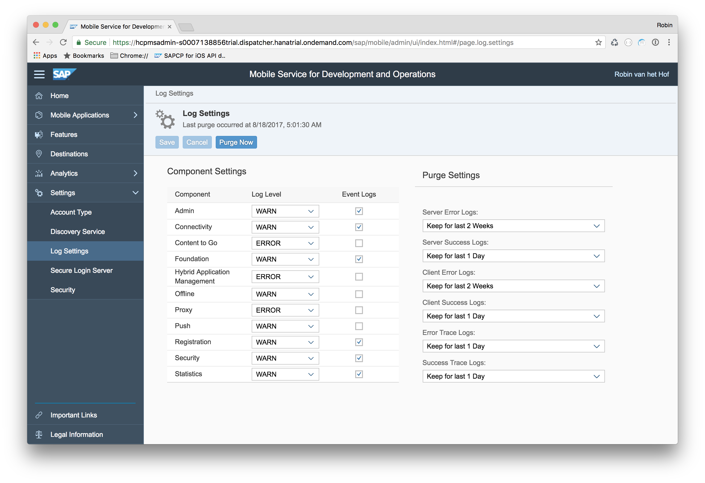
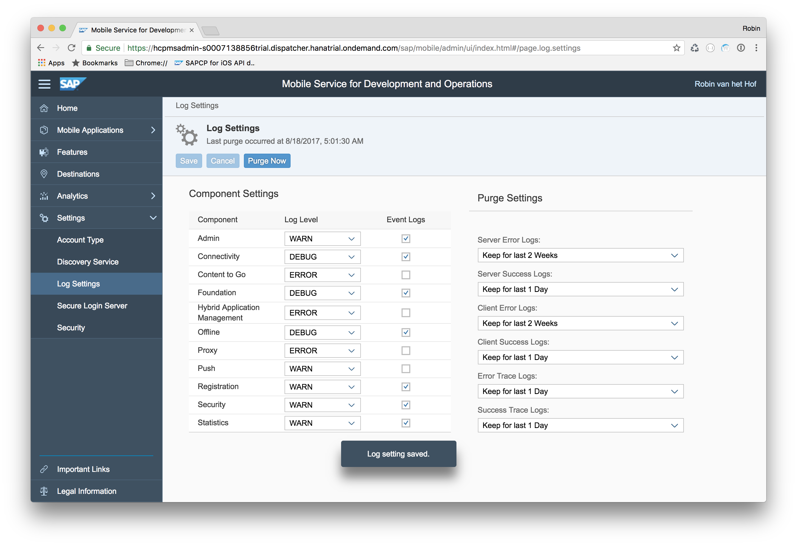
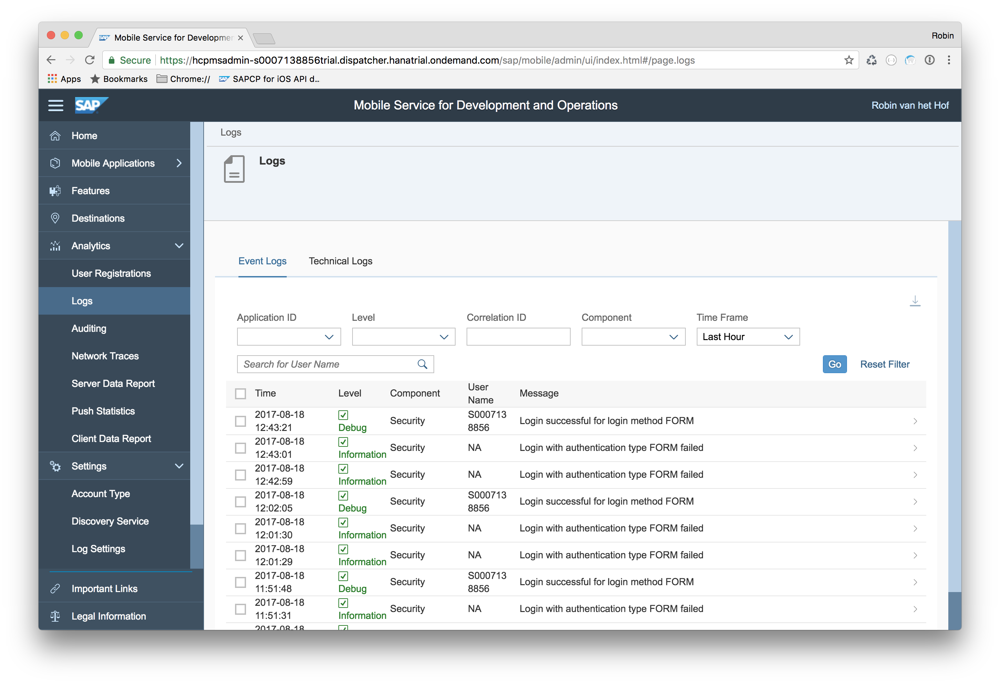
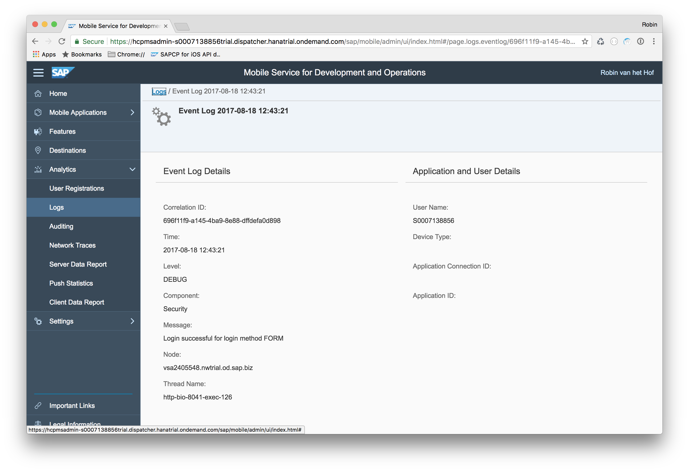

## Prerequisites  
- **Proficiency:** Intermediate
- **Development environment:** Apple iMac, MacBook or MacBook Pro running Xcode 8.3 or higher
<!-- - **Tutorials:** [Manage and monitor your app on SAP Cloud Platform Mobile Services](https://www.sap.com/developer/tutorials/fiori-ios-scpms-deliveryapp-part7.html) -->

<!-- ## Next Steps
 - Select a tutorial group from the [Tutorial Navigator](https://www.sap.com/developer/tutorial-navigator.html) or the [Tutorial Catalog](https://www.sap.com/developer/tutorial-navigator.tutorials.html) -->

## Details
### You will learn  
In the previous tutorial you have examined most of the statistics and information gathered on SAP Cloud Platform mobile service for development and operations from the mobile device. In this tutorial, you will examine the different logs and traces being recorded.

### Time to Complete
**10 Min**

---

[ACCORDION-BEGIN [Step 1: ](Open Log Settings)]

Open a browser to SAP Cloud Platform mobile service for development and operations and navigate to **Settings > Log Settings**:

[DONE]
[ACCORDION-END]

[ACCORDION-BEGIN [Step 2: ](Change log settings)]

Change the log settings to the following:

| Component | Log Level | Event Logs |
|----|----|----|
| Admin | WARN | yes |
| Connectivity | DEBUG | yes |
| Foundation | DEBUG | yes |
| Offline | DEBUG | yes |

Click **Save** when done:

[DONE]
[ACCORDION-END]

[ACCORDION-BEGIN [Step 3: ](Run the application)]

Build and run the application, and navigate the entities, to gather some log data. You could also try and login with incorrect credentials, to generate an error.

[DONE]
[ACCORDION-END]

[ACCORDION-BEGIN [Step 4: ](Examine the Event logs)]

In SAP Cloud Platform mobile service for development and operations, navigate to **Analytics > Logs**.

The page opens with the **Event Logs**:

If you click on an entry, you can examine the Event Log details:

[DONE]
[ACCORDION-END]

[ACCORDION-BEGIN [Step 5: ](Examine the Technical logs)]

Navigate back, and click the **Technical Logs** link at the top. You now see the logs triggered by your application:

Click on an entry, and examine the sequence of events for that entry:

[VALIDATE_5]

[ACCORDION-END]

<!-- ## Next Steps
- Select a tutorial from the [Tutorial Navigator](https://www.sap.com/developer/tutorial-navigator.html) or the [Tutorial Catalog](https://www.sap.com/developer/tutorials.html) -->
