## Prerequisites  
- **Tutorials:** [Get a Free Trial Account on SAP Cloud Platform](hcp-create-trial-account)
- **Development environment:** Apple Mac running macOS Mojave or higher with Xcode 11 or higher
- **SAP Cloud Platform SDK for iOS:** Version 4.0 SP00

## Details
### You will learn  
  - How to enable Mobile Services for Neo Trial Landscape
  - How to create a connection in the SAP Cloud Platform SDK for iOS Assistant

Before you start, make sure you:

  - Have downloaded [SAP Cloud Platform SDK for iOS](https://www.sap.com/developer/trials-downloads/additional-downloads/sap-cloud-platform-sdk-for-ios-14485.html) **version 3.0 SP02**.
  - Have a trial account on SAP Cloud Platform. See [Get a Free Trial Account on SAP Cloud Platform](hcp-create-trial-account).

---

[ACCORDION-BEGIN [Step 1: ](Enable SAP Cloud Platform Mobile Services)]

The SAP Cloud Platform SDK for iOS is designed to work seamlessly with a set of services provided by the SAP Cloud Platform that are optimized for communication with mobile devices, known collectively as Mobile Services. These include not only data services, but also features like analytics, push notifications, and app configuration. Before creating your first app, you'll need to ensure that Mobile Services are enabled for your trial account.

Please open up the [SAP Cloud Platform](https://hanatrial.ondemand.com) website.

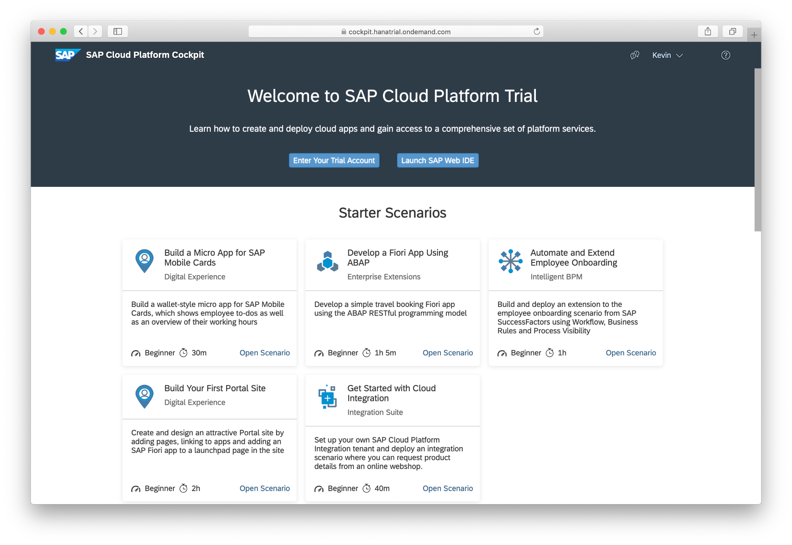

Scroll down until you see the **Access Neo Trial** link and click on it.

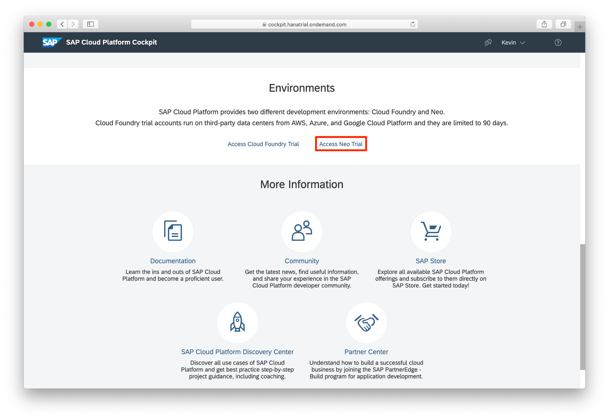

In the Navigation Pane on the left-hand side, select **Services**.

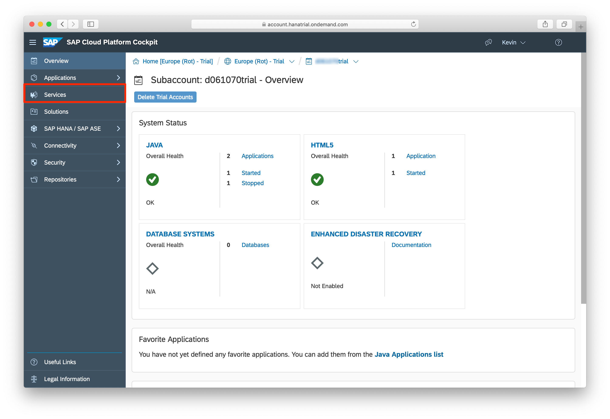

Search for Mobile using the search field and click on **Mobile Services, users** tile.

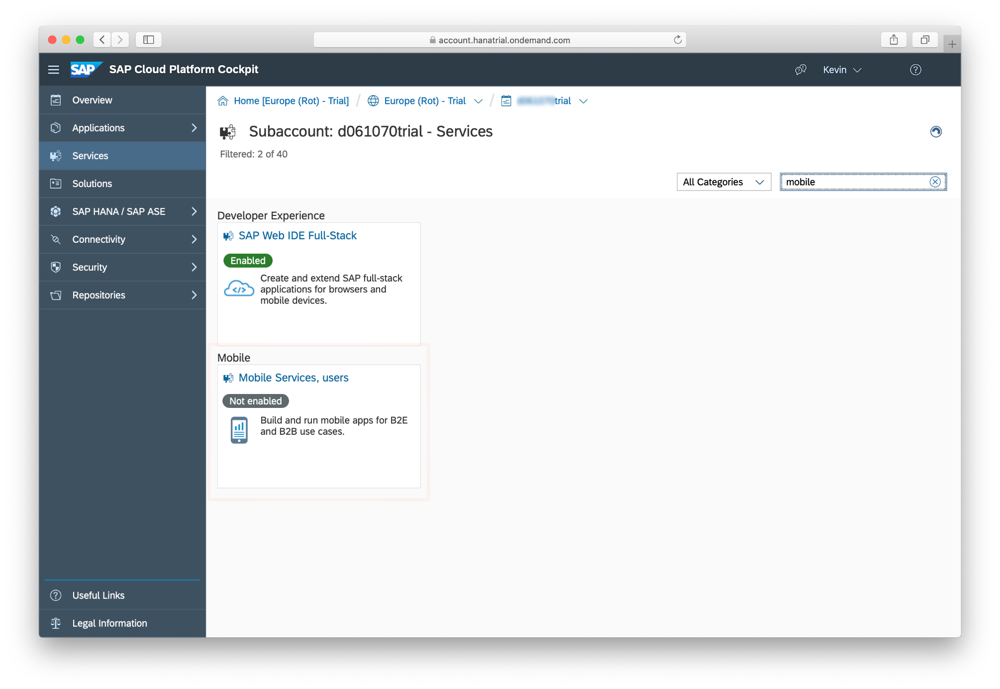

Click on **Enable**.

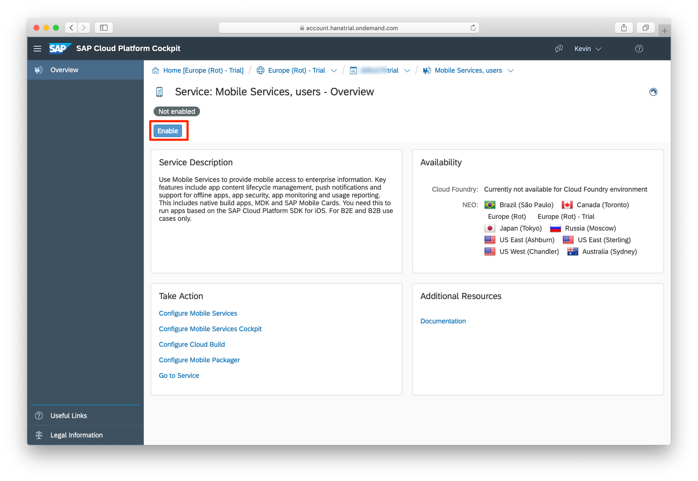

After the service is enabled, click on **Go to Service**. The Mobile Services will open up in a new tab.

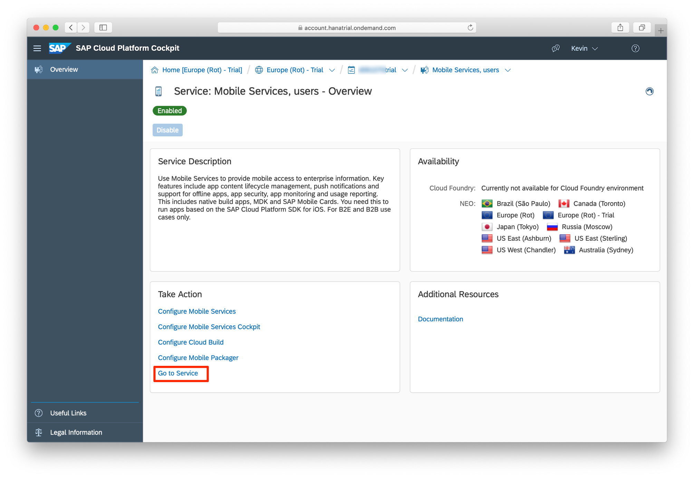

[DONE]
[ACCORDION-END]

[ACCORDION-BEGIN [Step 2: ](Configure the SAP iOS Assistant)]

In order to use the iOS Assistant, you have to make a connection from Mobile Services to the Assistant.

The Mobile Services Cockpit might show you a pop-up with the latest and greatest features. Close that pop-up.

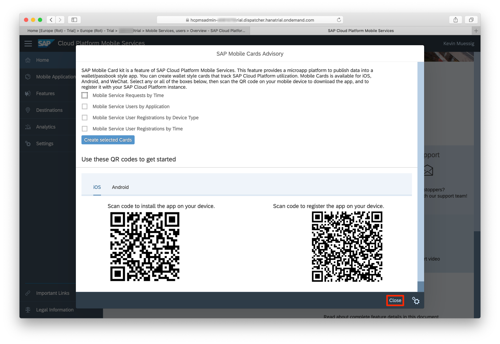

In the Mobile Services Cockpit, click on **Important Links**.

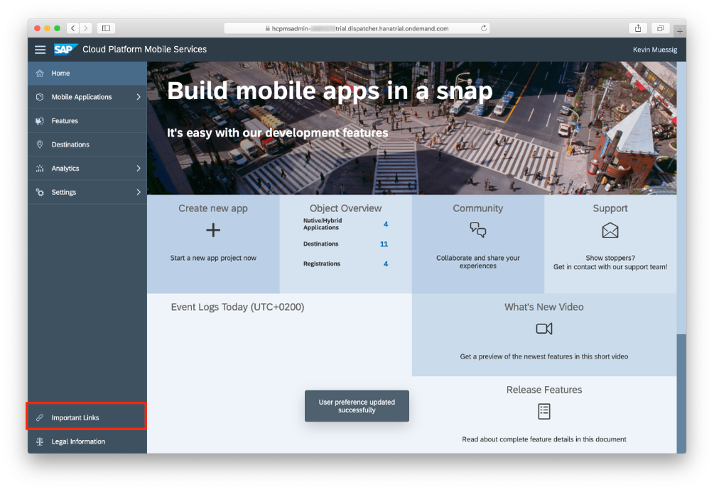

Click on **Importing URLs directly**.

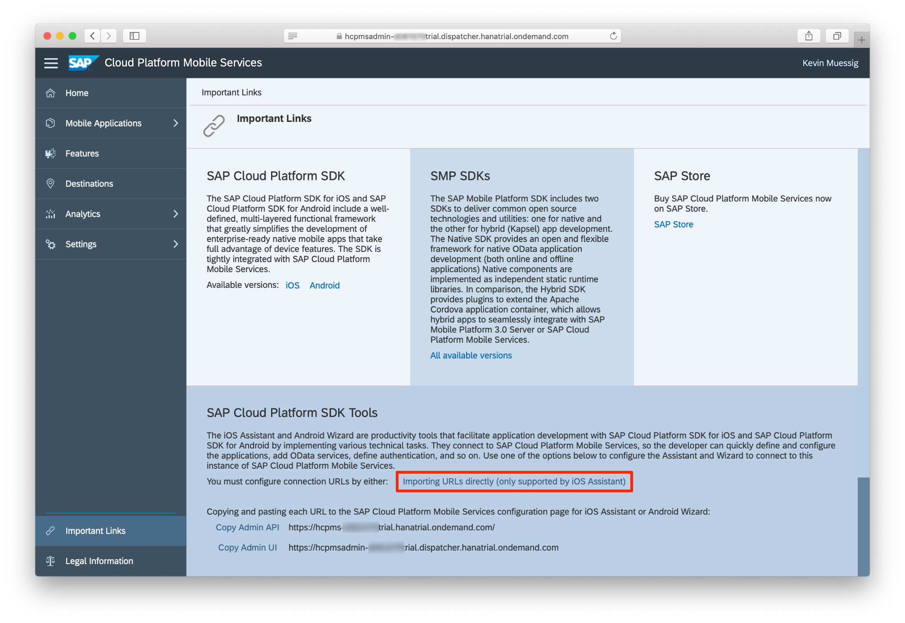

Your browser will ask you to allow the access to the Assistant. Click on **Allow**.

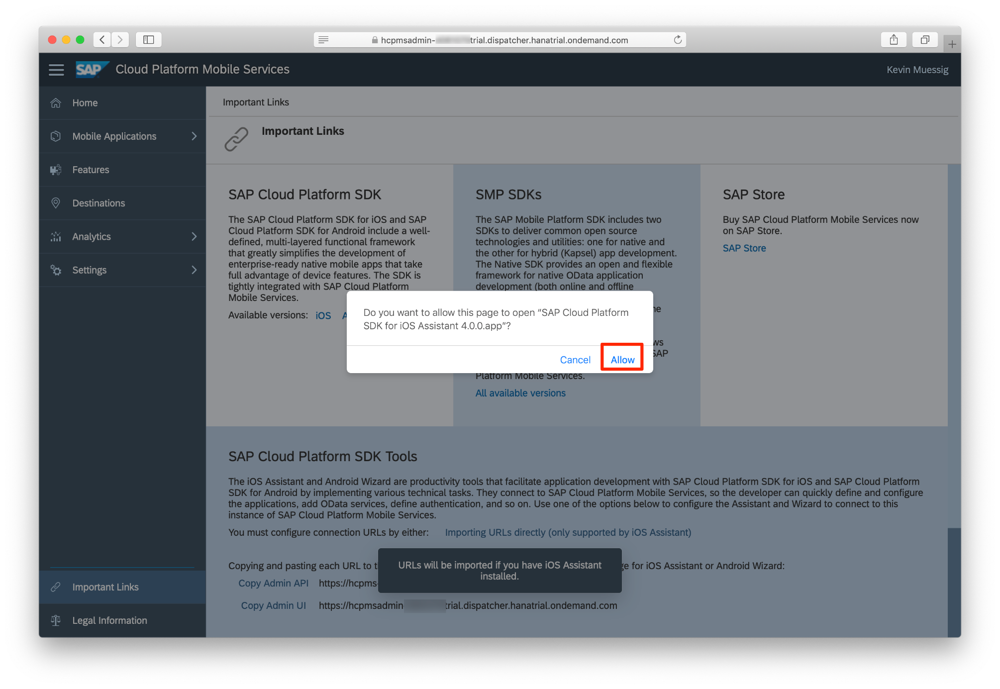

Give it a name and change the authentication type to SAML and click **Save**.

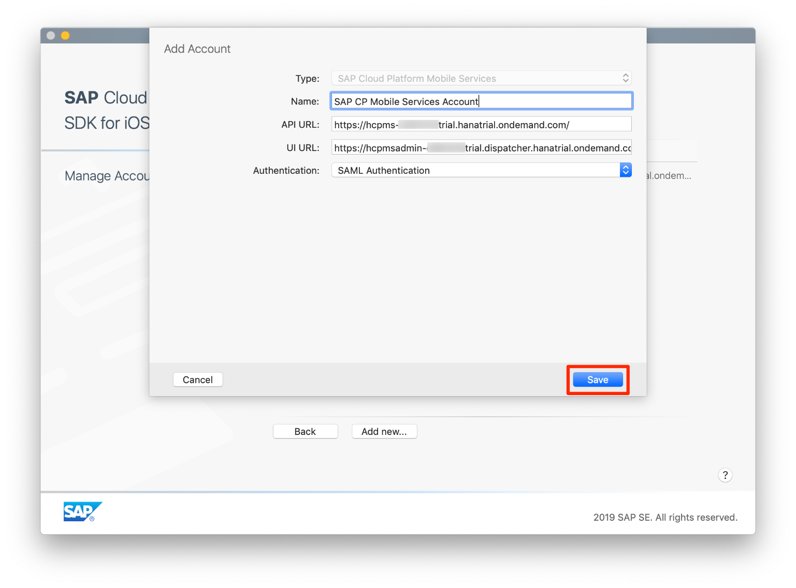

Go back to the main screen by clicking on **Back**.

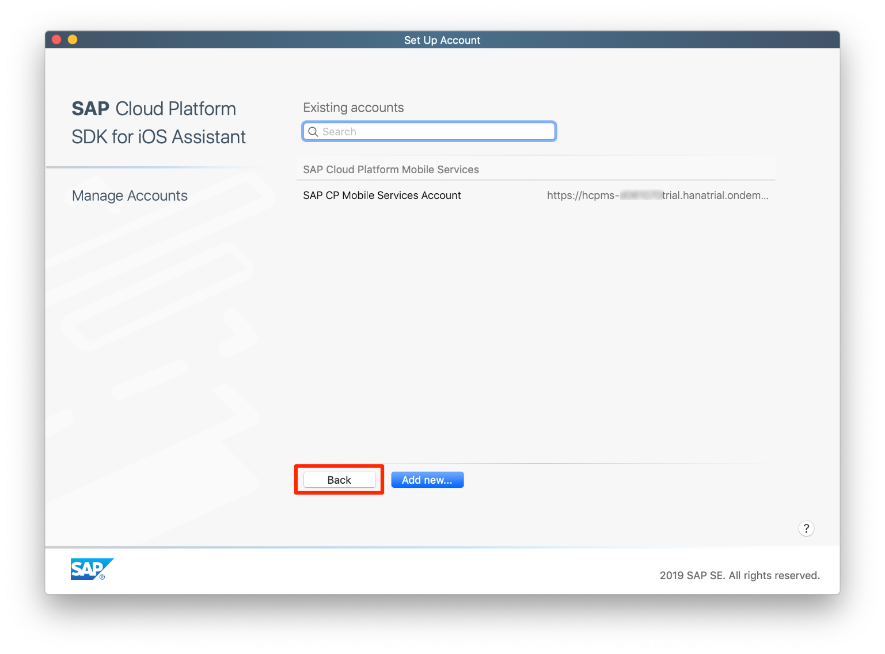

You have successfully connected your Mobile Services account with the iOS Assistant.

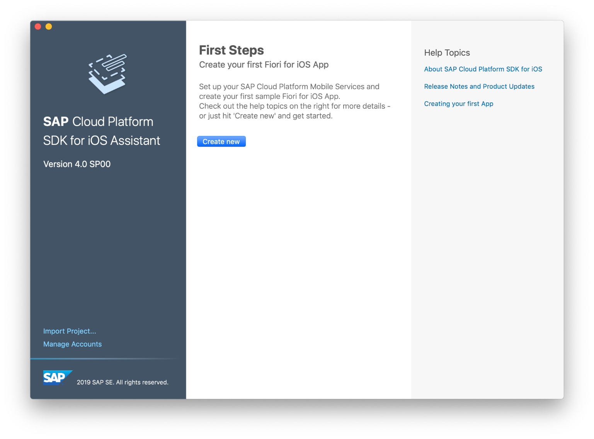

[VALIDATE_2]
[ACCORDION-END]
