## Prerequisites  
 - **Proficiency:** Intermediate
 - **Development machine:** Access to a Mac computer
 - **Tutorials:** [Using the SAP Fiori Mentor app](https://www.sap.com/developer/tutorials/fiori-ios-scpms-mentor.html)


## Next Steps
 - [Push Notifications](https://www.sap.com/developer/tutorials/fiori-ios-hcpms-push-notifications.html)

## Details
### You will learn  
In this tutorial, you will learn three things:

- Add a view to show related entities of an OData navigation link (i.e., an OData `$expand`)
- Display this view according to the **List Report Floorplan**
- Add barcode scanner to the List Report's search bar

In this example, you build upon the demo app created using the **Sample OData** service. If you examine the service's metadata (URL: `https://hcpms-<your account>trial.hanatrial.ondemand.com/SampleServices/ESPM.svc/$metadata`) you see entity **Supplier** has a one-to-many relationship with **Products**:

```xml
<EntityType Name="Supplier">
  <Key>
    <PropertyRef Name="SupplierId"/>
  </Key>
  <Property MaxLength="40" Name="City" Nullable="true" Type="Edm.String"/>
  <Property MaxLength="3" Name="Country" Nullable="true" Type="Edm.String"/>
  <Property MaxLength="255" Name="EmailAddress" Nullable="true" Type="Edm.String"/>
  <Property MaxLength="10" Name="HouseNumber" Nullable="true" Type="Edm.String"/>
  <Property MaxLength="30" Name="PhoneNumber" Nullable="true" Type="Edm.String"/>
  <Property MaxLength="10" Name="PostalCode" Nullable="true" Type="Edm.String"/>
  <Property MaxLength="60" Name="Street" Nullable="true" Type="Edm.String"/>
  <Property MaxLength="10" Name="SupplierId" Nullable="false" Type="Edm.String"/>
  <Property MaxLength="80" Name="SupplierName" Nullable="true" Type="Edm.String"/>
  <Property Name="UpdatedTimestamp" Type="Edm.DateTime"/>
  <NavigationProperty FromRole="Supplier" Name="Products" Relationship="ESPM.Supplier_Product_One_Many0" ToRole="Product"/>
</EntityType>
```

In this tutorial, you will enhance the **Suppliers** entity detail view to show its related **Products** in a **List Report Floorplan**.


### Time to Complete
**20 Min**

---

[ACCORDION-BEGIN [Step 1: ](Create a new Table View Controller)]

To list the products for each supplier, the most simple approach would be to create a new Table View Controller.

In Xcode, drag a **Table View Controller** object from the **Object library** onto the **Storyboard**, next to the **Detail Scene**.

With the just added Table View Controller selected, give it the name `Supplier Products` in the **Attribute inspector**:

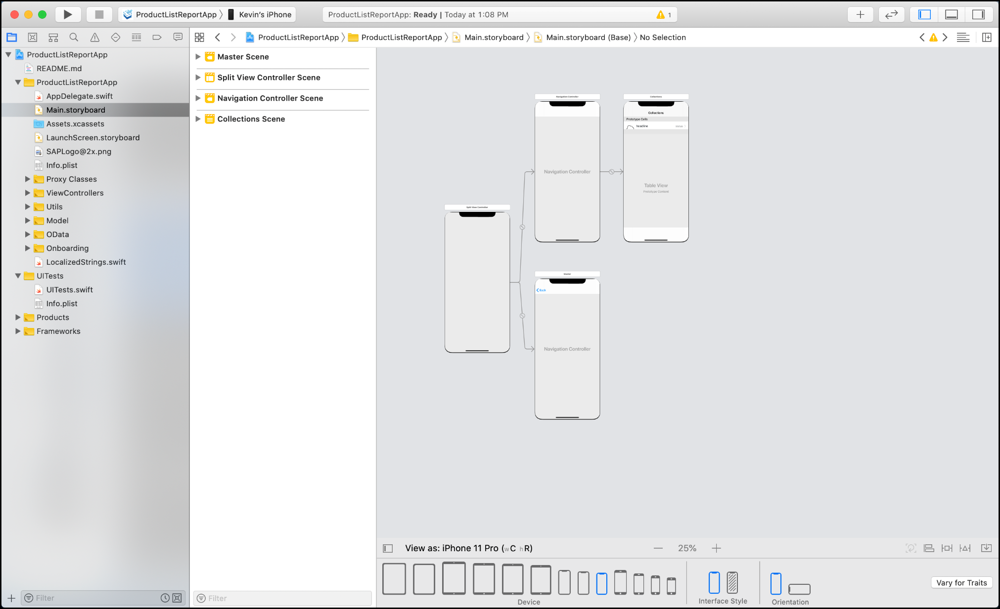

[DONE]
[ACCORDION-END]

[ACCORDION-BEGIN [Step 2: ](Create new subclass of a UITableViewController class)]

**Right-click** the `ViewControllers` folder in your project, and from the context menu choose **New File...**.

In the dialog, select **Cocoa Touch Class** and click **Next**.

Provide the following details:

| Field | Value |
|----|----|
| Class | `SupplierProductsViewController` |
| Subclass Of | `UITableViewController` |

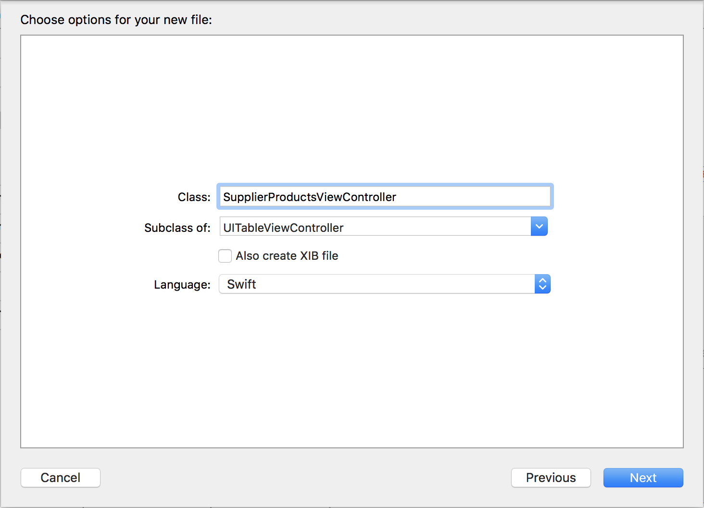

Click **Next**. In the next screen, make sure the new class file is stored in group `ViewControllers` and click **Create**.

In the newly created file `SupplierProductsViewController.swift`, under the `import UIKit` statement, add the following import statements:

```swift
import SAPOData
import SAPFoundation
import SAPFiori
import SAPCommon
```

Just below the line `class SupplierProductsViewController: UITableViewController {`, add the following declarations:

```swift
private let appDelegate = UIApplication.shared.delegate as! AppDelegate
private let logger: Logger = Logger.shared(named: "SupplierProductsViewController")

private var _entity: Supplier = Supplier()
var entity: EntityValue {
    get { return _entity }
    set { self._entity = newValue as! Supplier
    }
}
```

This adds a reference to the `AppDelegate` class, a reference to the SDK's logging mechanism, and fields to set/get the `Supplier` parent entity.

Switch to the **Storyboard** and select the **Supplier Products Table View**. In the **Identity inspector**, set the **Custom Class** to `SupplierProductsViewController`:

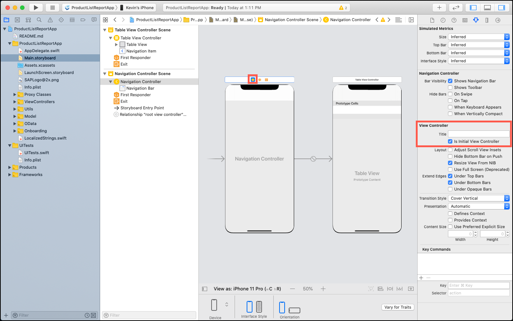
[DONE]
[ACCORDION-END]


[ACCORDION-BEGIN [Step 3: ](Add navigation Table View Cell to Detail Table View)]

Drag a **Table View Cell** onto the **Detail Table View**, and set the following properties in the **Attribute inspector**:

| Field | Value |
|----|----|
| Identifier | `NavigationLink` |
| Accessory | `Disclosure Indicator` |

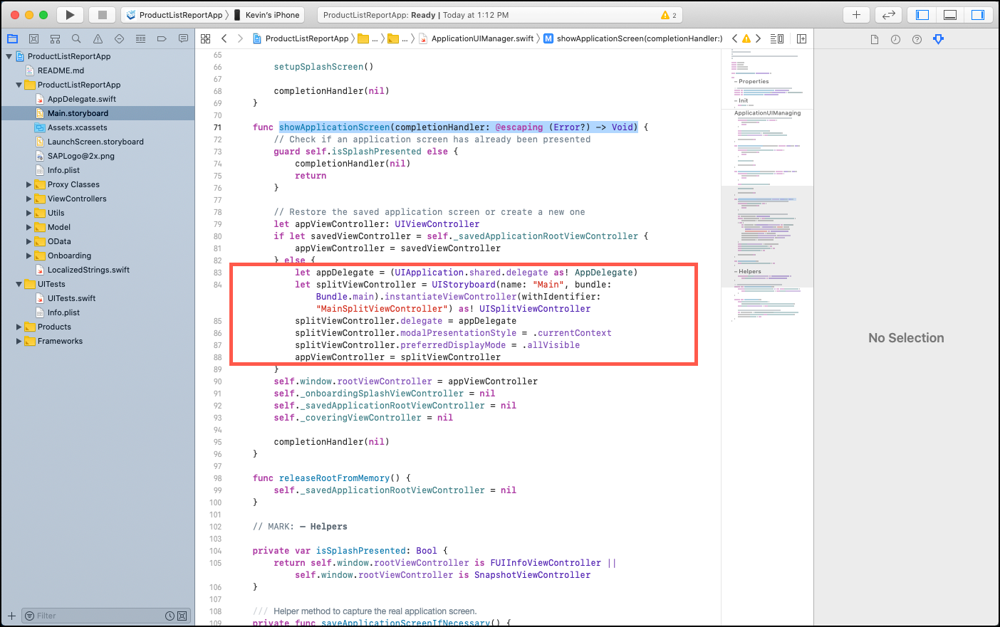

**Control-click** the just added **Table View Cell** and drag it onto the **Supplier Products Scene**. From the **Segue** pop-up, choose **Show**.

Name the segue `showSupplierProducts`:

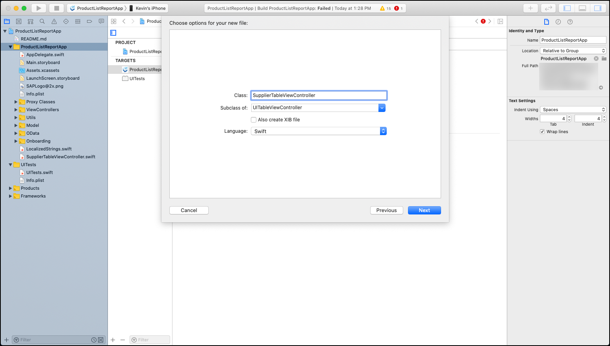

[DONE]
[ACCORDION-END]

[ACCORDION-BEGIN [Step 4: ](Implement Table View Cell for Suppliers)]

Open file `./MyDeliveries/TableDelegates/DetailTableDelegates/SupplierDetailTableDelegate.swift`.

Locate method `tableView(_ tableView:, numberOfRowsInSection section:)`. Currently it returns **10** rows, the total number of properties the `Supplier` entity has. However, since you added an extra Table View Cell to navigate to the Supplier Products scene, you want to make this extra cell visible.

Set the return value to `11`:

```swift
func tableView(_ tableView: UITableView, numberOfRowsInSection section: Int) -> Int {
    return 11
}
```
Next, locate method `tableView(_ tableView:, cellForRowAt indexPath:)`.

It contains a `switch` statement which, depending on the `indexPath.row` value, displays the property and corresponding value for the selected `Supplier`.

To display the added Table View Cell, add an extra `case` statement, just above the `default:` switch:

```swift
case 10:
    let navigationLink = tableView.dequeueReusableCell(withIdentifier: "NavigationLink",
        for: indexPath) as UITableViewCell
    navigationLink.textLabel?.text = "Show Supplier Products..."
    return navigationLink
```

Now the 11th row in the table will return a **Table View Cell** matching identifier `NavigationLink`, and it will display the static text `Show Supplier Products...`.

If you now run and build the application, the newly added table cell is displayed:

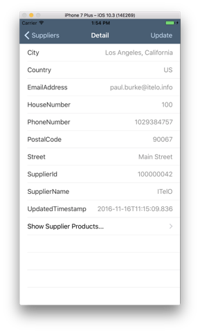

However, if you click on it, nothing happens... You will solve that in the next step.

[DONE]
[ACCORDION-END]

[ACCORDION-BEGIN [Step 5: ](Implement navigation logic)]

In the previous step, you have noticed the navigation to the **Supplier Products** scene did not happen. That is caused since the `DetailViewController.swift` file has turned off its ability to select table cells.

Open the file `./MyDeliveries/ViewControllers/DetailViewController.swift`.

In method `viewDidLoad()`, locate the line:

```swift
self.tableView.allowsSelection = false
```

To enable navigating from this view to the Tracking Info view, set this property to `true`.

Next, scroll down, and just above the method `cancel()` add the following function:

```swift
override func prepare(for segue: UIStoryboardSegue, sender: Any?) {
    if segue.identifier == "showSupplierProducts" {

        if (self.tableView.indexPathForSelectedRow?.row != nil) {
            let supplierProductsView = segue.destination as! SupplierProductsViewController

            let currentEntity = self.selectedEntity as? Supplier

            let esSuppliers = MyServiceClassMetadata.EntitySets.suppliers

            // Load all related Products for the current Supplier
            let query = DataQuery()
                .from(esSuppliers)
                .withKey(Supplier.key(supplierID: currentEntity?.supplierID) )
                .expand(Supplier.products)

            do {
                // Perform query and store the results
                supplierProductsView.entity = try self.myServiceClass.service.suppliers(
                    query: query)[0]
            }
            catch let error {
                self.logger.error(error.localizedDescription)
            }
        }
    }
}
```

With this code, you create a query to load all related **Product** entities for the selected **Supplier** entity, and store the results into the `SupplierProductsViewController`.
[DONE]
[ACCORDION-END]

[ACCORDION-BEGIN [Step 6: ](Implement the SAP Fiori List Report Floorplan)]

First, you need to bind the related **Products** to the view.

Replace the method `viewDidLoad()` with the following:

```swift
override func viewDidLoad() {
    super.viewDidLoad()

    self.title = "Supplier Products: \(self._entity.products.count)"

    self.tableView.register(FUIObjectTableViewCell.self, forCellReuseIdentifier: "FUIObjectTableViewCell")

    self.tableView.estimatedRowHeight = 98
    self.tableView.rowHeight = UITableViewAutomaticDimension
}
```

This sets the view's title, registers the **SAP Fiori Object Table View Cell** control, and sets the estimated row/cell height.

Next, change the method `numberOfSections(in tableView:)` to:

```swift
override func numberOfSections(in tableView: UITableView) -> Int {
    return 1
}
```

...and change method `tableView(_ tableView:, numberOfRowsInSection section:)` so it returns the number of related **Products**:

```swift
override func tableView(_ tableView: UITableView, numberOfRowsInSection section: Int) -> Int {
    return self._entity.products.count
}
```

Then, add the following two methods:

```swift
override func tableView(_ tableView: UITableView, cellForRowAt indexPath: IndexPath) -> UITableViewCell {
    let product = self._entity.products[indexPath.row]

    let cell = tableView.dequeueReusableCell(withIdentifier: "FUIObjectTableViewCell", for: indexPath)
    guard let objectCell = cell as? FUIObjectTableViewCell else {
        return cell
    }
    objectCell.headlineText = product.name
    objectCell.subheadlineText = product.longDescription
    objectCell.footnoteText = product.categoryName
    objectCell.statusText = self.formatCurrency(value: product.price!)

    return objectCell
}

private func formatCurrency(value: BigDecimal) -> String {
    let formatter = NumberFormatter()
    formatter.numberStyle = .currency
    formatter.maximumFractionDigits = 2;
    formatter.locale = Locale(identifier: Locale.current.identifier)
    let result = formatter.string(from: value.doubleValue() as NSNumber);
    return result!;
}
```

The first method creates the **SAP Fiori Object Table View Cell** and binds the **Product** properties to the control.

The second method is a simple formatter to show the product's **Price** in a more human readable format.

If you now build and run the application, select a **Supplier** and click the **Show Supplier Products...** link, you should see a page like this:

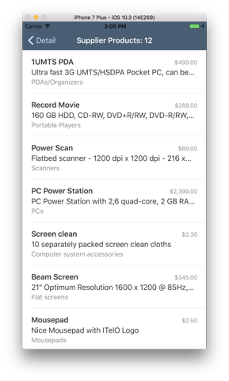

[DONE]
[ACCORDION-END]

[ACCORDION-BEGIN [Step 7: ](Add Search Bar, Toolbar and Navigation bar)]

In this step, you will add a search bar where you can filter the list of Products by name or description.

First, have your class `SupplierProductsViewController` extend from `UISearchResultsUpdating`:

```swift
class SupplierProductsViewController: UITableViewController, UISearchResultsUpdating {
```

Just above method `viewDidLoad()`, add the following fields:

```swift
var searchController: FUISearchController = FUISearchController(searchResultsController: nil)
var filteredProducts: [Product] = []
var isFiltered: Bool = false
```

The first field holds a reference to the search controller.
The second field holds an array of filtered `Product` entities.
The third field flags whether the list is filtered or not.

Inside method `viewDidLoad()`, add the following lines of code:

```swift
searchController.searchResultsUpdater = self as UISearchResultsUpdating
searchController.searchBar.placeholderText = "Search product"
self.tableView.tableHeaderView = searchController.searchBar
```

This registers the search updater, sets a placeholder text in the search bar, and puts the search bar in the table header.

In step 6, you have changed method `tableView(_ tableView:, numberOfRowsInSection section:)` so it returns the number of related **Products**. Because the result can be filtered, change the method again to return either the filtered result count, or the total result count:

```swift
override func tableView(_ tableView: UITableView, numberOfRowsInSection section: Int) -> Int {
    return isFiltered ? self.filteredProducts.count : self._entity.products.count
}
```

In method `tableView(_ tableView:, cellForRowAt indexPath:)`, change the reference to constant `product` to be either from the filtered or unfiltered array:

```swift
let product = isFiltered ? self.filteredProducts[indexPath.row] : self._entity.products[indexPath.row]
```

Finally, add the following event handler:

```swift
func updateSearchResults(for searchController: UISearchController) {

    guard let searchString = searchController.searchBar.text, !searchString.isEmpty else {
        self.isFiltered = false
        self.filteredProducts.removeAll()
        self.tableView.reloadData()
        return
    }

    self.isFiltered = true
    self.filteredProducts = self._entity.products.filter( {
        return
            $0.productID!.contains(searchString) ||
            $0.name!.contains(searchString) ||
            $0.shortDescription!.contains(searchString) ||
            $0.longDescription!.contains(searchString)
    })
    self.tableView.reloadData()
}
```

Any changes in the view's search bar will fire this event, and the view will be updated with the results.

Build and run the application, the view should now have the search bar visible:

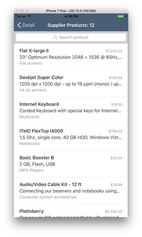

Type in the search bar, the list should update instantly:

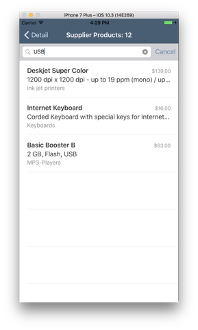

[DONE]
[ACCORDION-END]

[ACCORDION-BEGIN [Step 8: ](Add toolbar buttons)]

In this step, you add a couple of toolbar buttons to complement the view. We won't actually add any specific logic to these buttons, but it it merely there to show what can be achieved with the **List Report Floorplan**.

First, add the following event handlers:

```swift
func addProduct() {
    // Add your own implementation, i.e. OData create
}

func refreshProducts() {
    // Add your own implementation, i.e. query products
}

func setEditMode() {
    self.tableView.setEditing(!self.tableView.isEditing, animated: true)
}
```

Then, in method `viewDidLoad()`, add the following lines of code:

```swift
self.navigationItem.rightBarButtonItem = UIBarButtonItem(barButtonSystemItem: .edit, target: self, action: #selector(setEditMode))

let addItem = UIBarButtonItem(barButtonSystemItem: .add, target: self, action: #selector(addProduct))
let filterItem = UIBarButtonItem(barButtonSystemItem: .refresh, target: self, action: #selector(refreshProducts))
let spacing = UIBarButtonItem(barButtonSystemItem: .flexibleSpace, target: nil, action: nil)

self.navigationController?.isToolbarHidden = false
self.toolbarItems = [filterItem, spacing, addItem]
```

Build and run the application, the view should now have the buttons visible:

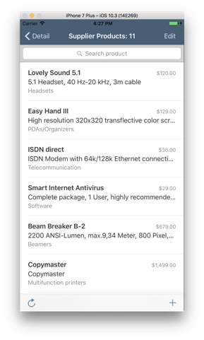

[DONE]
[ACCORDION-END]

[ACCORDION-BEGIN [Step 9: ](Update info.plist file)]

In the following steps, you will implement Barcode Scanner functionality to the search bar. If you have a long list of items, being able to scan an item to filter the list can save you a lot of time and minimizes input errors.

Since the Barcode Scanner uses the camera, you first need to grant permissions to the app to use it.

Open the `info.plist` file and add the following entry:

| Key | Value |
|----|----|
| Privacy - Camera Usage Description | `$(PRODUCT_NAME) needs to use the camera as a barcode scanner` |

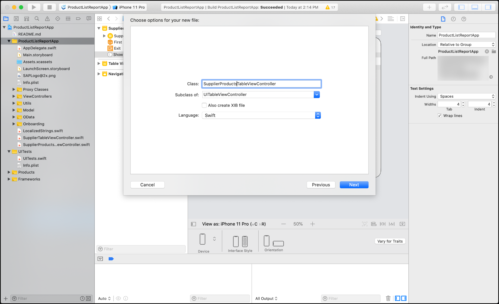

[DONE]
[ACCORDION-END]

[ACCORDION-BEGIN [Step 10: ](Enable Barcode Scanner in Search bar)]

Add the following import statement:

```swift
import SAPFiori
```

In method `viewDidLoad()`, just above the last line:

```swift
self.tableView.tableHeaderView = searchController.searchBar
```

add the following lines of code:

```swift
searchController!.searchBar.isBarcodeScannerEnabled = true
searchController!.searchBar.barcodeScanner?.scanResultTransformer = { (scanString) -> String in
    return scanString
}
```

This code adds the Search Bar and attaches the Barcode Scanner to it. Upon successful scanning, the Search bar will now be filtered with the scanned value.

[DONE]
[ACCORDION-END]

[ACCORDION-BEGIN [Step 11: ](Using the Barcode Scanner)]

Build and run the application. Upon start, it asks to grant permission to use the Camera:


Click **OK** to continue.

Notice the small barcode icon appearing in the Search bar:

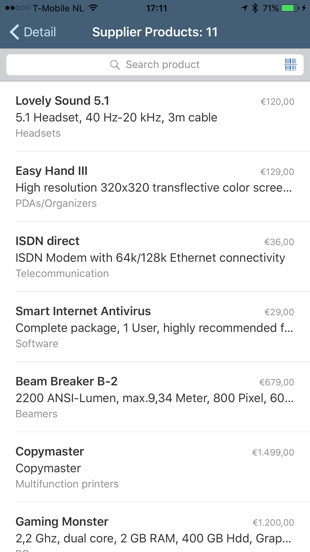

If you now tap the small barcode icon in the search bar, the Barcode Scanner view opens. Try to scan one of these barcodes:

Barcode 1:
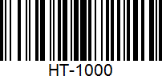

Barcode 2:
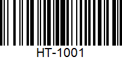

Barcode 3:
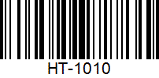

Barcode 4:


Position the barcode inside the scanning area. If a barcode has been detected, this will be indicated by a green line or rectangle:

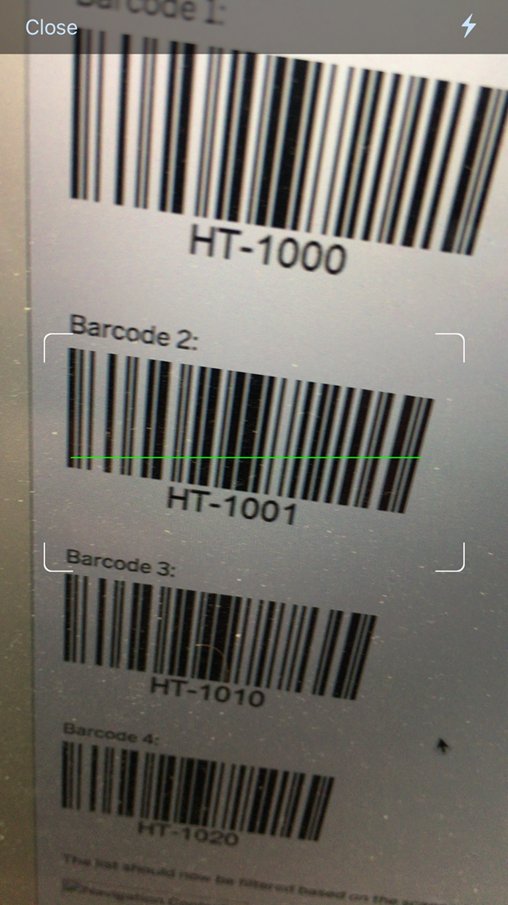

The list should now be filtered based on the scanned results:


[DONE]
[ACCORDION-END]

## Next Steps
- [Push Notifications](https://www.sap.com/developer/tutorials/fiori-ios-hcpms-push-notifications.html)
