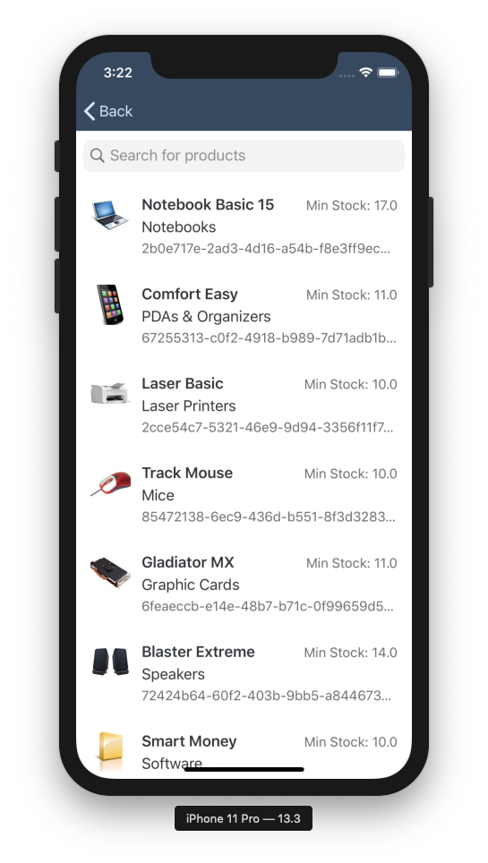

## Prerequisites

- **Tutorials:** [Get a Free Trial Account on SAP BTP](hcp-create-trial-account) and [Set Up the SAP BTP SDK for iOS](group.ios-sdk-setup)
- **Development environment:** Apple Mac running macOS Catalina or higher with Xcode 11 or higher
- **SAP BTP SDK for iOS:** Version 5.0

## Details

### You will learn  

- How to use the `SAPFiori` UI controls to build a List Report Floorplan

---

[ACCORDION-BEGIN [Step 1: ](Make the Generated App Your Own)]

In this example, you build upon the Tutorial app created using the **Sample OData** service. If you examine the service's metadata you can see entity **Supplier** has a one-to-many relationship with **Products**:

```XML
<EntityType Name="Supplier">
  <Key>
    <PropertyRef Name="SupplierId"/>
  </Key>
  <Property MaxLength="40" Name="City" Nullable="true" Type="Edm.String"/>
  <Property MaxLength="3" Name="Country" Nullable="true" Type="Edm.String"/>
  <Property MaxLength="255" Name="EmailAddress" Nullable="true" Type="Edm.String"/>
  <Property MaxLength="10" Name="HouseNumber" Nullable="true" Type="Edm.String"/>
  <Property MaxLength="30" Name="PhoneNumber" Nullable="true" Type="Edm.String"/>
  <Property MaxLength="10" Name="PostalCode" Nullable="true" Type="Edm.String"/>
  <Property MaxLength="60" Name="Street" Nullable="true" Type="Edm.String"/>
  <Property MaxLength="10" Name="SupplierId" Nullable="false" Type="Edm.String"/>
  <Property MaxLength="80" Name="SupplierName" Nullable="true" Type="Edm.String"/>
  <Property Name="UpdatedTimestamp" Type="Edm.DateTime"/>
  <NavigationProperty FromRole="Supplier" Name="Products" Relationship="ESPM.Supplier_Product_One_Many0" ToRole="Product"/>
</EntityType>
```

The app you've generated with the SAP BTP SDK Assistant for iOS (Assistant) has currently its UI. You're going to make that app your own now.

Open the `Main.storyboard`, select all displayed View Controllers and delete them.


Add a new `UITableViewController` to the storyboard and embed it in a `UINavigationController`.


Now change the `UINavigationController` to be the **Initial View Controller**.


To let the app load your newly added screen it is necessary to change the application screen code in the `ApplicationUIManager.swift`.

Open the `ApplicationUIManager.swift` class and locate the `showApplicationScreen(completionHandler:)` method.


Replace the following code inside the `showApplicationScreen(completionHandler:)` method:

```Swift
  let appDelegate = (UIApplication.shared.delegate as! AppDelegate)
  let splitViewController = UIStoryboard(name: "Main", bundle: Bundle.main).instantiateViewController(withIdentifier: "MainSplitViewController") as! UISplitViewController
  splitViewController.delegate = appDelegate
  splitViewController.modalPresentationStyle = .currentContext
  splitViewController.preferredDisplayMode = .allVisible
  appViewController = splitViewController

```

with:

```Swift
   let navigationViewController = UIStoryboard(name: "Main", bundle: Bundle.main).instantiateInitialViewController() as! UINavigationController
   appViewController = navigationViewController

```

Instead of instantiating the `MainSplitViewController` the `UIStoryboard` will instantiate the initial View Controller and cast it to the `UINavigationController`.

Lastly, you have to create a new class inheriting from `UITableViewController`. Create a new **Cocoa Touch Class** and name it `SupplierTableViewController`.


Set the created class as **Custom Class** in the storyboard for the added `UITableViewController`.


[DONE]
[ACCORDION-END]

[ACCORDION-BEGIN [Step 2: ](Fetch All Available Suppliers From the Sample Service)]

Now that you have the first `UITableViewController` setup you will add code to load and display suppliers in a `UITableView`.

Open the `SupplierTableViewController.swift` class and add the following import statements for full usage of the SDK:

```Swift
import SAPOData
import SAPFoundation
import SAPFiori
import SAPFioriFlows
import SAPCommon

```

Next let the `SupplierTableViewController.swift` class conforms to the `SAPFioriLoadingIndicator` protocol provided by the Assistant generated code. You can locate the protocol in the `Utils` group.

```Swift
class SupplierTableViewController: UITableViewController, SAPFioriLoadingIndicator { ... }

```

Xcode will ask you to fully conform to the protocol by adding a `loadingIndicator` class property. Add the following line of code directly below the class declaration:

```Swift
var loadingIndicator: FUILoadingIndicatorView?

```

Implement the following lines of code directly below the loading indicator property:

```Swift
// The available destinations from Mobile Services are hold in the FileConfigurationProvider. Retrieve it to find the correct data service
let destinations = FileConfigurationProvider("AppParameters").provideConfiguration().configuration["Destinations"] as! NSDictionary

// Retrieve the data service using the destinations dictionary and return it.
var dataService: ESPMContainer<OnlineODataProvider>? {
    guard let odataController = OnboardingSessionManager.shared.onboardingSession?.odataControllers[destinations["com.sap.edm.sampleservice.v2"] as! String] as? Comsapedmsampleservicev2OnlineODataController, let dataService = odataController.espmContainer else {
        AlertHelper.displayAlert(with: NSLocalizedString("OData service is not reachable, please onboard again.", comment: ""), error: nil, viewController: self)
        return nil
    }
    return dataService
}

```

> In case you're using an `ODataOfflineProvider` you have to change the above-mentioned code to use `ODataOfflineProvider` instead of `ODataOnlineProvider`. You have to also import `SAPOfflineOData` in addition to the `SAPOData` framework.

Because we're good citizens we want to use an app logger to log important information. Fortunately, SAP is offering a simple-to-use Logging API with the `SAPCommon` framework.

Implement the following line of code below the data service declaration:

```Swift
private let logger = Logger.shared(named: "SupplierTableViewController")

```

Before you will implement the data loading methods you have to implement a supplier array property to save the loaded data in memory.

Add the following line of code below the logger instantiation:

```Swift
private var suppliers = [Supplier]()

```

> From now on bigger code blocks are explained with inline comments. Read the inline comments carefully to fully understand what the code is doing and why we're implementing it.

Loading all available suppliers is fairly easy using the generated data service. The generated code will handle all authentication and authorization challenges for you and the data service will construct all necessary requests to load, create and update entities in your backend.

Implement the following methods directly under the closing bracket of the `viewDidLoad()` method:

```Swift
// MARK: - Data loading

/// When this method gets called to show a loading indicator. When the completion handler of the loadData(:) method gets executed hide the loading indicator.
private func updateTableView() {
    self.showFioriLoadingIndicator()
    loadData {
        self.hideFioriLoadingIndicator()
    }
}

/// Load the suppliers by using the fetchSuppliers() method provided by the data service.
private func loadData(completionHandler: @escaping () -> Void) {
    // fetch products
    dataService?.fetchSuppliers() { [weak self] suppliers, error in
        // handle errors
        if let error = error {
            self?.logger.error("Error while fetching list of suppliers.", error: error)
            return
        }

        // set loaded suppliers to property and reload data on the table view
        self?.suppliers = suppliers!
        self?.tableView.reloadData()
        completionHandler()
    }
}

```

Call the `updateTableView()` method inside the `viewDidLoad()`:

```Swift
override func viewDidLoad() {
    super.viewDidLoad()

    updateTableView()
}

```

Congratulations, your app is fetching data now.

[DONE]
[ACCORDION-END]

[ACCORDION-BEGIN [Step 3: ](Implement the Table View to display a supplier list)]

Using the `UITableViewController` makes it easy for a developer to display data in a list.

First, implement two necessary `UITableViewDataSource` methods which are responsible for telling the `UITableView` how many sections and rows to display. Implement those two methods directly below the `loadData(:)` method:

```Swift
// MARK: - Table view data source

/// We are only displaying one section for this screen, return 1.
override func numberOfSections(in tableView: UITableView) -> Int {
    return 1
}

/// Return the count of the suppliers array.
override func tableView(_ tableView: UITableView, numberOfRowsInSection section: Int) -> Int {
    return suppliers.count
}

```

Using the `SAPFiori` framework allows you to choose from a large variety of `UITableViewCell` classes.
Because we're going to display suppliers, and those have a name, an address and probably contact data the `FUIContactCell` would be a perfect fit here. You can always use the **SAP Fiori Mentor** app, available in the App Store for iPad, to get an introduction to the control.

Before implementing the `tableView(_cellForRowAt:)` method responsible for dequeuing reusable cells and returning them to the `UITableView`, we want to register the `FUIContactCell` with the `UITableView` first. This is usually done in the `viewDidLoad()` method.

Implement the following lines of code before the `updateTableView()` method call in the `viewDidLoad()`:

```Swift
// Register the cell with the provided convenience reuse identifier.
tableView.register(FUIContactCell.self, forCellReuseIdentifier: FUIContactCell.reuseIdentifier)

// Set the seperator style of the table view to none and the background color to the standard Fiori background base color.
tableView.separatorStyle = .none
tableView.backgroundColor = .preferredFioriColor(forStyle: .backgroundBase)

```

It is time to implement the `tableView(_cellForRowAt:)` method to dequeue the `FUIContactCell`:

```Swift
override func tableView(_ tableView: UITableView, cellForRowAt indexPath: IndexPath) -> UITableViewCell {

  // Get the specific supplier for the current row.
  let supplier = suppliers[indexPath.row]

  // Dequeue the FUIContactCell using the convenience reuse identifier. Force cast it to the FUIContactCell
  let cell = tableView.dequeueReusableCell(withIdentifier: FUIContactCell.reuseIdentifier) as! FUIContactCell

  // Set values to the cell's properties.
  cell.headlineText = supplier.supplierName ?? "No Name available!"
  cell.subheadlineText = "\(supplier.street ?? "") \(supplier.houseNumber ?? "") \(supplier.city ?? ""), \(supplier.postalCode ?? "") \(supplier.country ?? "")"

  // Because we're going to implement navigation later this cell has the disclosure indicator as accessory type indicating that navigation to the user.
  cell.accessoryType = .disclosureIndicator

  return cell
}

```

You could run the app now and should see a list of suppliers getting loaded and displayed.

[DONE]
[ACCORDION-END]

[ACCORDION-BEGIN [Step 4: ](Add an FUIActivityControl to your FUIContactCell)]

Using the `FUIContactCell` allows us to use an `FUIActivityControl` inside of the cell to let the user contact a supplier. The [`FUIActivityControl`](https://help.sap.com/doc/978e4f6c968c4cc5a30f9d324aa4b1d7/Latest/en-US/Documents/Frameworks/SAPFiori/Classes/FUIContactCell.html) documentation explains the control and its variations in more detail.

First, you have to define which so-called `FUIActivityItems` you want to use in the `FUIActivityControl`.

Add the following line of code below the supplier's array:

```Swift
/// Define the contact possibilities for the user: messaging, phone call, and email
private let activities = [FUIActivityItem.message, FUIActivityItem.phone, FUIActivityItem.email]

```

With that, you can simply add those activities to the `FUIContactCell`. This specific cell carries the `FUIActivityControl` in its belly in is accessible through the available public API.

Go back to the `tableView(_cellForRowAt:)` method and add the following lines of code directly above the assignment of the accessory type:

```Swift
cell.activityControl.addActivities(activities)
cell.activityControl.maxVisibleItems = 3

// The FUIActivityControl provides you two different ways of reacting to user's interaction. One would be with a change handler the other would be with a delegate. Because I don't want the communication logic being in the tableView(_cellForRowAt:) method we're using the delegation way.
cell.activityControl.delegate = self

```

To properly react to the user's interaction with the control you will implement an extension conforming to the `FUIActivityControlDelegate`.

Implement the extension:

```Swift
extension SupplierTableViewController: FUIActivityControlDelegate {

  func activityControl(_ activityControl: FUIActivityControl, didSelectActivity activityItem: FUIActivityItem) {

    // Use a Switch to check for the identifier and act accordingly.
    switch activityItem.identifier {
    case FUIActivityItem.message.identifier:
        AlertHelper.displayAlert(with: "Messaging supplier!", error: nil, viewController: self)
        break
    case FUIActivityItem.phone.identifier:
        AlertHelper.displayAlert(with: "Calling supplier!", error: nil, viewController: self)
        break
    case FUIActivityItem.email.identifier:
        AlertHelper.displayAlert(with: "Send email to supplier!", error: nil, viewController: self)
        break
    default:
        return
    }
  }
}

```

In this tutorial, you will not implement the actual code for doing the communication. If you're interested in how to do so, you can use Apple's official documentation:

- [`CallKit`](https://developer.apple.com/documentation/callkit)
- [`MessageUI`](https://developer.apple.com/documentation/messageui)

If you run the app now you should see the following screen:


Tapping on one of the `FUIActivityItem` will result in an alert dialogue showing up.


[DONE]
[ACCORDION-END]

[ACCORDION-BEGIN [Step 5: ](Implement the Navigation Between the Supplier List and the Product List)]

In this step, we will implement a second `UITableViewController` displaying all products a supplier provides.
For this, we will use a storyboard segue to navigate to the `SupplierProductsTableViewController` and pass through the selected supplier.

> In case you're not familiar with segues please visit, and carefully read the official documentation before continuing. [Using Segues](https://developer.apple.com/library/archive/featuredarticles/ViewControllerPGforiPhoneOS/UsingSegues.html)

Open up the `Main.storyboard` and add a new `UITableViewController` from the **Object Library** directly next to the `SupplierTableViewController`. Create a new segue from one of the prototype cells inside of the `SupplierTableViewController` to the newly added `UITableViewController`.


Select the segue and open the **Identity Inspector** to set the Identifier to `showSupplierProducts`.


Go back to the `SupplierTableViewController` and add a new class constant of type String which will hold the segue identifier.

```Swift
private let segueIdentifier = "showSupplierProducts"

```

Create a new Cocoa Touch class with the name `SupplierProductsTableViewController`.


Set the **Custom Class** of the newly added `UITableViewController` to `SupplierProductsTableViewController` in the `Main.storyboard`.


Open the `SupplierProductsTableViewController` and add a class property that will contain the selected supplier.

```Swift
var supplier: Supplier!

```

Next, we will implement the `prepare(:for:sender:)` method which is responsible for making necessary preparations before the navigation is fully executed. In our case, we will pass the selected supplier to the `SupplierProductsTableViewController`.

Implement the `prepare(:for:sender:)` method:

```Swift
// MARK: - Navigation

override func prepare(for segue: UIStoryboardSegue, sender: Any?) {

  // Check for the correct identifier
  if segue.identifier == segueIdentifier {

    // Get the selected row from the table view.
    if let indexPathForSelectedRow = tableView.indexPathForSelectedRow {

      // Get the destination view controller and cast it to SupplierProductsTableViewController.
      let destinationVC = segue.destination as! SupplierProductsTableViewController

      // Set the selected supplier.
      destinationVC.supplier = suppliers[indexPathForSelectedRow.row]
    }
  }
}

```

You can utilize the `tableView(_:didSelectRowAt:)` method to trigger the navigation. Implement the override method:

```Swift
override func tableView(_ tableView: UITableView, didSelectRowAt indexPath: IndexPath) {
        performSegue(withIdentifier: segueIdentifier, sender: tableView)
}

```

You can now navigate back and forth between the `SupplierTableViewController` and the `SupplierProductsTableViewController`.

[DONE]
[ACCORDION-END]

[ACCORDION-BEGIN [Step 6: ](Implement the loading and displaying of supplier-specific products)]

This view is similar to the `SupplierTableViewController` but instead of fetching all products, we will fetch supplier-specific products. To achieve that, we again can utilize the OData APIs. `SAPOData` provides the possibility to create so-called `DataQuery` objects which can define typical OData arguments for a backend call.

First, we need to make the needed import statements for that class:

```Swift
import SAPOData
import SAPFoundation
import SAPFiori
import SAPFioriFlows
import SAPCommon

```

Let's use the logger again. Add the following line of code below the supplier property:

```Swift
private let logger = Logger.shared(named: "SupplierProductsViewController")

```

Add a couple of class properties necessary for the data service instance and the fetched products. Implement the following lines of code:

```Swift
// The available destinations from Mobile Services are hold in the FileConfigurationProvider. Retrieve it to find the correct data service
let destinations = FileConfigurationProvider("AppParameters").provideConfiguration().configuration["Destinations"] as! NSDictionary

// Retrieve the data service using the destinations dictionary and return it.
var dataService: ESPMContainer<OnlineODataProvider>? {
    guard let odataController = OnboardingSessionManager.shared.onboardingSession?.odataControllers[destinations["com.sap.edm.sampleservice.v2"] as! String] as? Comsapedmsampleservicev2OnlineODataController, let dataService = odataController.espmContainer else {
        AlertHelper.displayAlert(with: NSLocalizedString("OData service is not reachable, please onboard again.", comment: ""), error: nil, viewController: self)
        return nil
    }
    return dataService
}

private var products = [Product]()

```

Also, we want to utilize the provided loading indicator. Let the class conform to the `SAPFioriLoadingIndicator` protocol.

```Swift
class SupplierProductsTableViewController: UITableViewController, SAPFioriLoadingIndicator { ... }

```

Of course, don't forget the loading indicator class property:

```Swift
var loadingIndicator: FUILoadingIndicatorView?

```

Let's load some data!

We're using the same style we've used in the `SupplierTableViewController`. Implement the following two methods and read the inline comments carefully because you will see that we utilize the `DataQuery` object for making a filter as well as an expand.

> If you're not familiar with those OData specific terms please make yourself familiar with the OData specification:

- [URI Conventions (OData Version 2.0)](https://www.odata.org/documentation/odata-version-2-0/uri-conventions/)
- [OData Version 4.01. Part 2: URL Conventions](http://docs.oasis-open.org/odata/odata/v4.01/odata-v4.01-part2-url-conventions.html)

```Swift

// You know that one u{1F609}
private func updateTableView() {
    self.showFioriLoadingIndicator()
    loadData {
        self.hideFioriLoadingIndicator()
    }
}

private func loadData(completionHandler: @escaping () -> Void) {

    // Retrieve the supplier id
    let supplierID = supplier.supplierID!

    // Create a new DataQuery object applying a filter and an expand. The filter will filter on the specific
    // supplier id and the expand will construct the URL in a way that the backend returns the stock details
    // for each product.
    let dataQuery = DataQuery().filter(Product.supplierID == supplierID).expand(Product.stockDetails)
    dataService?.fetchProducts(matching: dataQuery) { [weak self] products, error in
        // handle errors
        if let error = error {
            self?.logger.error("Error while fetching list of products for supplier: \(supplierID).", error: error)
            return
        }

        // set loaded products to property and reload data on the table view
        self?.products = products!
        self?.tableView.reloadData()
        completionHandler()
    }
}

```

Call the `updateTableView()` method as last statement in the `viewDidLoad()`.

```Swift
override func viewDidLoad() {
    super.viewDidLoad()

    updateTableView()
}

```

We know that the products contain images for each product, it would be nice to display them as well, but to do so we have to write a little bit of code to make that happen.

First, implement a class property holding the image URLs of all products.

```Swift
private var productImageURLs = [String]()

```

The user might want to scroll through the products even if the images are not fully loaded yet we have to implement a simple image cache as well as a placeholder image to keep the performance of the table stable.

Add the following line of code directly below the `productImageURLs`:

```Swift
// This simple dictionary will contain all the fetched images in memory.
private var imageCache = [String: UIImage]()

```

Now implement a method responsible for fetching the product images and caching them. Add the following method right below the `loadData(:)` method:

```Swift

/// This method will take a URL and an escaping completion handler as arguments. The URL is the backend URL for your deployed sample service.
private func loadProductImageFrom(_ url: URL, completionHandler: @escaping (_ image: UIImage) -> Void) {

    // Retrieve the SAP URLSession from the onboarding session.
    let appDelegate = UIApplication.shared.delegate as! AppDelegate
    if let sapURLSession = appDelegate.sessionManager.onboardingSession?.sapURLSession {

        // Create a data task, this is the same as the URLSession data task.
        sapURLSession.dataTask(with: url, completionHandler: { data, _, error in
            // Handle errors
            if let error = error {
                self.logger.error("Failed to load image!", error: error)
                return
            }

            // Instantiate an image from data.
            if let image = UIImage(data: data!) {
                // safe image in image cache
                self.imageCache[url.absoluteString] = image

                // Dispatch back to the main queue.
                DispatchQueue.main.async { completionHandler(image) }
            }
        }).resume()
    }
}

```

Now we have the foundation for fetching and caching images. You were probably wondering where the mapping from the fetched products to the product image URLs happens. We will implement that now.

Go back to the `loadData(:)` method and add the following line of code directly below the product assignment. Your `loadData(:)` should look like this now:

```Swift
private func loadData(completionHandler: @escaping () -> Void) {

    let supplierID = supplier.supplierID!
    let dataQuery = DataQuery().filter(Product.supplierID == supplierID).expand(Product.stockDetails)
    dataService?.fetchProducts(matching: dataQuery) { [weak self] products, error in
        // handle errors
        if let error = error {
            self?.logger.error("Error while fetching list of products for supplier: \(supplierID).", error: error)
            return
        }

        // set loaded products to property and reload data on the table view
        self?.products = products!

        // Use .map to create an array of picture URLs
        self?.productImageURLs = products!.map { $0.pictureUrl ?? "" }
        self?.tableView.reloadData()
        completionHandler()
    }
}

```

Like the last time we have to register a `SAPFiori` cell with the `UITableView`, but this time it is a `FUIObjectTableViewCell`. Add the following lines of code to the `viewDidLoad()` method right before the `updateTableView(:)` method call.

```Swift
tableView.register(FUIObjectTableViewCell.self, forCellReuseIdentifier: FUIObjectTableViewCell.reuseIdentifier)
tableView.separatorStyle = .none
tableView.backgroundColor = .preferredFioriColor(forStyle: .backgroundBase)

```

As the last step, we have to implement the table views data source methods similar to the `SupplierTableViewController`.

Add the following methods directly below the `loadProductImageFrom(_:completionHandler:)` method:

```Swift
// MARK: - Table view data source

override func numberOfSections(in tableView: UITableView) -> Int {
    return 1
}

override func tableView(_ tableView: UITableView, numberOfRowsInSection section: Int) -> Int {
    return products.count
}

override func tableView(_ tableView: UITableView, cellForRowAt indexPath: IndexPath) -> UITableViewCell {
    let product = products[indexPath.row]

    let cell = tableView.dequeueReusableCell(withIdentifier: FUIObjectTableViewCell.reuseIdentifier) as! FUIObjectTableViewCell

    cell.headlineText = product.name ?? ""
    cell.subheadlineText = product.categoryName ?? ""
    cell.footnoteText = product.productID ?? ""
    cell.statusText = "Min Stock: \(product.stockDetails?.minStock?.doubleValue() ?? 0.0)"

    // set a placeholder image
    cell.detailImageView.image = FUIIconLibrary.system.imageLibrary

    // This URL is found in Mobile Services API tab
    let baseURL = "Your API found in the Sample Service assigned to your mobile app configuration in MS"
    let url = URL(string: baseURL.appending(productImageURLs[indexPath.row]))

    guard let unwrapped = url else {
        logger.info("URL for product image is nil. Returning cell without image.")
        return cell
    }

    // check if the image is already in the cache
    if let img = imageCache[unwrapped.absoluteString] {
        cell.detailImageView.image = img
    } else {
        // The image is not cached yet, so download it.
        loadProductImageFrom(unwrapped) { image in
            cell.detailImageView.image = image
        }
    }

    return cell
    }
}

```

Run the app and navigate to the `SupplierProductsTableViewController`.


[DONE]
[ACCORDION-END]

[ACCORDION-BEGIN [Step 6: ](Implement the FUISearchBar to search for certain products in the list)]

Wouldn't it be cool to also have a `FUISearchBar` which is inheriting from `UISearchBar`? - Of course, it would be, so let's implement that.

> In case you're not familiar with the `UISearchBar` or `UISearchController` read the official documentation:

- [`UISearchBar`](https://developer.apple.com/documentation/uikit/uisearchbar)
- [`UISearchController`](https://developer.apple.com/documentation/uikit/uisearchcontroller)

Open the `SupplierProductsTableViewController.swift` class and add the following two class properties right below the products array:

```Swift
private var searchController: FUISearchController?

// Will hold the searched for products in that array.
private var searchedProducts = [Product]()

```

Let's implement a bit of setup logic for the `FUISearchBar`. Add the following method to your class:

```Swift
private func setupSearchBar() {
    // Search Controller setup
    searchController = FUISearchController(searchResultsController: nil)

    // The SupplierProductsViewController will take care of updating the search results.
    searchController!.searchResultsUpdater = self
    searchController!.hidesNavigationBarDuringPresentation = true
    searchController!.searchBar.placeholderText = "Search for products"

    // No Barcode scanner needed here
    searchController!.searchBar.isBarcodeScannerEnabled = false

    self.tableView.tableHeaderView = searchController!.searchBar
}

```

Xcode will complain now because the `SupplierProductsTableViewController.swift` class is not conforming to the [`UISearchResultsUpdating`](https://developer.apple.com/documentation/uikit/uisearchresultsupdating) protocol.

Add an extension to your class, like we did in the `SupplierTableViewController`:

```Swift
extension SupplierProductsTableViewController: UISearchResultsUpdating {
    func updateSearchResults(for searchController: UISearchController) {
        // to implement
    }
}

```

If you run the app now you should see the `FUISearchBar` being displayed above the `UITableView`.



Now we have to implement some search logic to be called in the `updateSearchResults(for:)` method.

Implement the following methods right below the `setupSearchBar()` method and carefully read the inline comments.

```Swift
// verify if the search text is empty or not
private func searchTextIsEmpty() -> Bool {
    return searchController?.searchBar.text?.isEmpty ?? true
}

// actual search logic for finding the correct products for the term the user is searching for
private func searchProducts(_ searchText: String) {
    searchedProducts = products.filter({( product : Product) -> Bool in
        return product.name?.lowercased().contains(searchText.lowercased()) ?? false
    })

    tableView.reloadData()
}

// verify if the user is currently searching or not
private func isSearching() -> Bool {
    return searchController?.isActive ?? false && !searchTextIsEmpty()
}

```

Cool! Let's implement the `updateSearchResults(for:)` method:

```Swift
extension SupplierProductsTableViewController: UISearchResultsUpdating {
    func updateSearchResults(for searchController: UISearchController) {
        // Get the searched-for term, note here that we don't have a time bouncer which waits for the user to finish its input. You could implement that if needed, for this simple example we do life searches for each character. I wouldn't recommend doing that over a large data set.
        if let searchText = searchController.searchBar.text {
            // Feed it to the search logic.
            searchProducts(searchText)
            return
        }
    }
}

```

As our last task here is to change the `UITableView` data source methods to use react to potential searches by the user.

Change the `tableView(_:numberOfRowsInSection:)` method to:

```Swift
override func tableView(_ tableView: UITableView, numberOfRowsInSection section: Int) -> Int {
    // if the user is searching display the searched for products and all products otherwise.
    return isSearching() ? searchedProducts.count : products.count
}

```

Also change the `tableView(_:cellForRowAt:)` method to retrieve the product either from the product array or in case of a search from the `searchedProducts` array.

Change the following line of code:

```Swift
let product = products[indexPath.count]

```

to

```Swift
let product = isSearching() ? searchedProducts[indexPath.row] : products[indexPath.row]

```

If you compile and run the app now you should see that you can search for products.


[VALIDATE_6]
[ACCORDION-END]
