## Prerequisites  
 - **Proficiency:** Beginner
 - **Tutorials:** [Sign up for a free trial account on SAP Cloud Platform](https://www.sap.com/developer/tutorials/hcp-create-trial-account.html) and [Enable SAP Cloud Platform mobile service for development and operations](https://www.sap.com/developer/tutorials/fiori-ios-hcpms-setup.html)
 - **Development environment:** Apple iMac, MacBook or MacBook Pro running Xcode 9.3 or higher
 - **SAP Cloud Platform SDK for iOS:** Version 2.2

## Details
### You will learn  
In this tutorial, you will create a Fiori for iOS application with offline capabilities. This not only includes Offline OData, but also use an offline Onboarding flow.

### Time to Complete
**15 Min**

---

[ACCORDION-BEGIN [Step 1: ](Run the SAP Cloud Platform SDK for iOS Assistant)]

Double-click the **SAP Cloud Platform SDK for iOS Assistant** icon to start the application. If no applications have been generated previously, you will see the initial screen:


[ACCORDION-END]

[ACCORDION-BEGIN [Step 2: ](Create an Xcode Project)]

Click the **Plus** button on the top-right of the SDK Assistant. The first page of the Xcode Project generation wizard lets you define the Project Properties.

Enter the following details:

| Field | Value |
|----|----|
| Product Name | `OfflineDemo` |
| Author | `<your name>` |
| Organization Name | `<your company name>` |
| Organization Identifier | `com.sap.tutorials.demoapp` |
| Destination | `<choose a local destination>` |

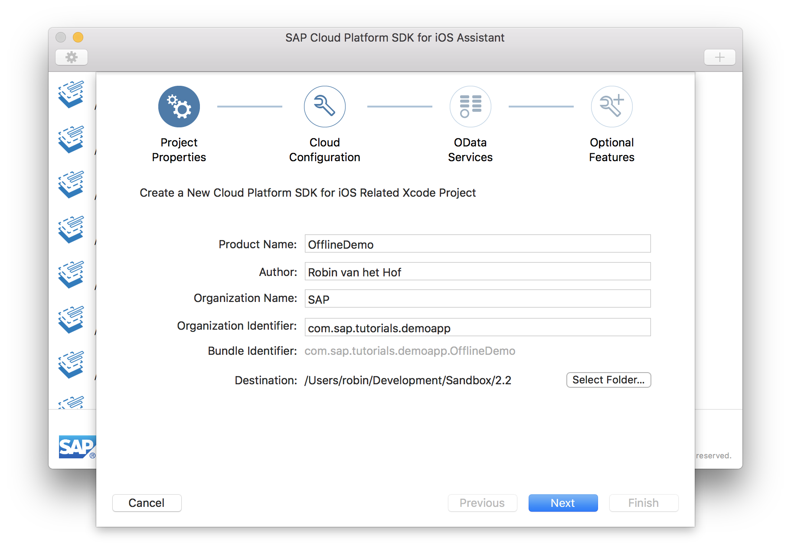

Click **Next** to advance to the **SAP Cloud Platform mobile service for development and operations Configuration** step.


[ACCORDION-END]


[ACCORDION-BEGIN [Step 3: ](SAP Cloud Platform mobile service for development and operations Configuration details)]

In the **SAP Cloud Platform mobile service for development and operations Configuration** page, select the **Create** tab button.

Enter the following details:

| Field | Value |
|----|----|
| Application Name | `OfflineDemo` |
| Application Identifier | `com.sap.tutorials.demoapp.OfflineDemo` |
| Authentication Type | `OAuth` |

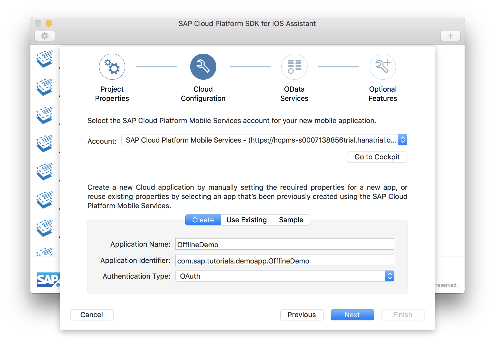

Click **Next** to advance to the **OData Services** step.


[ACCORDION-END]

[ACCORDION-BEGIN [Step 4: ](OData Services)]

In the **OData Services** page, you can define the back end connection. Here you will add the OData endpoint for the `Northwind` OData service.

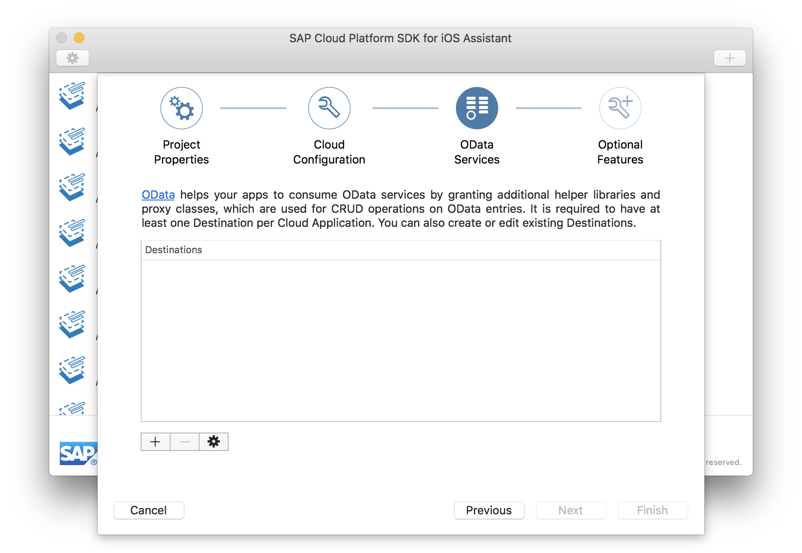

Click the **Plus** button, and from the context menu, select **New Destination...**. A dialog opens.

At the **General** tab, enter the following details:

| Field | Value |
|----|----|
| Destination name | `com.sap.tutorials.demoapp.OfflineDemo` |
| Backend URL | `http://services.odata.org/V2/OData/OData.svc/` |

Expand the **Advanced destination options** node, and set the following:

| Field | Value |
|----|----|
| Proxy Type | `Internet` |
| URL rewrite mode | `Rewrite URL` |
| Maximum connections | `Server default` |


At the **Authentication** tab, make sure **Authentication Type** is set to **No Authentication**.

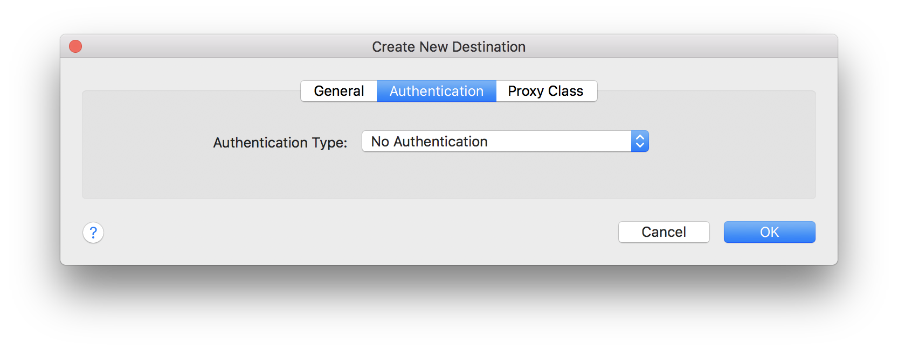

Click **OK** to save the backend configuration. It is now listed in the available destinations:

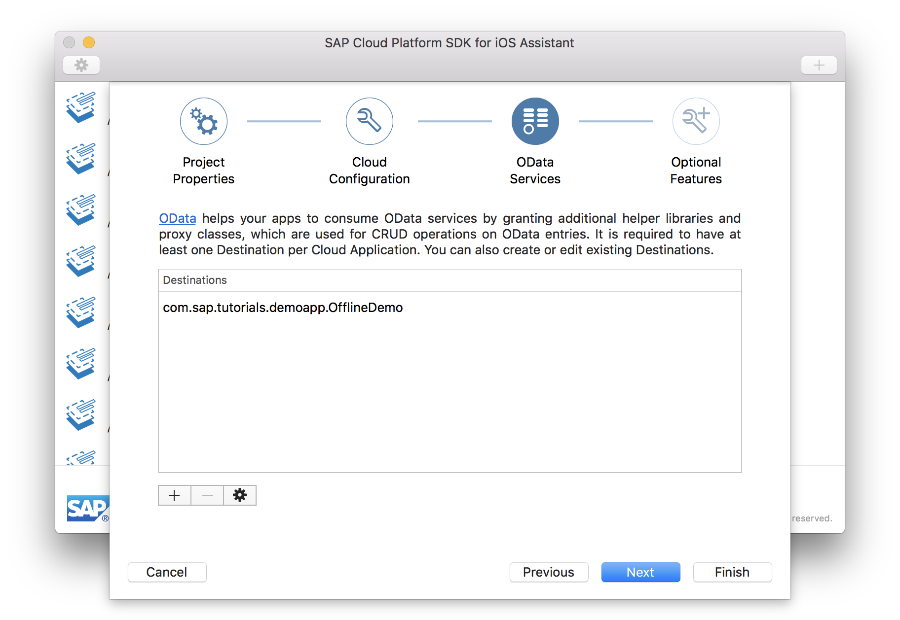

Click **Next** to advance to the **Optional Features** step.


[ACCORDION-END]

[ACCORDION-BEGIN [Step 5: ](Optional Features)]

In the **Optional Features** page, you have the option to generate a **Master-Detail Application**, enable **logging** and **log uploads**, enable **remote notifications**, use **Discovery Service** and whether to use **Online** or **Offline** OData.

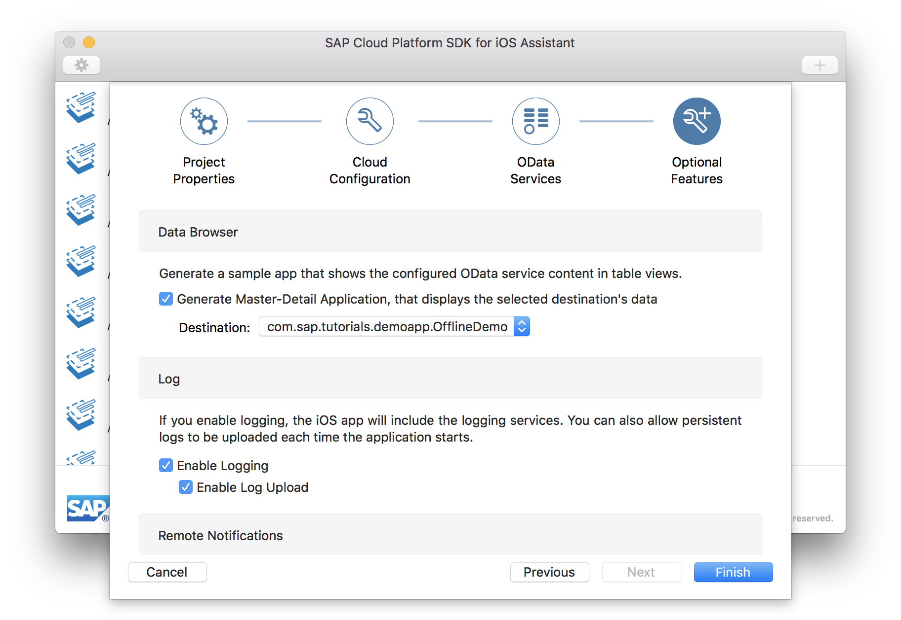

Make sure the checkboxes **Generate Master-Detail Application**, **Enable Logging**, **Enable Log Upload**, **Enable Remote Notification** and **Use Discovery Service** are selected, and the **OData Provider** radio button is set to **Use Offline OData** to complete the wizard:

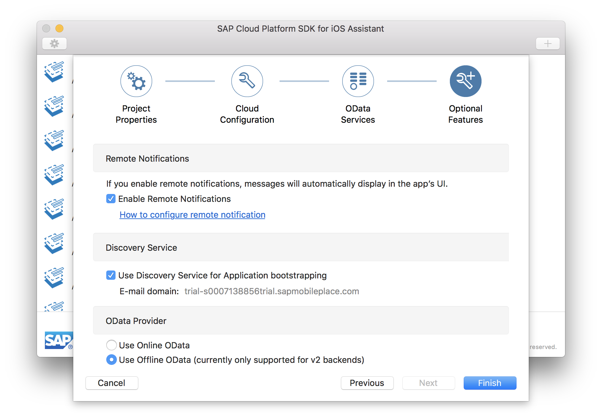

> Most likely the checkbox for **Remote Notifications** is disabled. This happens because no APNS endpoint is configured for the application definition in SAP Cloud Platform mobile service for development and operations. Once configured with a valid certificate, this option becomes available.


[ACCORDION-END]

[ACCORDION-BEGIN [Step 6: ](Generating the Xcode project)]

After you have clicked **Finish** in the previous step, the SDK Assistant now loads the OData service's metadata. This metadata describes the data model, and can be accessed via `<service URL>$metadata`. For your service, the metadata URL would be `http://services.odata.org/V2/OData/OData.svc/$metadata`
Based on this metadata, the OData proxy classes will be generated for the Xcode project.

In addition, the configuration settings you have provided in the SDK Assistant are now being sent to SAP Cloud Platform mobile service for development and operations.

> **NB:** If you have already 5 native applications defined in SAP Cloud Platform mobile service for development and operations, the SDK Assistant will give the following error:

> 

> In that case, log on to your **SAP Cloud Platform mobile service for development and operations** account at `https://hcpmsadmin-<your_user_id>trial.dispatcher.hanatrial.ondemand.com/` and navigate to **Mobile Applications > Native/Hybrid**. Select one of the available application configurations and delete in order for the SDK Assistant to add the new application configuration.


[ACCORDION-END]

[ACCORDION-BEGIN [Step 7: ](Examine the generated Xcode Project)]

After the SDK Assistant has finished, **Xcode** will launch and open the just generated `OfflineDemo` project.

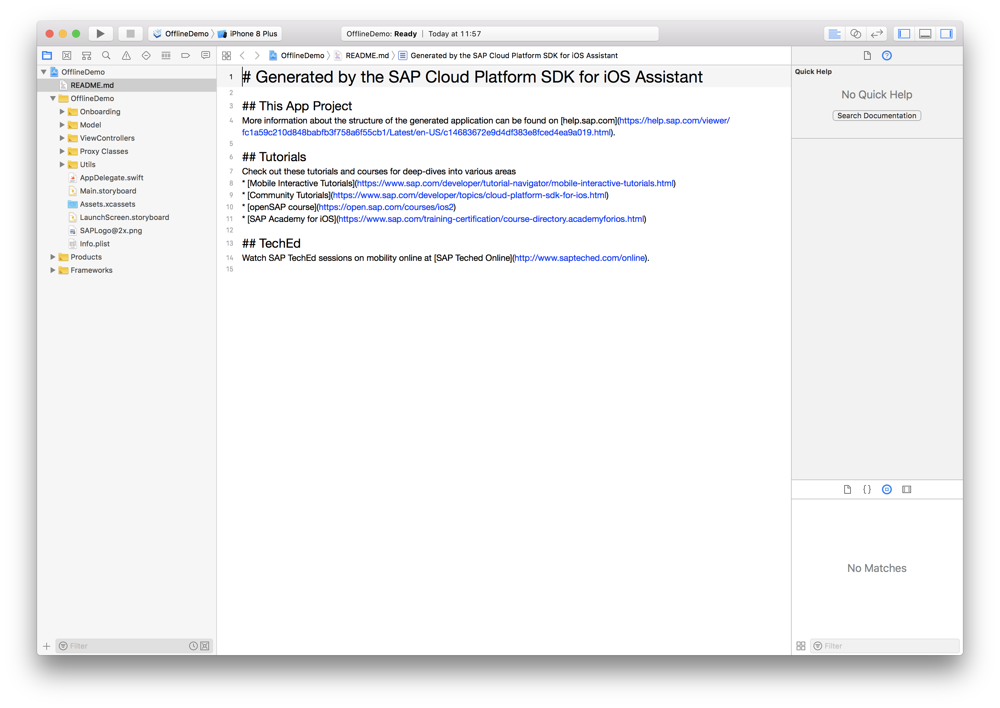

The `Main.storyboard` shows split-view setup for the generated Master-Detail views.

Folder `OfflineDemo/Onboarding` contains logic for the user on-boarding, authentication and handling of pass-codes and Touch ID.

Folder `OfflineDemo/Proxy Classes` contains the OData proxy classes generated from the OData service. File `DemoService.swift` acts as a data service provider to gain access to the OData entities. The four files `Address.swift`, `Category.swift`, `Product.swift` and `Supplier.swift` are classes for their respective OData entities. These classes give access to the various properties of the OData entities.

Folders `ViewControllers/Product`, `ViewControllers/Category` and `ViewControllers/Supplier` contain the master and detail view controllers as well as a storyboard for the `Product`, `Category` and `Supplier` entities, respectively.


[ACCORDION-END]

[ACCORDION-BEGIN [Step 8: ](Examine the specific Offline code)]

Since you have generated the application for use with Offline OData capabilities, lets examine the changes made by the assistant compared to an online application.

First, open file `AppDelegate.swift`. The first thing you'll notice is the OData service `DemoService` implements `OfflineODataProvider`. In addition, a flag `isOfflineStoreOpened` is added which indicates whether the offline store is open or closed:

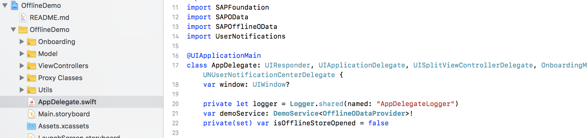

If you scroll down a bit to the `applicationDidEnterBackground(_:)` and `applicationWillEnterForeground(_:)` methods, you will see they call methods to close and open the Offline store, respectively.

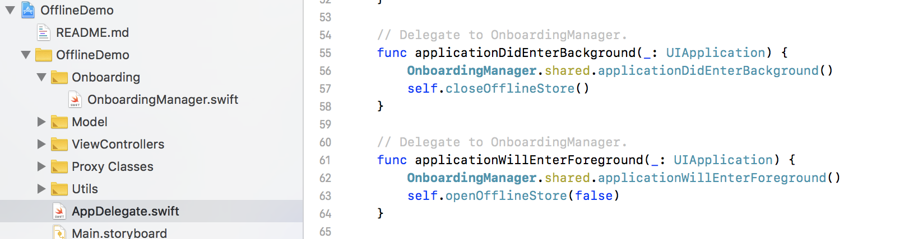

Just below those two methods is method `onboardingContextCreated(onboardingContext:onboarding:)` located:


This method is called via the on-boarding delegate in file `OfflineDemo/Onboarding/OnboardManager.swift`. During the on-boarding process, this method is called via the delegate  :

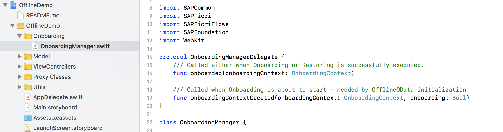

Navigate back to `AppDelegate.swift` and go back to method `onboardingContextCreated(onboardingContext:onboarding:)`. If you look at the implementation, you see it calls another method `configureOData(urlSession:serviceRoot:onboarding:)` which does the actual initializing of the Offline OData provider, and creates the defining queries for the OData entities:

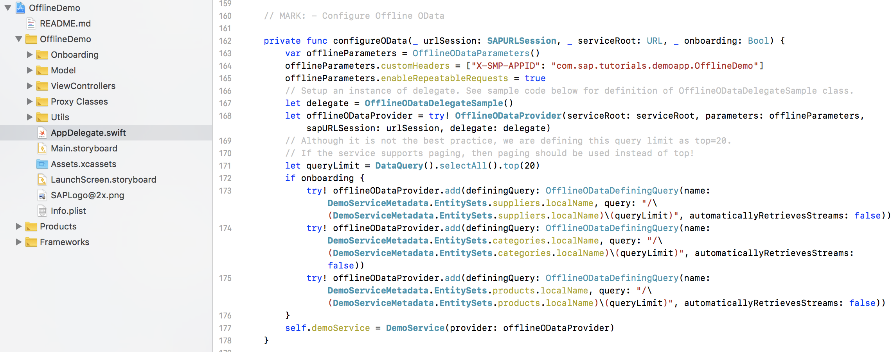

Just below this method are the implementing methods `openOfflineStore(sync:)` and `closeOfflineStore()` for opening and closing the store (which are being called from the foreground and background events mentioned earlier). Methods `downloadOfflineStore()` and `uploadOfflineStore()` handle the the store syncing when online.


[ACCORDION-END]

[ACCORDION-BEGIN [Step 9: ](Build and run the generated application)]

Click the **Run** button to build and run the generated application:


The **Simulator** app now launches. If you have configured the app to allow for push notifications, you will get the following pop-up:

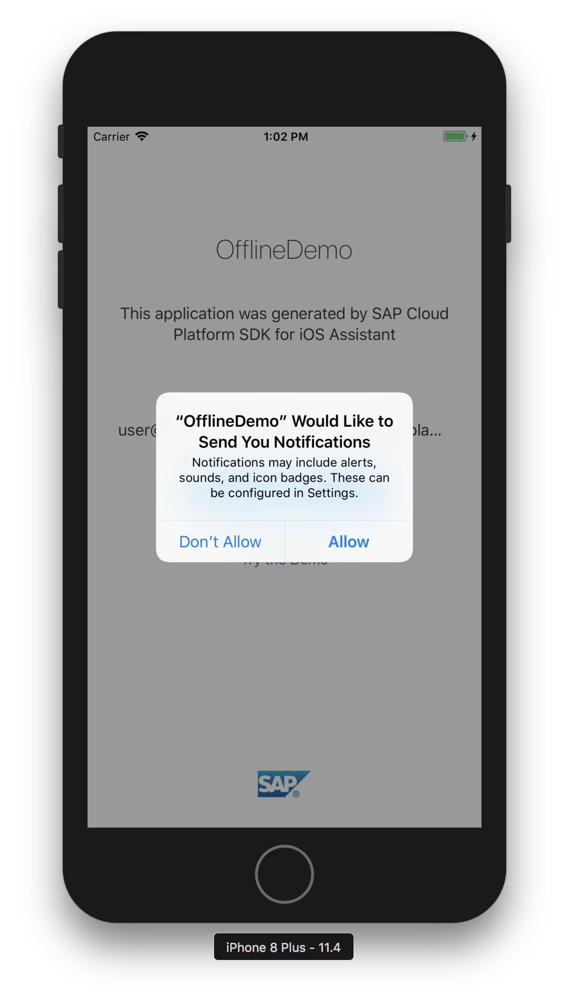

Press **Allow**. You now see the initial landing page:

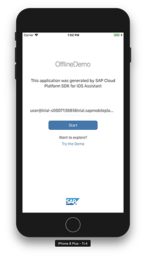

The application name is shown, with a little description. You have the option to show a demo version of the application (this should be implemented by hand, as this is not generated by the iOS Assistant) or run the actual, live application.

In this tutorial, you use the live application. Clicking the blue **Start** button to proceed.

The **OAuth** login screen of **SAP Cloud Platform mobile service for development and operations** is shown. Enter your login credentials for the SAP Cloud Platform and press the **Log On** button:

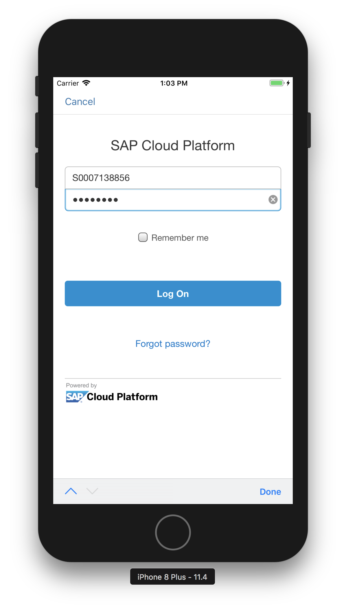

The app now displays the initial **Data Privacy** acknowledgement page. Click **Agree** to proceed.

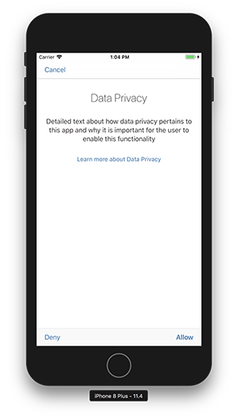

The app now proceeds with a 3-step wizard. First, you are presented the **Data Privacy** detail page. Click **Next** to proceed to the next step.


Next you are presented the **Security** detail page. Click **Next** to proceed to the next step.

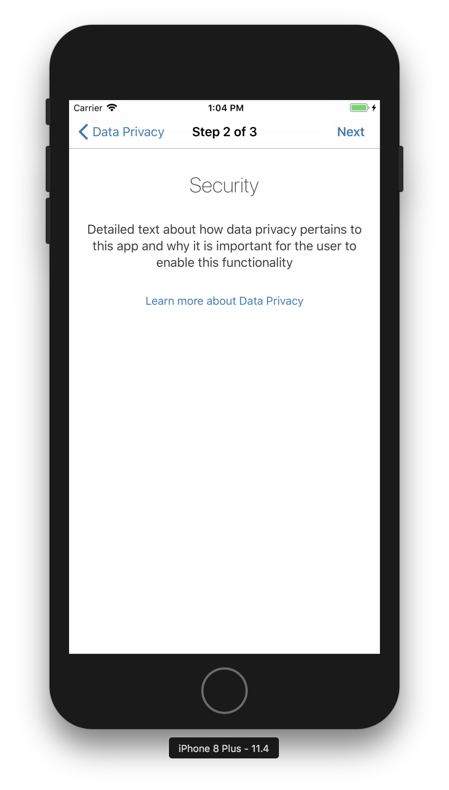

Lastly you are presented the **Consent** detail page. Click **Allow** to proceed.


When you have finished the on-boarding steps, the application starts. You will briefly see a message indicating the app is now opening the offline store:

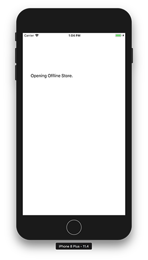

Once finished, it will present an overview of the available **Collections** of the OData service:

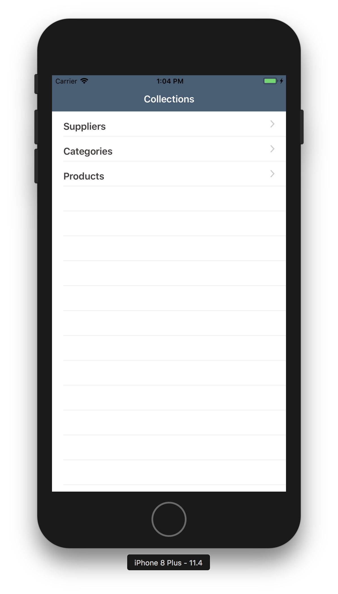


[ACCORDION-END]

[ACCORDION-BEGIN [Step 10: ](Examine the generated application)]

If you click on the `Suppliers` collection, you navigate to a **Master** list with all available `Supplier` entities:


If you click on one of the `Supplier` entities, you navigate to a **Detail** page which lists all the properties for the selected entity:

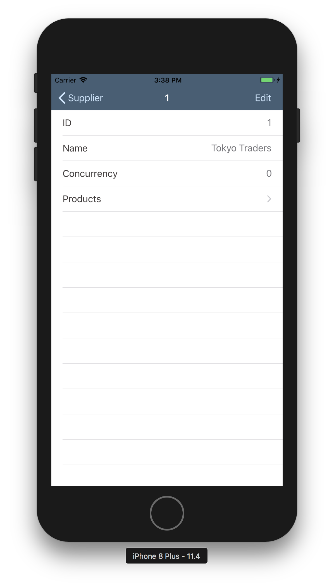

In the same manner, you can examine the other entity collections.

> **NOTE:** At the time of writing this tutorial, there is a bug which prevents an OData `Edm.Decimal` property to properly convert. If you try to open the `Products` entity collection, the app will crash because of this bug.

> However, the offline functionality of the app can be explained using the other two entity collections.

[ACCORDION-END]

[ACCORDION-BEGIN [Step 11: ](Use the app offline)]

Start the app again. You don't need to login again because of the OAuth authentication, and you will be greeted with this screen instead:

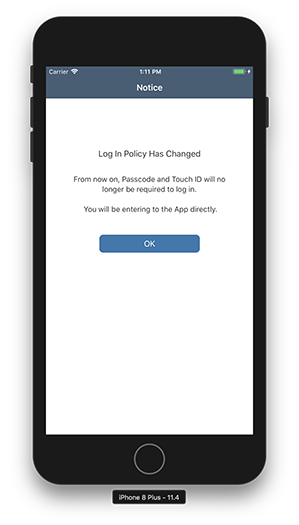

Click the **OK** button, and wait for the entity collection screen to show up.

Now, if you run the app from the simulator, disable your laptop's network. If you're running the app from a physical device, put it to **Airplane Mode**.

You should now have no network connection:


Click on the `Suppliers` item. Instead of fetching the data from the OData service, it now retrieves it from the downloaded Offline store:

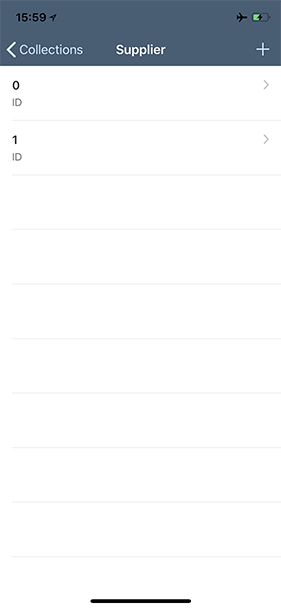

Clicking on an entry similarly doesn't retrieve the entity from the OData service, but gets it from the Offline store as well:

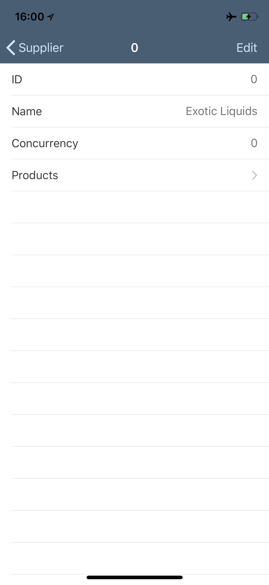


[ACCORDION-END]

[ACCORDION-BEGIN [Step 12: ](Enable app for Offline Onboarding)]

In the previous step, you could only switch to offline mode **after** you had logged in. This is because the Onboarding flow still validates the server connection, as well as downloads the configuration from SAP Cloud Platform mobile service for development and operations.

In order for the app to start truly offline, you need to make a few minor changes to the Onboarding flow.

Open file `OfflineDemo/Onboarding/OnboardingManager.swift` and locate method `configuredOAuth2AuthenticationStep()`.

Change the method signature so it now requires a boolean argument `needsServerValidation`:

```swift
private func configuredOAuth2AuthenticationStep(needsServerValidation: Bool) -> OAuth2AuthenticationStep {
```

In addition, set parameter `sendsValidationRequest` of the `OAuth2AuthenticationStep` instance to the value of method argument `needsServerValidation`:

```swift
oAuth2AuthenticationStep.sendsValidationRequest = needsServerValidation
```

The complete method should now resemble the following:

```swift
// OAuth2AuthenticationStep
private func configuredOAuth2AuthenticationStep(needsServerValidation: Bool) -> OAuth2AuthenticationStep {
    let presenter = FioriWKWebViewPresenter(webViewDelegate: self)
    let oAuth2AuthenticationStep = OAuth2AuthenticationStep(presenter: presenter)
    oAuth2AuthenticationStep.sendsValidationRequest = needsServerValidation
    return oAuth2AuthenticationStep
}
```

Two errors are now displayed, because the code calling the changed method does not supply the newly added argument.

First, locate the line with the error inside variable `onboardingSteps`.

Add an argument `true` to the erroneous line:

```swift
self.configuredOAuth2AuthenticationStep(needsServerValidation: true),
```

Then, locate the other error inside variable `restoringSteps`.

Add an argument `false` to the function call:

```swift
self.configuredOAuth2AuthenticationStep(needsServerValidation: false),
```

These changes ensure the initial onboarding still requires an online connection, but the restore steps do not.

Finally, in the restore step, comment out the settings download step. The variable `restoringSteps` should now look like this:

```swift
/// Steps executed during Restoring.
private var restoringSteps: [OnboardingStep] {
    return [
        self.configuredStoreManagerStep(),
        self.configuredWelcomeScreenStep(),
        CompositeStep(steps: SAPcpmsDefaultSteps.configuration),
        self.configuredOAuth2AuthenticationStep(needsServerValidation: false),
        // CompositeStep(steps: SAPcpmsDefaultSteps.settingsDownload),
        CompositeStep(steps: SAPcpmsDefaultSteps.applyDuringRestore),
    ]
}
```


[ACCORDION-END]

[ACCORDION-BEGIN [Step 13: ](Build and run the app again)]

Enable the network connection on your device or simulator, and build and run the app again. Once it's deployed, close the app so it is no longer running in the background.

Disable the network, and start the app from your device or simulator. The app should start just fine, and navigating the `Suppliers` and `Categories` should work as well.

The app is now fully offline enabled.


[ACCORDION-END]

[ACCORDION-BEGIN [Step 14: ](Examine Offline Requests)]

Using SAP Cloud Platform mobile service for development and operations cockpit, you can examine the offline OData requests.

Browse to `https://hcpmsadmin-<your_user_id>trial.dispatcher.hanatrial.ondemand.com` and navigate to **Analytics > Server Data Report**.

At the top, select **Application ID** `com.sap.tutorials.demoapp.OfflineDemo`.

From the filter, select **Offline Requests** for **Today** and examine the results:

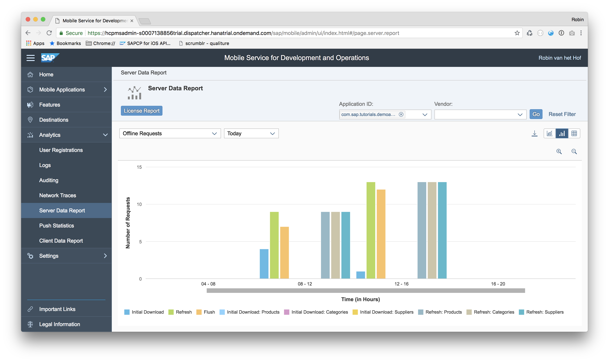

Similarly, select **Offline Response Time** from the filter and examine the results:

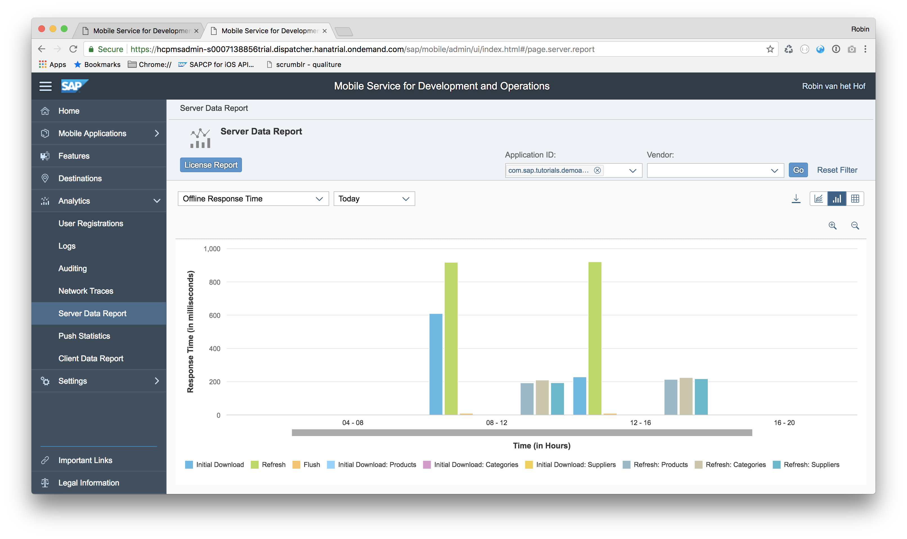

In these reports, you can see the number of upload, download and refresh requests and their respective response times for each entity in your OData service.

[ACCORDION-END]


---
