## Prerequisites  
 - **Proficiency:** Intermediate
 - **Development machine:** Access to a Mac computer
 - **Tutorials:** [Basic Authentication and Secure Key Store](https://www.sap.com/developer/tutorials/fiori-ios-hcpms-secure-keystore.html)


## Next Steps
- Select a tutorial from the [Tutorial Navigator](http://www.sap.com/developer/tutorial-navigator.html) or the [Tutorial Catalog](http://www.sap.com/developer/tutorials.html)

## Details
### You will learn  
In this tutorial, you will learn the differences in generating an application with the SDK Assistant when choosing SAML or OAuth based authentication. First, you'll create an application with SAML based authentication, an an explanation of the generated code will be given.

The second part involves creating the same application, but now with an OAuth 2 provider.

### Time to Complete
**30 Min**

---

Up till now, you have created an application which was configured to use **Basic Authentication**. In the previous tutorial, you implemented the SAP Cloud Platform for iOS SDK's secure key store to store the user credentials, so you don't need to fill them in each time you log in to the application.

However, regardless of whether you enter your user credentials each time or retrieve them from a secure store, authentication using Basic Authentication requires you to transmit your credentials with each login request. **SAML** and **OAuth 2** solve these problems in the following ways:

### SAML

Authentication is implemented over the Security Assertion Markup Language (SAML) 2.0 protocol, and delegated to SAP ID service or custom identity provider. The credentials users need to present depend on the identity provider's settings. The SAML authorization is performed using a **web view**.

### OAuth 2

Authentication is implemented over the OAuth 2.0 protocol. Users need to present an OAuth access token as credential. OAuth is based on granting access **without explicit credentials sharing**:

 - Avoids storing credentials at the third-party location
 - Limits the access permissions granted to third parties
 - Enables easy access right revocation without the need to change credentials

[ACCORDION-BEGIN [Step 1: ](Download OData service metadata file)]

Since the SDK Assistant only supports direct generation of Proxy Classes using Basic Authentication, you need to supply the assistant the OData service's `metadata.xml` file manually.

Open a browser window, and enter the location to your service metadata. This will be the service root URL, suffixed with `$metadata`.

> If you use the Sample OData service, you can access the metadata via `https://hcpmsadmin-<your_id>trial.dispatcher.hanatrial.ondemand.com/mobileservices/Admin/ESPM.svc/$metadata`

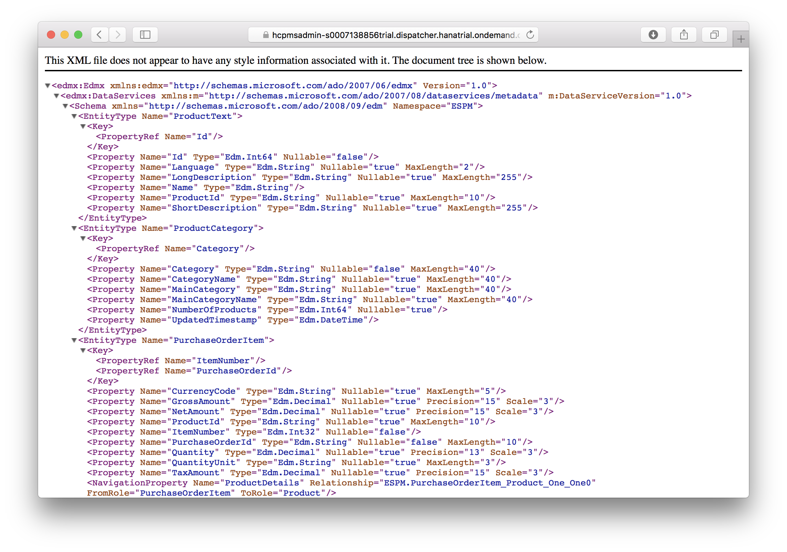

From the top menu, navigate to **File > Save as...**. In the dialog, enter the following details:

| Field | Value |
|----|----|
| Export As | `metadata.xml` |
| Location | Anywhere locally |
| Format | Page Source |

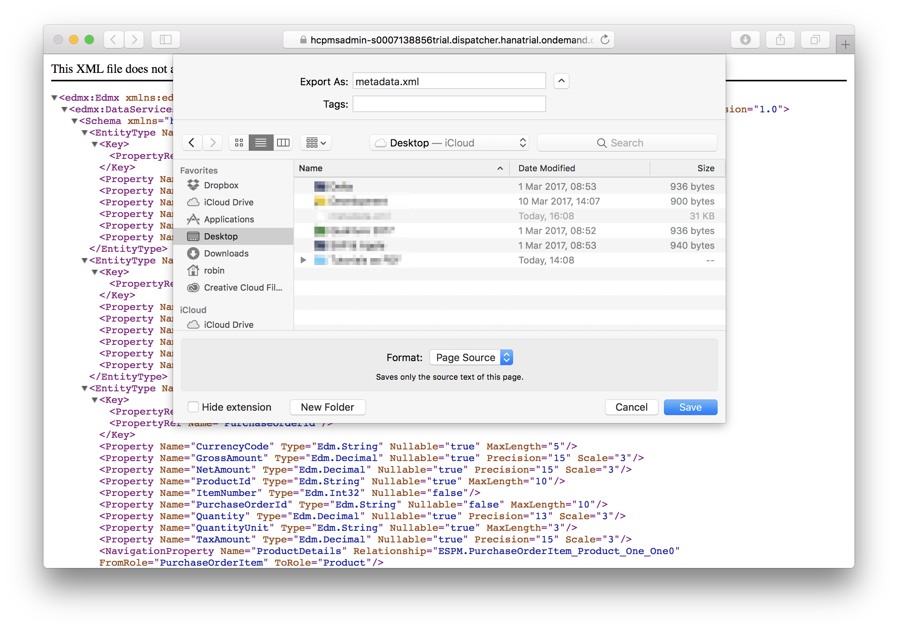

Click **Save** to store the metadata.

[DONE]
[ACCORDION-END]

[ACCORDION-BEGIN [Step 2: ](Switch to SAML-based authentication)]

Open a browser window to your SAP Cloud Platform mobile service for development and operations Admin cockpit, and navigate to **Applications**.

In the list of applications, in column **Actions** click the **cog-wheel icon** for your application and click **Configure** from the actions menu.

In the **Informations** tab, scroll to the bottom and set **Security Configuration** to **Form**:

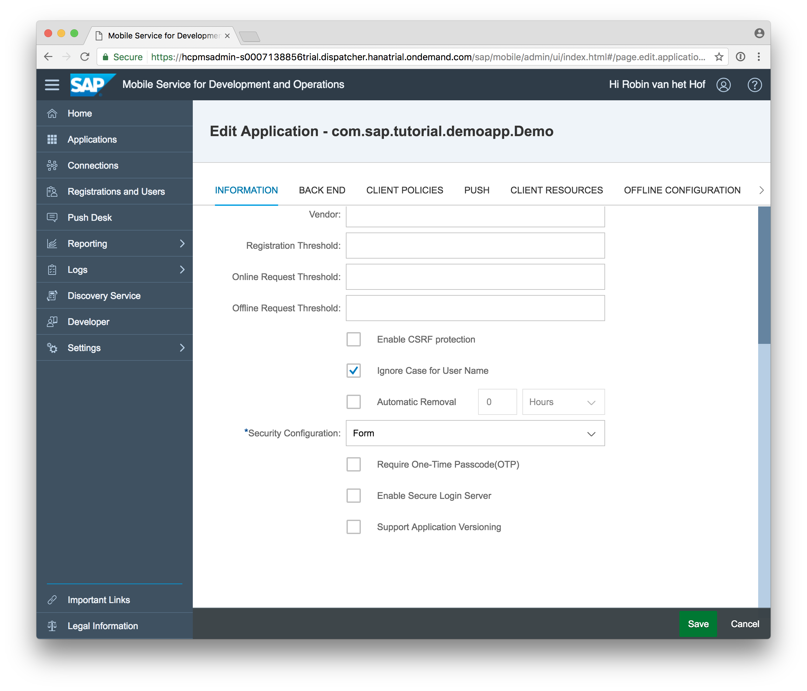

Click **Save** to store the configuration. The application is now configured to use SAML based web form authentication.

[DONE]
[ACCORDION-END]


[ACCORDION-BEGIN [Step 3: ](Generate application with SAML)]

Open the SDK Assistant, and follow the steps outlined in tutorial [Creating an app using the SDK Assistant](https://www.sap.com/developer/tutorials/fiori-ios-hcpms-sdk-assistant.html). Use the same settings and names (you may choose a different destination).

After you click **Finish**, you will get a dialog prompting **Unable to download metadata for connection: <your connection ID>. Please select the metadata from your file system.**

Locate the `metadata.xml` file you stored in **Step 1** and click **Open**.

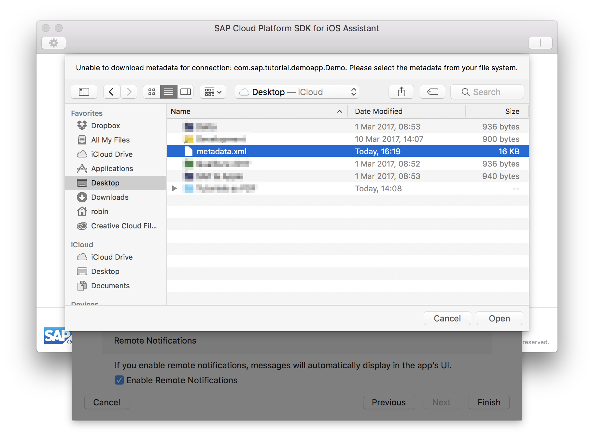

After a few seconds, the project is generated and Xcode will open.

[DONE]
[ACCORDION-END]

[ACCORDION-BEGIN [Step 4: ](Examine the SAML-based application)]

Open the project's `Main.storyboard`. It should now contain a `SAMLAuthViewController`:

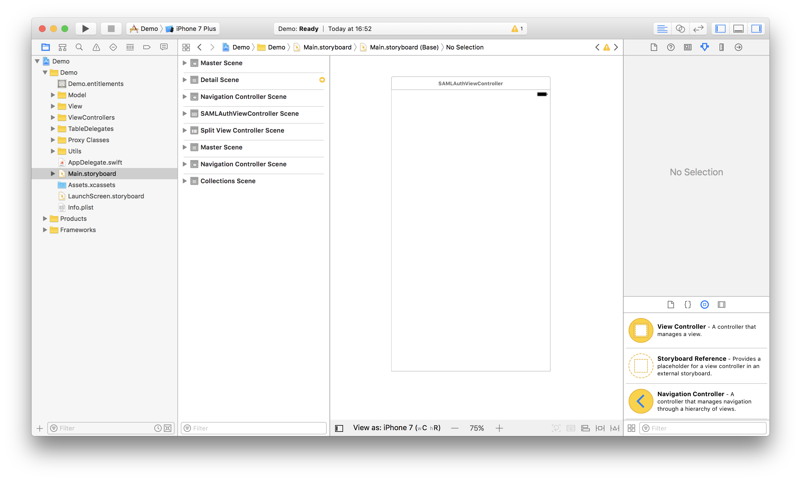

Locate the file `AppDelegate.swift`, and the method `func applicationDidFinishLaunching(_ application: UIApplication)`.

Inside this method, locate the part with the comment `// Show the actual authentication' view controller`, and specifically the following line:

```swift
let logonViewController = (storyboard?.instantiateViewController(withIdentifier: "SamlAuth"))! as! SAMLAuthViewController
```

This is the part that where the `logonViewController` is instantiated as `SAMLAuthViewController`.

In the **Project Navigator**, navigate to `Demo > ViewControllers > SAMLAuthViewController.swift` and examine its content.

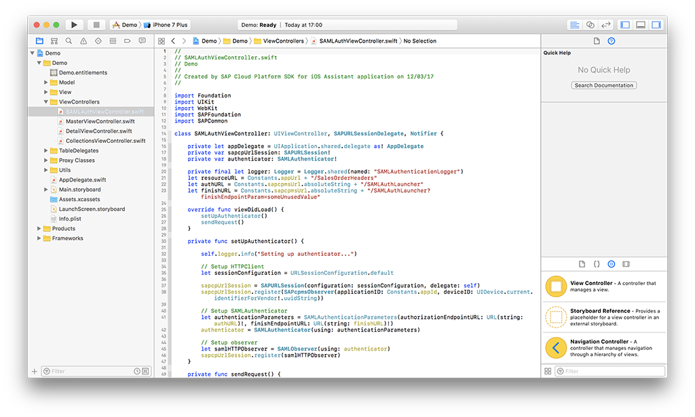

First, have a look at overridden method `viewDidLoad()`:

```swift
override func viewDidLoad() {
    setUpAuthenticator()
    sendRequest()
}
```

Via method `setUpAuthenticator()`, it first sets up an `SAPURLSession` HTTP client and registers a `SAPcpmsObserver` to it. Then it assigns the SDK's `SAMLAuthenticator` and registers the `SAMLObserver` to the `SAPURLSession`.

Via method `sendRequest()` it then challenges the request to a resource URL. If a response is received containing data, authentication has been successful and normal storyboard navigation continues.

[DONE]
[ACCORDION-END]

[ACCORDION-BEGIN [Step 5: ](Build and run the SAML-based application)]

Build and run the application. Upon first run, you will notice a new login screen:

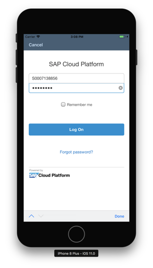

This is SAP Cloud Platform's SAML web form, presented in the native application using a `UIWebView` component.

Enter your SAP Cloud Platform user credentials, tick the **Remember me** checkbox, and click **Log On**. After you have been authenticated, you will see the available collections of your OData service.

If you now press the **Home button**, the application is sent to the background. **Double-press** the **Home button** and close the **Demo** application.

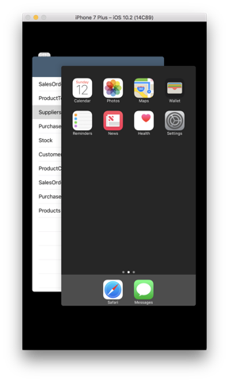

From the **Home screen**, tap the **Demo** application icon. Notice how you will briefly see a successful authentication message, and instantly the Collections view is shown. You don't need to authenticate again since you ticked the **Remember me** checkbox.

[DONE]
[ACCORDION-END]

[ACCORDION-BEGIN [Step 6: ](Switch to OAuth-based authentication)]

Open a browser window to your SAP Cloud Platform mobile service for development and operations Admin cockpit, and navigate to **Applications**.

In the list of applications, in column **Actions** click the **cog-wheel icon** for your application and click **Configure** from the actions menu.

In the **Informations** tab, scroll to the bottom and set **Security Configuration** to **OAuth**:

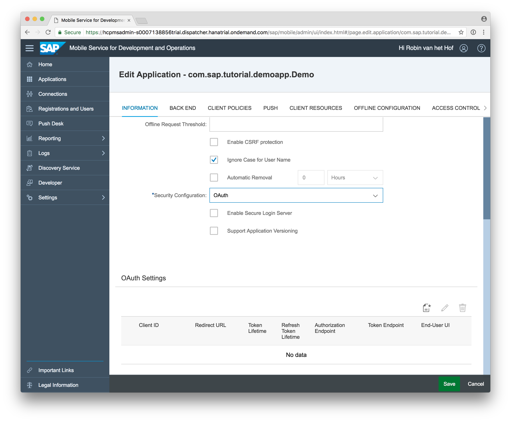

Click **Save** to store the configuration. The application is now configured to use OAuth 2 based authentication.

[DONE]
[ACCORDION-END]

[ACCORDION-BEGIN [Step 7: ](Edit OAuth settings)]

Now you have switched to OAuth 2 based authentication, a new panel **OAuth Settings** has been added. Click the **Add** button, and the **Add OAuth Settings** dialog opens.

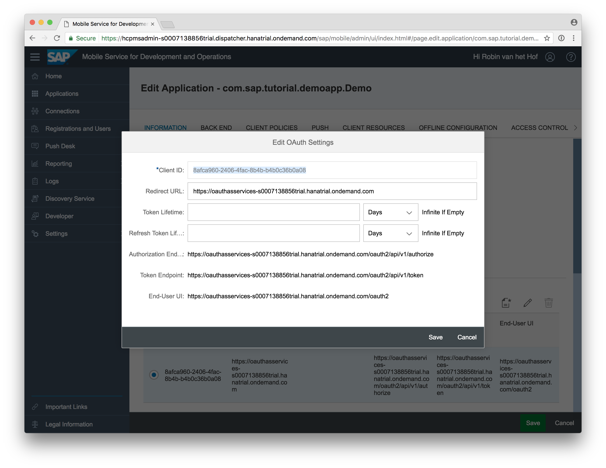

Add the **Redirect URL**:

`https://oauthasservices-<acccount_id>trial.hanatrial.ondemand.com`

Copy the value of the **Client ID**, and click **Save** to store the OAuth settings.

[DONE]
[ACCORDION-END]

[ACCORDION-BEGIN [Step 8: ](Generate application with SAML)]

Open the SDK Assistant, and create a **new application**. Use the same settings and names (you may choose a different destination).

> The reason you need to create a new application is the SDK Assistant generates an Xcode project based on the settings and authentication scheme defined in SAP Cloud Platform mobile service for development and operations. The application generated in **Step 3** has code for SAML based authentication. In this step, the SDK Assistant will generate code for **OAuth authentication**.

After you click **Finish**, you will get a dialog prompting **Unable to download metadata for connection: <your connection ID>. Please select the metadata from your file system.**

Locate the `metadata.xml` file you stored in **Step 1** and click **Open**.


After a few seconds, the project is generated and Xcode will open.

[ACCORDION-BEGIN [Step 9: ](Add Client ID to Constants.swift)]

In Xcode, open the file `Constants.swift`. Locate the constant `clientId` in structure `Constants`. By default, it is assigned the value `0`.

Replace it with the copied Client ID in **Step 7**.

In addition, change constant `redirectURL` to `endUserUi.absoluteString`.

```swift
struct Constants {

    static let appId = "com.sap.tutorial.demoapp.Demo"
    private static let sapcpmsUrlString = "https://hcpms-s0007138856trial.hanatrial.ondemand.com"
    static let sapcpmsUrl = URL(string: sapcpmsUrlString)!
    static let appUrl = Constants.sapcpmsUrl.appendingPathComponent(appId).absoluteString
    static let authURL = "https://oauthasservices-s0007138856trial.hanatrial.ondemand.com/oauth2/api/v1/authorize"
    static let endUserUi = URL(string: "https://oauthasservices-s0007138856trial.hanatrial.ondemand.com/oauth2")!
    static let tokenURL = "https://oauthasservices-s0007138856trial.hanatrial.ondemand.com/oauth2/api/v1/token"
    // replace with your own Client ID
    static let clientID = "8afca960-2406-4fac-8b4b-b4b0c36b0a08"
    static let resourceURL = appUrl + "/SalesOrderHeaders"
    // change 'redirectURL' to string of 'endUserUi':
    static let redirectURL = endUserUi.absoluteString
}

```

[DONE]
[ACCORDION-END]

[ACCORDION-BEGIN [Step 10: ](Build and run the OAuth-based application)]

Build and run the application. Upon first run, you will notice the login screen is similar to the SAML based login screen:


Enter your SAP Cloud Platform user credentials, tick the **Remember me** checkbox, and click **Log On**.

You will now see a screen where SAP Cloud Platform mobile service for development and operations asks you to authorize the app for authentication using the platform.

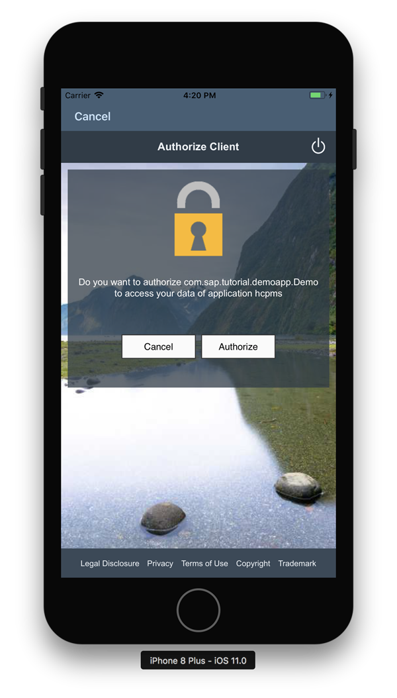

Click the **Authorize** button. After you have been authenticated, you will see the available collections of your OData service.

[DONE]
[ACCORDION-END]

[ACCORDION-BEGIN [Step 11: ](Examine authorized application and issued token)]

Open a browser window and navigate to the **End-User UI URL**:

`https://oauthasservices-<acccount_id>trial.hanatrial.ondemand.com/oauth2/`

You should now see the authorized client application for `hcpms`, as well as the date the token was issued (and when it will be invalidated , if applicable)

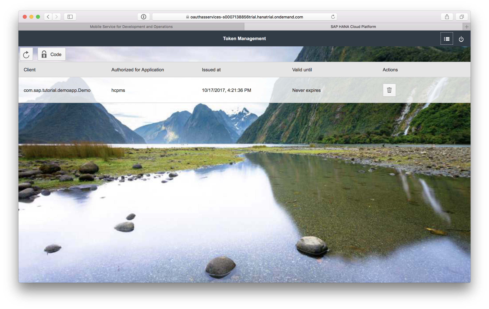

[DONE]
[ACCORDION-END]


## Next Steps
- Select a tutorial from the [Tutorial Navigator](http://www.sap.com/developer/tutorial-navigator.html) or the [Tutorial Catalog](http://www.sap.com/developer/tutorials.html)
