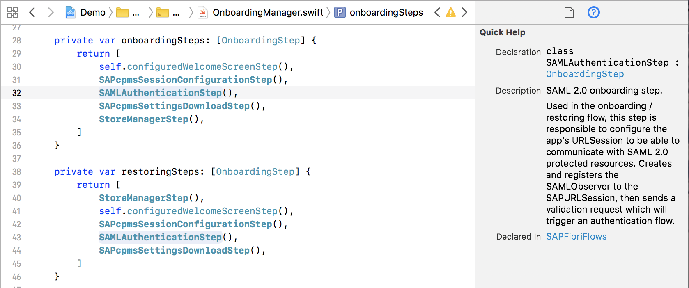
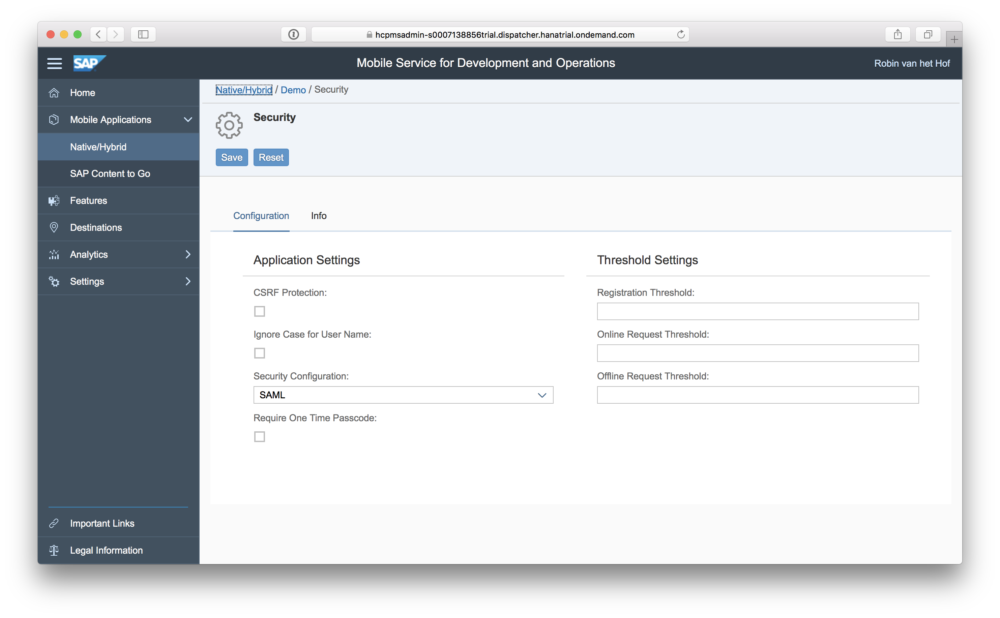
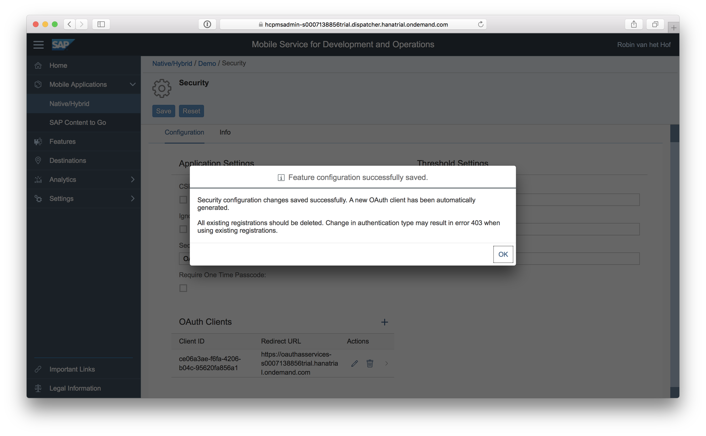
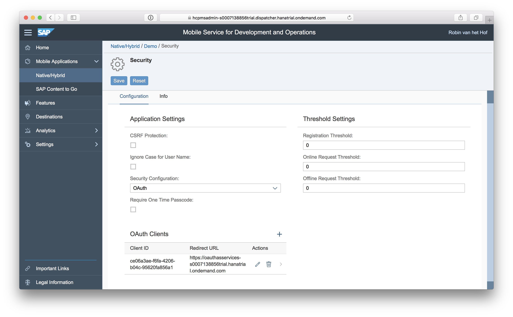

## Prerequisites  
 - **Proficiency:** Intermediate
 - **Development environment:** Apple iMac, MacBook or MacBook Pro running Xcode 9 or higher
 - **SAP Cloud Platform SDK for iOS:** Version 2.0
 - **Tutorials:** [Offline OData - Error handling](https://www.sap.com/developer/tutorials/fiori-ios-hcpms-offline-odata-errorhandling.html)


## Next Steps
- [Read SAP Mobile Secure configuration data](https://www.sap.com/developer/tutorials/fiori-ios-scpms-configprovider.html)

## Details
### You will learn  
In this tutorial, you will learn the differences in generating an application with the SDK Assistant when choosing SAML or OAuth based authentication. First, you'll examine the current application with the default SAML based authentication, and an explanation of the generated code will be given.

Then you will recreate the same application, but now with an OAuth 2 provider.

### Time to Complete
**30 Min**

---

Up till now, you have created an application which was configured to use **SAML**. First you will examine the SAML specific code been generated by the SDK Assistant. Then you will change the application definition to use OAuth, and generate a new application based on the changed configuration.

### SAML

Authentication is implemented over the Security Assertion Markup Language (SAML) 2.0 protocol, and delegated to SAP ID service or custom identity provider. The credentials users need to present depend on the identity provider's settings. The SAML authorization is performed using a **web view**.

### OAuth 2

Authentication is implemented over the OAuth 2.0 protocol. Users need to present an OAuth access token as credential. OAuth is based on granting access **without explicit credentials sharing**:

 - Avoids storing credentials at the third-party location
 - Limits the access permissions granted to third parties
 - Enables easy access right revocation without the need to change credentials

[ACCORDION-BEGIN [Step 1: ](Examine the SAML-based application)]

Open the project's `OnboardingManager.swift` file in `Demo/Onboarding`:


Locate method `func applicationDidFinishLaunching(_ application: UIApplication)`.

Inside this method, you'll notice one of the steps is the `SAMLAuthenticationStep()`:

```swift
private var onboardingSteps: [OnboardingStep] {
    return [
        self.configuredWelcomeScreenStep(),
        SAPcpmsSessionConfigurationStep(),
        SAMLAuthenticationStep(),
        SAPcpmsSettingsDownloadStep(),
        StoreManagerStep(),
    ]
}
```

If you click on that function call, examine the **Quick Help** to the right:



As you see, this functionality is part of the `SAPFioriFlows` framework, and is responsible for validating the user authentication flow.

When you would run the application, you would be presented the application SAML login screen:


This is SAP Cloud Platform's SAML web form, presented in the native application using a `UIWebView` component.

[DONE]
[ACCORDION-END]

[ACCORDION-BEGIN [Step 2: ](Switch to OAuth-based authentication)]

Open a browser window to your SAP Cloud Platform mobile service for development and operations Admin cockpit, and navigate to **Mobile Applications > Native/Hybrid**.

In the list of applications, select **Demo**.

From the **Assigned Features** panel, select **Security**. The security page now opens:



In the **Configuration** tab, set **Security Configuration** to **OAuth**:


A new panel **OAuth Clients** has been added, with an empty configuration. This will be remedied shortly.

Click **Save** to store the configuration. You'll receive the following message:



This is a reminder to delete any existing user registrations. Because the previous app was generated with SAML authentication, this would not work anymore with the newly generated app using OAuth authentication.

Click **OK**. The application is now configured to use OAuth 2 based authentication, and the **OAuth Clients** panel is now configured as well:



[DONE]
[ACCORDION-END]

[ACCORDION-BEGIN [Step 3: ](Generate application with OAuth)]

Open the SDK Assistant, and create a **new application**. Use the same settings and names (you may choose a different destination).

> The reason you need to create a new application is the SDK Assistant generates an Xcode project based on the settings and authentication scheme defined in SAP Cloud Platform mobile service for development and operations. The application generated in the previous tutorials has code for SAML based authentication. In this step, the SDK Assistant will generate code for **OAuth authentication**.

After a few seconds, the project is generated and Xcode will open.

[DONE]
[ACCORDION-END]

[ACCORDION-BEGIN [Step 4: ](Build and run the OAuth-based application)]

Build and run the application. Upon first run, you will notice the login screen is similar to the SAML based login screen:


Enter your SAP Cloud Platform user credentials, tick the **Remember me** checkbox, and click **Log On**.

You will now see a screen where SAP Cloud Platform mobile service for development and operations asks you to authorize the app for authentication using the platform.


Click the **Authorize** button. After you have been authenticated, the on-boarding steps proceed as expected. Provide the details for Touch ID and passcode, and you will see the available collections of your OData service

[DONE]
[ACCORDION-END]

[ACCORDION-BEGIN [Step 5: ](Examine authorized application and issued token)]

Open a browser window and navigate to the **End-User UI URL**:

`https://oauthasservices-<acccount_id>trial.hanatrial.ondemand.com/oauth2/`

You should now see the authorized client application for `hcpms`, as well as the date the token was issued (and when it will be invalidated , if applicable)


[VALIDATE_5]
[ACCORDION-END]


