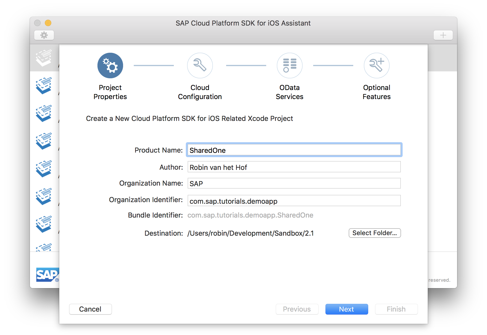
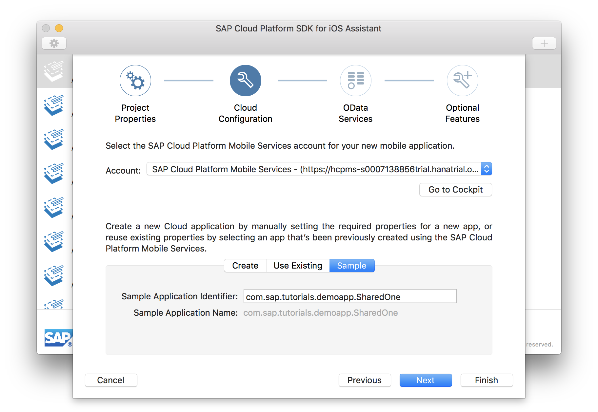
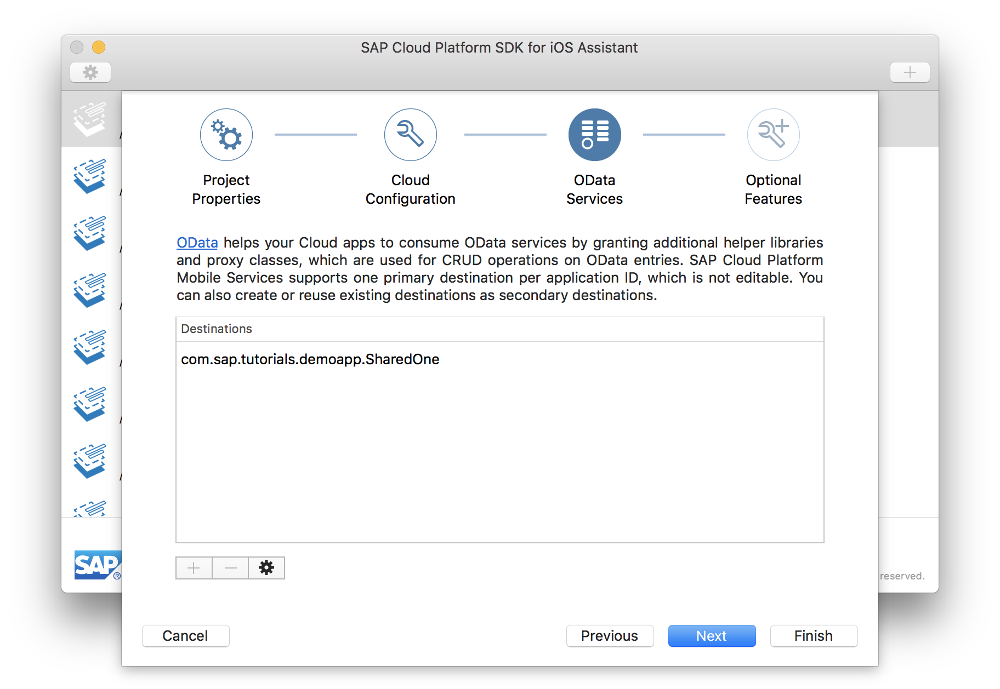
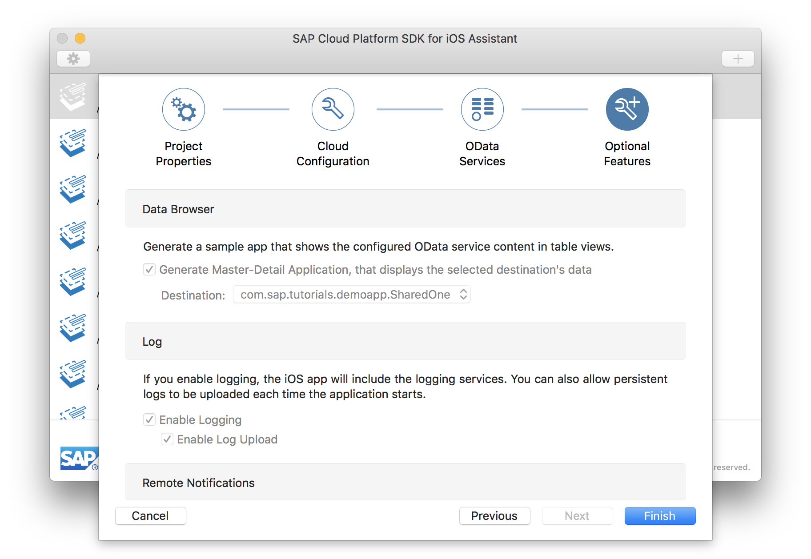
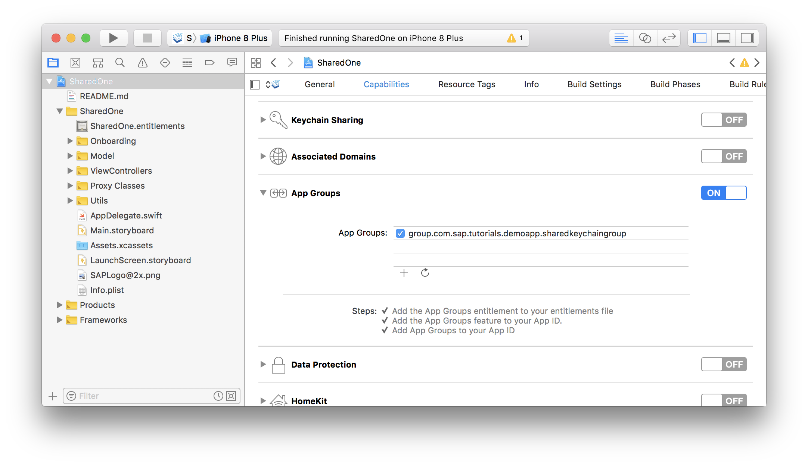
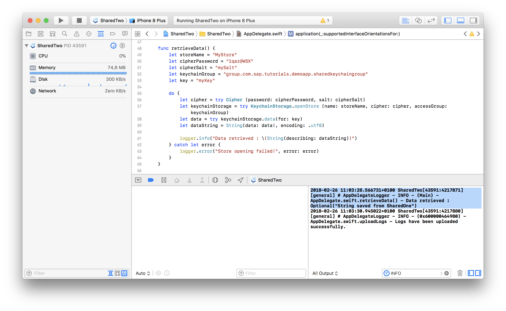

## Prerequisites  
- **Proficiency:** Beginner
- **Development environment:** Apple iMac, MacBook or MacBook Pro running Xcode 9 or higher
- **SAP Cloud Platform SDK for iOS:** Version 2.1
- **Tutorials:** [Sign up for a free trial account on SAP Cloud Platform](https://www.sap.com/developer/tutorials/hcp-create-trial-account.html) and [Enable SAP Cloud Platform mobile service for development and operations](https://www.sap.com/developer/tutorials/fiori-ios-hcpms-setup.html)

## Details
### You will learn  
As of version 2.1, the SAP Cloud Platform SDK for iOS now incorporates the possibility to provide a shared logon experience for multiple applications. In addition, data can be shared between applications using the SDK's `KeychainStoreManager`.

In this tutorial, you will create two applications. The first app will be used to store data from the secure store, and the second app will retrieve the data stored by the first app. In addition, you will also experience the shared logon mechanism.

> Please note the apps created in this tutorial are meant show the basic principles of setting up a shared store between multiple apps. In productive code, you normally should not hard-code the cipher and password in the `AppDelegate.swift` file, but use a more secure way of handling these. However, for the brevity of the tutorial and easier understanding of what is happening, this choice was made.


> Also, if you are working on the trial instance of SAP Cloud Platform, make sure you have a maximum of 3 application definitions defined in SAP Cloud Platform mobile service for development and operations. Since the trial allows a maximum of 5 native mobile applications, you should have a maximum of 3 application definitions defined. If you have 4 or more applications defined, log on to your SAP Cloud Platform mobile service for development and operations cockpit first, and export & delete any unused applications.

### Time to Complete
**15 Min**

---

[ACCORDION-BEGIN [Step 1: ](Create 'SharedOne' Xcode project with SDK Assistant)]

On your local machine, navigate to your `./<SAP Cloud Platform SDK for iOS>` folder. Double-click the **SAP Cloud Platform SDK for iOS Assistant** icon to start the application.

Click the **Plus** button on the top-right of the SDK Assistant. The first page of the Xcode Project generation wizard lets you define the Project Properties.

Enter the following details:

| Field | Value |
|----|----|
| Product Name | `SharedOne` |
| Author | `<your name>` |
| Organization Name | `<your company name>` |
| Organization Identifier | `com.sap.tutorials.demoapp` |
| Destination | `<choose a local destination>` |



Click **Next** to advance to the **SAP Cloud Platform mobile service for development and operations Configuration** step.

In the **SAP Cloud Platform mobile service for development and operations Configuration** page, select the **Sample** tab button.



The Sample Application Identifier and Sample Application Name are now pre-filled with the Bundle Identifier value from the previous page.

Click **Next** to advance to the **OData Services** step.

In the **OData Services** page, the Sample OData service connection you have specified in the previous wizard step is displayed:



Click **Next** to advance to the **Optional Features** step.

In the **Optional Features** page, you have the option to generate a **Master-Detail Application**, enable **logging** and **log uploads**, and enable **remote notifications**. Since you're using the Sample OData service, all settings are enabled but greyed out.



After you have clicked **Finish** in the previous step, the SDK Assistant now loads the OData service's metadata. This metadata describes the data model, and can be accessed via `<service URL>$metadata`. For your service, the metadata URL would be `https://hcpms-<your account>trial.hanatrial.ondemand.com/SampleServices/ESPM.svc/$metadata`

After the SDK Assistant has finished, **Xcode** will launch and open the just generated `SharedOne` project.

[ACCORDION-END]

[ACCORDION-BEGIN [Step 2: ](Enable App Groups entitlement)]

In Xcode, open the `SharedOne` project settings, and switch to the **Capabilities** tab. Scroll down to the **App Groups** capability, and set the switch next to it to **On**.

Click the **Plus** button below it, and provide the following **App Group** ID:

| Field | Value |
|----|----|
| App Group ID | `group.com.sap.tutorials.demoapp.sharedkeychaingroup` |



[ACCORDION-END]


[ACCORDION-BEGIN [Step 3: ](Modify Onboarding flow)]

Open file `SharedOne > Onboarding > OnboardingManager.swift` and locate method `configuredStoreManagerStep()`

Replace the following line:

```swift
let step = StoreManagerStep()
```

with this:

```swift
let keychainGroupName: String = "group.com.sap.tutorials.demoapp.sharedkeychaingroup"
let uuid:UUID = UUID(uuidString: "ec429dd6-3fd1-4556-b600-bac39ee9f6e7")!

let storeManager = KeychainStoreManager(keychainAccessGroup: keychainGroupName)

let step = StoreManagerStep(persistentStoreManager: storeManager)
step.runRestoreIfStoreExists = true
step.storeID = uuid
```

With this code, the following is happening:

 1. The `keychainGroupName` variable contains the value specified in the project's App Groups entitlement. Along with the `uuid`, these are used to support the shared key store between applications.
 2. The `KeychainStoreManager` is then initialized with the specified `keychainGroupName` and stored in constant `storeManager`.
 3. The `StoreManagerStep` is then initialized with the `storeManager` as the persistent store manager.
 4. When using a shared store, you don't want an error thrown when a store is created which is already been created by a different app. To bypass this behavior of the step, flag `runRestoreIfStoreExists` should be set to true.
 5. In order to share the same store ID, the step's `storeID` is set to a hard-coded `uuid` value.


[ACCORDION-END]

[ACCORDION-BEGIN [Step 4: ](Create 'SharedTwo' Xcode project with SDK Assistant)]

Repeat steps 1-3, but now, everywhere it says `SharedOne`, enter or use `SharedTwo` instead.

[ACCORDION-END]

[ACCORDION-BEGIN [Step 5: ](Store data in 'SharedOne' app)]

Open the Xcode project for the first app `SharedOne`, and open `AppDelegate.swift` file.

Add the following method:

```swift
func storeData() {
    let storeName      = "MyStore"
    let cipherPassword = "1qaz@WSX"
    let cipherSalt     = "mySalt"
    let keychainGroup  = "group.com.sap.tutorials.demoapp.sharedkeychaingroup"
    let key            = "myKey"

    let data = "String saved from SharedOne".data(using: .utf8)

    do {
        let cipher = try Cipher (password: cipherPassword, salt: cipherSalt)
        let keychainStorage = try KeychainStorage.openStore (name: storeName, cipher: cipher, accessGroup: keychainGroup)
        try keychainStorage.put (data: data!, for: key)
    } catch let error {
        self.logger.error("Store opening failed!", error: error)
    }

}
```

This method opens a store with the provided name and cipher for the predefined `keychainGroupName`, and stores a `Data` object `data` (which holds a simple string encoded using UTF-8) with key `myKey`.

Next, locate method `application(_:didFinishLaunchingWithOptions:)` and just above the bottom return statement, add:

```swift
storeData()
```

[ACCORDION-END]

[ACCORDION-BEGIN [Step 6: ](Run 'SharedOne' app)]

If you now build and run the app `SharedOne`, after you have logged in and accepted the EULA, the app should run with the Collections view displaying the available OData entities, just like it normally would. However, since method `storeData()` has been called, an entry with key `myKey` is now added to the shared store.

[ACCORDION-END]

[ACCORDION-BEGIN [Step 7: ](Read data in 'SharedTwo' app)]

Switch to the Xcode project for the second app `SharedTwo`, and open `AppDelegate.swift` file.

Add the following method:

```swift
func retrieveData() {
    let storeName      = "MyStore"
    let cipherPassword = "1qaz@WSX"
    let cipherSalt     = "mySalt"
    let keychainGroup  = "group.com.sap.tutorials.demoapp.sharedkeychaingroup"
    let key            = "myKey"

    do {
        let cipher = try Cipher (password: cipherPassword, salt: cipherSalt)
        let keychainStorage = try KeychainStorage.openStore (name: storeName, cipher: cipher, accessGroup: keychainGroup)

        let data = try keychainStorage.data(for: key)
        let dataString = String(data: data!, encoding: .utf8)

        logger.info("Data retrieved : \(String(describing: dataString))")
    } catch let error {
        logger.error("Store opening failed!", error: error)
    }

}
```

Similar to the code used in the first app `SharedOne`, this method opens a store with the provided name and cipher for the predefined `keychainGroupName`. But in this case, it now loads a `Data` object `data` for key `myKey` (which is then decoded using UTF-8 into constant `dataString`).

The decoded content is then printed to the console using the logger.

Next, locate method `application(_:didFinishLaunchingWithOptions:)` and at the top of that method, add:

```swift
logger.logLevel = .info
```

This ensures the info logging of method `retrieveData()` will be printed to the console.

Finally, just above the bottom return statement, add:

```swift
retrieveData()
```

[ACCORDION-END]

[ACCORDION-BEGIN [Step 8: ](Run 'SharedTwo' app)]

If you now build and run the app `SharedTwo`, after you have logged in and accepted the EULA, the app should run with the Collections view displaying the available OData entities, just like it normally would. However, since method `retrieveData()` has been called, the entry with key `myKey` which was stored from `SharedOne` is now retrieved to the shared store and its content printed to the console:



[ACCORDION-END]

[ACCORDION-BEGIN [Step 9: ](Test the shared logon experience)]

Now close both running apps, and open one of them again. You now notice you don't need to logon to both apps anymore, since the credentials are stored in the shared key store.

[ACCORDION-END]


---
