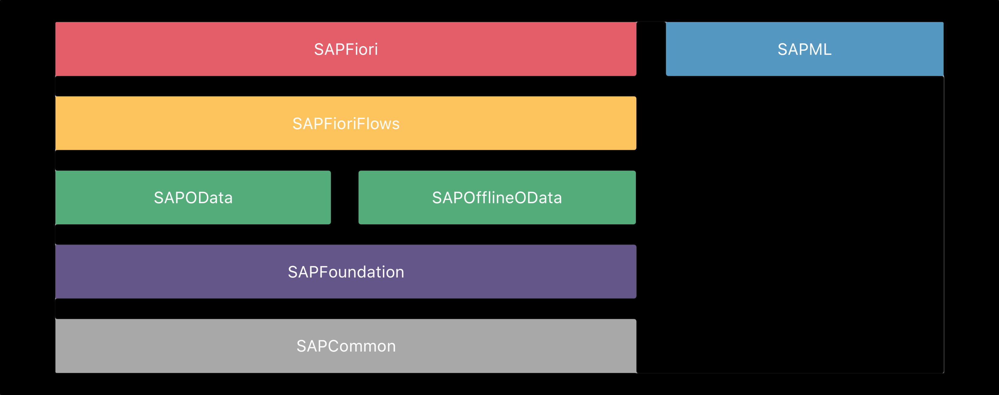
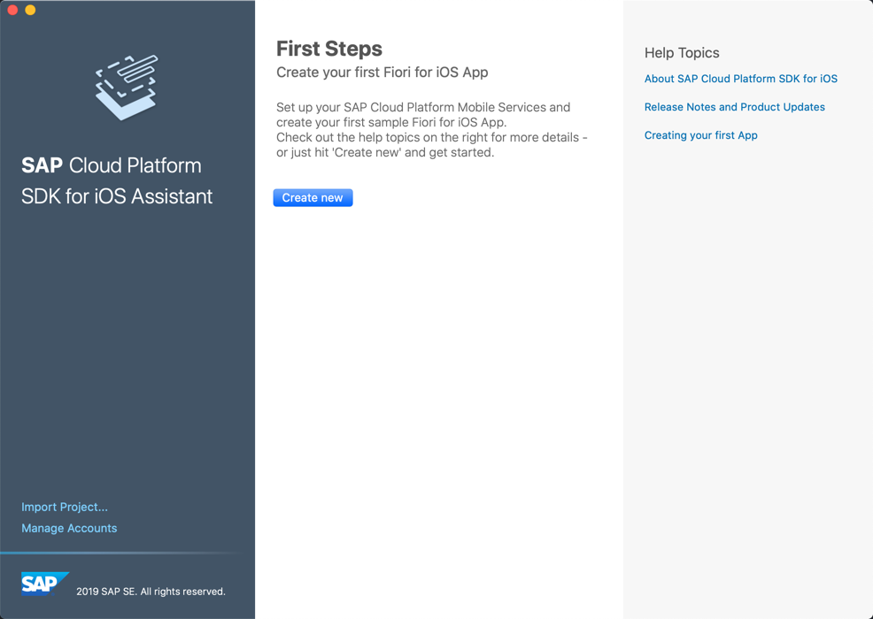
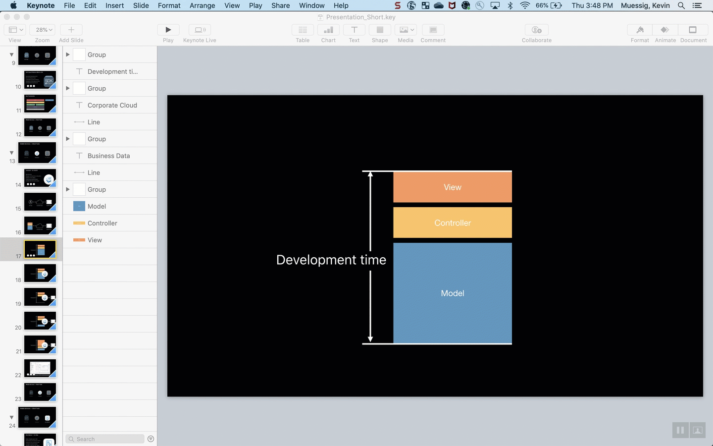
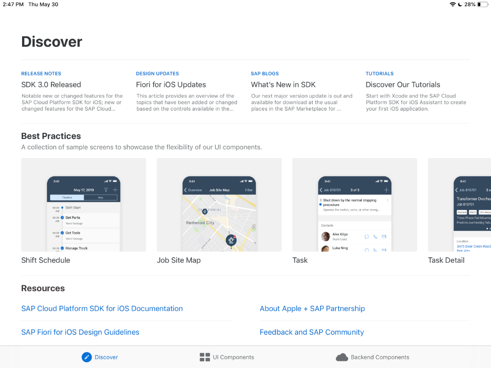
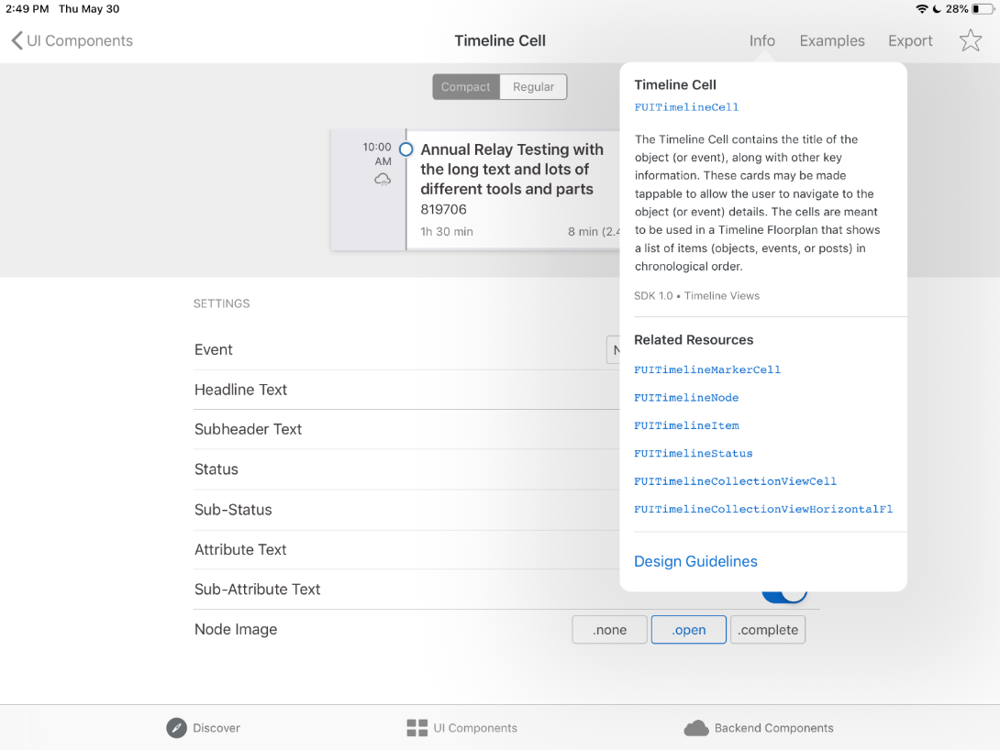
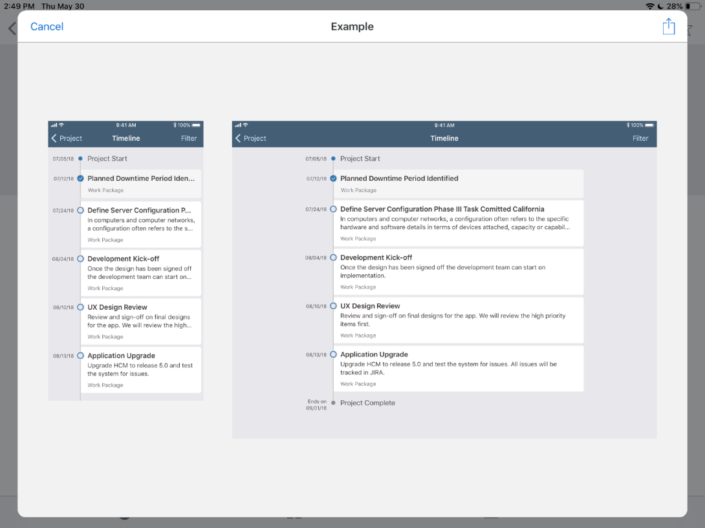
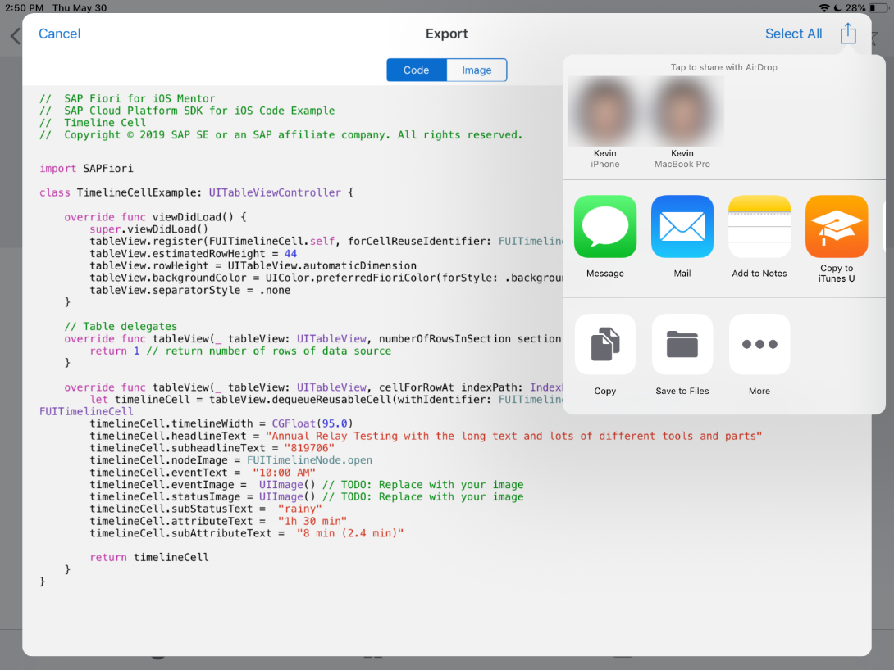

## Prerequisites

- **Group:** [Set Up the SAP BTP SDK for iOS](group.ios-sdk-setup)
- **Development environment:** Apple Mac running macOS Catalina or higher with Xcode 11 or higher
- **SAP BTP SDK for iOS:** Version 5.0 or higher

## Details

### You will learn  

- A basic understanding of the SAP BTP SDK for iOS, SAP Mobile Services
- How to create an app fast

---

[ACCORDION-BEGIN [Step 1: ](What is SAP BTP SDK for iOS?)]

The SAP BTP SDK for iOS is an SDK built to give you the best in place business ready native SDK for iOS development. The idea is to give a set of tools to developers to build native business apps that not only run smooth on the iOS platform but also give a business like user experience.

Developing an app with the SDK allows you to seamlessly integrate your mobile app into the SAP ecosystem using SAP Mobile Services. With the help of SAP Mobile Service, you can:

- Connect your app to both on-premise and cloud backend services

- Trigger push notifications to your deployed apps

- Define app settings like passcode policies or certain timeout events

For more information, visit the official [SAP Mobile Services](https://help.sap.com/viewer/product/SAP_CLOUD_PLATFORM_MOBILE_SERVICES/Cloud/en-US) website.

This tutorial series will not only show you how to get started with the SDK, SAP Mobile Services and the SAP BTP, Cloud Foundry runtime, but also will give you an introduction to the Mac Catalyst technology.

> The full project as a reference, you can find [here](https://github.com/SAP-samples/cloud-sdk-ios-maccatalyst-mission-project).

[DONE]
[ACCORDION-END]

[ACCORDION-BEGIN [Step 2: ](Frameworks available to you)]

The way the SAP BTP SDK for iOS is structured is that you have full flexibility using the included frameworks.

!

|  Framework                          | Description
|  :---------------------------       | :-------------
|  **`SAPFiori`**                     | Use the `SAPFiori` framework to get access to over 60 different UI controls following Apple's and SAP's Human Interface Guidelines. Get more information: [SAP Fiori for iOS Design Guidelines](https://experience.sap.com/fiori-design-ios/), [`SAPFiori Reference`](https://help.sap.com/doc/978e4f6c968c4cc5a30f9d324aa4b1d7/Latest/en-US/Documents/Frameworks/SAPFiori/index.html)
|  **`SAPFioriFlows`**                | Use common workflows, e.g.: user onboarding. /n Get more information: [`SAPFioriFlows Reference`](https://help.sap.com/doc/978e4f6c968c4cc5a30f9d324aa4b1d7/Latest/en-US/Documents/Frameworks/SAPFiori/index.html)
|  **`SAPOData, SAPOfflineOData`**    | Data access layer using `SAPOData` to consume an OData service, and `SAPOfflineOData` to enable offline synchronization connecting to `SAP Mobile Services`. Get more information: [`SAPOData Reference`](https://help.sap.com/doc/978e4f6c968c4cc5a30f9d324aa4b1d7/Latest/en-US/Documents/Frameworks/SAPOData/index.html), [`SAPOfflineOData Reference`](https://help.sap.com/doc/978e4f6c968c4cc5a30f9d324aa4b1d7/Latest/en-US/Documents/Frameworks/SAPOfflineOData/index.html)
|  **`SAPFoundation`**                | Use APIs for authentication and other important features you might need for your app. [`SAPFoundation Reference`](https://help.sap.com/doc/978e4f6c968c4cc5a30f9d324aa4b1d7/Latest/en-US/Documents/Frameworks/SAPFoundation/index.html)
|  **`SAPCommon`**                    | Use the `SAPCommon` framework to consume supporting APIs like the included logger. [`SAPCommon Reference`](https://help.sap.com/doc/978e4f6c968c4cc5a30f9d324aa4b1d7/Latest/en-US/Documents/Frameworks/SAPCommon/index.html)
|  **`SAPML`**                        | The newest addition to the family is the `SAPML` framework allowing you to use a general purpose text recognition capability . [`SAPML Reference`](https://help.sap.com/doc/978e4f6c968c4cc5a30f9d324aa4b1d7/Latest/en-US/Documents/Frameworks/SAPML/index.html)

In this tutorial mission you, will use most of these frameworks to build your first app.

[DONE]
[ACCORDION-END]

[ACCORDION-BEGIN [Step 3: ](Tools for building apps)]

With the SAP BTP SDK for iOS, SAP provides you with three tools to build business-ready apps.

**SAP BTP SDK for iOS**

As described before, the SAP BTP SDK for iOS is a set of Swift-native frameworks tailored for the needs of a business app developer.

**SAP BTP SDK Assistant for iOS for iOS**

When downloading the SAP BTP SDK for iOS, it will come packaged in the SAP BTP SDK Assistant for iOS. The Assistant is a native MacOS application you can use to connect to your SAP Mobile Services account and from there consume an OData service to generate an Xcode project.

In the Assistant, you can define a set of features you want to use as well as different options for UI generation.

!

The main benefit of the Assistant is that it generates your complete model and data service layer in your app based on the metadata document of your OData service. This leaves you far more time focusing on the user experience of your app.

!

**SAP Fiori Mentor app**

The SAP Fiori Mentor app is developed by SAP to be a great addition to your development environment. It gives you an easy entry level to understand the different UI components of the `SAPFiori` framework.
Currently the SAP Fiori Mentor app is available for iPad only and can be found for free in the Apple App Store [SAP Fiori Mentor](https://apps.apple.com/us/app/sap-fiori-mentor/id1215284965).

!

Using the SAP Fiori Mentor app allows you to take a look at the different UI controls, preview them for different size classes and manipulate its attributes to see how the control changes.

!
!
!

It also allows you to export code snippets of your customized control to use in your app project. To share the created code snippets, you can simply use **AirDrop**, **Universal Keyboard** and other common ways of sharing.

!

[VALIDATE_3]
[ACCORDION-END]
