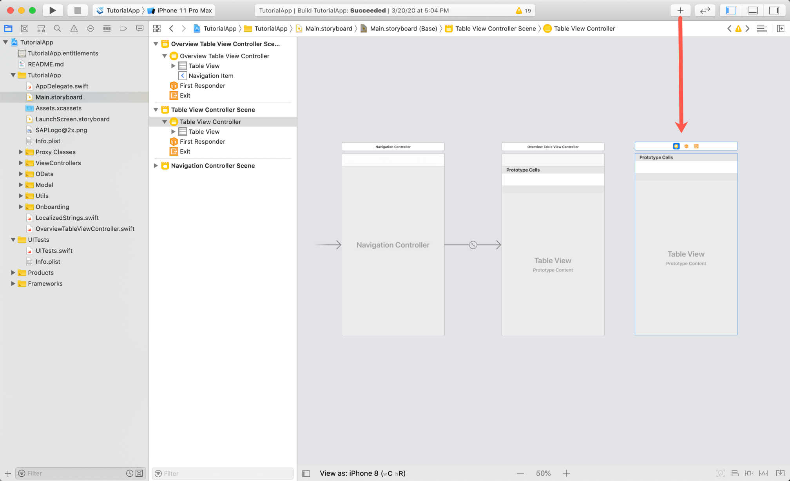
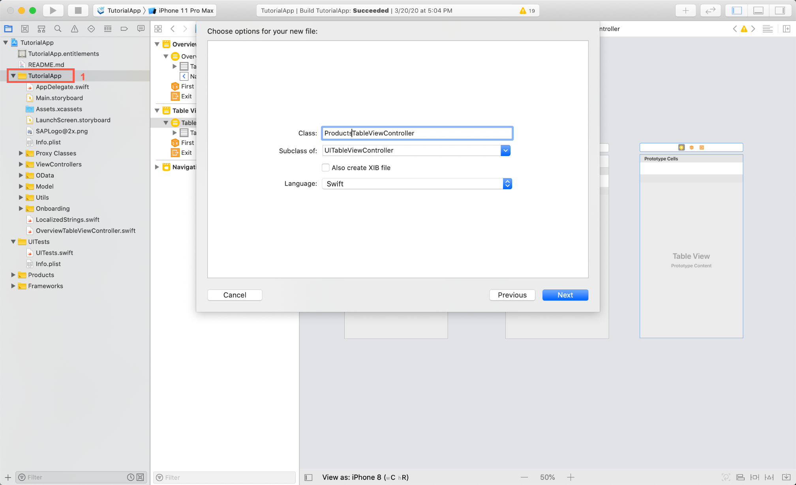
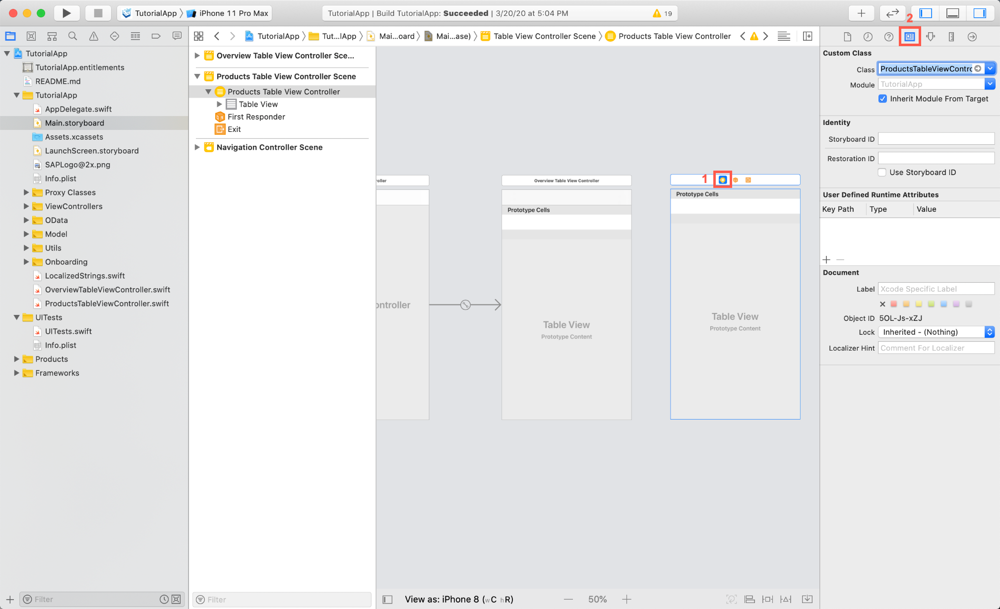
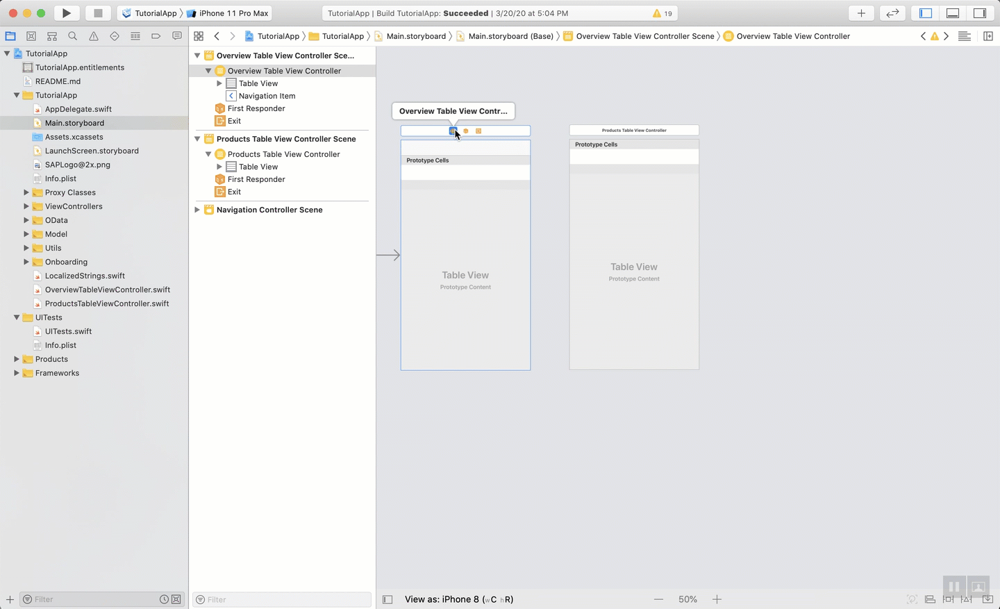
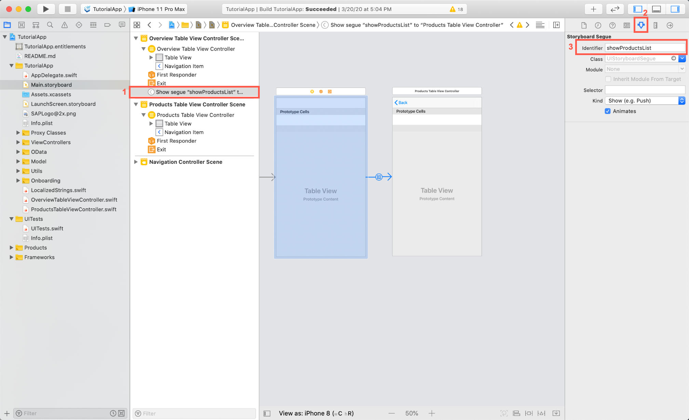
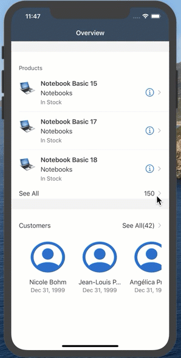
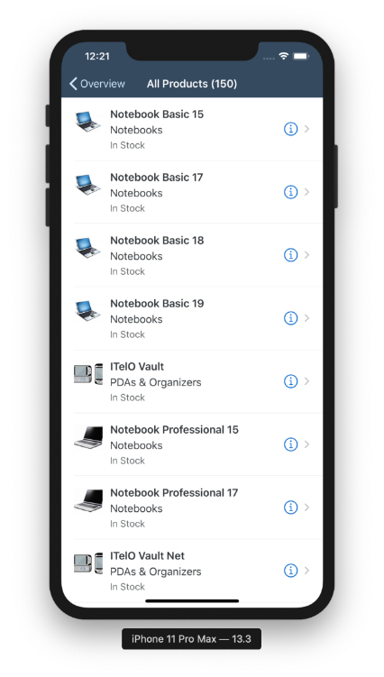
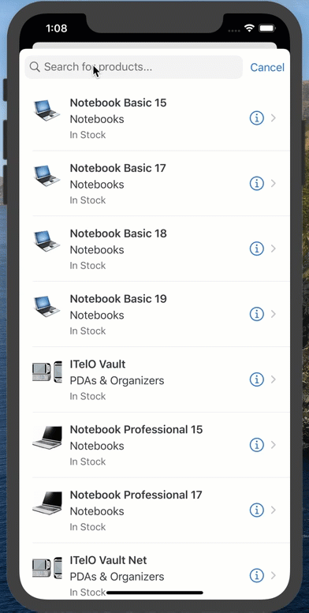

## Prerequisites

- **Development environment:** Apple Mac running macOS Catalina or higher with Xcode 11 or higher
- **SAP BTP SDK for iOS:** Version 5.0 or higher

## Details

### You will learn  

- How to use storyboard segues to navigate between screens
- How to prepare a segue to set the title of the destination screen of each navigation

---

[ACCORDION-BEGIN [Step 1: ](Create the product list screen)]

The Overview screen allows the user to navigate to a list of products or customers using the `FUITableViewHeaderFooterView`. Both lists are implemented almost exactly the same.

In this tutorial, you will implement the product list first, a `FUISearchBar` to let the user search for entities in the corresponding list, and navigation from the `OverviewTableViewController` to the product list screen.

1. Open the **`Main.storyboard`** and use the **Object Library** like before to drag a new Table View Controller to the storyboard right next to the Overview Table View Controller.

    !

2. Create a new **Cocoa Touch Class** using the Project Navigator **`TutorialApp > New File ... > Cocoa Touch Class`** . Make sure the new class is inheriting from `UITableViewController` and give it the name `ProductsTableViewController`.

    !

3. Go back to the **`Main.storyboard`** and set the **Custom Class** of the newly added Table View Controller to `ProductsTableViewController`.

    !

    To enable the user to navigate between screens and passing data between view controllers you can use Storyboard Segues to you advantage. Segues can be created in Interface Builder and are accessible in the View Controllers class through the override `prepareForSegue(for:sender:)` method.

4. You should be still in the `Main.storyboard`, there select the `OverviewTableViewController` and **`control + drag`** to the `ProductsTableViewController`.

    !

    If you look closely, you can see that the `ProductsTableViewController` has a Navigation Item now allowing your user to navigate back to the Overview Screen. You get the back navigation out of the box because you've embedded the `OverviewTableViewController` in a Navigation Controller. The arrow between the View Controllers indicates a segue, for you to be able to distinguish multiple segues from each other they, like the Table View Cells, need an identifier.

5. Select the segue in Interface Builder and click on the **Attributes Inspector**. As identifier enter `showProductsList` and hit return.

    !

[DONE]
[ACCORDION-END]

[ACCORDION-BEGIN [Step 2: ](Implement a prepare for segue method)]

For the product list, it is not necessary to pass any crucial data in, but you want to set the navigation item's title before finishing up the navigation.

You can store the segue identifier in a class property for cleaner code and use it in the `prepareForSegue(for:Sender:)` method.

1. Open the `OverviewTableViewController.swift` class and add the following class property:

    ```Swift
    private let productSegueIdentifier = "showProductsList"

    ```

2. Before the closing class bracket, add the `prepareForSegue(for:Sender:)` method or if existent replace, which will be called by the system right before the navigation finishes it's completion and the destination View Controller is loaded into memory.

    ```Swift
    /**
    In a storyboard-based application, you will often want to do a little preparation before navigation.
    Using a Switch-statement let's you distinct between the different segues. Right now there is only the showProductsList but you will add a showCustomersList later on.
    */
    override func prepare(for segue: UIStoryboardSegue, sender: Any?) {
        switch segue.identifier {
        case productSegueIdentifier:
            let productsTableVC = segue.destination as! ProductsTableViewController
            productsTableVC.navigationItem.title = NSLocalizedString("All Products (\(products.count))", comment: "")
        default:
            return
        }
    }

    ```

    Theoretically a segue gets performed without you having to do any extra call in code, because our `FUITableViewHeaderFooterView` has it's own change handler we have to call `performSegue(withIdentifier:)`.

3. Locate the `tableView(_:viewForFooterInSection:)` method and change the code to call the needed method:

    ```Swift
    override func tableView(_ tableView: UITableView, viewForFooterInSection section: Int) -> UIView? {
        if section == 1 {
            let headerFooterView = tableView.dequeueReusableHeaderFooterView(withIdentifier: FUITableViewHeaderFooterView.reuseIdentifier) as! FUITableViewHeaderFooterView
            headerFooterView.didSelectHandler = {
                // perform the segue with the defined identifier if the user taps on the See All footer view.
                self.performSegue(withIdentifier: self.productSegueIdentifier, sender: self)
            }
            headerFooterView.style = .attribute
            headerFooterView.titleLabel.text = NSLocalizedString("See All", comment: "")
            headerFooterView.attributeLabel.text = "\(products.count)"
            return headerFooterView
        } else {
            return UIView(frame: CGRect(x: 0, y: 0, width: 0, height: 0))
        }
    }

    ```

4. If you run the app now you can navigate between Overview Screen and Product List Screen.

    !

[DONE]
[ACCORDION-END]

[ACCORDION-BEGIN [Step 3: ](Implement a product list)]

The Product List is a Table View Controller which means the structure is similar to the Overview Table View Controller with the difference that you won't use any `FUITableViewHeaderFooterView`.

1. Open the `ProductsTableViewController.swift` class and add the following import statements:

    ```Swift
    import SAPFiori
    import SAPFoundation
    import SAPOData
    import SAPFioriFlows
    import SAPCommon

    ```

2. Now you will add parts of the class properties you already have used in the Overview Table View Controller. Implement the following lines of code at the top of the class:

    **For Online OData**

    Add the following import statement to your class:

    ```Swift
    import SAPOData

    ```

    Implement the following lines of code directly below the logger instance as class properties:

    ```Swift
    /// First retrieve the destinations your app can talk to from the AppParameters.
    let destinations = FileConfigurationProvider("AppParameters").provideConfiguration().configuration["Destinations"] as! NSDictionary

    /// Create a computed property that uses the OnboardingSessionManager to retrieve the onboarding session and uses the destinations dictionary to pull the correct destination. Of course you only have one destination here. Handle the errors in case the OData controller is nil. You are using the AlertHelper to display an AlertDialogue to the user in case of an error. The AlertHelper is a utils class provided through the Assistant.
    var dataService: ESPMContainer<OnlineODataProvider>? {
        guard let odataController = OnboardingSessionManager.shared.onboardingSession?.odataControllers[destinations["com.sap.edm.sampleservice.v2"] as! String] as? Comsapedmsampleservicev2OnlineODataController, let dataService = odataController.espmContainer else {
            AlertHelper.displayAlert(with: NSLocalizedString("OData service is not reachable, please onboard again.", comment: ""), error: nil, viewController: self)
            return nil
        }
        return dataService
    }

    private let appDelegate = UIApplication.shared.delegate as! AppDelegate
    private let logger = Logger.shared(named: "ProductsTableViewController")

    private var imageCache = [String: UIImage]()
    private var productImageURLs = [String]()
    private var products = [Product]()

    ```

    **For Offline OData**

    Add the following import statement to your class:

    ```Swift
    import SAPOfflineOData
    import SAPOData

    ```

    Implement the following lines of code directly below the logger instance as class properties:

    ```Swift

    /// First retrieve the destinations your app can talk to from the AppParameters.
    let destinations = FileConfigurationProvider("AppParameters").provideConfiguration().configuration["Destinations"] as! NSDictionary

    var dataService: ESPMContainer<OfflineODataProvider>? {
        guard let odataController = OnboardingSessionManager.shared.onboardingSession?.odataControllers[destinations["com.sap.edm.sampleservice.v2"] as! String] as? Comsapedmsampleservicev2OfflineODataController, let dataService = odataController.espmContainer else {
            AlertHelper.displayAlert(with: NSLocalizedString("OData service is not reachable, please onboard again.", comment: ""), error: nil, viewController: self)
            return nil
        }
        return dataService
    }

    private let appDelegate = UIApplication.shared.delegate as! AppDelegate
    private let logger = Logger.shared(named: "ProductsTableViewController")

    private var imageCache = [String: UIImage]()
    private var productImageURLs = [String]()
    private var products = [Product]()

    ```

    You might wonder why you are not passing the data service in from the Overview. Later on when adapting the app to work on MacOS through Mac Catalyst, the user will have the option to jump directly into the product list. In that case you won't perform a segue and so on not be able to pass in the data service. Of course there are ways to refactor this into a more centralized way but for simplicity reason you stick to this approach.

3. Now implement the `viewDidLoad()` to register the needed cells and setup the table view:

    ```Swift
    override func viewDidLoad() {
        super.viewDidLoad()

        tableView.register(FUIObjectTableViewCell.self, forCellReuseIdentifier: FUIObjectTableViewCell.reuseIdentifier)
        tableView.estimatedRowHeight = 120
        tableView.rowHeight = UITableView.automaticDimension
    }

    ```

4. You will use the `SAPFioriLoadingIndicator` for this table view controller as well. Let your class conform to the `SAPFioriLoadingIndicator` protocol:

    ```Swift
    class ProductsTableViewController: UITableViewController, SAPFioriLoadingIndicator {
        var loadingIndicator: FUILoadingIndicatorView?

    ///...

    }

    ```

    Next you will implement the Table View's data source methods almost identically to the ones in the Overview.

    > In case you don't have the `Runtime Root URL` anymore you can find it in **Mobile Services**, select your **app configuration** in the **`Native/Hybrid`** screen. There you click on **`Mobile Sample OData ESPM`** in the **Assigned Features** section. The detail screen for the `Mobile Sample OData ESPM` will open. There you find the **`Runtime Root URL`** for this service, copy the whole URL.

5. Add the following lines of code below the closing bracket of the `viewDidLoad()` method:

    ```Swift[20]
    override func numberOfSections(in tableView: UITableView) -> Int {
            return 1
        }

        override func tableView(_ tableView: UITableView, numberOfRowsInSection section: Int) -> Int {
            return products.count
        }

        override func tableView(_ tableView: UITableView, cellForRowAt indexPath: IndexPath) -> UITableViewCell {
            let product = products[indexPath.row]
            let productCell = tableView.dequeueReusableCell(withIdentifier: FUIObjectTableViewCell.reuseIdentifier) as! FUIObjectTableViewCell
            productCell.accessoryType = .detailDisclosureButton
            productCell.headlineText = product.name ?? "-"
            productCell.subheadlineText = product.categoryName ?? "-"
            productCell.footnoteText = product.stockDetails?.quantity?.intValue() != 0 ? NSLocalizedString("In Stock", comment: "") : NSLocalizedString("Out", comment: "")
            // set a placeholder image
            productCell.detailImageView.image = FUIIconLibrary.system.imageLibrary

            // This URL is found in Mobile Services
            let baseURL = <YOUR URL>
            let url = URL(string: baseURL.appending(productImageURLs[indexPath.row]))

            guard let unwrapped = url else {
                logger.info("URL for product image is nil. Returning cell without image.")
                return productCell
            }
            // check if the image is already in the cache
            if let img = imageCache[unwrapped.absoluteString] {
                productCell.detailImageView.image = img
            } else {
                // The image is not cached yet, so download it.
                loadImageFrom(unwrapped) { image in
                    productCell.detailImageView.image = image
                }
            }
            // Only visible on regular
            productCell.descriptionText = product.longDescription ?? ""

            return productCell
        }

    ```

6. Inside the just implemented method assign the copied `URL` to the `baseURL` instead of `<YOUR URL>` placeholder.

    The code won't compile yet because the data loading methods are missing.

7. Implement the data loading methods between the data source methods and the `viewDidLoad()` similar to the Overview. The difference is that you only have one backend call and so you don't need a Dispatch Group.

    ```Swift

    private func loadData() {
        showFioriLoadingIndicator()
        fetchProducts {
            self.tableView.reloadData()
            self.hideFioriLoadingIndicator()
        }
    }

    /**
    Fetch the products and handle it's errors. In case of success set the data and call the completion handler so you can stop the loading indicator.
    */
    private func fetchProducts(completionHandler: @escaping () -> Void) {
        dataService?.fetchProducts() { [weak self] result, error in
            if let error = error {
                AlertHelper.displayAlert(with: NSLocalizedString("Failed to load list of products!", comment: ""), error: error, viewController: self!)
                self?.logger.error("Failed to load list of products!", error: error)
                return
            }
            self?.products.append(contentsOf: result!)
            self?.productImageURLs.append(contentsOf: result!.map { $0.pictureUrl ?? "" })
            completionHandler()
        }
    }

    private func loadImageFrom(_ url: URL, completionHandler: @escaping (_ image: UIImage) -> Void) {
        let appDelegate = UIApplication.shared.delegate as! AppDelegate
        if let sapURLSession = appDelegate.sessionManager.onboardingSession?.sapURLSession {
            sapURLSession.dataTask(with: url, completionHandler: { data, _, error in

                if let error = error {
                    self.logger.error("Failed to load image!", error: error)
                    return
                }

                if let image = UIImage(data: data!) {
                    // safe image in image cache
                    self.imageCache[url.absoluteString] = image
                    DispatchQueue.main.async { completionHandler(image) }
                }
            }).resume()
        }
    }

    ```

8. Before running the app make sure to call `loadData()` within the `viewDidLoad()` as a last statement:

    ```Swift
    override func viewDidLoad() {
        super.viewDidLoad()

        tableView.register(FUIObjectTableViewCell.self, forCellReuseIdentifier: FUIObjectTableViewCell.reuseIdentifier)
        tableView.estimatedRowHeight = 120
        tableView.rowHeight = UITableView.automaticDimension

        loadData()
    }

    ```

    

[DONE]
[ACCORDION-END]

[ACCORDION-BEGIN [Step 4: ](Implement a search bar)]

The SAP Fiori for iOS Search Bar control inherits is using the standard `UISearchBar` inside but enhances the whole search controller with a barcode reader. You're not going to implement the barcode reader in this tutorial series but if you're interested in how to do so take a look at the [Use the Barcode Scanner API](fiori-ios-scpms-barcode) tutorial at a later point.

1. In order to add a search bar to the view you need a `FUISearchController` instance, implement the following two class properties in the `ProductsTableViewController.swift` class to hold on an instance of the search controller as well as the search results.

    ```Swift
    private var searchController: FUISearchController?
    private var searchedProducts = [Product]()

    ```

2. Next implement a setup method to instantiate the `FUISearchController` and do some setup. Add the following method below the `tableView(_:cellForRowAt:)` method:

    ```Swift
    private func setupSearchBar() {
        // Search Controller setup
        searchController = FUISearchController(searchResultsController: nil)

        // Handle the search result directly in the ProductsTableViewController
        searchController!.searchResultsUpdater = self
        searchController!.hidesNavigationBarDuringPresentation = false
        searchController!.searchBar.placeholderText = NSLocalizedString("Search for products...", comment: "")
        searchController!.searchBar.isBarcodeScannerEnabled = false

        // Set the search bar to the table header view like you did with the KPI Header.
        self.tableView.tableHeaderView = searchController!.searchBar
    }

    ```

3. The code won't compile at the moment because you haven't conformed to the `UISearchResultsUpdating` protocol. We will fix that at a later point but first call the `setupSearchBar()` method right below the `loadData()` call in the `viewDidLoad()` method.

    ```Swift[9]
    override func viewDidLoad() {
        super.viewDidLoad()

        tableView.register(FUIObjectTableViewCell.self, forCellReuseIdentifier: FUIObjectTableViewCell.reuseIdentifier)
        tableView.estimatedRowHeight = 120
        tableView.rowHeight = UITableView.automaticDimension

        loadData()
        setupSearchBar()
    }

    ```

4. To fix the compile time error create an extension conforming to the `UISearchResultsUpdating` protocol:

    ```Swift
    // MARK: - UISearchResultsUpdating extension

    extension ProductsTableViewController: UISearchResultsUpdating {
        func updateSearchResults(for searchController: UISearchController) {
            if let searchText = searchController.searchBar.text {
                // TODO: Implement
                return
            }
        }
    }

    ```

    You will go ahead and implement that later. For now leave it as is and you proceed implementing the search logic.
    To do so you implement some helper methods deciding if the text in the search field is empty, if the user is actually in the process of searching but also the search logic itself.

5. First implement the method to check if the search field is empty or not. Add the method below the `setupSearchBar()` method:

    ```Swift
    // Verify if the search text is empty or not
    private func searchTextIsEmpty() -> Bool {
       return searchController?.searchBar.text?.isEmpty ?? true
    }

    ```

6. Implement a method directly below deciding if the user is currently searching or not:

    ```Swift
    // Verify if the user is currently searching or not
    private func isSearching() -> Bool {
        return searchController?.isActive ?? false && !searchTextIsEmpty()
    }

    ```

7. Lastly implement the search logic method responsible for actually searching through the products and returning a list of the searched for products:

    ```Swift
    // actual search logic for finding the correct products for the term the user is searching for
    private func searchProducts(_ searchText: String) {
        searchedProducts = products.filter({( product : Product) -> Bool in
            // Make sure the string is completely lower-cased or upper-cased. Either way makes it easier for you to
            // compare strings.
            return product.name?.lowercased().contains(searchText.lowercased()) ?? false
        })

        // Don't forget to trigger a reload.
        tableView.reloadData()
    }

    ```

    With the search logic implemented you can go ahead and fully implement the extension you defined before.

8. Replace the `updateSearchResults(for:)` method in the `UISearchResultsUpdating` extension:

    ```Swift
    extension ProductsTableViewController: UISearchResultsUpdating {
        func updateSearchResults(for searchController: UISearchController) {
            if let searchText = searchController.searchBar.text {

                // Simply call the search logic method and pass the searched for text here!
                // You could check if the search text's length is at least 3 characters
                // to not trigger the search for each and every single character.
                // if searchText.count >= 3 { searchProducts(searchText) }

                searchProducts(searchText)
                return
            }
        }
    }

    ```

9. Change the `tableView(_:numberOfRowsInSection:)` method to adapt to the `searchedProducts` array. In the data source method you have to check if the user is searching, and if yes then return the number of searched products instead of the complete product list. Replace the existing method with the following code:

```Swift[2]
override func tableView(_ tableView: UITableView, numberOfRowsInSection section: Int) -> Int {
           return isSearching() ? searchedProducts.count : products.count
      }
```

10. Like the `tableView(_:numberOfRowsInSection:)` method, you need to also adapt in the `tableView(_:cellForRowAt:)` method to the search feature. Replace the line:

```Swift
let product = products[indexPath.row]

```

with the following code where you use the Swift ternary operator to check if the user is searching or not:

```Swift
let product = isSearching() ? searchedProducts[indexPath.row] : products[indexPath.row]

```

The `tableView(_:cellForRowAt:)` method should look like this now:

```Swift[2]

override func tableView(_ tableView: UITableView, cellForRowAt indexPath: IndexPath) -> UITableViewCell {
    let product = isSearching() ? searchedProducts[indexPath.row] : products[indexPath.row]
    let productCell = tableView.dequeueReusableCell(withIdentifier: FUIObjectTableViewCell.reuseIdentifier) as! FUIObjectTableViewCell
    productCell.accessoryType = .detailDisclosureButton
    productCell.headlineText = product.name ?? "-"
    productCell.subheadlineText = product.categoryName ?? "-"
    productCell.footnoteText = product.stockDetails?.quantity?.intValue() != 0 ? NSLocalizedString("In Stock", comment: "") : NSLocalizedString("Out", comment: "")
    // set a placeholder image
    productCell.detailImageView.image = FUIIconLibrary.system.imageLibrary

    // This URL is found in Mobile Services
    let baseURL = "https://a9366ac9trial-dev-com-example.cfapps.eu10.hana.ondemand.com/SampleServices/ESPM.svc/v2"
    let url = URL(string: baseURL.appending(productImageURLs[indexPath.row]))

    guard let unwrapped = url else {
        logger.info("URL for product image is nil. Returning cell without image.")
        return productCell
    }
    // check if the image is already in the cache
    if let img = imageCache[unwrapped.absoluteString] {
        productCell.detailImageView.image = img
    } else {
        // The image is not cached yet, so download it.
        loadImageFrom(unwrapped) { image in
            productCell.detailImageView.image = image
        }
    }
    // Only visible on regular
    productCell.descriptionText = product.longDescription ?? ""

    return productCell
}
```

11. Run the app now and you should be able to search for products.

    !

[VALIDATE_4]
[ACCORDION-END]
