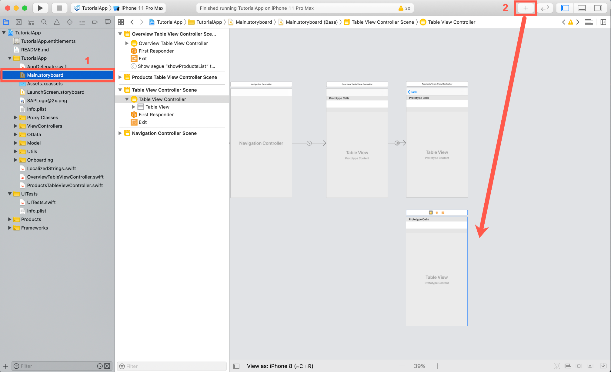
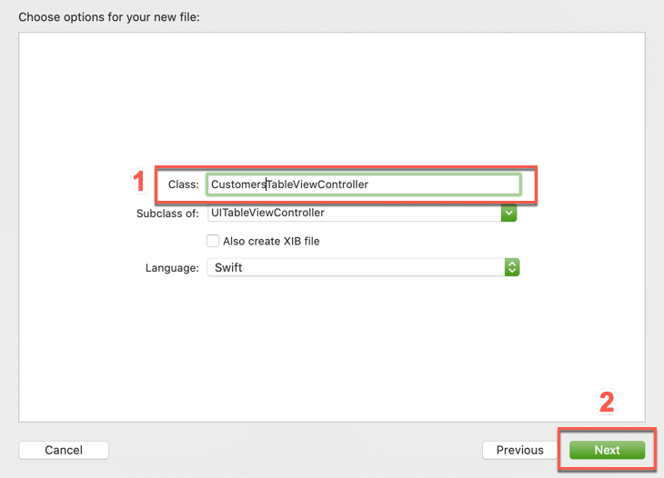
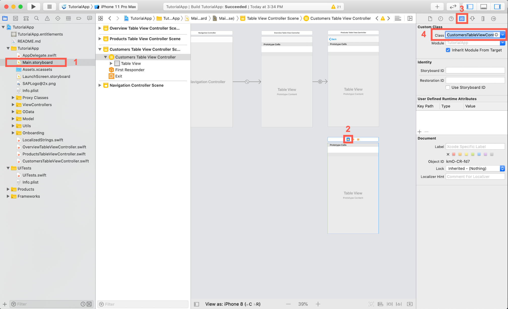
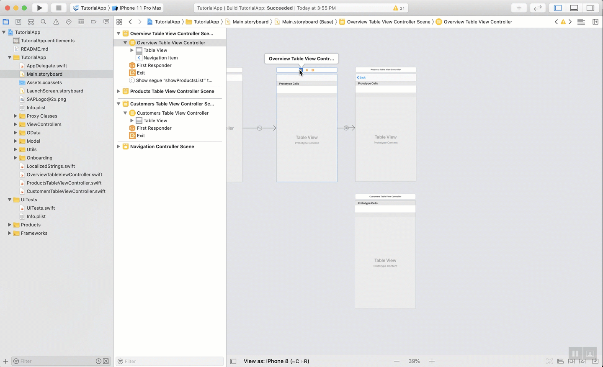
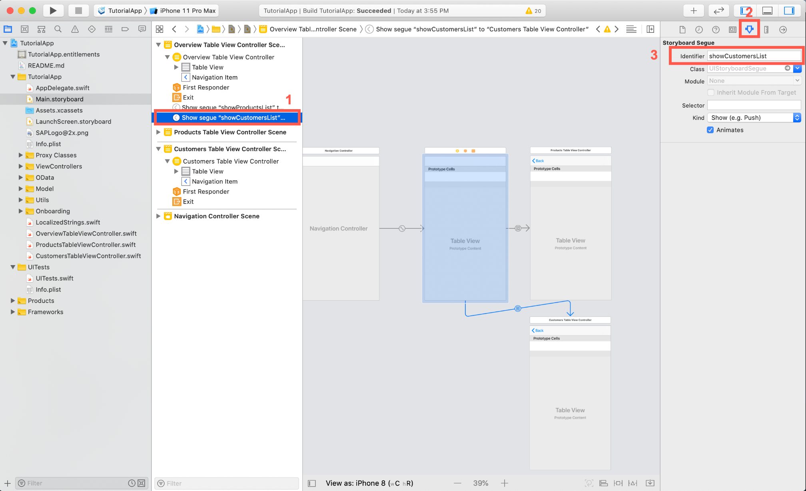
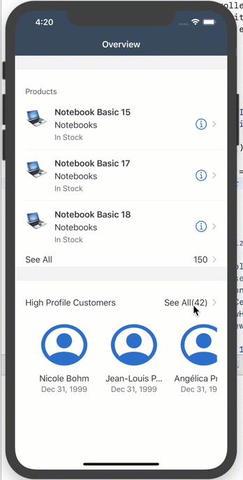

## Prerequisites

- **Development environment:** Apple Mac running macOS Catalina or higher with Xcode 11 or higher
- **SAP BTP SDK for iOS:** Version 5.0 or higher

## Details

### You will learn  

- How to reuse View Controller code

---

[ACCORDION-BEGIN [Step 1: ](Create a customer list)]

Because you already implemented a similar screen, the Product List, you can copy most of the code from the `ProductsTableViewController.swift` class.

1. Before you do that, open the **`Main.storyboard`** and use the **Object Library** to create another Table View Controller and place it directly below the **Products Table View Controller**.

    !

2. Use the project navigator to create a new Table View Controller Cocoa Touch Class  **`TutorialApp > New File ... > Cocoa Touch Class`**. Name the class **`CustomersTableViewController`**.

    !

3. Open the **`Main.storyboard`** and set the **Custom Class** of the newly added Table View Controller to `CustomersTableViewController`.

    !

[DONE]
[ACCORDION-END]

[ACCORDION-BEGIN [Step 2: ](Implement the customer list)]

1. Next you're going to simply copy the `ProductsTableViewController.swift` code into a new class `CustomersTableViewController.swift`.

    > Views like that which offer the same functionality and take different entities to display could be developed generically. For simplicity reasons you will just reuse code here.

2. You can reuse most of the code from the `ProductsTableViewController.swift` class, to start open the `CustomersTableViewController.swift` file and add the needed import statements to the class:

    ```Swift
    import SAPFiori
    import SAPFoundation
    import SAPOData
    import SAPFioriFlows
    import SAPCommon

    ```

3. Now you're going to copy the code inside of the class definition of the `ProductsTableViewController.swift` class to the class body of the `CustomersTableViewController`.
    Replace everything inside the `CustomersTableViewController` class **from:**

    ```Swift
    class CustomersTableViewController: UITableViewController {

        override func viewDidLoad() {
            super.viewDidLoad()

            // Uncomment the following line to preserve selection between presentations
            // self.clearsSelectionOnViewWillAppear = false

            // Uncomment the following line to display an Edit button in the navigation bar for this view controller.
            // self.navigationItem.rightBarButtonItem = self.editButtonItem
        }

        // MARK: - Table view data source

        override func numberOfSections(in tableView: UITableView) -> Int {
            // #warning Incomplete implementation, return the number of sections
            return 0
        }

        override func tableView(_ tableView: UITableView, numberOfRowsInSection section: Int) -> Int {
            // #warning Incomplete implementation, return the number of rows
            return 0
        }

        /*
        override func tableView(_ tableView: UITableView, cellForRowAt indexPath: IndexPath) -> UITableViewCell {
            let cell = tableView.dequeueReusableCell(withIdentifier: "reuseIdentifier", for: indexPath)

            // Configure the cell...

            return cell
        }
        */

        /*
        // Override to support conditional editing of the table view.
        override func tableView(_ tableView: UITableView, canEditRowAt indexPath: IndexPath) -> Bool {
            // Return false if you do not want the specified item to be editable.
            return true
        }
        */

        /*
        // Override to support editing the table view.
        override func tableView(_ tableView: UITableView, commit editingStyle: UITableViewCell.EditingStyle, forRowAt indexPath: IndexPath) {
            if editingStyle == .delete {
                // Delete the row from the data source
                tableView.deleteRows(at: [indexPath], with: .fade)
            } else if editingStyle == .insert {
                // Create a new instance of the appropriate class, insert it into the array, and add a new row to the table view
            }    
        }
        */

        /*
        // Override to support rearranging the table view.
        override func tableView(_ tableView: UITableView, moveRowAt fromIndexPath: IndexPath, to: IndexPath) {

        }
        */

        /*
        // Override to support conditional rearranging of the table view.
        override func tableView(_ tableView: UITableView, canMoveRowAt indexPath: IndexPath) -> Bool {
            // Return false if you do not want the item to be re-orderable.
            return true
        }
        */

        /*
        // MARK: - Navigation

        // In a storyboard-based application, you will often want to do a little preparation before navigation
        override func prepare(for segue: UIStoryboardSegue, sender: Any?) {
            // Get the new view controller using segue.destination.
            // Pass the selected object to the new view controller.
        }
        */

    }

    ```

    **To:**

    ```Swift
    //
    //  CustomersTableViewController.swift
    //  MySampleAppCatalyst
    //
    //  Created by Muessig, Kevin on 3/12/20.
    //  Copyright © 2020 SAP. All rights reserved.
    //

    import UIKit
    import SAPFiori
    import SAPFoundation
    import SAPOData
    import SAPFioriFlows
    import SAPCommon

    class CustomersTableViewController: UITableViewController, SAPFioriLoadingIndicator {
        var loadingIndicator: FUILoadingIndicatorView?

        let destinations = FileConfigurationProvider("AppParameters").provideConfiguration().configuration["Destinations"] as! NSDictionary

        var dataService: ESPMContainer<OfflineODataProvider>? {
          guard let odataController = OnboardingSessionManager.shared.onboardingSession?.odataControllers[destinations["com.sap.edm.sampleservice.v2"] as! String] as? Comsapedmsampleservicev2OfflineODataController, let dataService = odataController.espmContainer else {
              AlertHelper.displayAlert(with: NSLocalizedString("OData service is not reachable, please onboard again.", comment: ""), error: nil, viewController: self)
              return nil
          }
          return dataService
    }

        private let appDelegate = UIApplication.shared.delegate as! AppDelegate
        private let logger = Logger.shared(named: "ProductsTableViewController")

        private var customers = [Customer]()

        private var searchController: FUISearchController?
        private var searchedCustomers = [Customer]()

        override func viewDidLoad() {
            super.viewDidLoad()

            tableView.register(FUIObjectTableViewCell.self, forCellReuseIdentifier: FUIObjectTableViewCell.reuseIdentifier)
            tableView.estimatedRowHeight = 120
            tableView.rowHeight = UITableView.automaticDimension

            loadData()
            setupSearchBar()
        }

        private func loadData() {
            showFioriLoadingIndicator()
            fetchCustomers {
                self.tableView.reloadData()
                self.hideFioriLoadingIndicator()
            }
        }

        private func fetchCustomers(completionHandler: @escaping () -> Void) {
            dataService?.fetchCustomers() { [weak self] result, error in
                if let error = error {
                    AlertHelper.displayAlert(with: NSLocalizedString("Failed to load list of products!", comment: ""), error: error, viewController: self!)
                    self?.logger.error("Failed to load list of products!", error: error)
                    return
                }
                self?.customers = result!
                completionHandler()
            }
        }

        // MARK: - Table view data source

        override func numberOfSections(in tableView: UITableView) -> Int {
            return 1
        }

        override func tableView(_ tableView: UITableView, numberOfRowsInSection section: Int) -> Int {
            return isSearching() ? searchedCustomers.count : customers.count
        }

        override func tableView(_ tableView: UITableView, cellForRowAt indexPath: IndexPath) -> UITableViewCell {
            let customer = isSearching() ? searchedCustomers[indexPath.row] : customers[indexPath.row]
            let customerCell = tableView.dequeueReusableCell(withIdentifier: FUIObjectTableViewCell.reuseIdentifier) as! FUIObjectTableViewCell
            customerCell.accessoryType = .none

            let customerName = "\(customer.firstName ?? "") \(customer.lastName ?? "")"
            customerCell.headlineText = customerName

            customerCell.detailImageView.image = FUIIconLibrary.system.me
            customerCell.detailImageView.isCircular = true

            if let customerDOB = customer.dateOfBirth {
                let dateFormatter = DateFormatter()
                dateFormatter.dateStyle = .medium
                customerCell.subheadlineText = "\(dateFormatter.string(from: customerDOB.utc()))"
            }
            return customerCell
        }

        // MARK: - Search Bar

        private func setupSearchBar() {
            // Search Controller setup
            searchController = FUISearchController(searchResultsController: nil)
            searchController!.searchResultsUpdater = self
            searchController!.hidesNavigationBarDuringPresentation = true
            searchController!.searchBar.placeholderText = NSLocalizedString("Search for customers...", comment: "")
            searchController!.searchBar.isBarcodeScannerEnabled = false

            self.tableView.tableHeaderView = searchController!.searchBar
        }

        // verify if the search text is empty or not
        private func searchTextIsEmpty() -> Bool {
            return searchController?.searchBar.text?.isEmpty ?? true
        }

        // actual search logic for finding the correct products for the term the user is searching for
        private func searchProducts(_ searchText: String) {
            searchedCustomers = customers.filter({( customer : Customer) -> Bool in
                let customerName = "\(customer.firstName ?? "") \(customer.lastName ?? "")"
                return customerName.lowercased().contains(searchText.lowercased())
            })

            tableView.reloadData()
        }

        // verify if the user is currently searching or not
        private func isSearching() -> Bool {
            return searchController?.isActive ?? false && !searchTextIsEmpty()
        }
    }

    // MARK: - UISearchResultsUpdating extension

    extension CustomersTableViewController: UISearchResultsUpdating {
        func updateSearchResults(for searchController: UISearchController) {
            if let searchText = searchController.searchBar.text {
                searchProducts(searchText)
                return
            }
        }
    }

    ```

    If you compile now, there shouldn't be any compile time errors, if you get a compile time error for the `odataController` remember to make the `import SAPOfflineOData` import statement. You did use almost the same code as in the `ProductsTableViewController.swift` class and modified it. You had to simply replace all the product definitions with customer and adjust the `tableView(_:cellForRowAt:)` method to use the product data similar to the Overview Screen.

    Also, the `loadProductImages()` method is not necessary anymore so you deleted that.

[VALIDATE_2]
[ACCORDION-END]

[ACCORDION-BEGIN [Step 3: ](Create storyboard segue for the customer list)]

1. Open the `Main.storyboard`, there select the `OverviewTableViewController` and **`control + drag`** to the `CustomersTableViewController`.

    !

2. If you look closely, you can see that the `CustomersTableViewController` has a Navigation Item now allowing your user to navigate back to the Overview Screen.

    Select the segue in Interface Builder and click on the **Attributes Inspector**. As identifier enter `showCustomersList` and hit return.

    !

[DONE]
[ACCORDION-END]

[ACCORDION-BEGIN [Step 4: ](Implement the prepare for segue method)]

For the customer list it is not necessary to pass any crucial data in, but you want to set the navigation item's title before finishing up the navigation.

You can store the segue identifier in a class property for cleaner code and use it in the `prepareForSegue(for:Sender:)` method.

1. Open the `OverviewTableViewController.swift` class and add the following class property:

    ```Swift
    private let customerSegueIdentifier = "showCustomersList"

    ```

2. Locate the `prepareForSegue(for:Sender:)` method and add another case statement for the `customerSegueIdentifier`. Replace the code with the following:

    ```Swift[6-8]

    override func prepare(for segue: UIStoryboardSegue, sender: Any?) {
        switch segue.identifier {
        case productSegueIdentifier:
            let productsTableVC = segue.destination as! ProductsTableViewController
            productsTableVC.navigationItem.title = NSLocalizedString("All Products (\(products.count))", comment: "")
        case customerSegueIdentifier:
            let customersTableVC = segue.destination as! CustomersTableViewController
            customersTableVC.navigationItem.title = NSLocalizedString("All Customers (\(customers.count))", comment: "")
        default:
            return
        }
    }

    ```

3. The last change to make is to perform the segue out of the `tableView(_:viewForHeaderInSection:)` method for the customer list **See All**.

    Locate the `tableView(_:viewForHeaderInSection:)` method and change the code to call the needed method:

    ```Swift[15]
    override func tableView(_ tableView: UITableView, viewForHeaderInSection section: Int) -> UIView? {
        let headerFooterView = tableView.dequeueReusableHeaderFooterView(withIdentifier: FUITableViewHeaderFooterView.reuseIdentifier) as! FUITableViewHeaderFooterView

        switch section {
        case 1:
            headerFooterView.style = .title
            headerFooterView.titleLabel.text = NSLocalizedString("Products", comment: "")
            return headerFooterView
        case 3:
            headerFooterView.style = .attribute
            headerFooterView.titleLabel.text = NSLocalizedString("High Profile Customers", comment: "")
            headerFooterView.attributeLabel.text = NSLocalizedString("See All(\(customers.count))", comment: "")
            headerFooterView.didSelectHandler = {
                // Perform the segue to the customer list.
                self.performSegue(withIdentifier: self.customerSegueIdentifier, sender: self)
            }
            return headerFooterView
        default:
            let divider = UIView()
            divider.backgroundColor = .preferredFioriColor(forStyle: .line)
            return divider
        }
    }

    ```

4. If you run the app now you can navigate between Overview Screen and Customer List Screen.

    !

[DONE]
[ACCORDION-END]
