## Prerequisites  
- **Development environment:** Apple Mac running macOS High Sierra or higher with Xcode 10 or higher
- **SAP Cloud Platform SDK for iOS:** Version 3.0 SP01

## Details
### You will learn  
  - How to create a Fiori for iOS application
  - What the SAP Cloud Platform SDK for iOS Assistant can generate.

---

[ACCORDION-BEGIN [Step 1: ](Run the SAP Cloud Platform SDK for iOS Assistant)]

> If you went through "Enable SAP Cloud Platform Mobile Services", the SAP Cloud Platform SDK for iOS Assistant is already running and you may continue to "Step 2 - Create a new application".

Double-click the **SAP Cloud Platform SDK for iOS Assistant** icon to start the application. If no applications have been generated previously, you will see the initial screen:

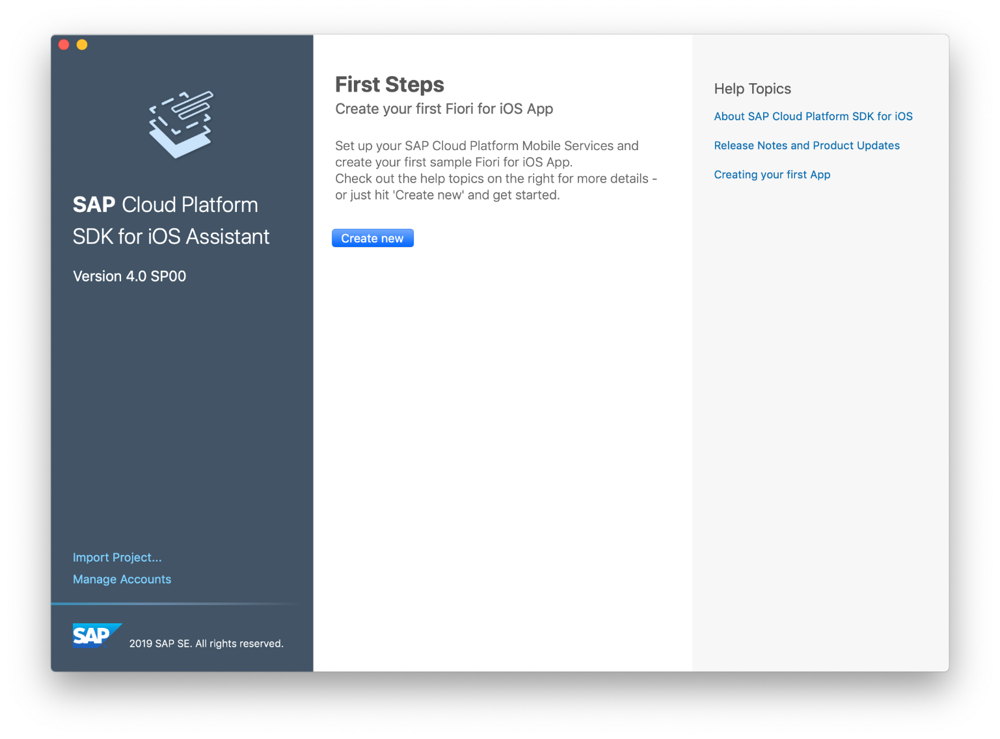

[DONE]
[ACCORDION-END]

[ACCORDION-BEGIN [Step 2: ](Create a new cloud application)]

For this tutorial, you will create a new cloud application configuration in Mobile Services, which will be configured to access data for packages being delivered.

Click the **Create new** button in the **First Steps** section. The first step of the workflow asks you to choose whether to create a sample app, use an existing cloud app configuration, or create a new one.

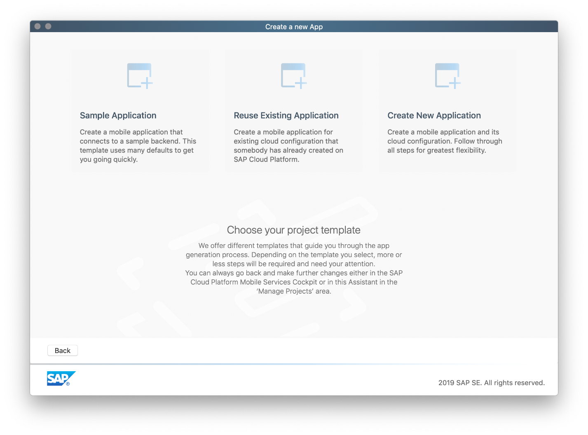

Click the **Create new Application** tile on the right side of the **Create a new App** step. This will allow us to create both a server-side configuration for the app, and it will generate a new Xcode project for an iOS app.

Next select your **SAP Cloud Platform Mobile Services account** and click **Next**.
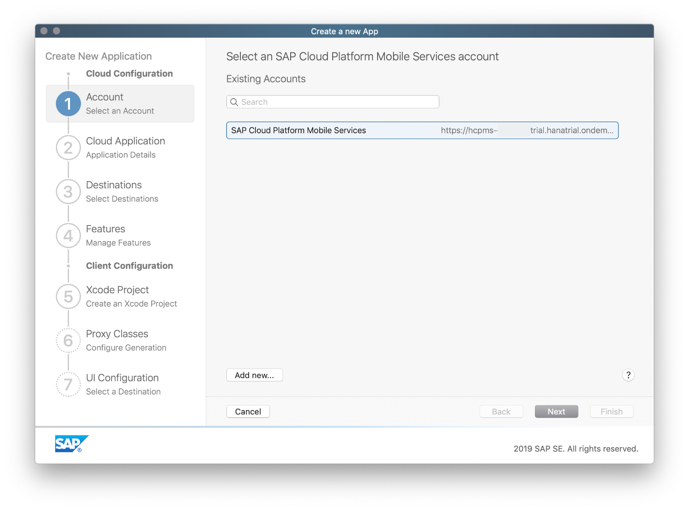

In the **Add an SAP Cloud Platform Mobile Services application** step, add the needed application details to create an application in your mobile services account.

Enter the following details:

| Field | Value |
|----|----|
| Application Name | `MyDeliveries` |
| Identifier | `com.sap.tutorials.demoapp.MyDeliveries` |
| Authentication | `OAuth2` |

> **Note:** The name of the cloud application does not need to match your iOS app name, and often won't; your iOS app may access multiple cloud applications. The Application Identifier, however, must be unique across all of your configured cloud applications, and typically follows a reverse-DNS format.

Click **Next** to advance to the **Destinations** step.

[DONE]
[ACCORDION-END]

[ACCORDION-BEGIN [Step 3: ](Create a new destination)]

In the **Destinations** step, you can define the backend connection. Here you will add the OData endpoint for the `DeliveryService` OData service.

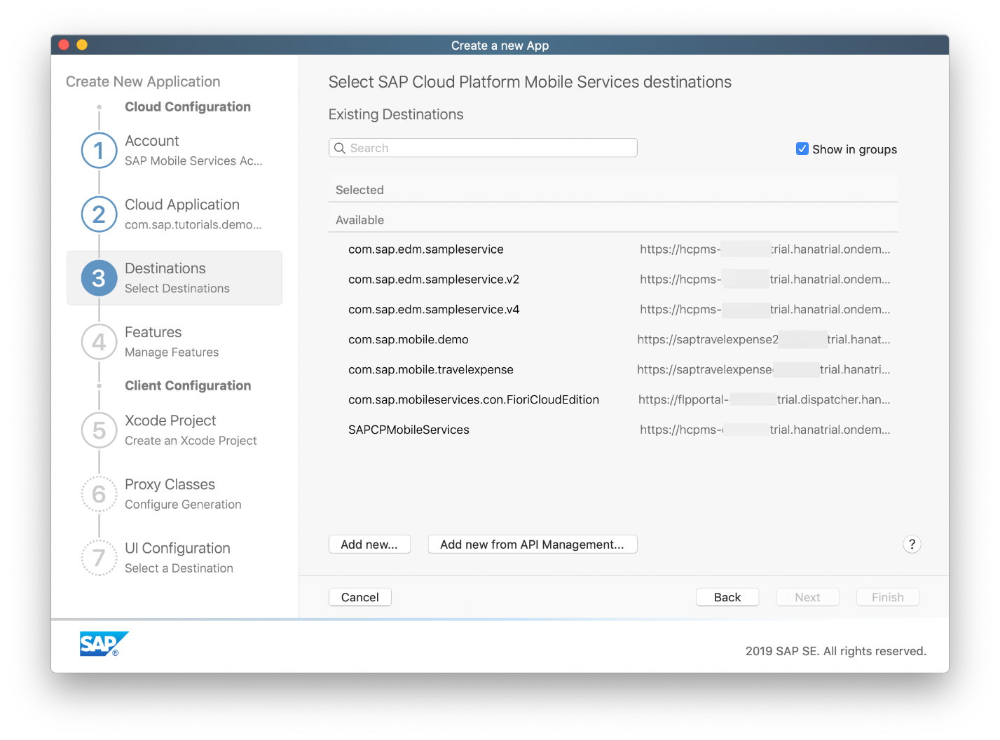

Click the **Add new...** button. A dialog opens:

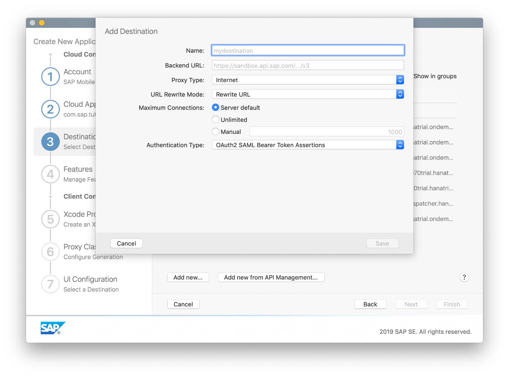

Enter the following details:

| Field | Value |
|----|----|
| Name | `com.sap.tutorials.demoapp.MyDeliveries` |
| Backend URL | `https://sapdevsdd27584c4.us2.hana.ondemand.com/codejam/wwdc/services/DeliveryService.xsodata` |
| Proxy Type | `Internet` |
| URL Rewrite Mode | `Rewrite URL` |
| Maximum connections | `Server default` |
| Authentication Type | `No Authentication` |

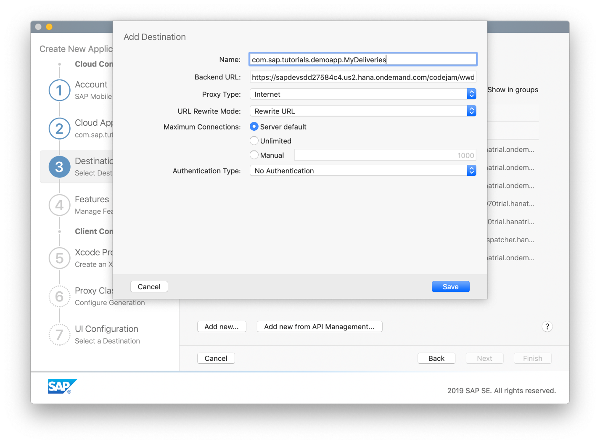

Click **Save** to save the new destination pointing to the backend. It is automatically selected:

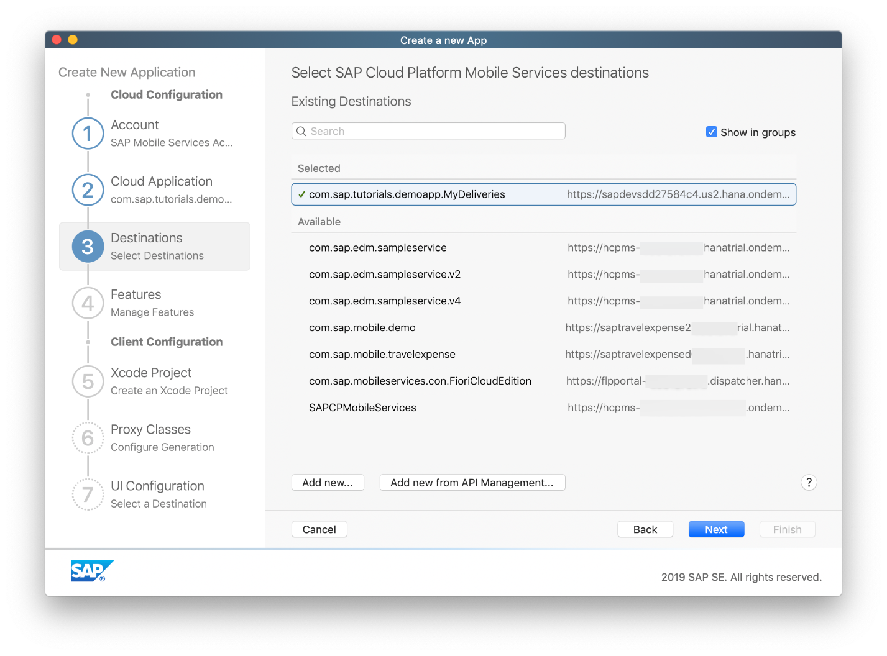

Click **Next** to advance to the **Features** step.

[DONE]
[ACCORDION-END]

[ACCORDION-BEGIN [Step 4: ](Enable features)]

In the **Optional Features** step, you have the option to enable **logging** and **log uploads**, enable **remote notifications**, use **Discovery Service** and whether to use **Online** or **Offline** OData.

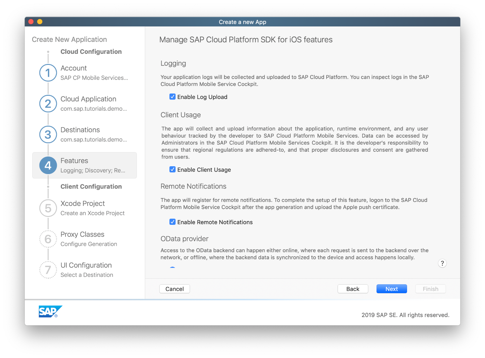

Make sure the checkboxes **Enable Log Upload**, **Enable Remote Notifications** and **Use Discovery Service for Application bootstrapping** are selected, and the **OData Provider** radio button is set to **Enable Online OData** and click **Next** to proceed to the **Xcode Project** step.

[DONE]
[ACCORDION-END]

[ACCORDION-BEGIN [Step 5: ](Set up Xcode Project)]

In the **Xcode Project configuration** step you will set up your actual Xcode project for development later on.
Enter the following details:

| Field | Value |
|----|----|
| Product Name | `MyDeliveries` |
| Organization Name | `<your company name>` |
| Organization Identifier | `com.tutorials.demoapp` |
| Path | `<choose a local destination>` |

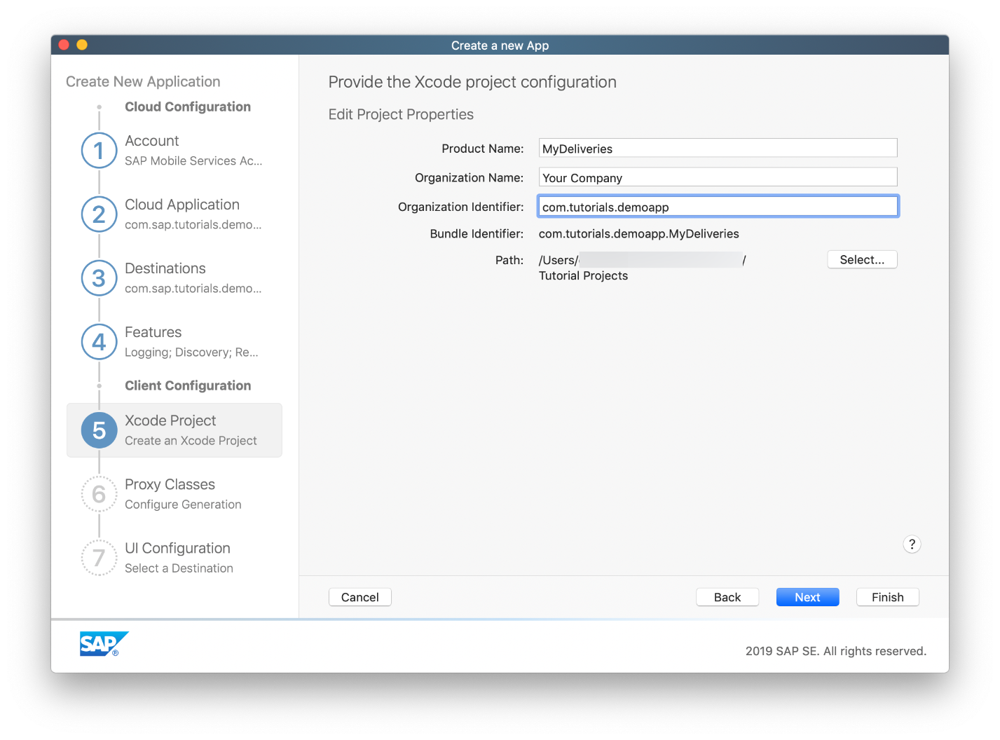

Click **Next** to advance to the **Proxy Classes** step. Here you can see what destination is going to be used to pull the Metadata of the OData Service to generate the OData Proxy Classes.

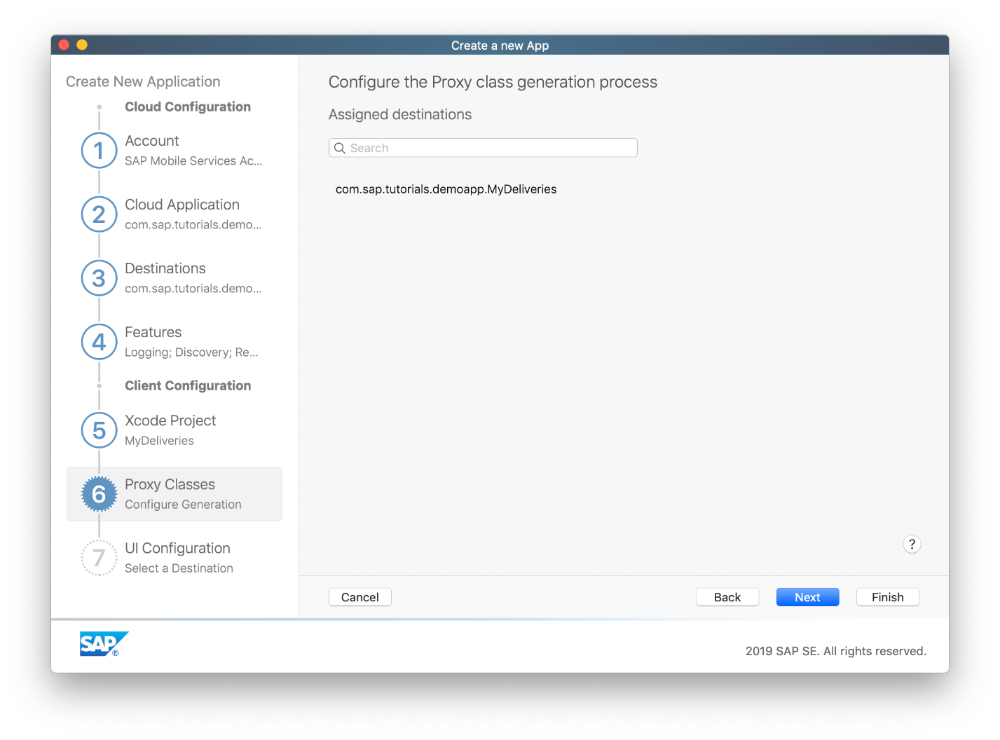

Click **Next** to go to the **UI Configuration** step. Set the **Destination** radio button to **Master / Detail View with Onboarding for destination:** and click finish.

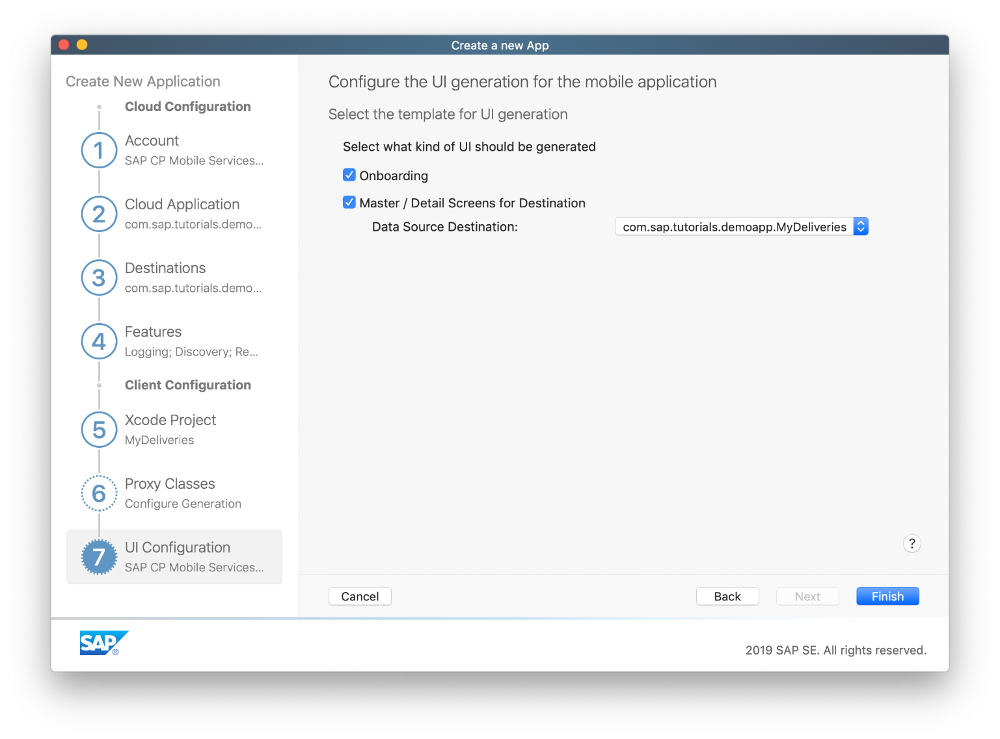

[DONE]
[ACCORDION-END]

[ACCORDION-BEGIN [Step 6: ](Generate the Xcode project)]

After you have clicked **Finish** in the previous step, the SDK Assistant now loads the OData service's metadata. This metadata describes the data model, and can be accessed via `<service URL>$metadata`. For your service, the metadata URL is `https://sapdevsdd27584c4.us2.hana.ondemand.com/codejam/wwdc/services/DeliveryService.xsodata/$metadata`
Based on this metadata, the OData proxy classes will be generated for the Xcode project.

In addition, the configuration settings you have provided in the SDK Assistant are now being sent to SAP Cloud Platform Mobile Services.

> **Note:** If you have already 5 native applications defined in SAP Cloud Platform Mobile Services, the SDK Assistant will give you an error.

> In that case, log on to your **SAP Cloud Platform mobile Services** account at `https://hcpmsadmin-<your_user_id>trial.dispatcher.hanatrial.ondemand.com/` and navigate to **Mobile Applications > Native/Hybrid**. Select one of the available application configurations and delete it in order for the SDK Assistant to add the new application configuration.

[DONE]
[ACCORDION-END]

[ACCORDION-BEGIN [Step 7: ](Examine the generated Xcode project)]

You can now select the `MyDeliveries` application project under **Recent Projects** in the SDK Assistant's starting screen.

> If Xcode does not open automatically to show your project, click on the project name in the SDK Assistant and click **Open**.

In Xcode, the left-hand sidebar of the window shows various Navigators for exploring your project, source control, debugging, and so on. If it's not already selected, select the **Project Navigator** by clicking on the folder icon above the left-hand sidebar. This shows all of the files in the project.

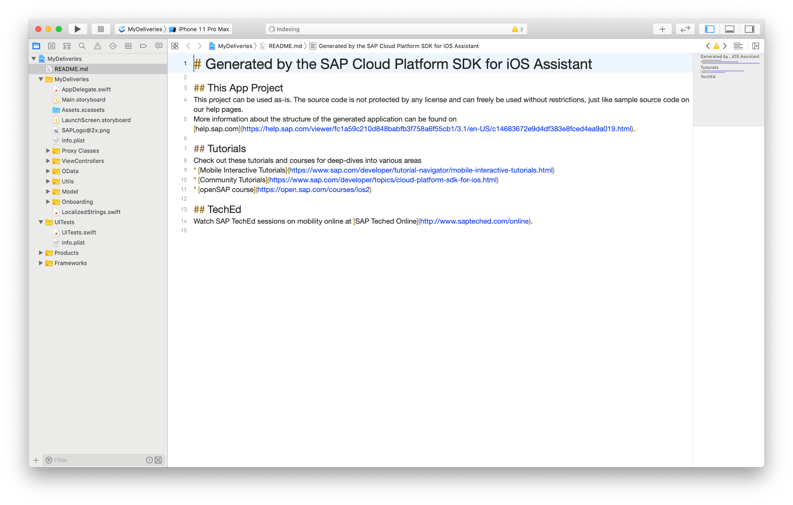

The `Main.storyboard` file shows a split-view setup for the generated Master-Detail views.

The `MyDeliveries/Onboarding` folder contains logic for the user onboarding, authentication and handling of `passcodes` and Touch ID.

The `MyDeliveries/Proxy Classes` folder contains the OData proxy classes generated from the OData service. The `DeliveryService.swift` file in the `Proxy Classes/public` folder acts as a data service provider to gain access to the OData entities. The two files `PackagesType.swift` and `DeliveryStatusType.swift` are classes for the OData entities `Packages` and `DeliveryStatus`, respectively. These classes give access to the various properties of the OData entities.

The `ViewControllers/PackagesType` and `ViewControllers/DeliveryStatusType` folders contain the master and detail view controllers as well as a storyboard for the `Packages` and `DeliveryStatus` entities, respectively.

[VALIDATE_1]
[ACCORDION-END]
