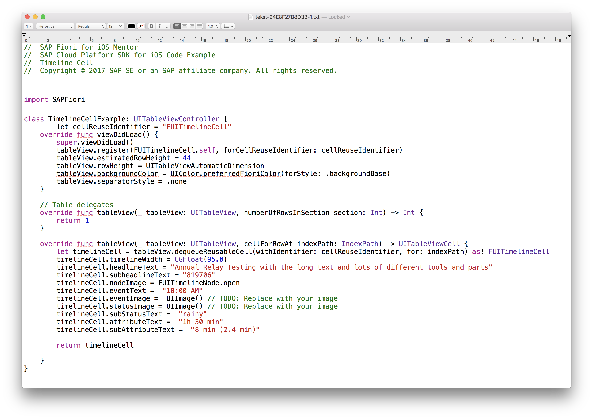
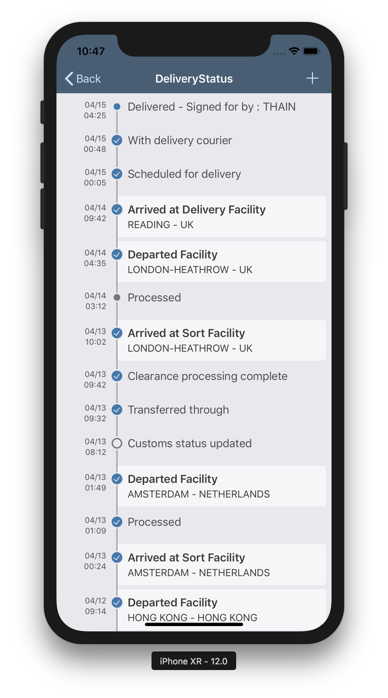

## Prerequisites  
- **Development environment:** Apple iMac, MacBook or MacBook Pro running Xcode 10 or higher
- **SAP Cloud Platform SDK for iOS:** Version 3.0

## Details
### You will learn  
  - How to use the SAP Fiori Mentor iPad app to explore the `FUITimeline`
  - How to use the sample code to extend the previously generated app to show tracking information in a nice and clear way

---

[ACCORDION-BEGIN [Step 1: ](Change sort order)]

By default, if you tap on the `DeliveryStatus` in the detail page for a selected `Package`, you would get the related entities in whatever order the OData service returns them. Ideally, you want these to show sorted, with the latest status on top.

In Xcode, open the file `MyDeliveries/ViewControllers/PackagesType/PackagesTypeDetailViewController.swift` and locate function `tableView(_:, didSelectRowAt indexPath:)`. You can also use the `Open Quickly` feature of Xcode to search for the `PackagesTypeDetailViewController` class with `Command + Shift + O`.

When you tap on the 5th row named `DeliveryStatus`, the associated storyboard is loaded, and the `PackageType`'s related `DeliveryStatusType` entities are loaded using the `self.deliveryService.loadProperty` function.

Currently, the function receives two arguments; the associated property and the instance field into which the results should be stored. However, the function can receive a 3rd argument with a `DataQuery` instance.

Since we want the results in descending order, add the following as a 3rd argument:

```swift
DataQuery().orderBy(DeliveryStatusType.deliveryTimestamp, SortOrder.descending)
```

...so the code with the function call looks like this:

```swift
self.deliveryService.loadProperty(PackagesType.deliveryStatus,
                                  into: self.entity,
                                  query: DataQuery().orderBy(DeliveryStatusType.deliveryTimestamp,
                                                             SortOrder.descending)) { error in
    self.hideFioriLoadingIndicator()
    if let error = error {
        completionHandler(nil, error)
        return
    }
    completionHandler(self.entity.deliveryStatus, nil)
}
```

The function now receives a query object, indicating you want to sort on the `deliveryTimestamp` field of the `DeliveryStatusType` entity, in descending order.

[DONE]
[ACCORDION-END]

[ACCORDION-BEGIN [Step 2: ](Explore timeline cells with SAP Fiori Mentor app)]

Since we want to display the `DeliveryStatus` items in a timeline, the best way to achieve this is to use the SDK's `FUITimeline` table view cell control. A great tool for exploring SAP Fiori for iOS controls and help implementing these into your project is the **SAP Fiori Mentor app**. This is a companion tool to the SDK, and can be downloaded for iPad from the Apple App Store.

Open the SAP Fiori Mentor app on your iPad. Upon opening, the app shows an overview page:


Tap on **See All** next to the **UI Components** section, and scroll down until you see the **Timeline Cell** tile:


Tap the **Timeline Cell** tile. You now see a page with a representation of the SAP Fiori Timeline cell, and a couple of preset styles to change the look and feel for the control.


You can also customize the look and feel on a more granular level. Tap the **button with three dots** in the lower right corner. This will bring a pop up where you can specify different settings for the control. The control's look and feel is instantly updated, giving you an idea of the final result:


When you're happy with the final result, tap the **Code button** (the one labeled `</>`). This will bring a pop up with a sample `UITableViewController` class, and all the properties you have set or enabled in the **Control Settings** pop-up are reflected in the generated code:


To use the generated code in Xcode, tap the **Share** button in the top-right, and use **AirDrop** to transfer to your Mac:


Open the downloaded text file:



The generated code can now be implemented into the appropriate places in the `TrackingInfoViewController.swift` file.

> Since it may take a bit too long to go through the steps of copying and pasting the code, adding the control binding to the Proxy Classes' properties and format the data properly, you don't need to do this yourself. The code to implement will be provided in the next step.

[DONE]
[ACCORDION-END]

[ACCORDION-BEGIN [Step 3: ](Initialize table layout)]

In this step, you implement the Fiori Timeline cells to show the `DeliveryStatus` entities in a logical way.

Open the file `./MyDeliveries/ViewControllers/DeliveryStatusType/DeliveryStatusTypeMasterViewController.swift` and locate the function `viewDidLoad()`. You can also use the `Open Quickly` feature of Xcode to search for the `DeliveryStatusTypeMasterViewController.swift` class with `Command + Shift + O`.

Locate the line `self.tableView.estimatedRowHeight = 98` and remove it.

In place of the just removed line of code, add the following:

```swift
self.tableView.register(FUITimelineCell.self, forCellReuseIdentifier: "FUITimelineCell")
self.tableView.register(FUITimelineMarkerCell.self, forCellReuseIdentifier: "FUITimelineMarkerCell")
self.tableView.estimatedRowHeight = 44
self.tableView.backgroundColor = UIColor.preferredFioriColor(forStyle: .backgroundBase)
self.tableView.separatorStyle = .none
```

> The above code originated from the **SAP Fiori for iOS Mentor** app, but has been slightly modified to show both `FUITimelineCell` and `FUITimelineMarkerCell` control.

[DONE]
[ACCORDION-END]

[ACCORDION-BEGIN [Step 4: ](Implement FUITimelineCell logic)]

Next, locate function `tableView(_ tableView:, cellForRowAt indexPath:)`.

Replace it with the following:

```swift
override func tableView(_ tableView: UITableView, cellForRowAt indexPath: IndexPath) -> UITableViewCell {
    let deliverystatustype = self.entities[indexPath.row]
    if deliverystatustype.selectable != 0 {
        return self.getFUITimelineCell(deliverystatustype: deliverystatustype, indexPath: indexPath)
    }
    else {
        return self.getFUITimelineMarkerCell(deliverystatustype: deliverystatustype, indexPath: indexPath)
    }
}

```

Finally, add the following functions:

```swift
private func getFUITimelineMarkerCell(deliverystatustype: DeliveryStatusType, indexPath: IndexPath) -> UITableViewCell {

    let cell = tableView.dequeueReusableCell(withIdentifier: "FUITimelineMarkerCell", for: indexPath)
    guard let timelineCell = cell as? FUITimelineMarkerCell else {
        return cell
    }
    timelineCell.nodeImage = self.getNodeImage(statusType: deliverystatustype.statusType!)
    timelineCell.showLeadingTimeline = indexPath.row == 0 ? false : true
    timelineCell.showTrailingTimeline = indexPath.row == self.entities.count - 1 ? false : true
    timelineCell.eventText = self.getFormattedDateTime(timestamp: deliverystatustype.deliveryTimestamp!)
    timelineCell.titleText = deliverystatustype.status

    return timelineCell
}

private func getFUITimelineCell(deliverystatustype: DeliveryStatusType, indexPath: IndexPath) -> UITableViewCell {

    let cell = tableView.dequeueReusableCell(withIdentifier: "FUITimelineCell", for: indexPath)
    guard let timelineCell = cell as? FUITimelineCell else {
        return cell
    }
    timelineCell.nodeImage = self.getNodeImage(statusType: deliverystatustype.statusType!)
    timelineCell.eventText = self.getFormattedDateTime(timestamp: deliverystatustype.deliveryTimestamp!)
    timelineCell.headlineText = deliverystatustype.status
    timelineCell.subheadlineText = deliverystatustype.location

    return timelineCell
}

private func getFormattedDateTime(timestamp: LocalDateTime) -> String {
    let formatter = DateFormatter()
    formatter.dateFormat = "MM/dd HH:mm"

    return formatter.string(from: timestamp.utc())
}

private func getNodeImage(statusType: String) -> UIImage {
    switch statusType {
    case "start"    : return FUITimelineNode.start
    case "inactive" : return FUITimelineNode.inactive
    case "complete" : return FUITimelineNode.complete
    case "earlyEnd" : return FUITimelineNode.earlyEnd
    case "end"      : return FUITimelineNode.end
    default         : return FUITimelineNode.open
    }
}
```

The changed function `tableView(_ tableView:, cellForRowAt indexPath:)` decides based on `DeliveryStatus` property `selectable` which specific timeline cell to render. The rendering is done via two private functions `getFUITimelineMarkerCell(deliverystatustype:, indexPath:)` and `getFUITimelineCell(deliverystatustype:, indexPath:)`.

> These two private functions are implemented based on the code from the **SAP Fiori for iOS Mentor** app, but the code from the Mentor app has been split into two separate functions and control binding has already been implemented for easier implementation in this tutorial.

The final two private functions are helpers to format the timestamp into something more readable, and to get the correct `FUITimelineNode` image indicator based on the `DeliveryStatus` property `StatusType`.

[DONE]
[ACCORDION-END]

[ACCORDION-BEGIN [Step 5: ](Remove the DeliveryStatusType from the collections screen)]

Since you're not interested in displaying the whole collection of `DeliveryStatusType` objects from the Collections screen, you may want to remove it so you only have the `Packages` visible.

Open file `./MyDeliveries/Model/CollectionType.swift` and change the constant `all` to only return packages:

```swift
static let all = [
    packages
]
```

[DONE]
[ACCORDION-END]


[ACCORDION-BEGIN [Step 6: ](Run the application)]

Build and run the application. Navigate to the `Packages` master page and select a package. If you now tap on the `DeliveryStatus` cell, you'll navigate to the `DeliveryStatusTypeMasterViewController`, and the `Package`'s related `DeliveryStatus` records are now shown in descending order using two flavors of the **Fiori Timeline** cell control.



[VALIDATE_1]
[ACCORDION-END]

---
