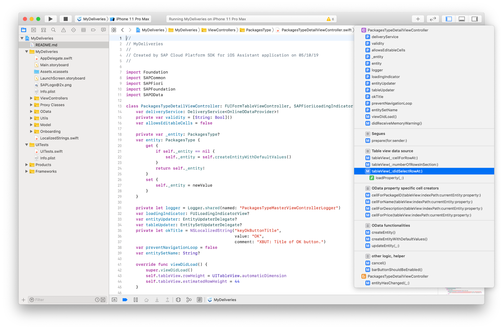
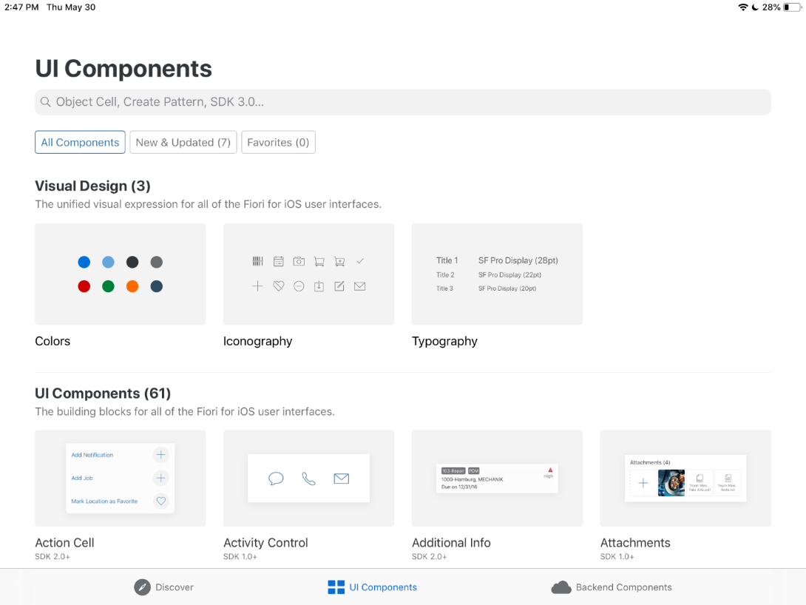
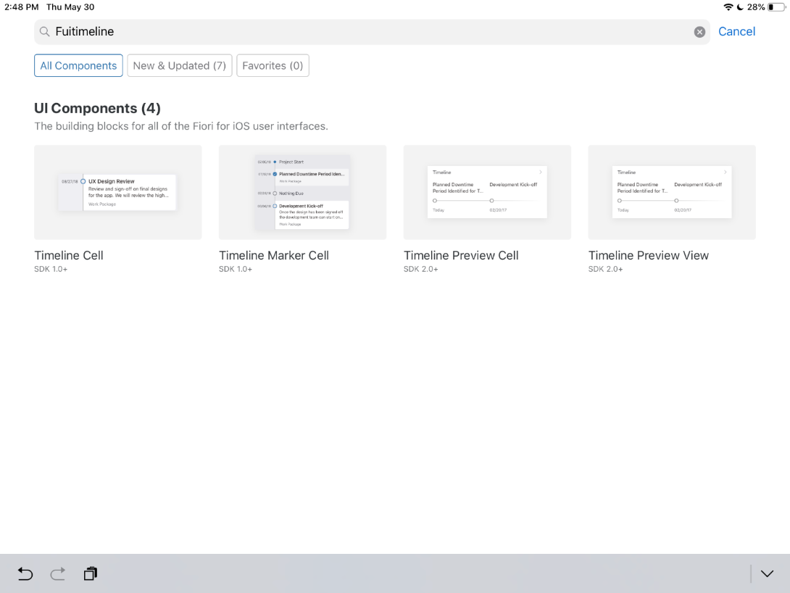
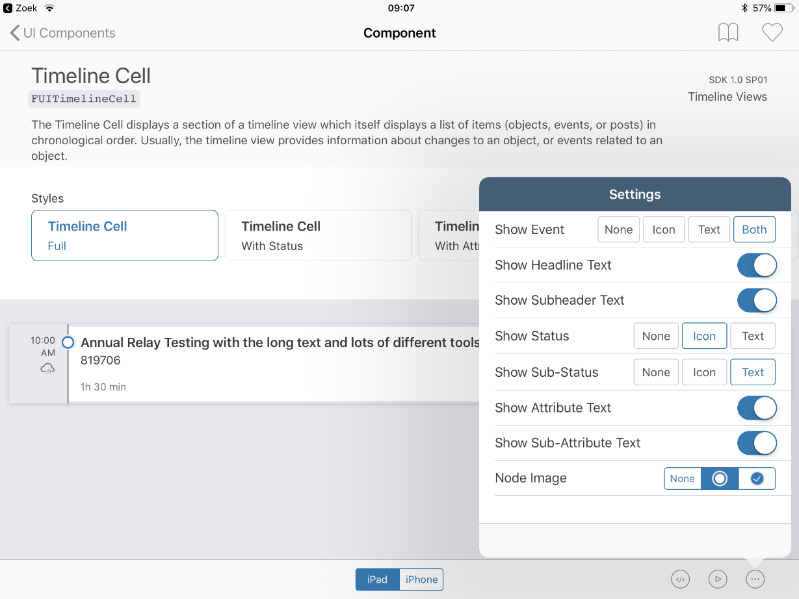
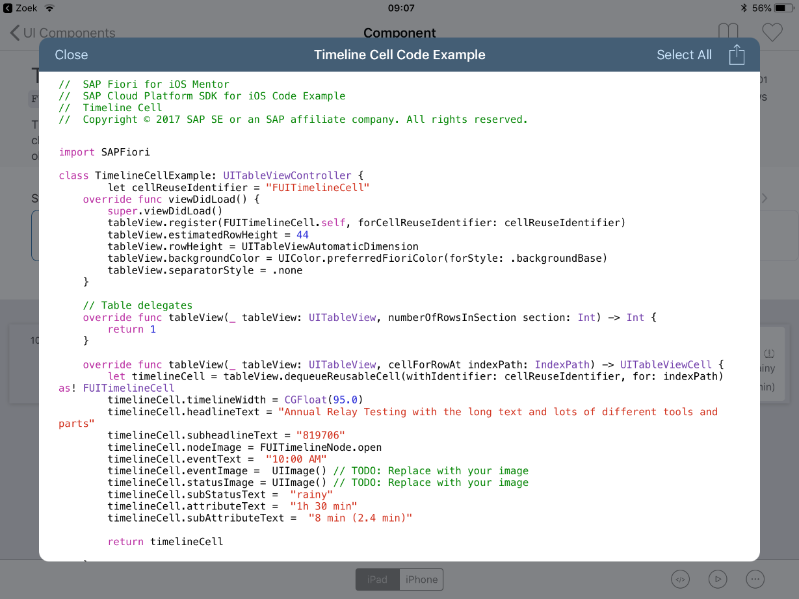
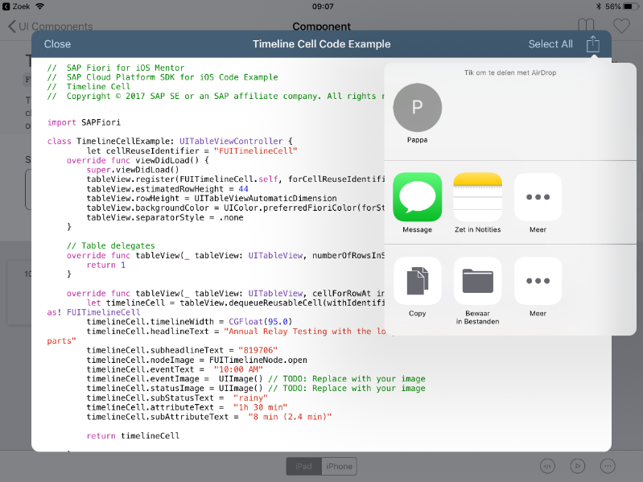
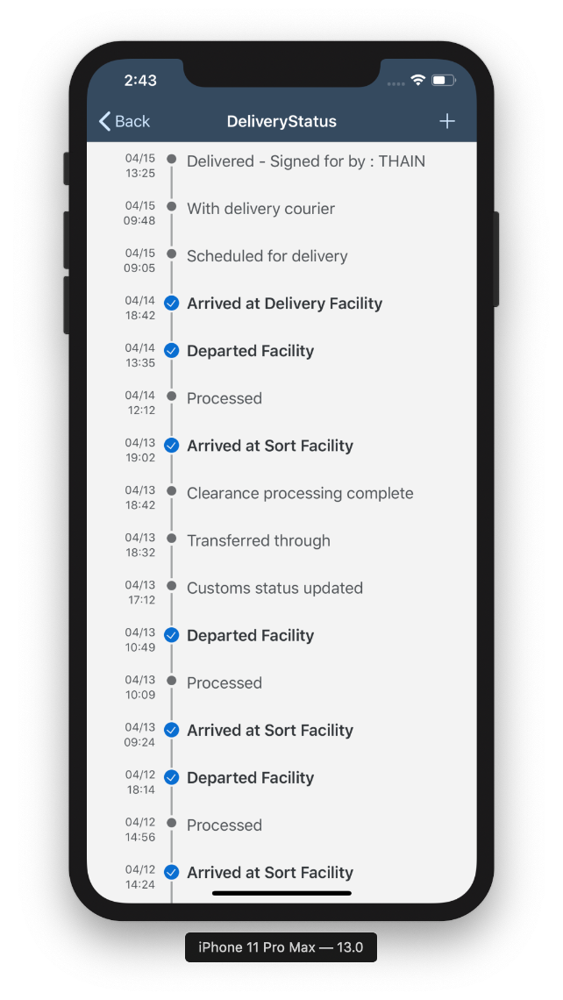

## Prerequisites  
- **Development environment:** Apple Mac running macOS High Sierra or higher with Xcode 10 or higher
- **SAP Cloud Platform SDK for iOS:** Version 3.0

## Details
### You will learn  
  - How to use the SAP Fiori Mentor iPad app to explore the `FUITimelineCell`
  - How to use the sample code to extend the previously generated app to show tracking information in a nice and clear way

---

[ACCORDION-BEGIN [Step 1: ](Change sort order)]

By default, if the user taps on the **`DeliveryStatus`** row in the detail page for a selected package, the related entities are displayed in whatever order the OData service returns them. Ideally, these would be sorted, with the latest status update on top.

In Xcode, open `PackagesTypeDetailViewController.swift` and locate the function `tableView(_:didSelectRowAt:)`.

> **Hint:** You can use the `Open Quickly` feature of Xcode to search for the `PackagesTypeDetailViewController` class with `Command + Shift + O`. Once you've opened the file, you can quickly jump to the `tableView(_:didSelectRowAt:)` function by using the **jump bar** at the top of the editor area pane.

**FIXME: INSERT JUMP BAR SCREENSHOT HERE**



When the user runs the application, selects a package, and taps on the 5th row of the package detail (**`DeliveryStatus`**), this function is called. It loads the associated storyboard for displaying the delivery status UI, and it sets up code that will load the package's related delivery status entities by way of the `self.deliveryService.loadProperty` function.

Inside the `tableView(_:didSelectRowAt:)` function, look for the following lines, which load the `deliveryStatus` property:

```swift
self.deliveryService.loadProperty(PackagesType.deliveryStatus, into: self.entity) { error in
  self.hideFioriLoadingIndicator()
  if let error = error {
    completionHandler(nil, error)
    return
  }
  completionHandler(self.entity.deliveryStatus, nil)
}
```

Currently, the `loadProperty` function receives two arguments: the associated property (`PackagesType.deliveryStatus`) and the `entity` into which the results should be stored (the object for the currently selected package). However, the function can receive a 3rd argument with a `DataQuery` instance, which further modifies the query used to fetch the related entities. Since we want the results in descending order, we'll add a data query that specifies descending order for the delivery timestamps.

Create a new `sortQuery` constant for the data query just **above** those lines:

```swift
let sortQuery = DataQuery().orderBy(DeliveryStatusType.deliveryTimestamp, .descending)
```

Then insert the `sortQuery` constant as the 3rd argument to the `self.deliveryService.loadProperty` function:

```swift
self.deliveryService.loadProperty(PackagesType.deliveryStatus, into: self.entity, query: sortQuery) { error in
```

The function now receives a query object, indicating you want to sort on the `deliveryTimestamp` field of the `DeliveryStatusType` entity, in descending order.

[DONE]
[ACCORDION-END]

[ACCORDION-BEGIN [Step 2: ](Explore timeline cells with SAP Fiori Mentor app)]

Since we want to display the `DeliveryStatus` items in a timeline, the best way to achieve this is to use the SDK's `FUITimeline` table view cell control. A great tool for exploring SAP Fiori for iOS controls and help implementing these into your project is the **SAP Fiori Mentor app**. This is a companion tool to the SDK, and can be downloaded for iPad from the App Store.

Open the SAP Fiori Mentor app on your iPad. Upon opening, the app shows an overview page:


Tap on **See All** next to the **UI Components** section, and scroll down until you see the **Timeline Cell** tile:



Tap the **Timeline Cell** tile. You now see a page with a representation of the SAP Fiori Timeline cell, and a couple of preset styles to change the look and feel for the control.



You can also customize the look and feel on a more granular level. Tap the **button with three dots** in the lower right corner. This will bring a pop up where you can specify different settings for the control. The control's look and feel is instantly updated, giving you an idea of the final result:



When you're happy with the final result, tap the **Code button** (the one labeled `</>`). This will bring a pop up with a sample `UITableViewController` class, and all the properties you have set or enabled in the **Control Settings** pop-up are reflected in the generated code:



If you are using your own Mac and iPad that are both logged into the same iCloud account, you can tap the **Share** button in the top-right, and tap **Copy** to copy the code to the Universal Clipboard. You can then paste it directly into Xcode on your Mac.



> **Note:** For this exercise, you don't need to do this yourself. The code to implement will be provided in the next step.

[DONE]
[ACCORDION-END]

[ACCORDION-BEGIN [Step 3: ](Implement the FUITimelineCell into your UITableView)]

In this step, you implement the Fiori Timeline cells to show the `DeliveryStatus` entities in a logical way. To do that we have to implement the right code into the `DeliveryStatusTypeMasterViewController.swift` class.

Open the file `./MyDeliveries/ViewControllers/DeliveryStatusType/DeliveryStatusTypeMasterViewController.swift` and locate the function `viewDidLoad()`. You can also use the `Open Quickly` feature of Xcode to search for the `DeliveryStatusTypeMasterViewController.swift` class with `Command + Shift + O`.

Locate the line `self.tableView.estimatedRowHeight = 98` and remove it.

In place of the just removed line of code, add the following:

```swift
self.tableView.register(FUITimelineCell.self, forCellReuseIdentifier:"FUITimelineCell")
self.tableView.register(FUITimelineMarkerCell.self, forCellReuseIdentifier: "FUITimelineMarkerCell")
self.tableView.estimatedRowHeight = 44
self.tableView.backgroundColor = UIColor.preferredFioriColor(forStyle: .backgroundBase)
self.tableView.separatorStyle = .none
```

> The above code originated from the **SAP Fiori for iOS Mentor** app, but has been slightly modified to show both `FUITimelineCell` and `FUITimelineMarkerCell` control.

[DONE]
[ACCORDION-END]

[ACCORDION-BEGIN [Step 4: ](Implement FUITimelineCell logic)]

Next, locate the function `tableView(_:cellForRowAt:)` and replace the existing function with the code below:

```swift
override func tableView(_ tableView: UITableView, cellForRowAt indexPath: IndexPath) -> UITableViewCell {
    let deliveryStatusType = self.entities[indexPath.row]
    if deliveryStatusType.selectable != 0 {
        return timelineCell(representing: deliveryStatusType, forRowAt: indexPath)
    } else {
        return timelineMarkerCell(representing: deliveryStatusType, forRowAt: indexPath)
    }
}
```

Add the following functions right below the `tableView(_:cellForRowAt:)` function:

```swift

private lazy var dateFormatter: DateFormatter = {
    let formatter = DateFormatter()
    formatter.dateFormat = "MM/dd HH:mm"
    return formatter
}()

private func timelineMarkerCell(representing deliveryStatusType: DeliveryStatusType, forRowAt indexPath: IndexPath) -> FUITimelineMarkerCell {
    let cell = tableView.dequeueReusableCell(withIdentifier: "FUITimelineMarkerCell", for: indexPath) as! FUITimelineMarkerCell

    cell.nodeImage = nodeImage(for: deliveryStatusType)
    cell.showLeadingTimeline = indexPath.row != 0
    cell.showTrailingTimeline = indexPath.row != (self.entities.count - 1)
    cell.eventText = dateFormatter.string(from: deliveryStatusType.deliveryTimestamp!.utc())
    cell.titleText = deliveryStatusType.status

    return cell
}

private func timelineCell(representing deliveryStatusType: DeliveryStatusType, forRowAt indexPath: IndexPath) -> FUITimelineCell {

    let cell = tableView.dequeueReusableCell(withIdentifier: "FUITimelineCell", for: indexPath) as! FUITimelineCell

    cell.nodeImage = nodeImage(for: deliveryStatusType)
    cell.eventText = dateFormatter.string(from: deliveryStatusType.deliveryTimestamp!.utc())
    cell.headlineText = deliveryStatusType.status
    cell.subheadlineText = deliveryStatusType.location

    return cell
}

private func nodeImage(for deliveryStatusType: DeliveryStatusType) -> UIImage {
    switch deliveryStatusType.statusType! {
    case "start"    : return FUITimelineNode.start
    case "inactive" : return FUITimelineNode.inactive
    case "complete" : return FUITimelineNode.complete
    case "earlyEnd" : return FUITimelineNode.earlyEnd
    case "end"      : return FUITimelineNode.end
    default         : return FUITimelineNode.open
    }
}

```

The changed function `tableView(_:cellForRowAt:)` decides based on `DeliveryStatus` property `selectable` which specific timeline cell to render. The rendering is done via two private functions `timelineMarkerCell(representing:forRowAt:)` and `timelineCell(representing:forRowAt:)`.

> These two private functions are implemented based on the code from the **SAP Fiori for iOS Mentor** app, but the code from the Mentor app has been split into two separate functions and control binding has already been implemented for easier implementation in this tutorial.

The final two private functions are helpers to format the timestamp into something more readable, and to get the correct `FUITimelineNode` image indicator based on the `DeliveryStatus` property `StatusType`.

[DONE]
[ACCORDION-END]

[ACCORDION-BEGIN [Step 5: ](Remove the DeliveryStatusType from the collections screen)]

Since you're not interested in displaying the whole collection of `DeliveryStatusType` objects from the Collections screen, you may want to change it so you only have the `Packages` visible.

Open the file `./MyDeliveries/ViewControllers/CollectionsViewController.swift` and change the following line:

```swift
private var collections = CollectionType.all
```

...to the following:

```swift
private let collections = [CollectionType.packages]
```

[DONE]
[ACCORDION-END]


[ACCORDION-BEGIN [Step 6: ](Run the application)]

Build and run the application. Navigate to the `Packages` master page and select a package. If you now tap on the `DeliveryStatus` cell, you'll navigate to the `DeliveryStatusTypeMasterViewController`, and the package's related `DeliveryStatus` records are now shown in descending order using two flavors of the **Fiori Timeline** cell control.



[VALIDATE_1]
[ACCORDION-END]

---
