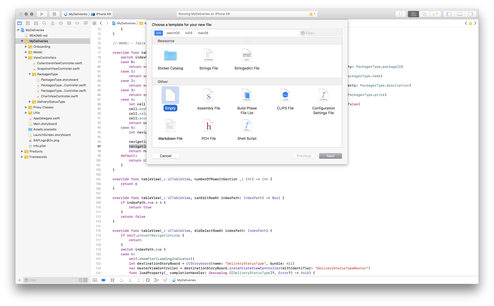
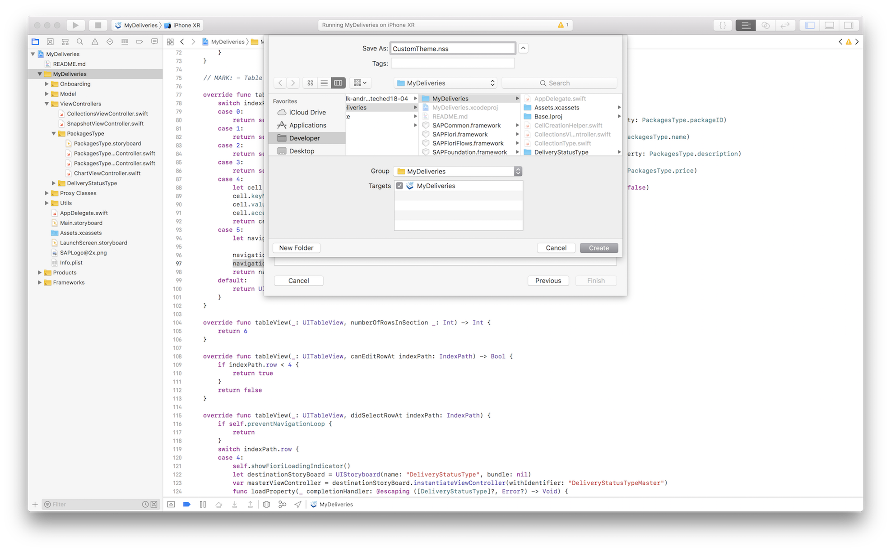
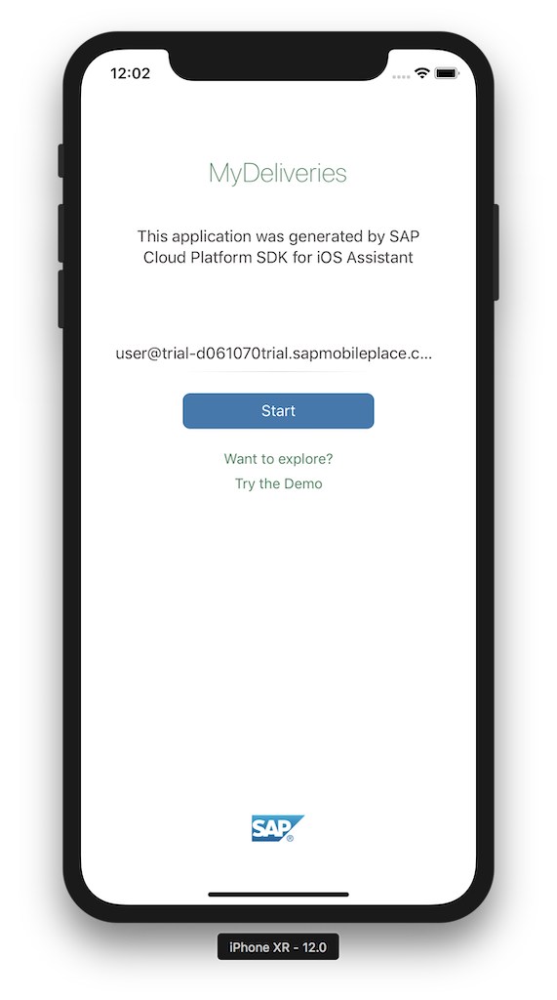
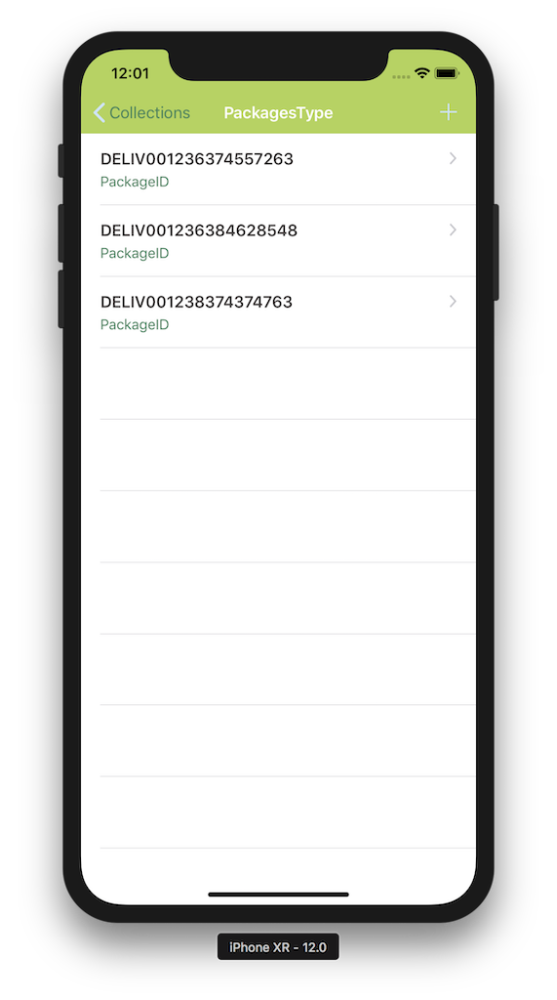
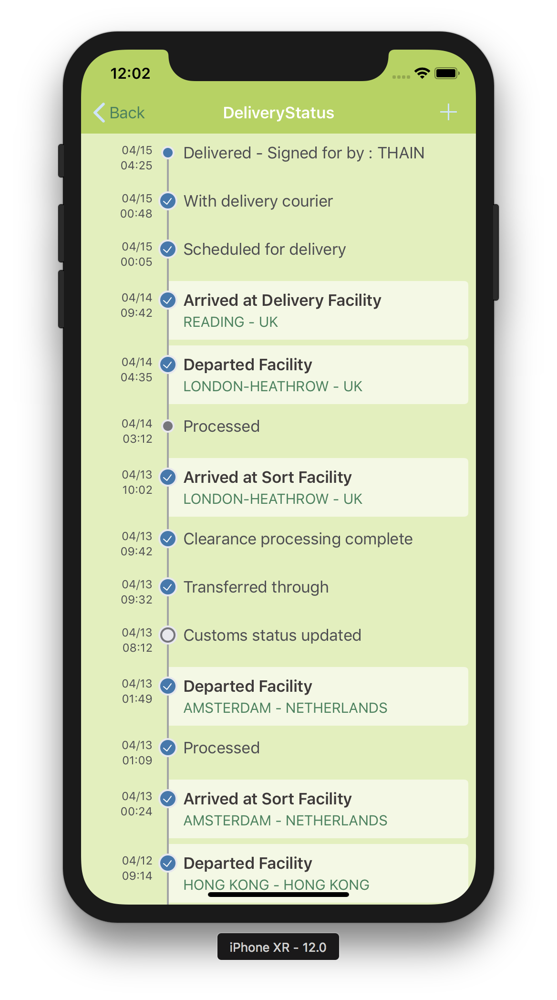
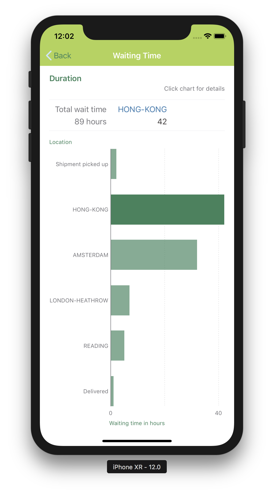

## Prerequisites  
- **Development environment:** Apple iMac, MacBook or MacBook Pro running Xcode 10 or higher
- **SAP Cloud Platform SDK for iOS:** Version 3.0

## Details
### You will learn  
  - How to apply a custom theme to your iOS app using [`NUI`](https://github.com/tombenner/nui).

`NUI` enables you to style iOS components with Style sheets similar to CSS. `NUI` is already integrated in the SAP Cloud Platform SDK for iOS so you don't need to install anything.

---

[ACCORDION-BEGIN [Step 1: ](Create a NUI stylesheet)]

In Xcode, right-click the `MyDeliveries` folder and from the context menu, select **New File...**. In the dialog, scroll down to the **Other** section and select the **Empty** template:



Click **Next** to proceed.

In the next screen, provide the following details:

| Field | Value |
|----|----|
| File Name | `CustomTheme.nss` |



Make sure it is saved in the `MyDeliveries` group and click **Create**. The new `CustomTheme.nss` file is now created in the root of your project.

[DONE]
[ACCORDION-END]

[ACCORDION-BEGIN [Step 2: ](Add styles to the stylesheet)]

The styles in the stylesheet can be applied to both standard iOS components such as `UINavigationBar`, `UITableView` etc. as well as SAP Fiori for iOS components.

For a reference of the standard iOS components classes, you can refer to [NUI style classes](https://github.com/tombenner/nui#style-classes).

For SAP Fiori for iOS components style classes, the following conventions should be followed:

- Global definitions
   - `fdl<lower camelcase enum name>_<property name>`
   - example: `fdlFontStyle_subheadline`

- SAP Fiori component specific definitions
   - `fdl<class name>_<property name>`
   - example: `fdlFUIWelcomeScreen_primaryActionButton`

Open the just created `CustomTheme.nss` file, and add the following:

```css
NavigationBar {
  bar-tint-color: #B0D450;
}

BarButton {
  font-color: #3A835B;
}

/* Onboarding Welcome Screen */
fdlFUIWelcomeScreen_headlineLabel {
  font-color: #3A835B;
}

/* Fiori subheadline */
fdlFontStyle_subheadline {
  font-style: subheadline;
  font-color: #3A835B;
}

/* Fiori Timeline cells */
fdlFUITimelineCell, fdlFUITimelineMarkerCell {
  background-color: #E0F0B9;
}

fdlFUITimelineCell_timelineBackground,
fdlFUITimelineMarkerCell_cardBackground,
fdlFUITimelineMarkerCell_timelineBackground {
  background-color: #E0F0B9;
}

/* Fiori Data Vizualization */
fdlFUIChartFloorplanViewController_title,
fdlFUIChartFloorplanViewController_seriesTitles,
fdlFUIChartFloorplanViewController_valuesAxisTitle,
fdlFUIChartFloorplanViewController_categoryAxisTitle {
  font-color: #3A835B;
}
```

This adds a light-green tint to the standard iOS navigation bar as well as a darker green for the navigation bar buttons.

The standard SAP Fiori `subheadline` font style (member of the SDK's `SAPFiori FDLFontStyle` enum) is also changed to green, as is the onboarding's application title and primary action button.

The SAP Fiori Timeline cells get a light green background, and the SAP Fiori Data Visualization chart texts will be the same dark green as the headlines.

[DONE]
[ACCORDION-END]


[ACCORDION-BEGIN [Step 3: ](Change chart bar color)]

The chart bars are normally not styled with a stylesheet, since you would rather have them colored based on their context and/or value.

However, you could easily change the default Fiori blue to a dark green color by adding the following line in the body of the `viewDidLoad` function inside the `ChartViewController`:

```swift
chartView.series.colors = [UIColor(hexString: "#3A835B")]
```

[DONE]
[ACCORDION-END]

[ACCORDION-BEGIN [Step 4: ](Load stylesheet)]

In order for your app to apply the custom styles, you need to tell your app to use the custom stylesheet.

Open the app's `AppDelegate.swift` file, and in function `application(_:didFinishLaunchingWithOptions:)`, at the top of the function's body, add the following line:

```swift
NUISettings.initWithStylesheet(name: "CustomTheme")
```

This tells your app to use `NUI` with your custom stylesheet `CustomTheme.nss`.

[DONE]
[ACCORDION-END]

[ACCORDION-BEGIN [Step 5: ](Build and run the app)]

First, remove the app from your device, so you will go through the onboarding again.

Then build and run the app.

When launched, you should see the restyled onboarding screen with the new theme:



If you proceed further, you will see the navigation bar is also styled:



And, unsurprisingly, the custom UI you have created earlier follows the same theme:





> For more on theming SAP Fiori for iOS components, see [Branding & Theming](https://help.sap.com/doc/978e4f6c968c4cc5a30f9d324aa4b1d7/Latest/en-US/Documents/Frameworks/SAPFiori/Branding%20and%20Theming.html)

> For more on `NUI`, see [NUI readme](https://github.com/tombenner/nui/)

[VALIDATE_1]
[ACCORDION-END]

---
