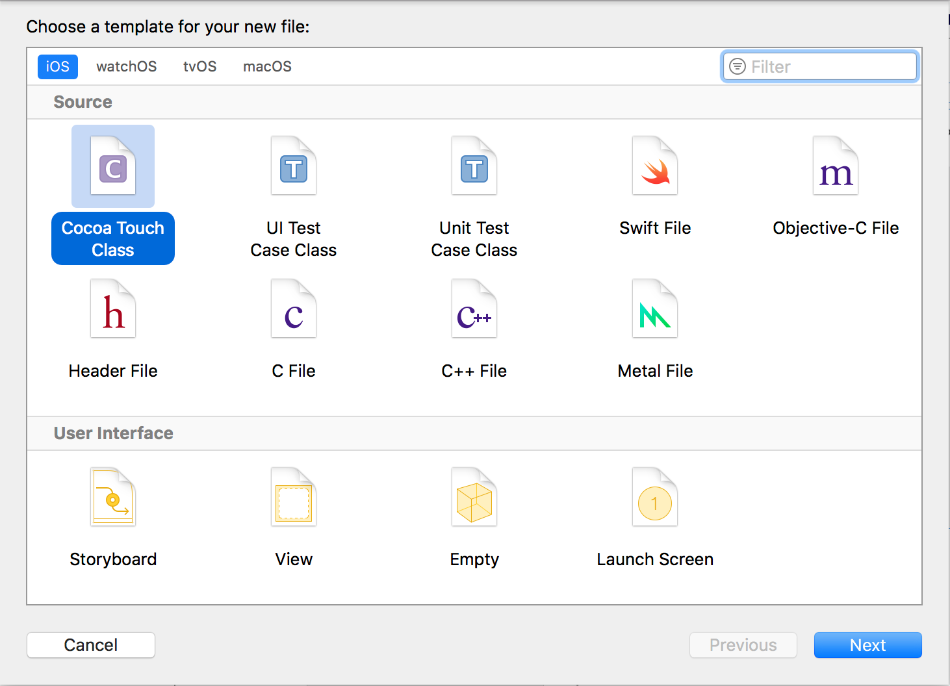
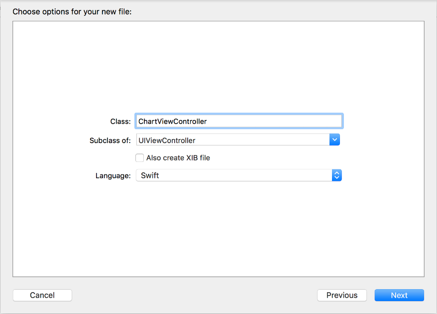
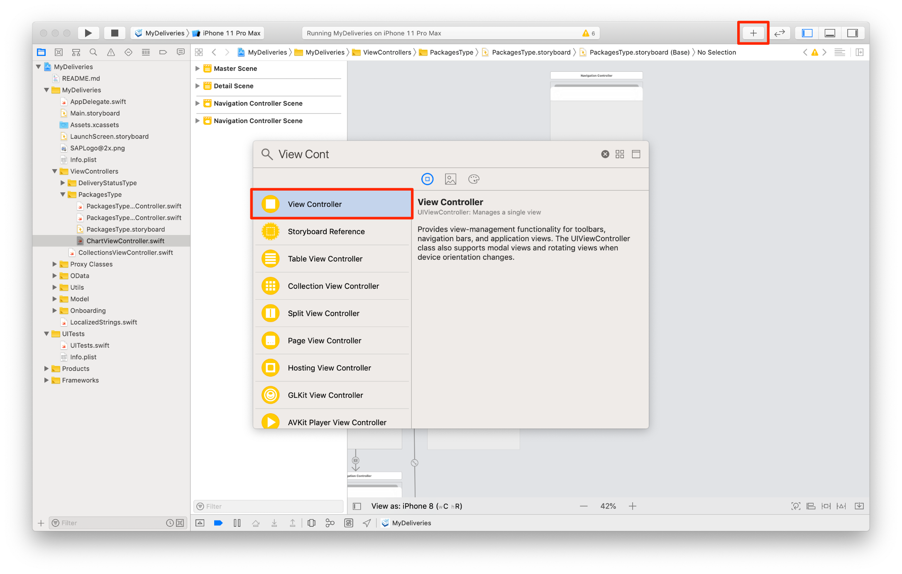
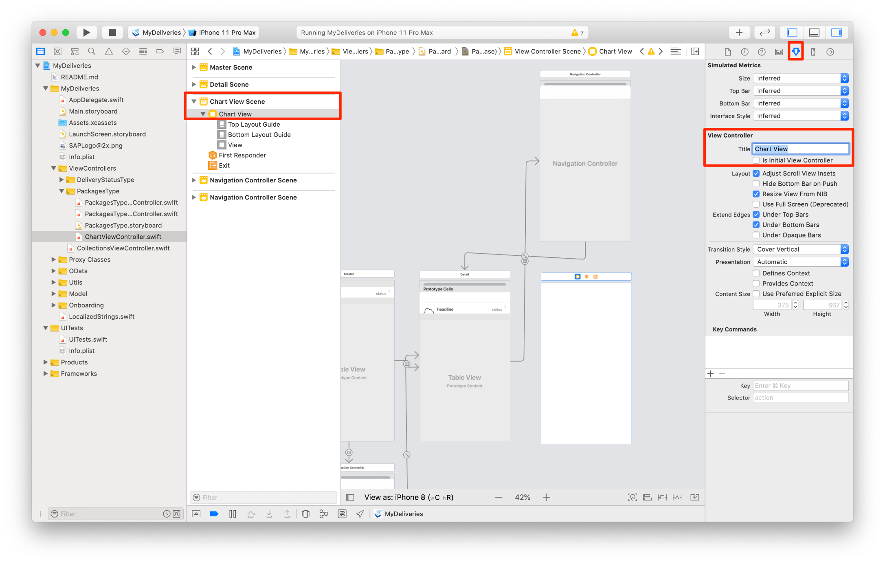
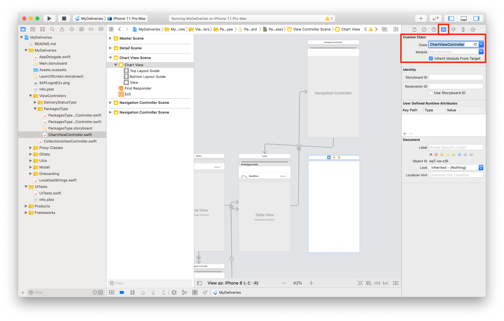
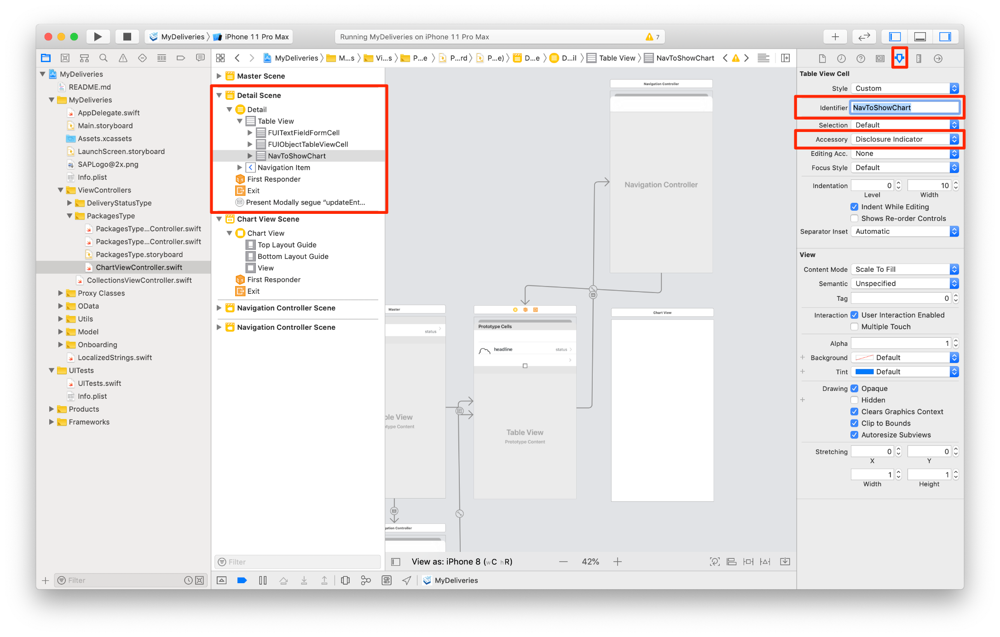
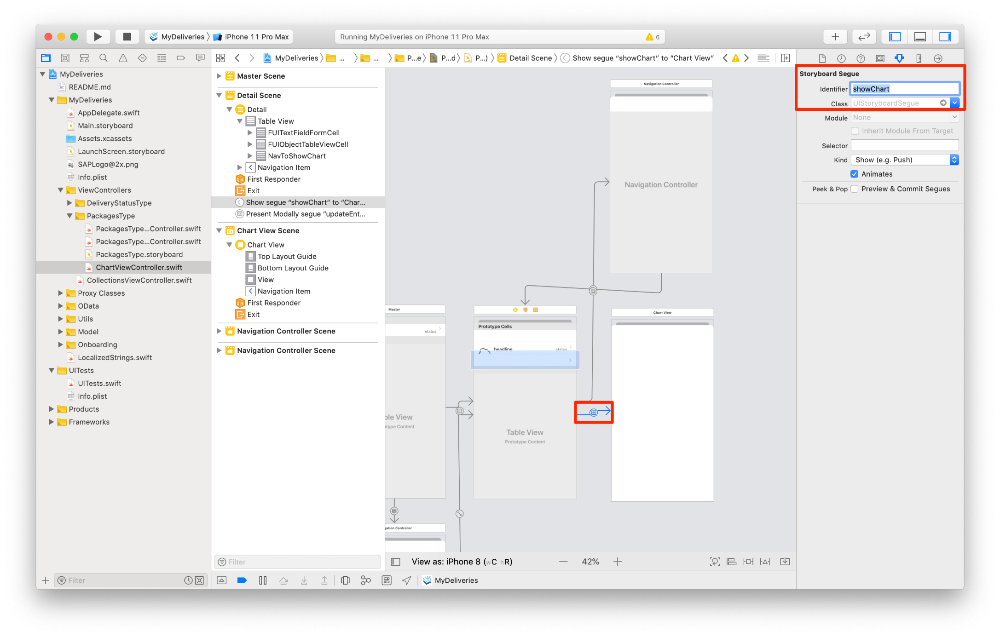

## Prerequisites  
- **Development environment:** Apple Mac running macOS High Sierra or higher with Xcode 10 or higher
- **SAP Cloud Platform SDK for iOS:** Version 3.0 SP01

## Details
### You will learn  
  - About the data visualization capabilities of the SDK

---

[ACCORDION-BEGIN [Step 1: ](Data visualization example)]

In the **Project navigator**, navigate to the `MyDeliveries/ViewControllers/PackagesType` folder. Control-click (or right-click) this folder, and from the context menu, select **New File...**

In the dialog, select **Cocoa Touch Class**:



Click **Next**.

First, set the **Subclass** to `UIViewController`.

Then, change the **Class** to `ChartViewController`.



Click **Next** to continue. Check that the file is saved in the `PackagesType` group, and click **Create** to create the class. The new file will open now.

In order to show the SDK's data visualizations, it should subclass `FUIChartFloorplanViewController`.

First add the necessary import statements:

```swift
import SAPFoundation
import SAPFiori
import SAPCommon
```

Then change the signature of the class so it now extends from `FUIChartFloorplanViewController`:

```swift
class ChartViewController: FUIChartFloorplanViewController {

```

Now you have the scaffolding for the data visualizations class. We'll leave it for now, the actual implementation will be finalized in a later step.

[DONE]

[ACCORDION-END]

[ACCORDION-BEGIN [Step 2: ](Add view controller to storyboard)]

Open the `PackagesType.storyboard` file, and click the **Object Library** button in the right area of the toolbar. Drag a **View Controller** onto the storyboard.



Select the new **View Controller** and go to the **Attributes Inspector**. Set the **Title** to **Chart View**:



Now switch to the **Identity Inspector**, enter `ChartViewController` for the **Custom Class**, and press Return. Be sure to get the spelling right; if it's correct, you'll see the Module change to `MyDeliveries` (the name of your project):



Use the **Object Library** to drag a single **Table View Cell** onto the **Detail Table View**, and set the following properties in the attribute inspector:

| Field | Value |
|----|----|
| Identifier | `NavToShowChart` |
| Accessory | `Disclosure Indicator` |



Hold down the Control key and drag from the just added **Table View Cell** to the **Chart View Scene**, creating a connection line between them. From the **Segue** dialog, choose **Show**.

With the segue selected, go to the attributes inspector and provide the name `showChart` as its **Identifier**.



[DONE]

[ACCORDION-END]

[ACCORDION-BEGIN [Step 3: ](Implement Table View Cell for Chart)]

Open file `./MyDeliveries/ViewControllers/PackagesType/PackagesTypeDetailViewController.swift`.

Locate the function `tableView(_:numberOfRowsInSection:)`. Again, you can use the jump bar above the editor pane to quickly find this function.

Currently this returns **5** rows, the total number of properties the `Package` entity has. However, since you added an extra Table View Cell to navigate to the Chart View scene, you want to make this extra cell visible.

Set the return value to `6`:

```swift
override func tableView(_: UITableView, numberOfRowsInSection _: Int) -> Int {
    return 6
}
```
Next, locate the function `tableView(_ tableView: UITableView, cellForRowAt indexPath: IndexPath)`.

To display the added Table View Cell, add an extra `case` statement, just above the `default:` switch:

```swift
case 5:
    let chartNavigationCell = tableView.dequeueReusableCell(withIdentifier: "NavToShowChart", for: indexPath)
    chartNavigationCell.textLabel?.text = "Waiting Time"
    chartNavigationCell.textLabel?.textColor = .preferredFioriColor(forStyle: .primary1)

    return chartNavigationCell
```

[VALIDATE_1]
[ACCORDION-END]

---
