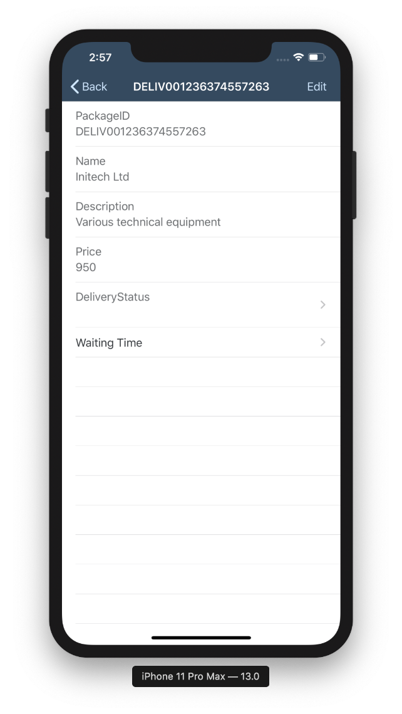
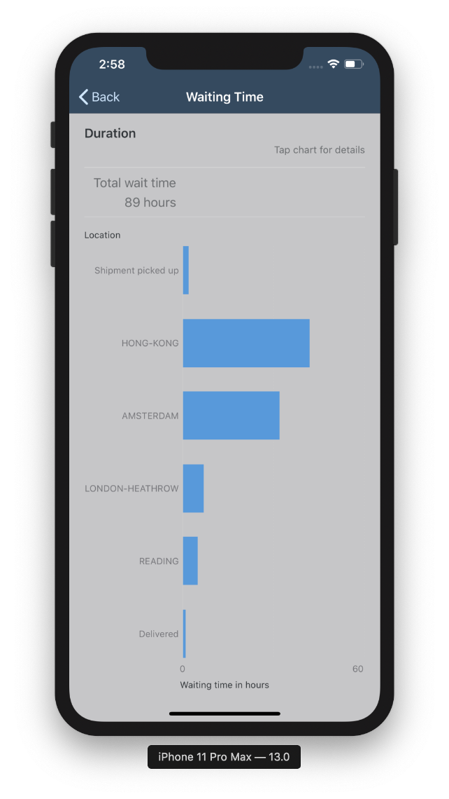

## Prerequisites  
- **Development environment:** Apple Mac running macOS High Sierra or higher with Xcode 10 or higher
- **SAP Cloud Platform SDK for iOS:** Version 3.0 SP01

## Details
### You will learn  
  - How to display sample data in a Fiori for iOS chart view.

For this exercise, static data will be used. As a challenge on your own, once you've got the chart displaying the static data, try implementing it with OData entities, like you did with the the timeline cell in previous tutorials.

---

[ACCORDION-BEGIN [Step 1: ](Setup chartView and implement static data)]

In the **Project navigator**, navigate to the `MyDeliveries/ViewControllers/PackagesType` folder and open the `ChartViewController.swift` file that you created in the previous tutorial.

Replace the `viewDidLoad` function with the following:

```swift
override func viewDidLoad() {
    super.viewDidLoad()

    title = "Waiting Time"
    chartView.chartType = .bar

    chartView.dataSource = self
    summaryView.dataSource = self

    titleText.text = "Duration"
    status.text = "Tap chart for details"
    categoryAxisTitle.text = "Location"
    valuesAxisTitle.text = "Waiting time in hours"
}
```

This sets the default settings for the chart, in this case, a bar chart.

A couple of errors are now shown. That is because the chart's data source is not yet implemented.

For this tutorial we will just use sample data. Add the following variables just below the `viewDidLoad` function:

```swift
// MARK: - Sample Data

let chartSeriesTitles = ["Actual", "Target"]

let chartCategoryTitles = ["Shipment picked up", "HONG-KONG", "AMSTERDAM", "LONDON-HEATHROW", "READING", "Delivered"]

let chartData = [[2.0, 42.0, 32.0, 7.0, 5.0, 1.0]]

```

[DONE]

[ACCORDION-END]

[ACCORDION-BEGIN [Step 2: ](Implement the FUIChartViewDataSource and FUIChartSummaryDataSource)]

We will implement the `FUIChartViewDataSource` and `FUIChartSummaryDataSource` protocols in **extensions** for the `ChartViewController`.

The first extension contains a couple of utility objects used for formatting the required data into the correct format.
Copy and paste it **below the final closing brace of the class**.

```swift
// MARK: - Formatters

private extension ChartViewController {

    private static let measurementFormatter: MeasurementFormatter = {
        let formatter = MeasurementFormatter()
        formatter.numberFormatter.maximumFractionDigits = 0
        formatter.unitOptions = .providedUnit
        formatter.unitStyle = .long
        return formatter
    }()

    private static let numberFormatter: NumberFormatter = {
        let formatter = NumberFormatter()
        formatter.maximumFractionDigits = 0
        return formatter
    }()
}
```

The chart contains both a summary view and the chart itself. Each of these views has its own data source.

The `FUIChartSummaryDataSource` protocol is used for supplying the data for the summary view.
Copy and paste the following below the final closing brace of the extension that you just added.

```swift
// MARK: - FUIChartSummaryDataSource implementation

extension ChartViewController: FUIChartSummaryDataSource {

    func chartView(_ chartView: FUIChartView, summaryItemForCategory categoryIndex: Int) -> FUIChartSummaryItem? {

        let item = FUIChartSummaryItem()
        item.categoryIndex = categoryIndex
        item.isPreservingTrendHeight = false

        switch categoryIndex {

        case -1:
            item.isEnabled = false
            let values: [Measurement<UnitDuration>] = chartView.series.compactMap { series in
                let categoriesUpperBound = series.numberOfValues - 1
                guard let valuesInSeries = series.valuesInCategoryRange(0...categoriesUpperBound, dimension: 0) else { return nil }
                let hours = valuesInSeries.lazy.compactMap { $0 }.reduce(0.0, +)
                return Measurement(value: hours, unit: UnitDuration.hours)
            }
            item.valuesText = values.map { ChartViewController.measurementFormatter.string(from: $0) }
            item.title.text = "Total wait time"

        default:
            item.isEnabled = true
            let values = chartView.series.map { $0.valueForCategory(categoryIndex, dimension: 0)! }
            item.valuesText = values.map { ChartViewController.numberFormatter.string(for: $0)! }
            item.title.text = chartCategoryTitles[categoryIndex]
        }
        return item
    }
}
```

Finally, the `FUIChartViewDataSource` protocol is responsible for providing the data to the chart.
Copy and paste the following below the final closing brace of the extension that you just added.

```swift
// MARK: - FUIChartViewDataSource implementation

extension ChartViewController: FUIChartViewDataSource {

    func numberOfSeries(in: FUIChartView) -> Int {
        return chartData.count
    }

    func chartView(_ chartView: FUIChartView, numberOfValuesInSeries seriesIndex: Int) -> Int {
        return chartData[seriesIndex].count
    }

    func chartView(_ chartView: FUIChartView, valueForSeries seriesIndex: Int, category categoryIndex: Int, dimension dimensionIndex: Int) -> Double? {
        return chartData[seriesIndex][categoryIndex]
    }

    func chartView(_ chartView: FUIChartView, formattedStringForValue value: Double, axis: FUIChartAxisId) -> String? {
        return ChartViewController.numberFormatter.string(for: value)!
    }

    func chartView(_ chartView: FUIChartView, titleForCategory categoryIndex: Int, inSeries seriesIndex: Int) -> String? {
        return chartCategoryTitles[categoryIndex]
    }
}
```

If you build and run the application, and tap on one of the **Packages** entities, you can see the added cell which navigates to the chart:



If you tap the **Waiting Time** cell, you will see the bar chart with the delivery waiting times, and calculated total waiting time (89 hours):



If you now tap on one of the bars in the chart, the item's details are shown in the summary header:


[VALIDATE_1]
[ACCORDION-END]

---
