## Prerequisites
- **Tutorials:** [Get a Free Trial Account on SAP Cloud Platform](hcp-create-trial-account) and [Enable SAP Cloud Platform Mobile Services](fiori-ios-hcpms-setup)
- **Development environment:** Apple Mac running macOS Catalina or higher with Xcode 11 or higher
- **SAP Cloud Platform SDK for iOS:** Version 5.0

## Details
### You will learn  
  - How to create a connection in the SAP Cloud Platform SDK for iOS Assistant
  - How to generate an app with the SAP Cloud Platform SDK for iOS Assistant

---

[ACCORDION-BEGIN [Step 1: ](Enable SAP Cloud Platform Mobile Services)]

The SAP Cloud Platform SDK for iOS is designed to work seamlessly with a set of services provided by the SAP Cloud Platform that are optimized for communication with mobile devices, known collectively as Mobile Services. These include not only data services, but also features like analytics, push notifications, and app configuration. Before creating your first app, you'll need to ensure that Mobile Services are enabled for your trial account.

[DONE]
[ACCORDION-END]

[ACCORDION-BEGIN [Step 2: ](Create iOS app using iOS Assistant)]

With your account created, you can now use the Assistant to create cloud application configurations on the Mobile Services back end, create destinations pointing to data service endpoints, and generate Xcode projects with a built-in data service layer to access the backend via Swift.

For the remainder of this tutorial, you will use the Assistant to generate an Xcode project that accesses a sample backend hosted on the SAP Cloud Platform, then replace the generated user interface with your own, and finally add the code necessary to integrate a Core ML machine learning model to classify product images.

Let's get started by creating a cloud application definition on Mobile Services connecting to a service named `com.sap.edm.sampleservice.v2`. This service is provided as a sample service on SAP Cloud Platform.

1. Open up the **SAP Cloud Platform SDK for iOS Assistant** and click **Create new**.

    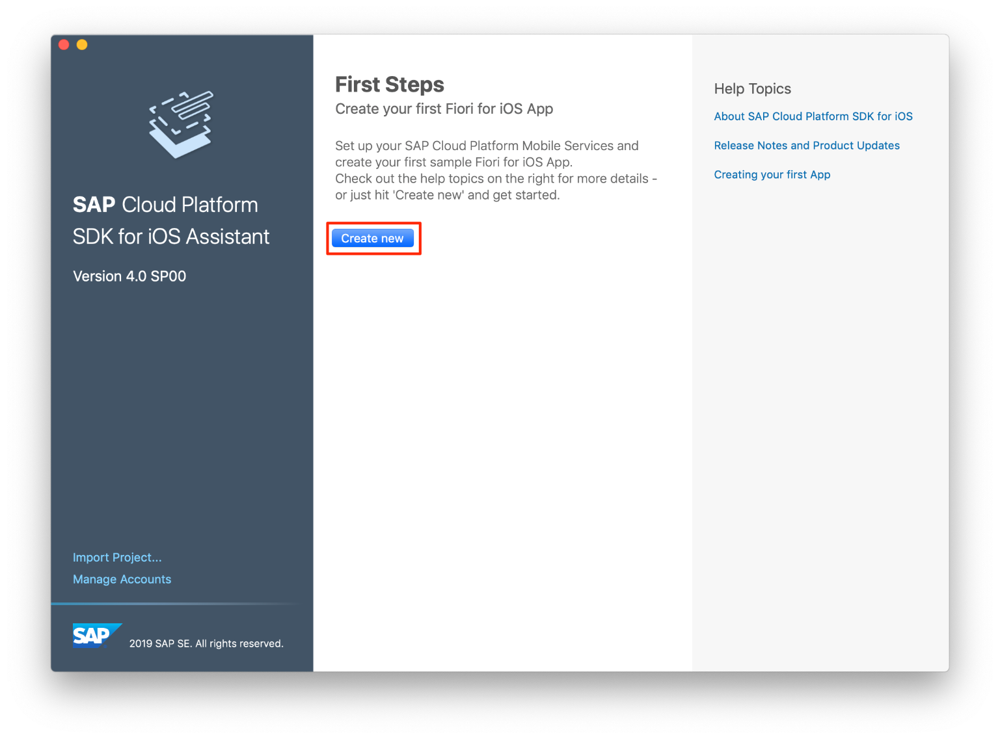

2. Next, click **Create New Application** to start the workflow. Choosing this workflow gives you the ability to customize many aspects of the back end connection and select various features for the generated Xcode project.

    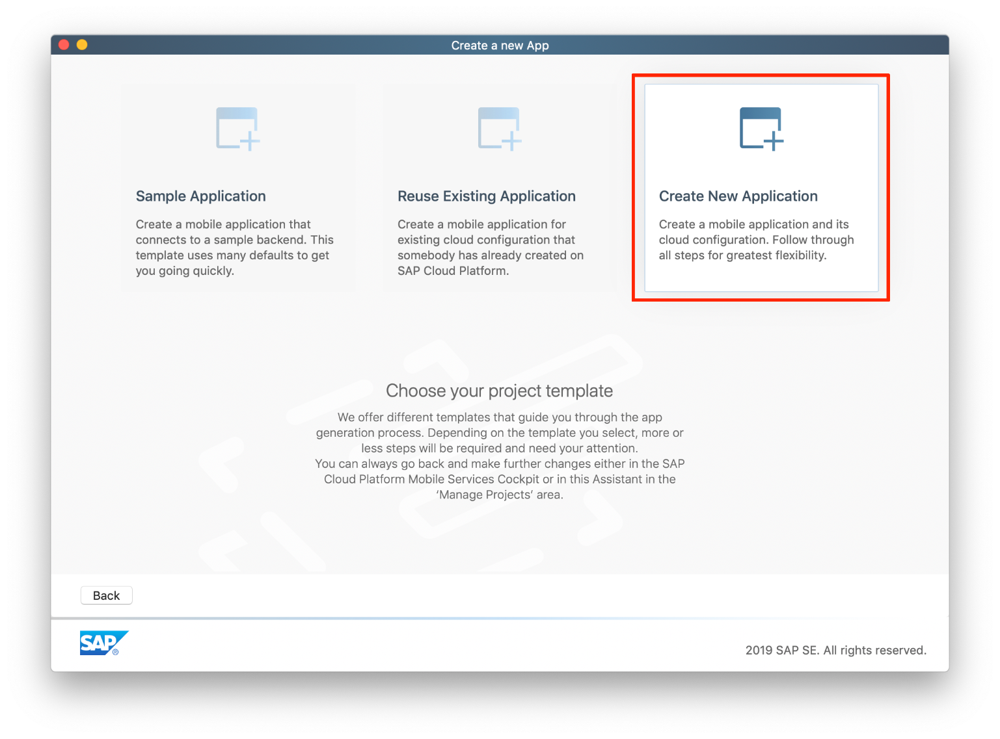

3. In step 1 of this workflow, you should see listed the Mobile Services account you created earlier in this tutorial.

    The account should be pre-selected so you can simply click **Next** to continue.

    

4. In step 2 labeled **Cloud Application**, you will create the Mobile Services application configuration for your iOS app. This configuration will contain a destination and some sort of reverse proxy to connect to the sample service backend.

    Enter these values for the following fields:

    | Field | Value |
    |----|----|
    | **Name** | `SalesAssistant` |
    | **Identifier** | `com.example` |
    | **Authentication** | `OAuth2` |

    If you are using a trial account to access Mobile Services, be sure that you haven't exceeded the application limit before proceeding. If you already have an application configuration you have to delete or export this application configuration.

5. If you're using a new trail account or if you are sure that you have a free spot for a Mobile Service application, click **Next** to continue.

    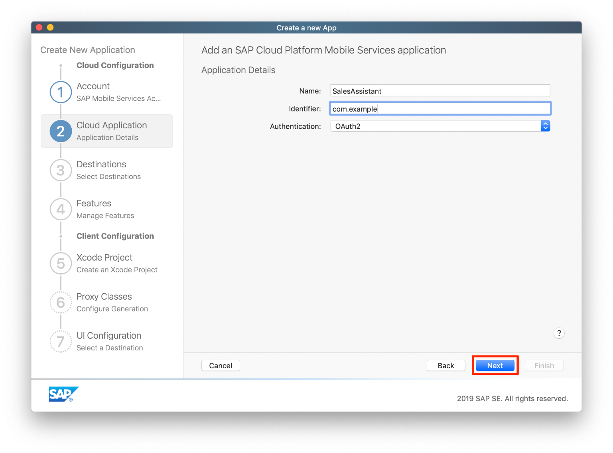

    With the cloud application definition set in step 2 of the workflow, it's time to define the service destination the application should reference. In this tutorial series we're using a sample built into every Mobile Services account.

6. Select the service titled `com.sap.edm.sampleservice.v2` from the list.

    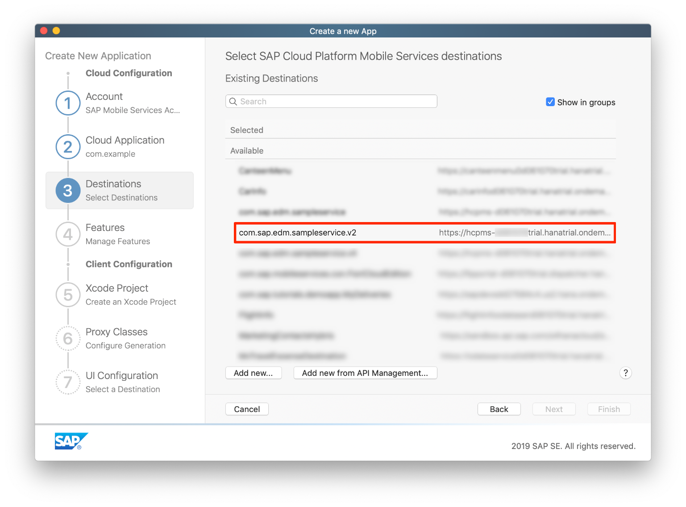

7. Click **Next**.

    

    The Features step allows you to select which features of the SDK you want to use. Selecting a feature will setup the corresponding configurations on the Mobile Services backend.

    Accept the default settings and click **Next**.

    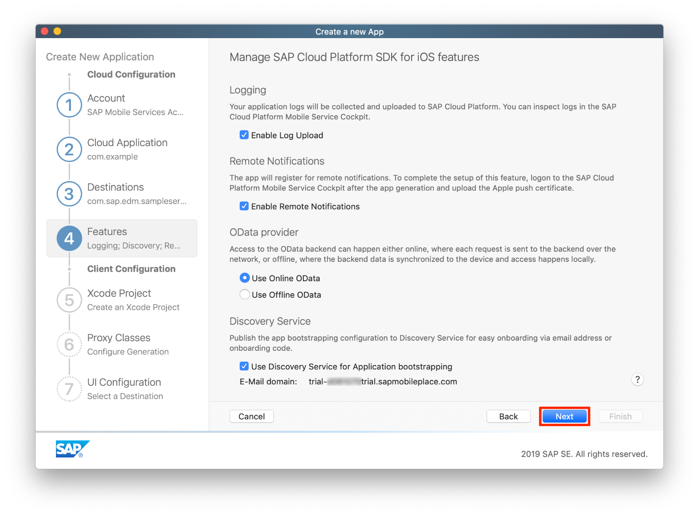

8. For step 5, labeled **Xcode Project**, enter these values for the following fields:

    | Field | Value |
    |----|----|
    | **Product Name** | `SalesAssistant` |
    | **Organization Name** | Your organization name |
    | **Organization Identifier** | `com.teched.appspace` |

    > For your real apps, please select the organization name and identifier wisely. This will be your bundle identifier, which will be used to identify your app. No worries, you can change the bundle identifier in the Xcode project.

    Click **Next**.

    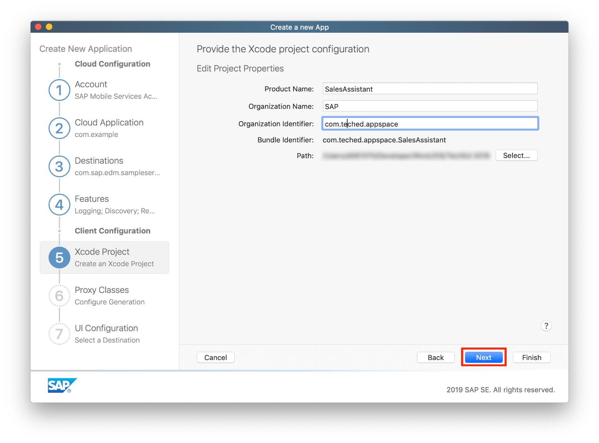

9. For step 5, labeled Proxy Classes, you should see the sample service name `com.sap.edm.sampleservice.v2` that we selected in step 3 of the workflow.

    Click **Next**.

    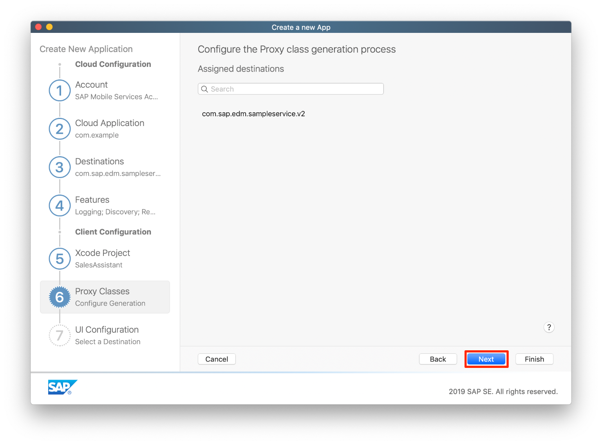

10. The last and final step is UI configuration. Here you can choose from a number of iOS app types the Assistant can generate. For this tutorial, we want a Master / Detail UI that includes the on-boarding flow, so make sure the **Master / Detail Screens with Onboarding for destination:** radio button is selected.

    Click **Finish**.

    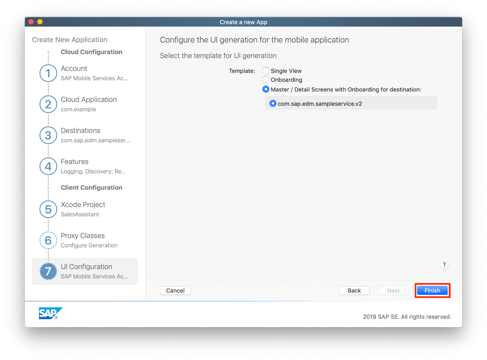

    The SAP Cloud Platform SDK for iOS Assistant will now create the cloud application on Mobile Services, pull the metadata document of the OData service and generate an Xcode project, including the on-boarding flow and all the necessary proxy classes and a convenience data service API.

[DONE]
[ACCORDION-END]

[ACCORDION-BEGIN [Step 3: ](Run iOS app on simulator)]

After clicking **Finish**, the Assistant will generate an Xcode project, save it to disk, and open the project in Xcode.

1. To compile and open your app in the iOS Simulator, click the run button in the top-left corner of the Xcode toolbar or choose **Run** from the Xcode **Project** menu.

    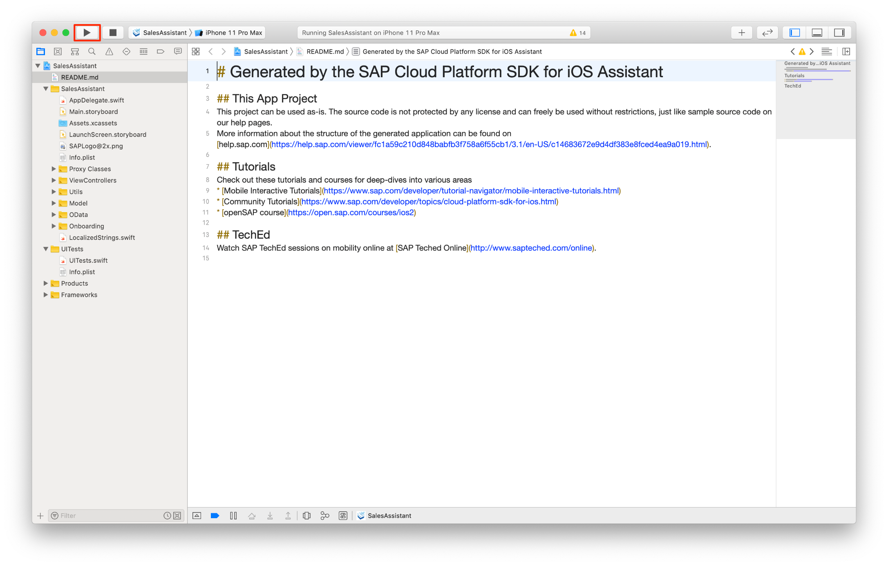

    The iOS Simulator should launch, initialize iOS, then run your app. The first screen you'll see is the start of the generated on-boarding flow. It's important to know that the generated on-boarding flow is simply the default experience and can be easily modified to fit your requirements.

    Click **Start**.

    > If you're interested in the different on-boarding variants you can take a look at the design guidelines: [Fiori for iOS Design Guidelines](https://experience.sap.com/fiori-design-ios/article/onboarding/).

    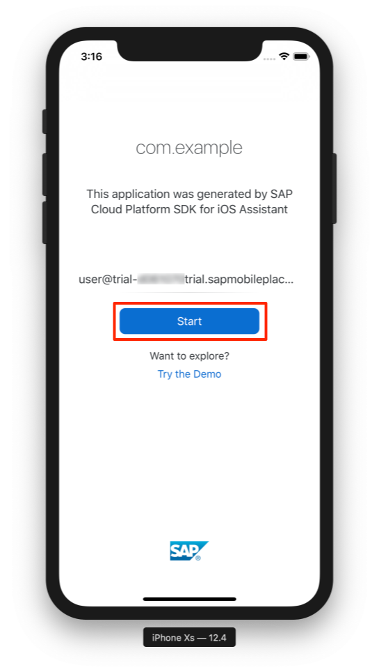

2. Next, your app will connect to the SAP identity provider triggering an authentication prompt for your SAP Cloud Platform account id and password.

    Please enter the needed information and click **Log on**.

    > You could also define your own IDP on the cloud side if you don't want to use the SAP IDP.

    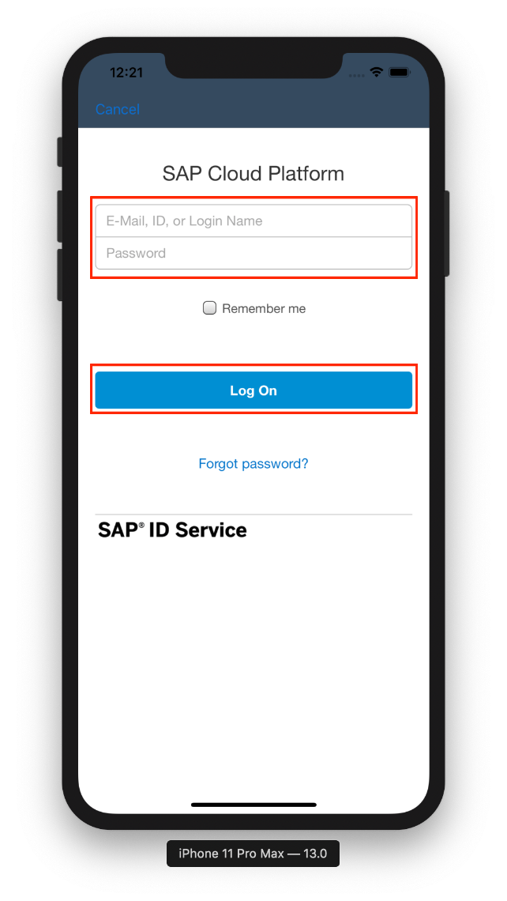

3. The next screen shows an example Data Privacy disclosure prompt which allows you to include data privacy and consent text that complies with the EU General Data Protection Regulation (GDPR) for example.

    Click **Allow** to continue with the flow. Clicking **Deny** will cause the app to go back to the initial screen of the on-boarding flow.

    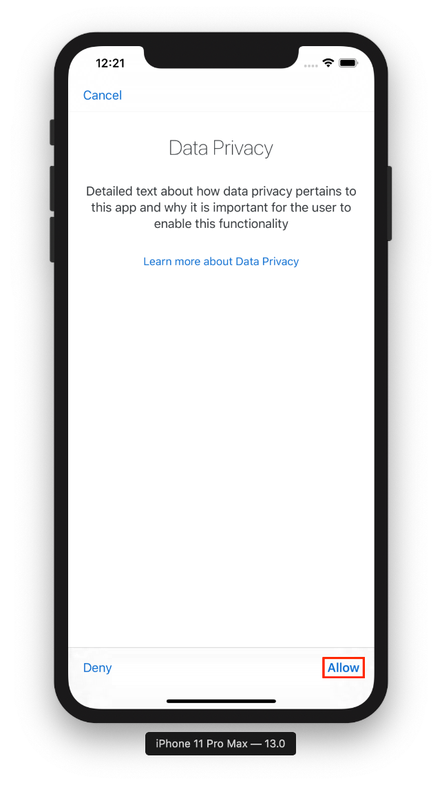

4. You'll be present the passcode screen. This screen is optional when building your own app however, requiring a passcode can provide an additional layer of security for accessing sensitive data like customer information, sales numbers, etc.

    Enter a passcode containing 8 characters. For this tutorial series it's sufficient to just enter a passcode of `12345678`.

    Passcode policies are managed via Mobile Services and can contain configurations that define the password complexity, how many failed attempts are allowed before the app locks, etc.

5. Before you click **Next**, select on `FaceID > Enrolled from the Hardware menu in the iOS Simulator`.
This will configure the simulator to automatically use `FaceID` or `TouchID` to unlock the app instead of asking you for a passcode every time it's run.

    After you've enrolled in `TouchID` or `FaceID` (depending on the simulator you're using) , click **Next**.

    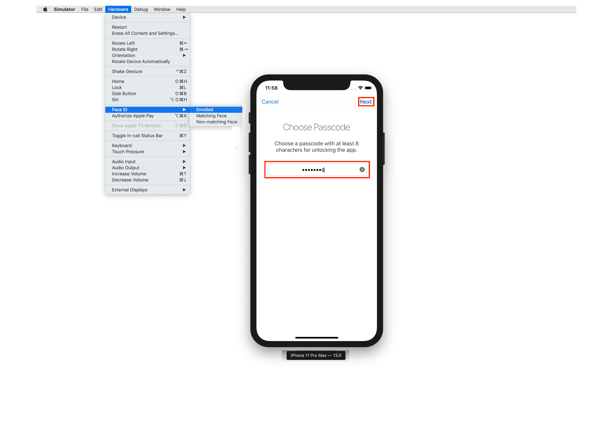

    Re-enter your passcode and click **Done**.

    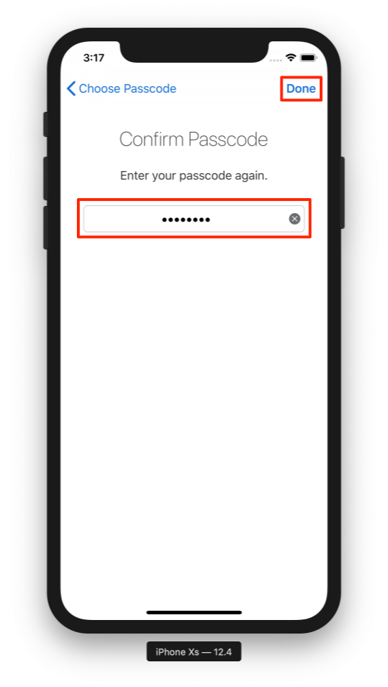

    Now that you've enrolled in `TouchID` or `FaceID`, a screen will be added to the on-boarding flow asking you to authorize the app to use Apple's native security feature.

    Click **Enable** to continue.

    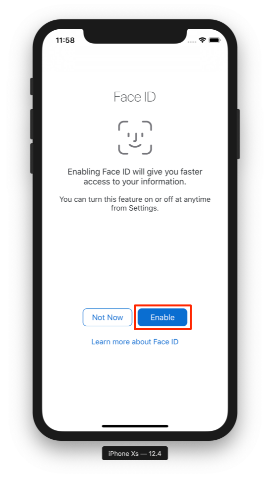

    Congratulations, you've successfully on-boarded into your app! You should see a table view containing all the entities of our sample OData service allowing you to edit existing records, insert your own, or delete records altogether.

    Click on an entity to see its records.

    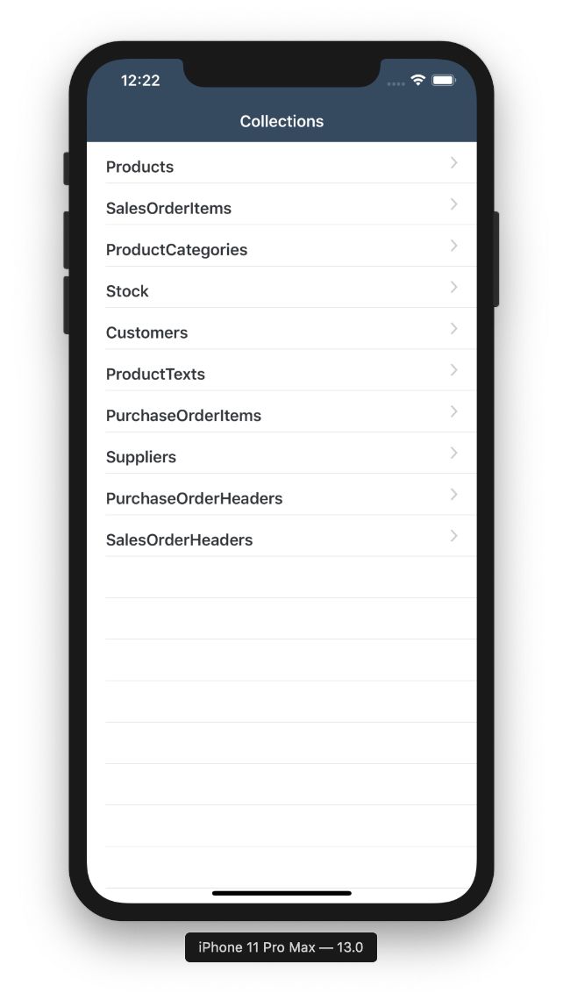

[VALIDATE_3]
[ACCORDION-END]
