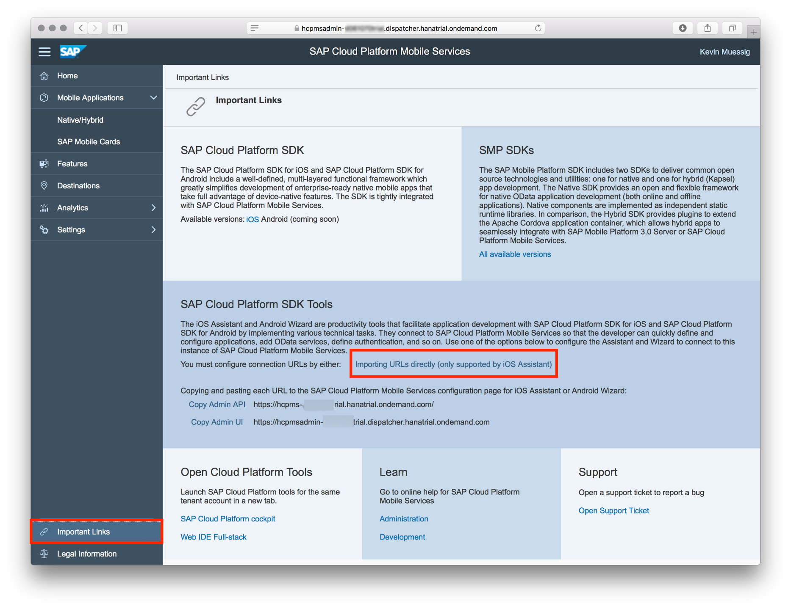
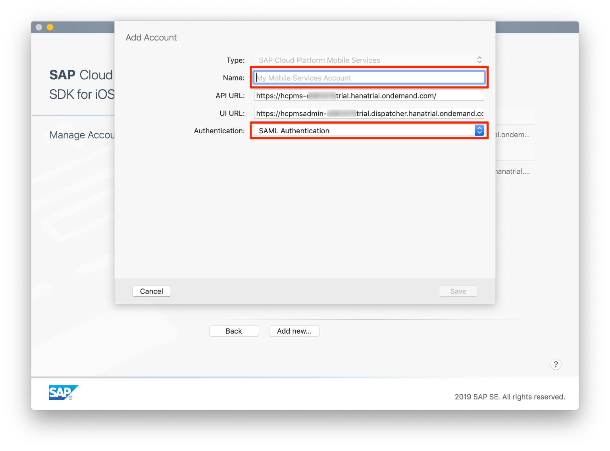
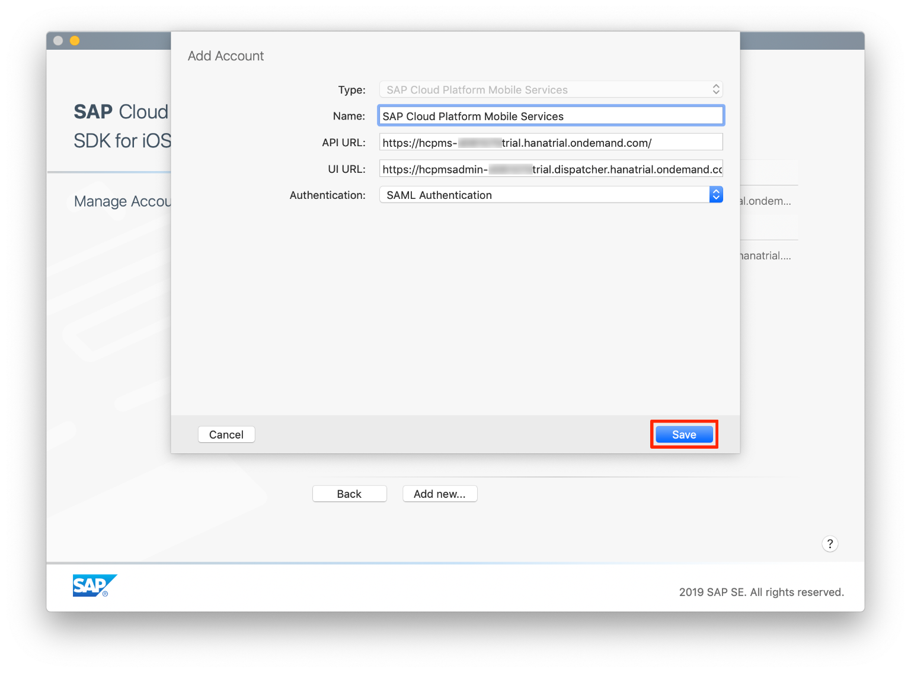
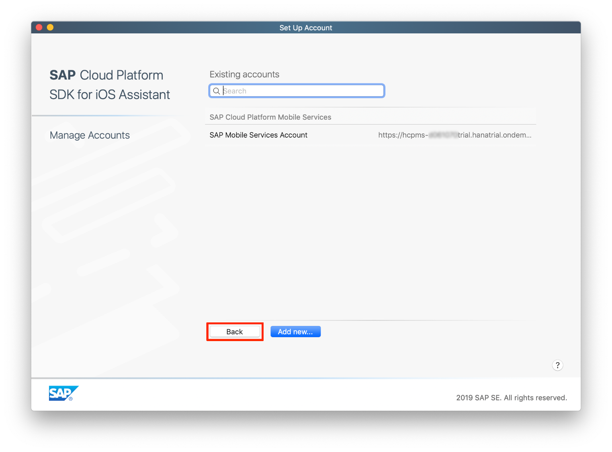

## Prerequisites  
- **Tutorials:** [Get a Free Trial Account on SAP Cloud Platform](https://developers.sap.com/tutorials/hcp-create-trial-account.html) and [Enable SAP Cloud Platform Mobile Services](https://developers.sap.com/tutorials/fiori-ios-hcpms-setup.html)
- **Development environment:** Apple Mac running macOS High Sierra or higher with Xcode 10 or higher
- **SAP Cloud Platform SDK for iOS:** Version 3.0 SP02

## Details
### You will learn  
  - How to create a connection in the SAP Cloud Platform SDK for iOS Assistant
  - How to generate an app with the SAP Cloud Platform SDK for iOS Assistant

Before you start, make sure you:

  - Have downloaded [SAP Cloud Platform SDK for iOS](https://www.sap.com/developer/trials-downloads/additional-downloads/sap-cloud-platform-sdk-for-ios-14485.html) **version 3.0 SP02**.
  - Have a trial account on SAP Cloud Platform. See [Get a Free Trial Account on SAP Cloud Platform](https://developers.sap.com/tutorials/hcp-create-trial-account.html).
  - Enabled the SAP Cloud Platform Mobile Services. See [Enable SAP Cloud Platform Mobile Services](https://developers.sap.com/tutorials/fiori-ios-hcpms-setup.html).

---

[ACCORDION-BEGIN [Step 1: ](Enable SAP Cloud Platform Mobile Services)]

The SAP Cloud Platform SDK for iOS is designed to work seamlessly with a set of services provided by the SAP Cloud Platform that are optimized for communication with mobile devices, known collectively as Mobile Services. These include not only data services, but also features like analytics, push notifications, and app configuration. Before creating your first app, you'll need to ensure that Mobile Services are enabled for your trial account.

> If you have already configured the SAP Cloud Platform SDK for iOS Assistant, you can **skip this step** and proceed with the "Create Your First Fiori for iOS App" tutorial.

To enable the service, do the tutorial [Enable SAP Cloud Platform Mobile Services](https://developers.sap.com/tutorials/fiori-ios-hcpms-setup.html).

>Alternatively, you can go directly to `https://hcpmsadmin-<your_user_id>trial.dispatcher.hanatrial.ondemand.com/`

[DONE]
[ACCORDION-END]

[ACCORDION-BEGIN [Step 2: ](Set up your Mobile Services account in the iOS Assistant)]

The SAP Cloud Platform SDK for iOS includes an Assistant app for generating and managing iOS apps that use the Mobile Services. To get started with the Assistant, you'll need to configure it for your account. Part of this configuration can be imported automatically.

Once you're logged in to **SAP Cloud Platform Mobile Services**, click the **Important Links** tab in the lower left corner. The **Important Links** section opens.

> When you open up Mobile Services the first time you will see a popup appear which contains a couple of QR- Codes. Please go ahead and close that.

Locate the tile **SAP Cloud Platform SDK for iOS Assistant** and click the **Importing URLs directly into Assistant** link:

You should now see the following pop-up:

Click **Allow**. The SAP Cloud Platform SDK for iOS Assistant application will start. The **Add Mobile Services Account** settings dialog will open, and both **API URL** and **UI URL** parameters are pre-populated automatically:

Provide the following additional details:

| Field | Value |
|----|----|
| Name | A descriptive name for the configuration, for instance `SAP Cloud Platform Mobile Services` |
| Authentication Type | `SAML Authentication` |
| User | Your trial account user |
| Password | Password for your trial account user |

Click **Save** when finished. The account is now added to the SDK Assistant:

Click **Back** to return to the main screen for the **SAP Cloud Platform SDK for iOS Assistant**.

[DONE]
[ACCORDION-END]

[ACCORDION-BEGIN [Step 3: ](Use the iOS Assistant to create your first iOS app)]

Now that we've made a connection from the iOS Assistant to Mobile Services, the assistant allows you to create not only your Xcode project but also the creation of Cloud application configurations, destinations pointing to data service endpoints as also the whole data service layer inside your project.

During the time you will spend following this tutorial series you will create a project, implement your own UI, access a sample backend provided by the SAP Cloud Platform as well as using a `CoreML` model to classify product images.

Let's get started with following the creation workflow for a brand new iOS app project including all necessary steps to create a Cloud application definition on Mobile Services connecting to the `com.sap.edm.sampleservice.v2`. This service is provided as a staple service on SAP Cloud Platform.

Please open up the **SAP Cloud Platform SDK for iOS Assistant** and click on **Create new**.

Next click on **Create New Application** to start the workflow. This workflow will let you create everything from scratch.

In the first step you can see the previously created Mobile Services account. This should be pre-selected and you can just click on **Next**.

In the Cloud Application step, you can create the Mobile Services application configuration for your iOS app. This configuration will contain a destination, some sort of reverse proxy, which connects to the sample service backend. You can do all sorts of things regarding maintenance, Remote Notifications and more.

Please enter the following information in the form:

| Field | Value |
|----|----|
| Name | `SalesAssistant` |
| Identifier | `com.example` |
| Authentication | `OAuth2` |

> In case if you're using Mobile Services for a longer time, and have a trial version, you have to check that you don't exceed 5 application definitions on Mobile Services. If you already have 5 applications you have to delete one of them to be able to create this project.

The Cloud application definition is set, now it's time to define the destination. Fortunately for this tutorial series we will use the `com.sap.edm.sampleservice.v2`. Please select the mentioned destination from the list.

Click **Next**.

The **Features** step allows you to select which features of the SDK you want to use. Selecting the corresponding features will also create the basic configurations on Mobile Services. Please leave everything as is and click on **Next**.

For the **Xcode Project** step fill in the following information:

| Field | Value |
|----|----|
| Product Name | `SalesAssistant` |
| Organization Name | Your organization name |
| Organization Identifier | `com.teched.appspace` |

> For your real apps, please select the organization name and identifier wisely. This will be your bundle identifier which will be used to identify your app. No worries, you can change the bundle identifier in the Xcode project.

Click **Next**.

In the next step you could make additional changes to your assigned destination regarding the proxy class generation. Usually it is sufficient to just leave it as is. Please click on **Next**.

The last and final step is the UI configuration. Here you can define what the assistant is supposed to generate for you. We will let the assistant create a Master / Detail UI including the on-boarding flow. Please make sure the **Master / Detail Screens with Onboarding for destination:** radio button is selected and click on **Finish**.

The SAP Cloud Platform SDK for iOS Assistant will now create the Cloud application on Mobile Services, pull the Metadata document of the OData service and generate a Xcode project including the on-boarding flow and all the necessary proxy classes and a convenience data service `API`.

[DONE]
[ACCORDION-END]

[ACCORDION-BEGIN [Step 4: ](Run the iOS app on simulator)]

After finishing up the workflow in the assistant Xcode should automatically open up showing your defined project. In the top-left of Xcode you can see a run button. Please click the run button to start a simulator and install the app on it.

A simulator should show up now running your app. The first screen you'll see is the start of the generated onboarding process. Important to know is that the generated onboarding flow is just the default flow, the SDK allows you to modify the onboarding flow in different ways. Please tap on **Start**.

> If you're interested in the different onboarding variants you can take a look at the design guidelines: [Fiori for iOS Design Guidelines](https://experience.sap.com/fiori-design-ios/article/onboarding/).

Now your app will try to connect to the SAP Identity provider which requires you to authenticate with your SAP Cloud Platform account and password. Please enter the needed information and tap on **Log on**.

> You could also define your own IDP on the cloud side if you don't want to use the SAP IDP.

The next screen shows an example for a **Data Privacy** screen which allows you to add data privacy & consent texts to comply to EU General Data Protection Regulation (GDPR). Please tap on **Allow** to continue with the flow, tapping on **Deny** will cause the app to go back to the initial screen of the flow.

Also an optional screen is the passcode screen. Using a passcode can be used for an additional layer of security for your app, used for example for apps accessing sensitive data like customer data, sales numbers, etc.

Please enter a passcode containing 8 characters, for this tutorial series it's sufficient to just enter a passcode `12345678`. The passcode policies can be maintained on Mobile Services. Those policies can contain configurations on how many failed attempts are allowed before the app locks and also what characters and how many the passcode should contain.

Before you tap on **Next**, please click on `Hardware -> FaceID -> Enrolled`. This will cause the simulator to automatically use `FaceID` or `TouchID` to unlock the app instead of asking you for a passcode.

When you enrolled in `TouchID` or `FaceID` (depending on the simulator you're using), tap on **Next**.

 Please confirm your passcode and tap on **Done**.

 Because you've enrolled in `TouchID` or `FaceID` a screen will be added to the on-boarding flow asking you to authorize the app to use Apple's native security feature. Please tap on **Enable** to continue.

 Congratulations, you've successfully on-boarded in your app! You should see a table view allowing you to navigate the OData service's entities and also create, update or delete those.

[VALIDATE_4]
[ACCORDION-END]
