## Prerequisites  
- **Development environment:** Apple Mac running macOS High Sierra or higher with Xcode 10 or higher
- **SAP Cloud Platform SDK for iOS:** Version 3.0 SP02

## Details
### You will learn  
  - How to change the assistant generated UI with your own using Xcode and Storyboard

---

[ACCORDION-BEGIN [Step 1: ](Replace generated UI with your own)]

The SAP Cloud Platform SDK for iOS Assistant does a great job generating you an initial UI which is awesome for trying out the data service entities, impress your boss or customer on how fast you are. When it really comes to building your own app you have to understand how to incorporate your own UI into the generated app.

Let's start by opening up Xcode and click on the `Main.storyboard`. Theoretically you could build all your UI in code but storyboards provide you an easy way to lay out your app's UI flow, general UI and auto layout-ing the views to support all needed size classes.


Please mark all View Controllers in the storyboard. You can do this by clicking in the storyboard and then **Command + a**.

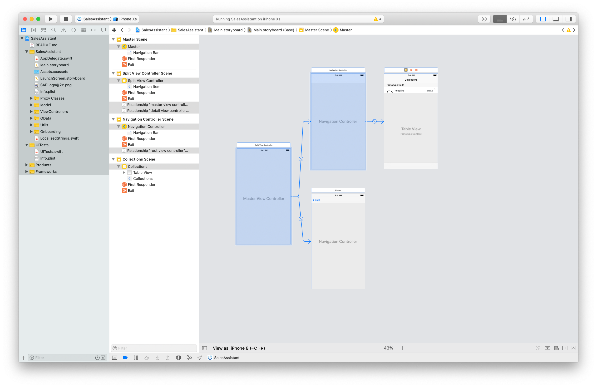

Now delete them by hitting the **delete** key on your keyboard.

On the upper-right, please click on the **Object Library** and in the upcoming pop-up search for `UIViewController`. Drag and drop a **View Controller** onto the storyboard.

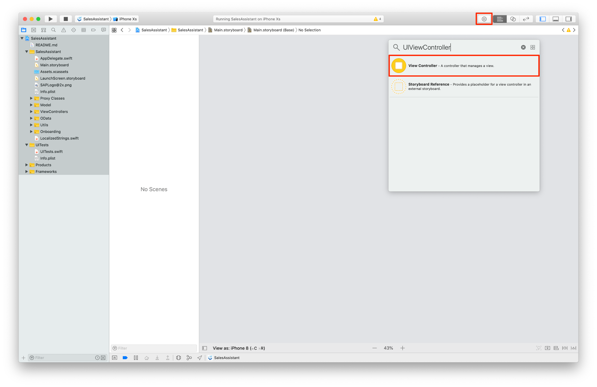

We will add additional views in later steps, for that reason embedding the added View Controller in a Navigation Controller will make it easier for you as a developer to handle the navigation stack. The Navigation Controller will handle most of that for us. Please select the View Controller and click on `Editor -> Embedd In -> Navigation Controller`.


Last step here is setting the Navigation Controller as initial View Controller. Please select the Navigation Controller and on the left-hand side click on the **Attributes Inspector**. Please check the checkbox **Is Initial View Controller** in the **View Controller** section. An arrow should appear left to the Navigation Controller pointing on it.


[DONE]
[ACCORDION-END]

[ACCORDION-BEGIN [Step 2: ](Create Swift class backing up the storyboard View Controller)]

The setup in storyboard is almost done now. Every added View Controller or Table View Controller in storyboard needs to be backed up by a Swift class. Please select the **Sales Assistant** folder on the left side and **right click** to create a **New File...**.


In the upcoming dialogue please select **Cocoa Touch Class** and click **Next**.


Please provide the following information:

| Field | Value |
|----|----|
| Class | `OverviewViewController` |
| Subclass of | `UIViewController` |
| Language | Swift |

Click on **Next** and then **Create**.


The newly added class should automatically open up. Before we go into coding, please go back to the `Main.storyboard` and select the View Controller. On the left-hand side please select the **Identity Inspector** and set the **Custom Class** to the `OverviewViewController` and hit **return**. Now this View Controller is backed up by a Swift class sub classing of `UIViewController`.


[DONE]
[ACCORDION-END]

[ACCORDION-BEGIN [Step 3: ](Change code in application UI manager class)]

The way the assistant generates the app requires us to change the initial View Controller code in the `ApplicationUIManager` class. Please open the `ApplicationUIManager` located in the **Onboarding** group on the left-hand side.

Please locate the `showApplicationScreen(completionHandler:)` method, that method contains the code initializing the initial View Controller. In order to quickly find that method you can use the quick selection feature.


The Xcode editor should then jump to the selected method.


In here please replace the following code in the else block:

```Swift

let appDelegate = (UIApplication.shared.delegate as! AppDelegate)
let splitViewController = UIStoryboard(name: "Main", bundle: Bundle.main).instantiateViewController(withIdentifier: "MainSplitViewController") as! UISplitViewController
splitViewController.delegate = appDelegate
splitViewController.modalPresentationStyle = .currentContext
splitViewController.preferredDisplayMode = .allVisible
appViewController = splitViewController

```

with

```Swift

let mainNavigationController = UIStoryboard(name: "Main", bundle: Bundle.main).instantiateInitialViewController() as! UINavigationController
appViewController = mainNavigationController

```

This code will load the `Main.storyboard` and initializes the initial View Controller which in our case is a `UINavigationController`.

[DONE]
[ACCORDION-END]

[ACCORDION-BEGIN [Step 4: ](Run your app in simulator)]

You have done all needed steps to replace the generated UI with your own. Let's see how the app looks like now by running the app on simulator. Please click on the run button to deploy the app.

Because you have run through the on-boarding flow already and enrolled in `FaceID` or `TouchID` the new View Controller should show up.


[DONE]
[ACCORDION-END]

[ACCORDION-BEGIN [Step 5: ](Add Table View to View Controller)]

The Overview View Controller is going to be used in this tutorial series to display a list of customers and products. To achieve that please add a Table View to the Overview View Controller using the **Object Library**. Open the **Object Library** and search for Table View, drag and drop a Table View into the View Controller.

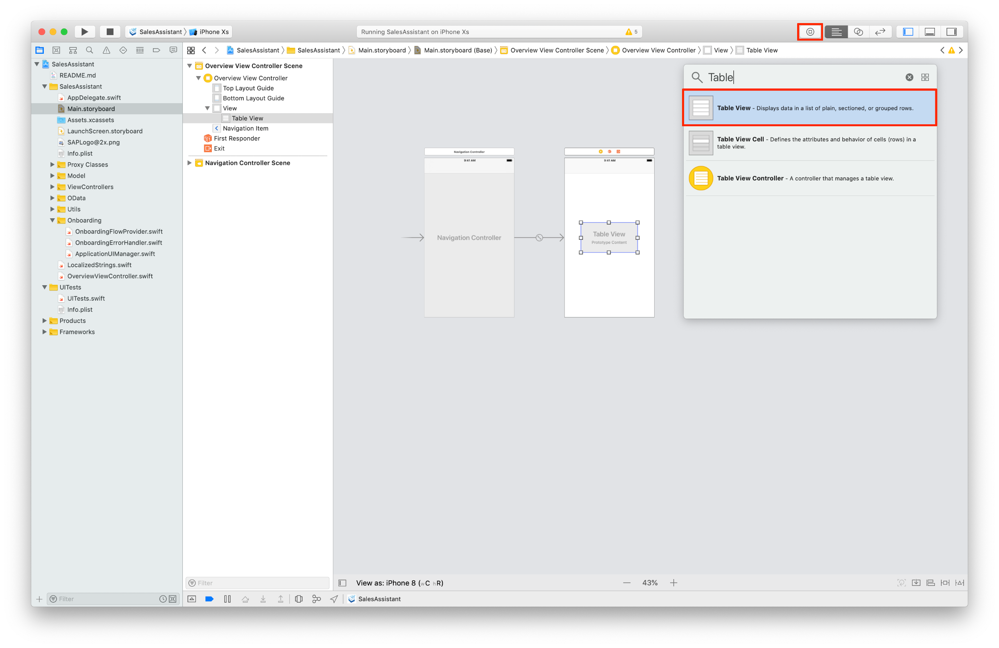

Important is to set layout constraints to the Table View because the app should display itself properly on the different available devices. Please select the Table View and click on the **Add New Constraints** icon on the lower-left. In there please change the top value to **25** and the rest to **0**. Make sure the checkbox **Constrain to margins** is unchecked and click on **Add 4 Constraints**.

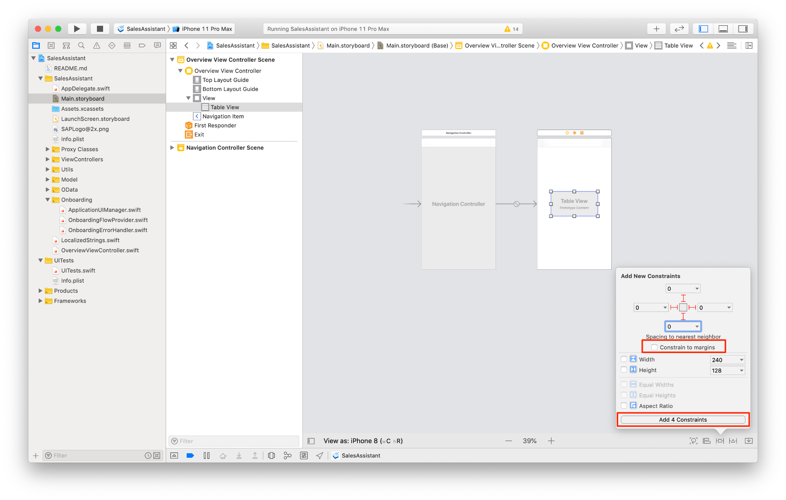

This will add auto layout constraints to the Table View. You might ask yourself why you have to set the top constraint to 25; the reason is that we want a 25 points wide divider between the Navigation Bar and the Table View.

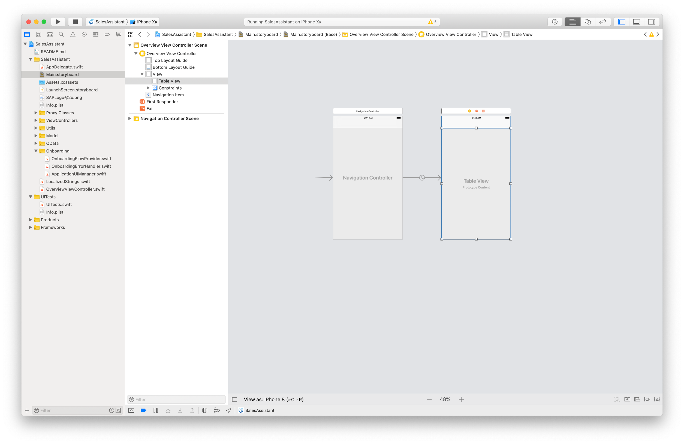

[DONE]
[ACCORDION-END]

[ACCORDION-BEGIN [Step 6: ](Create outlet from storyboard to class)]

Going on we want access to the Table View inside of the `OverviewViewController`. To achieve that we can utilize so called `IBOutlets` which are a code connection to the visual Table View in storyboard.

In the `Main.storyboard` select the `OverviewViewController` and in the top-left click on the **Assistant editor** to open up a side-by-side view of the Swift class and the storyboard.

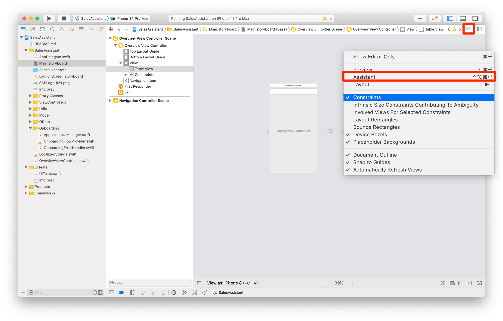

To create the outlet select the Table View in the View Hierarchy or directly on the storyboard and **control + drag** from the Table View below the class definition in code. Give it the **Name** `tableView`, make sure **Connection** is set to **Outlet** and click **Connect**.

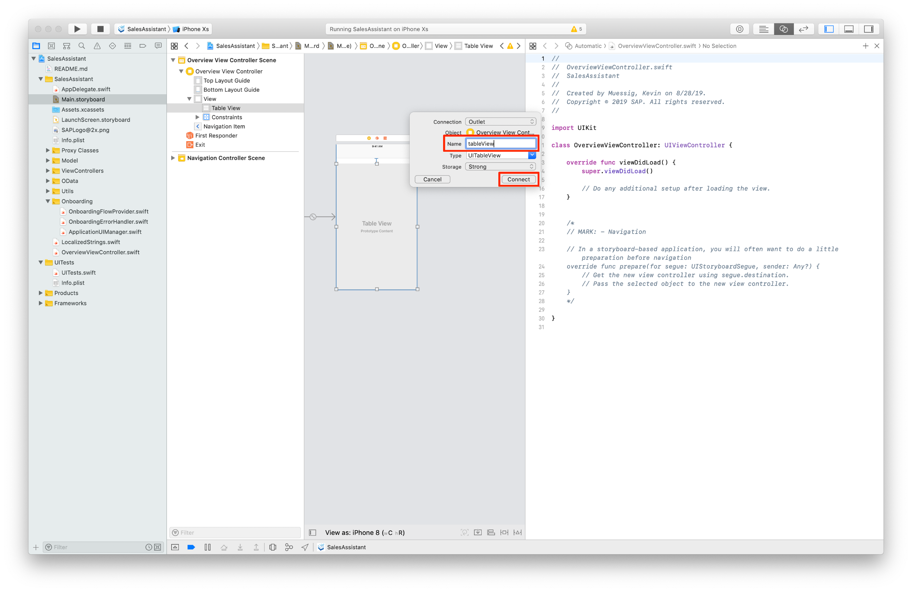

The result is a code connection from the Table View to your Swift class.

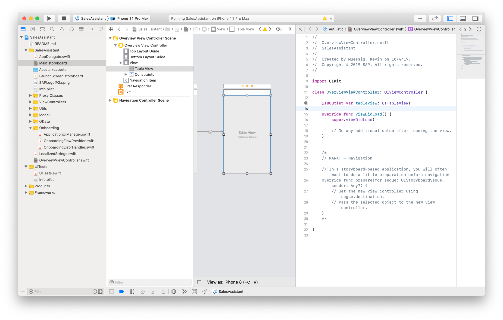

Before you go to the next step, please click on the **Standard Editor** to close the side-by-side view.

[DONE]
[ACCORDION-END]

[ACCORDION-BEGIN [Step 7: ](Make Overview View Controller delegate and datasource for Table View)]

Using a `UIViewController` requires you as a developer to manually set the `OverviewViewController` as `UITableViewDelegate` and `UITableViewDataSource`.

> Using a `UITableViewController` this is done automatically. We are using a `UIViewController` here to have a bit more flexibility on how the Table View is laid out.

In the `Main.storyboard` please select the Table View and open the **Connections Inspector**. In there you can see two properties in the **Outlets** section: `dataSource` , `delegate`.

You can see those small circles next to them, please **Click + drag** from each circle to the Table View to create a connection.

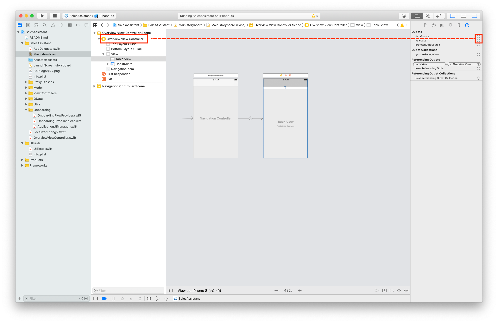

A connection is now made and the Table View knows that the `OverviewViewController` is responsible for it's Data Source and Delegate.

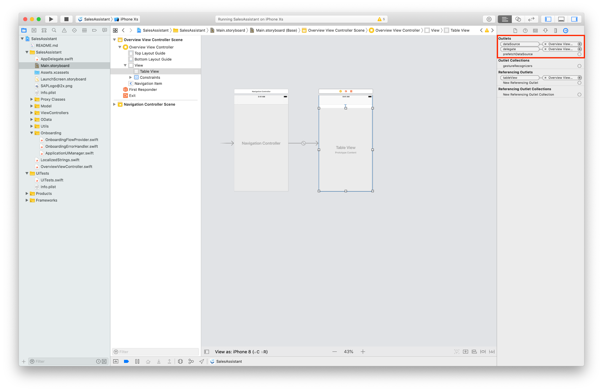

[DONE]
[ACCORDION-END]

[ACCORDION-BEGIN [Step 8: ](Run app to see result of your work)]

Seeing the result of your work is the most satisfying part, that's why you should run your app on simulator to see if everything works properly and have some satisfaction.

Your UI should look like this now:

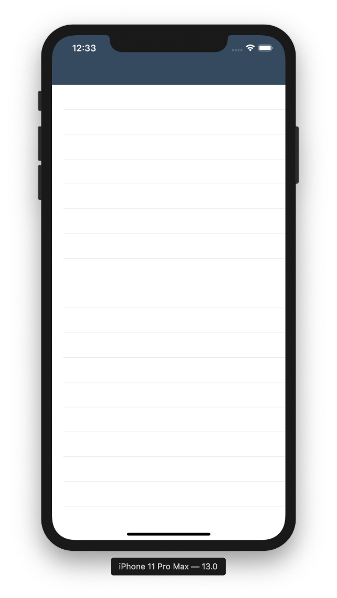

[VALIDATE_8]
[ACCORDION-END]
