## Prerequisites

- **Development environment:** Apple Mac running macOS Catalina or higher with Xcode 11 or higher
- **SAP BTP SDK for iOS:** Version 5.0 or newer

## Details

### You will learn  

- How to change the Assistant generated UI with your own using Xcode and storyboards

---

[ACCORDION-BEGIN [Step 1: ](Replace generated UI with your own)]

The Human Interface Guidelines for SAP Fiori for iOS has certain screens defined that you can use as guidance on how you could structure a business app.

Usually a business application has some sort of overview screen giving the user an entry point to key information he or she might need to do their daily work. From there, the user can navigate into more detailed information or more concrete workflows.

> If you're interested in the HIG of SAP for SAP Fiori for iOS, visit: [SAP Fiori for iOS Design Guidelines](https://experience.sap.com/fiori-design-ios/)

In the last tutorial, you've learned how to create an Xcode project using the SAP BTP SDK Assistant for iOS. The result of the generation process of the Assistant can be a split view screen if chosen. In this tutorial you will change the generated UI to make your own.

1. First, open your Xcode project if not opened already and select the **`Main.storyboard`**, this will open the `Main.storyboard` in the Interface Builder of Xcode.

    > The Interface Builder allows you to create complete app flows including the UI for each screen of those flows.

    !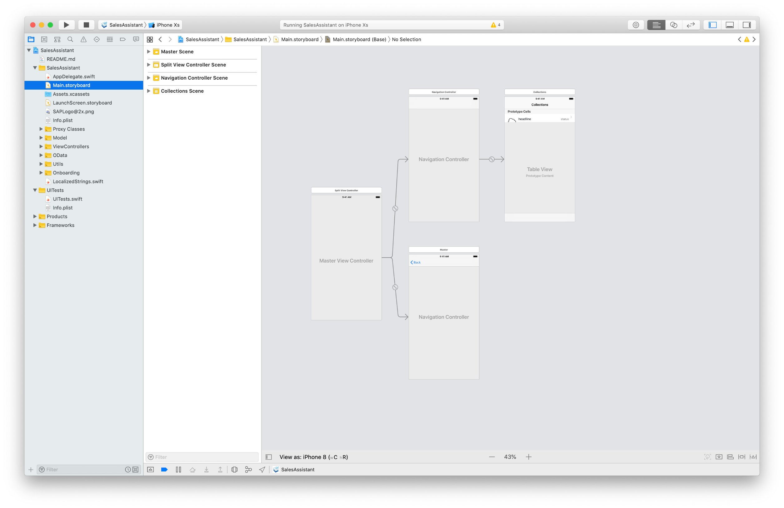

    For now go ahead and select all displayed View Controllers in the `Main.storyboard` and simply delete them.

    !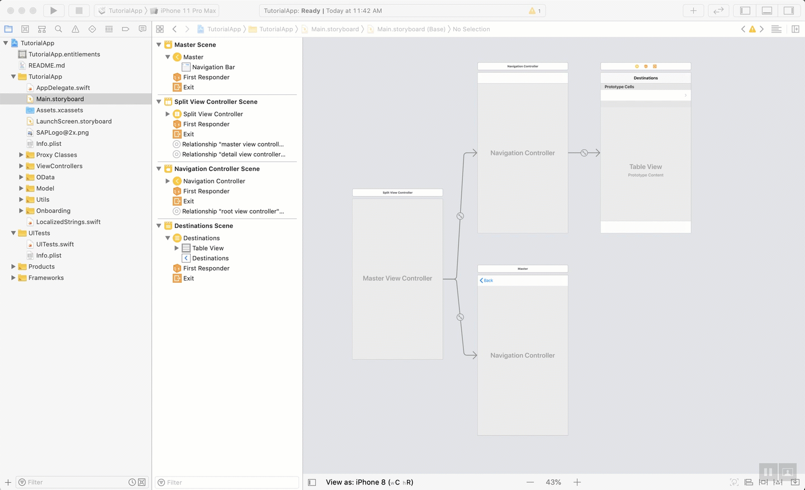

2. Next, click the **Object Library** and search for **`Table View Controller`**. Drag and drop the object on the canvas of the Interface Builder.

    !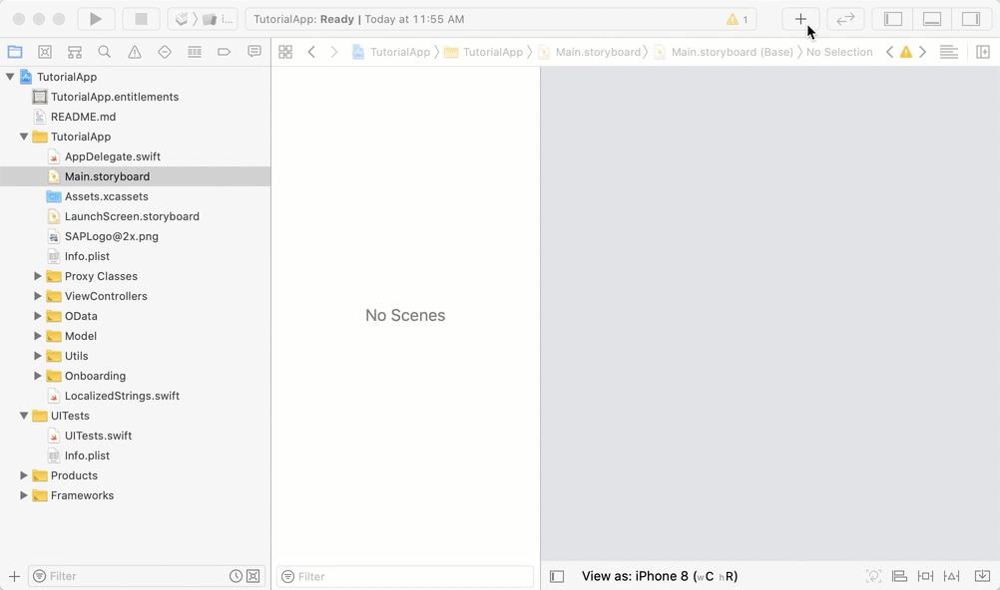

3. Thinking ahead, you know that you want to have navigation to various screens from the overview screen. Using a Navigation Controller and embedding the just-created View Controller in it allows us to use the power of the Navigation Controller for navigation. The Navigation Controller handles the navigation stack for you, which is exactly what you want.

    Select the added View Controller and click **Editor > Embed In > Navigation Controller**. This will embed your View Controller in a Navigation Controller. You should see the Navigation Bar appear in the View Controller.

    !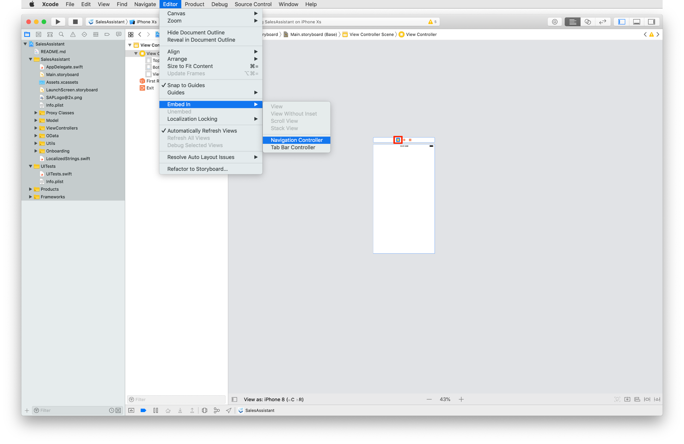

    !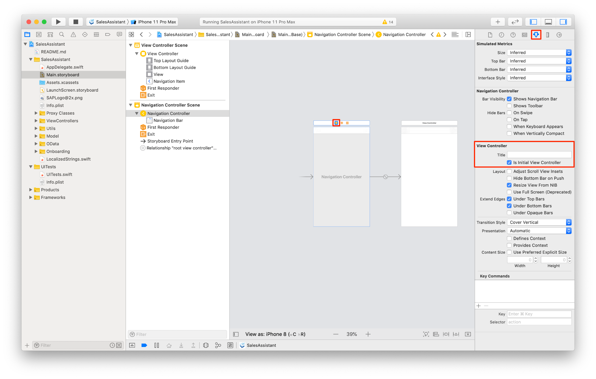

4. Almost every View Controller you're adding to the storyboard needs a **Cocoa Touch Class** representing the logic implementation of that View Controller.

    Control + click your project source in the **Project Navigator** on the left-hand side and select **New File**.

    !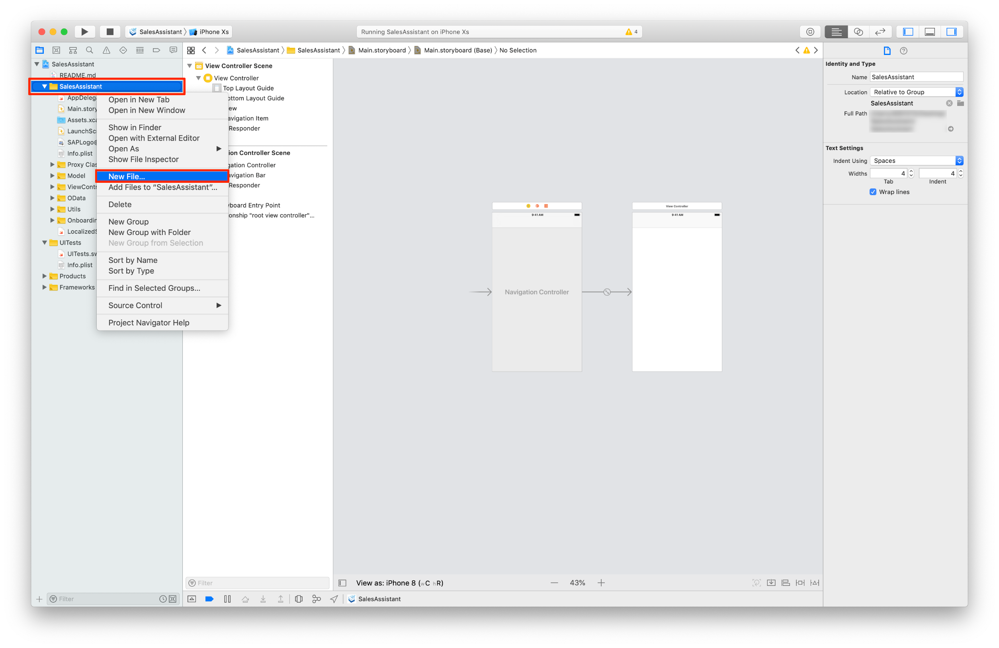

5. Select the **Cocoa Touch Class** in the upcoming modal sheet, and click **Next**.

    !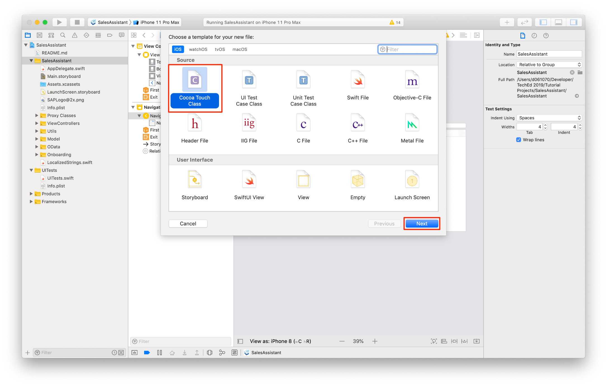

    Make sure that your class is going to subclass of **`UITableViewController`** and change the name to **`OverviewTableViewController`**. Click **Next** and then **Create**.

    !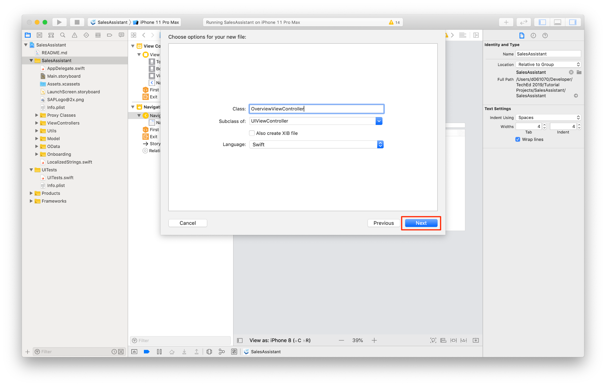

    Great! You've created your first Table View Controller Swift class, now you have to set this class as **Custom Class** in the **`Main.storyboard`** View Controller.

6. Open the storyboard and select the created View Controller. On the right side, you can see the side bar. Click the **Identity Inspector** to set the custom class to **`OverviewTableViewController`** and hit return on your keyboard.

    !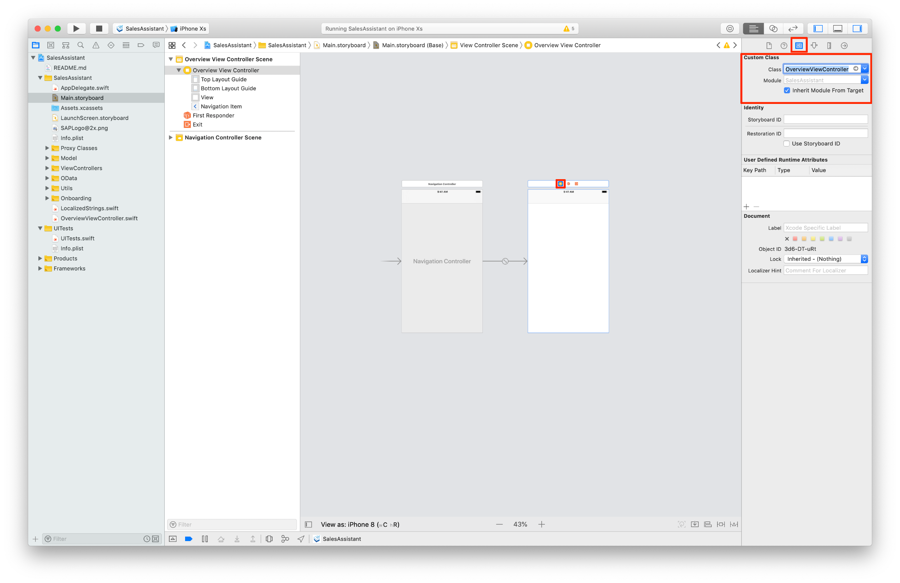

    Notice the title of the Table View Controller on the left side changes accordingly to the entered custom class.

7. Lastly you have to make the Navigation Controller an initial View Controller. Doing this will allow us to instantiate an initial View Controller from Storyboard and tells the system the main entry point for that specific Storyboard.

    Select the **Navigation Controller** and open the **Attributes Inspector** to check the box next to **Is Initial View Controller**.

    !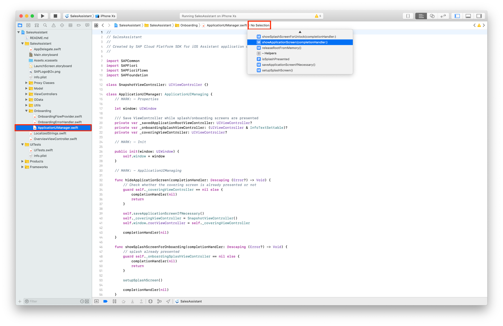

[DONE]
[ACCORDION-END]

[ACCORDION-BEGIN [Step 2: ](Change the Application UI Manager code to display the overview)]

In order to display the newly added overview screen right after the onboarding process is finished, you have to make some manual changes in the **`ApplicationUIManager.swift`** class. This class is mainly responsible for coordinating the UI flow for user onboarding all the way to the first screen after the onboarding process.

1. Open the `ApplicationUIManager.swift` class using the Project Navigator and look for the `showApplicationScreen(completionHandler:)` method.

    > **Hint:** You can use the `Open Quickly` feature of Xcode to search for the `ApplicationUIManager` class with `Command + Shift + O`. Once you've opened the file, you can quickly jump to the `showApplicationScreen(completionHandler:)` function by using the **jump bar** at the top of the editor area pane.

    !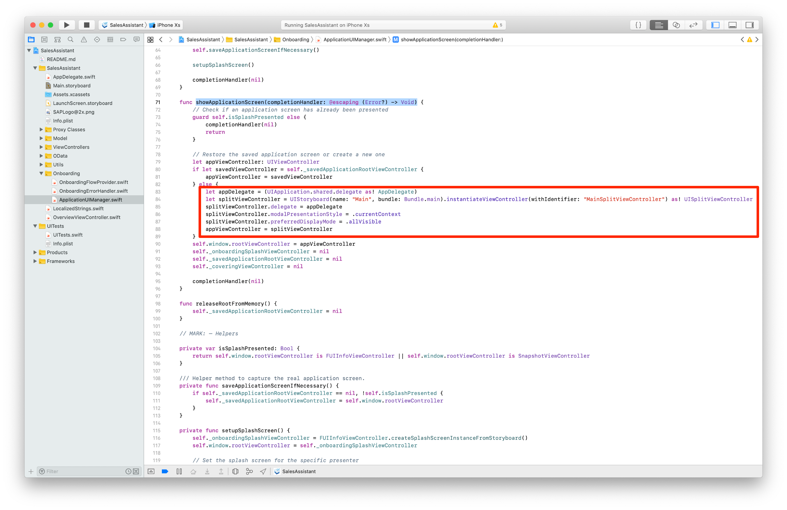

    In the method you see an `if-else` statement initializing a Split View Controller, which is non-existing anymore because you have your Overview Table View Controller.

    > For all upcoming tutorials and code snippets, you will find inline comments used to help you understand what the code is actually doing. Read the inline comments carefully!

2. Change the method code to the following:

    ```Swift[15-16]
    func showApplicationScreen(completionHandler: @escaping (Error?) -> Void) {
        // Check if an application screen has already been presented
        guard self.isSplashPresented else {
            completionHandler(nil)
            return
        }

        // Restore the saved application screen or create a new one
        let appViewController: UIViewController
        if let savedViewController = self._savedApplicationRootViewController {
            appViewController = savedViewController
        } else {
            // This will retrieve an instance of the Main storyboard and instantiate the initial view controller which is the Navigation Controller. Force cast to UINavigationController and assign the instance as appViewController.

            let overviewTVC = UIStoryboard(name: "Main", bundle: Bundle.main).instantiateInitialViewController() as! UINavigationController
            appViewController = overviewTVC
        }
        self.window.rootViewController = appViewController
        self._onboardingSplashViewController = nil
        self._savedApplicationRootViewController = nil
        self._coveringViewController = nil

        completionHandler(nil)
    }

    ```

Great you did all necessary steps to replace the generated UI with your own. Go ahead and run the app on **`iPhone 12 Pro`** or any other simulator to see the result.

> In case you haven't onboarded yet, go through the onboarding process before seeing your Overview Screen appear.


[VALIDATE_3]
[ACCORDION-END]
