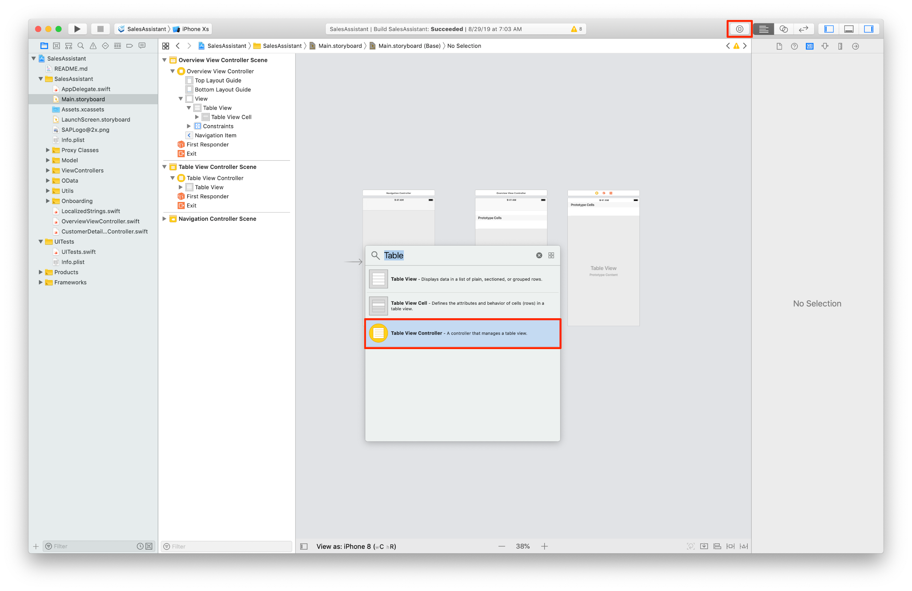
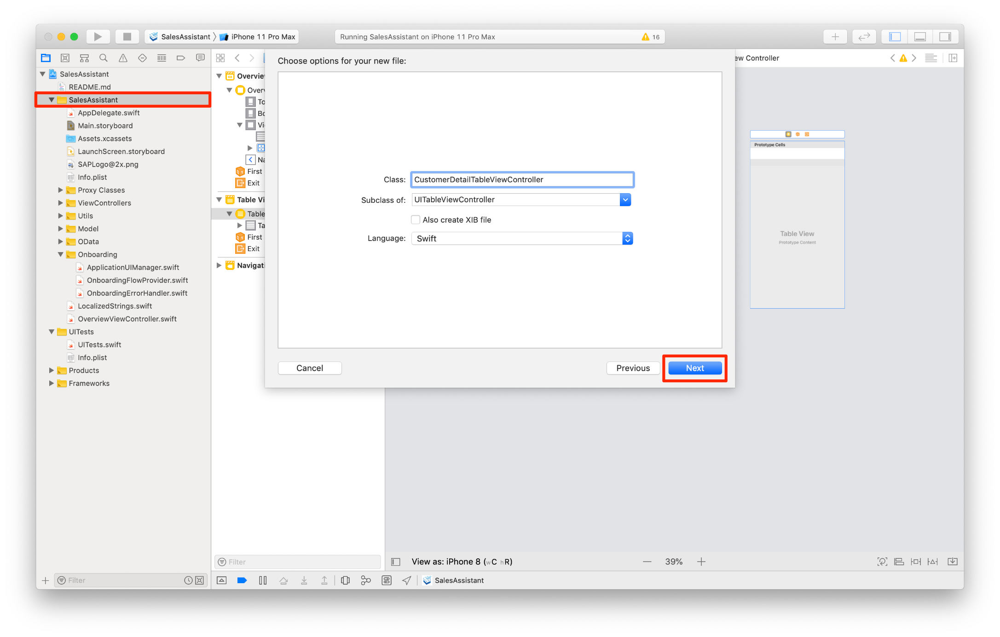
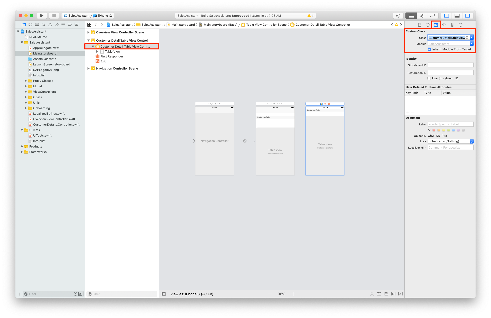
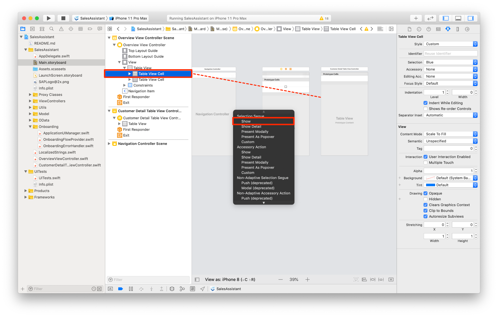
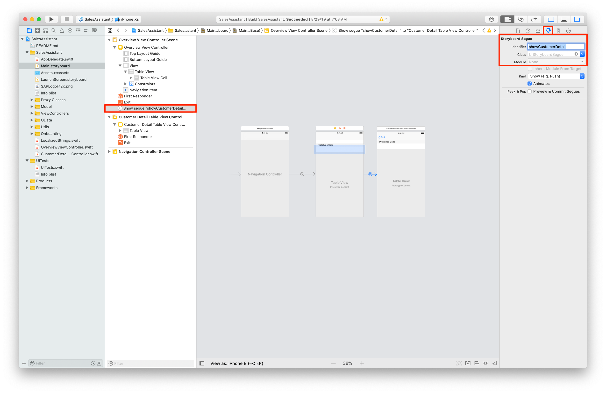
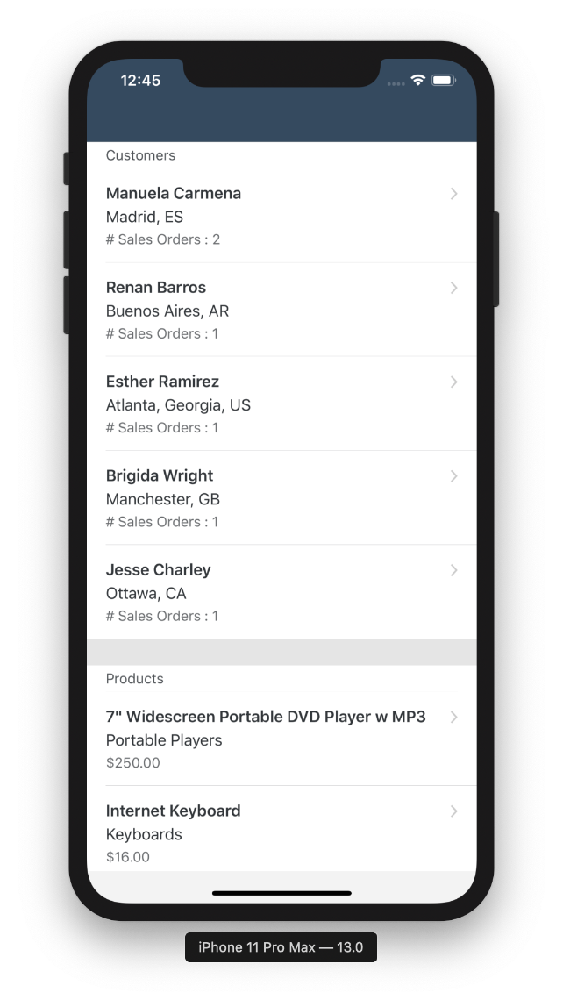
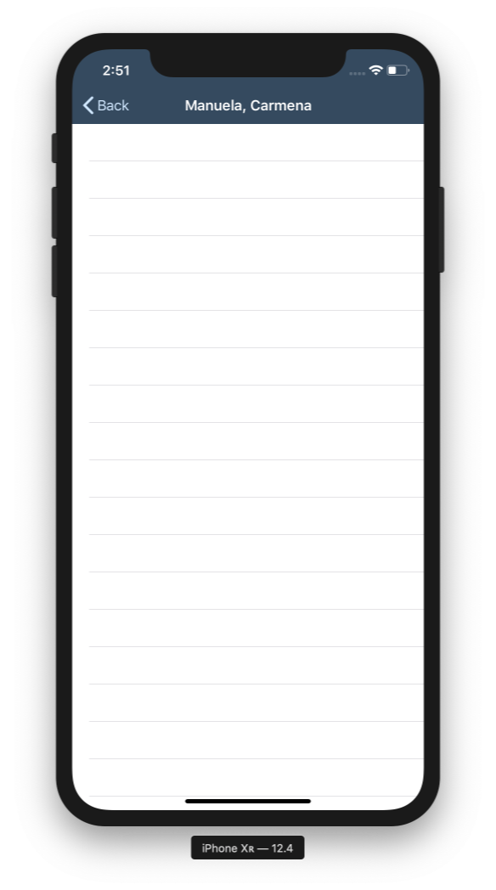

## Prerequisites

- **Development environment:** Apple Mac running macOS Catalina or higher with Xcode 11 or higher
- **SAP BTP SDK for iOS:** Version 5.0

## Details

### You will learn  

- How to implement a Fiori Object Table View Cell
- How to implement Table View Section Headers and Footers
- How to use the generated data service to load data from the OData service

You will add Table View Section Headers and Footers to give the data more structure and a nice clean UI.

---

[ACCORDION-BEGIN [Step 1: ](Implement loading of customer and product data)]

In the previous tutorials you've built the foundation for implementing the logic behind the Overview View Controller. Before you can implement the data source and delegate logic for loading the Table View, you'll need to retrieve some data.

This is fairly simple thanks to the SAP BTP SDK for iOS and the generated model layer and convenience data service.

1. Open up the `OverviewViewController.swift` class and right below the `import UIKit` add the following import statements:

    ```Swift

    import SAPFiori
    import SAPOData
    import SAPOfflineOData
    import SAPCommon
    import SAPFoundation
    import SAPFioriFlows

    ```

    These import statements will import SAP's UI framework, the OData Online as well as the Offline framework, and the Common framework containing the Logging API.

2. Next you'll add a couple of properties required for storing a data service instance, the App Delegate instance, a Logger instance, and two arrays used to store the customer and product data.

    Add the following lines of code inside the class brackets and right below the class definition:

    ```Swift

    // The Logger is already setup in the AppDelegate through the SAP BTP SDK Assistant for iOS , that's why you can easily can get an instance here.
    private let logger = Logger.shared(named: "OverviewViewController")

    private var customers = [Customer]()
    private var products = [Product]()

    ```

3. To give the user feedback of the loading process, you're going to use a `FUILoadingIndicatorView`. The assistant generates a helper protocol providing you with convenient way to display a loading indicator.

    Add the `SAPFioriLoadingIndicator` class protocol to your class definition:

    ```Swift

    class OverviewViewController: UITableViewController, SAPFioriLoadingIndicator

    ```

    The protocol requires you to add a reference to a `FUILoadingIndicatorView` instance.

    Add the following line of code right below the products array:

    ```Swift

    var loadingIndicator: FUILoadingIndicatorView?

    ```

4. Next you will implement code which is responsible for retrieving and storing a data service instance.

    Add the following lines of code as class properties to the `OverviewViewController.swift` class:

    ```Swift
    /// First retrieve the destinations your app can talk to from the AppParameters.
    let destinations = FileConfigurationProvider("AppParameters").provideConfiguration().configuration["Destinations"] as! NSDictionary

    var dataService: ESPMContainer<OfflineODataProvider>? {
        guard let odataController = OnboardingSessionManager.shared.onboardingSession?.odataControllers[destinations["com.sap.edm.sampleservice.v2"] as! String] as? Comsapedmsampleservicev2OfflineODataController, let dataService = odataController.espmContainer else {
            AlertHelper.displayAlert(with: NSLocalizedString("OData service is not reachable, please onboard again.", comment: ""), error: nil, viewController: self)
            return nil
        }
        return dataService
    }

    ```

5. Implement a method for loading the initial data used to populate the Table View.

    Add the following method right below the `viewDidLoad(:)` method:

    ```Swift

    private func loadInitialData() {
      // start showing the loading indicator
      self.showFioriLoadingIndicator()

      // Using a DispatchGroup will help you to get notified when all the needed data sets are loaded
      let group = DispatchGroup()

      // Fetch customers and products, pass in the DispatchGroup to handle entering and leaving of the group
      fetchCustomers(group)

      fetchProducts(group)

      // When all data tasks are completed, hide the loading indicator and reload the table view. This will cause a refresh of the UI, displaying the newly loaded data
      group.notify(queue: DispatchQueue.main) {
          self.hideFioriLoadingIndicator()
          self.tableView.reloadData()
      }
    }

    ```

    Adding the method above will result in compile time errors because the `fetchCustomers(_:)` and `fetchProducts(_:)` methods are not implemented yet.

6. Add the following lines of code below the `loadInitialData()` method to implement the query for customers:

    ```Swift

    private func fetchCustomers(_ group: DispatchGroup) {
        // Enter the DispatchGroup
        group.enter()

        // Define a Data Query which is a class of the SAPOData framework. This query will tell the OData Service to also load the available Sales Orders for each Customer
        let query = DataQuery().expand(Customer.salesOrders)

        // Now call the data service and fetch the customers matching the above defined query. When during runtime the block gets entered you expect a result or an error. Also you want to hold a weak reference of self to not run into object reference issues during runtime.
        dataService?.fetchCustomers(matching: query) { [weak self] result, error in

            // If there is an error show an AlertDialog using the generated convenience class AlertHelper. Also log the error to the console and leave the /group.
            if let error = error {
                AlertHelper.displayAlert(with: "Failed to load list of customers!", error: error, viewController: self!)
                self?.logger.error("Failed to load list of customers!", error: error)
                group.leave()
                return
            }
            // sort the customer result set by the number of available sales orders by customer.
            self?.customers = result!.sorted(by: { $0.salesOrders.count > $1.salesOrders.count })

            group.leave()
        }
    }

    ```

7. Add the following lines of code below the `fetchCustomers(_:)` method to implement the query for products:

    ```Swift

    private func fetchProducts(_ group: DispatchGroup) {
        // Enter the DispatchGroup
        group.enter()

        // Define a Data Query only fetching the top 5 products.
        let query = DataQuery().top(5)

        dataService?.fetchProducts(matching: query) { [weak self] result, error in
            if let error = error {
                AlertHelper.displayAlert(with: "Failed to load list of products!", error: error, viewController: self!)
                self?.logger.error("Failed to load list of products!", error: error)
                group.leave()
                return
            }
            self?.products = result!
            group.leave()
        }
    }

    ```

8. The last step is to call the `loadInitialData()` method when the `OverviewViewController` class is loaded.

    Add the following line of code as the last line in the `viewDidLoad(:)`:

    ```Swift[4]

    override func viewDidLoad() {
        super.viewDidLoad()

        loadInitialData()
    }

    ```

    Now every time our Overview View Controller gets loaded it will load the needed data from the OData Service.

[DONE]
[ACCORDION-END]

[ACCORDION-BEGIN [Step 2: ](Set up Table View and register needed cells)]

Now that the `OverviewViewController` is loading data, it's time to implement the population of Table View Cells. The first step is to register the desired types of cells for the Table View.

1. Add the following lines of code to `viewDidLoad(:)` method, just below the call to its superclass:

    ```Swift[4-13]
    override func viewDidLoad() {
           super.viewDidLoad()

           self.view.backgroundColor = .preferredFioriColor(forStyle: .backgroundBase)

           // Define the estimated row height for each row as well as setting the actual row height to define it's dimension itself.
           // This will cause the Table View to display a cell for at least 80 points.
           tableView.estimatedRowHeight = 80
           tableView.rowHeight = UITableView.automaticDimension

           // Register an FUIObjectTableViewCell and a FUITableViewHeaderFooterView. You can use the convenience reuse identifier defined in the cell classes to later dequeue the cells.
           tableView.register(FUIObjectTableViewCell.self, forCellReuseIdentifier: FUIObjectTableViewCell.reuseIdentifier)
           tableView.register(FUITableViewHeaderFooterView.self, forHeaderFooterViewReuseIdentifier: FUITableViewHeaderFooterView.reuseIdentifier)

           loadInitialData()
       }

    ```

2. To distinct the customers from the products in the Table View you can use Table View Headers to display section headers. To make the UI more appealing Table View Footers are a great way to create separators.

    You will implement the following methods to display a footer, a header and define how many sections to display.

    Add the following methods to the Table View Controller, place them right above the `tableView(_:numberOfRowsInSection:)` method:

    ```Swift

    override func numberOfSections(in tableView: UITableView) -> Int {
        return 0
    }

    override func tableView(_ tableView: UITableView, viewForHeaderInSection section: Int) -> UIView? {
        return nil
    }

    override func tableView(_ tableView: UITableView, viewForFooterInSection section: Int) -> UIView? {
        return nil
    }

    ```

3. To actually react to user interaction on the Table View Cells, the Table View's delegate protocol provides a method to react to Table View Row selection.

    Add the following method below the `tableView(_:numberOfRowsInSection:)` method:

    ```Swift

    override func tableView(_ tableView: UITableView, didSelectRowAt indexPath: IndexPath) {
        //TODO: Implement
    }

    ```

4. Your class should look something like this now:

```Swift

//
//  OverviewTableViewController.swift
//  SalesAssistant
//
//  Created by Muessig, Kevin on 03.11.20.
//  Copyright © 2020 SAP. All rights reserved.
//

import UIKit
import SAPFiori
import SAPOData
import SAPOfflineOData
import SAPCommon
import SAPFoundation
import SAPFioriFlows

class OverviewTableViewController: UITableViewController, SAPFioriLoadingIndicator {

    // The Logger is already setup in the AppDelegate through the SAP BTP SDK Assistant for iOS , that's why you can easily can get an instance here.
    private let logger = Logger.shared(named: "OverviewViewController")
    var loadingIndicator: FUILoadingIndicatorView?

    private var customers = [Customer]()
    private var products = [Product]()

    /// First retrieve the destinations your app can talk to from the AppParameters.
    let destinations = FileConfigurationProvider("AppParameters").provideConfiguration().configuration["Destinations"] as! NSDictionary

    var dataService: ESPMContainer<OfflineODataProvider>? {
        guard let odataController = OnboardingSessionManager.shared.onboardingSession?.odataControllers[destinations["com.sap.edm.sampleservice.v2"] as! String] as? Comsapedmsampleservicev2OfflineODataController, let dataService = odataController.espmContainer else {
            AlertHelper.displayAlert(with: NSLocalizedString("OData service is not reachable, please onboard again.", comment: ""), error: nil, viewController: self)
            return nil
        }
        return dataService
    }

    override func viewDidLoad() {
        super.viewDidLoad()

        self.view.backgroundColor = .preferredFioriColor(forStyle: .backgroundBase)

        // Define the estimated row height for each row as well as setting the actual row height to define it's dimension itself.
        // This will cause the Table View to display a cell for at least 80 points.
        tableView.estimatedRowHeight = 80
        tableView.rowHeight = UITableView.automaticDimension

        // Register an FUIObjectTableViewCell and a FUITableViewHeaderFooterView. You can use the convenience reuse identifier defined in the cell classes to later dequeue the cells.
        tableView.register(FUIObjectTableViewCell.self, forCellReuseIdentifier: FUIObjectTableViewCell.reuseIdentifier)
        tableView.register(FUITableViewHeaderFooterView.self, forHeaderFooterViewReuseIdentifier: FUITableViewHeaderFooterView.reuseIdentifier)

        loadInitialData()
    }

    private func loadInitialData() {
        // start showing the loading indicator
        self.showFioriLoadingIndicator()

        // Using a DispatchGroup will help you to get notified when all the needed data sets are loaded
        let group = DispatchGroup()

        // Fetch customers and products, pass in the DispatchGroup to handle entering and leaving of the group
        fetchCustomers(group)

        fetchProducts(group)

        // When all data tasks are completed, hide the loading indicator and reload the table view. This will cause a refresh of the UI, displaying the newly loaded data
        group.notify(queue: DispatchQueue.main) {
            self.hideFioriLoadingIndicator()
            self.tableView.reloadData()
        }
    }

    private func fetchCustomers(_ group: DispatchGroup) {
        // Enter the DispatchGroup
        group.enter()

        // Define a Data Query which is a class of the SAPOData framework. This query will tell the OData Service to also load the available Sales Orders for each Customer
        let query = DataQuery().expand(Customer.salesOrders)

        // Now call the data service and fetch the customers matching the above defined query. When during runtime the block gets entered you expect a result or an error. Also you want to hold a weak reference of self to not run into object reference issues during runtime.
        dataService?.fetchCustomers(matching: query) { [weak self] result, error in

            // If there is an error show an AlertDialog using the generated convenience class AlertHelper. Also log the error to the console and leave the /group.
            if let error = error {
                AlertHelper.displayAlert(with: "Failed to load list of customers!", error: error, viewController: self!)
                self?.logger.error("Failed to load list of customers!", error: error)
                group.leave()
                return
            }
            // sort the customer result set by the number of available sales orders by customer.
            self?.customers = result!.sorted(by: { $0.salesOrders.count > $1.salesOrders.count })

            group.leave()
        }
    }

    private func fetchProducts(_ group: DispatchGroup) {
        // Enter the DispatchGroup
        group.enter()

        // Define a Data Query only fetching the top 5 products.
        let query = DataQuery().top(5)

        dataService?.fetchProducts(matching: query) { [weak self] result, error in
            if let error = error {
                AlertHelper.displayAlert(with: "Failed to load list of products!", error: error, viewController: self!)
                self?.logger.error("Failed to load list of products!", error: error)
                group.leave()
                return
            }
            self?.products = result!
            group.leave()
        }
    }

    // MARK: - Table view data source
    override func numberOfSections(in tableView: UITableView) -> Int {
        return 0
    }

    override func tableView(_ tableView: UITableView, viewForHeaderInSection section: Int) -> UIView? {
        return nil
    }

    override func tableView(_ tableView: UITableView, viewForFooterInSection section: Int) -> UIView? {
        return nil
    }

    override func tableView(_ tableView: UITableView, numberOfRowsInSection section: Int) -> Int {
        // #warning Incomplete implementation, return the number of rows
        return 0
    }

    // MARK: - Table view delegate

    override func tableView(_ tableView: UITableView, didSelectRowAt indexPath: IndexPath) {
        //TODO: Implement
    }
}


```

[DONE]
[ACCORDION-END]

[ACCORDION-BEGIN [Step 3: ](Implement Table View's data source and delegate)]

In the previous step you registered the needed cells, set up the Table View and implemented the method stubs for the data source and delegate. You will implement these methods step-by-step so the table view is actually displaying data and reacting to user interaction.

1. The Table View is supposed to have two sections, one for the customers and one for the products.

    Return **2** in the `numberOfSections(in:)`:

    ```Swift[2]

    override func numberOfSections(in tableView: UITableView) -> Int {
        return 2
    }

    ```

2. Every section should be distinctive, for that you can tell the Table View what Table View Headers it should display.

    Implement the `tableView(_:viewForHeaderInSection:)` like the following:

    ```Swift[3-22]

    override func tableView(_ tableView: UITableView, viewForHeaderInSection section: Int) -> UIView? {

        // First dequeue the Header Footer View you registered in the viewDidLoad(:).
        let header = tableView.dequeueReusableHeaderFooterView(withIdentifier: FUITableViewHeaderFooterView.reuseIdentifier) as! FUITableViewHeaderFooterView

        // Set it's style to title.
        header.style = .title
        header.separators = .bottom

        // For the first section give back a Header that is for the customers and the second is for the products
        switch section {
        case 0:
            header.titleLabel.text = "Customers"
            break
        case 1:
            header.titleLabel.text = "Products"
            break
        default:
            break
        }

        return header
    }

    ```

3. The Footer of the sections will be used as dividers. Those dividers don't have a functional meaning but make the UI cleaner.

    Implement the `tableView(_:viewForFooterInSection:)` as the following:

    ```Swift[2-7]

    override func tableView(_ tableView: UITableView, viewForFooterInSection section: Int) -> UIView? {
        if section == 1 { return UIView() }

        let divider = UITableViewHeaderFooterView()
        divider.backgroundColor = .preferredFioriColor(forStyle: .backgroundBase)

        return divider
    }

    ```

4. Now coming to the actual needed data source methods. The `tableView(_:numberOfRowsInSection:)` is fairly simple to implement:

    ```Swift[3-12]

    // If the data arrays are empty return 0, else return 5.
    override func tableView(_ tableView: UITableView, numberOfRowsInSection section: Int) -> Int {
        switch section {
        case 0:
            if customers.isEmpty { return 0 }
        case 1:
            if products.isEmpty { return 0 }
        default:
            return 0
        }

        return 5
    }

    ```

5. Coming to the exciting part, implementing the `tableView(_:cellForRowAt:)` method. This method is going to be called by the table view every time it wants to dequeue a cell.

    Implement the following code and read the inline comments carefully:

    ```Swift

    override func tableView(_ tableView: UITableView, cellForRowAt indexPath: IndexPath) -> UITableViewCell {

        // Dequeue the FUIObjectTableViewCell and cast it accordingly.
        let cell = tableView.dequeueReusableCell(withIdentifier: FUIObjectTableViewCell.reuseIdentifier) as! FUIObjectTableViewCell

        // Set the accessory type of the cell to disclosure, this will indicate to the user that those cells are tappable.
        cell.accessoryType = .disclosureIndicator

        // Distinct the cell setup depending on the section.
        switch indexPath.section {
        case 0:

            // Get the currently needed customer and fill the cell's properties
            let customer = customers[indexPath.row]
            cell.headlineText = "\(customer.firstName ?? "") \(customer.lastName ?? "")"
            cell.subheadlineText = "\(customer.city ?? ""), \(customer.country ?? "")"
            cell.footnoteText = "# Sales Orders : \(customer.salesOrders.count)"
            return cell
        case 1:

            // Get the currently needed product and fill the cell's properties
            let product = products[indexPath.row]
            cell.headlineText = product.name ?? ""
            cell.subheadlineText = product.categoryName ?? ""

            // If there is a product price set, format it with the help of a NumberFormatter
            if let price = product.price {
                let formatter = NumberFormatter()
                formatter.numberStyle = .currency
                let formattedPrice = formatter.string(for: price.intValue())

                cell.footnoteText = formattedPrice ?? ""
            }

            return cell
        default:
            return UITableViewCell()
        }
    }

    ```

6. Your table view controller should look something like this now:

```Swift[116-210]
//
//  OverviewTableViewController.swift
//  SalesAssistant
//
//  Created by Muessig, Kevin on 03.11.20.
//  Copyright © 2020 SAP. All rights reserved.
//

import UIKit
import SAPFiori
import SAPOData
import SAPOfflineOData
import SAPCommon
import SAPFoundation
import SAPFioriFlows

class OverviewTableViewController: UITableViewController, SAPFioriLoadingIndicator {

    // The Logger is already setup in the AppDelegate through the SAP BTP SDK Assistant for iOS , that's why you can easily can get an instance here.
    private let logger = Logger.shared(named: "OverviewViewController")
    var loadingIndicator: FUILoadingIndicatorView?

    private var customers = [Customer]()
    private var products = [Product]()

    /// First retrieve the destinations your app can talk to from the AppParameters.
    let destinations = FileConfigurationProvider("AppParameters").provideConfiguration().configuration["Destinations"] as! NSDictionary

    var dataService: ESPMContainer<OfflineODataProvider>? {
        guard let odataController = OnboardingSessionManager.shared.onboardingSession?.odataControllers[destinations["com.sap.edm.sampleservice.v2"] as! String] as? Comsapedmsampleservicev2OfflineODataController, let dataService = odataController.espmContainer else {
            AlertHelper.displayAlert(with: NSLocalizedString("OData service is not reachable, please onboard again.", comment: ""), error: nil, viewController: self)
            return nil
        }
        return dataService
    }

    override func viewDidLoad() {
        super.viewDidLoad()

        self.view.backgroundColor = .preferredFioriColor(forStyle: .backgroundBase)

        // Define the estimated row height for each row as well as setting the actual row height to define it's dimension itself.
        // This will cause the Table View to display a cell for at least 80 points.
        tableView.estimatedRowHeight = 80
        tableView.rowHeight = UITableView.automaticDimension

        // Register an FUIObjectTableViewCell and a FUITableViewHeaderFooterView. You can use the convenience reuse identifier defined in the cell classes to later dequeue the cells.
        tableView.register(FUIObjectTableViewCell.self, forCellReuseIdentifier: FUIObjectTableViewCell.reuseIdentifier)
        tableView.register(FUITableViewHeaderFooterView.self, forHeaderFooterViewReuseIdentifier: FUITableViewHeaderFooterView.reuseIdentifier)

        loadInitialData()
    }

    private func loadInitialData() {
        // start showing the loading indicator
        self.showFioriLoadingIndicator()

        // Using a DispatchGroup will help you to get notified when all the needed data sets are loaded
        let group = DispatchGroup()

        // Fetch customers and products, pass in the DispatchGroup to handle entering and leaving of the group
        fetchCustomers(group)

        fetchProducts(group)

        // When all data tasks are completed, hide the loading indicator and reload the table view. This will cause a refresh of the UI, displaying the newly loaded data
        group.notify(queue: DispatchQueue.main) {
            self.hideFioriLoadingIndicator()
            self.tableView.reloadData()
        }
    }

    private func fetchCustomers(_ group: DispatchGroup) {
        // Enter the DispatchGroup
        group.enter()

        // Define a Data Query which is a class of the SAPOData framework. This query will tell the OData Service to also load the available Sales Orders for each Customer
        let query = DataQuery().expand(Customer.salesOrders)

        // Now call the data service and fetch the customers matching the above defined query. When during runtime the block gets entered you expect a result or an error. Also you want to hold a weak reference of self to not run into object reference issues during runtime.
        dataService?.fetchCustomers(matching: query) { [weak self] result, error in

            // If there is an error show an AlertDialog using the generated convenience class AlertHelper. Also log the error to the console and leave the /group.
            if let error = error {
                AlertHelper.displayAlert(with: "Failed to load list of customers!", error: error, viewController: self!)
                self?.logger.error("Failed to load list of customers!", error: error)
                group.leave()
                return
            }
            // sort the customer result set by the number of available sales orders by customer.
            self?.customers = result!.sorted(by: { $0.salesOrders.count > $1.salesOrders.count })

            group.leave()
        }
    }

    private func fetchProducts(_ group: DispatchGroup) {
        // Enter the DispatchGroup
        group.enter()

        // Define a Data Query only fetching the top 5 products.
        let query = DataQuery().top(5)

        dataService?.fetchProducts(matching: query) { [weak self] result, error in
            if let error = error {
                AlertHelper.displayAlert(with: "Failed to load list of products!", error: error, viewController: self!)
                self?.logger.error("Failed to load list of products!", error: error)
                group.leave()
                return
            }
            self?.products = result!
            group.leave()
        }
    }

    // MARK: - Table view data source
    override func numberOfSections(in tableView: UITableView) -> Int {
        return 2
    }

    override func tableView(_ tableView: UITableView, viewForHeaderInSection section: Int) -> UIView? {
        // First dequeue the Header Footer View you registered in the viewDidLoad(:).
        let header = tableView.dequeueReusableHeaderFooterView(withIdentifier: FUITableViewHeaderFooterView.reuseIdentifier) as! FUITableViewHeaderFooterView

        // Set it's style to title.
        header.style = .title
        header.separators = .bottom

        // For the first section give back a Header that is for the customers and the second is for the products
        switch section {
        case 0:
            header.titleLabel.text = "Customers"
            break
        case 1:
            header.titleLabel.text = "Products"
            break
        default:
            break
        }

        return header
    }

    override func tableView(_ tableView: UITableView, viewForFooterInSection section: Int) -> UIView? {
        if section == 1 { return UIView() }

        let divider = UITableViewHeaderFooterView()
        divider.backgroundColor = .preferredFioriColor(forStyle: .backgroundBase)

        return divider
    }

    override func tableView(_ tableView: UITableView, numberOfRowsInSection section: Int) -> Int {
        switch section {
        case 0:
            if customers.isEmpty { return 0 }
        case 1:
            if products.isEmpty { return 0 }
        default:
            return 0
        }

        return 5
    }

    override func tableView(_ tableView: UITableView, cellForRowAt indexPath: IndexPath) -> UITableViewCell {

        // Dequeue the FUIObjectTableViewCell and cast it accordingly.
        let cell = tableView.dequeueReusableCell(withIdentifier: FUIObjectTableViewCell.reuseIdentifier) as! FUIObjectTableViewCell

        // Set the accessory type of the cell to disclosure, this will indicate to the user that those cells are tappable.
        cell.accessoryType = .disclosureIndicator

        // Distinct the cell setup depending on the section.
        switch indexPath.section {
        case 0:

            // Get the currently needed customer and fill the cell's properties
            let customer = customers[indexPath.row]
            cell.headlineText = "\(customer.firstName ?? "") \(customer.lastName ?? "")"
            cell.subheadlineText = "\(customer.city ?? ""), \(customer.country ?? "")"
            cell.footnoteText = "# Sales Orders : \(customer.salesOrders.count)"
            return cell
        case 1:

            // Get the currently needed product and fill the cell's properties
            let product = products[indexPath.row]
            cell.headlineText = product.name ?? ""
            cell.subheadlineText = product.categoryName ?? ""

            // If there is a product price set, format it with the help of a NumberFormatter
            if let price = product.price {
                let formatter = NumberFormatter()
                formatter.numberStyle = .currency
                let formattedPrice = formatter.string(for: price.intValue())

                cell.footnoteText = formattedPrice ?? ""
            }

            return cell
        default:
            return UITableViewCell()
        }
    }

    // MARK: - Table view delegate

    override func tableView(_ tableView: UITableView, didSelectRowAt indexPath: IndexPath) {
        //TODO: Implement
    }
}

```

[DONE]
[ACCORDION-END]

[ACCORDION-BEGIN [Step 4: ](Create the needed segue to the Customer Detail View Controller)]

The Overview View Controller is almost implemented. The last thing missing is the navigation to the Customer Detail View Controller.

In theory you might want the user to see a list of all customers and products, but for this tutorial series you won't implement that. This series is focusing on the machine learning capabilities, so that's why you only will implement the Customer Detail Screen. For that, you will implement the defined delegate method in this step.

In the iOS world, there are so-called **segues**, which can be used to perform navigation from one View Controller to another. Segues also allows you to access the so-called destination View Controller, this enables you to hand over data and do other setups for that View Controller. Let's define the segues to give you a better understanding.
You will create a segue that goes from the Table View Cell that contains the customer data to the actual Customer Detail View Controller.

1. Open the `Main.storyboard` and locate your `OverviewViewController`.

    In the `Main.storyboard`, add another Table View Controller from the **Object Library**.

    

2. Again, the just-created Table View Controller needs a Swift class for custom implementation.

    Right-click the `SalesAssistant` group in the Project Navigator and create a new **Cocoa Touch Class**. Make sure it is sub-classed from `UITableViewController` and name it `CustomerDetailTableViewController`.

    

3. Go back to the `Main.storyboard`, select the newly created Table View Controller and in the **Identity Inspector** set the **Custom Class** to `CustomerDetailTableViewController`, and hit **Return**.

    

4. Select the `OverviewTableViewController` and create a segue to the `CustomerDetailTableViewController` by **control + drag**.

    

5. Last step is to give that segue an identifier.

    Select the segue and in the **Attributes Inspector** set the identifier to `showCustomerDetail`.

    

    Great! The segue is created in storyboard and have an identifier. In the next step, you will add code to provide information to the destination View Controller for the segue.

[DONE]
[ACCORDION-END]

[ACCORDION-BEGIN [Step 5: ](Implement the prepare for segue method)]

For this app, it is necessary to provide the Customer ID to the destination View Controller and set the title in the Navigation Item for the Customer Detail View Controller.
iOS provides a simple API to do that.

1. Open `OverviewTableViewController` class and implement a constant holding the segue identifier:

```Swift
private let showCustomerDetailSegue = "showCustomerDetail"

```

2. You can utilize the `prepare(for:sender:)` method to do all of that, open the `OverviewTableViewController` and implement the following code right below `tableView(_:cellForRowAt:)`:

    ```Swift

    override func prepare(for segue: UIStoryboardSegue, sender: Any?) {
        // Implement a switch over the segue identifiers to distinct which segue get's called.
        if segue.identifier == showCustomerDetailSegue {

              // Show the selected Customer on the Detail view
              guard let indexPath = self.tableView.indexPathForSelectedRow else {
                  return
              }

              // Retrieve the selected customer
              let selectedEntity = self.customers[indexPath.row]

              // Get an instance of the CustomerDetailTableViewController with asking the segue for it's destination.
              let detailViewController = segue.destination as! CustomerDetailTableViewController

              // Check if the customer ID is set, if not handle the errors and notify the user.
              guard let customerID = selectedEntity.customerID else {
                  AlertHelper.displayAlert(with: "We're having issues displaying the details for the customer with name \(selectedEntity.lastName ?? "")", error: nil, viewController: self)
                  self.logger.error("Unexpectedly customerID is nil! Can't pass customerID into CustomerDetailViewController.")
                  return
              }

              // Set the customer ID at the CustomerDetailTableViewController.
              detailViewController.customerId = customerID

              // Set the title of the navigation item on the CustomerDetailTableViewController
              detailViewController.navigationItem.title = "\(self.customers[indexPath.row].firstName ?? ""), \(self.customers[indexPath.row].lastName ?? "")"  
        }
    }

    ```

    Right now that code won't compile because you're currently missing the constants that hold the segue identifier as well as the customer ID property on the `CustomerDetailTableViewController`.

3. Next open up the `CustomerDetailTableViewController` and add the following lines of code right above the `viewDidLoad(:)` method:

    ```Swift

    var customerId: String!

    ```

    All the code should compile now.

    Continue to the next step to implement the perform segue call in the delegate method.

[DONE]
[ACCORDION-END]

[ACCORDION-BEGIN [Step 6: ](Call the perform segue method)]

To perform the navigation, locate the delegate method `tableView(_:didSelectRowAt:)` and implement the following line of code in there:

```Swift
if indexPath.section == 0 { performSegue(withIdentifier: showCustomerDetailSegue, sender: tableView.cellForRow(at: indexPath)) }

```

The setup code for the destination View Controller is going to be performed each time the you call the `performSegue(withIdentifier:sender:)` method.

[DONE]
[ACCORDION-END]

[ACCORDION-BEGIN [Step 7: ](Run app to see if navigation works)]

Go ahead and run your app now. Try out the navigation from a customer to the Detail View.

Overview View Controller             |  Customer Detail
:-------------------------:|:-------------------------:
  |  

[VALIDATE_7]
[ACCORDION-END]
