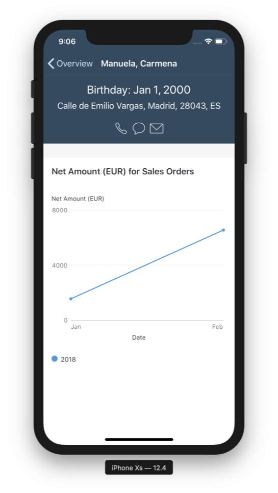

## Prerequisites

- **Development environment:** Apple Mac running macOS Catalina or higher with Xcode 11 or higher
- **SAP BTP SDK for iOS:** Version 5.0

## Details

### You will learn  

- How to implement a Profile Header
- How to implement a Chart View

---

[ACCORDION-BEGIN [Step 1: ](Fetch right customer from data service)]

In the last tutorial, you implemented the Overview Table View Controller and the segue to the Customer Detail Table View Controller. In this tutorial, you will utilize the SAP BTP SDK for iOS to implement a `FUIProfileHeader` and the different Chart Cells.

1. Open the `CustomerDetailTableViewController.swift` class and add the following import statements right below the `UIKit` import:

    ```Swift

    import SAPFiori
    import SAPOData
    import SAPOfflineOData
    import SAPCommon
    import SAPFoundation
    import SAPFioriFlows

    ```

2. Add the following properties right above the `var customerId: String!` line of code:

    ```Swift

    private let logger = Logger.shared(named: "CustomerDetailTableViewController")

    var loadingIndicator: FUILoadingIndicatorView?

    private let profileHeader = FUIProfileHeader()

    ```

    The above code should look familiar to you from the Overview View Controller.

3. Make the `CustomerDetailTableViewController.swift` class implement the `SAPFioriLoadingIndicator` protocol.

    ```Swift

    class CustomerDetailTableViewController: UITableViewController, SAPFioriLoadingIndicator { ... }

    ```

4. Add the following lines of code as class properties to the `CustomerDetailTableViewController.swift` class to retrieve the data service:

    ```Swift
    // The available destinations from Mobile Services are hold in the FileConfigurationProvider. Retrieve it to find the correct data service
    let destinations = FileConfigurationProvider("AppParameters").provideConfiguration().configuration["Destinations"] as! NSDictionary

    // Retrieve the data service using the destinations dictionary and return it.
    var dataService: ESPMContainer<OnlineODataProvider>? {
        guard let odataController = OnboardingSessionManager.shared.onboardingSession?.odataControllers[destinations["com.sap.edm.sampleservice.v2"] as! String] as? Comsapedmsampleservicev2OnlineODataController, let dataService = odataController.espmContainer else {
            AlertHelper.displayAlert(with: NSLocalizedString("OData service is not reachable, please onboard again.", comment: ""), error: nil, viewController: self)
            return nil
        }
        return dataService
    }

    ```

    All that code is pretty much the same as in the Overview View Controller. Instead of fetching all customers you want only the data of the customer matching the provided ID.

5. Add the following lines of code right below the `viewDidLoad(:)` method and read the inline comments for more details about the implemented code:

    ```Swift

    // MARK: - Data loading methods

    private func updateTable() {
        // Show the loading indicator
        self.showFioriLoadingIndicator()

        // Wait for the completion handler to get executed and hide the loading indicator
        self.loadData {
            self.hideFioriLoadingIndicator()

            // You will implement that method in the next steps, for now please just call it here.
            self.setupProfileHeader()

            // Reload the Table View to show the newly fetched data
            self.tableView.reloadData()
        }
    }

    // Load the Customer for the set Customer ID
    private func loadData(completionHandler: @escaping () -> Void) {

        // Expand the OData call to also retrieve the Customers Sales Orders as you're going to display those in the Chart.
        let query = DataQuery().expand(Customer.salesOrders)

        // Fetch the customer with a certain ID
        dataService?.fetchCustomerWithKey(customerID: customerId, query: query) { [weak self] result, error in

            // If there is an error let the user know and log it to the console.
            if let error = error {
                AlertHelper.displayAlert(with: "Couldn't load sales orders for customer.", error: error, viewController: self!)
                self?.logger.error("Couldn't load sales orders for customer.", error: error)
                return
            }

            // Set the result to a customer property
            self?.customer = result!

            // Set the retrieved Sales Orders to it's property
            self?.salesOrderHeaders = result!.salesOrders

            // You will need this property later for the Charts.
            self?.isDataLoaded = true

            // Execute the Completion Handler
            completionHandler()
        }
    }

    ```

    Don't worry, you will fix the compile time errors in a second.

6. Call the `updateTable()` in the `viewDidLoad(:)` method:

    ```Swift

    override func viewDidLoad() {
        super.viewDidLoad()

        updateTable()
    }

    ```

    To fix the rest of the compile-time errors, you have to implement the additional properties for storing the fetched customer, the flag `isDataLoaded`, as well as a computed property for the Sales Order Headers.

7. As you want to display the total net amount of the Customers Sales Orders, you will implement that as a computed property to make the needed calculations.

    Add the following lines of code right below the `var customerId: String` property, read the inline comments for more explanation:

    ```Swift

    // The Sales Order Headers property is an Array.
    private var salesOrderHeaders = [SalesOrderHeader]() {
        // When that property is set through the loadData() make the needed calculations
        didSet {

            // With help of the map call on the array you can access the net amount property of the Sales Order Header of each element in the array, make the calculation and safe it in the Series Data property needed for the Chart.
            seriesData = [salesOrderHeaders.map {
                guard let net = $0.netAmount?.doubleValue() else {
                    return 0.0
                }
                return net
                }]
        }
    }

    private var customer = Customer()
    private var isDataLoaded = false

    ```

8. The `salesOrderHeaders` property will have a compile-time error for now because it tries to set the calculated values to the `seriesData` property which doesn't exist yet.
    To fix that implement the following properties right below the `isDataLoaded` property:

    ```Swift

    private var seriesData: [[Double]]?

    private var chartData = (
        series: ["2018"],
        categories: ["Jan", "Feb", "Mar", "Apr", "May", "Jun", "Jul", "Aug", "Sep", "Oct", "Nov", "Dec"]
    )

    ```

    You're done for now, you will go into detail about how the Chart data is structured at a later point.

[DONE]
[ACCORDION-END]

[ACCORDION-BEGIN [Step 2: ](Set up Table View and register needed cells)]

In order to display the Charts, you're going to use the `FUIChartTitleTableViewCell`, `FUIChartPlotTableViewCell` and the `FUIChartLegendTableViewCell` from the SAP BTP SDK for iOS.

1. Add the following lines of code to the `viewDidLoad(:)` right above the `updateTable()` method call:

    ```Swift[2-12]

  override func viewDidLoad() {
      // The Object Cell is used for the case if there are no Customer Sales Headers available for the chosen customer
      tableView.register(FUIObjectTableViewCell.self, forCellReuseIdentifier: FUIObjectTableViewCell.reuseIdentifier)

      // Used to display the title information for the Chart
      tableView.register(FUIChartTitleTableViewCell.self, forCellReuseIdentifier: FUIChartTitleTableViewCell.reuseIdentifier)

      // Used to display the Chart itself
      tableView.register(FUIChartPlotTableViewCell.self, forCellReuseIdentifier: FUIChartPlotTableViewCell.reuseIdentifier)

      // Used to display the Chart legend
      tableView.register(FUIChartLegendTableViewCell.self, forCellReuseIdentifier: FUIChartLegendTableViewCell.reuseIdentifier)

      updateTable()
    }

    ```

2. You need to set up the Table View in order for the cells to be displayed correctly.
    Add the following lines of code right above the cell registration code:

    ```Swift[14-16]

    override func viewDidLoad() {
          // The Object Cell is used for the case if there are no Customer Sales Headers available for the chosen customer
          tableView.register(FUIObjectTableViewCell.self, forCellReuseIdentifier: FUIObjectTableViewCell.reuseIdentifier)

          // Used to display the title information for the Chart
          tableView.register(FUIChartTitleTableViewCell.self, forCellReuseIdentifier: FUIChartTitleTableViewCell.reuseIdentifier)

          // Used to display the Chart itself
          tableView.register(FUIChartPlotTableViewCell.self, forCellReuseIdentifier: FUIChartPlotTableViewCell.reuseIdentifier)

          // Used to display the Chart legend
          tableView.register(FUIChartLegendTableViewCell.self, forCellReuseIdentifier: FUIChartLegendTableViewCell.reuseIdentifier)

          tableView.estimatedRowHeight = 80
          tableView.rowHeight = UITableView.automaticDimension
          tableView.separatorStyle = .none

          updateTable()
      }

  }

    ```

[DONE]
[ACCORDION-END]

[ACCORDION-BEGIN [Step 3: ](Implement Table View's data source)]

If you remember from the previous tutorial, you have to implement a data source to populate the registered Table View Cells. This time you won't need an extension because the `CustomerDetailTableViewController` is a `UITableViewController`.

These View Controllers are especially provided for Table Views and provide all needed APIs and links without additional work. A `UITableViewController` also knows it's own Table View, which makes it obsolete for you to create an Outlet from the Table View in Storyboard to the Swift class itself.

Add the following lines of code directly below the `loadData(completionHandler:)` method, delete the existing `numberOfSections(in:)` and `tableView(_:numberOfRowsInSection:)` method first. Read the inline comments carefully:

```Swift

// MARK: - UITableViewDataSource implementation

// Return the number of total sections for the TableView, as you're only going to display one section for the Chart cells return 1.
override func numberOfSections(in tableView: UITableView) -> Int {
    return 1
}

// Return a divider header with the Fiori color .primary4 (Hex color: CCCCCC)
override func tableView(_ tableView: UITableView, viewForHeaderInSection section: Int) -> UIView? {
    let header = UITableViewHeaderFooterView()
    header.backgroundColor = .preferredFioriColor(forStyle: .primary4)

    return header
}

// The number of rows is 3 for the three registered cells. In case the Sales Order Headers are empty just return 1 for the Object cell.
override func tableView(_ tableView: UITableView, numberOfRowsInSection section: Int) -> Int {
    if salesOrderHeaders.isEmpty { return 1 }
    return 3
}

// Dequeue the needed cells
override func tableView(_ tableView: UITableView, cellForRowAt indexPath: IndexPath) -> UITableViewCell {
    // If the Sales Orders are empty and the data is already loaded return an Object Cell informing the user about that no data is available.
    // If the Data is not loaded yet, just return an empty UITableViewCell.
    if salesOrderHeaders.isEmpty {
        if isDataLoaded {
            let cell = tableView.dequeueReusableCell(withIdentifier: FUIObjectTableViewCell.reuseIdentifier) as! FUIObjectTableViewCell
            cell.headlineText = "No Sales Orders available for this customer."
            return cell
        } else {
            return UITableViewCell()
        }
    }

    // Because you know, that there are only 3 cells going to be displayed you can switch over those 3 rows and make sure to dequeue the correct cells.
    // Note: You could also use static Table View Cells and create outlets for them to populate them directly.
    switch indexPath.row {
    case 0:
        // The first cell is the Chart Title Cell, it will just get a title containing the currency code
        let cell = tableView.dequeueReusableCell(withIdentifier: FUIChartTitleTableViewCell.reuseIdentifier) as! FUIChartTitleTableViewCell
        cell.title.text = "Net Amount (\(salesOrderHeaders.first?.currencyCode ?? "")) for Sales Orders"
        return cell
    case 1:
        // The second cell is the actual Chart Plot cell, setup the chart as a Line Chart and set it's Data Source and Delegate to this View Controller.
        let cell = tableView.dequeueReusableCell(withIdentifier: FUIChartPlotTableViewCell.reuseIdentifier) as! FUIChartPlotTableViewCell
        cell.chartView.delegate = self
        cell.chartView.dataSource = self
        cell.valuesAxisTitle.text = "Net Amount (\(salesOrderHeaders.first?.currencyCode ?? ""))"
        cell.categoryAxisTitle.text = "Date"
        cell.chartView.categoryAxis.labelLayoutStyle = .range
        cell.chartView.chartType = .line
        return cell
    case 2:
        // The third and last cell is for the Chart Legend. Set the year hardcoded here and set the line color to Chart1 (Hex color: 5899DA).
        let cell = tableView.dequeueReusableCell(withIdentifier: FUIChartLegendTableViewCell.reuseIdentifier) as! FUIChartLegendTableViewCell
        cell.seriesTitles = ["2018"]
        cell.seriesColor = [.preferredFioriColor(forStyle: .chart1)]
        return cell
    default:
        // You have to provide a default case here, just dequeue an Object Cell which will let the user know that something went wrong. This case should never appear if you have implemented the Data Source correctly.
        let cell = tableView.dequeueReusableCell(withIdentifier: FUIObjectTableViewCell.reuseIdentifier) as! FUIObjectTableViewCell
        cell.headlineText = "There was an issue while creating the chart!"
        return cell
    }
}

```

[DONE]
[ACCORDION-END]

[ACCORDION-BEGIN [Step 4: ](Implement the FUIChartViewDataSource and Delegate)]

In the last step, you've implemented the Table View's Data Source. The `FUIChartPlotTableViewCell` also has a Data Source and a Delegate to populate the chart with data. For that, you have to implement its data source and delegate, and you will use the extension pattern of Swift to do so.

1. Create an extension all the way down in this file, outside of the closing bracket of the class:

    ```Swift

    // MARK: - FUIChartViewDataSource

    extension CustomerDetailTableViewController: FUIChartViewDataSource {
    func chartView(_ chartView: FUIChartView, valueForSeries seriesIndex: Int, category categoryIndex: Int, dimension dimensionIndex: Int) -> Double? {
        return nil
    }

    func chartView(_ chartView: FUIChartView, numberOfValuesInSeries seriesIndex: Int) -> Int {
        return 0
    }

    func numberOfSeries(in: FUIChartView) -> Int {
        return 0
    }

}

    ```

2. Inside this extension, implement the following code and read the inline comments carefully:

    ```Swift

    // Return the number of series. Use the previously created seriesData property to do so. If the count of the seriesData is 0 return 0
    func numberOfSeries(in: FUIChartView) -> Int {
        return seriesData?.count ?? 0
    }

    // Return the number of values the Chart should display. Because this is a two dimensional array, access the count of values in that series using the seriesIndex. Return 0 if the count is 0.
    func chartView(_ chartView: FUIChartView, numberOfValuesInSeries seriesIndex: Int) -> Int {
        return seriesData?[seriesIndex].count ?? 0
    }

    // Get the actual value to be displayed. Again this is a two dimensional array so first retrieve the series and with help of the categoryIndex retrieve the value.
    func chartView(_ chartView: FUIChartView, valueForSeries seriesIndex: Int, category categoryIndex: Int, dimension dimensionIndex: Int) -> Double? {
        return seriesData?[seriesIndex][categoryIndex]
    }

    // Return the category title with help of the category index.
    func chartView(_ chartView: FUIChartView, titleForCategory categoryIndex: Int, inSeries seriesIndex: Int) -> String? {
        return chartData.categories[categoryIndex]
    }

    // Return the formatted String value for each double value.
    func chartView(_ chartView: FUIChartView, formattedStringForValue value: Double, axis: FUIChartAxisId) -> String? {
        return "\(Int(value))"
    }

    ```

3. You're not going to do anything with the user selection of a value in this tutorial but still implement the delegate to print out a log to the console when the user taps on a value inside the chart.

    Add the following lines of code right below the Data Source extension as an additional extension to the class:

    ```Swift

    // MARK: - FUIChartViewDelegate

    extension CustomerDetailTableViewController: FUIChartViewDelegate {
        func chartView(_ chartView: FUIChartView, didChangeSelections selections: [FUIChartPlotItem]?) {
            logger.debug("Did select FUIChartView!")
        }
    }

    ```

[DONE]
[ACCORDION-END]

[ACCORDION-BEGIN [Step 5: ](Implement a Profile Header)]

The customer has certain information your user might want to know, like the contact information, birthday and address. The SDK provides you with a great UI control for displaying such information: `FUIProfileHeader`.

The `FUIProfileHeader` will be attached as a Table View Header to the Table View itself. It is not a section header like the one you've implemented for the Overview Table View Controller; it is a Header attached to the top of the Table View.

Remember in the `updateTable()` method where the `setupProfileHeader()` method gets called? - You will implement that method now.

1. Add the following lines of code right above the `numberOfSections(in:)` method and read the inline comments carefully:

    ```Swift

    // MARK: - Profile Header setup

    private func setupProfileHeader() {

        // first format the birthday of the customer as you want to display that date in the Profile Header
        let dateOfBirth = customer.dateOfBirth?.utc()
        let formatter = DateFormatter()
        formatter.dateStyle = .medium
        if let date = dateOfBirth {
            let formattedDate = formatter.string(from: date)
            profileHeader.headlineText = "Birthday: \(formattedDate)"
        }

        profileHeader.subheadlineText = "\(customer.street ?? ""), \(customer.city ?? ""), \(customer.postalCode ?? ""), \(customer.country ?? "")"

        // The split percentage will indicate how the content is supposed to be distributed inside the Profile Header.
        profileHeader.splitPercent = 0.3

        // The Activity Control is a great UI control for making direct calls, text messages or emails to the Customer.
        let activityControl = FUIActivityControl()
        activityControl.addActivities([.phone, .message, .email])
        activityControl.activityItems[.phone]?.setTitleColor(.preferredFioriColor(forStyle: .tintColorDark), for: .normal)
        activityControl.activityItems[.message]?.setTitleColor(.preferredFioriColor(forStyle: .tintColorDark), for: .normal)
        activityControl.activityItems[.email]?.setTitleColor(.preferredFioriColor(forStyle: .tintColorDark), for: .normal)

        // Set this View Controller as Delegate for the Activity Control
        activityControl.delegate = self
        profileHeader.detailContentView = activityControl

        // Attach the Profile Header to the Table View
        tableView.tableHeaderView = profileHeader
    }

    ```

2. Now that you've set the View Controller as delegate to the Activity Control, implement another extension to conform to the protocol.

    Add the following lines of code directly below the `FUIChartViewDelegate` extension:

    ```Swift

    // MARK: - Activity Control Delegate

    extension CustomerDetailTableViewController: FUIActivityControlDelegate {
        func activityControl(_ activityControl: FUIActivityControl, didSelectActivity activityItem: FUIActivityItem) {
            // Switch over the Activity Item type, create and display an Alert when the user taps those activities. You won't implement phone calls or anything here. This is just to show you the capabilities of this control.
            switch activityItem {
            case FUIActivityItem.phone:
                AlertHelper.displayAlert(with: "Phone Activity tapped", error: nil, viewController: self)
                logger.debug("Phone Activity tapped")
                break
            case FUIActivityItem.message:
                AlertHelper.displayAlert(with: "Message Activity tapped", error: nil, viewController: self)
                logger.debug("Message Activity tapped")
                break
            case FUIActivityItem.email:
                AlertHelper.displayAlert(with: "Phone Activity tapped", error: nil, viewController: self)
                logger.debug("Phone Activity tapped")
                break
            default:
                return
            }
        }
    }
    ```

3. Call the `setupProfileHeader()` method in the `viewDidLoad(:)` method:

```Swift[18]
override func viewDidLoad() {
    // The Object Cell is used for the case if there are no Customer Sales Headers available for the chosen customer
    tableView.register(FUIObjectTableViewCell.self, forCellReuseIdentifier: FUIObjectTableViewCell.reuseIdentifier)

    // Used to display the title information for the Chart
    tableView.register(FUIChartTitleTableViewCell.self, forCellReuseIdentifier: FUIChartTitleTableViewCell.reuseIdentifier)

    // Used to display the Chart itself
    tableView.register(FUIChartPlotTableViewCell.self, forCellReuseIdentifier: FUIChartPlotTableViewCell.reuseIdentifier)

    // Used to display the Chart legend
    tableView.register(FUIChartLegendTableViewCell.self, forCellReuseIdentifier: FUIChartLegendTableViewCell.reuseIdentifier)

    tableView.estimatedRowHeight = 80
    tableView.rowHeight = UITableView.automaticDimension
    tableView.separatorStyle = .none

    setupProfileHeader()
    updateTable()
}

```

[DONE]
[ACCORDION-END]

[ACCORDION-BEGIN [Step 6: ](Run app on simulator)]

You've done all the implementation needed for the Charts and Profile Header.

Run the app on your iOS Simulator to see the result of your work.



[VALIDATE_6]
[ACCORDION-END]
