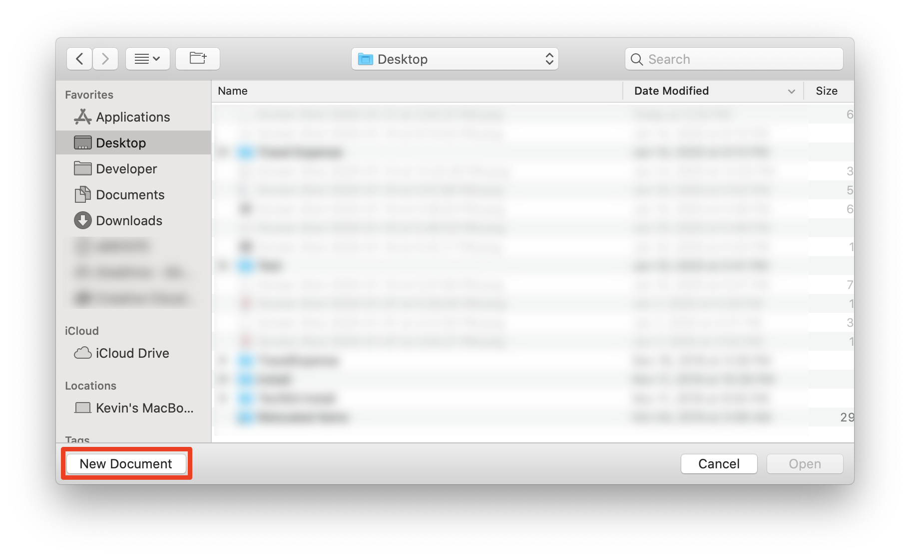
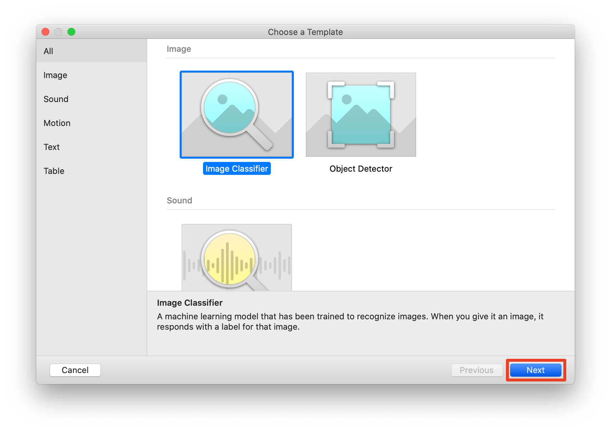
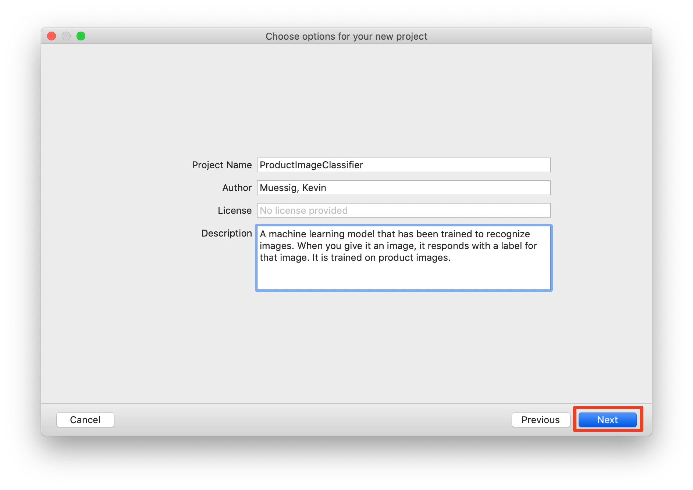
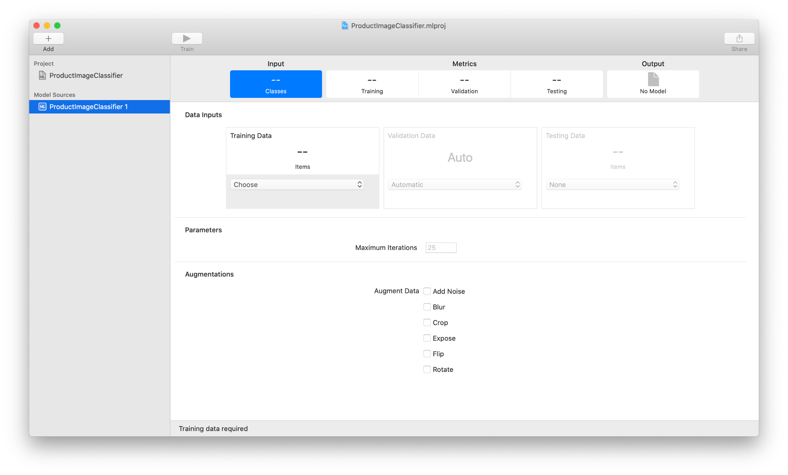
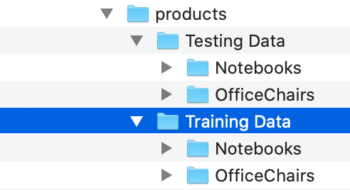
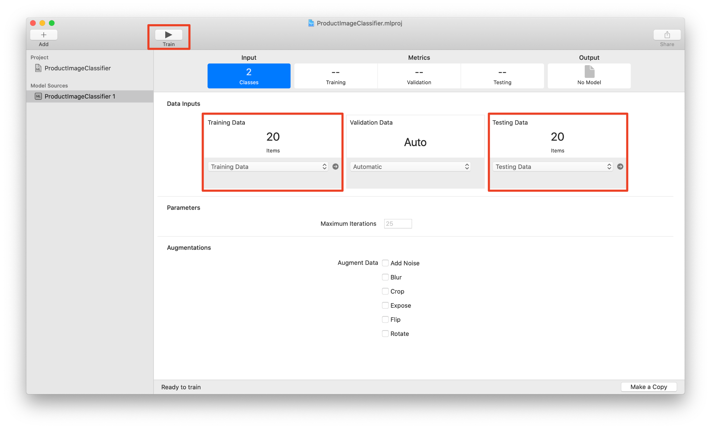
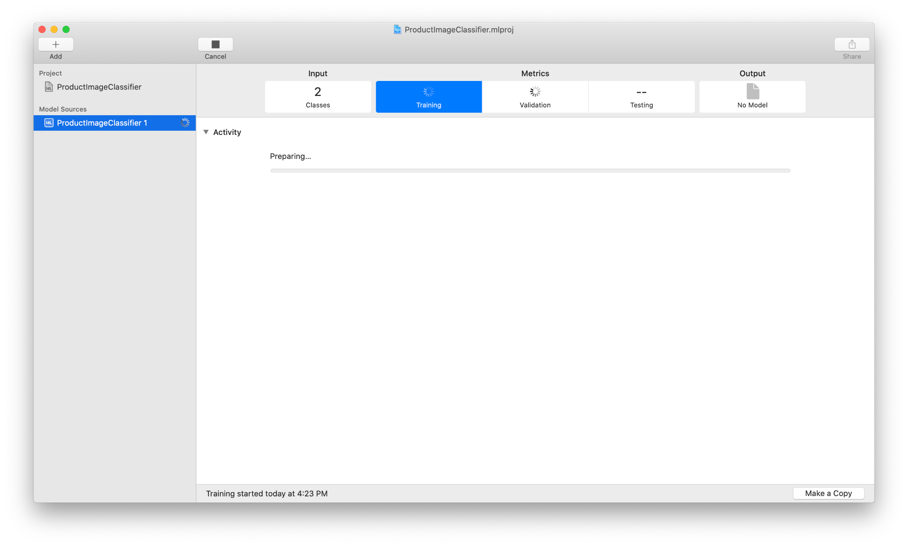
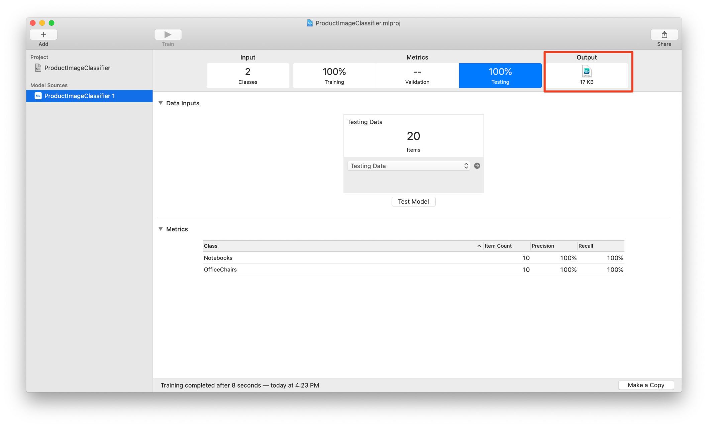

## Prerequisites

- **Development environment:** Apple Mac running macOS Catalina or higher with Xcode 11 or higher
- **SAP BTP SDK for iOS:** Version 5.0 or newer

## Details

### You will learn  

- What Create ML is
- How to create an Image Classification Model

---

[ACCORDION-BEGIN [Step 1: ](Introduction to Create ML)]

Since MacOS 10.14 developers have the opportunity to use Create ML as a tool to train different types of Core ML models to be used in your apps.

Currently Apple supports the following types of models:

**Image:**

- [`MLImageClassifier`](https://developer.apple.com/documentation/createml/mlimageclassifier)
- [`MLObjectDetector`](https://developer.apple.com/documentation/createml/mlobjectdetector)

**Sound:**

- [`MLSoundClassifier`](https://developer.apple.com/documentation/createml/mlsoundclassifier)

**Motion:**

- [`MLActivityClassifier`](https://developer.apple.com/documentation/createml/mlactivityclassifier)

**Text:**

- [`MLTextClassifier`](https://developer.apple.com/documentation/createml/mltextclassifier)
- [`MLWordTagger`](https://developer.apple.com/documentation/createml/mlwordtagger)

**Table:**

- [`MLClassifier`](https://developer.apple.com/documentation/createml/mlclassifier)
- [`MLRegressor`](https://developer.apple.com/documentation/createml/mlregressor)

If you're interested in a more detailed description on how to use and create those models you can take a look at Apple's official documentation about [Create ML](https://developer.apple.com/documentation/createml/creating_an_image_classifier_model) and the [API documentation](https://developer.apple.com/documentation/createml).

With this easy to use tool you can quickly create, train, and test the above mentioned ML models via Templates.

[DONE]
[ACCORDION-END]

[ACCORDION-BEGIN [Step 2: ](How to create an Image Classification Model project)]

For this tutorial series you're going to need an Image Classification Model to identify products.

1. After you have installed [Create ML](https://developer.apple.com/machine-learning/create-ml/) you should see a popup asking you to create a **New Document**. Please select that to reach the template screen in Create ML.

    !

2. Now please select the **Image Classifier** template as a starting point and click on **Next**.

    !

3. Fill out the required fields like the following and click on **Next**:

    | Field  | Value |
    | ------------- | ------------- |
    | Project Name  | `ProductImageClassifier`  |
    | Author  | `Your name`  |
    | Description  | A machine learning model that has been trained to recognize images. When you give it an image, it responds with a label for that image. It is trained on product images. |

    

    Create ML will ask you for a location to safe the project at. Please select your preferred location and click on **Create**.

    You should see the project opening up.

    !

[DONE]
[ACCORDION-END]

[ACCORDION-BEGIN [Step 3: ](Train the Image Classification Model)]

In order to train your model in the created project you need images of products. As this is just an example you need only a few images for this tutorial series.

Let's try and get 5-10 images of Laptops including `MacBooks` as well as office chairs. There are several ways you can get those images:

1. Take the pictures yourself from different angles of the product and a variety of products.
2. Download images from the internet to train your model on. Please make sure you're not using copyright images because it could be that you need the rights for using those.
3. Use one of many training image pools online.

Personally I've just taken a bunch of pictures around the office and train the model on those. Of course if you have a productive model you need to train it on far more then just 5-10 images.

If you have all images ready you have to structure them in a specified way for Create ML to successfully train your model.

The folder structure needs to look like the following:

!

The training data and the testing data need to be different images for Create ML training and testing properly.

After you've chosen your training and testing data inside of Create ML you could add different **Augmentations** if you want to but for now this is not necessary.

!

To create a Core ML model you just have to hit **Train** located on the top of Create ML.

!

After Core ML runs the training you will get results similar to the following screenshot. This data allows you to understand your model, how accurate it is and how you might need to tweak the training to get better results.

The model should work just fine and you can export it onto the hard-drive or directly into Xcode.

!

Please export the model directly into Xcode and then continue with the next tutorial.

!
!

Congratulations! You've trained a Core ML model with Create ML. Feel free to play around more with Create ML and the Machine Learning capabilities with [Artificial Intelligence](https://www.sap.com/products/artificial-intelligence.html).

[VALIDATE_3]
[ACCORDION-END]
