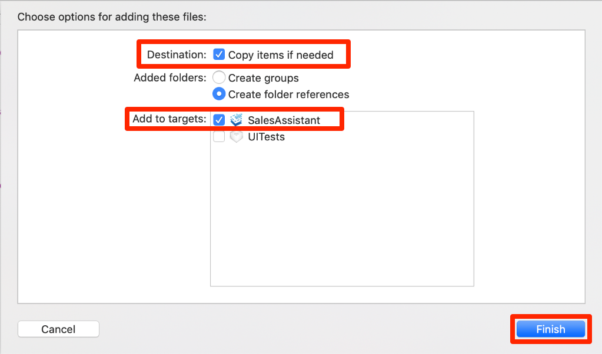
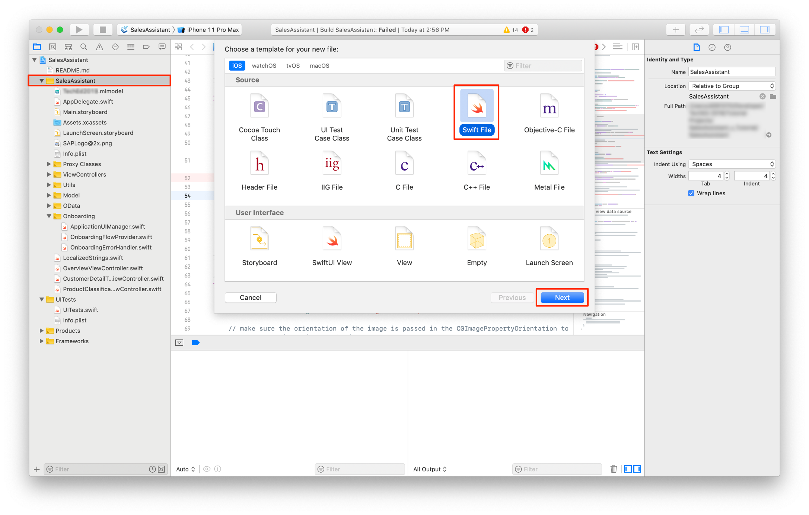
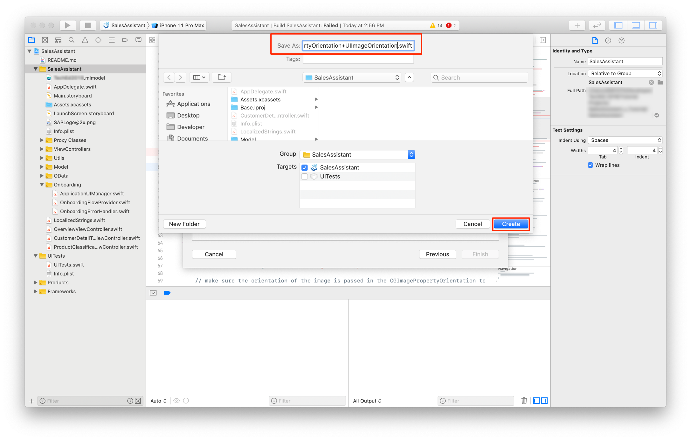
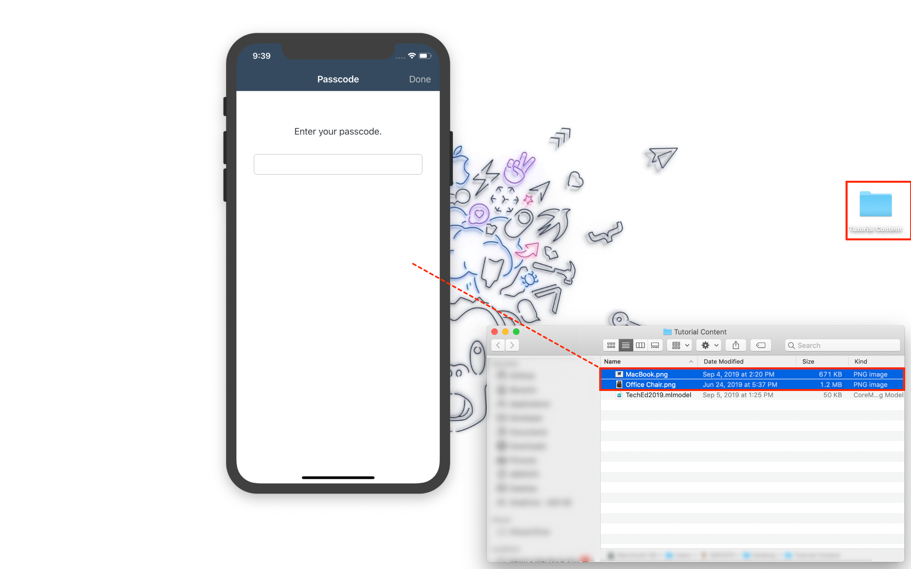
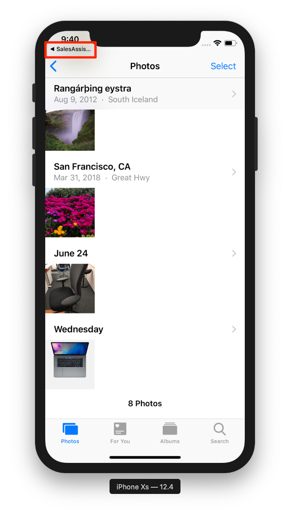
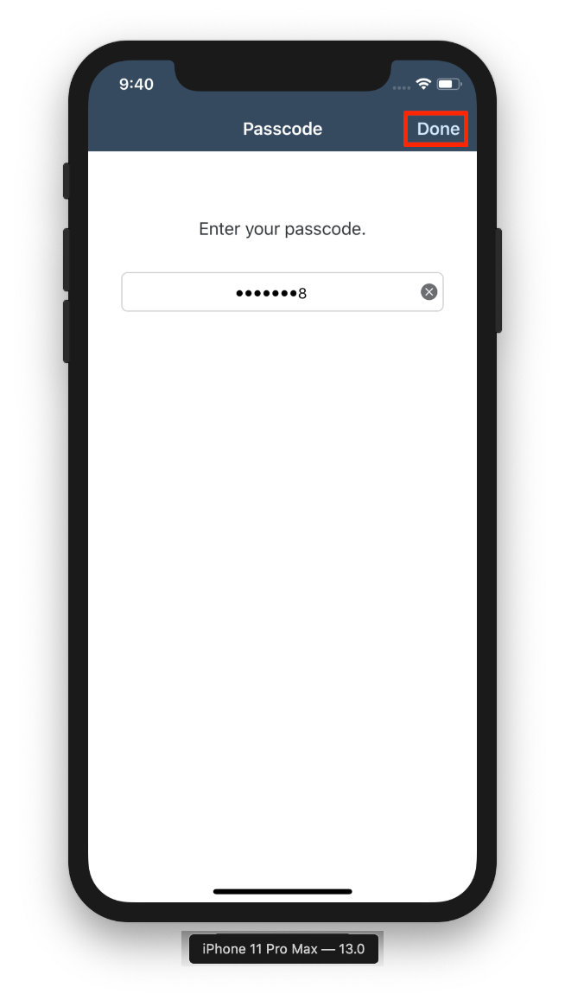
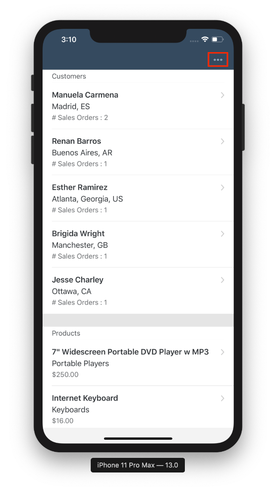
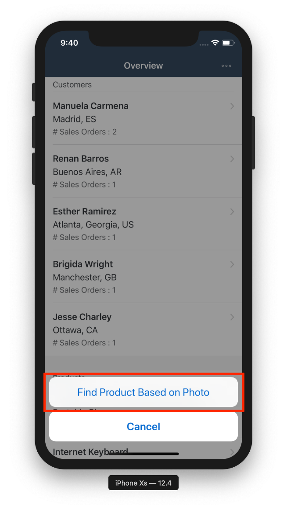
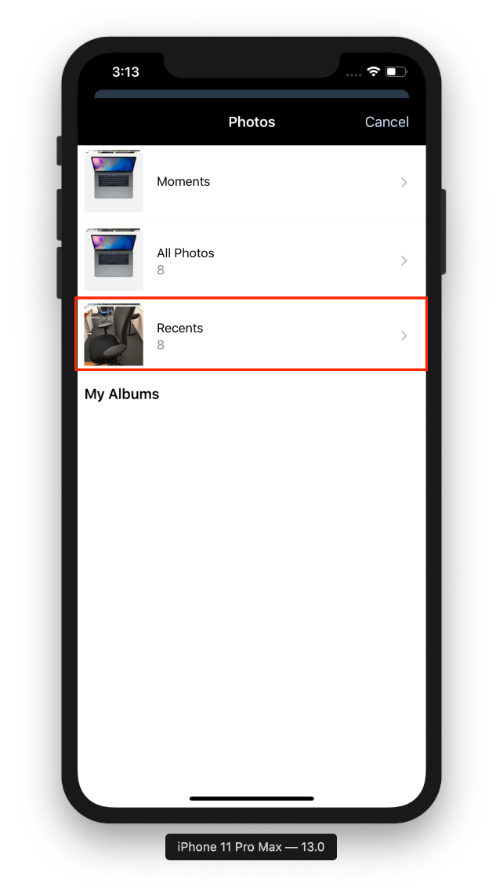

## Prerequisites

- **Development environment:** Apple Mac running macOS Catalina or higher with Xcode 11 or higher
- **SAP BTP SDK for iOS:** Version 5.0

## Details

### You will learn  

- How to import a trained Core ML model into Xcode
- How to use the Vision framework to process an Image and feed it to the classification model
- How to take the classification result and fetch products for the classified product category

---

[ACCORDION-BEGIN [Step 1: ](Understand the Core ML model)]

For this tutorial you will import the `ProductImageClassifier.mlmodel` Core ML model into your Xcode project. The goal for this tutorial is to later feed an image of a MacBook as well as an image of an office chair to the model. The Core ML model should classify those two images the correct way and your app will load similar products from the data service and display them in a Table View.

[DONE]
[ACCORDION-END]

[ACCORDION-BEGIN [Step 2: ](Import Core ML model)]

In order to use the `ProductImageClassifier.mlmodel` Core ML model you have to add it to your Xcode project.

Follow this if you haven't done it in the **Use Create ML to Train an Image Classification Model** tutorial already.

Go into the folder you've saved your model and **drag & drop** that model into the **Project Navigator** of Xcode. Xcode will bring up a dialogue, make sure **Copy Items if needed** and **Create folder references** is selected and click on **Finish**.

The model will now be referenced in your Xcode app project and can be initialized within the app code.

[DONE]
[ACCORDION-END]

[ACCORDION-BEGIN [Step 3: ](Set up Product Classification Table View Controller for data loading)]

The Product Classification Table View Controller is supposed to display products of the classified product category. You have implemented similar code before so this should look familiar to you.

Add the needed import statements below the `import UIKit` statement above the class declaration:

```Swift

import SAPFiori
import SAPOData
import SAPOfflineOData
import SAPCommon
import SAPFoundation
import SAPFioriFlows

```

Add the following properties right above the `viewDidLoad(_:)` method:

```Swift

private let logger = Logger.shared(named: "ProductClassificationTableViewController")

/// First retrieve the destinations your app can talk to from the AppParameters.
let destinations = FileConfigurationProvider("AppParameters").provideConfiguration().configuration["Destinations"] as! NSDictionary

var dataService: ESPMContainer<OfflineODataProvider>? {
    guard let odataController = OnboardingSessionManager.shared.onboardingSession?.odataControllers[destinations["com.sap.edm.sampleservice.v2"] as! String] as? Comsapedmsampleservicev2OfflineODataController, let dataService = odataController.espmContainer else {
        AlertHelper.displayAlert(with: NSLocalizedString("OData service is not reachable, please onboard again.", comment: ""), error: nil, viewController: self)
        return nil
    }
    return dataService
}

private var products = [Product]()

```

Because the classification as well as the data loading will take some time, you should display a loading indicator to let the user know that your app is currently busy working on those tasks.

Every Xcode project generated by the Assistant has a convenience protocol, making it easy for you to display and hide a `SAPFioriLoadingIndicator`.

Let the `ProductClassificationTableViewController.swift` class conform to the `SAPFioriLoadingIndicator` protocol:

```Swift

class ProductClassificationTableViewController: UITableViewController, SAPFioriLoadingIndicator

```

The protocol wants you to add the `FUILoadingIndicatorView` as a property to your class.

Add the following line of code right above the `dataService` property:

```Swift

var loadingIndicator: FUILoadingIndicatorView?

```

You will use an `FUIObjectTableViewCell` to display the products in the Table View, also you will need access to the data service.

Add the following lines of code to the `viewDidLoad(_:)` method:

```Swift

override func viewDidLoad() {
    super.viewDidLoad()

    tableView.estimatedRowHeight = 80
    tableView.rowHeight = UITableView.automaticDimension

    tableView.register(FUIObjectTableViewCell.self, forCellReuseIdentifier: FUIObjectTableViewCell.reuseIdentifier)
}

```

[DONE]
[ACCORDION-END]

[ACCORDION-BEGIN [Step 4: ](Classify the input image)]

To classify an image, you can use the **Vision** framework to prepare the image for classification.

Import the Vision framework by adding the import statement right below the `UIKit` import above the class declaration:

```Swift

import Vision

```

You will use a so called `VNCoreMLRequest` which will use an instance of the Core ML model for image classification.

Implement the following code right below the `viewDidLoad(:)`, read the inline comments carefully:

```Swift

lazy var classificationRequest: VNCoreMLRequest = {
    do {
        // Instantiate the Core ML model
        let model = try VNCoreMLModel(for: ProductImageClassifier_1(configuration: MLModelConfiguration()).model)

        // Create a VNCoreMLRequest passing in the model and starting the classification process in the completionHandler.
        let request = VNCoreMLRequest(model: model, completionHandler: { [weak self] request, error in
            self?.processClassifications(for: request, error: error)
        })

        // Crop and scale the image
        request.imageCropAndScaleOption = .centerCrop
        return request
    } catch {
        fatalError("Failed to load Vision ML model: \(error)")
    }
}()

```

Next you want to implement a method performing the requests.

Implement a method called `updateClassifications(for:)`:

```Swift

/// - Tag: PerformRequests
func updateClassifications(for image: UIImage) {

    // show the loading indicator
    self.showFioriLoadingIndicator("Finding similar products...")

    // make sure the orientation of the image is passed in the CGImagePropertyOrientation to set the orientation of the image
    let orientation = CGImagePropertyOrientation(image.imageOrientation)

    // Create a CIImage as needed by the model for classification. If that fails throw a fatalError.
    guard let ciImage = CIImage(image: image) else { fatalError("Unable to create \(CIImage.self) from \(image).") }

    // Dispatch to the Global queue to asynchronously perform the classification request.
    DispatchQueue.global(qos: .userInitiated).async {
        let handler = VNImageRequestHandler(ciImage: ciImage, orientation: orientation)
        do {
            try handler.perform([self.classificationRequest])
        } catch {
            /*
             This handler catches general image processing errors. The `classificationRequest`'s
             completion handler `processClassifications(_:error:)` catches errors specific
             to processing that request.
             */
            print("Failed to perform classification.\n\(error.localizedDescription)")
        }
    }
}

```

Right now the code above will cause compile time errors. You need an extension on `CGImagePropertyOrientation` to manually match the orientations of `UIImage` to the `CGImagePropertyOrientation`.

Create a new Swift class with the name `CGImagePropertyOrientation+UIImageOrientation` in the **Project Navigator**.





In that extension class, replace the code with the following lines:

```Swift

import UIKit
import ImageIO

extension CGImagePropertyOrientation {
    init(_ orientation: UIImage.Orientation) {
        switch orientation {
        case .up: self = .up
        case .upMirrored: self = .upMirrored
        case .down: self = .down
        case .downMirrored: self = .downMirrored
        case .left: self = .left
        case .leftMirrored: self = .leftMirrored
        case .right: self = .right
        case .rightMirrored: self = .rightMirrored
        @unknown default:
            fatalError()
        }
    }
}
```

Go back to the `ProductClassificationTableViewController.swift` class and implement a method processing the image classification. This method will also fetch the products according to the classification result.

Implement the following method directly below `updateClassifications(for:)` and read the inline comments carefully:

```Swift

/// - Tag: ProcessClassifications
func processClassifications(for request: VNRequest, error: Error?) {

    // Use the main dispatch queue
    DispatchQueue.main.async {

        // Check if the results are nil and display the error in an Alert Dialogue
        guard let results = request.results else {
            self.logger.error("Unable to classify image.", error: error)
            AlertHelper.displayAlert(with: "Unable to classify image.", error: error, viewController: self)
            return
        }
        // The `results` will always be `VNClassificationObservation`s, as specified by the Core ML model in this project.
        let classifications = results as! [VNClassificationObservation]

        if classifications.isEmpty {
            AlertHelper.displayAlert(with: "Couldn't recognize the image", error: nil, viewController: self)
        } else {
            // Retrieve top classifications ranked by confidence.
            let topClassifications = classifications.prefix(2)
            let categoryNames = topClassifications.map { classification in
                return String(classification.identifier)
            }

            // Safe unwrap the first classification, because that will be the category with the highest confidence.
            guard let category = categoryNames.first else {
                AlertHelper.displayAlert(with: "Unable to identify product category", error: nil, viewController: self)
                self.logger.error("Something went wrong. Please check the classification code.")
                return
            }

            // Set the Navigation Bar's title to the classified category
            self.navigationItem.title = category

            // Define a DataQuery to only fetch the products matching the classified product category
            let query = DataQuery().filter(Product.categoryName == category)

            // Fetch the products matching the defined query
            self.dataService?.fetchProducts(matching: query) { [weak self] result, error in
                if let error = error {
                    AlertHelper.displayAlert(with: "Failed to load list of products!", error: error, viewController: self!)
                    self?.logger.error("Failed to load list of products!", error: error)
                    return
                }

                // Hide the loading indicator
                self?.hideFioriLoadingIndicator()
                self?.products = result!

                // You will display the product images as well, for that reason create a new array containing the picture urls.
                self?.productImageURLs = result!.map { $0.pictureUrl ?? "" }
                self?.tableView.reloadData()
            }
        }
    }
}

```

Add the `productImageURLs` property right below the product array property above in the class:

```Swift

private var productImageURLs = [String]()

```

The last step would be to call the `updateClassifications(for:)` method inside the `viewDidLoad(_:)` method as the last line of code:

```Swift[9]

override func viewDidLoad() {
    super.viewDidLoad()

    tableView.estimatedRowHeight = 80
    tableView.rowHeight = UITableView.automaticDimension

    tableView.register(FUIObjectTableViewCell.self, forCellReuseIdentifier: FUIObjectTableViewCell.reuseIdentifier)

    updateClassifications(for: image)
}

```

That's all you need to do to classify an image with Vision and a pre-trained Core ML model.

Continue with the tutorial to implement the displaying of products in the Table View.

[DONE]
[ACCORDION-END]

[ACCORDION-BEGIN [Step 5: ](Implement the Table Views Data Source methods)]

To display the products, you will implement the data source methods directly in the class like you have done before.

Replace the existing `numberOfSections(in:)` and the `tableView(_:numberOfRowsInSection)` methods with the following code:

```Swift

// Return one section.
override func numberOfSections(in tableView: UITableView) -> Int {
    return 1
}

// The number of rows is dependant on the available products.
override func tableView(_ tableView: UITableView, numberOfRowsInSection section: Int) -> Int {
    return products.count
}

```

Before you go ahead and implement the `tableView(_:viewDidLoad:)`, you need to retrieve the URL of your service. The data task you're going to use will use the URL to download the needed product images.

Open your Mobile Services instance and select your app configuration in the `Native/Hybrid` screen. There you click  **Mobile Sample OData ESPM** in the **Assigned Features** section.

!

The detail screen for the `Mobile Sample OData ESPM` will open. There you find the **`Runtime Root URL`** for this service, copy the whole URL as you will need it in a second.

!

Next implement the `tableView(_:cellForRowAt:)` method and read the inline comments carefully:

```Swift

override func tableView(_ tableView: UITableView, cellForRowAt indexPath: IndexPath) -> UITableViewCell {

      // Get the correct product to display
      let product = products[indexPath.row]

      // Dequeue the FUIObjectTableViewCell
      let cell = tableView.dequeueReusableCell(withIdentifier: FUIObjectTableViewCell.reuseIdentifier) as! FUIObjectTableViewCell

      // Set the properties of the Object Cell to the name and category name
      cell.headlineText = product.name ?? ""
      cell.subheadlineText = product.categoryName ?? ""

      // If there is a price available, format it using the NumberFormatter and set it to the footnoteText property of the Object Cell.
      if let price = product.price {
          let formatter = NumberFormatter()
          formatter.numberStyle = .currency
          let formattedPrice = formatter.string(for: price.intValue())

          cell.footnoteText = formattedPrice ?? ""
      }

      // Because you're using a lazy loading mechanism for displaying the product images to avoid lagging of the Table View, you have to set a placeholder image on the detailImageView property of the Object Cell.
      cell.detailImageView.image = FUIIconLibrary.system.imageLibrary

      // The data service will return the image url in the following format: /imgs/HT-2000.jpg
      // In order to build together the URL you have to define the base URL.
      // The Base URL is found in the Mobile Services App configuration's service.
      let baseURL = "https://a9366ac9trial-dev-com-example.cfapps.eu10.hana.ondemand.com/SampleServices/ESPM.svc/v2"
      let url = URL(string: baseURL.appending(productImageURLs[indexPath.row]))

      // Safe unwrap the URL, the code above could fail when the URL is not in the correct format, so you have to make sure it is safely unwrapped so you can react accordingly. You won't show the product image if the URL is nil.
      guard let unwrapped = url else {
          logger.info("URL for product image is nil. Returning cell without image.")
          return cell
      }
      // You will use an image cache to cache all already loaded images. If the image is already in the cache display it right out of the cache.
      if let img = imageCache[unwrapped.absoluteString] {
          cell.detailImageView.image = img
      }

      // If the image is not loaded yet, use the loadImageFrom(_:) method to load the image from the data service.
      else {
          // The image is not cached yet, so download it.
          loadImageFrom(unwrapped) { image in
              cell.detailImageView.image = image
          }
      }

      return cell
  }

```

Inside the just implemented method, assign the copied `URL` to the `baseURL` instead of `<YOUR URL>` placeholder.

Before you will implement the `loadImageFrom(_:)` method, you have to define an image cache. As a cache you will simply use a dictionary.

Add the following property definition to below the `private var productImageURLs = [String]()` property:

```Swift

private var imageCache = [String:UIImage]()

```

Next implement the `loadImageFrom(_:)` method to actually fetch the product images.

Implement the method right below the `viewDidLoad(_:)` method and read the inline comments carefully:

```Swift

private func loadImageFrom(_ url: URL, completionHandler: @escaping (_ image: UIImage) -> Void) {
    let appDelegate = UIApplication.shared.delegate as! AppDelegate
    if let sapURLSession = appDelegate.sessionManager.onboardingSession?.sapURLSession {
        sapURLSession.dataTask(with: url, completionHandler: { data, _, error in

            if let error = error {
                self.logger.error("Failed to load image!", error: error)
                return
            }

            if let image = UIImage(data: data!) {
                // safe image in image cache
                self.imageCache[url.absoluteString] = image
                DispatchQueue.main.async { completionHandler(image) }
            }
        }).resume()
    }
}

```

[DONE]
[ACCORDION-END]

[ACCORDION-BEGIN [Step 6: ](Run app and classify some products)]

Let's classify some images!

Run your app on the iOS Simulator, because the iOS Simulator doesn't have a camera you have to import the product images into the iOS Simulator's Photo Library. You can take whatever Laptop or Office Chair image you want and the model should give the correct result.

Select a **MacBook or other Notebook** and an **Office Chair** image and drag them onto the iOS Simulator. The iOS Simulator will open up the Photo Library and add the images.



Open your app by tapping on the `SalesAssistant` navigation on the top-left corner.



In your app enter the App passcode if necessary.

In the Overview View Controller of your app, tap on the implemented Bar Button Item in the Navigation Bar and select **Find Product Based on Photo**.





Next the Photo Library of the iOS Simulator will open up, select the **MacBook or Notebook** in there.



The Photo Library will close and the Product Classification Table View Controller will open up and start the classification process as well as the fetching of the products.

The Table View should display all available notebooks available through the data service. The product images should lazy load and appear as well.

Tap on **Done** to go back to the Overview Table View Controller.

Congratulations! You've successfully used a pre-trained Core ML model and Vision to classify product images.

[VALIDATE_6]
[ACCORDION-END]
