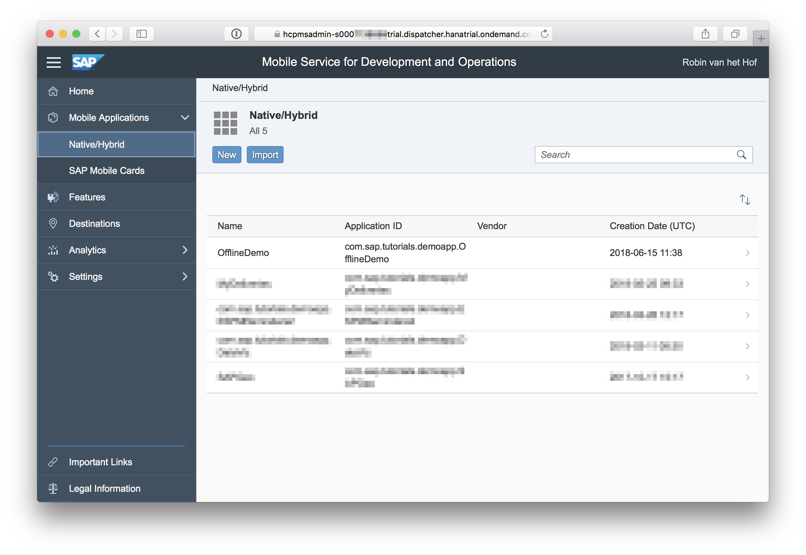
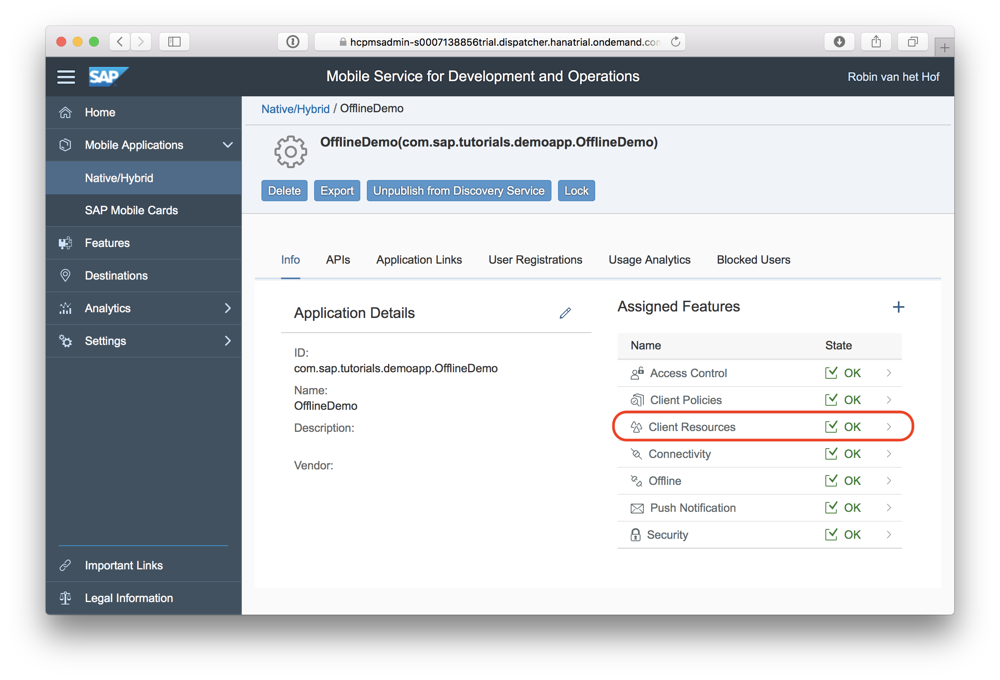
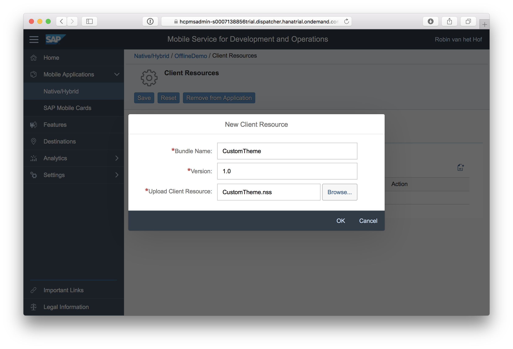
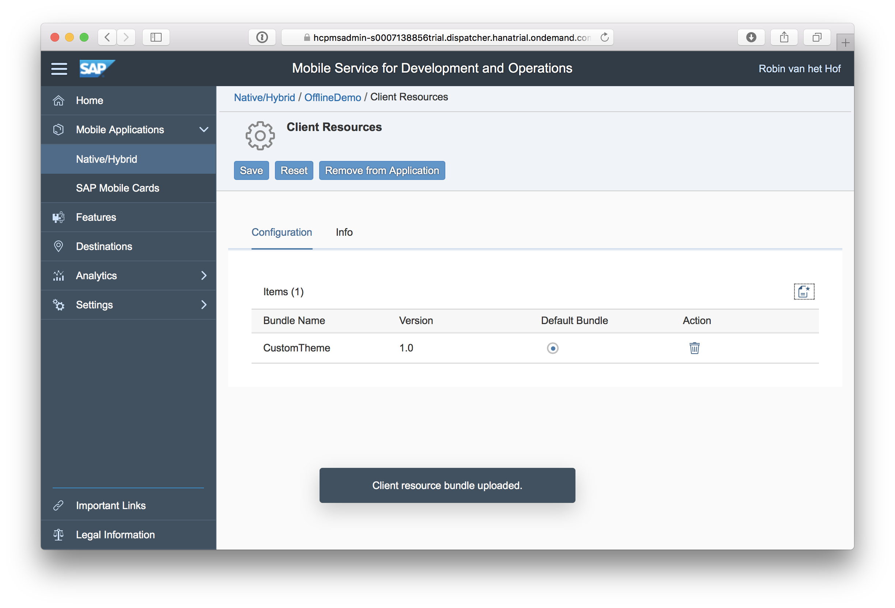
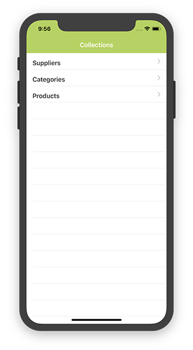

## Prerequisites  

- **Proficiency:** Beginner
- **Tutorials:** [Sign up for a free trial account on SAP BTP](hcp-create-trial-account) and [Enable SAP Mobile Services for development and operations](fiori-ios-hcpms-setup)
- **Development environment:** Apple iMac, MacBook or MacBook Pro running Xcode 9.3 or higher
- **SAP BTP SDK for iOS:** Version 2.2

## Details

### You will learn  

In tutorial Customize theme and on-boarding of iOS app you created a custom [`NUI`](https://github.com/tombenner/nui) stylesheet which was then included in the app's project. The biggest drawback to this approach is that for every style change, you need to rebuild and deploy your app.

Since version 2.2 of the SAP BTP SDK for iOS, you can now upload stylesheets to SAP Mobile Services for development and operations, and during the onboarding flow, your app will then download the latest changes. In this tutorial, you will create a stylesheet and upload it to SAP Mobile Services for development and operations. You will then modify the app's onboarding flow so it will download and apply the stylesheet.

For this tutorial, you can use any iOS app you have previously created with the SAP BTP SDK Assistant for iOS.

### Time to Complete

**15 Min**

---

[ACCORDION-BEGIN [Step 1: ](Create a NUI stylesheet)]

Create a file named `CustomTheme.nss`. There are various ways to create a file on macOS, but the simplest is to open a terminal, and type the following:

```bash
cd ~/Desktop
touch CustomTheme.nss
```

This will create the `CustomTheme.nss` file on your desktop.

Right-click the newly created file on your desktop, and open it with your text editor of choice.

Add the following content:

```css
NavigationBar {
    bar-tint-color: #B0D450;
}

BarButton {
    font-color: #3A835B;
}

fdlFontStyle_subheadline {
    font-style: subheadline;
    font-color: #3A835B;
}

fdlFUIWelcomeScreen_headlineLabel {
    font-color: #3A835B;
}
```

Save the file when done, and close the text editor.

[DONE]
[ACCORDION-END]

[ACCORDION-BEGIN [Step 2: ](Upload the stylesheet)]

Log on to SAP Mobile Services for development and operations cockpit at `https://hcpmsadmin-<your_user_id>trial.dispatcher.hanatrial.ondemand.com/` and navigate to **Mobile Applications > Native/Hybrid**:



Click on the application you want to have universal link support, and under **Assigned Features**, click the **Client Resources** feature:



In the page that opens, click the **Upload Client Resource** button on the right. The **New Client Resource** popup opens.

Add the following details:

| Field Name | Value |
|----|----|
| Bundle Name | `CustomTheme` |
| Version | `1.0` |
| Upload Client Resource | Click the **Browse** button and point to the `CustomTheme.nss` file on your desktop |



Click **OK** when done. The uploaded stylesheet is now listed:



[DONE]
[ACCORDION-END]

[ACCORDION-BEGIN [Step 3: ](Implement the stylesheet download steps)]

Open your app's `Onboarding/OnboardingManager.swift` file. In class `OnboardingManager`, just above the `delegate` field, add the following private fields:

```swift
private var nssResource: SAPcpmsClientResourcesDownloadStep.ClientResourceInfo? = nil
private var nssResourceURL: URL? = nil
```

The first field will store the stylesheet as an instance of `SAPcpmsClientResourcesDownloadStep.ClientResourceInfo`. The second field will hold the internal URL to the downloaded stylesheet.

Now, create two helper functions. One will retrieve the uploaded stylesheet, and the other will construct a URL based on the results of the first method:

```swift
private func getNssResource() -> SAPcpmsClientResourcesDownloadStep.ClientResourceInfo {
    let path = FileManager.default.urls(for: .documentDirectory, in: .userDomainMask)[0]
    let nssResource = SAPcpmsClientResourcesDownloadStep.ClientResourceInfo(mandatory: true, canOverwrite: true, name: "CustomTheme", version: nil, folderURL: path)

    return nssResource
}

private func getNssResourceURL(nssResource: SAPcpmsClientResourcesDownloadStep.ClientResourceInfo) -> URL {
    let url = nssResource.folderURL!.appendingPathComponent("\(nssResource.name ?? "Theme").nss").standardizedFileURL
    return url
}
```

And finally, you need to modify the variables `onboardingSteps` and `restoringSteps` by adding a step for the download of the stylesheet, and a step for applying the stylesheet.

In both `onboardingSteps` and `restoringSteps` variables, add the following variable assignments:

```swift
nssResource = getNssResource()
nssResourceURL = getNssResourceURL(nssResource: nssResource!)
```

These variables are now assigned with the results from the two helper methods you created.

Then, in `onboardingSteps`, add the following step right after the `settingsDownload` step:

```swift
SAPcpmsClientResourcesDownloadStep(clientResourceInfoList: [nssResource!]),
```

and add the following right after the `applyDuringOnboard` step:

```swift
NUIStyleSheetApplyStep(fileURL: nssResourceURL!),
```

Similarly, in `restoringSteps`, add the following step right after the `settingsDownload` step (which may be commented out, depending if you're using an online or offline enabled app):

```swift
SAPcpmsClientResourcesDownloadStep(clientResourceInfoList: [nssResource!]),
```

and add the following right after the `applyDuringRestore` step:

```swift
NUIStyleSheetApplyStep(fileURL: nssResourceURL!)
```

[DONE]
[ACCORDION-END]

[ACCORDION-BEGIN [Step 4: ](Build and run the app)]

Build and run the app. After you have logged on, you'll notice the app now uses the stylesheet you uploaded to SAP BTP:



[VALIDATE_4]
[ACCORDION-END]

---
