## Prerequisites  

- **Tutorials:** [Get a Free Trial Account on SAP BTP](hcp-create-trial-account) and [Enable SAP Mobile Services](fiori-ios-hcpms-setup)
- **Development environment:** Apple Mac running macOS Catalina or higher with Xcode 11 or higher
- **SAP BTP SDK for iOS:** Version 4.0.10

## You will learn  

In this tutorial, you will learn how to create universal links for use in an iOS app created using the SAP BTP SDK Assistant for iOS. With universal links, you can link to content inside your app or website in iOS 9 or later.

To prepare your app to support universal links, you will learn two different ways to create a new (or modify an existing) app ID. You will then modify the application definition on SAP Mobile Services.

For this tutorial, you can use any iOS app you have previously created with the SAP BTP SDK Assistant for iOS. However, the screenshots and parameters used in this tutorial are taken from the `TutorialApp` app created in tutorial [Create a Sample App](fiori-ios-scpms-create-sample-app).

[Universal Links for Developers](https://developer.apple.com/ios/universal-links/)

---

[ACCORDION-BEGIN [Step 1: ](Setup Your App for Universal Links)]

There are two ways you can setup your app for universal links or any other capability you might want to use in the future. You can use Xcode to create a new app project, could also be generated by the Assistant, and Xcode will create all the necessary definitions for you. The other way is going into the Apple Developer Portal and create a new App Identifier manually and assign the needed capabilities there.

[OPTION BEGIN [Xcode]]

Open up the `TutorialApp` or any other app and select the `.xcodeproj` file. Make sure your app is configured properly and Xcode recognizes your Signing Certificate and development team.

!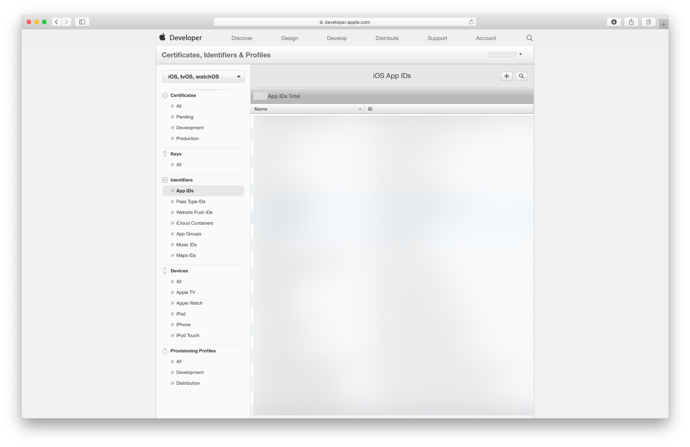

Click on **+ Capability** to add a new capability to your app. In the upcoming dialog search for **Associated Domains** and add the capability to your project.

!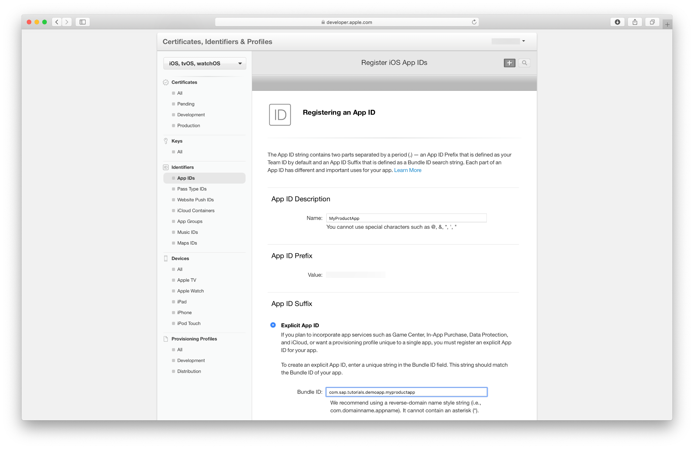

What Xcode will do know is connect to your Apple Developer profile and register or update your App ID to use the Associated Domains capability.

[OPTION END]

[OPTION BEGIN [Apple Developer Portal]]

Log in to the Apple Developer Portal at [https://developer.apple.com/](https://developer.apple.com/) and navigate to **Certificates, IDs & Profiles**.

!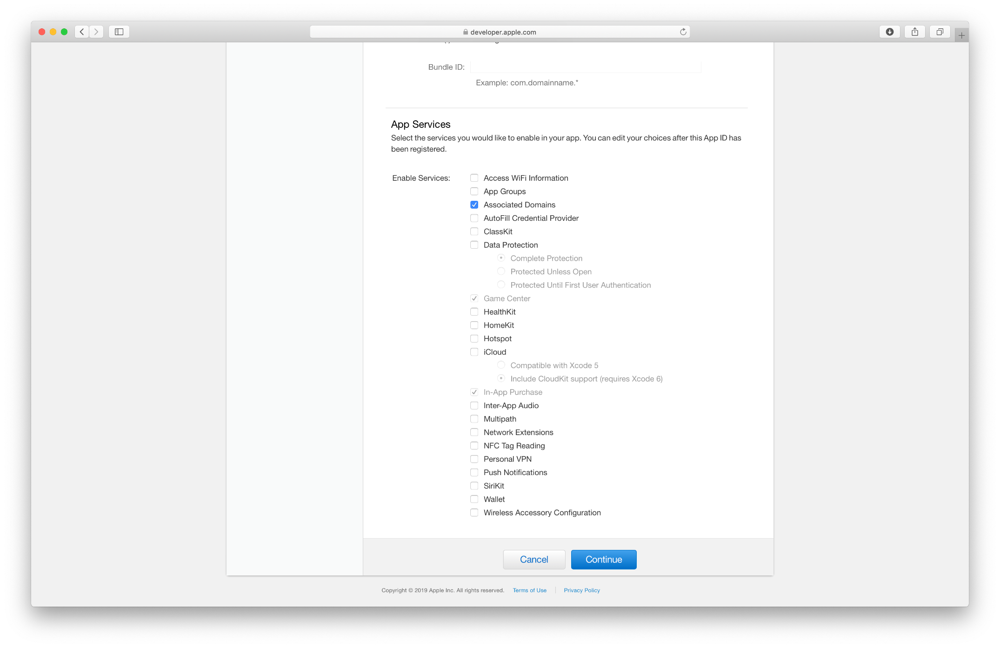

Click the **Plus** button next to **Identifiers** to register an App ID.

!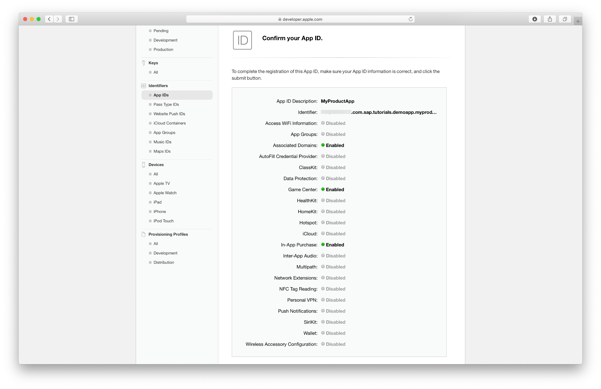

Make sure that **App IDs** is selected and click on **Continue**.

!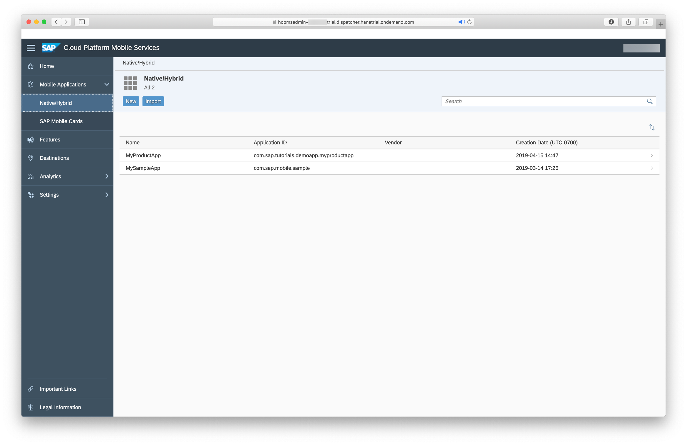

Provide the following values:

| Field Name | Value |
|----|----|
| Description | `TutorialApp` |
| App ID Prefix | This is already filled in. Copy and store this value as you will need it later. |
| Bundle ID | Explicit |
| Bundle ID | `com.example.TutorialApp` |

> The **Description** field is free to choose by you. The **Bundle ID** can be found in your Xcode project settings, under the **Signing & Capabilities** tab in the `.xcodeproj` file.

Don't forget to enable the **Associated Domains** capability.

Click **Continue** to proceed.

!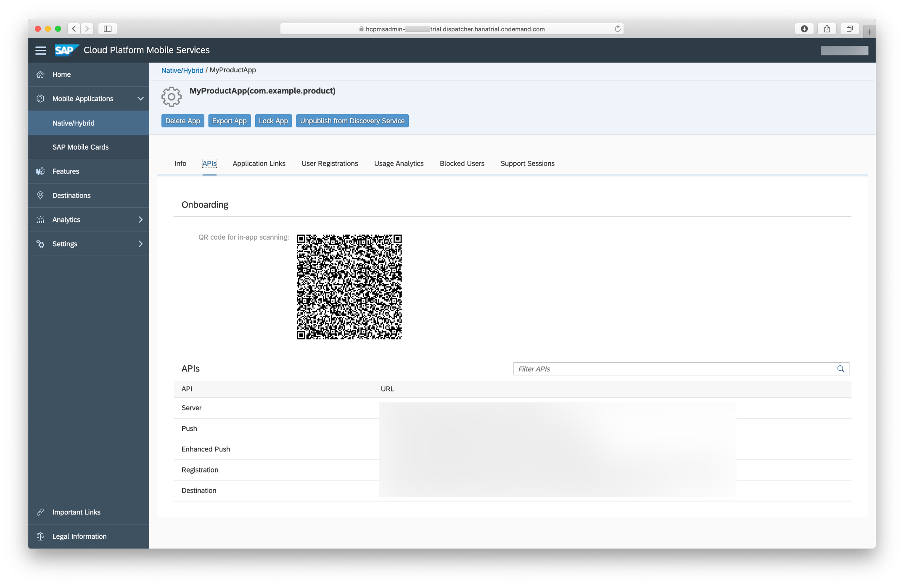

[OPTION END]

[DONE]
[ACCORDION-END]

[ACCORDION-BEGIN [Step 2: ](Define a new Application Link on SAP Mobile Services)]

Open your running Mobile Services instance and navigate to the **Application Links** tab for your app definition under **`Native/Hybrid - TutorialApp`**.

In the **Application Links** tab click on the pencil right next to the **Apple Universal Links** section to add the **Team ID** and the **Bundle ID**.

!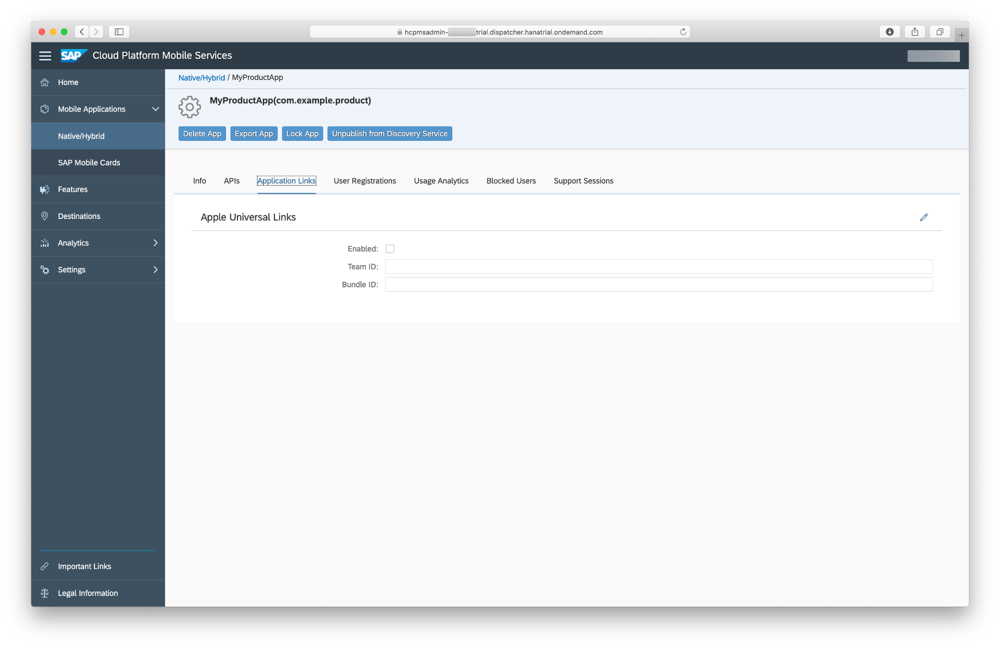

Fill out the upcoming form:

| Field Name | Value |
|----|----|
| Enabled | checked |
| Team ID | `<your_team_id>` |
| Bundle ID | `com.example.TutorialApp` |

!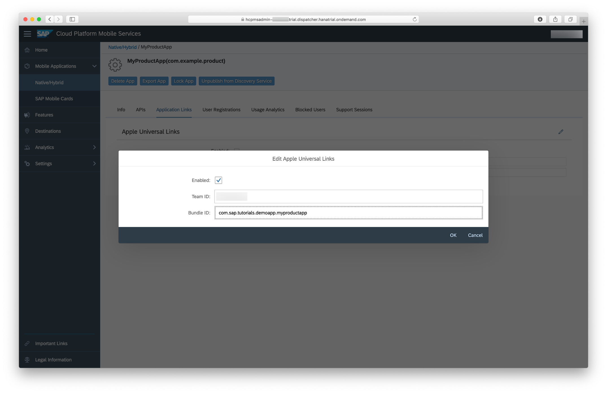

Click on **OK**.

> The Team ID you should've copied from Step 1, if not you can find the id on the Apple Developer Portal.

Mobile Services will ask you to confirm your changes. Always keep in mind that changes on the application links will take up to 10 seconds to be completed. During that time your users are not be able to connect against Mobile Services.

!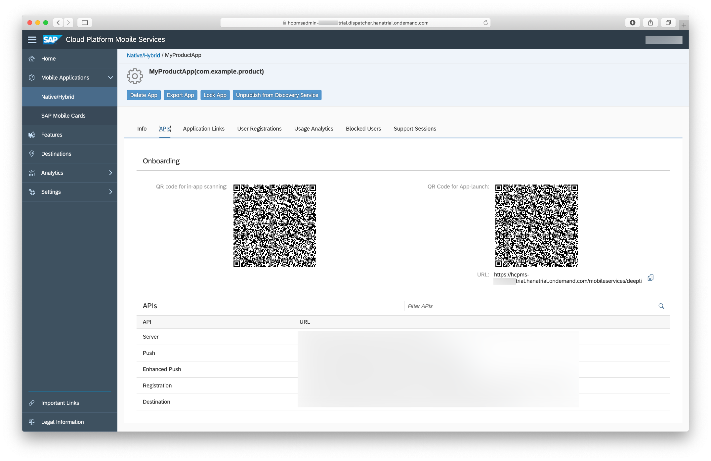

Confirm the dialog to see your application links.

!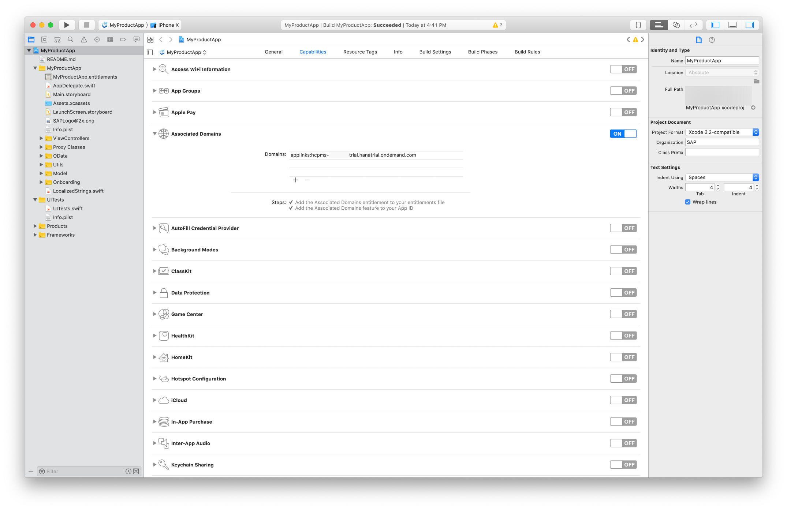

Navigate back to the **APIs** tab. You should see two QR codes, as well as the generated links:

!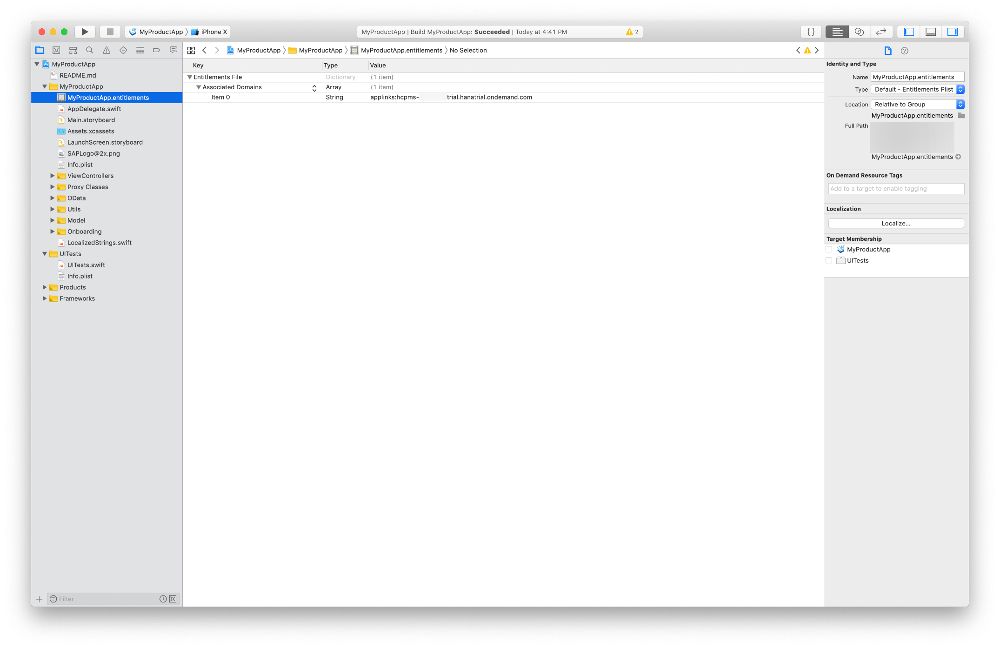

Leave the page open, you will need the server URL later.

[DONE]
[ACCORDION-END]

[ACCORDION-BEGIN [Step 3: ](Add Associated Domains to your app)]

Open your app project in Xcode. In your project's settings, navigate back to **Signing & Capabilities** and click the **+** icon located at the **Associated Domains** section.

!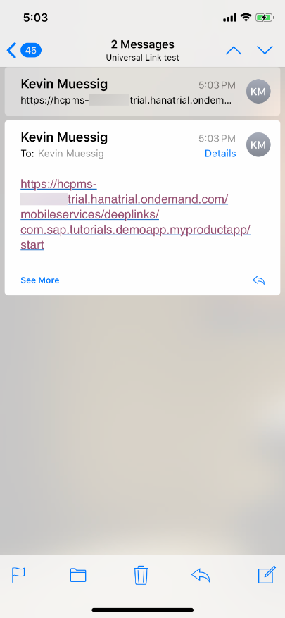

Enter the following domain:

| Field Name | Value |
|----|----|
| Domain | `applinks:<server link from Mobile Services>` |

> Your link should look something like this - `applinks:<YourUser-CFSpace>-com-example-tutorialapp.cfapps.eu10.hana.ondemand.com`

Please note the `applinks:` prefix. It is important you enter it exactly as stated.

!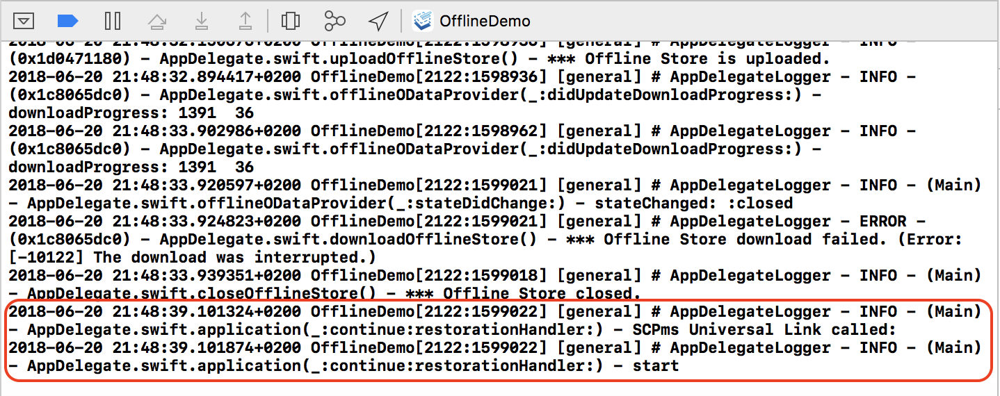

[DONE]
[ACCORDION-END]

[ACCORDION-BEGIN [Step 4: ](Build and run the app)]

If you now build and run the app on your device, you will notice an `<app_name>.entitlements` file is created, containing the just added capability:

!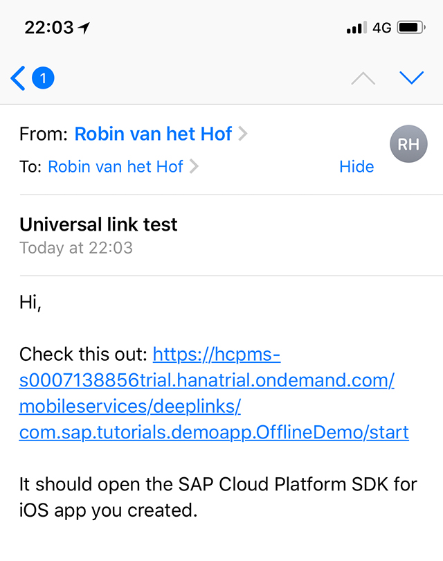

Continue and deploy the app to your physical device and walk through the onboarding process.

[DONE]
[ACCORDION-END]

[ACCORDION-BEGIN [Step 5: ](Check the AASA file)]

Once the app is deployed onto your device, it is now running with the added capability.

The way the universal link work is by the associated domain.

You have defined the application link on Mobile Services. This creates an `apple-app-site-association` file. This file associates your Mobile Services account domain with your iOS app.

The generated `apple-app-site-association` file contains a JSON structure with the App ID and URL path which is used as universal link.

Open a browser to `https://<YourUser-CFSpace-App>-com-example-tutorialapp.cfapps.eu10.hana.ondemand.com/.well-known/apple-app-site-association` and you should see the contents of the file:

!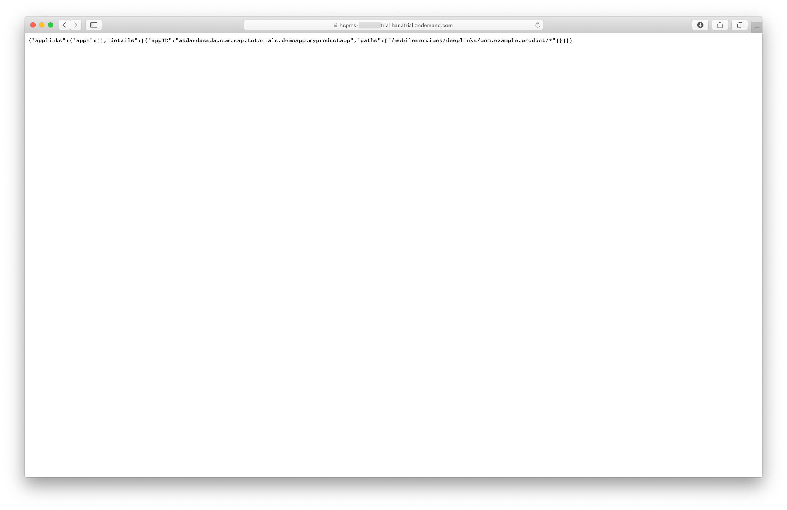

The asterisk at the end denotes anything. You can for instance add a product id which could directly open an entity with that product ID.

It is up to the app developer to do something meaningful with the provided context. In the next step, you will simply detect the app is launched via a universal link, and log the URL context to the console.

[VALIDATE_6]
[ACCORDION-END]

[ACCORDION-BEGIN [Step 6: ](Process the universal link context)]

Open your app's `AppDelegate.swift` file, and add the following method right below the closing bracket of the class:

```swift
// Universal Link
extension AppDelegate {
    func application(_ application: UIApplication, continue userActivity: NSUserActivity, restorationHandler: @escaping ([Any]?) -> Void) -> Bool {

        logger.info("SAP Mobile Services Universal Link called: ")

        if userActivity.activityType == NSUserActivityTypeBrowsingWeb {
            let url = userActivity.webpageURL!
            logger.info(url.lastPathComponent)
            // Here you can do whatever you want with the URL components
        }
        return true
    }
}
```

When you click/tap on a universal link, this hook will be called. The `userActivity` object contains a `webpageURL` property, which holds the universal link you clicked.

If you provide some context to the universal link URL, it will then be printed to the console by retrieving the `lastPathComponent` property of the URL.

Build and deploy the app to your physical device. After it has started, you can dismiss it to the background.

[DONE]
[ACCORDION-END]

[ACCORDION-BEGIN [Step 7: ](Try the universal link)]

The easiest way of testing the universal link is to send it via email or scan the **Apple Launch App Code** in Mobile Services.

!

In this example, you simply provide the context `start`, but it can be anything more meaningful of course.

If you now click on the link or scan the QR code, it should directly open your app without going to Safari first. If you look in the Xcode console, you see it logged the `start` context it received via the `NSUserActivity` hook.

!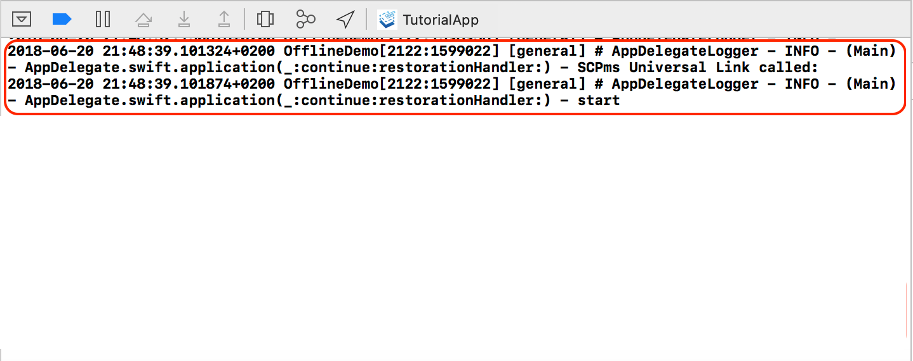

[DONE]
[ACCORDION-END]

---
