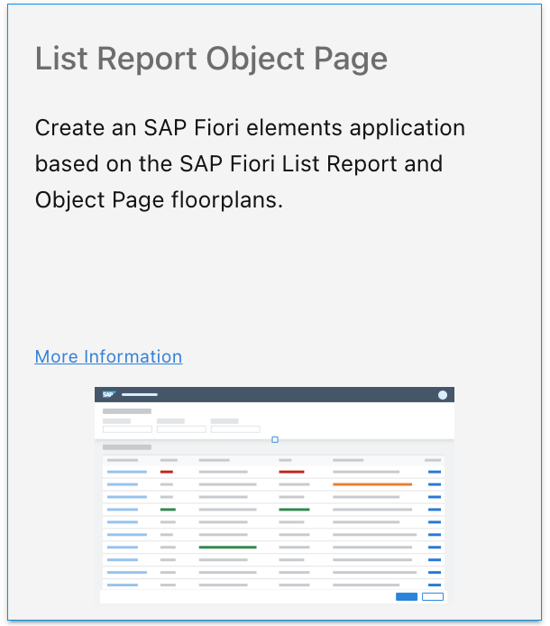
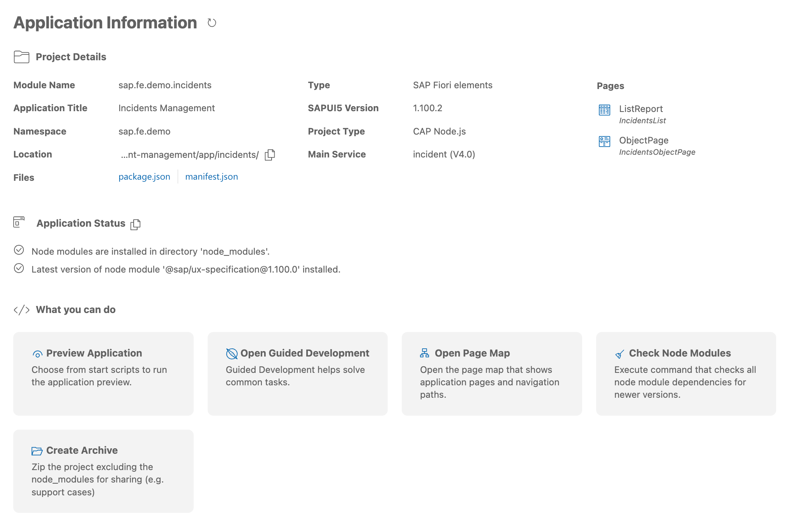
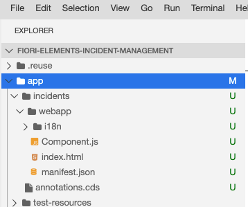
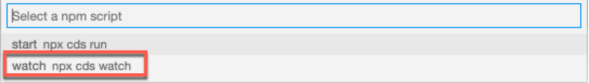
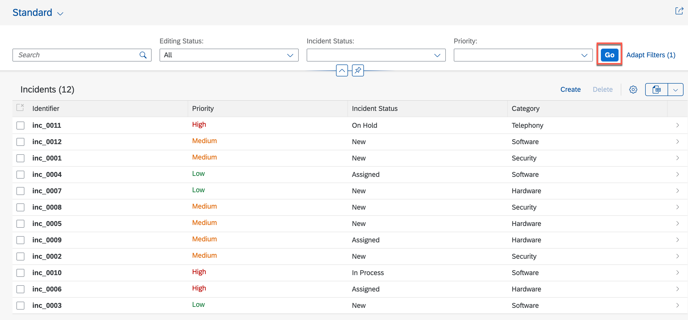

## You will learn
- How to create an SAP Fiori application of type list report application
- How to use an SAP Fiori elements template with a service in the SAP Business Application Studio

---

[ACCORDION-BEGIN [Step 1: ](Create new SAP Fiori elements application)]

1. SAP Fiori tools includes an Application Generator that provides a wizard-style approach for creating applications based on SAP Fiori elements page types. You are going to use it to create your list report Page app.

    From the hamburger menu, open **View->Command Palette...**, type **`Application Generator`**, and select **Fiori: Open Application Generator**.

2. Select the tile **List Report Page** and click **Next**.

    

3. Now you connect the application template with your OData service. The OData service you use for this example was already prepared during the previous tutorial:  [Prepare Your Development Environment](fiori-tools-cap-prepare-dev-env)

    Select the data source for the project. Since you use the locally installed service, choose **Use a local CAP Project** from the dropdown field **Data source**.

    Select the CAP project **fiori-elements-incident-management** in the next input field (as shown in the screenshot).

    Choose the service name **IncidentService (Node.js)** from the dropdown field **OData service**.

    When finished, click **Next**.

    

4. For your application you need to choose the main entity set from the OData service. Objects of this type will be displayed in the list report.

    In your application, start with **Incidents**. As your application will not have a sub-object page, you do not need a navigation entity. Leave **Yes** selected for the prompt **Automatically add table columns to the list page and a section to the object page if none already exists?**.

    When finished, click **Next**.

5. Maintain specific attributes of the application project as follows:

    

    >Be sure to choose exactly the **Module name** and the **Application namespace** as shown above, because these are referenced in the sample code.

    After completion, click **Finish**. The new SAP Fiori elements application is now created from the template using the service and the configurations you provided in this step.

    You may see a popup asking whether you want to open the project in a new workspace. Simply close it by clicking the  **X**.

    After the project is generated, an Application Information page is shown giving you an overview of project details and tasks that you may perform on this project. It is recommended that you keep this page open as it will be used in other steps. You can open it any time using selecting menu **View->Command Palette...** and select **Fiori: Open Application Info**
    
     

    You will also see a new folder `incidents` inside the `app` folder.

    

[DONE]
[ACCORDION-END]

[ACCORDION-BEGIN [Step 2: ](Start the application)]

Your SAP Fiori elements application needs a server to run. This server is provided by the command line client and development toolkit for the SAP Cloud Application Programming Model. The setup for using the server was done in the previous tutorial [Prepare Your Development Environment](fiori-tools-cap-prepare-dev-env).

1. Select the tile **Preview Application** from **Application Information** page.
   

2. When the quick pick is shown, select **watch-incidents** script

    

    A dialog window may pop up and you can choose the option as follows.

    Click  **Open in New Tab**.

    

    >Please check for a browser popup blocker in case the popup windows are not visible.

3. The application starts with an empty list.

    Press **Go**. The list report table will then show the data from the sample service.

    

    Filter fields, actions, and table columns are defined by the annotations in the Core Data Service (CDS) files. These files are part of the OData service definition.

You have now finished the initial setup of your list report object page sample application.

In the next tutorial, you will modify and enhance the list report page.

[DONE]
[ACCORDION-END]

[ACCORDION-BEGIN [Step 3: ](Test yourself)]

[VALIDATE_3]
[ACCORDION-END]

---
