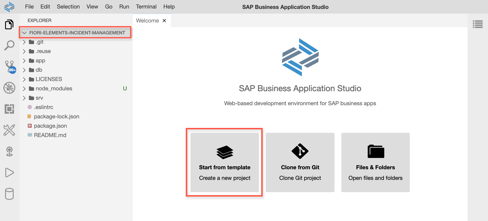
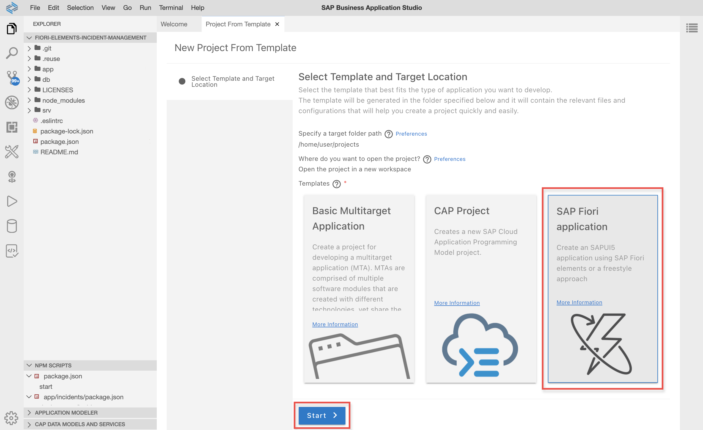
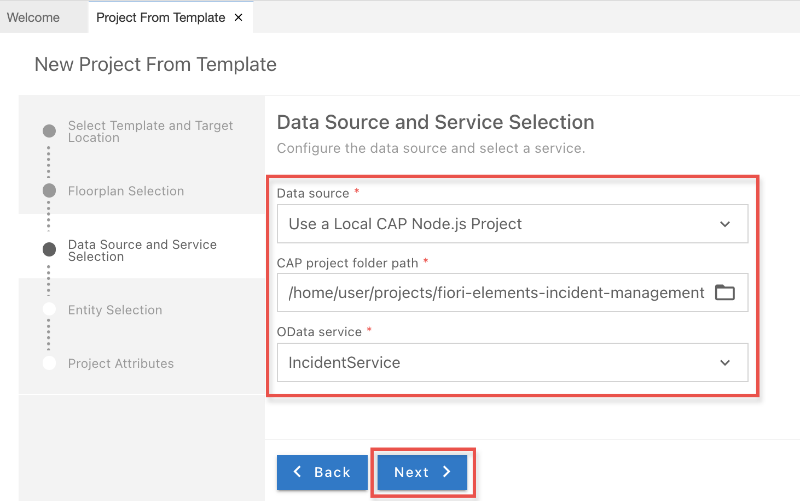
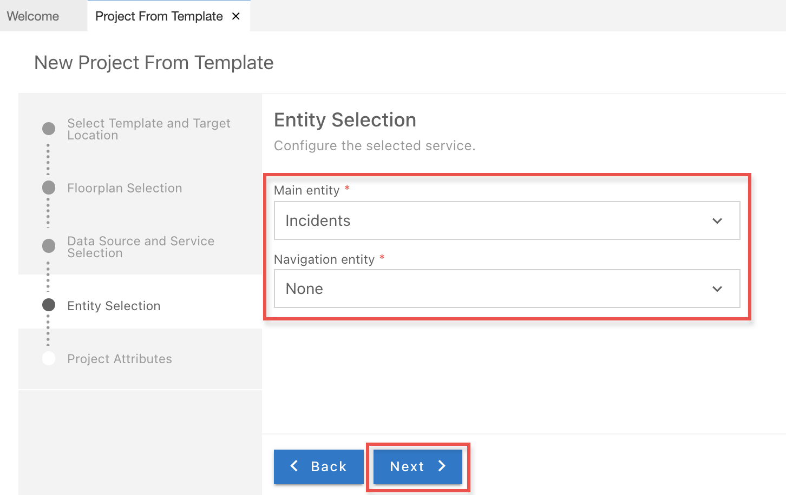
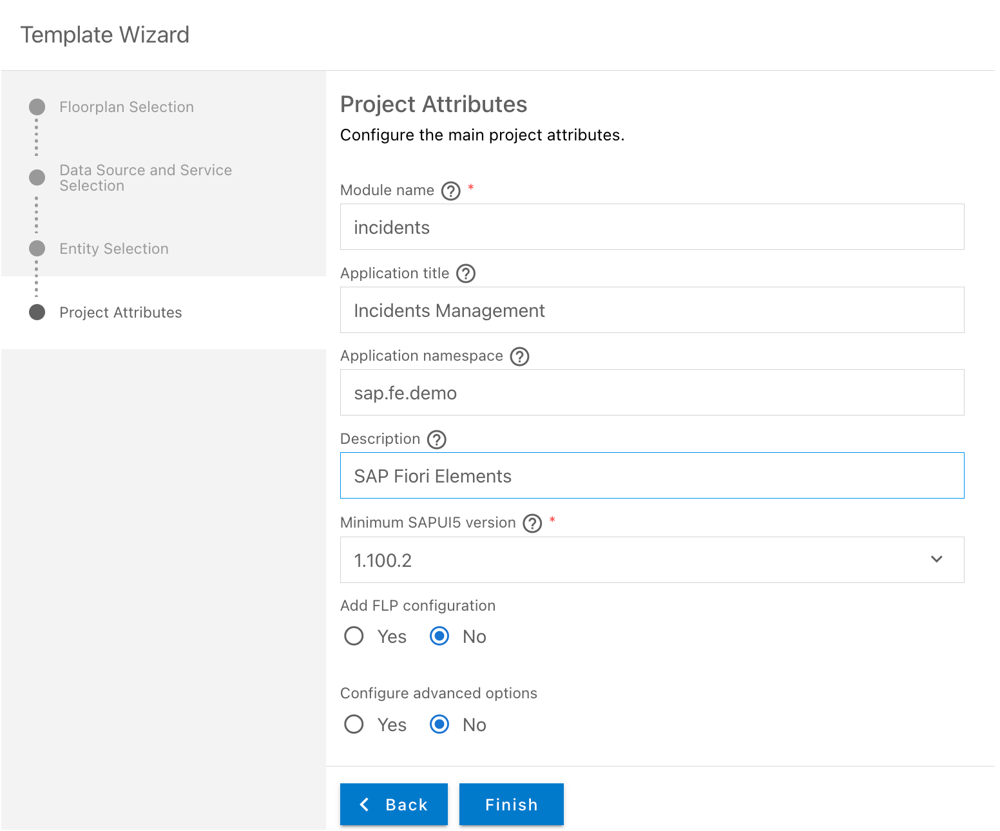
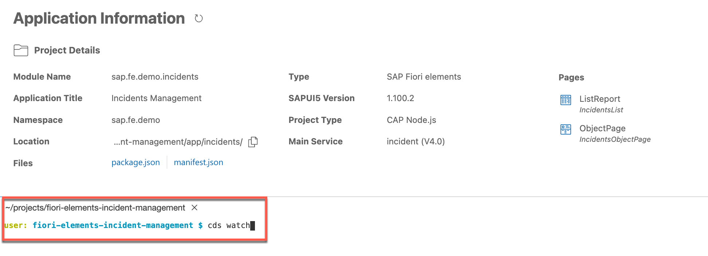
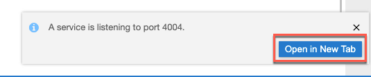
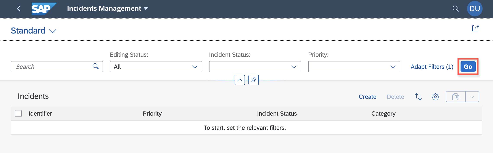

## Details
### You will learn
- How to create an SAP Fiori application of type List Report Object Page
- How to use an SAP Fiori elements template with a service in the SAP Business Application Studio

---

[ACCORDION-BEGIN [Step 1: ](Create new SAP Fiori elements application)]
1. Start the Application Generator

    If not already done, open your trial account on SAP Cloud Platform and start the SAP Business Application Studio you set up in the previous tutorial [Prepare Your Development Environment](fiori-tools-cap-prepare-dev-env). Then start your development space and select the sample project you created there.

    Once the **Welcome** page is shown, click **Start from template**.

    !

    Select the tile **SAP Fiori elements application** and click **Next**.

    !

2. On the page **New Project From Template**, select the tile **List Report Object Page** and click **Next**.

    !

3. Now you connect the application template with your OData service. The OData service you use for this example was already prepared during the previous tutorial:  [Prepare Your Development Environment](fiori-tools-cap-prepare-dev-env)

    Select the data source for the project. Since you use the locally installed service, choose **Use a local CAP Node.js project** from the dropdown field **Data source**.

    Navigate to and select the project folder location in the input field for your project folder path (as shown in the screenshot).

    Choose the service name **`IncidentService`** from the dropdown field **OData service**.

    When finished, click **Next**.

    !

4. For your application you need to choose the main entity set from the OData service. Objects of this type will be displayed in the list report.

    In your application, start with `Incidents`. As your application will not have a sub-object page, you do not need a navigation entity.

    When finished, click **Next**.

    !

5. Maintain specific attributes of the application project as follows:

    !

    >Be sure to choose exactly the **Module name** and the **Application namespace** as shown above, because these are referenced in the sample code.

    After completion, click **Finish**. The new SAP Fiori elements application is now created from the template using the service and the configurations you provided in this step.

    You will now see a popup asking whether you want to open the project in a new workspace. Simply close it by clicking the  **X**.

    !

    You will now see a new folder `incidents` inside the `app` folder.

    !

[DONE]
[ACCORDION-END]

[ACCORDION-BEGIN [Step 2: ](Start the application)]
Your SAP Fiori elements application needs a server to run. This server is provided by the command line client and development toolkit for the SAP Cloud Application Programming Model. The setup for using the server was done in the previous tutorial [Prepare Your Development Environment](fiori-tools-cap-prepare-dev-env).

1. Open a new terminal in your SAP Business Application Studio.

    !

2. Ensure that your terminal prompt shows **fiori-elements-incident-management**.

    Then type `cds watch` and press **Enter** to start the server.

    !

    Two dialog windows will pop up. Click **Expose and Open**

    !

    and then **Open in New Tab**.

    !

    >Please check for a browser popup blocker in case the popup windows are not visible.

3. After confirmation of the two popup windows, the application server launches a new browser window with a set of links.

    !

    Start the SAP Fiori launchpad with your sample application by selecting the corresponding link.

    !

    You can now start the new SAP Fiori elements application by selecting the tile on the SAP Fiori launchpad.

4. The application starts with an empty list.

    !

    Press **Go**. The list report table will then show the data from the sample service.

    !

    Filter fields, actions, and table columns are defined by the annotations in the Core Data Service (CDS) files. These files are part of the OData service definition.

Your have now finished the initial setup of your list report object page sample application.

In the next tutorial, you will modify and enhance the list report page.

[DONE]
[ACCORDION-END]

[ACCORDION-BEGIN [Step 3: ](Test yourself)]

[VALIDATE_1]
[ACCORDION-END]

---
