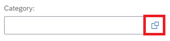
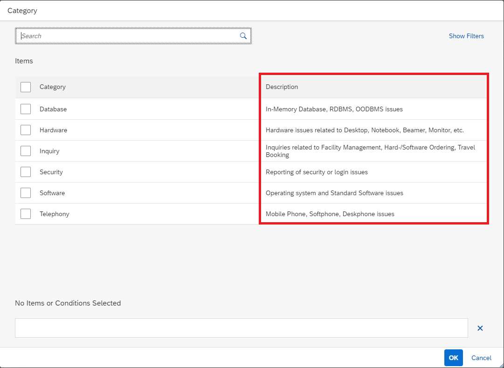
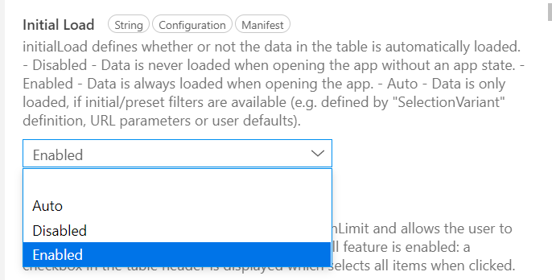

# Refine the List Report with Additional UI Elements 
<!-- description --> Configure additional UI elements based on annotations and manifest settings to the list report with no coding effort, namely add columns and selection fields, enhance a Value Help and configure the application to load data automatically.

## Prerequisites
- You have prepared your development environment by completing the tutorial [Prepare your Development Environment](fiori-tools-cap-prepare-dev-env)
- You have generated the Incident Management application from the previous tutorial [Create an SAP Fiori elements application](fiori-tools-cap-create-application)

## You will learn
  - How to add additional filter fields in the filter bar
  - How to enhance a Value Help for the filter field
  - How to add an additional column in the list report table
  - How to configure the list report to load data automatically
  


In SAP Fiori elements applications, UI annotations are used to refine the user interface. All annotations are documented in the [OData 4.0 Vocabularies](https://sap.github.io/odata-vocabularies/vocabularies/UI.html). With SAP Fiori Tools - Application modeler, you don't have to be an annotation expert, as the necessary UI annotations are automatically generated when you add or modify the UI elements for your application. You can easily navigate to the annotations behind the UI elements to review and/or manually update them in the code editor.


### Add filter field to the filter bar

In this step, you will learn how to add filters to the List Report page of your application using the Page Editor and see the auto generated annotation code in the local annotation file.

1. From the Application Information page, click on the **ListReport** page
   
    <!-- border -->

    The Page Editor view opens up listing all the major page elements in the application outline structure.

2. Press the **+** icon in the **Filter Fields** sub-node of the **Filter Bar** node on the outline. It becomes visible, once you hover over the sub-node.
   
    <!-- border -->

3.  When prompted, choose **category_code** as **Filter Field** and press **Add**.
    
    <!-- border -->

    The new filter field is added to the filter bar. The application preview (if started) is automatically refreshed to display it.

    <!-- border -->

> This is enabled by copying the `UI.SelectionFields` annotation to the local annotation file and updating it with `category_code` property in the background. You can press  (Navigate to source code) icon displayed in the **Filter Fields** sub-node on hover to see the updated annotation in the local annotation file.

```CDS
SelectionFields : [
    incidentStatus_code,
    priority_code,
    category_code
],
```

### Enhance value help

Applications can bring up value help for fields that allow users to choose from existing values. Once the property has a value list annotation, it is displayed as an input field with a value help icon. 
The value help dialog supports full-text search and a filter bar that can help users to find the right value.

In this step, you will learn how to enhance the value help defined in the project to be displayed as a drop-down list and enhance it with additional information.

1. In the application preview, click on the value help icon in the **Category** filter to take a look at the current value help.

    <!-- border -->

    The default value help will look like this:

    <!-- border -->

2. To enrich the current value help with a description property and get it displayed as a drop-down, proceed as follows:

    - In the Page Editor, select the **Category** sub-node on the outline under **Filter Fields** to show the properties of this filter field. 

    - In the Properties pane displayed to the right of the outline, find the **Display Type** property. Currently it shows **Value Help (base layer)**, indicating that value help is defined in the layer lower than this app. To enhance the value help settings, choose **Value Help** instead.

      <!-- border -->

    - In the pop-up dialog, make sure **Display as Dropdown** is switched on, press **Add Column** under **Results List**,  choose **desc** in the **Property** column and press **Apply**.

        <!-- border -->

3. Application preview is refreshed and displays the **Category** filter as drop-down list and shows the value help with the description column.

    <!-- border -->


### Configure the application to load data automatically

In this step, you will learn how to configure the application to load data automatically when started without the need of pressing the **Go** button.

1. In the Page Editor, select the **table** node on the outline to show the properties of the table.

    <!-- border -->
2.  In the Properties pane, locate the **Initial Load** property and set it to **Enabled**.

    <!-- border -->
>To easily find the specific property in the Properties pane, you can use the Search Properties field in the top right corner.
1. After the application is refreshed, the table data will be loaded automatically.

    <!-- border -->


### Add column to the list report table

In this step, you will learn how to enhance the list report table with additional column. 

1. In the Page Editor, press the **+** icon in the **Column** sub-node of the **Table** node on the outline and choose **Add Basic Columns**.

    <!-- border -->

2. When prompted, choose **title** in the **Columns** field

    <!-- border -->

    > You can filter the list of suggestions by typing a few characters of the option you want to choose. This will filter the list of suggestions.

3. Press **Add**.

    The application preview refreshes and displays the column added to the table.

    <!-- border -->

    > If your preview window is not wide enough, the last column is not visible unless its Importance property is set to High or Medium.


---

At this point, you have added a new field to the filter bar and one more column within the list report table. You enhanced the value help to be displayed as a drop-down and include the description. Your data is loaded automatically due to the configured initial load feature.

In the next tutorial, you will refine the object page by adding new fields and extend it with a new section leveraging the flexible programming model.

---

