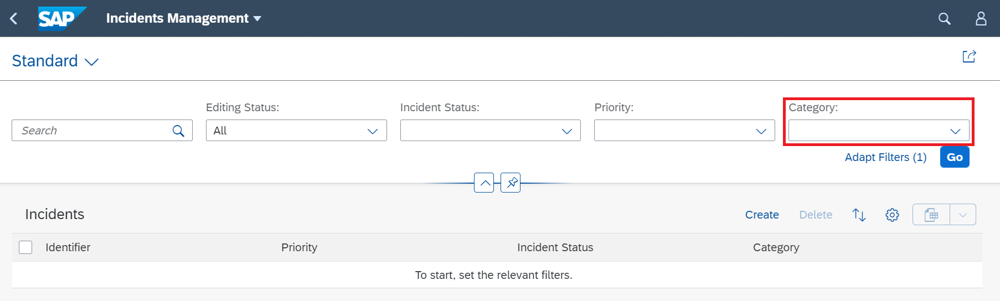
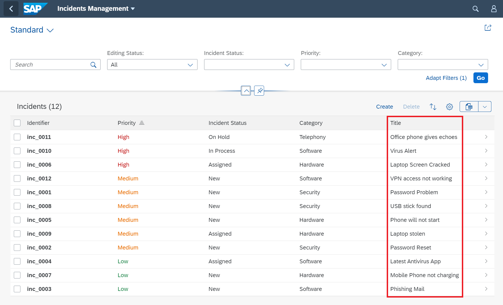

## Prerequisites
- You have prepared your development environment by completing the tutorial [Prepare your Development Environment](fiori-tools-cap-prepare-dev-env)
- You have generated the Incident Management application from the previous tutorial [Create an SAP Fiori elements application](fiori-tools-cap-create-application)

## Details
### You will learn
  - How to add additional filter fields in the filter bar
  - How to add an additional column in the list report table
  - How to configure the list report to load data automatically
  - How to implement a Value Help for the Category field


In SAP Fiori elements applications, UI annotations are used to refine the user interface. All annotations are documented in the [OData 4.0 Vocabularies - SAP UI Wiki page](https://wiki.scn.sap.com/wiki/display/EmTech/OData+4.0+Vocabularies+-+SAP+UI).


[ACCORDION-BEGIN [Step 1: ](Add filter field Category to the filter bar)]

Open the `annotations.cds` file located in the `app` folder of your service.

!

>There´s a second `annotations.cds` file below folder `app/incidents`. This file was created during the generation of the application and is not meant to be modified within this tutorial.

The annotation `SelectionFields` defines the filter fields offered in the filter bar.

Search for the `SelectionFields` annotation and add an additional field `category_code` to the existing list of fields, as shown in the coding example below. When editing the file, code completion helps to select the field.


```CDS
SelectionFields : [
    incidentStatus_code,
    priority_code,
    //insert your selection fields enhancement here
    category_code
],
```

After saving the file, the server will be restarted and when refreshing the application, the new field is added to the filter bar.

!

[VALIDATE_1]
[ACCORDION-END]


[ACCORDION-BEGIN [Step 2: ](Implement a value help)]

Applications can bring up value help for fields that allow users to choose from existing values. Once the property has a value list annotation, it is displayed as an input field with a value help icon.
The value help dialog supports full-text search and a filter bar that can help users to find the right value.


1. Click on the value help icon in the **Category** selection field to take a look at the current value help.

    !

    The default value help will look like this:

    !

2. To enrich the current value help with a description property, proceed as follows:

    Open the `common.cds` file located in the `srv` folder of your service.


    !

    Add the `ValueList` code (lines 11-26) to the category property of the `Incidents` entity in the `common.cds` file.    

    ```CDS
    annotate service.Incidents with {
        incidentStatus @Common : {
            Text            : incidentStatus.name,
            TextArrangement : #TextOnly,
            ValueListWithFixedValues
        };
        category       @Common : {
            Text            : category.name,
            TextArrangement : #TextOnly,
            //insert your value list here
            ValueList       : {
                $Type          : 'Common.ValueListType',
                Label          : 'Category',
                CollectionPath : 'Category',
                Parameters     : [
                {
                    $Type             : 'Common.ValueListParameterInOut',
                    LocalDataProperty : category_code,
                    ValueListProperty : 'code'
                },
                {
                    $Type             : 'Common.ValueListParameterDisplayOnly',
                    ValueListProperty : 'descr'
                }
                ]
            }
        };
        priority       @Common : {
            Text            : priority.name,
            TextArrangement : #TextOnly,
            ValueListWithFixedValues
        };
    };
    ```


    > ### CollectionPath
    The `CollectionPath` property defines the entity set to request data for the value help. In this example the data is loaded from the entity set `Category`.

    <!-- -->    
    > ### $Type
    The `$Type` property determines the behavior of a single parameter used within the value help. The value `ValueListParameterInOut` is used for parameters which take over values prefilled by the application for filtering the data (-In). On the other hand the selected value will also be passed back to the application (-Out). The value `ValueListParameterDisplayOnly` is used for parameters without interaction between the application and the value help. The parameter is just used for displaying the data for selection.

    >Depending on the value of the `$Type`, additional properties for the parameter need to be defined:
    >
    * `LocalDataProperty` The property of the source entity set the value help will be defined for.
    >
    *  `ValueListProperty` The property of the target entity set the value help will request data from (see `CollectionPath`). These are the properties presented within the filter bar and table of the value help dialog.


3. After saving the file, refreshing the application and opening the value help for the **Category**, you´ll see the improved value help showing the description.


    !


[VALIDATE_2]
[ACCORDION-END]


[ACCORDION-BEGIN [Step 3: ](Add column title to the list report table)]

To add an additional column to the list report table, you will use the annotation `LineItem`. Again, ensure that the `annotations.cds` file of the service is opened (see step 1).

Now search for the annotation `LineItem` of the `Incidents` entity and add the new column representing the field `title` as shown in the coding below.

```CDS
LineItem : [
    {
        $Type : 'UI.DataField',
        Value : identifier,
    },
    {
        $Type                     : 'UI.DataField',
        Value                     : priority_code,
        Criticality               : priority.criticality,
        CriticalityRepresentation : #WithoutIcon,

    },
    {
        $Type : 'UI.DataField',
        Value : incidentStatus_code
    },
    {
        $Type : 'UI.DataField',
        Value : category_code
    },
    //insert your line item enhancement here
    {
        $Type : 'UI.DataField',
        Value : title
    }
],
```

After saving and refreshing the application, you will see the column added to the table.

!

[VALIDATE_3]
[ACCORDION-END]

[ACCORDION-BEGIN [Step 4: ](Configure the application to load data automatically)]

In this step you will learn how to configure the application to load data automatically when started without the need of pressing the Go button.

1. Open the context menu by right mouse click on the `webapp` folder and select **Show Page Map** to start the page map tool.

    !

    Now you see the structure of your application containing the list report and the object page.

2. To configure the list report for automated loading click the pencil icon on the list report tile.

    !

    Select the **table** node on the tree-structure to show the properties of the table.

    !

    Set the **Initial Load** property to **True**.

    !

 3. You just need to refresh your application and the data will be loaded automatically.

[DONE]

At this point, you have added a new field to the filter bar and one more column within the list report table. Your data is loaded automatically due to the configured initial load feature.

In the next tutorial, you will refine the Object Page by adding new fields and extend it with a new section leveraging the Flexible Programming Model.

[ACCORDION-END]
