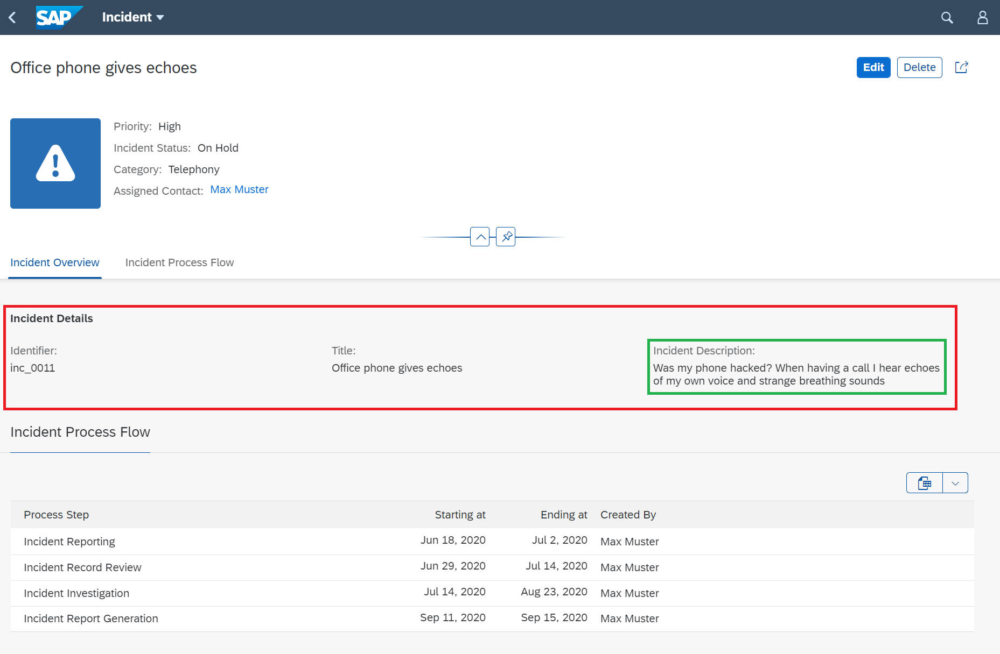
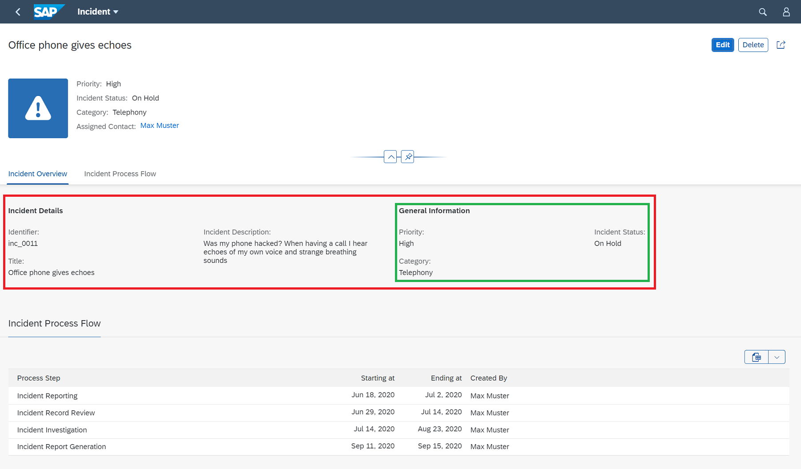
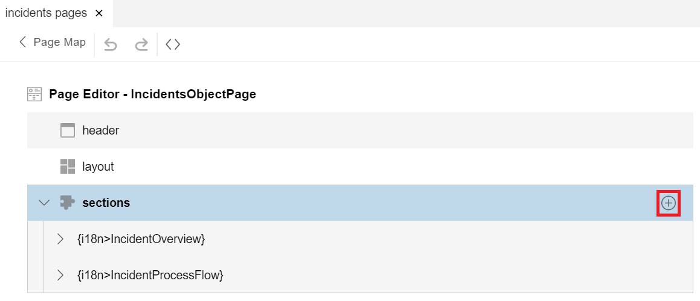
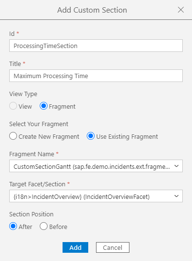
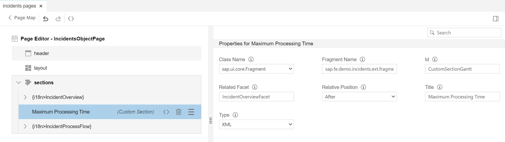
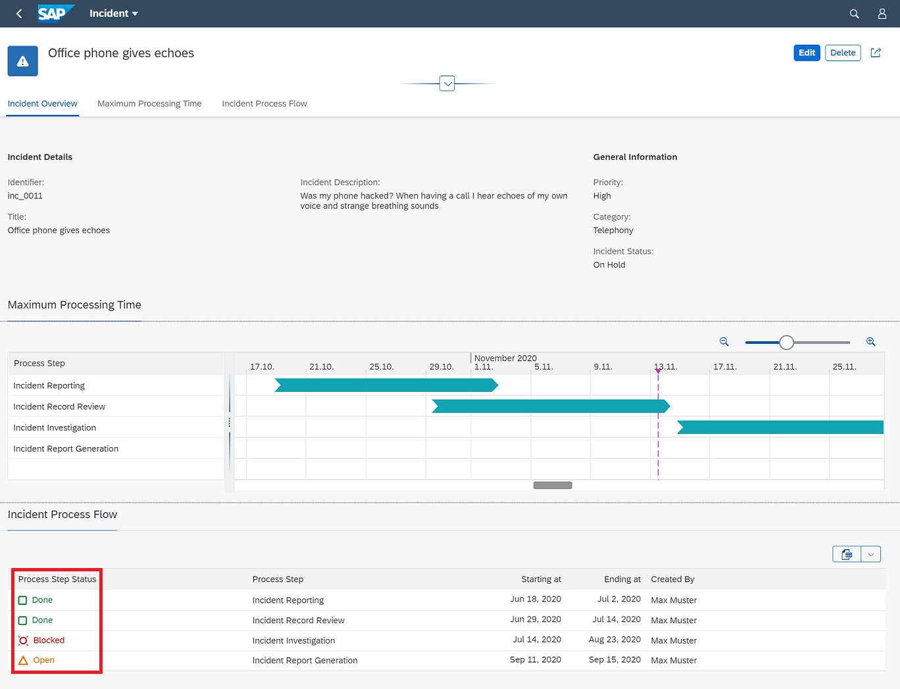

## Prerequisites
- You have prepared your development environment by completing the tutorial [Prepare your Development Environment](fiori-tools-cap-prepare-dev-env)
- You have generated the Incident Management application from the previous tutorial [Create an SAP Fiori elements application](fiori-tools-cap-create-application)

## Details
### You will learn
  - How to add additional fields to the field group of an object page
  - How to create a new field group within a section
  - How to add a custom section to the object page
  - How to add an additional column to an object page table
  - How to enable the flexible column layout


[ACCORDION-BEGIN [Step 1: ](Add additional field to a field group)]

1. Open the object page of your application by clicking one of the incidents within the list report table. You´ll see the field group **Incident Details** on the **Incident Overview** section.

    !

2. To add another field to the field group **Incident Details**, proceed as follows:

    Open the `annotations.cds` file located in the `app` folder of your service.

    !

    >There´s a second `annotations.cds` file below folder `app/incidents`. This file was created during the generation of the application and is not meant to be modified within this tutorial.

    Data fields shown on the object page are collected within field groups. The annotation to be used is called `FieldGroup`.

    Search for the field group with the qualifier `#IncidentDetails` and add the data field `description` to the field group:

    ```CDS
    FieldGroup #IncidentDetails : {
        $Type : 'UI.FieldGroupType',
        Data : [
            {
                $Type : 'UI.DataField',
                Value : identifier
            },
            {
                $Type : 'UI.DataField',
                Value : title
            },
            //insert your field group enhancement here
            {
                $Type : 'UI.DataField',
                Value : description
            }
        ]
    },
    ```

3. After saving the file and refreshing the application, you´ll see the additional field **Incident Description** within the field group **Incident Details**.

    !


[VALIDATE_1]
[ACCORDION-END]

[ACCORDION-BEGIN [Step 2: ](Add new field group to a section)]

In the previous step, you added a new field to an existing field group. Now you will add a new field group to the section **Incident Overview**. Code completion will support you to easily enter the correct syntax.

1. In the opened annotations file `annotations.cds`, place the cursor just behind the existing group `#IncidentDetails` and trigger the code completion support by pressing **`CTRL + Space`**.

    Type in **`Field`** to filter the list of options and choose `FieldGroup`.

    !

    The annotation is added along with its basic structural elements. The cursor is placed between `Fieldgroup` and the colon.

    ```CDS
    //insert your new field group here
    FieldGroup  : {
        $Type : 'UI.FieldGroupType',

    },
    ```

2. Type **`#GeneralInformation`** to add a qualifier and press the **`Tab`** key to move the cursor inside the curly brackets.

    Again press **`CTRL + Space`** and select the property `Data`. The property is added and the cursor is moved inside the collection represented by the square brackets.

    ```CDS
    //insert your new field group here
    FieldGroup #GeneralInformation : {
        $Type : 'UI.FieldGroupType',
        Data : [

        ],
    },
    ```

3. Again press **`CTRL + Space`** and select `Record "DataField"` from the dropdown.

    A data field  record is added along with its required value. The cursor is placed inside the record's curly brackets. Enter the property `priority_code`.

    ```CDS
    //insert your new field group here
    FieldGroup #GeneralInformation : {
        $Type : 'UI.FieldGroupType',
        Data : [
            {
                $Type : 'UI.DataField',
                Value : priority_code,
            },
        ],
    },
    ```

4. Apply the same process to add the fields `category_code` and `incidentStatus_code`.

    ```CDS
    //insert your new field group here
    FieldGroup #GeneralInformation : {
        $Type : 'UI.FieldGroupType',
        Data : [
            {
                $Type : 'UI.DataField',
                Value : priority_code,
            },
            {
                $Type : 'UI.DataField',
                Value : category_code,
            },
            {
                $Type : 'UI.DataField',
                Value : incidentStatus_code,
            },
        ],
    },
    ```

    The content of sections and field groups is defined within the facets annotation. To see your new field group in the section **Incident Overview**, you need to reference it in the facets definition.

5. In the annotations file, place the cursor below the comment

    *//insert your reference facet enhancement here*

    and press **`CTRL + Space`**. Choose `Record (full) "ReferenceFacet"`.

    >You can filter the list of values by simply typing a few characters, for example **`ref`**.

    The inserted structure that you see has the property-value pair `$Type : 'UI.ReferenceFacet'` and three other properties that you have to fill with content:

    ```CDS
    //insert your reference facet enhancement here
    {
        $Type : 'UI.ReferenceFacet',
        Target : '@UI.FieldGroup#GeneralInformation',
        Label : '{i18n>GeneralInformation}',
        ID : 'GeneralInformationFacet',
    },
    ```

    >The content of property `Label` adds a language-dependent label to the field group.

6. After saving the file and refreshing the application, you´ll see the additional field group **General Information** within the section **Incident Overview**.

    !

[VALIDATE_2]
[ACCORDION-END]


[ACCORDION-BEGIN [Step 3: ](Add custom section to the object page)]

If you need to extend your application beyond the refinements possible with annotations, the Flexible Programming Model allows you for instance to add a custom section containing your own specific content.

To simplify this exercise, you will find prepared content in the `ext` folder of the project. It contains files needed to implement the new section, for example UI fragments to show a Gantt chart, and controller files to ensure the correct initialization of the UI elements.

1. Move the existing folder `ext` located in `test-resources` to the `webapp` folder of the incidents application.

    !

2. Now open the page map. To do so, you can either:

    - Right-click your application folder and then select **Show Page Map**.
    - In the menu, select **View > Find Command > Show Page Map**.

    !

3. You now see the page structure of your application. On the object page entry, click the pencil button to configure the object page.

    !

    The internal structure of the object page is shown. In particular the existing sections are listed. Click the **+** button to add a custom section.

    !

4. In the **Add Custom Section** dialog, modify the content of the fields as outlined in the image below.

    Then click **Add** to create the custom section.

    !

    >The content of field **Fragment Name** represents one of the prepared artifacts located in the `ext` folder.

    Back in the page map you see the new custom section **Maximum Processing Time**. When you select the new section you will see its parameters on the right part of the UI.

    !

You have now finished the creation of the new custom section. Refresh your application and check the new section displayed on the object page.

!

[VALIDATE_3]
[ACCORDION-END]

[ACCORDION-BEGIN [Step 4: ](Add new column to Incident Process Flow table)]

Now you are going to add a new column to the object page table **Incidents Process Flow** showing the criticality of the listed items.

As already explained in the previous tutorial [Refine the List Report with Additional Annotations](fiori-tools-cap-modify-list-report), the content of tables is defined by the `LineItem` annotation.

1. In the `annotations.cds` file, navigate to the `LineItem` annotation of the `IncidentFlow` entity and insert the `Record "DataField"` for the new column.

    Select property `Value` and choose `stepStatus`.

    !

2. Add the property `Criticality` and select `criticality` as content of the property.

    ```CDS
    annotate service.IncidentFlow with @(UI : {
        LineItem : [
          //insert your column enhancement here
          {
              $Type : 'UI.DataField',
              Value : stepStatus,
              Criticality : criticality,
          },
    ```

3. Save the annotations file, refresh the application and you will see the new column added to the object page table.

    !

At this point, your list report object page application is complete.

[DONE]
[ACCORDION-END]

[ACCORDION-BEGIN [Step 5: ](Enable the flexible column layout)]

The flexible column layout allows you to have the list report and the object page open at the same time without the need to switch the UI when changing the selection of items in the list report.

1. Right-click the `webapp` folder and select **Show Page Map**.

    In the **Global Page Settings** select the **Flexible Column Layout** and choose the **Mid-Expanded** option for the two column layout.

    !

    Click **Apply**.

2. Refresh the application. Click on one of the items in the list report to open the object page.

    !

    The list report and object page are now shown in a two column layout.
    When you click on a different row in the list report the object page will update accordingly.

    !

[VALIDATE_4]

[ACCORDION-END]

---

Over the past four tutorials, you have used the SAP Cloud Platform, SAP Fiori tools and SAP Fiori elements to build this application. You have learned how to:

- Set up your development environment using SAP Cloud Platform

- Use the wizard-style approach of SAP Fiori tools to generate an application based on an existing service and SAP Fiori elements UI templates

- Refine the user interface using annotations

- Extend the user interface by applying the custom section concept of the Flexible Programming Model

All of these tools (and more) can be used with any of the available SAP Fiori elements page types. Enjoy your future projects!

---
