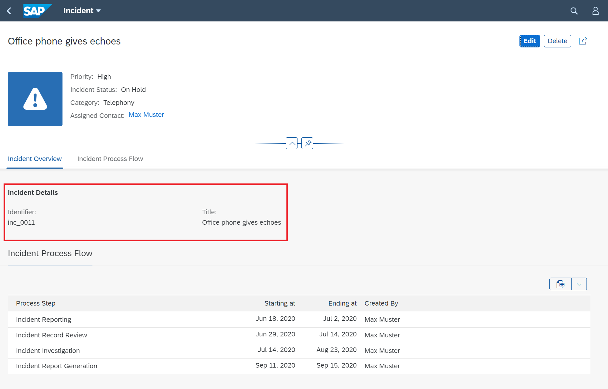
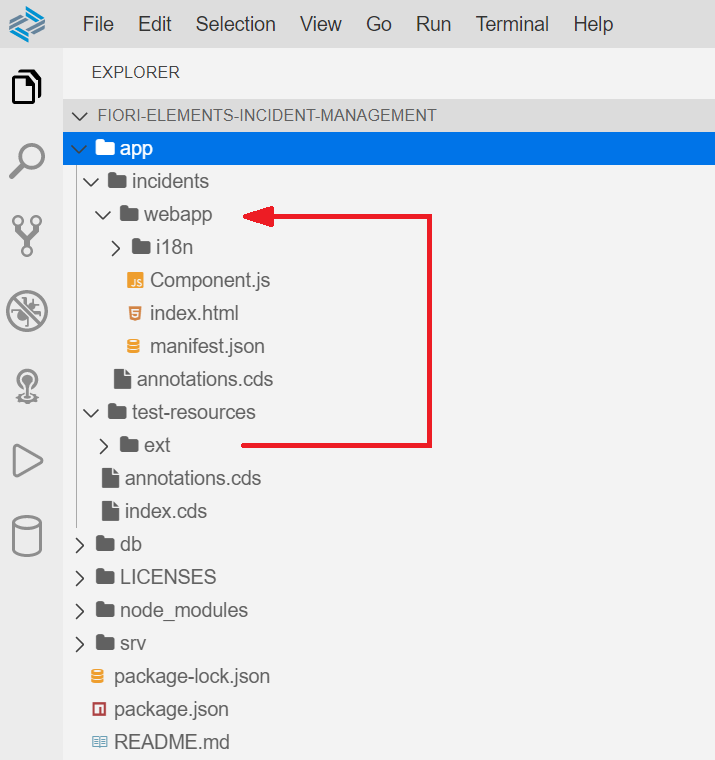
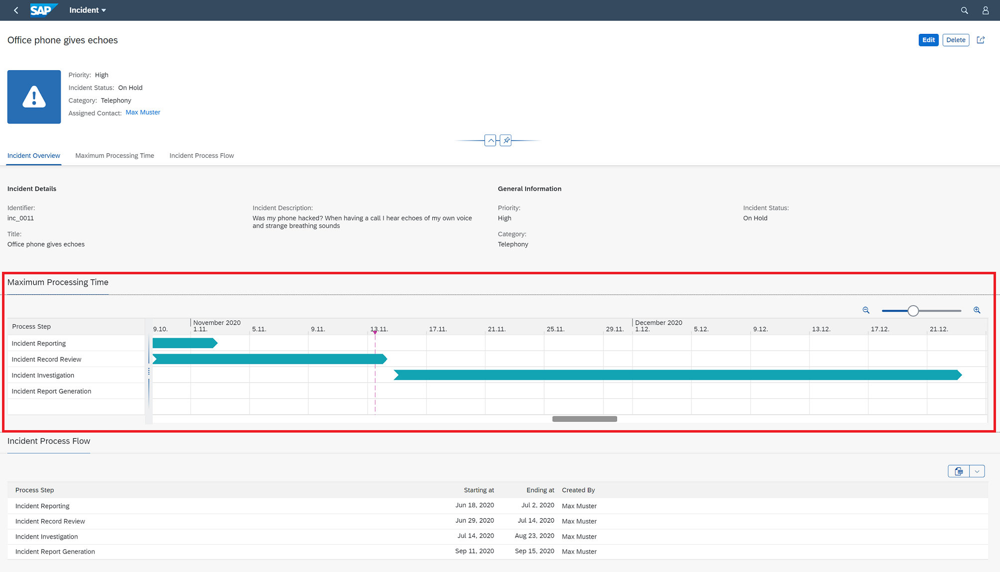
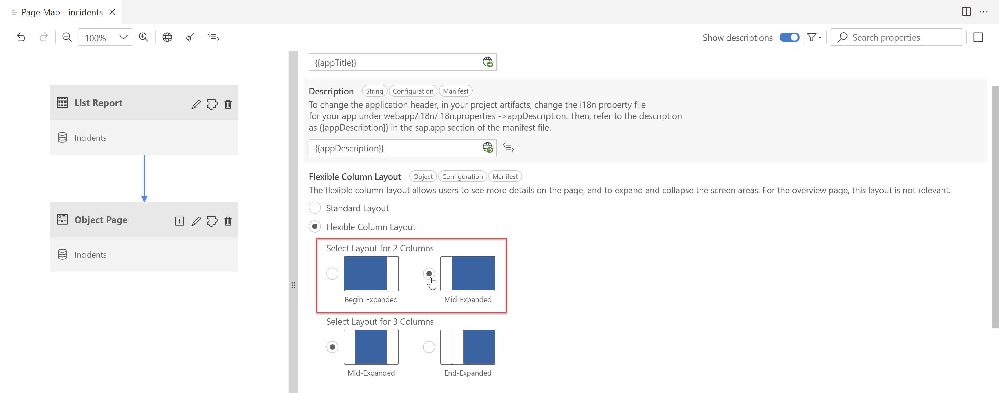
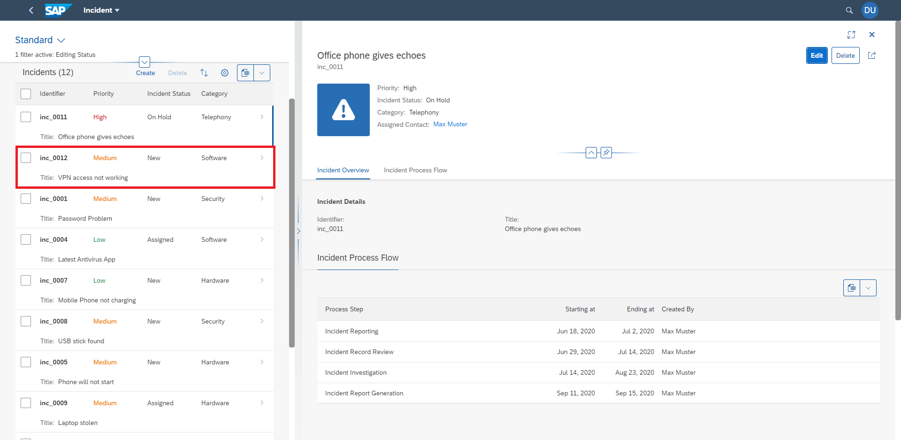

# Extend the Object Page by Adding More Functionality
<!-- description --> Refine the object page by adding new fields and extend it with a new section leveraging the Flexible Programming Model.

## You will learn
  - How to add additional fields to the field group of an object page
  - How to create a new field group within a section
  - How to add a custom section to the object page
  - How to add an additional column to an object page table
  - How to enable the flexible column layout

## Prerequisites
- You have prepared your development environment by completing the tutorial [Prepare your Development Environment](fiori-tools-cap-prepare-dev-env)
- You have generated the Incident Management application from the previous tutorial [Create an SAP Fiori elements application](fiori-tools-cap-create-application)

### Add additional field to a field group

1. Open the object page of your application by clicking one of the incidents within the list report table. You´ll see the field group **Incident Details** on the **Incident Overview** section.

    <!-- border -->

2. Open the Page Editor for the object page of your app: from the Application Information page, click on **ObjectPage** within Pages.

    <!-- border -->

    The Page Editor view opens up listing all the major page elements in the application outline structure.

3. Expand the nodes **Sections->Incident Overview->Subsections->Incident Details->Form**, press the **+** icon in the **Fields** sub-node and choose **Add Basic Fields**.
    
    <!-- border -->

4. When prompted, choose **description** in **Fields** and press **Add**. 

    <!-- border -->
    
5. Application preview automatically refreshes (if started) to show the additional field **Incident Description** within the field group **Incident Details**.

    <!-- border -->

### Add new field group to a section

In the previous step, you added a new field to an existing field group. Now you will add a new field group to the section **Incident Overview**. 

1. In Page editor, expand the nodes **Sections->Incident Overview** if not already expanded, press the **+** icon in the **Subsections** sub-node and choose **Add Form Section**. 

    <!-- border -->

2. When prompted, type **General Information** in the **Label** field and press **Add**. 

    <!-- border -->

    General Information section is visible in the outline.

3. Expand the nodes **General Information->Form**, press **+** icon in the **Fields** node and choose **Add Basic Fields**. 

    <!-- border -->

4. When prompted, choose **priority_code**, **category_code** and **incidentStatus_code** as **Fields** and press **Add**.

    <!-- border -->

    Application preview refreshes and shows the additional field group **General Information** within the section **Incident Overview**.
    <!-- border -->

### Add custom section to the object page

If you need to extend your application beyond the refinements possible with annotations, the flexible programming model allows you for instance to add a custom section containing your own specific content.

To simplify this exercise, you will find prepared content in the `ext` folder of the project. It contains files needed to implement the new section, for example UI fragments to show a Gantt chart, and controller files to ensure the correct initialization of the UI elements.

1. Using drag&drop move the existing folder `ext` located in `test-resources` to the `webapp` folder of the incidents application.

    <!-- border -->

2. In Page Editor, press the **+** icon in the **Sections** node and choose **Add Custom Section**.

    <!-- border -->

3. In the **Add Custom Section** dialog, modify the content of the fields as showed in the image below and press **Add**.

    <!-- border -->

    >The content of field **Fragment Name** represents one of the prepared artifacts located in the `ext` folder.

    In the Page Editor, you can now see the new custom section **Maximum Processing Time**. When you select the new section you will see its parameters on the right part of the UI.

    <!-- border -->

    You have now finished the creation of the new custom section. Once the application preview is refreshed, check the new section displayed on the object page.
    
    <!-- border -->

### Add new column to Incident Process Flow table

Now you are going to add a new column to the object page table **Incidents Process Flow** showing the criticality of the listed items.

1. In Page editor, expand the nodes **Sections->Incident Process Flow->Table**, press the **+** icon in the **Columns** sub-node and choose **Add Basic Columns**. 

    <!-- border -->

2. When prompted, choose **stepStatus** in the **Columns** field and press **Add**. 

    <!-- border -->

    **Process Step Status** column is added at the bottom of the columns list section in the outline.

3. Drag the newly added column to the top of the columns list and drop it there.

    <!-- border -->

4. Choose the **Process Step Status** column to display its properties in the Properties pane to the right of the outline. In the **Criticality** field, change the value to **criticality**.

    <!-- border -->
   
    Once the application preview is refreshed, the new column added to the object page table.
 
    <!-- border -->

### Enable the flexible column layout

The flexible column layout allows you to have the list report and the object page open at the same time without the need to switch the UI when changing the selection of items in the list report.

1. Right-click the `webapp` folder and select **Show Page Map**.

    In the **Property Panel** select the **Flexible Column Layout** and choose the `Mid-Expanded` option for the two column layout.
    
    <!-- border -->

2. In the application preview, the list report and object page are now shown in a two column layout.
    When you click on a different row in the list report the object page will update accordingly.
    <!-- border -->

### Summary

At this point, your list report object page application is complete. 

> To prepare your app for translation, you can generate the translation keys for all the language dependent fields in your app. For that, choose the globe button at the top of the screen  and, once prompted, press **Create**. 

<!-- border -->

Over the past four tutorials, you have used the SAP Cloud Platform, SAP Fiori tools and SAP Fiori elements to build this application. You have learned how to:

- Set up your development environment using SAP Cloud Platform

- Use the wizard-style approach of SAP Fiori tools to generate an application based on an existing service and SAP Fiori elements UI templates

- Refine the user interface using Page Editor

- Extend the user interface by applying the custom section concept of the Flexible Programming Model

All of these tools (and more) can be used with any of the available SAP Fiori elements page types. Enjoy your future projects!

