## Prerequisites
- You need a trial account on SAP Cloud Platform. If you don't have one, follow the instructions in: [Get a Free Trial Account on SAP Cloud Platform](hcp-create-trial-account).
- Ensure that you have started SAP Business Application Studio in your SAP Cloud Platform trial account. For detailed instructions: [Set Up SAP Business Application Studio for Development](appstudio-onboarding).

## Details
### You will learn
- How to set up SAP Business Application Studio for SAP Fiori elements application development
- How to create a project containing the service needed for generating your sample application

For more information about the SAP Cloud Application Programming Model, refer to the documentation pages of [SAP Cloud Application Programming Model](https://cap.cloud.sap/docs/about/).

---

[ACCORDION-BEGIN [Step 1: ](Create development space)]

1. On the SAP Business Application Studio start page, click **Create Dev Space**.

    !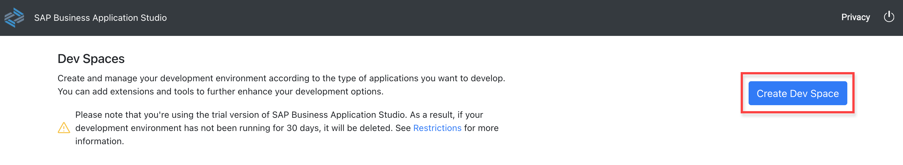

2. On the following page, enter a name for your new development space and choose the application type **SAP Cloud Business Application** from the list.

    Click **Create Dev Space**.

    !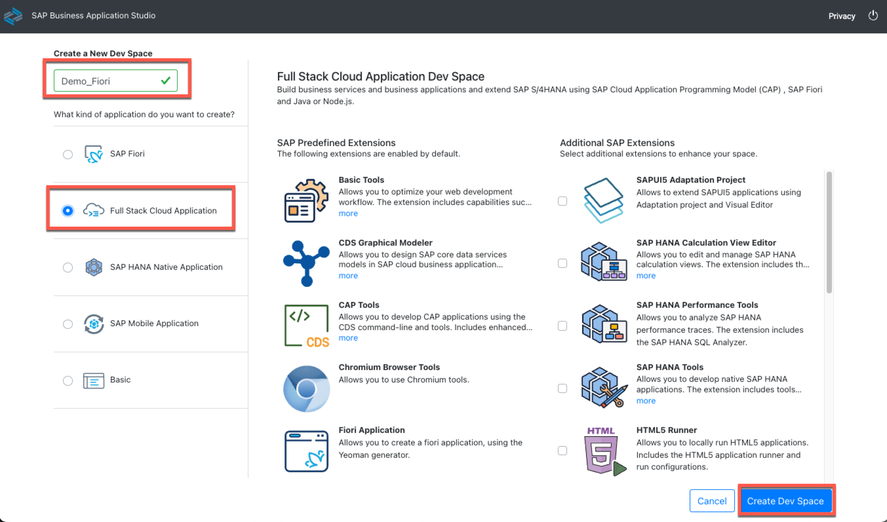

    Your development space is now ready to use. Wait until the status has changed from **STARTING** to **RUNNING**. After the initial creation this is done automatically.

    !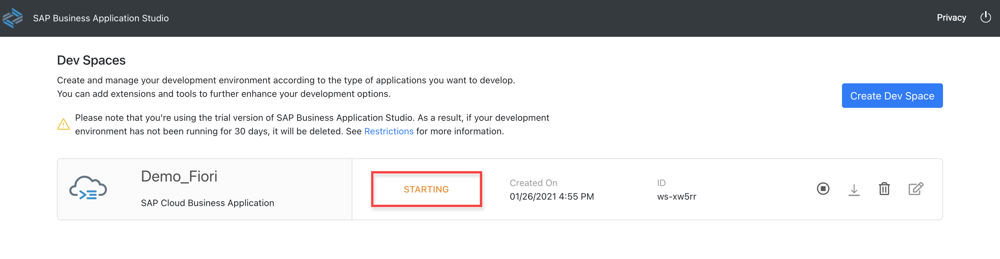

    >In case your development space was stopped, you can restart it by clicking the start button (for example after a longer idle time).

3. Open the development space by clicking on its name.

    !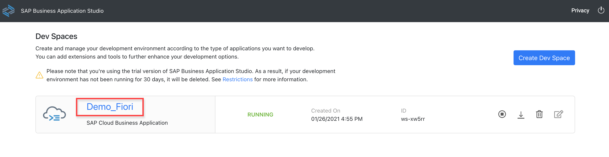

[DONE]
[ACCORDION-END]

&nbsp;

[ACCORDION-BEGIN [Step 2: ](Clone the demo service)]

Once you are in the development space, you will see a **Welcome** page from which you can create the application project.

1. Copy the following GitHub repository URL into your clipboard:

    ```URL
    https://github.com/SAP-samples/fiori-elements-incident-management.git
    ```

2. Click the link **Clone from Git**.

    !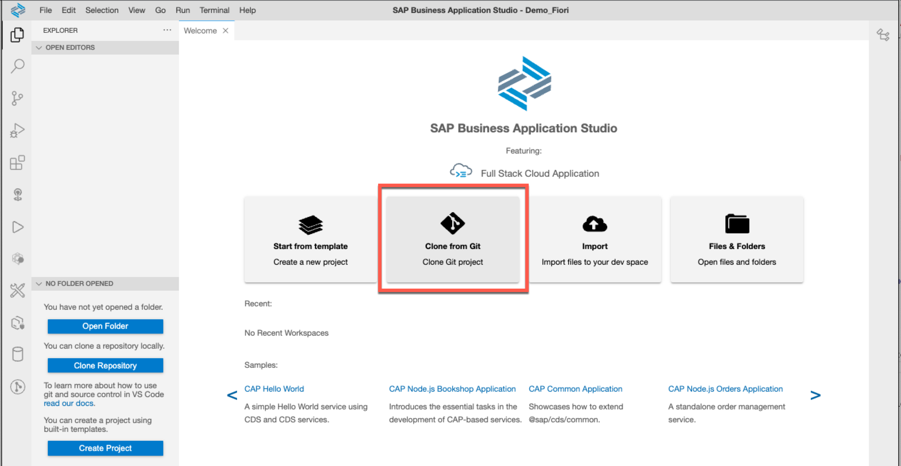

    Paste the repository link into the input field and press **Enter**.

    !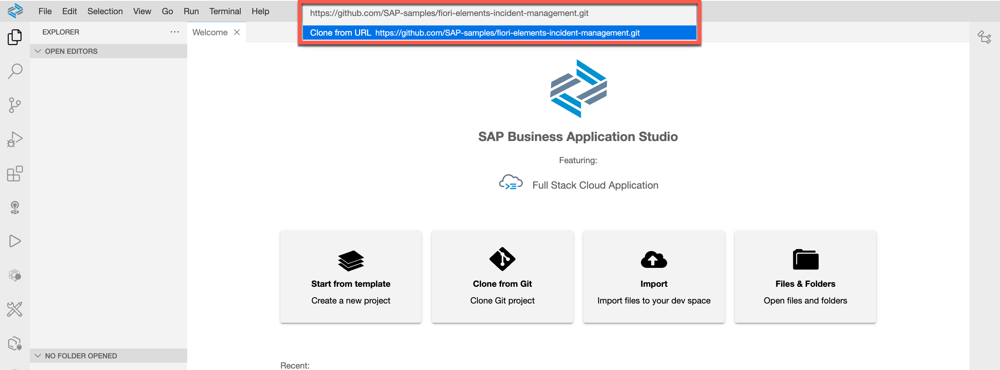

3. Wait until the cloning has finished, then click **Open Workspace** in the explorer panel.

    !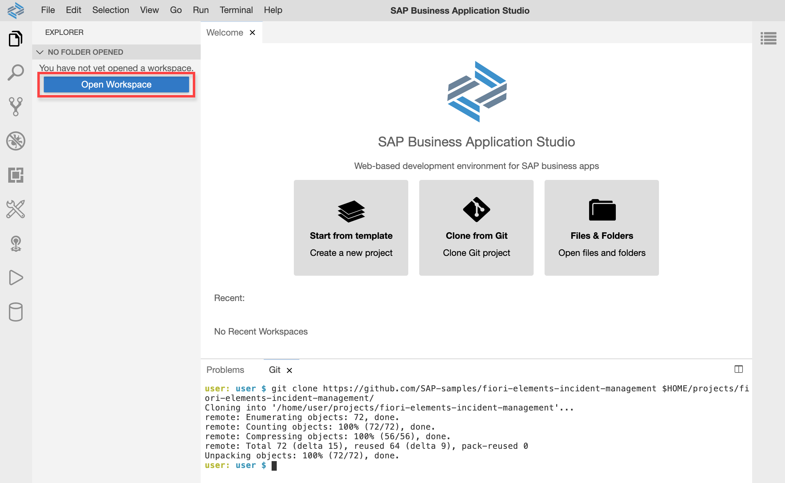

    Select the project in the popup dialog and click on **Open**.

    !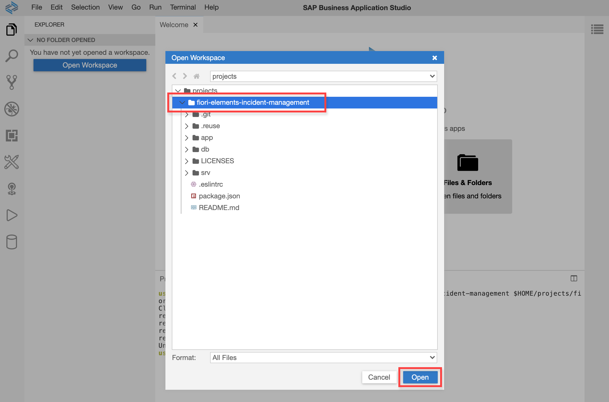

    You see your project in the explorer panel as shown in the image below:

    !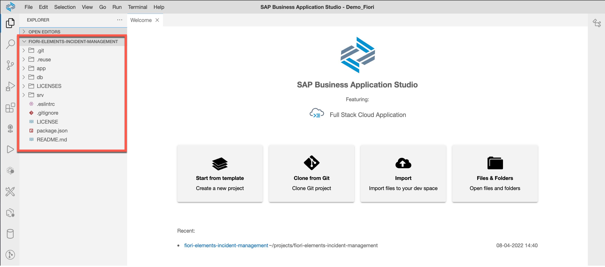

[DONE]
[ACCORDION-END]

[ACCORDION-BEGIN [Step 3: ](Complete the service)]

1. Open a new terminal in your SAP Business Application Studio.

    !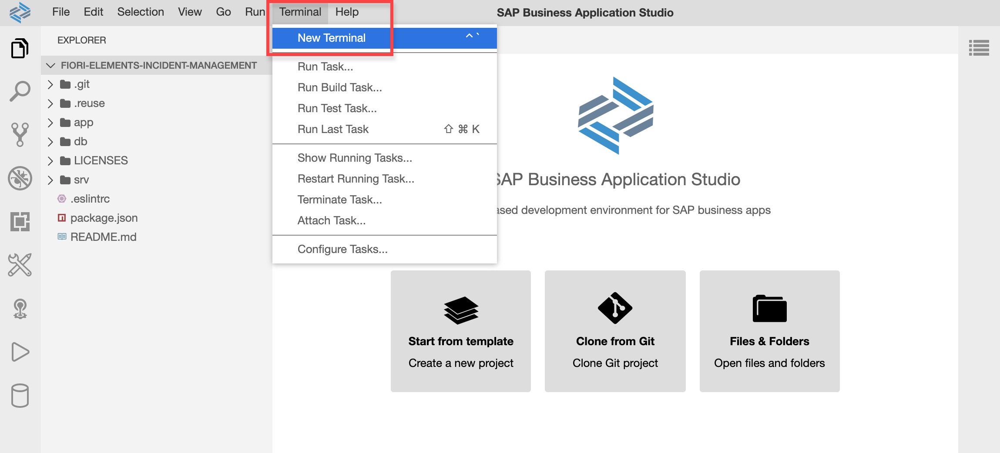

    Ensure that your terminal prompt shows **fiori-elements-incident-management**. At the terminal prompt, enter **`npm install `** and press **Enter**. This command will download and install all necessary modules from the npm package repository required to run the SAP Fiori elements application.

    !

2. After the installation is complete, enter **`npm i @sap/cds-dk -g`** at the terminal prompt.

    This will start the command line client and development toolkit for the SAP Cloud Application Programming Model. You will need this client to run your SAP Fiori elements application in the tutorial [Generate a Fiori elements application](fiori-tools-cap-create-application). For more information about the command line client, refer to the documentation pages of [SAP Cloud Application Programming Model](https://cap.cloud.sap/docs/get-started/).

    !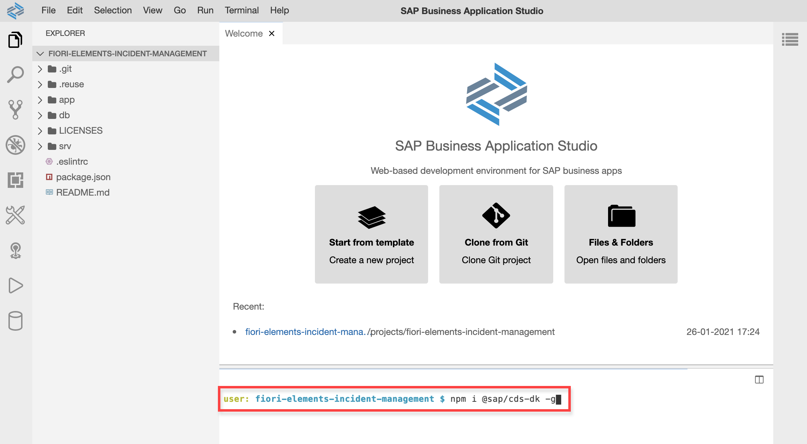

Your development environment is now ready.

In the next tutorial, you will create an SAP Fiori elements application and run it inside the SAP Business Application Studio.

<!---
Comment needed for md update. Can be deleted next time
-->

[DONE]
[ACCORDION-END]

[ACCORDION-BEGIN [Step 4: ](Test yourself)]

[VALIDATE_1]
[ACCORDION-END]
