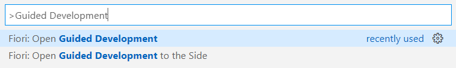
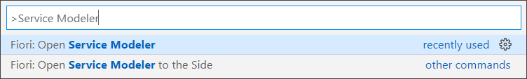
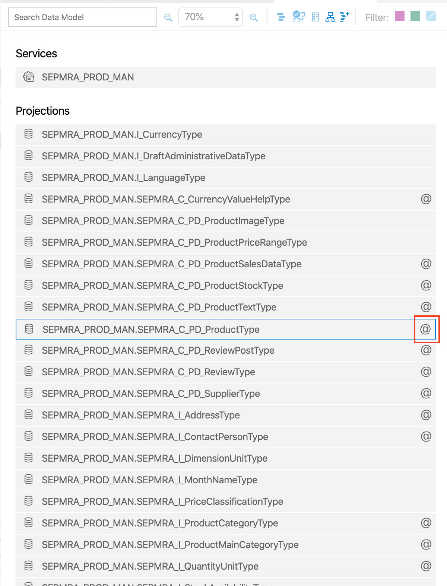
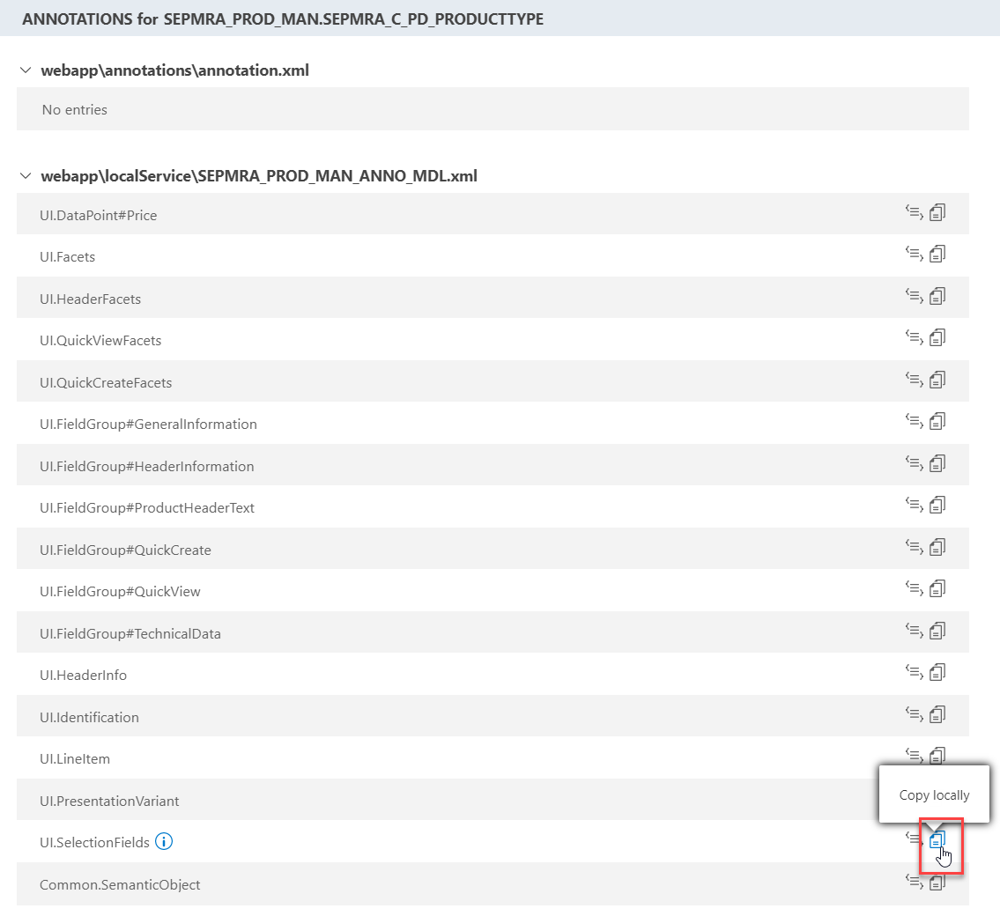
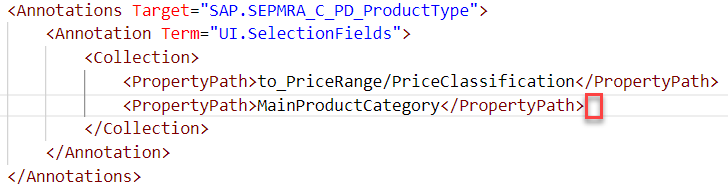
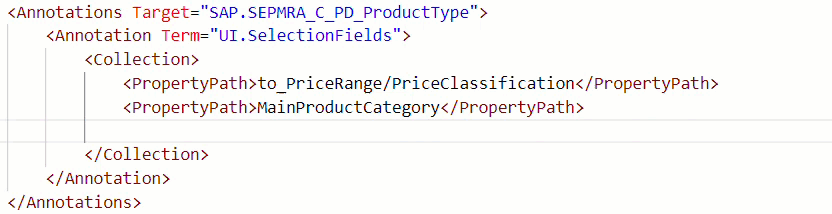

## Prerequisites
 - You should have a preview of your app running with either real or mock data from previous tutorial [Set Up and Generate a new SAP Fiori App Project](fiori-tools-generate-project).

## Details
### You will learn
- How to use Guided Development in SAP Fiori tools to add functionality
- How to use the Service Modeler to visualize OData services and the associated annotations in your apps
- How to use XML Annotation Language Server to define annotations in the code editor

---

[ACCORDION-BEGIN [Step 1: ](Enable multiple selection in table)]

When developing an application, you may know that end users require certain functionality but not be sure how to implement it. The **Guided Development** extension provides access to how-to guides and tutorials that can help you add a feature to your SAP Fiori elements application.

You can read through the steps required to implement a feature and then either apply the generated code to make the changes to the project or copy the code snippet to your clipboard and make the changes yourself. To begin this tutorial, you will implement multiple selection for the table so that your end users can select multiple rows in the list at once.

1. To begin, open the Command Palette using **CMD/CTRL + Shift + P** and type: **`Guided Development`**. Select **Fiori: Open Guided Development**.

    !

    If this is your first project, you should now see **Guided Development** with a list of guides grouped together by the page type. If you have other projects available in Visual Studio Code, select your tutorial project to access Guided Development.

2. Using the search box at the top right of the screen, type **`multi`** and expand **List Report Page | Enable multiple selection in tables**, and then click the guide title to expand the guide.

    !

    To understand what the feature does, you can read the description. To implement this functionality, you are going to use the code snippet generated by Guided Development. Press **Start** to begin using the guide.
    > The **Start** button is only enabled in in Wizard Mode. If Wizard Mode is disabled (via the Settings button), you can simply scroll down to see the rest of the guide content.

3. To generate the code snippet, ensure that `ListReport_SEPMRA_C_PD_Product` is selected and click **Insert Snippet**.

    Guided Development will go to the respective page configuration file and apply the changes.

4. The `ListReport_SEPMRA_C_PD_product.json` will open to the side, with the new code inserted and highlighted. Save the file and close both tabs.

The app preview will refresh and display the multi-select boxes.

[DONE]
[ACCORDION-END]

[ACCORDION-BEGIN [Step 2: ](Copy backend annotation visually to local annotation file)]

This app features a target entity type that has already been pre-configured with the `UI.SelectionFields` annotation term. This is what provides the filters above the list in your app preview. This next step involves adding a new filter for **Supplier**, using the **Service Modeler** in SAP Fiori tools to copy the already existing backend annotation term and add a new field.

The Service Modeler is a graphical tool that provides a visualization of an OData service, including its backend and local annotations. The Service Modeler helps you easily find entities or projections and their associated annotations.

1. To access the Service Modeler, launch the Visual Studio Code Command Palette by pressing **`CMD/Ctrl + Shift + P`** and then typing **`Service Modeler`**. Select **Fiori: Open Service Modeler**.

>If you have more than one project in your workspace, you will have to select the project you have created for this tutorial.

The **Service Modeler** will open in a list view mode, listing all the projections (e.g., entity types) present in the underlying OData service. Some entries feature an `@` icon, which signifies that there are annotations attached to those targets.

2. For the projection **`SEPMRA_PROD_MAN.SEPMRA_C_PD_ProductType`**, click on the `@` icon to view all the annotations for **`SEPMRA_PROD_MAN.SEPMRA_C_PD_ProductType`**.

    !

    This opens **Annotation List View**, where you can see that for `target SEPMRA_PROD_MAN.SEPMRA_C_PD_ProductType`, all the annotation terms come from sources such as the local annotation file `annotation.xml`, the backend annotation file `SEPMRA_PROD_MAN_ANNO_MDL.xml`, and `metadata.xml`. Since the requirement is to add a new filter, you have to modify **`UI.SelectionFields`**.

3. Copy **`UI.SelectionFields`** from the backend `SEPMRA_PROD_MAN_ANNO_MDL.xml` source to the local `annotation.xml` source by clicking the **Copy** icon next to **`UI.SelectionFields`** under `SEPMRA_PROD_MAN_ANNO_MDL.xml`.

    !

    **`UI.SelectionFields`** under `SEPMRA_PROD_MAN_ANNO_MDL.xml` has now been formatted with a strike through, giving you a visual indication that **`UI.SelectionsFields`** at runtime will be picked up from the local annotation file.

    The local `annotation.xml` file will open in another tab, with the exact code to be changed highlighted.

4. Close the **Service Modeler** tab.

[DONE]
[ACCORDION-END]

[ACCORDION-BEGIN [Step 4: ](Edit UI.SelectionFields in code editor)]

With `UI.SelectionFields` in the local annotation file, you now need to edit it so that new filter of **Supplier** shows up in your SAP Fiori elements application. To do so, you will use the **XML Annotation Language Server**, which provides features that assist with defining annotations in the code editor.

The features used in this tutorial include:

- **Code Completion**, which provides a list of suggestions based on the project metadata and OData vocabularies;
- **Micro-Snippets**, which are generic snippets that add bigger blocks of code patterns, such as **Annotations** and **Annotation and Record**.

These features help you to quickly and consistently generate code for your projects.

1. To start, ensure that local annotation file `annotation.xml` is open. If its closed, navigate to **`myfioriapp(or your project name)->webapp->annotations->annotation.xml`** in the project explorer.

2. For the `SAP.SEPMRA_C_PD_ProductType` annotation term `UI.SelectionFields`, place your cursor after the line below and press **Enter**.

    !

3. In your new line, trigger the code completion by pressing **CMD/Ctrl + Space**, which displays a list of suggested values.

    Select **`<PropertyPath>`** and accept it by pressing **Enter** or clicking with your mouse. Your cursor will be between the tags `<PropertyPath>` and `</PropertyPath>`.

    Press **CMD/Ctrl + Space** again to see the next list of options (the properties of target `SEPMRA_C_PD_ProductType`). Your desired value is **`Supplier`**.

    Use the up/down arrows on your keyboard or your mouse to navigate to it in the list and then press **Enter** or select it with your mouse.

    !

4. Save your `annotation.xml` file and then check your running application. The new **Supplier** filter should now be in your app.

At this point, you should have a List Report Object Page with multi-select functionality, as well as the ability to filter by supplier.

Good job! In the next tutorial, you will configure the object pages that users can access from this list.

[VALIDATE_3]
[ACCORDION-END]
