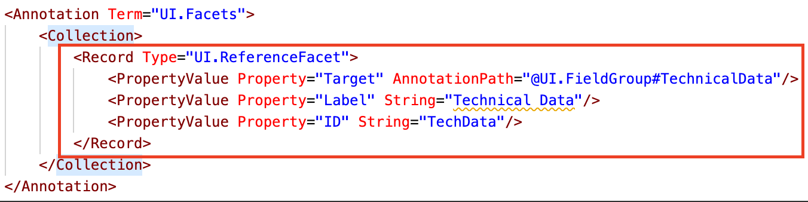
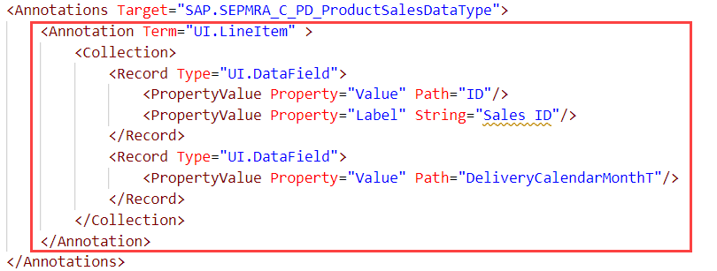
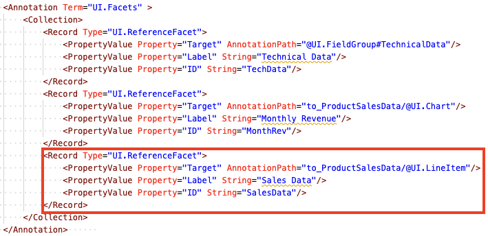
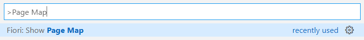

## Prerequisites
 - You should have a preview of your app running with either real or mock data. Your list report should be configured as instructed in [Configure a List Report Page using SAP Fiori Tools](fiori-tools-configure-lrop).

## Details
### You will learn
  - How to configure an object page using annotations
  - How to add a new object page to your project

Now that you have created a list report page featuring a list of items, your end users need to be able to drill down for more information on a single item.

In this tutorial, you are going to add a supplemental data to the object page that accompanies your list report. This way your users can learn more about an item in the list.

You are going to add a section of technical data, as well as a chart and a table. After that, you will add another object page so that your end-users can drill down for even more information pertaining to the sale of the item.

---

[ACCORDION-BEGIN [Step 1: ](Copy UI.FieldGroup from backend annotation source)]

To begin, you need to create a **`FieldGroup`** for the technical information that will be displayed on the first object page. To do this, you are going to use the **SAP Fiori tools Service Modeler** to see whether the backend developer has already added the annotation term **`UI.FieldGroup`** to the target so that it can be re-used for editing locally.

1. Launch the Visual Studio Code Command Palette by pressing **CMD/Ctrl + Shift + P**, typing **`Service Modeler`**, and then selecting **Fiori: Open Service Modeler** with your mouse or the **Enter** key once it appears.

    >If you have more than one project in your workspace, you will have to select the project you have created for this tutorial.

2. A list of projections will open in a new tab. Select the projection `SEPMRA_PROD_MAN.SEPMRA_C_PD_ProductType` and Click the `@` icon to view the annotations for this target.

3. Under the `SEPMRA_PROD_MAN_ANNO_MDL.xml` backend source, look for `UI.FieldGroup#TechnicalData`. This is the **`FieldGroup`** you need to add to your page.

    Click the **Copy** button next to it. You will notice a new entry has been created under `annotation.xml` and the entry under `SEPMRA_PROD_MAN_ANNO_MDL.xml` has been formatted with a strike through.

     A tab with your local annotation file will open. The annotation term `UI.FieldGroup#TechnicalData` will be copied inside it. It is currently missing the field **Dimensions Unit**. Since a measurement is not as helpful without a unit, you will add this new data field now.

4. Your local annotation file has been highlighted and features the copied `UI.FieldGroup#TechnicalData`. To add a new data field, create a new line after the following section.

    ```XML
    <Record Type="UI.DataField">
      <PropertyValue Property="Value" Path="Weight"/>
      <Annotation Term="UI.Importance" EnumMember="UI.ImportanceType/Medium"/>
    </Record>
    ```

    Use the Code Complete feature: Press **CMD/Ctrl + Space** and then choose **`<Record DataField>`**.
    Press **CMD/Ctrl + Space** again to choose **`Path`**.
    Lastly, for providing value for Path, press **CMD/Ctrl + Space** to select `DimensionUnit`.
    Your added code should look like below:

    ```XML
    <Record Type="UI.DataField">
      <PropertyValue Property="Value" Path="DimensionUnit"/>
    </Record>
    ```


[DONE]
[ACCORDION-END]

[ACCORDION-BEGIN [Step 2: ](Add section with UI.Facets to display technical data)]

Now that you have edited the **`FieldGroup`**, you need to reference it to display it in a section. To do so, you can use the **SAP Fiori tools - XML Annotation Language Server** to add the new annotation term `UI.Facets`.

1. In your local annotation file `annotation.xml`, for the target `SAP.SEPMRA_C_PD_ProductType`, insert a new line after the end of the `</Annotation>` tag of the annotation term `UI.SelectionFields`.

    !

    To accelerate the coding required here, use the Code Complete feature: Press **CMD/Ctrl + Space** and then choose **`UI.Facets`**.

    >**Hint:** After pressing **CMD/Ctrl + Space**, you can also search for your desired element, rather than scrolling through the entire list. For example, type **`Fac`** (as in, `UI.Facets`) and this will narrow down the list of items for you.

    !

2. At this point, you have inserted the `Annotation` tag and it already contains the `Collection` tag. Your cursor should be within `<Annotation Term="UI.Facets" >`. Press **Tab** to move your cursor under the `<Collection>` tag.

    !

    >**Hint:** Take advantage of this procedure: pressing **CMD/Ctrl + Space**, making your selection, and then using the **Tab** key. This can help minimize the time you spend adding/editing annotations in the code editor.

3. You need to refer to the `UI.FieldGroup#TechnicalData` that you copied from the backend in the previous step in the **`UI.Facet`** you have created here. To do that, you will create a new record type called **`UI.ReferenceFacet`**.

    Ensure your cursor is between the lines of the `<Collection>` and `</Collection>` tags. Press **CMD/Ctrl + Space** and then select **`Record (full) "ReferenceFacet"`**.

4. You need to assign the target of this **`ReferenceFacet`**. Press **CMD/Ctrl + Space** again and select **`@UI.FieldGroup#TechnicalData`**.

    Press **Tab** to jump to the **Property** label. Enter the string **`Technical Data`**.

    Press **Tab** again to jump to the **Property** id. Enter the string **`TechData`**.

    Your annotation file should look like the image below:

    !

5. Save `annotation.xml` and take a look at your running app. Select a row in the list to open the object page. You should see a new section in the object page showing the technical data of the selected product.

[DONE]
[ACCORDION-END]


[ACCORDION-BEGIN [Step 3: ](Add section to show monthly revenue of product)]

Next, you are going to add a chart to this object page to show users the monthly revenue of their selected product.

1. Within the code block of the annotation term `UI.Facets` for the target `SAP.SEPMRA_C_PD_ProductType`, find the end tag `</Record>` of `UI.ReferenceFacet` and hit **`Enter`**.

    You need to insert a new **`UI.ReferenceFacet`** to include the **`UI.Chart`** annotation term of `to_productSalesData`.

2. Just as you did in the previous step, use **CMD/Ctrl + Space** and select `<Record(full) : "ReferenceFacet:>`. Your cursor will be in the **`AnnotationPath`**.

    Use **CMD/Ctrl + Space** and select **`to_productSalesData`**, then enter **`/`** and select **`@UI.Chart`**.

    Press **Tab** to jump to the property label. Enter the string **`Monthly Revenue`**.

    Press **Tab** again to jump to the property id. Enter the string **`MonthRev`**.

    Your annotation file should look like the image below:

    !

3. Save the file `annotation.xml` and take a look at your running app. You should see a new section in the object page showing the monthly revenue chart of the product.

>If your current product does not show any data, refresh the page. If data is still not displayed, go back to the list report page and select a different product.


[DONE]
[ACCORDION-END]

[ACCORDION-BEGIN [Step 4: ](Add UI.LineItem to configure sales history table)]

Next, you are going to add a section to your object page that shows the sales history of an item. This step involves the setup in adding **`UI.LineItem`**. In the next step, you will add the **`UI.Facet`** that makes it visible.

1. Insert a new line after the end tag `</Annotations>` for the target `SAP.SEPMRA_C_PD_ProductType`. The line looks like so:

    ```XML
    <Annotations Target="SAP.SEPMRA_C_PD_ProductType">
        .....
    </Annotations>
    ```

2. Add a new `<Annotations>` tag for the target `SAP.SEPMRA_C_PD_ProductSalesDataType`. You can use **CMD/Ctrl + Space** and select `<Annotations>`.

    !

    >In the next step, you will refer to this **`UI.LineItem`** from the earlier created Facet for the current object page

3. Add the annotation term `UI.LineItem` using **CMD/Ctrl + Space**. Press **Tab** to move your cursor to the line below `<Collection>`. Then, using **CMD/Ctrl + Space** again, add a column to the table (`Record "DataField"`).

4. Press **CMD/Ctrl + Space** and add a **`Path`**. Enter an **`ID`** for this **`Path`**.

    Press **Enter** to move your cursor to the next line and use **CMD/Ctrl + Space** to add a **Label** property.

    Use **CMD/Ctrl + Space** again and select **String**. Enter **`Sales ID`** for the **String**.

5. Now you are going to add another column.

    Navigate to the line below the `</Record>` you just created. Again, use **CMD/Ctrl + Space** and select **`Record "DataField"`** and add one property -- **Value** (using **CMD/Ctrl + Space**). Assign the **Path** as **`DeliveryCalendarMonthT`**.

    !

6. Save the file `anootation.xml`.

[DONE]
[ACCORDION-END]

[ACCORDION-BEGIN [Step 5: ](Add section to show sales data of a product)]

Now you are going to add the actual section that displays the table of sales data to your object page. This will allow users to see instances of when their selected item has sold.

1. Within the code block of the annotation term `UI.Facets` of the target `SAP.SEPMRA_C_PD_ProductType`, find the end tag `</Record>` of type `UI.ReferenceFacet` and hit **Enter**.

    You need to insert a new **`UI.ReferenceFacet`** to include the `UI.LineItem` annotation term of `to_productSalesData` from the previous step.

2. In the new line, use **CMD/Ctrl + Space** and select `<Record(full) : "ReferenceFacet:>`. Your cursor will move to `AnnotationPath`. Use **CMD/Ctrl + Space** and select **`to_productSalesData`**, then enter **`/`** and select **`@UI.LineItem`**.

    Press **Tab** to go to the property label. Press **CMD/Ctrl + Space** and select **String**, then enter the string **`Sales Data`**.

    Press **Tab** to go to the property id. Press **CMD/Ctrl + Space** and select **String**, then enter the string **`SalesData`**.

    !

3. Save the file `annotation.xml` and check your running app. You should see a table with line items indicating when the selected item has sold.

>If your current product does not show any data, refresh the page. If data is still not displayed, go back to the list report page and select a different product.

[DONE]
[ACCORDION-END]

[ACCORDION-BEGIN [Step 6: ](Add a new Object Page)]

Next, you are going to create a second object page for your users that opens when an entry from the Sales Data list is clicked. To do this, you are going to use the **Page Map** . It provides a visual representation of an application's pages, navigations, and service entities that it uses. You can use it to add new navigations and pages, delete pages, and navigate to corresponding editing tools.

Like the other tools, you access it through the Command Palette.

1. Press **CMD/CTRL + Shift + P** and type **`Page Map`** and select **Fiori: Show Page Map**.

    !

    This opens the visual representation of your application pages. To add a new object page, click on the  **+** on the first object page.

    !

2. From the **Navigation** dropdown, select the `to_ProductSalesData (SEPMRA_C_PD_ProductSalesData)` entry and click **Add**.

Switch back to your running application. Once your app has refreshed, click on the arrow next to an entry in the **Sales Data** table, you will be taken a new object page.

[DONE]
[ACCORDION-END]

[ACCORDION-BEGIN [Step 7: ](Add header and section to show sales data details)]

In this final step, you are going to add a header and a new section to your second object page so that your users can continue to drill down and see more information about the sales data of their product.

This will be done by annotating `SAP.SEPMRA_C_PD_ProductSalesDataType` to populate the page. This is handled using the same tools featured in the previous steps and tutorials, so the code you need to populate page is included below to save time.

>If you would like to try it yourself, feel free to take advantage of the tools shown in the previous tutorials and compare your code to the snippet below.

In your local annotation file `annotation.xml`, for the target `SAP.SEPMRA_C_PD_ProductSalesDataType`, you have to add 3 new annotation terms after the `UI.LineItem` annotation term. Insert a new line after the following annotation term block:

```XML
<Annotation Term="UI.LineItem" >
       .......
   </Annotation>
```

Copy and paste the following code in the new line you inserted above.

```XML
<Annotation Term="UI.HeaderInfo" >
    <Record Type="UI.HeaderInfoType">
        <PropertyValue Property="TypeName" String="Sales Order" />
        <PropertyValue Property="TypeNamePlural" String="Sales Orders"/>
        <PropertyValue Property="Title">
            <Record Type="UI.DataField">
                <PropertyValue Property="Value" Path="ID"/>
            </Record>
        </PropertyValue>
    </Record>
</Annotation>
<Annotation Term="UI.FieldGroup" >
    <Record Type="UI.FieldGroupType">
        <PropertyValue Property="Data">
            <Collection>
                <Record Type="UI.DataField">
                    <PropertyValue Property="Value" Path="DeliveryCalendarDate"/>
                </Record>
                <Record Type="UI.DataField">
                    <PropertyValue Property="Value" Path="DeliveryCalendarMonth"/>
                </Record>
                <Record Type="UI.DataField">
                    <PropertyValue Property="Value" Path="DeliveryCalendarMonthT"/>
                </Record>
            </Collection>
        </PropertyValue>
    </Record>
</Annotation>
<Annotation Term="UI.Facets" >
    <Collection>
        <Record Type="UI.ReferenceFacet">
            <PropertyValue Property="Target" AnnotationPath="@UI.FieldGroup"/>
            <PropertyValue Property="Label" String="Sales Information"/>
        </Record>
    </Collection>
</Annotation>
```

Save your file `annotation.xml`.

Between the `<Schema>` and `</Schema>` tags, your code should look like the following snippet. Once you have checked that your code is the same, save and a take a look at your second object page. It should now feature a header with the Sales Data name and more information about the product's sale.

```XML
<Annotations Target="SAP.SEPMRA_C_PD_ProductType">
                <Annotation Term="UI.SelectionFields">
                    <Collection>
                        <PropertyPath>to_PriceRange/PriceClassification</PropertyPath>
                        <PropertyPath>to_ProductCategory/MainProductCategory</PropertyPath>
                        <PropertyPath>Supplier</PropertyPath>
                    </Collection>
                </Annotation>
                <Annotation Term="UI.FieldGroup" Qualifier="TechnicalData">
                    <Record>
                        <PropertyValue Property="Data">
                            <Collection>
                                <Record Type="UI.DataField">
                                    <PropertyValue Property="Value" Path="ProductBaseUnit"/>
                                    <Annotation Term="UI.Importance" EnumMember="UI.ImportanceType/High"/>
                                </Record>
                                <Record Type="UI.DataField">
                                    <PropertyValue Property="Value" Path="Height"/>
                                    <Annotation Term="UI.Importance" EnumMember="UI.ImportanceType/Medium"/>
                                </Record>
                                <Record Type="UI.DataField">
                                    <PropertyValue Property="Value" Path="Width"/>
                                    <Annotation Term="UI.Importance" EnumMember="UI.ImportanceType/Medium"/>
                                </Record>
                                <Record Type="UI.DataField">
                                    <PropertyValue Property="Value" Path="Depth"/>
                                    <Annotation Term="UI.Importance" EnumMember="UI.ImportanceType/Medium"/>
                                </Record>
                                <Record Type="UI.DataField">
                                    <PropertyValue Property="Value" Path="Weight"/>
                                    <Annotation Term="UI.Importance" EnumMember="UI.ImportanceType/Medium"/>
                                </Record>
                                <Record Type="UI.DataField">
                                    <PropertyValue Property="Value" Path="DimensionUnit"/>
                                </Record>
                            </Collection>
                        </PropertyValue>
                        <PropertyValue Property="Label" String="Technical Data"/>
                    </Record>
                </Annotation>
                <Annotation Term="UI.Facets" >
                    <Collection>
                        <Record Type="UI.ReferenceFacet">
                            <PropertyValue Property="Target" AnnotationPath="@UI.FieldGroup#TechnicalData"/>
                            <PropertyValue Property="Label" String="Technical Data"/>
                            <PropertyValue Property="ID" String="TechData"/>
                        </Record>
                        <Record Type="UI.ReferenceFacet">
                            <PropertyValue Property="Target" AnnotationPath="to_ProductSalesData/@UI.Chart"/>
                            <PropertyValue Property="Label" String="Monthly Revenue"/>
                            <PropertyValue Property="ID" String="MonthRev"/>
                        </Record>
                        <Record Type="UI.ReferenceFacet">
                            <PropertyValue Property="Target" AnnotationPath="to_ProductSalesData/@UI.LineItem"/>
                            <PropertyValue Property="Label" String="Sales Data"/>
                            <PropertyValue Property="ID" String="SalesData"/>
                        </Record>
                    </Collection>
                </Annotation>      
            </Annotations>
            <Annotations Target="SAP.SEPMRA_C_PD_ProductSalesDataType">
                <Annotation Term="UI.LineItem" >
                    <Collection>
                        <Record Type="UI.DataField">
                            <PropertyValue Property="Value" Path="ID"/>
                            <PropertyValue Property="Label" String="Sales ID"/>
                        </Record>
                        <Record Type="UI.DataField">
                            <PropertyValue Property="Value" Path="DeliveryCalendarMonthT"/>
                        </Record>
                    </Collection>
                </Annotation>
                <Annotation Term="UI.HeaderInfo" >
                    <Record Type="UI.HeaderInfoType">
                        <PropertyValue Property="TypeName" String="Sales Order" />
                        <PropertyValue Property="TypeNamePlural" String="Sales Orders"/>
                        <PropertyValue Property="Title">
                            <Record Type="UI.DataField">
                                <PropertyValue Property="Value" Path="ID"/>
                            </Record>
                        </PropertyValue>
                    </Record>
                </Annotation>
                <Annotation Term="UI.FieldGroup" >
                    <Record Type="UI.FieldGroupType">
                        <PropertyValue Property="Data">
                            <Collection>
                                <Record Type="UI.DataField">
                                    <PropertyValue Property="Value" Path="DeliveryCalendarDate"/>
                                </Record>
                                <Record Type="UI.DataField">
                                    <PropertyValue Property="Value" Path="DeliveryCalendarMonth"/>
                                </Record>
                                <Record Type="UI.DataField">
                                    <PropertyValue Property="Value" Path="DeliveryCalendarMonthT"/>
                                </Record>
                            </Collection>
                        </PropertyValue>
                    </Record>
                </Annotation>
                <Annotation Term="UI.Facets" >
                    <Collection>
                        <Record Type="UI.ReferenceFacet">
                            <PropertyValue Property="Target" AnnotationPath="@UI.FieldGroup"/>
                            <PropertyValue Property="Label" String="Sales Information"/>
                        </Record>
                    </Collection>
                </Annotation>
            </Annotations>
```

At this point, your List Report Object Page app is complete.

Congratulations! Over the past four tutorials, you have used SAP Fiori tools to simplify the development of this application. You've seen how:

- The **Application Generator** provides a wizard-style approach to generating projects based on SAP Fiori elements page types.

- **Guided Development** walks you through adding new features.

- **Service Modeler** enables you to visualize the backend service and its associated annotations.

- **XML Annotation Language Server** helps you add and edit local annotations in code editor directly.

- **Page Map** visualizes the structure of the pages in your app, as well as allows you easily create additional pages.

All of these tools can be used with any of the available SAP Fiori elements page types. Good luck with your future projects!

[VALIDATE_3]
[ACCORDION-END]
